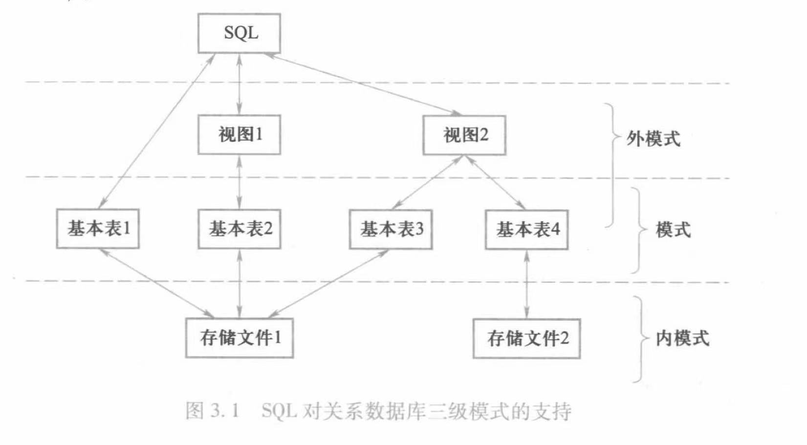
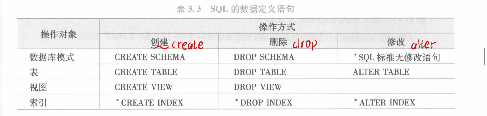
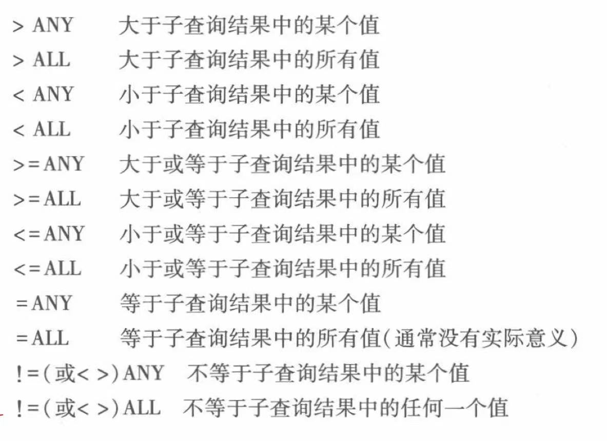
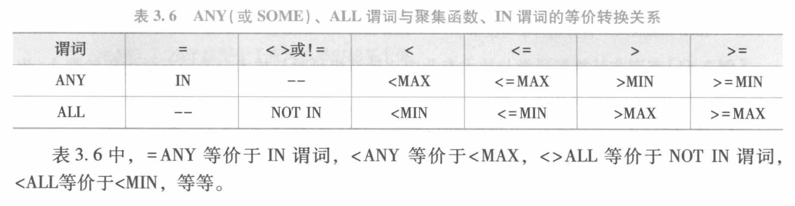

```text
                   d8b 
                   88P 
                  d88  
 .d888b,.d88b,.88P888  
 ?8b,   88P  `88P'?88  
   `?8b ?8b  d88   88b 
`?888P' `?888888    88b
            `?88       
              88b      
              ?8P      

```

# SQL概述


sql的基本概念

sql同样支持数据库系统的三级模式结构
- 其中外模式是用户能看见和使用的数据结构，对应试图和部分基本表；
- 模式对应基本表；
- 内模式对应存储文件。



- 基本表是本身独立存在的表
> 一个关系就对应一个基本表，一个基本表或多个基本表对应一个存储文件。

- 视图是从基本表或其他视图中导出的表。
> 它本身不独立存储在数据库中,即数据库中只存放视图的定义而不存放视图对应的数据。这些数据仍存放在导出视图的基本表，因此视图是一个虚表。

- 存储文件的逻辑结构和物理结构组成了关系数据库的内模式。
> 一个表可以带若干索引，索引也存放在存储文件中。


# 数据定义



> （对于没有提供修改语句的对象，只能先将他删掉再重建）


## 模式

定义模式实际上定义了**命名空间**，在这个命名空间中可以进一步定义该模式包含的数据库对象，如基本表、视图、索引等。

### 定义模式

1. 普通定义模式

```sql
create schema [<模式名>] authorization <用户名>;
-- 如果没有指定<模式名>，那么<模式名>隐含为<用户名>
```

2. 同时定义模式

```sql
create schema <模式名> authorization <用户名>
    [<表定义子句>|<视图定义子句>|<授权定义子句>];
-- 创建模式的同时可以进一步创建基本表、视图、定义授权。
```

### 删除模式

```sql
drop schema <模式名> <cascade|restrict>
-- CASCADE:级联删除，删除模式的同时把该模式所有的数据库对象（视图，表等）全部删掉。
-- RESTRICT:限制删除，只有当该模式没有任何数据对象时才能执行删除语句
```

## 基本表


### 创建基本表

```sql
create table <表名> (
<列名> <数据类型> [列级完整性约束]
[,<列名> <数据类型> [列级完整性约束]]
...
[,<表级完整性约束>]
);
```


#### 数据类型

1. 选取数据类型的指标

- 取值范围
- 所需的运算
> int类型考虑是否需要进行算数运算

2. 数据类型

- char

| 数据类型 | 含义 |  
| --- | --- | 
| char(n) | 长度为n的定长字符串 | 
| varchar(n) | 最大长度为n的变长字符串 |  
| clob | 字符串大对象 |  
| blob | 二进制大对象 |  

- int 

| 数据类型 | 含义 |
| -------------- | --------------- |
| int | 整形（4字节） |
| smallint | 短整形（2字节） |
| bigint | 大整形（8字节） |


- float

| 数据类型 | 含义 |
| --- | --- |
| numeric(p,d) | 定点数，p.d |
| dec(p,d) | 同numeric类似，当数值精度不受p,d影响 |
| real | 取决于机器的单精度浮点数 |
| double precision | 取决于机器的双精度浮点数 |
| float(n) | 精度至少为n的浮点数 |

- bool

| 数据类型 | 含义 |
| -------------- | --------------- |
| boolean | 逻辑布尔量 |

- time 

| 数据类型   | 含义    |
|--------------- | --------------- |
| date    | YYYY-MM-DD    |
| time   | HH:MM:SS   |
| timestamp   | 时间戳类型   |
| interval   | 时间间隔类型   |


#### 完整性约束

建表的同时，通常定义与该表有关的完整性约束
- 这些约束被存入系统的数据字典中
- 当用户操作表中数据时，由关系数据库系统自动检查这些操作是否违背这些完整性约束。
- 当完整性约束设计表中的多个属性列时，则必须定义在表级上，否则既可以定义在列级上，也可以定义在表级上。
- 目前已知的完整性约束：
    - 列级：PRIMARY KEY(主键)，UNIQUE(取唯一值)
    - 表级：FOREIGN KEY(XXX) REFERENCES table(xxx);(外码)
PRIMARY KEY(XXX1,XXX2);(主码)


### 修改基本表

```sql
alter table <表名>
-- 对列的操作
[add [column] <新列名> <数据类型> [完整性约束]]
[drop [column] <列名> [cascade|restrict]]
[rename column <列名> to <新列名>]
[alter column <列名> type <数据类型>]
-- 对完整性约束的操作
[add <表级完整性约束>]
[drop constraint <完整性约束名> [cascade|restrict]]
```
> 不论基本表中原来是否已有数据，新增加的列一律为空值

### 删除基本表

```sql
drop table <表名> [cascade|restrict]
```

### 模式和表

- 每个基本表都属于一个模式，一个模式含有多个基本表
- 定义基本表时可用以下三种方法定义它所属的模式
    - 在表名中显示给出
    ```sql
    create table "模式名".表名(...);
    ```
    - 创建模式语句中同时创建表
    - 设置所属的模式
- 若没有指定模式，系统会根据搜索路径来确定该对象所属的模式


## 视图

视图是
- 关系数据库提供给用户多种角度观察数据库中数据的重要机制。
- 从一个或几个基本表（或视图）导出的表。他与基本表不同，是一个虚表。

- 数据库中只存放视图的定义，而不存放视图对应的数据，这些数据仍存放在原来的基本表中。
- 视图最终是定义在基本表上的，对视图的一切操作最终也要转换为对基本表的操作。


### 建立视图

```sql
create view <视图名>[(<列名1>[,<列名2>...])]
as <子查询>
[with check option]
```

- 子查询可以是任意的SELECT语句，可包含ORDER BY和GROUP BY子句和DISTINCT短语
- WITH CHECK OPTION表示对视图进行UPDATE,INSERT,DELETE操作时，要保证更新、插入或删除的行满足视图定义中的谓词条件（即子查询中的条件表达式）
- 组成视图的属性列名或者全部省略


### 视图类型

- 行列子集视图：若一个视图是从单个表中导出的，并且只是去掉了某些行或列，但保留了主码，则称这类视图为 行列子集视图。
- 带表达式的视图：由于视图中的数据并不实际存储，所以定义视图时可用根据应用的需要设置一些派生属性列。这些属性列由于在基本表中并不实际存在，所以也称为虚拟列。带虚拟列的视图称为 带表达式的视图。
- 分组视图：带有聚集函数和GROUP BY子句的查询来定义视图，这种视图称为 分组视图。
注意：当视图由子查询'SELECT *'建立起来的时候，视图和子查询中的FROM基本表一一对应，如果后续修改了子查询中FROM基本表，视图和FROM表的映像关系可能会被破坏，该视图便不能正常工作了。为此，最好在修改基本表前删除视图，然后重建这个视图。


### 删除视图

```sql
drop view <视图名> [cascade]
```
- 删除视图后，视图的定义将从字典中删除
- 如果该视图上还导出了其他视图，则采用级联删除
> 但是他们的定义没有从字典中删除，需要对这些视图显示的调用DROP VIEW 子视图名

### 视图操作

视图定义后，用户可用像对基本表一样的对视图采用SELECT查询语句了。

1. 查询过程：
- 首先进行有效性检查，检查查询中涉及的表、视图是否存在。
- 如果存在，则取出视图的定义，把定义中的子查询和用户的查询结合起来，转换成等价的对基本表的查询
- 然后执行修正了的查询。
> 这一转换过程称为视图消解。

2. 更新过程

更新视图是指通过视图来插入、删除和修改数据。  
由于视图是不实际存在的虚表，因此对视图的更新最终要转换为对基本表的更新。同样会进行视图消解。


##  索引

1. 作用

当表的数据量很大时，查询操作会比较耗时，建立索引是加快查询速度的有效手段。数据库索引类似于图书的目录，能快速定位到需要查询的内容


2. 类型

- 顺序索引: 针对指定属性值升序或降序存储的关系，在该索引上建立一个顺序索引文件，该文件由属性值和相应的元组值组成。
- B+树索引：将索引属性组织为B+树形式，其叶节点为属性值和相对应的元组指针。
- 哈希索引：建立若干个桶，将索引属性安装哈希函数值映射到相应桶中，桶中存放索引属性值和相应的指针。

3. 优缺点

- 索引虽然能加快数据库查询，但需要占用一定的存储空间
- 当基本表更新的时候，索引也要进行相应的维护。因此根据实际情况有选择的建立索引。


4. 索引的建立
```sql
create [unique][cluster] index <索引名>
on <表名> (<列名>[<次序>][,<列名>[<次序>]]...)
```
- 索引可以建立在该表的一列或多列上，次序可选`asc`升序或`desc`降序
- `unique`表示此索引的每一个索引值只对应唯一的数据记录 
- `cluster`表示建立的时聚簇索引
> 数据存储的顺序与索引的书序一致
> - 换句话说，表中的数据行按照聚簇索引的键进行物理排序
> - 每个表只能有一个聚簇索引，主键会被默认创建为聚簇索引。


5. 修改索引名字
```sql
alter index <旧索引名> rename to <新索引名>
```

6. 删除索引

```sql
drop index <索引名> on <表名>
```


## 数据字典

数据字典是关系数据库系统内部的一组系统表，记录了数据库中所有的定义信息
> 包括关系模式定义、视图定义、索引定义、完整性约束定义、各用户的操作权限、统计信息等

- 执行SQL语句的数据定义语句时，实际上就是把这些定义信息存入数据字典。
- 在进行查询处理和优化时，关系数据库管理系统根据字典中的信息执行处理算法和优化算法，因此数据字典是关系型数据库管理系统运行的重要依据。


# 数据查询

## select语句

```sql
select [all|distinct] <目标列表达式>[别名][,<目标列表达式>[别名]]
from <表名或视图名>[别名][,<表名或视图名>[别名]]...]...|<select 语句>[as]<别名>
[where <条件表达式>]
[group by <列名1>[having <条件表达式>]]
[order by <列名2> [asc|desc]]
[limit <行数1>[offset <行数2>]];
```

1. 语意
- 根据WHERE子句的表达式从FROM子句中指定的基本表、视图或派生表中找到满足条件的元组
- 再按SELECT语句中的目标列表达式中选出元组的属性值形成结果表。
[
- 如果有GROUP BY语句，则将结果按<列名1>的值进行分组，该属性相等的元组为一个组，通常在每组中作用聚集函数。如果带HAVING语句，则只有满足指定条件的组才会被输出。
- 如果由ORDER BY语句，则结果还要按<列名2>的值进行升序或降序排序。
- 如果有LIMIT子句，则限制SELECT语句查询结果的数量为<行数1>行，OFFSET语句为偏移量。
]


2. select语句
    1. `all/distinct`：两个并不相同的记录投影到指定列上后可能变长相同的行，可用`distinct`消除
    2. `<目标列表达式>`可以是
        - 算数表达式
        - 字符串常量：字符串常量会将那一列都设置为该字符串常量
        - 函数等

3. where语句
    1. 作用：查询满足指定条件的元组
    2. 查询条件

    | 查询条件   | 谓词    |
    |--------------- | --------------- |
    | 比较   | =,>,<,>=,<=,!=,<>,!>,!<,not+...   |
    | 确定范围   | between and,not between and   |
    | 确定集合   | in,not in    |
    | 字符匹配   | like,not like   |
    | 空值| is null,is not null|
    | 逻辑运算|and,or,not|
    >  字符匹配的通配符
    > - `%`：代表任意长度的字符串
    > - `_`：代表任意单个字符
    > > 如果`like`后的匹配串不含通配符，那么可用`=`代替`like`

    
4. order by语句

- ORDER BY子句能对查询结果按照一个或多个属性列的升序(ASC)或(DESC)排序，默认为升序。
> 对于NUILL，排序时候看作无穷大；

聚集函数：只能用于`select子句`和`group by子句中的having短语`

| 函数名   | 含义    |
|--------------- | --------------- |
| count(*)   | 统计元组个数   |
| count[distinc|all]<列名>   | 统计一列中值的个数   |
| sun([distinc|all]<列名>)   | 计算一列值的总和    |
| avg([distinc|all]<列名>)   | 计算一列值的平均值   |
| max([distinc|all]<列名>) | 求一列值中的最大值 |
| min([distinc|all]<列名>) | 求一列值中的最小值 |

- `distinc`：计算时指定列中的重复值只做一次处理
- 除了`coutn`函数，都会跳过对`null`的处理


5. gorup by子句

- 作用：
    - 将查询结果按某一列或多列的值分组，值相等的为一组
    > 如果是多列，则先按第一列的值分组， 再对每一组中的第二列值分组，以此类推。
	- 细化聚集函数的作用对象：对未分组的对象是整个表，分组后将作用于每一个组，即每一个组都有一个聚集函数值。

> 注：若结果集中有重复的列组值，则将其合并为一行输出。


## 查询类型

### 单表查询

仅涉及一个表的查询

### 连接查询

若一个查询同时涉及两个及以上的表，则称之为连接查询


连接查询的WHERE子句中用来连接两个表的条件成为连接条件或连接谓词

```sql
[<表名1>.]<列名1> <比较运算符> [<表名2>.]<列名2>

[<表名1>.]<列名1> between [<表名2>.]<列名2> and [<表名3>.]<列名3>
```

1. 等值查询和非等值查询

`<比较运算符>`若为`=`则是等值查询，否则为非等值查询

2. 自然连接查询

把结果表目标列重复的属性**去掉**的**等值连接**查询称为自然连接查询。

3. 复合条件查询

WHERE子句中有多个条件的连接查询，称为复合条件连接查询。

4. 自身连接查询

连接操作不仅可以在两个表中进行，也可以是一个表与其自身进行连接，此时称自身连接查询。
> 为了清楚可见，可在FROM语句中设置别名，把它们想象成为数据和结构完全一样的两个表。

5. 外连接查询

通常的连接查询中，只有满足条件的元组才能作为结果输出。我们有时想列出A表中每个元组的基本信息及其在B表中的情况，表A中数据在表B中不存在数据则为NULL，此时就需要外连接。

```sql
select <表名1.><>属性1>[,<表名2.><属性2>...]
from <表名1> left outer join <表名2> on (<条件表达式>)
```
左外连接列出FROM子句中左边表（<表名1>）所有的元组，附加右边（表名2>）表中的信息。右外连接相反。

6. 多表查询

- 两个以上的表进行连接查询则称为多表连接查询。
- 在进行多表查询的同时，通常先进行两个表的查询，再将结果于第三个表进行
- 连接查询。多个表连接的次序会影响执行效率。


### 嵌套查询

SQL中，一个`select-where`语句称为一个查询块，将一个查询块嵌套在另一个查询块或`having`短语的条件中的查询称为嵌套查询

> 子查询的SELECT语句中不能使用ORDER BY子句，该子句只是针对最终查询结果排序。

1. 带`in`谓词的子查询

2. 带`比较运算符`谓词的子查询

3. 带`any/some/all`谓词的子查询





> 用聚集函数实现的子查询比直接用`any/all`查询快

4. 带`exists`谓词的子查询

- 带有EXISTS谓词的子查询不返回任何数据，只产生bool值。
- 由于带EXISTS量词的相关子查询只关心子查询是否有返回值而不需要查具体值，因此其效率不一定低于相关子查询，有时是高效的方法。
- 可用存在量词EXISTS子句演算出全称量词和蕴涵逻辑运算。
	


### 集合查询

SELECT语句的查询结果是元组的集合，所以对多个SELECT语句的结果可用进行集合操作。
- UNION：并操作
- INTERSECT：交操作
- EXCEPT：差操作
> 参加集合操作的各查询结果的列数必须相同，对于的数据类型也必须相同。

### 基于派生表的查询

子查询不仅可用出现再WHERE子句中，还可以出现再FROM子句中，这时子查询生成的临时派生表称为主查询的查询对象。

例如
```sql
SELECT Sname
FROM Student,(SELECT Sno FROM SC WHERE Cno='81001') AS SCI
WHERE Student.Sno=SCI.Sno;
```
> 通过FROM子句生成派生表时，AS关键字可用省略，但是必须为派生表设置一个别名；派生表是一个中间结果表，查询完成后将被系统自动清除。


# 数据更新

## 插入

1. 插入一个元组

```SQL
insert into <表名>[(<属性1>[,<属性2>]...)]
values (<常量1>[,<常量2>...])
```
> - INTO子句总没有出现的属性列，新元组将在这些列上将取空值

2. 插入子查询结果

```sql
insert into <表名>[(<属性1>[,<属性2>...])]
select...where...
```


## 修改数据


```sql
update <表名> 
set <列名>=<表达式>[,<列名>=<表达式>...]
[where <条件>];
```

## 删除数据

```sql
delete from <表名>
[where <条件>];
```


# 空值null的处理


空值=“不知道”=“不存在=”无意义“的值。

1. 取空值的情况：
- 该属性应该有一个值，但目前还不知道它的具体值。
- 该属性不应该有值：缺考学生的成绩。
- 由于某种原因不便于填写：电话号码不想让别人知道。

2. 空值的判断：
- IS NULL
- IS NOT NULL

3. 空值约束
- 主码不能取null
- 对于UNIQUE约束的属性列，是可以取空值的。

4. 空值的运算
- 空值与另外一个值的算数运算的结果为空值；
- 空值与另外一个值的比较运算结果为UNKNOW;
> 有了空值后，逻辑运算的结果从二元扩展成了三元值逻辑。

