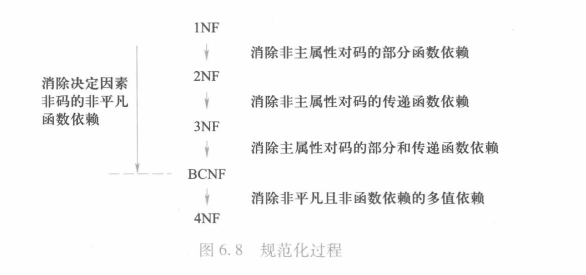

第六章、关系数据库理论

# 问题的提出

## 数据依赖

一个关系内部属性与属性之间的约束条件（现实世界属性间相互联系的约束关系）  

数据依赖的类型
- 函数依赖(Functional Dependency,FD)
    > 在关系r中，不可能存在两个元组在x上的属性值相等，而在y上的属性值不等，则称“x函数确定y”或“y函数依赖于x”,记作x->y
    - 平凡函数依赖与非平凡函数依赖
        > 如果 x -> y ,但 y ⊂ x ，则称 x -> y 是平凡的函数依赖   
        > 如果 x -> y ,但 y ⊄ x ，则称 x -> y 是非平凡的函数依赖 
    - 完全函数依赖与部分函数依赖
        > 如果 x -> y ,并且对于x的任何一个真子集x'，都有 x' !-> y ,则称y对x完全函数依赖   
        > 如果 x -> y ,但y不完全函数依赖于x,则称y对x部分函数依赖  
    - 传递函数依赖
        > 如果 x -> y , y -> z ,则称z对x传递函数依赖  
- 多值依赖(Multivalued Dependency,MVD)
    > x,y,z是U的子集，并且z=U-x-y。  
    > 给定 (x,z) 的值，有一组 y 的值，这组值仅仅决定与x而与z无关,此时存在多值依赖 x->->y
    - 平凡的多值依赖
        > 如果 x ->-> y ,但 y ⊂ x ，则称 x -> y 是平凡的函数依赖   
    - 非平凡的多值依赖

# 规范化

规范化理论是用来改造关系模式，通过**分解关系模式**来消除其中**不合适的数据依赖**，以解决插入异常、删除异常、更新异常和数据冗余等问题。

## 范式

范式是符合某一种级别的关系模式的集合

- 1NF
    - 如果一个关系模式R的所有属性都是不可分的基本数据项，则称R属于1NF  
    > 只有满足第一范式才能算关系数据库，但是满足第一范式的关系模式并不一定是个好的关系模式

- 2NF
    - 若R属于1NF,且每一个**非主属性完全函数依赖与码**,则R属于2NF  

- 3NF  
    - 每一个**非主属性既不部分依赖于码也不传递依赖于码**,则R属于3NF  

- BCNF 
    - 所有非主属性对每一个码都是完全函数依赖
    - 所有主属性对每一个不包含它的码，也是完全函数依赖
    - 没有任何属性完全函数依赖与非码的任何一组属性
    > 即每一个决定因素(x->y,x此时为决定因素)都包含码  

- 4NF
    - 对于 R 的每个非平凡多值依赖 x ->-> y , x 都含有码，则R属于4NF

    

# 数据依赖的公理体系

## Armstrong公理体系

设U为属性组全集，F是U上的一组函数依赖，于是有关系模式R(U,F)，存在  
- **A1自反律**：若 Y ⊆ X ⊆ U ，则 X -> Y 为 F 所蕴涵  
- **A2增广律**：若 X -> Y 为 F 所蕴含，且 Z ⊆ U ,则 XZ -> YZ 为 F 所蕴涵  
- **A3传递律**：若 X -> Y,Y -> Z 为 F 所蕴涵，那么 X -> Z 为 F 所蕴涵  

可由上得到以下推论  

- **合并规则**：由 X -> Y,X -> Z ,有 X -> YZ  
- **伪传递规则**：由 X -> Y,WY -> Z ，有 XW -> Z  
- **分解规则**：由 Z -> Y 和 Z ⊆ Y ,有 X -> Z

> 引理：X -> $A_1A_2A_3...A_k$成立的成分必要条件式X -> $A_i$成立(i=1,2,...,k)  

F的闭包：在关系模式R(U,F)中为F逻辑蕴涵的函数依赖的全体叫做F的闭包。  

$X_F^+$称为X关于函数依赖集F的闭包：设F为属性组U上的一组函数依赖，X为U的子集，X ⊆ U ，$X_F^+$={A|X->A能够由F根据Armstrong公理体系导出}

> 引理：X -> Y 能由 F根据 Armstrong公理体系导出的充分必要条件是 Y ⊆ $X_F^+$  
> 于是，判断X->Y只需求出$X_F^+$,判断Y是否是$X_F^+$得而子集即可

## 极小函数依赖集

- F中任一函数依赖的右部仅含有一个属性  
- F中不存在这样的函数依赖X->Y,使得F与F-{X->A}等价
- F中不存在这样的函数依赖X->Y,X有真子集Z使得F-{X-A}∪{Z-A}等价

## 候选码的确定

- 准则一：如果属性A只在F中各函数依赖的左端出现，则A必是码中的属性
- 准则二：如果属性A只在F中各函数依赖的右端出现，则A必不是码中的属性
- 准则三：如果属性A不在F中出现，则A必是码中的属性

步骤：
1. 求F的最小函数依赖集，仍用F表示 
2. 根据准则一和三，确定码中必须有的属性集M
3. 根据准则二，去掉码中没有的属性集
4. 确定余下的属性集W 
    1. 从M开始，令K=M,如果$K_F^+$=U，那么K就是候选码，否则
    2. 从W选择属性加入K中，直到$K_F^+$=U,K就是候选码  

# 模式分解

三种模式分解等价的定义(要求)：
1. 分解具有无损连接性
2. 分解要保持函数依赖
3. 分解既要保持函数依赖，又要具有无损连接性

对于关系模式R\<U,F\>的一个分解$p\{R_1<U_1,F_1>,R_2<U_2,F_2>,...,R_3<U_n,F_n>\}$

- 无损连接性  

若$R$与$R_1,R_2,...,R_n$的**自然连接**结果相等，则称该分解p具有无损连接性

> 无损连接性可以确保不丢失信息,不一定能解决插入、删除、修改等异常和数据冗余。

- 保持函数依赖的模式分解

若$F^+$=$(F_1∪F_2∪...∪F_k)^+$,则该分解保持函数依赖  
若F上的每一个函数依赖都在其分解后的某一个关系上成立，则这个分解是保持依赖的。

> 保持函数依赖可以减轻或解决各种异常情况  

## 分解算法

