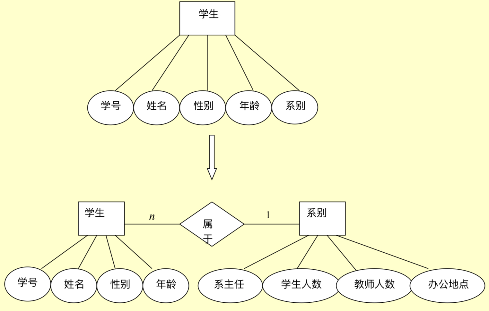

第七章、数据库设计

[toc]

# 需求分析

数据字典（需求分析的结果） 

用途：进行详细的数据收集和数据分析所获得的主要结果。

内容：

- 数据项

数据项是不可再分的数据单位

数据项描述 = {  
    - 数据项名  
    - 数据项含义说明  
    - 别名  
    - 数据类型  
    - 长度  
    - 取值范围  
    - 取值含义 
    - 与其他数据项的逻辑关系  
    - 数据项之间的联系  
}

- 数据结构

数据结构反映了数据之间的组合关系  

数据结构描述 = {  
    - 数据结构名  
    - 含义说明  
    - 组成：{ 若干数据项 + 若干数据结构 }  
}

- 数据流

数据流是数据结构在系统内传输的路径

数据流描述 = {
    - 数据流名  
    - 说明  
    - 数据流来源    
    - 数据流去处  
    - 组成：{ 数据结构 }  
    - 平均流量  
    - 高峰期流量  
}

- 数据存储

数据存储是数据结构停留或保存的地方，也是数据流的来源和去向之一  

数据存储的描述 = {  
    - 数据存储名(表名)  
    - 说明  
    - 编号  
    - 输入的数据流  
    - 输出的数据流  
    - 组成：{ 数据结构 }  
    - 数据量  
    - 存取频度  
    - 存取方式  
}

- 处理过程

具体处理逻辑一般用判定表或判定树来描述

处理过程描述 = {  
    - 处理过程名  
    - 说明  
    - 输入：{ 数据流 }  
    - 输出：{ 数据流 }
    - 处理：{ 简要说明 }
}
# 概念结构设计

## 概念模型

将需求分析所得到的用户需求抽象为信息结构即概念模型

## E-R模型

- 实体性：用矩形表示，矩形框内写明实体名  
- 属性：用椭圆形表示，并用无向边将其与相应的实体连接起来  
- 联系本身：用菱形表示，菱形框内写明联系名，并用无向边分别与有关的实体连接起来，同时在无向边上标明联系的类型(1:1,1:n,m:n)  
    > 联系的属性：联系本身也是一种实体类型，也可以有属性

## 概念结构设计  

将数据分别从数据字典中抽取出来制作E-R图

1. 制作分E-R图

利用各个实体型与其属性制作出单一E-R图  

2. 合并成基本E-R图

合并 分E-R图，集成为一个整体的数据概念结构即总E-R图  

- 解决冲突
各个分E-R图之间必定会存在许多不一致的地方，存在以下几种冲突
    - 属性冲突
        - 属性域冲突
        - 属性取值单位冲突
    - 命名冲突
        - 同名异义
        - 异名同义
    - 结构冲突
        - 同一对象在不同应用中具有不同的抽象
        - 同一实体在不同E-R图中包含的属性不同
        - 实体之间的联系在不同局部视图中呈现不同类型

- 消除不必要的冗余
    - 分析方法
    - 规范化理论

例

# 逻辑结构设计

## E-R图向关系模型的转换

一个实体型转换为一个关系模式
- 关系的属性：实体型的属性
- 关系的码：实体型的码  

实体型间的联系有以下不同情况
- 一个1：1联系可以转换为一个独立的关系模式，也可以与任意一端的关系模式合并  
- 一个1：n联系可以转换为一个独立的关系模式，也可与与n端对于的关系模式合并
- 一个m：n联系转换为一个关系模式

## 数据模型的优化

## 设计用户子模式

# 数据库的物理设计

数据库在物理设备上的存储结构与存取方法称为数据库的物理结构，依赖于选定的数据库管理系统。

# 数据库的实施与维护

# 小结
