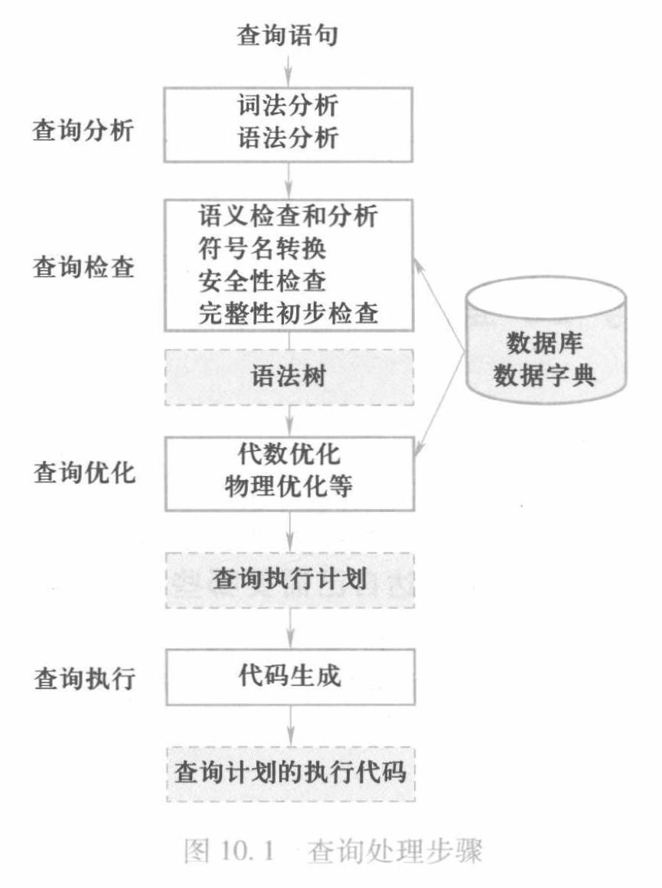

# 关系数据库系统的查询处理

查询处理是关系数据库管理系统执行查询语句的过程，其任务是把用户提交的查询语句转换为高效的**查询执行计划**并执行。  

## 步骤

- 查询分析

1. 词法分析：查询语句中提取出语言符号，例如SQL关键字、属性名和关系名  
2. 语法分析：进行语法检查和语法分析,即判断查询语句是否符合SQL语法规则

- 查询检查

1. 语法检查和分析：根据数据字典中有关模式定义，检查语句中的数据库对象是否存在和有效  
2. 视图消解：如果是对视图进行操作，还要用视图消解方法把对试图的操作转换为对基本表的操作
3. 安全性检查和完整性初步检查：根据数据字典中的用户权限和完整性约束定义，进行安全性和完整性检查
4. 符号名转换：将数据库对象的外部名字转换为内部表示
5. 用语法树来表示扩展的关系代数表达式

- 查询优化

1. 代数优化：按照一定的规则，通过对关系代数表达式进行等价变换以改变代数表达式中操作的次序和组合，使查询更高效 
2. 物理优化：选择高效的存取路径和底层操作算法

- 查询执行

1. 代码生成器依据查询优化器得到的执行策略生成查询执行计划的代码
2. 执行代码，送回查询结果
> 

## 示例

- 选择操作的实现

1. 简单的全表扫描方法  
2. 索引扫描方法

- 自然连接操作的实现

1. 嵌套查询方法
2. 排序-合并方法
3. 索引连接方法
4. Hash Join方法

# 关系数据库系统的查询优化

RDBMS通过某种代价模型计算出各种查询执行策略的执行代价，然后选取代价最小的执行方案  
> 总代价=I/O代价+CPU代价+内存代价+通信代价

# 代数优化

通过对关系代数表达式的等价变换来提高查找效率  
> 关系代数表达式的等价：指用相同的关系代替两个表达式中相应的关系所得到的结果是相同的  
> 两个关系表达式$E_1$和$E_2$是等价的，记作$E_1≡E_2$

## 查询树 

### 查询树的优化
- 选择运算应尽可能先做
- 把投影运算和选择运算同时进行
- 把投影同其前或其后的双目运算结合起来
- 把某些选择同在他前面要执行的笛卡尔积结合起来成为一个连接运算
- 找出公共子表达式

## 代数优化的一般步骤

1. 把SQL语句转换为查询树（关系代数语法树）
    1. SELECT子句对应投影操作
    2. FROM子句对应笛卡尔积操作
    3. WHERE子句对应选择操作
2. 将选择操作尽量下移
3. 将连接条件与笛卡尔积组成连接操作
4. 进一步用投影操作消除对查询无用的属性

# 物理优化

## 基于规则的启发式优化

- 对于小关系，使用全表扫描
- 对应大关系，启发式规则有：
    - 自动建立主码索引

## 基于代价估算的优化

基于代数的优化方法要计算各种操作算法的执行代价，与数据库的状态密切相关

## 两者结合的优化方法

# 小结
