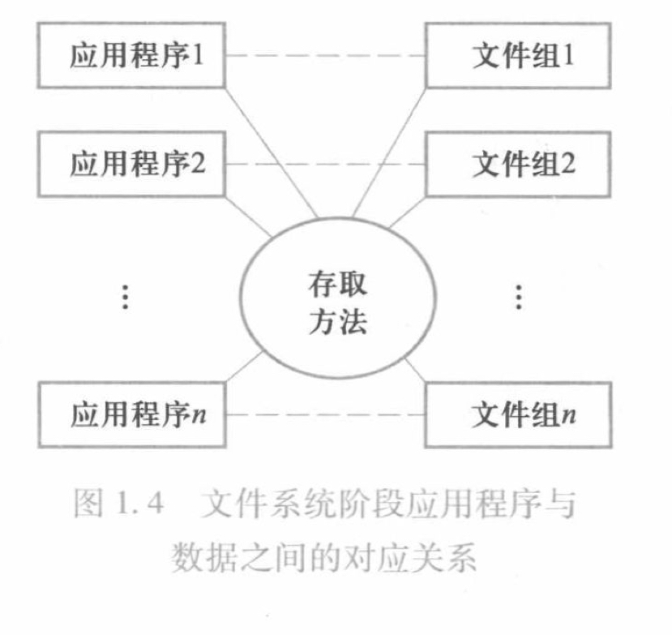

[toc]
***
# 基础篇

基础篇：本篇包括五章
1. 绪论：初步讲解数据库若干基础概念  
    1. 数据建模
    2. 数据模型
    3. 数据库系统的三级模式结构  
    4. 数据库的组成
2. 关系模型：系统讲解关系模型知识
    1. 关系模型的数据结构
    2. 关系模型的关系操作
        1. 关系代数
        2. 关系演算
    3. 三类完整性约束
3. 关系数据库标准语言SQL 
    1. 数据定义
    2. 数据查询
    3. 数据更新
    4. 索引的创建
    5. 空值的处理
    6. 试图的定义和作用 
4. 数据库安全  
5. 数据库完整性

***
## 第一章、绪论
### 1.1 数据库的几个基本概念

- __数据__  
>描述事物的符号记录称为数据  

 __数据的数字化__：描述事物的符号可以是数字、文字、图像、音频、视频等。数据可以具有多种形式，经过数字化后存入计算机。    
__数据的语义__：数据的含义称为数据的语义，数据与其语义是不可分割的。
- 数据库
> 长期存储在计算机内有组织、可共享的大量数据的集合。
- 数据库管理系统
> 数据库管理系统是位于用户和操作系统之间的数据管理软件。和操作系统一样是计算机的基础软件。   

>所提供的功能：  
> 1. 数据定义功能  
> 2. 数据组织、存储和管理功能
> 3. 数据操纵功能
> 4. 数据库的事务管理和运行管理功能  
> 5. 数据库的建立和维护功能
> 6.其他功能：与其他软件的交互、不同数据库之间的数据转换和访问功能
- 数据库系统
>数据库管理系统是指引入数据库后的计算机系统,人们常常把数据库系统称为数据库.

### 1.2 数据库管理技术的产生和发展

1. 人工管理阶段  
> 特点：
> 1. 数据不保存
> 2. 应用程序单独管理其数据
> 3. 数据不共享
> 4. 数据不具有独立性  

2. 文件系统阶段
> 特点:  
> 1.数据可以长期保存  
> 2.数据由专门的软件进行存储  
> 3.数据共享性弱，沉余度高  
> 4. 数据独立性弱
> 

3. 数据库系统阶段
> 特点  
> 1. 整体数据的结构化
> 2. 数据的共享性强，沉余度低且易于扩展：数据库系统从整体角度看待和描述数据据，数据不再是面向某个应用，而是面向整个系统。
> 3. 数据的独立性强：用户的应用程序和数据库中数据在物理存储和逻辑结构上是相互独立的。  
> 4. 数据由数据库管理系统统一进行管理和控制  
>    1. 安全性保护：防止数据不合法使用
>    1. 完整性检查：检查数据的正确性、有效性和相容性
>    3. 数据的并发控制：多用户同时访问时的处理
>    4. 数据库的恢复：软硬件受损、操作失误、蓄意破坏导致的数据库受损后的恢复

综上所述，数据库是长期存储在计算机内的有组织、可共享的大量数据的集合。它可以供各种用户所共享，具有最小的冗余度和较强的数据独立性。数据库管理系统在数据库建立、运维时对数据库进行统一控制，以保证数据的完整性和安全性，并为多用户同时使用数据时进行并发控制，在发生故障后对数据库进行修复。

### 1.3 数据模型
> 数据模型是一种抽象模型，它是对现实世界数据特征的抽象。也就是说，数据模型是用来描述数据、组织数据和对数据进行操作的   

#### 数据建模
>把现实世界中的具体事物抽象、组织为某一数据库管理系统支持的数据模型，这个过称为数据建  

在数据库系统中，数据建模一般分为两步进行
1. 建立概念模型
> 首先将现实世界抽象为信息世界。也就是把现实世界中的客观对象抽象为某一种信息结构，这种信息结构不依赖与具体的计算机系统，不是某一个数据管理系统支持的数据模型，而是概念级的模型。依赖于用户的观点对用户进行建模。
2. 将概念模型转换为数据模型
> 数据模型是按计算机系统的观点对数据建模，把概念模型转换为某一数据管理系统支持的数据模型。

#### 概念模型
> 概念模型用于信息世界的建模

1. 基本概念

 |概念|含义|
 |:---:|---|
 |实体|客观存在可相互区别的事物称为实体。|
 |属性|实体具有的某一特性称为属性。|
 |码|唯一标识实体的属性集成为码。|
 |实体类型|具有相同属性的实体必然具有相同的特性和性质。|
 |实体集|同一类型实体的集合称为实体集。|
 |联系|包括实体型内部的联系和实体型之间的联系|

2. 概念模型的一种表示方法：实体-联系模型
> 概念模型是对信息世界的建模，应该能够方便准确的描述出上述信息世界中的基本概念。方法很多，最常用的是`实体-联系模型`,简称E-R模型。

#### 数据模型的三要素
> 数据模型是按照严格定义的一组概念的集合。这些概念精确的描述了系统的静态特性、动态特性和完整性约束。  

|数据结构|数据结构描述数据库的组成对象以及对象之间的联系|数据结构描述的内容有两类，一类是与对象的内容、类型、性质有关的；一类是与数据之间的联系有关的对象|
|---|:---|:---|
|数据操纵|数据操纵是指对数据库中的各种对象的实例允许执行的操作的集合、（包括操作及有关操作的规定|主要有查询和更新（插入、删除、修改）操作。数据库模型必须定义这些操作的具体含义、操作符、操作规则（优先级）以及实现的语言|
|完整性约束|完整性约束是一组完整性规则|是给定的数据模型中的数据及其联系所具有的制约和依存规则，用以限定符合模型的数据库状态以及状态的变化，以保证数据的正确、有效和相融

### 1.4 层次模型
- 层次模型中实体用记录来表示，实体的属性对于记录的字段（或数据项）
- 基本层次结构（两个记录(实体)之间的联系）：树
- 码字段：每个记录类型定义的一个排序字段，该字段是唯一的
- 任意一个给定的记录值只能按其层次路径来查看，没有一个子女记录能脱离双亲节点记录值而独立存在。

|优点|缺点|
|---|---|
|层次模型的数据结构较为简单清晰|现实生活中很多联系都是非层次的
|层次数据库的查询效率高|如果一个节点有两个双亲节点则会产生冗余
|层次数据模型提供了良好的完整性约束支持|查询子女节点必须依赖双亲节点
||结构严密，层次命令趋于程序化|

可见，层次模型对于具有一对多的层次联系的部门描述非常自然、直观、易理解。这是层次数据库的突出优点。

#### 1.5 网状模型

- 基本层次联系（数据结构）：网（层次模型实际上市网状模型的一个特例，类似于树是图的一个特例）  
- 支持码的概念

|优点|缺点|
|---|---|
|能更为直接的描述现实世界|结构较为复杂，不利于最终用户掌握
|具有良好的性能，存取效率高|数据定义语言和数据操纵语言复杂，并需要嵌入一门高级语言
||记录之间的联系通过存存取路径实现，应用访问数据时必须选择合适的存取路径，加重编写程序的负担|

#### 1.6 关系模型
> 关系模型和以往的模型不同，它建立在严格的数学概念基础之上，具体在第二章介绍。从用户的观点看，关系模型由一组关系组成，每个关系数据结构是一张规范的二维表。
1. 概念：

|概念名|含义|
|:---:|---|
关系|一个关系对应通常说的一张二维表
元祖|表中的一行即为一个元祖
属性|表中的一列即为一个属性，每列的名字称为列名
码|又称码键或键，是表中的一个属性或一组属性，其值可以唯一标识一个元祖
域|表示某一属性的取值范围
分量|元祖中的一个属性值
关系模式|对关系的描述，一般表示为：关系名（属性1,属性2...,属性n）

> 关系模型要求关系（表）必须是规范化的，关系中每个分量必须是一个不可分割项，即表中不允许还有表

2. 关系术语与现实生活中表格术语对比

|关系术语|表格术语|
|---|---|
关系名|表名
关系模式|表头
关系|（一张）二维表
元祖|记录或行
属性|列
属性名|列名
属性值|列值
分量|一条记录中的一个列值
非规范关系|表中有表

3. 关系模型的数据操纵和完整性约束

|关系的完整性约束|实体完整性、参照物完整性和用户定义的完整性|
|---|---|
数据操纵|关系模型中的数据操纵都是集合操作，操作对象和操作结果都是关系，即若干元组的集合|

4. 关系模型的优缺点

|优点|缺点|
|---|---|
|关系模型的存取路径对用户隐蔽|查询效率往往不如层次和网状
|关系模型建立在严格的数学概念基础上|
|关系模型的概念单一|

### 1.3 数据库系统的三级模式结构

#### 1.3.1数据库系统中模式的概念

> 模式也称为逻辑模式，是数据库中全体数据的逻辑结和特征的描述，它仅仅设计型的描述，不涉及具体的值。
> 模式中的一个具体值称为模式的一个实例。同一个模式可以有很多实例
>> 数据模型中有“类型”和“值”的概念。型是对某一类数据的结构和属性的说明，值是型的一个具体赋值。例如，学生（学号、姓名、性别）是类型，（2022520,杜嘉雯，女）是一个记录值  

#### 1.3.2 数据库系统的三级模式结构

> 数据库的三级模式结构是指数据库系统是由模式、内模式和外模式三级构成。三种模式都是对数据的描述，只是描述的层次不同

1. 模式（逻辑模式）
> - 模式是所有用户的公共数据视图,它是数据系统模式结构的中间层，不涉及数据的物理存储细节和硬件环境，且与具体的应用程序、所使用的应用开发工具和高级程序语言无关   
> - 实际上是数据库数据在逻辑上的视图。一个数据库对应一个模式。  
> - 数据库模式以某种`数据模型`为基础，综合考虑所有用户的需求，并将这些需求有机结合成为一个逻辑整体。  
> - 定义模式时不仅要定义数据的逻辑结构，例如数据记录由哪些数据项构成，数据项的名称、类型、取值范围等，而且要定义数据之间的练习，以及数据有关的安全性、完整性要求。

2. 外模式（子模式/用户模式）
> - 它是数据库用户（包括应用程序员和最终用户），能够看见和使用的局部数据的逻辑结构和特征描述。  
> - 外模式是数据库用户的数据模式，是与某一应用有关的数据的逻辑表示。一个应用只能使用一个外模式。

3. 内模式（物理模式/存储模式）
> 一个数据库只能有一个内模式。它是对数据物理结构和存储方式的描述，是数据在数据库内部的组织方式。例如记录按哪种方式存储、是否压缩、加密等等。

#### 1.3.3 数据库的两级映像和数据独立性

> 为了实现这三个抽象层次之间的联系和转换，数据库管理系统在这三级模式之间提供了两级映像：外模式/模式映像和内模式/模式映像。正是这两级映像保证了数据库系统中的数据能具有将枪的逻辑独立性和物理独立性。

1. 外模式/模式映像
> 模式描述的是数据的全局逻辑结构，外模式描述的是数据的局部逻辑结构。  
> - 数据的逻辑独立性：当模式改变时（增加新的关系，新的属性，改变属性的数据类型等），由数据库管理员对各个外模式/模式的映像做出修改，可使外模式保持不变，应用程序则无需进行修改,保证了数据与程序的逻辑独立性,简称数据的逻辑独立性。

2. 模式/内模式映像
> 该映像定义了数据全局逻辑结构与存储结构之间的对应关系。例如说明逻辑记录和字段在内部诗人如何存储的。
> - 数据的物理独立性：当数据库的存储模式发生了改变时，对模式/内模式映像进行修改，可保持模式不，从而应用程序无需发生改变。

#### 1.3.4 三级模式结构小结
- 三级模式结构中，模式是数据库的核心与关键，它独立于数据库的其他层次。因此设计数据库结构时候首先确定数据库的逻辑模式。
- 内模式依赖于数据库的全局逻辑结构，但独立于数据库的用户模式（外模式），也独立于具体的存储设备。它将全局逻辑结构中所定义的数据结构及其联系按照一定的物理存储策略进行组织，以达到较好的时间和空间效率。
- 外模式面向具体的应用，定义在逻辑模式之上，但独立于存储模式和存储设备。当应用需求发生变化时，外模式可以进行修改。
- 特定的应用程序是在外模式描述的数据结构上编制的，依赖于特定的外模式。不同的应用可以有同一个外模式，但是一个ie应用只能有一个外模式。数据库的两级映像保证了数据库外模式的稳定性，从而从底层保证了应用程序的稳定性。
- 数据与程序之间的独立性，使数据的定义和描述可以从应用中分离出去，简化程序的编制。

### 1.4 数据库系统的组成

> 在1.1节就已介绍，数据库系统是指引入数据库后的计算机系统，一般由数据库、数据库管理系统（及其应用开发工具）、应用系统和数据库管理员组成）。  

本节从硬件平台、软件平台和人员对数据库系统的组成进行介绍。

1. 硬件平台
> 数据存放在计算机存储设备中。

2. 软件平台
> 操作系统、数据库管理系统、开发应用程序的高级程序语言及其编译系统、开发工具等。

3. 人员
> 数据库管理员、系统分析员、数据库设计员、应用程序员和最终用户。  
不同的角色各司其职，如图

## 1.5 本章小结
- 本章概述了数据库的基本概念，并通过数据管理技术进展情况阐述了数据库技术的产生和发展背景，说明了数据库系统的优点。
- 数据模型：本章简介了概念模型、组成数据模型的三要素（数据结构、数据操纵、完整性约束|和三类数据模型（层次模型、网状模型、关系模型）
- 本章介绍了数据库系统的三级模式和两级映像，这样的系统保证了数据库系统的逻辑独立性和物理独立性。
- 本章还介绍了数据库系统的组成，使读者了解数据库系统不仅是一个计算机系统，还是一个人机系统。
