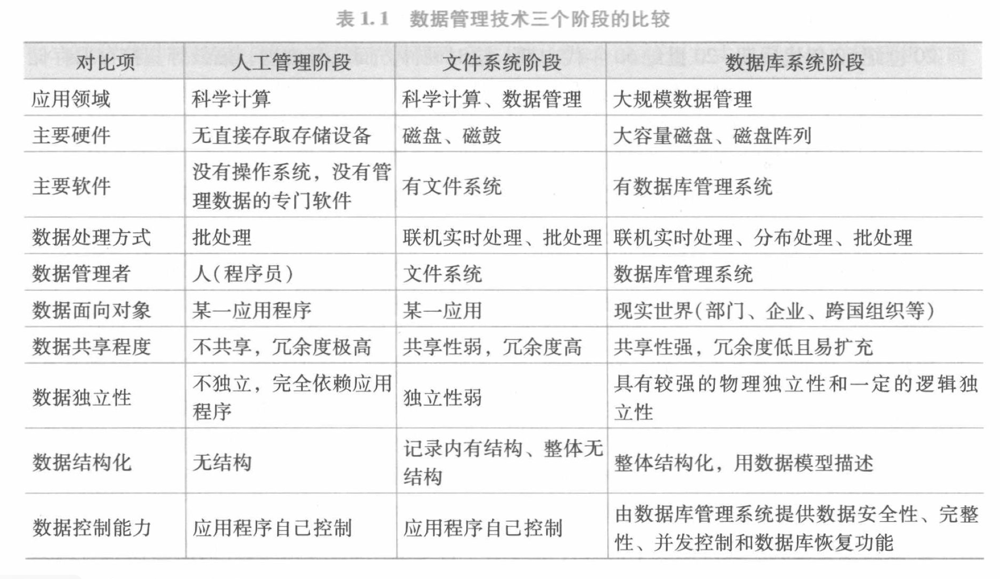

[toc]
***
# 基础篇

基础篇：本篇包括五章
1. 绪论：初步讲解数据库若干基础概念  
    1. 数据建模
    2. 数据模型
    3. 数据库系统的三级模式结构  
    4. 数据库的组成
2. 关系模型：系统讲解关系模型知识
    1. 关系模型的数据结构
    2. 关系模型的关系操作
        1. 关系代数
        2. 关系演算
    3. 三类完整性约束
3. 关系数据库标准语言SQL 
    1. 数据定义
    2. 数据查询
    3. 数据更新
    4. 索引的创建
    5. 空值的处理
    6. 试图的定义和作用 
4. 数据库安全  
5. 数据库完整性

***
## 第一章、绪论
### 1.1 数据库的几个基本概念

- __数据__  
>描述事物的符号记录称为数据  

 __数据的数字化__：描述事物的符号可以是数字、文字、图像、音频、视频等。数据可以具有多种形式，经过数字化后存入计算机。    
__数据的语义__：数据的含义称为数据的语义，数据与其语义是不可分割的。
- 数据库
> 长期存储在计算机内有组织、可共享的大量数据的集合。
- 数据库管理系统
> 数据库管理系统是位于用户和操作系统之间的数据管理软件。和操作系统一样是计算机的基础软件。   

>所提供的功能：  
> 1. 数据定义功能  
> 2. 数据组织、存储和管理功能
> 3. 数据操纵功能
> 4. 数据库的事务管理和运行管理功能  
> 5. 数据库的建立和维护功能
> 6.其他功能：与其他软件的交互、不同数据库之间的数据转换和访问功能
- 数据库系统
>数据库管理系统是指引入数据库后的计算机系统,人们常常把数据库系统称为数据库.

### 1.2 数据库管理技术的产生和发展

1. 人工管理阶段  
> 特点：
> 1. 数据不保存
> 2. 应用程序单独管理其数据
> 3. 数据不共享
> 4. 数据不具有独立性  

2. 文件系统阶段
> 特点:  
> 1.数据可以长期保存  
> 2.数据由专门的软件进行存储  
> 3.数据共享性弱，沉余度高  
> 4. 数据独立性弱
> 

3. 数据库系统阶段
> 特点  
> 1. 整体数据的结构化
> 2. 数据的共享性强，沉余度低且易于扩展：数据库系统从整体角度看待和描述数据据，数据不再是面向某个应用，而是面向整个系统。
> 3. 数据的独立性强：用户的应用程序和数据库中数据在物理存储和逻辑结构上是相互独立的。  
> 4. 数据由数据库管理系统统一进行管理和控制  
>    1. 安全性保护：防止数据不合法使用
>    1. 完整性检查：检查数据的正确性、有效性和相容性
>    3. 数据的并发控制：多用户同时访问时的处理
>    4. 数据库的恢复：软硬件受损、操作失误、蓄意破坏导致的数据库受损后的恢复

综上所述，数据库是长期存储在计算机内的有组织、可共享的大量数据的集合。它可以供各种用户所共享，具有最小的冗余度和较强的数据独立性。数据库管理系统在数据库建立、运维时对数据库进行统一控制，以保证数据的完整性和安全性，并为多用户同时使用数据时进行并发控制，在发生故障后对数据库进行修复。

### 1.3 数据模型
> 数据模型是一种抽象模型，它是对现实世界数据特征的抽象。也就是说，数据模型是用来描述数据、组织数据和对数据进行操作的   

#### 数据建模
>把现实世界中的具体事物抽象、组织为某一数据库管理系统支持的数据模型，这个过称为数据建  

在数据库系统中，数据建模一般分为两步进行
1. 建立概念模型
> 首先将现实世界抽象为信息世界。也就是把现实世界中的客观对象抽象为某一种信息结构，这种信息结构不依赖与具体的计算机系统，不是某一个数据管理系统支持的数据模型，而是概念级的模型。依赖于用户的观点对用户进行建模。
2. 将概念模型转换为数据模型
> 数据模型是按计算机系统的观点对数据建模，把概念模型转换为某一数据管理系统支持的数据模型。

#### 概念模型
> 概念模型用于信息世界的建模

1. 基本概念

 |概念|含义|
 |:---:|---|
 |实体|客观存在可相互区别的事物称为实体。|
 |属性|实体具有的某一特性称为属性。|
 |码|唯一标识实体的属性集成为码。|
 |实体类型|具有相同属性的实体必然具有相同的特性和性质。|
 |实体集|同一类型实体的集合称为实体集。|
 |联系|包括实体型内部的联系和实体型之间的联系|

2. 概念模型的一种表示方法：实体-联系模型
> 概念模型是对信息世界的建模，应该能够方便准确的描述出上述信息世界中的基本概念。方法很多，最常用的是`实体-联系模型`,简称E-R模型。

#### 数据模型的三要素
> 数据模型是按照严格定义的一组概念的集合。这些概念精确的描述了系统的静态特性、动态特性和完整性约束。  

|数据结构|数据结构描述数据库的组成对象以及对象之间的联系|数据结构描述的内容有两类，一类是与对象的内容、类型、性质有关的；一类是与数据之间的联系有关的对象|
|---|:---|:---|
|数据操纵|数据操纵是指对数据库中的各种对象的实例允许执行的操作的集合、（包括操作及有关操作的规定|主要有查询和更新（插入、删除、修改）操作。数据库模型必须定义这些操作的具体含义、操作符、操作规则（优先级）以及实现的语言|
|完整性约束|完整性约束是一组完整性规则|是给定的数据模型中的数据及其联系所具有的制约和依存规则，用以限定符合模型的数据库状态以及状态的变化，以保证数据的正确、有效和相融

### 1.4 层次模型
- 层次模型中实体用记录来表示，实体的属性对于记录的字段（或数据项）
- 基本层次结构（两个记录(实体)之间的联系）：树
- 码字段：每个记录类型定义的一个排序字段，该字段是唯一的
- 任意一个给定的记录值只能按其层次路径来查看，没有一个子女记录能脱离双亲节点记录值而独立存在。

|优点|缺点|
|---|---|
|层次模型的数据结构较为简单清晰|现实生活中很多联系都是非层次的
|层次数据库的查询效率高|如果一个节点有两个双亲节点则会产生冗余
|层次数据模型提供了良好的完整性约束支持|查询子女节点必须依赖双亲节点
||结构严密，层次命令趋于程序化|

可见，层次模型对于具有一对多的层次联系的部门描述非常自然、直观、易理解。这是层次数据库的突出优点。

#### 1.5 网状模型

- 基本层次联系（数据结构）：网（层次模型实际上市网状模型的一个特例，类似于树是图的一个特例）  
- 支持码的概念

|优点|缺点|
|---|---|
|能更为直接的描述现实世界|结构较为复杂，不利于最终用户掌握
|具有良好的性能，存取效率高|数据定义语言和数据操纵语言复杂，并需要嵌入一门高级语言
||记录之间的联系通过存存取路径实现，应用访问数据时必须选择合适的存取路径，加重编写程序的负担|

#### 1.6 关系模型
> 关系模型和以往的模型不同，它建立在严格的数学概念基础之上，具体在第二章介绍。从用户的观点看，关系模型由一组关系组成，每个关系数据结构是一张规范的二维表。
1. 概念：

|概念名|含义|
|---|---|

