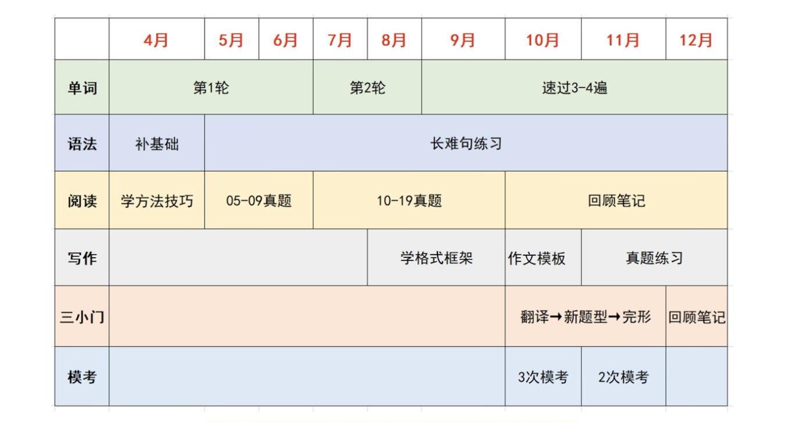

考研复习计划

[toc]

# 一、时间安排

- **3-6月**: 打基础
- **暑假**: 强化
- **下个学期**: 冲刺

> 大概分为三个阶段，详细计划走一步看一步

# 二、各科准备

## 英语

[田静+唐迟+颉斌斌 | 考研英语80+最佳复习方案_哔哩哔哩_bilibili](https://www.bilibili.com/video/BV1T24y1w7ve/?vd_source=54af73e78b0d48d34271c4fa9a3c2e93)

复习顺序：单词-语法-阅读-写作-三小门

1. 单词书

考研单词天天背，从现在一直到考研

- 纸质：大块时间-《红宝书》
- 电子：碎片时间-百词斩

> 优先级：真题高频词->真题低频词->真题中没有考过的大纲词->超纲词

2. 语法

内容不多，半个月可听完

以下二选一即可
- 田静老师语法课
- 《句句真研》

3. 长难句

搞定语法后进行长难句练习，直到考前，不断熟悉天静老师教的各种语法知识，每天一句(最多15min/day)

4. 阅读

- 唐迟/颉斌斌阅读课
- 《黄皮书》

> 真题静刷，2/3天把一篇文章研究透彻：单词，长难句，逻辑，思路，陷阱...  
> 带有翻译的考研真题pdf：https://pan.baidu.com/s/1EsjwD9P9ndc-DIvR_8xUtQ?pwd=g055

5. 写作

石雷鹏老师，网课/教材二选一即可

6. 三小门

不建议自学，网课效果好，有技巧，学会技巧后写真题，熟练技巧

- 翻译：唐静
- 新题型/完形：宋逸轩

## 数学

[【数学148】24考研数学全程规划｜8分钟理清复习思路｜效率max_哔哩哔哩_bilibili](https://www.bilibili.com/video/BV1ov4y187zr/?vd_source=54af73e78b0d48d34271c4fa9a3c2e93)

1. 高数

- 武忠祥
    - 基础阶段配套《高等数学·基础篇》
    - 强化阶段配套《高等数学辅导讲义》
    - 张宇《基础30讲》
> 武忠祥对数一中心较低，可以看张宇的数一部分

2. 线代

- 李永乐
- 配套《线性代数辅导讲义》
- 强化阶段《张宇线性代数9讲》/《李林线性代数辅导讲义》

3. 概率论

- 余炳森
- 配套《概率论与数理统计》

4. 习题

例题&课后习题&习题集

- 基础阶段：《张宇300》和《李永乐660》
- 强化阶段：《李永乐660》和《李林880》
- 冲刺阶段：真题（李眼芳）和模拟卷（李林6和李林4）（必做）

## 政治

[徐涛+腿姐+肖秀荣 | 考研政治80+完美搭配方案_哔哩哔哩_bilibili](https://www.bilibili.com/video/BV1Rt4y1t7BC/?vd_source=54af73e78b0d48d34271c4fa9a3c2e93)

暂时不要复习，7月份后开始（1.5h/day）

1. 视频课

- 徐涛强化班
- 腿姐技巧课

2. 习题册
- 肖《精讲精炼》/徐涛《核心考案》二选一
- 《肖1000》
- 《肖8》（11月上旬）
- 《肖4》（12.4）

3. 使用

- 徐涛：强化班、核心考案：前期打基础
- 腿姐：技巧班：后期短时间提分
- 肖秀容：精讲精练、1000题、肖八、肖四：刷题、押题

4. 时间安排

- 9月前：打基础

    徐涛强化班+《核心考案》/《精讲精练》+《1000题》

- 9-10月：短时间提分

    - 搭配: 腿姐技巧班+徐涛强化班笔记+《肖1000题》
    - 二刷或三刷《肖1000题》，重点是错题

- 11月：选择题押题

    徐涛强化班笔记+腿姐技巧班笔记+1000题错题+肖八

- 12月：分析题押题

    前几个月都是选择题，12月才开始分析题  
    肖四（分析题背熟）+其他老师押题（优先腿四）（时间充足考虑）

