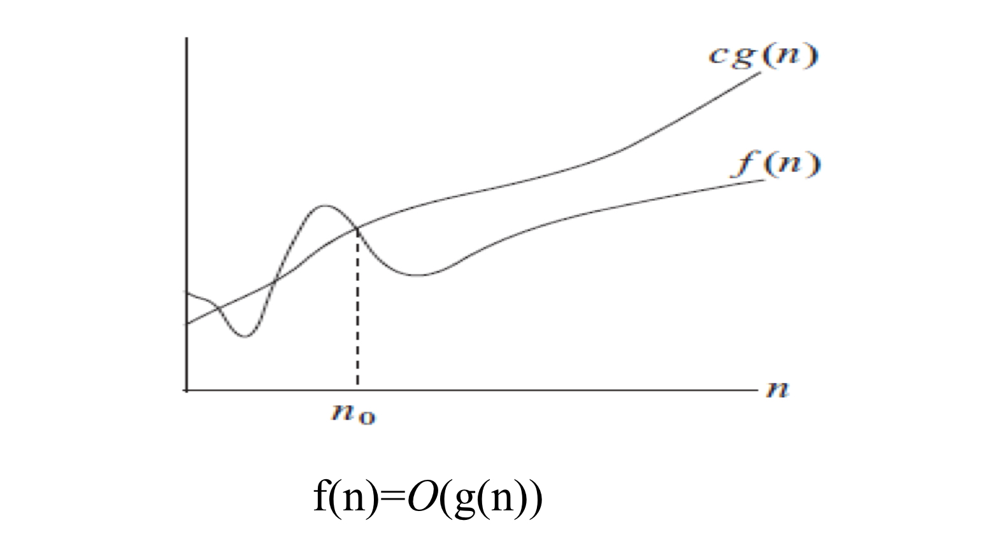

[toc]
# 1. 算法基础

## 算法的特征

1. 输入：每个算法都必须有输入数据
2. 输出：运行算法的最终处理结果
3. 有限：算法在执行有限步之后终止
4. 确定：算法的每一步都是确定的
5. 可行：算法的每一步必须是可实现的


> 程序 = 数据结构（静态） + 算法（动态）

## 算法的描述

1. 自然语言描述
2. 流程图（UML）
3. 某种程序设计语言
4. 伪代码

> 伪代码中for循环使用关键字to,如for i = 0 to n;减少的则用downto,步长可添加关键字by进行修改，其余的和c语言类似。

---
## 算法正确性
利用**循环不变式**，我们可以说明算法正确性  
循环不变式：在每一轮迭代的开始时性质P成立。则称性质P为循环不变式。

利用循环不变式证明算法的正确性的三个步骤：
1. 初始：它在循环的第一轮迭代开始时是正确的；
2. 保持：如果在循环的某一次迭代开始时它是正确的，那么下一次迭代开始时它也应该保持正确；
3. 结束：在循环结束时，算法不变式给出有用的性质，它有利于表明算法是正确的。


---
## 渐进符号
>  渐进非负函数f(n)：存在$n_0$，使得n >= $n_0$时，f(n) >= 0.

几种渐进符号：

1. 渐进上界记号(O)

g(n)称为f(n)的渐进上界，记为：f(n)=O(g(n))，当且仅当 **存在** 正常数c和$n_0$,使得当n>=$n_0$时，

$$0 <= f(n) <= c*g(n) 或 0 <= f(n)/g(n)<=c $$



2. 渐进下界记号(Ω)


3. 渐进紧确界(Θ)

f(n) = Θ(g(n)) <==> f(n) = Ω(g(n)) and f(n) = O(g(n))


4. 非紧上界记号(o)

g(n)称为f(n)的非紧上界，记为f(n)=o(g(n))，当且仅当对于 **任意正常数c** ,存在正常数$n_0$,当n>=$n_0$时
$$0 <= f(n) <c*g(n) 或 lim_{n->∞}(f(n)/g(n))=0$$
> 即g(n)可以远超过f(n)，非紧

5. 非紧下界记号(ω)

渐进符号的性质：

- 传递性
- 自反性
- 对称性
- 转置对称性
---
##  算法的渐进复杂性分析
算法复杂性：运行算法所需要的计算机资源
- 时间复杂度T(n)：运行算法所需要的时间，n为输入实例规模
- 空间复杂度S(n)：表示运行所需要的额外内存空间，n为输入实例规模
> 我们通常把算法复杂性表示为关于输入实力规模n的函数

算法复杂性分析方法：
1. 经验分析法

   对于算法A,在计算机上运行该程序，输入一系列测试数据，估算算法A所需的计算资源（时间，空间）

2. 渐进复杂性分析法

     对于规模为n的输入实例，运行算法所需计算资源T(n)关于n的变化趋势。

求算法的渐进时间复杂度：计算给定输入实例规模为n时，算法执行的**基本操作**的数量T(n).然后确定T(n)随n增长时的变化趋势。  

> 基本操作的执行时间为某一常数时间，包括：  
> 1. 赋值操作：=
> 2. 算术操作：+,-,*,/
> 3. 逻辑运算：and,or,not,nor
> 4. 关系运算：<,>,!=,==
> 5. 放回运算：return

   当n变大时，T(n)的变化去世该如何确定？  如果当n->∞时
   $$(T(n)-S(n))/T(n) -> 0$$
   则称S(n)为T(n)的渐进估计

   > 通常S(n)一般是T(n)中去掉低阶项后留下的主项，比S(n)简单。


#  2. 递归算法
递归算法是一种直接或间接地调用**自身**的算法。

应用：  
1. 阶乘函数
```c
Factorial(n){
    if(n<0) return 0; //输入的数据小于0
    if(n==0) return 1; //递归结束
    return n*Factorial(n-1); //调用自身
    //将递归中用的数据进行返回
}
```
2. Hanoi塔问题
```c
Hanoi(n,a,b,c){ //利用c柱将1..n从a移动到b
    if(n>0){
        Hanoi(n-1,a,c,b); //利用b柱将1..n-1移动到c柱
        mov(n,a,b); //将n从a柱移动到b柱
        Hanoi(n-1,c,b,a); //将1..n-1利用a柱移动到b柱
        //不需要返回值，直接对程序中的数据进行操作，不用return
    }
}
```
3. Fibonacci数列  
```c
Fibonacci(n){
    if(n<1) return 0; //输入小于1
    if( n==1 | n==2 ) return 1; //n=1和2时候数列值为1,同时为递归终止条件
    return Fibonacci(n-1)+Fibonacci(n-1); //抵用自身
    //同Factorial阶乘问题，需要返回值
}
```

求解递归式
1. 代入法（替换法、猜测法）  
先猜答案，再利用归纳法进行证明。

2. 迭代法 
    1. 展开递归式
    2. 进行若干步代数运算
    3. 求和
    4. 发现规律，进行归纳

3. 递归树法  
递归树中的节点表示求解子问题的待解或者合并代价。每颗递归属对应这问题的一次分解。对树中每层的代价求和，得到层代价，然后将所有层的代价求和得到总代价。  
通过花递归树得到递归式的解的猜测，然后用归纳法证明。

4. 主方法  
对于T(n)=aT(n/b)+f(n);  
T(n)=Θ($n^{log_b^a}$)  <-->  f(n)=O($n^{log_b^a-c}$)  
T(n)=Θ($n^{log_b^a}*logn$)  <-->  f(n)=Θ($n^{log_b^a}$)  
T(n)=Θ(f(n))  <-->  f(n)=Ω($n^{log_b^a+c}$)
> 其中c为常数


# 3. 分治策略
分治策略的基本步骤：
1. **分割**：把原问题分割为若干规模更小的子问题，每个子问题与原问题的类型相同；
2. **递归求解**：递归求出子问题的解。在求解子问题时，如果子问题的规模大不易求解，则将子问题继续分割直至容易求解为止。
3. **合并**：将子问题的解合并为原问题的解。

应用：
1. 归并排序
```c
MergeSort(A,p,r){ //对A[p..r]中的元素进行排序
    if(p<r){ //否则问题规模小于2,即子问题中只有一个值，已排好序
        q=(p+r)/2; //确定分割位置r
        MergeSort(A,q,p); //对A[p..q]进行归并排序
        MergeSort(A,q+1,r);  //对A[q+1..r]进行归并排序
        Merge(A,p,q,r); //合并两个已排序子数组
    }
}
```
> 归并排序是一各递归算法；  
> 递归是分治策略的一种方法，分治策略还可以使用非递归法。

2. 分治法求最大子数组问题(Θ(nlgn))  
寻找分割位置，判断左边子数组的最大和、右边子数组的最大和和跨分割位置的最大子数组三值哪个最大。


```c
//计算最大子数组
FIND_MAXIMUM_SUBARRAY(A,low,high){ //输入数组A[low...high]
    if(high == low){ //单元素数组的最大子数组就是本身
        return (low,high,A[low]);
    }
    else{
        mid = (low + high)/2; //获取中点，分割为两个规模小一些的子问题
        (left-low,left-high,left-sum)=FIND_MAXIMUM_SUBARRAY(A,low,mid); //递归计算左最大子数组
        (right-low,right-high,right-sum)=FIND_MAXIMUM_SUBARRAY(A,mid+1,high); //递归计算右最大子数组
        (cross-low,cross-high,cross-sum)=FIND_MAX_CROSSING_SGUBARRAY(A,low,mid,higt); //计算跨中点的最大子数组
        return MAX(left-sum,right-sum,cross-sum); //返回三者中最大值
    }
}

//计算跨分割位置mid的最大子数组
FIND_MAX_CROSSING_SGUBARRAY(A,low,mid,high){ //输入A[low..mid..high]
    left-sum = -100000; //先设置从mid中点向左最大和为负无穷大
    sum = 0; //将mid--的每个数加起来
    for i=mid downto low {
        sum += A[i];
        if(sum>left-sum){ //如果当前和比left-sum大，则更改左侧最大子数组的值和下标
            left-sum = sum;
            max-left = i;
        }
    }
    right-sum = -100000; //右侧同理
    sum = 0;
    for i=mid+1 to high{
        sum += A[i];
        if(sum>right-sum){
            right-sum = sum;
            max-right = i;
        }
    }
    return (max-left,max-right,left-sum+right-sum); //最后将左右相加得到两侧一起的跨分割位置的子数组和
}
```
3. Strassen矩阵乘法方法(Θ($n^{lg7}$))  
建立于矩阵分块乘法基础，同时将每一个块利用strassen算法求得


# 4. 排序算法
堆排序

> 利用最大堆的特性，每次将位于根节点的最大值选出至已排序队列（交换至当前堆的尾节点）

1. 什么是堆？  
堆是一种特殊的数据结构，通常由数组来实现，把堆看作一颗完全二叉树，堆中节点的值总是不大于或不小于其父节点的值。
> 根节点最大的堆叫做最大堆，最小堆相反。

2. 最大堆维护算法(O(logn))
```c
MAX_HEAPIFY(A,i){ //对堆(数组)A中根节点为(下标)i的子堆进行维护
    l = left(i);r=right(i); //取节点i的左孩子节点和右孩子节点下标
    //寻找根节点、左孩子和右孩子三者中的最大值，检查是否符合大顶堆
    if(l<=A.heap_size and A[l]>a[i]){ //如果存在左孩子，看是否大于根节点
        largest = l;
    }
    else{
        largest = i;
    }
    if(r<=A.heap_size and A[r]>A.[largest]){ //存在右孩子，同样进行判断
        largest = r;
    }
    if(largest!=i){ //如果比较后根节点不是最大的，则进行处理
        Swap(A,i,largest); //交换孩子节点和根节点的位置
        MAX_HEAPIFY(A<largest); //对交换后的子子堆进行维护，防止交换后的子子堆不是一个最大堆
    }
}
```

3. 建最大堆算法(O(O(logn)))  
给定一个数组A,调用堆维护算法MAX_HEAPIFY，我们自底向上将数组A变成一个堆
```c
BUILD_MAX_HEAP(A){ //对输入的数组A进行大堆化
    A.heap_size = A.length; //将堆的大小设置为数组大小
    for i=A.length/2 downto 1{ //从最后一个节点的父节点(即最后一个父节点)开始，自底向上直至根节点，使用堆维护算法
        MAX_HEAPIFY(A,i);
    }
}
```

4. 堆排序算法(O(nlogn))
```c
kHEAPSORT(A){ //A是最大推，我们通过最大堆进行堆排序
    for i=A.length downto 2{  //当只剩最后一个节点时，必然是最小的，不必进行排序
        Swap(A[1],A[i]); //交换根节点(最大值)和最后一个节点，将最大值放在最后面
        A.heap_size(A) = A.heap_size(A) -1; //将堆的大小减少1,上一步的最大值不再参加排序，寻找下一个最大值
        MAX_HEAPIFY(A,1); //对根节点进行维护，方便进行下一次交换
    }
}
```

快速排序(平均O(nlogn),最差O($n^2$))  
> 快速排序如何应用分治策略：  
> 1. 将数组A[p..r]划分为量子子数组A[p...q]与A[q+1...r]
> > 不变式：子数组A[p...q]中的元素都比A[q+1...r]小
> 2. 递归调用快速排序算法对子数组进行排序

```c
QUICkSORT(A,p,r){ //数组A,待排序下限p和上限r
    if(p<r){ //如果只有一个元素，则无需进行排序
        q = PARTITION(A,p,r); //一次排好一个位置，并返回这个下标
        QUICkSORT(A,p,q-1); //以排好位置为分割点，对左侧递归排序
        QUICkSORT(A,q+1,r);
    }
}
```

```c
//重新虽数组元素进行调整，使第一个数组中所有数小于第二个数组，返回分割点的下标
PARTITION(A,p,r){ //对A[p...r]进行排序
    x = A[r]; //取最后一个作为枢纽
    i = p-1; //记录大于枢纽的低一个值
    for j=p to r-1{ //从第一个遍利到最后
        if(A[j]<=x){ //如果小于枢纽
            i++; 
            swap(A[i],A[j]); //将i处大于枢纽的值与当前小于枢纽的值进行交换
        }
    }
    swap(A[i+1],a[r]); //将i处最后一个大于枢纽的值与枢纽进行交换
    return i+1; //返回枢纽的位置，枢纽对应左侧值都小于枢纽，右侧都大于，枢纽找到正确的位置
}
```

> 对已经排好序的序列来说，运行时间为O($n^2$)，为改进可：
> 1. 对数组中的元素进行打乱
> 2. 随即选取主元


桶排序(Θ(n))  
对数组A中元素的区间范围划分为n个大小相同的子区间，每个区间成为桶，然后把n个数据分别放入各个桶中。对每个桶中的数进行排序，然后遍历各个桶将其元素列出即可。

计数排序(Θ(n))
1. 扫描数组A确定各个计数器(即各个元素的个数)的值
2. 统计A中不超过i的元素的个数并置于$数组C_i$
3. 倒序扫描数组A中的元素，每扫描到一个元素就把它放到数组B的C[A[j]]号位置上(B[C[A[j]]]=A[j])，然后C[A[j]]--;

基数排序算法(Θ(d+k))  
存在n个数，每个数是一个d位整数，每个位的取值在0和k之间，从低位向高位轮播排序


线性时间排序的比较排序下界  
比较排序：通过比较元素大小来确定元素的相对位置，最后将所有的数组有序排序。
> 利用决策树，可将所有的排序可能都列在叶子节点上，可知道得到最终结果所需的步骤就是树的高度

$$n!<=L<=2^h --> h>=log(n!)=Ω(nlong)$$
> n是待比较数个数，n!表示所有的可能，L为可达叶子节点的个数，h为树的高度，$2^h$表示第h层的节点数


# 4. 动态规划

##  动态规划和分治策略
- 相同之处：动态规划类似于分支策略：将问题划分为若干子问题，然后求解子问题，最后利用子问题的最优解来构造出原问题的最优解。

- 不同之处：分支策略每次划分得到的子问题都被求解，而不管子问题是否已重复求解；动态规划对不同的子问题之求解一次，并将所得到的解保存在表格中，下次遇到相同的子问题只需查表而无需进行重复求解。

## 步骤
1. 说明问题的最优解具有**最优子结构特征**（最优化问题的最优解可以由子问题的最优解组合得到）
2. 把问题最优解的值用子问题最优解递归表示
3. 自底向上计算最优解的值，并保存各子问题最优解的值及用于构造最优解的信息


## 应用
1. 矩阵链乘问题
> 背景：给定矩阵$A_1A_2A_3$;$A_1$:30x35,$A_2$:35x15,$A_3$:15x5;  
> $A_1(A_2A_3)$所需的乘法次数为30x35x5+35x15x5=7875;  
> $(A_1A_2)A_3$所需的乘法次数为30x35x15+30x15x5=18000;  
> 可知不同的乘法顺序，所需要的乘法次数不同。

考虑n个矩阵的乘积：$A_1A_2...A_m$,确定最优的乘法顺序（最优括号化方案），使得乘法次数最少。

> 对于$A_1A_2A_3A_4$四个矩阵相乘，所有顺序如下图所示，可知存在冗余子问题，可将少位矩阵相乘后的结果保存用于多位矩阵相乘的计算。


```c
//从1、2、3、4个（即链长）矩阵相乘开始计算，自底向上求出所有的数据
Matrix-Chain-Order(p){ 
    n = p.length -1;  
    for i=1 to n{ //求解链长为1的子问题，即单个矩阵相乘,即为本身
        m[i,i] = 0; 
    }
    for l=2 to n-1+1 { //求解链长大于1的子问题，即多个矩阵相乘的问题
        for i=1 to n-1{ //子链起点
            j = i+l-1; //子链终点
            m[i,j] = ∞; 
            for k=i to j-1 { //对子链中的每一处进行切割查找最优分割点
                q = m[i,k]+m[k+1,j]+p[i-1]*p[k]*p[j]; 
                if(q<m[i,j]){ //小于之前的乘法次数则更新当前起点为i,链长为l,终点为j的子链的最少乘法次数
                    m[i,j] = q; //记录从i到j的最小乘法次数
                    s[i,j] = k; //记录从i到j的最小乘法次数中的分割位置（i<k<j)
                }
            }
        }
    }
}
```

2. 最长公共子序列问题(O(m*n))  

子序列：在序列中去掉若干字符（可并非连续的子序列）所剩余的部分称为该序列的子序列。  
最长公共子序列(LCS)：两个序列的所有公共子序列中长度最长的序列。

c[i,j]=c[i-1,j-1]+1             x[i]=y[j],  
c[i,j]=max(c[i-1,j],c[i,j-1])   x[i]!=y[j]

> !!!c[i,j]是x[0,1,2...i]和Y[0,1,2...j]中的最大公共子序列长度!!!  
> 我们从c[1][1]算到c[2][2]，自底向上最后到c[length(X)][length(Y)]
```c
LCS-LENGTH(X,Y){
    m = length(X);
    n = length(Y);
    //初始化，用于后面的计算，0前缀
    for i=1 to m {
        c[i][0] = 0;
    }
    for j=1 to n {
        c[0][j] = 0;
    }
    for i=1 to m { //从X中第一个开始遍历，每次从Y的第一个遍历到最后
        for j=1 to n {
            if(X[i]==Y[j]){ //若和当前位置相等
                c[i][j] = c[i-1,j-1] + 1; //在c[i-1][j-1]的基础上+1
                s[i][j] = "↖️"; //标明来处
            }
            else { //若和当前位置不相等，则取较大值，并标明来处
                if(c[i-1][j]>=c[i][j-1]){
                    c[i][j] = c[i-1][j];
                    s[i][j] = "⬆️"
                }
                else{
                    c[i][j] = c[i][j-1];
                    s[i][j] = "⬅️"
                }
            }
        }
    }
}
```


3. 钢管切割问题

给定一条长度为n的钢条，假设一段长为i的钢条售价为$p_i$。求最优切割方案。

对于长为j的钢条，最优切割方案收益r(j)为
$$r(j) = max_{1<=i<=j-1}\{p_j,r(i)+r(j-i)\}$$

```c
//动态规划求解
NATURAL-CUT-ROD(p,n){ //p[i]为长度为i的钢条的售价，n为钢条长度
    let r[0..n],s[0..n] be new arrary;
    r[0] = 0;
    r[1] = p[1];
    for j=2 to n {
        r[j] = p[j];
        for i=1 to j-1{
            if(r[i]+r[j-1] > r[j]){ //从第i个位置切割如果比原来的售价大
                r[j] = r[i] + r[j-i]; //更新长度为j的钢条最高售价
                s[j] = i; //长度为j的钢条的切割点
            }
        }
    }
    return r,s;
}

//递归求解
CUT-ROD(p,n){
    if(n==0){
        return 0;
    }
    q = -∞;
    for i=1 to n{
        q = max(q,p[i]+CUT-ROD(p,n-i));
    }
    return q;
}
```

4. 0-1背包问题(O(n*W))

$$B(n,W) = max\{b_n,+B(n-1,W-w_n),B(n-1,W)\},w_n<=W（放的进）$$
$$B(n,W) = B(n-1,W),w_n>W（放不进去）$$

> B(n,W)为当前背包容量n和价值W,$b_n$为当前物品的价值，$w_n$为当前物品的重量

```c
kNAPSAC-DYNAMIC(*w,W,*b){
    for w=0 to W {
        B[0,w] = 0; //物品个数为0个时
    }
    for i=0 to n {
        B[i,0] = 0; //背包容量为0
    }
    for k=1 to n { //将物品个数从0增加到n
        for w=1 to W { //将背包容量从0加到W
            if(w[k] <= W){ //背包容量大于第k号物品重量
                if(b[k] + B[k-1,w-w[k]] > B(k-1,w)) { //塞入k号物品比不加入k号物品价值大
                    B[k,w] = b[k] + B[k-1,w-w[k]]; //更新背包对于k个物品，容量为w时的最大价值
                    S[k,w] = 1; //设放置数组对应位置为1
                }
                else { //硬塞进入价值不如当初
                    B[k,w] = B[k-1,w]; //取塞入k号物品之前的值
                    S[k,w] = 0; //不放入
                }
            }
            else { //放不进
                B[k,w] = B[k-1,w];
                S[k,w] = 0;
            }
        }
    }
    return B,S;
}
```


5. 最优二叉搜素树

给定每个关键值和非关键值的搜索概率，对二叉搜索树进行一次搜索的期望最小时即为最优二叉树。


# 贪心算法

自顶向下，根据确定的**选择标准**每次做出当前最优的选择，希望通过若干次选择得到问题的一个解。

> 贪心算法是一种较快的求解方法，但是不保证求得问题的最优解。

应用

1. 活动选择问题(O(nlogn))

n个活动互斥的共用某个资源，找出一个规模最大的活动子集，使得子集中任两个活动是相容的（即时间区间不重叠）。

```c
Greedy-Activity-Select(s,f){ //start,finish数组，记录了各个活动的开始和结束时间
    Sort(a1,a2...an); //对a1,a2...an按结束时间从早到晚排序
    A.add(a1); //把最早的a1加入结果A中
    n = length(s); 
    i = 1;
    for m=2 to n { //对后面的活动进行遍历
        if(s[m] >= f[i]) { //如果m的开始时间晚于i,则加入结果集A
            A.add(am); 
            i = m; //并更新i
        }
    }
    return A;
}
```

2. 贪心算法求解分数背包问题
选择标准：效率（v/w）（价值/重量）

```c
FRACTIONALkNAPSACk(n,W,v,w){
    sort(n,v,w); //n个物品按照效率从高到低排序，先选择效率高的
    for i=1 to n {
        x[i] = 0; //i号物品放置多少到背包里
    }
    c = W; //剩余背包容量,初始化
    for i=1 to n {
        if(w[i] <= c){ //当前物品全放得进
            x[i] =1;
            c = c-w[i];
        }
        else { //只能放一部分
            x[i] = c/w[i];
            break;
        }
    }
    return x;
}
```

3. 哈夫曼编码(O(nlgn))

从|C|个叶子节点开始，执行|C|-1次合并，操作建立最终的最优编码二叉树。  
算法使用一个频率最小优先队列Q,每次合并两个频率最小的结点而产生一个新结点，新结点频率为原来两个结点频率之和。


# 最小生成树
1. 最小生成树的定义  
给定连通图G=(V,E)，G中连通所有节点的树称为G的生成树。对于每条边(u,v)赋予权重w(u,v)，使得生成树T中各边权重和最小的树即为最小生成树。

> 最小生成树是一个边子集

安全边：如果A∪{(u,v)}仍是某棵最小生成树的子集，则称(u,v)是集合A的安全边。  
切割：V的一个划分(S,V-S)。  
切割尊重边子集A：A中没有横跨切割的边。
轻量级边：横跨一个切割的所有边中，权重最小的边称为轻量级边。

2. 循环不变式  
每次迭代前，集合A是某颗最小生成树的一个子集

应用：
1. Kruskal算法(O(ELGV))  
集合A是一个森林，其中节点就是图的结点。每次加入到集合A中的安全边是权重最小且连接两个不同分支的边。即在所有连接森林中两颗不同的树的边中找到权重最小的边。

```c
MST-kRUSkAL(G,w){
    let A be a new array;
    for each vertex v ∈ G.v{
        MAE-SET(v); //为每个点设置不同的set标记
    }
    sort the edges of G.E into nondecreasing order by weight w; //把所有的边按照权重从小到大排序
    for each edge(u,v) ∈ G.E sorted list; //从权重最小的边遍历到最大的边
    if(FIND-SET(u) != FIND-SET(v)){ //如果当前边的两端的点不属于同一个set标记
        A = A ∪ {(u,v)}; //加入最小生成树
        UNION(u,v); //将这两点标记为相同set（还有分别与这两点相连的同一set中的点）
    }
}
```

2. prim算法  
prim算法从任一节点开始，每一步在连接集合A和A之外的结点的所有边中，选择一条**轻量级边**加入A中。

```c
MST-PRIM(G,w,r){
    for each u ∈ G.V { //对图中的每个节点初始化，前驱设为空
        u.key = ∞;
        u.pi = NIL;
    }
    r.key = 0; //从r点出发
    Q = G.v; //根据key值建立一个最小优先队列
    while Q.length != 0{ //Q不为空
        u = EXTRACT-MIN(Q); //减去key值最小的点
        for each v ∈ G.Adj[u]{  //对途中所有点进行便利 
            if(v ∈ Q and w(u,v) < v.key){ //如果v属于集合Q并且u到v的权重小于之前的key值
                v.pi = u; //更新前驱
                v.key = w(u,v); //更新key值
            }
        }
    }

}
```

> 算法执行过程中，所有不在树A中的结点都放在一个基于key属性的最小优先队列Q中，v.key属性保存连接v和树A中节点的所有边中最小权重的边的权重


# 单源最短路径


本节所讨论的单源最短路径算法都是建立在**松弛操作**的基础上。
> v.d：从源点s到结点v的最短路径权重估计。

初始化
```c
//T(n) = O(V)
INITIALIZE-SINGLE-SOURCE(G,s){
    for each v ∈ G.v {
        v.d = ∞;
        v.pi = NIL;
    }
    s.d = 0;
}
```
松弛
```c
//T(n) = O(1)
REALX(u,v,w){
    if(v.d > u.d+w(u,v)){ //边(u,v)能改善源点s到顶点v的最短路径权重估计
        v.d = u.d+w(u,v);
        v.pi = u;
    }
}
```

1. Bellman-Ford算法

Bellman-Ford算法用于计算任意带边权的有向图中指定节点s到其余各节点的最短路径。

```c
//T(n) = O(V*E)
Bellman-Fold(G,w,s){
    INITIALIZE-SINGLE-SOURCE(G,w,s); //初始化
    for i=1 to |V|-1 { //进行顶点数量-1次遍历 
        for each (u,v) ∈ E { //每次遍历对所有的边进行松弛
            REALX(u,v,w); //松弛操作
        }
    }
    for each (u,v) ∈ E { //对每条边遍历，看是否存在负权边
        if(v.d > u.d + w(u,v)){
            return False;
        }
    }
    return true; //不存在负权边，可行
}
```

2. 有向无环图的单源最短路径

根据有向图节点的拓扑排序对带权有向无环图G=(V,E)进行边的松弛操作。

```c
DAG-Shortest-Paths(G,w,s){
    topologically sort the vertices of G; //对G中的点进行拓扑排序
    INITIALIZE-SINGLE-SOURCE(G,s); //初始化
    for each vertex u,taken in topologically sorted order{ //按拓扑排序的顺序依次对图中的点进行遍历
        for each vertex v ∈ Adj[u] { //对依附于当前点的边进行松弛操作
            REALX(u,v,w);
        }
    }
}
```

3. 再谈Dijkstra算法

Dijkstra算法要求所有边的权为非负数

```c
//T(n) = O((V+E)logV);
Dijkstra(G,w,s){
    INITIALIZE-SINGLE-SOURCE(G,s);
    let S be a new array; //结果集合
    Q = V; //对v.d建立最小优先队列
    while(length(Q) != 0){ //队列不为空
        u = EXTRACT-MIN(Q); //v.d最小的v出队
        S = S ∪ {u}; //加入结果集合
        for each v ∈ Adj[u] { //对附属于u的边进行松弛操作
            REALX(u,v,w); 
        }
    }
}
```


# 每对结点中的最短路径

> 最短路径具有最优子结构：最短路径的子路径是最短路径

$$l_{ij}^{(m)} = min(l_{ij}^{(m-1)},\min_{1 \leq k \leq n}\{l_{ik}^{(m-1)}+w_{kj}\})$$

> 右上角度的m表示当前子路径的长度,$l_{ij}^{(m)}$表示路径长度为n时从i到j的自路径的权重，$w_{kj}$为k到j长度为1的路径权重，即连接k和j两点之间边的权重。  
> 以上公式表示为从i到j长度为m的子路径权重等于从i到k长度为m-1的路径的权重加上k到j的权重,其中k不确定。

```c
//T(n) = O(n^3)
//扩展最短路径算法,用于上述公式计算,L为长度为m-1路径的权重路径矩阵，l为长度为m的路径权重矩阵
Extend-Shortest-Paths(L,W){
    n = L.rows;
    let l be an nxn matrix;
    for i=1 to n{
        for j=1 to n{
            l[i][j] = min(l[i][j],l[i][k]+w[k][j])
        }
    }
    return l;
}

//T(n) = O(n^4)
//慢速的所有点对最短路径算法
Slow-All-Pairs-Shortest-Paths(W){
    n = W.rows;
    L^1 = W;
    for m=2 to n-1 {
        L^m Extend-Shortest-Paths(L^{m-1},W);
    }
    return L^{n-1};
}

//T(n) = O(n^3*logn)
//快速所有点对最短路径算法（重复平方法）
Faster-All-Pairs-Shortest-Paths(W){
    n = W.rows;
    L^1 = W;
    m = 1;
    while m < n-1{
        let L^2m be a new nxn matrix;
        L^2m = Extend-Shortest-Paths(L^m,L^m);
        m = 2m;
    }
    return L^m;
}
```

Floyd-Warshall算法

$d_{ij}^{(k)}$为从结点i到结点j的中间结点来源于{1,2,...k}的所有路径中最短路径的权值。
$$d_{ij}^{(k)} = min \{d_{ij}^{(k-1)},d_{ik}^{(k-1)}+d_{kj}^{(k-1)}\}$$

```c
Floyd-Warshall(W,)
```

