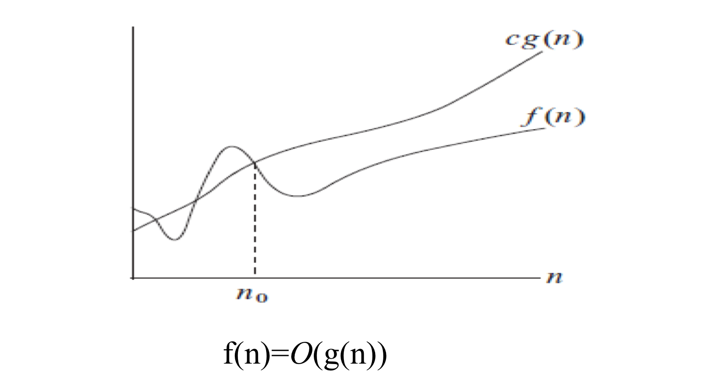
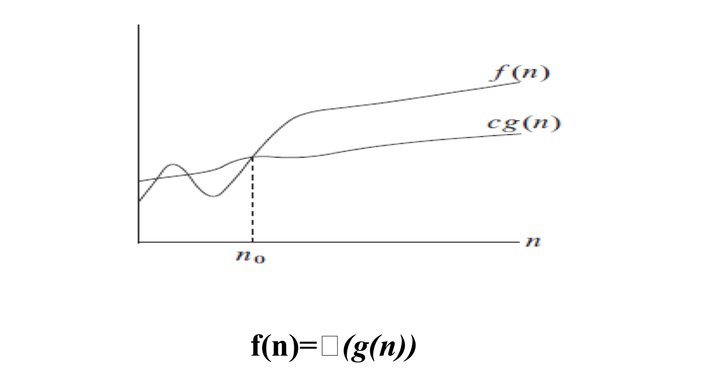
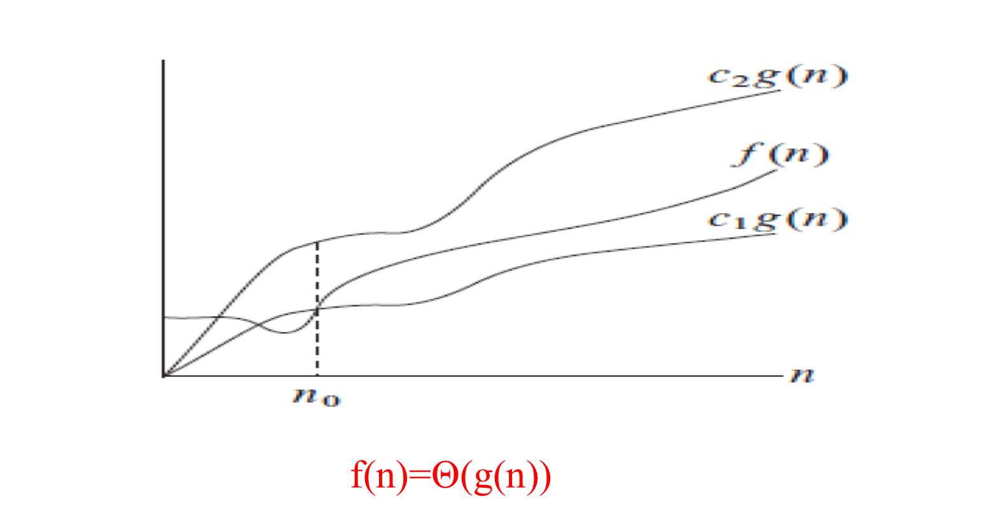

[toc]
# 1. 算法基础

## 1.1 算法的特征

1. 输入：每个算法都必须有输入数据
2. 输出：运行算法的最终处理结果
3. 有限：算法在执行有限步之后终止
4. 确定：算法的每一步都是确定的
5. 可行：算法的每一步必须是可实现的

> 程序 = 数据结构（静态） + 算法（动态）

## 1.2 算法的描述

1. 自然语言描述
2. 流程图（UML）
3. 某种程序设计语言
4. 伪代码

> 伪代码中for循环使用关键字to,如for i = 0 to n;减少的则用downto,步长可添加关键字by进行修改，其余的和c语言类似。

---
## 1.3 算法正确性
利用**循环不变式**，我们可以说明算法正确性  
循环不变式：在每一轮迭代的开始时性质P成立。则称性质P为循环不变式。

利用循环不变式证明算法的正确性的三个步骤：
1. 初始：它在循环的第一轮迭代开始时是正确的；
2. 保持：如果在循环的某一次迭代开始时它是正确的，那么下一次迭代开始时它也应该保持正确；
3. 结束：在循环结束时，算法不变式给出有用的性质，它有利于表明算法是正确的。

---
## 1.4 渐进符号

>  渐进非负函数f(n)：存在$n_0$，使得n >= $n_0$时，f(n) >= 0.

### 1.4.1 几种渐进符号

1. 渐进上界记号(O)

g(n)称为f(n)的渐进上界，记为：f(n)=O(g(n))，当且仅当 **存在** 正常数c和$n_0$,使得当n>=$n_0$时，

$$0 <= f(n) <= c*g(n) 或 0 <= f(n)/g(n)<=c $$

2. 渐进下界记号(Ω)

3. 渐进紧确界(Θ)

f(n) = Θ(g(n)) <==> f(n) = Ω(g(n)) and f(n) = O(g(n))

4. 非紧上界记号(o)

g(n)称为f(n)的非紧上界，记为f(n)=o(g(n))，当且仅当对于 **任意正常数c** ,存在正常数$n_0$,当n>=$n_0$时
$$0 <= f(n) <c*g(n) 或 lim_{n->∞}(f(n)/g(n))=0$$
> 即g(n)可以远超过f(n)，非紧

5. 非紧下界记号(ω)

### 1.4.2 渐进符号的性质

- 传递性
- 自反性
- 对称性
- 转置对称性
---
##  1.5 算法的渐进复杂性分析
算法复杂性：运行算法所需要的计算机资源
- 时间复杂度T(n)：运行算法所需要的时间，n为输入实例规模
- 空间复杂度S(n)：表示运行所需要的额外内存空间，n为输入实例规模
> 我们通常把算法复杂性表示为关于输入实力规模n的函数

算法复杂性分析方法：
1. 经验分析法

   对于算法A,在计算机上运行该程序，输入一系列测试数据，估算算法A所需的计算资源（时间，空间）

2. 渐进复杂性分析法

     对于规模为n的输入实例，运行算法所需计算资源T(n)关于n的变化趋势。

求算法的渐进时间复杂度：计算给定输入实例规模为n时，算法执行的**基本操作**的数量T(n).然后确定T(n)随n增长时的变化趋势。  

> 基本操作的执行时间为某一常数时间，包括：  
> 1. 赋值操作：=
> 2. 算术操作：+,-,*,/
> 3. 逻辑运算：and,or,not,nor
> 4. 关系运算：<,>,!=,==
> 5. 放回运算：return

   当n变大时，T(n)的变化去世该如何确定？  如果当n->∞时
   $$(T(n)-S(n))/T(n) -> 0$$
   则称S(n)为T(n)的渐进估计

   > 通常S(n)一般是T(n)中去掉低阶项后留下的主项，比S(n)简单。
