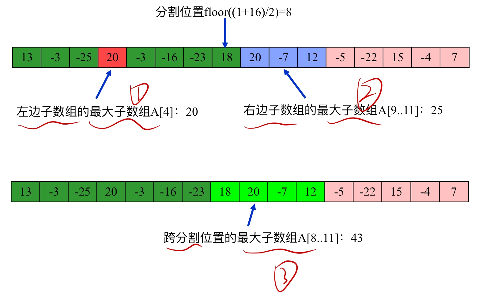

[toc]
# 3. 分治策略


## 3.1 基本步骤

1. **分割**：把原问题分割为若干规模更小的子问题，每个子问题与原问题的类型相同；
2. **递归求解**：递归求出子问题的解。在求解子问题时，如果子问题的规模大不易求解，则将子问题继续分割直至容易求解为止。
3. **合并**：将子问题的解合并为原问题的解。

## 3.2 应用：


### 3.2.1 归并排序

```c
MergeSort(A,p,r){ //对A[p..r]中的元素进行排序
    if(p<r){ //否则问题规模小于2,即子问题中只有一个值，已排好序
        q=(p+r)/2; //确定分割位置r
        MergeSort(A,q,p); //对A[p..q]进行归并排序
        MergeSort(A,q+1,r);  //对A[q+1..r]进行归并排序
        Merge(A,p,q,r); //合并两个已排序子数组
    }
}
```
> 归并排序是一各递归算法；  
> 递归是分治策略的一种方法，分治策略还可以使用非递归法。


### 3.2.2 分治法求最大和子数组问题(Θ(nlgn))  
寻找分割位置，判断左边子数组的最大和、右边子数组的最大和和跨分割位置的最大子数组三值哪个最大。


```c
//计算最大子数组
FIND_MAXIMUM_SUBARRAY(A,low,high){ //输入数组A[low...high]
    if(high == low){ //单元素数组的最大子数组就是本身
        return (low,high,A[low]);
    }
    else{
        mid = (low + high)/2; //获取中点，分割为两个规模小一些的子问题
        (left-low,left-high,left-sum)=FIND_MAXIMUM_SUBARRAY(A,low,mid); //递归计算左最大子数组
        (right-low,right-high,right-sum)=FIND_MAXIMUM_SUBARRAY(A,mid+1,high); //递归计算右最大子数组
        (cross-low,cross-high,cross-sum)=FIND_MAX_CROSSING_SGUBARRAY(A,low,mid,higt); //计算跨中点的最大子数组
        return MAX(left-sum,right-sum,cross-sum); //返回三者中最大值
    }
}

//计算跨分割位置mid的最大子数组
FIND_MAX_CROSSING_SGUBARRAY(A,low,mid,high){ //输入A[low..mid..high]
    left-sum = -100000; //先设置从mid中点向左最大和为负无穷大
    sum = 0; //将mid--的每个数加起来
    for i=mid downto low {
        sum += A[i];
        if(sum>left-sum){ //如果当前和比left-sum大，则更改左侧最大子数组的值和下标
            left-sum = sum;
            max-left = i;
        }
    }
    right-sum = -100000; //右侧同理
    sum = 0;
    for i=mid+1 to high{
        sum += A[i];
        if(sum>right-sum){
            right-sum = sum;
            max-right = i;
        }
    }
    return (max-left,max-right,left-sum+right-sum); //最后将左右相加得到两侧一起的跨分割位置的子数组和
}
```

### 3.2.3 Strassen矩阵乘法方法(Θ($n^{lg7}$))  
建立于矩阵分块乘法基础，同时将每一个块利用strassen算法求得

