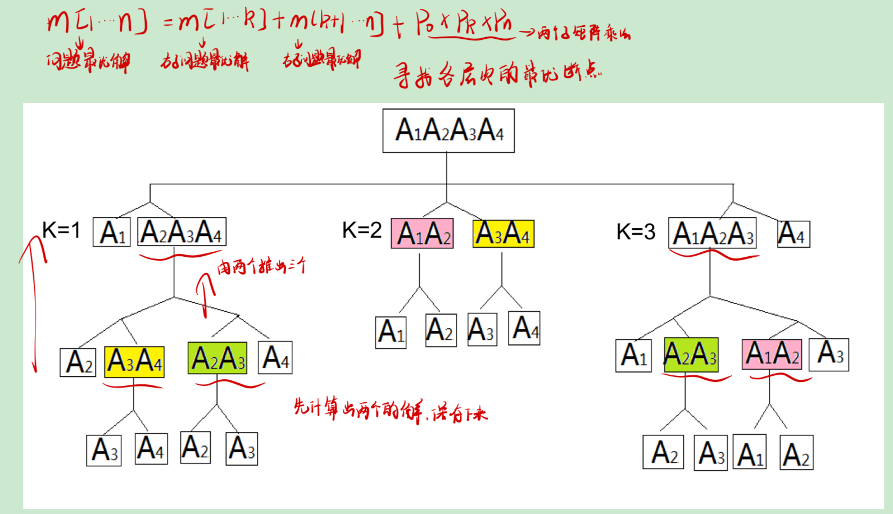
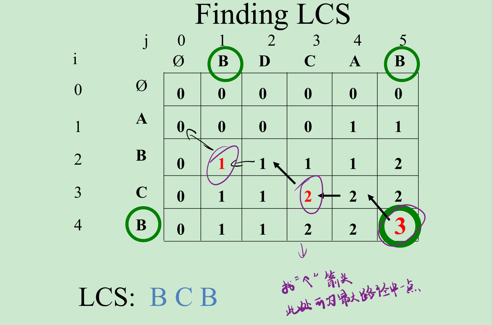

[toc]
# 5. 动态规划

##  5.1 动态规划和分治策略
- 相同之处：动态规划类似于分支策略：将问题划分为若干子问题，然后求解子问题，最后利用子问题的最优解来构造出原问题的最优解。

- 不同之处：分支策略每次划分得到的子问题都被求解，而不管子问题是否已重复求解；动态规划对不同的子问题之求解一次，并将所得到的解保存在表格中，下次遇到相同的子问题只需查表而无需进行重复求解。

## 5.2 步骤
1. 说明问题的最优解具有**最优子结构特征**（最优化问题的最优解可以由子问题的最优解组合得到）
2. 把问题最优解的值用子问题最优解递归表示
3. 自底向上计算最优解的值，并保存各子问题最优解的值及用于构造最优解的信息


## 5.3 应用

### 5.3.1 矩阵链乘问题(O(n^3))
> 背景：给定矩阵$A_1A_2A_3$;$A_1$:30x35,$A_2$:35x15,$A_3$:15x5;  
> $A_1(A_2A_3)$所需的乘法次数为30x35x5+35x15x5=7875;  
> $(A_1A_2)A_3$所需的乘法次数为30x35x15+30x15x5=18000;  
> 可知不同的乘法顺序，所需要的乘法次数不同。

考虑n个矩阵的乘积：$A_1A_2...A_m$,确定最优的乘法顺序（最优括号化方案），使得乘法次数最少。

> 对于$A_1A_2A_3A_4$四个矩阵相乘，所有顺序如下图所示，可知存在冗余子问题，可将少位矩阵相乘后的结果保存用于多位矩阵相乘的计算。


```c
//T(n) = O(n^3)
//从1、2、3、4个（即链长）矩阵相乘开始计算，自底向上求出所有的数据
Matrix-Chain-Order(p){ 
    n = p.length -1;  
    for i=1 to n{ //求解链长为1的子问题，即单个矩阵相乘,即为本身
        m[i,i] = 0; 
    }
    for l=2 to n-1+1 { //求解链长大于1的子问题，即多个矩阵相乘的问题
        for i=1 to n-1{ //子链起点
            j = i+l-1; //子链终点
            m[i,j] = ∞; 
            for k=i to j-1 { //对子链中的每一处进行切割查找最优分割点
                q = m[i,k]+m[k+1,j]+p[i-1]*p[k]*p[j]; 
                if(q<m[i,j]){ //小于之前的乘法次数则更新当前起点为i,链长为l,终点为j的子链的最少乘法次数
                    m[i,j] = q; //记录从i到j的最小乘法次数
                    s[i,j] = k; //记录从i到j的最小乘法次数中的分割位置（i<k<j)
                }
            }
        }
    }
}
```

### 5.3.2 最长公共子序列问题(O(m*n))  

子序列：在序列中去掉若干字符（可并非连续的子序列）所剩余的部分称为该序列的子序列。  
最长公共子序列(LCS)：两个序列的所有公共子序列中长度最长的序列。

c[i,j]=c[i-1,j-1]+1             x[i]=y[j],  
c[i,j]=max(c[i-1,j],c[i,j-1])   x[i]!=y[j]

> !!!c[i,j]是x[0,1,2...i]和Y[0,1,2...j]中的最大公共子序列长度!!!  
> 我们从c[1][1]算到c[2][2]，自底向上最后到c[length(X)][length(Y)]
```c
LCS-LENGTH(X,Y){
    m = length(X);
    n = length(Y);
    //初始化，用于后面的计算，0前缀
    for i=1 to m {
        c[i][0] = 0;
    }
    for j=1 to n {
        c[0][j] = 0;
    }
    for i=1 to m { //从X中第一个开始遍历，每次从Y的第一个遍历到最后
        for j=1 to n {
            if(X[i]==Y[j]){ //若和当前位置相等
                c[i][j] = c[i-1,j-1] + 1; //在c[i-1][j-1]的基础上+1
                s[i][j] = "↖️"; //标明来处
            }
            else { //若和当前位置不相等，则取较大值，并标明来处
                if(c[i-1][j]>=c[i][j-1]){
                    c[i][j] = c[i-1][j];
                    s[i][j] = "⬆️"
                }
                else{
                    c[i][j] = c[i][j-1];
                    s[i][j] = "⬅️"
                }
            }
        }
    }
}
```



### 5.3.3 钢管切割问题

给定一条长度为n的钢条，假设一段长为i的钢条售价为$p_i$。求最优切割方案。

对于长为j的钢条，最优切割方案收益r(j)为
$$r(j) = max_{1<=i<=j-1}\{p_j,r(i)+r(j-i)\}$$

```c
//动态规划求解
NATURAL-CUT-ROD(p,n){ //p[i]为长度为i的钢条的售价，n为钢条长度
    let r[0..n],s[0..n] be new arrary;
    r[0] = 0;
    r[1] = p[1];
    for j=2 to n {
        r[j] = p[j];
        for i=1 to j-1{
            if(r[i]+r[j-1] > r[j]){ //从第i个位置切割如果比原来的售价大
                r[j] = r[i] + r[j-i]; //更新长度为j的钢条最高售价
                s[j] = i; //长度为j的钢条的切割点
            }
        }
    }
    return r,s;
}

//递归求解
CUT-ROD(p,n){
    if(n==0){
        return 0;
    }
    q = -∞;
    for i=1 to n{
        q = max(q,p[i]+CUT-ROD(p,n-i));
    }
    return q;
}
```

### 5.3.4 0-1背包问题(O(n*W))

$$B(n,W) = max\{b_n,+B(n-1,W-w_n),B(n-1,W)\},w_n<=W（放的进）$$
$$B(n,W) = B(n-1,W),w_n>W（放不进去）$$

> B(n,W)为当前背包容量n和价值W,$b_n$为当前物品的价值，$w_n$为当前物品的重量

```c
kNAPSAC-DYNAMIC(*w,W,*b){
    for w=0 to W {
        B[0,w] = 0; //物品个数为0个时
    }
    for i=0 to n {
        B[i,0] = 0; //背包容量为0
    }
    for k=1 to n { //将物品个数从0增加到n
        for w=1 to W { //将背包容量从0加到W
            if(w[k] <= W){ //背包容量大于第k号物品重量
                if(b[k] + B[k-1,w-w[k]] > B(k-1,w)) { //塞入k号物品比不加入k号物品价值大
                    B[k,w] = b[k] + B[k-1,w-w[k]]; //更新背包对于k个物品，容量为w时的最大价值
                    S[k,w] = 1; //设放置数组对应位置为1
                }
                else { //硬塞进入价值不如当初
                    B[k,w] = B[k-1,w]; //取塞入k号物品之前的值
                    S[k,w] = 0; //不放入
                }
            }
            else { //放不进
                B[k,w] = B[k-1,w];
                S[k,w] = 0;
            }
        }
    }
    return B,S;
}
```


### 5.3.5 最优二叉搜素树

给定每个关键值和非关键值的搜索概率，对二叉搜索树进行一次搜索的期望最小时即为最优二叉树。


