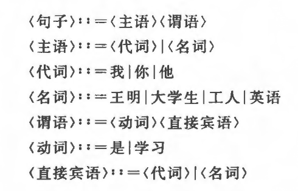
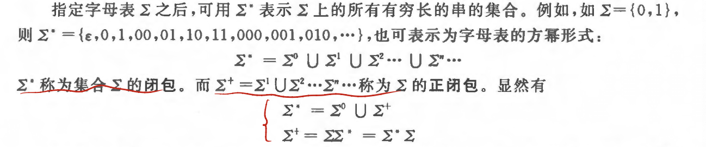

第二章、文法和语言

[toc]

---

一个程序设计语言是一个记号系统，和自然语言一样，他的完整定义应当包括：
- 语法：定义什么样的符号序列是合法的，与符号的含义无关
    > `文法`就是用于阐述语法的一个工具
- 语义
    - 静态语义：一系列限定规则，确定哪些合乎语法的程序是合适的
    - 动态语义：标明程序要做些什么，要计算什么

# 文法的直观概念

文法描述了造句的规则

>   
> 一旦有了一组规则以后，便可用`替换`的方式取推导或产生句子

# 符号和符号串

**字母表**

字母表是元素的非空有穷集合，字母表中的元素称为符号
> 用符号∑表示

**字符串**

由字母表中的符号组成的任何有穷序列称为符号串，例如001110是字母表∑{0,1}上的符号串
> 不包含任何符号的符号串用`ε`表示，|ε|=0

如果莫符号串x中有m个符号，则称其长度位m，表示为|x|=m

**符号串的一些运算**

- 符号串的头尾、固有头和固有尾

对于符号串z=xy，x是z的头，y，是z的尾；如果x非空，那么y是固有尾；如果y非空，那么x是固有头

- 符号串的连接

x,y是符号串，它们的连接xy是吧y的符号写在x符号后得到的符号串

- 符号串的方幂

$x^n$是吧x自身连接n次

- 符号串集合

若集合A中的一切元素都是某字母表上的**符号串**，则称A是该字母表上的符号串集合

两符号串集合之间的乘积就是将两符号串集合中的各个元素进行笛卡尔积连接

# 文法和语言的形式化定义

**规则**

规则：也成了重写规则、产生式或生成式，是形如a->b或a::=b的(a,b)有序对，其中a称为规则的左部，b称规则的右边。这里的->(::=) 读作“定义为”

**文法**

文法G定义为四元组($V_N,B_T,P,S$)

- $V_N$：非终结符（语法实体或变量）
- $V_T$：终结符集合（常量）
- P：规则(a->b)的集合
- S：识别符或开始符
    > 是一个非终结符，至少在一条规则中作为左部出现

> 其中V=$V_N∩V_T$称为文法G的字母表  

**文法G的表示**

很多时候，不用讲文法G的四元组显示的表示出来，而只将产生式写出。一般约定
- 第一条产生式的左部式开始符；
- 用尖括号括起来（或用大写字母）的是非终结符
- 不用尖括号括起来（或小写字母）的是终结符

> 另外还有一种习惯写法，将G写成G[S] ，其中S是开始符

**语言**

由文法G[S]所有的可推导出的句子组成的集合称为文法G[S]的语言L(G)

- ⇒：直接推导
- +/⇒：长度为n(N>=1)的推导
- */⇒：长度为n(n>=0)的推导

> 若L(G1)=L(G2) ，那么称文法G1和G2是等价的

# 文法的类型

乔姆斯基(Chomsky)把文法分为四类，分类的一句在于对`产生式a->b`施加不同的限制

- 0型（短语文法）

    - $a∈(U_N∪U_T)^*$且至少含有一个非终结符
    - $b∈(U_N∪U_T)^*$

- 1型（上下文有关的）
    - $|b|>=|a|$，仅仅S->ε除外
- 2型（上下文无关的）
    - a是一个非终结符
    - $b∈(U_N∪U_T)^*$
- 3型（正规文法）
    - 每一个产生式形如A->aB或A->a，其中A和B都是非终结符，$a∈U_T^*$

4中文法类型的定义都是逐渐增加限制的

# 上下文无关文法及其语法树

上下文无关语法足够描述现今程序设计语言的语法结构，入描述算数表达式、各种语句等。

**语法树**

语法书式一种描述上下文无关文法的句型推导的直观工具，也称推导树

给的文法$G=(V_N,V_T,P,S)$，对于G的任何句型都能构造与之关联的语法树，其满足一下四个条件
- 每个节点都有一个标记，此标记是V的一个符号
- 根的标记是S 
- 若一个结点n至少有一个它自己除外的子孙，并且有标记A，则标记A肯定在$V_N$中
- 若结点n（标记为A）的直接子孙从左到右的次序依次位标记$A_1,A_2...A_k$，那么$A->A_1A_2...A_k$一定是P中的一个产生式

语法树的结果: 从左至右读出推导树的页字节点，得到的句型就是语法树的结果

在推导的每一步a=>b，其中a，b都是句型，都对a中的最左（最右）非终结符进行替换，则称这种推导为最左（最右）推导。
> 最右推导常被称为规范推导，由规范推导得到的句型称为右句型或规范句型

文法的二义性；如果⼀个⽂法存在某个句⼦对应两棵不同的语法树，则说这个⽂法是⼆义的。
> 或者说，若⼀个⽂法中存在某个句⼦，它有两个不同的最左（最右）推导，则这个⽂法是⼆义的
- 不存在⼀个算法，它能在有限步骤内确切判定任给的⼀个⽂法是否为⼆义的
- 所能做的事是为⽆⼆义性寻找⼀组充分条件（对文法中的推导式进行挑选） 

# 句型的分析

句型的分析就是识别一个字符串是否为某文法的句型

- 自上而下方法: 从⽂法符号开始，将它作为语法树的根，向下逐步建⽴语法树，使语法树的末端结点符号串正好是输⼊符号串 
- 自下而上方法：从输⼊符号串开始，以它作为语法树的末端结点符号串，⾃下⽽上地构造语法树 。

## 自上而下方法

- 最左推导：因为对符号串的扫描是从左到右
- 存在要被替换的最左非终结符存在多种替换方法时该如何选择
    - 回溯：从所有可能中挑选一种，如果发现错误，则退回去试另外的方法
    - 第四章...

## 自下而上方法

⾸先从输⼊符号串开始。扫描cabd，从中寻找⼀个⼦串，该⼦串与某⼀产⽣式的右端相匹配

⾃下⽽上的分析⽅法中，在分析程序⼯作的每⼀步，都是从当前串中选择⼀个⼦串，将它归约到某个⾮终结符，暂且把这个⼦申称为“可归约串”。问题是如何选择这个“可归约子串”?

令G是⼀个⽂法，S是⽂法的开始符号，abc是⽂法G的⼀个句型。
- 短语： 短语是指一组能够由一个非终结符推导出来的符号序列。(可推导n次)
> 任一子树的叶子节点序列
- 直接短语：指可以通过单个推导规则(一次推导)从一个非终结符直接生成的符号序列。
> 二级子树的叶子节点的序列（其叶子节点不能再有子树）
- 句柄：一个右句型的直接短语称为该句型的句柄 
> 右句型：最右推导产生的句型
> 对于无二义文法，一个右句型的唯一句柄是其所有直接短语中最左边的那一个

[csdn解释](https://blog.csdn.net/IT_DREAM_ER/article/details/53612006)

# 有关文法实际应用的一些说明

- 限制文法中不得含有**有害规则**和**多余规则**
    - 有害规则：形如`U->U`的产生式，会引起二义性
    - 无用规则：文法中无法推导出句子的规则
        - 不可到达的：文法中某些非终结符不在任何规则的右部出现
        - 不可终止的：不能从它推导出终结符号来

- ε规则会使得有关文法的一些讨论和证明变得复杂
    > 形如`A->ε`的产生式
