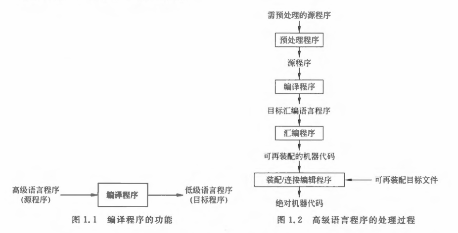

[toc]

# 引入

编译程序是一种语言翻译程序，其把一种语言（**源语言**）书写的程序翻译成另一种语言（**目标语言**）书写的**等价程序**

- 预处理程序和汇编程序：较为简单的翻译程序
- 编译程序：较为复杂的翻译程序
    - 需要对源程序进行分析
    - 识别源程序的语法结构信息，理解源程序的语义信息，反馈相应的出错信息
    - 生成语义上等价于源程序的目标程序

# 编译过程

$$字符流形式的源程序 \overset{词法分析}{\rightarrow} 单词流形式源程序 \overset{语法分析}{\rightarrow} 源程序语法树 $$ 
$$\overset{语义分析}{\rightarrow} 中间代码 \overset{代码优化}{\rightarrow} 优化过的中间代码 \overset{目标代码生成}{\rightarrow} 目标代码$$

1. 词法分析: 将源程序转换为单词序列

- 从左到右一个一个字符地扫描字符流源程序
- 从中识别出有词法意义的`单词(符号)`  
    - 返回单词的**类别**和单词的**值**
- 如果发现错误则提示词法错误信息

2. 语法分析

- 在词法分析的基础上将**单词序列**分解成各类**语法短语**(如“程序”，“语句”，“表达式”等)
- 再用这种语法短语表示成`语法树`。

>  例：

3. 语义分析

审查源程序有无语义错误
- 主要是静态语义分析，例如对类型的检查（会自动类型转换）
- 不符合语义规则时给出语义错误信息

4. 中间代码生成

将源程序变成一种内部表示形式，即`中间代码`
- 很多编译器采用了一种近似“三地址指令”的“四元式”中间代码
    - 其形式为$（运算符，运算对象1，运算对象2，结果）$

5. 代码优化

对中间代码进行变换，使目标代码更高效

6. 目标代码生成

将中间代码变换成特点机器上的绝对指令代码或可重定位的指令代码或汇编指令代码
