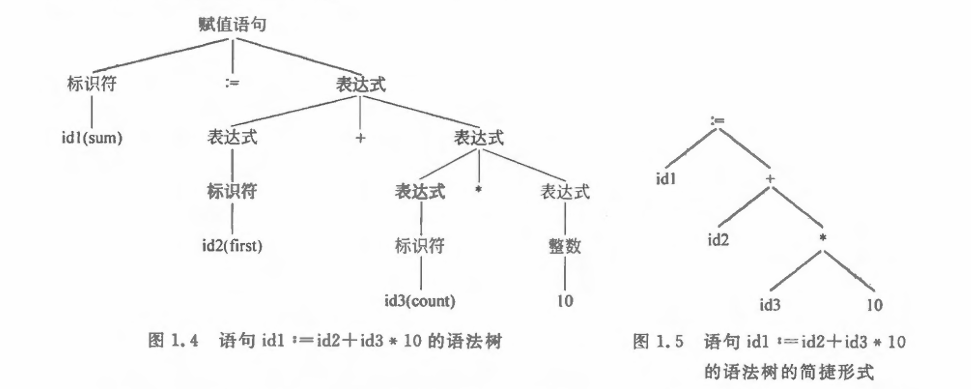

[toc]
# 什么是编译程序
一个编译程序就是一个语言翻译程序，其把一种语言（称作`源语言`）书写的程序翻译成另一种语言（称作`目标语言`）书写的`等价程序`

# 汇编过程和编译程序的结构

## 编译过程概述

- 词法分析

从左到右一个一个字符地读入源程序，对构成源程序的`字符流`进行扫描和分解，从中识别出一个个`单词（符号）`  

> 例： 

- 语法分析

语法分析的任务是在词法分析的基础上将`单词序列`分解成各类`语法短语`，如“程序”，“语句”，“表达式”等。再用这种语法短语表示成`语法树`。

>  例：

- 语义分析

审查源程序有无语义错误（类型审查，自动类型转换）

- 中间代码生成

将源程序变成一种内部表示形式，即`中间代码`

> 很多编译器采用了一种近似“三地址指令”的“四元式”中间代码，其形式为$（运算符，运算对象1，运算对象2，结果）$

- 代码优化

对中间代码进行变换，使目标代码更高效

- 目标代码生成

将中间代码变换成特点机器上的绝对指令代码或可重定位的指令代码或汇编指令代码
