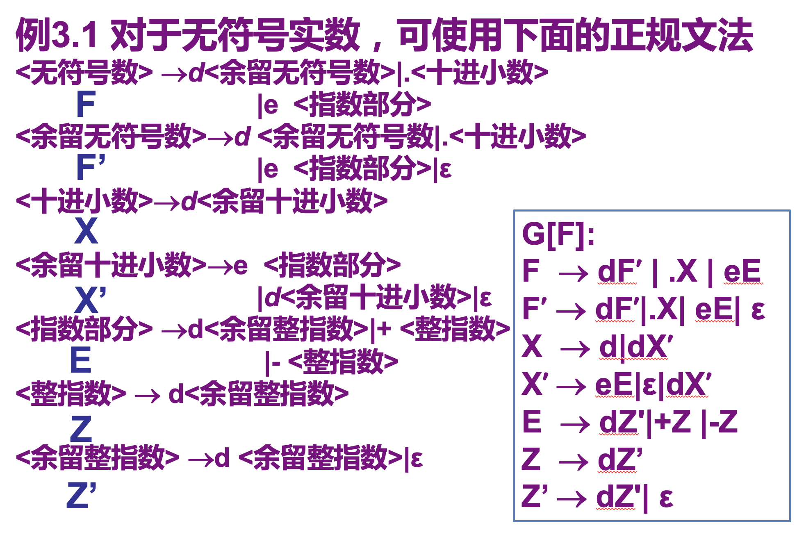
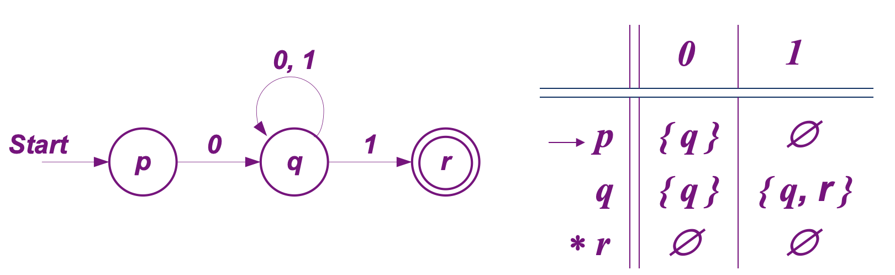
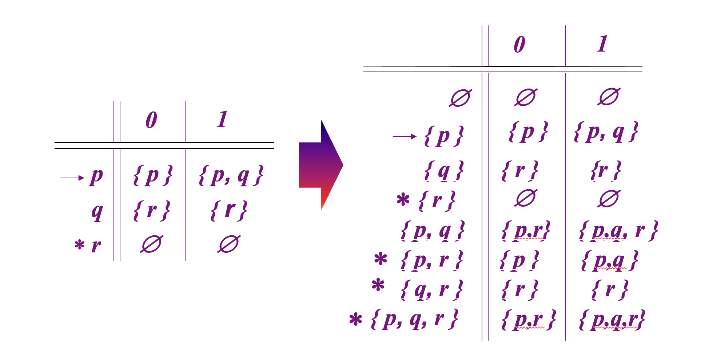

第三章、词法分析

[toc]

词法分析是编译的第一个阶段，主要任务是
- 从左至右逐个字符地对源程序进行扫描
- 识别出具有词法意义的单词，用于语法分析


# 1. 词法分析程序设计


## 1.1 词法程序的输出

1. 过程

词法分析程序在识别出下⼀个单词
- 验证其词法正确性之后，词法分析程序将结果以***单词符号***的形式发送⾄语法分析程序以回应其请求
- 若在单词识别过程中发现词法错误，则返回出错信息


2. 单词分类

单词符号一般可以分为以下5类
- 关键字，也称保留字
- 标识符，⽤来表⽰各种名字，如常量名、变量名和过程名等。
- 常数，各种类型的常数
- 运算符
- 界符，如逗号、分号、括号等。

3. 输出形式

词法分析程序所输出的单词符号可以采⽤以下⼆元式表⽰：
$$(单词种别，单词⾃⾝的值)$$
- 单词的种别是语法分析需要的信息（可以用int型数据代替）
- 单词⾃⾝的值则是编译其他阶段需要的信息（自身的值可以用指针指向）

## 1.2 接口

词法分析程序和语法分析程序的接口方式: 

1. 利用中间文件

词法分析⼯作可以是独⽴的⼀遍
- 把字符流的源程序变为单词序列，输出到⼀个中间⽂件
- 这个⽂件作为语法分析程序的输⼈⽽继续编译过程

2. 子程序

将词法分析程序设计成⼀个⼦程序
- 每当语法分析程序需要⼀个单词时，则调⽤该⼦程序
- 词法分析程序每得到⼀次调⽤，便从源程序⽂件中读⼊⼀些字符，直到识别出⼀个单词


## 1.3 PL/0编译程序中的词法分析程序

本节以PL/0编译程序为背景，介绍⼀个词法分析程序的设计实例


可将PL/0语⾔的单词分为保留字、运算符、标识符、⽆符号整数和界符5个⼤类，以下是针对这5类单词的⼀种EBNF描述：
```text
<无符号整数> ::= <数字>{<数字>}
<标识符> ::= <字母>{<字母>|<数字>}
<字母> ::= a|b|...|X|Y|Z
<数字> ::= 0|1|...|8|9
<保留字> ::= const|var|procedure|begin|end|odd|if|then|call|while|do|read|write
<运算符> ::= +|-|*|/|=|#|<|<=|>|>=|:=
<界符> ::= (|)|,|;|.
```
> 保留字、运算符和界符这⼏类各⾃仅包含有限个单词符号，可用类似于枚举的形式表示

PL/0语法分析程序在需要读取下⼀个单词时，就调⽤`getsym()`，返回下⼀个单词符号。
- 除标识符和⽆符号整数外，其他单词符号只包含单词种别的信息
- 标识符和⽆符号整数的单词符号包含单词种别和单词⾃⾝的值两个部分


PL/0编译程序定义3个全程变量来传递单词种别和单词⾃⾝的值
1. 通过全局变量`sym`传递单词种类：`enum symbol sym`
2. 通过全局变量`id`传递标识符单词自身的值，即标识符的名字：`char id[max_length+1]`
3. 通过全局变量`num`传递无符号整数单词自身的值，即它的整数值：`int num`


`getsym()`逐个读取下⾯的字符，然后将它们拼成下⼀个有意义的单词，返回相应的单词符号。下图描述了PL/0语⾔的词法规则，可⽤于指导单词识别的过程。


- 在识别字母数字串的单词后如何区分是标识符还是保留字。常采取的方法是预设⼀个保留字表，通过查表来确定是否保留字
- 在识别双符号运算符之类的单词时，要注意到可能需要进⾏字符退还


# 2. 单词的形式化描述工具

可使用以下方法描述单词


## 2.1 正规文法


正规⽂法也称为$3$型⽂法$G=(V_N,V_T,S,P)$，其$P$中的每⼀条规则都有下述形式: 
- $A \to aB$或$A \to a$
- 其中$A,B \in V_N，a \in V_T^*$  
正规⽂法所描述的是$V_T$上的正规集

下图为使用正规文法描述无符号实数


## 2.2 正规式（正规表达式）

正规式使用代数运算来描述如何构造一个正规语言

设字母表为$A$，辅助字母表$B=\{\emptyset , \epsilon , | , * , ( , ) \}$。
1. $\epsilon$和$\emptyset$必都是$A$上的正规式，它们所表⽰的正规集分别为$\{\epsilon \}$和$\emptyset$。
2. 任何$a \in A$，$a$是$A$上的⼀个正规式，它所表⽰的正规集为$\{a\}$。
3. 假定$\{e_1 \}$，和$\{e_2 \}$都是$A$上的正规式，它们所表⽰的正规集分别为$L(e_1)$和$L(e_2)$，那么$(e_1),e_1|e_2,e_1 \cdot e_2,e_1^*$也都是正规式，它们所表⽰的正规集分别为$L(e_1),L(e_1) \cup L(e_2),L(e_1)L(e_2),(L(e_1))^*$
4. 仅由有限次使⽤上述3个步骤⽽定义的表达式才是$A$上的正规式，仅由这些正规式所表⽰的符号串的集合才是$A$上的正规集。

其中
- `|`: 读为“或”（也有用“+”代替“｜”的）
- `·` : 读为“连接”，一般省略不写
- `*`: 读为“闭包”（即任意次有限次的自重复连接）
> 不致混淆时，括号可省去，规定优先级为$* > \cdot > |$  
> $*,\cdot ,|$都是左结合的  


若两个正规式$e_1,e_2$所表示的正规集相同，则说$e_1,e_2$等价，写作$e_1 = e_2$

正规式服从的代数规律：
1. $r|s = s|r$
2. $r|(s|t) = (r|s)|t$
3. $(rs)t = r(st)$
4. $r(s|t) = rs|rt$
5. $\epsilon r=r, r \epsilon = r$
6. $r|r=r$


## 2.3 正规文法和正规式的等价性

正规文法和正规式的等价性：
- 对任意⼀个正规⽂法，存在⼀个定义同⼀个语⾔的正规式
- 反之，对每个正规式，存在⼀个⽣成同⼀个语⾔的正规⽂
> 正规式中，没有非终结符，所有非终结符需要用终结符+`*/|`得到

1. 正规式2正规文法


2. 正规文法2正规式


# 3. 单词的形式化识别工具: 有穷自动机


引入有穷⾃动机理论，是为词法分析程序的⾃动构造寻找特殊的⽅法和⼯具

1. 有穷自动机的定义

有穷⾃动机(有限⾃动机)
- 作为⼀种识别装置，能准确地识别正规集
- 即可自动识别
    - 正规⽂法所定义的语⾔
    - 和正规式所表⽰的集合


2. 有穷自动机的五要素

- 有限状态集$Q$
- 有限输入符号集$\Sigma$
- 转移函数$f$
- 一个开始状态$q_0$
- 一个终态集合$F$


## 3.1 确定的有穷自动机(DFA)

1. 定义

一个有穷自动机DFA(Deterministic Finite Automata)是一个五元组
$$M=(Q,\Sigma ,f,q_0,F)$$
- $Q$: 有限状态集，每个元素表示一个状态
- $\Sigma$: 有穷字母表，每个元素称为一个输入符号
- $f$: 转换函数，$f(q_i,a)=q_j(q_i,q_j \in Q,a \in \Sigma)$，输入当前状态和输入字符，输出下一个状态
- $q_0 \in Q$: 唯一的初态
- $Z \subseteq Q$: 终态集，终态也称为可接受状态或结束状态

2. 特点

确定性：从一个状态出发，当看到某个符号时，下一个状态是确定的


### DFA的表示


1. 转换图表示
- 假定DFAM含有m个状态，n个输⼈符号
    - 那么这个状态图含有m个结点
    - 每个结点最多有n个弧射出
- 整个图含有唯⼀⼀个初态结点和若⼲个终态结点
    - 初态结点冠以"$\Rightarrow$"
    - 终态结点⽤双圈表⽰
- 若$f(q_i,a)=q_j$，则从状态结点$q_i$到状态结点$q_j$画标记为$a$的弧。


2. 转移表(矩阵)表示
- 该矩阵的⾏表⽰状态，列表⽰输⼈符号
- 矩阵元素表⽰相应状态和输⼊符号将转换成的新状态
- ⽤“$\rightarrow$”标明初态；否则第⼀⾏即是初态
- 终态⾏用$*$表示


<!-- 若$t \in \Sigma ^*,f(S,t)=P$，其中$S$为$DFA M$的开始状态，$P \in Z$，$Z$为终态集。则称$t$可为$DFA M$所接受（识别）。 -->
<!-- > 即对于$\Sigma ^*$中的任何符号串$t$，若存在⼀条从初态结点到某⼀终态结点的道路，且这条路上所有弧的标记符连接成的符号串等于$t$，则称$t$可为$DFA M$所接受，若$M$的初态结点同时又是终态结点，则空字可为$M$所识别（接受）。 -->
<!---->
<!---->
<!-- 为了描述一个符号串$t$可被$DFA M$所接受，需要扩充转换函数 -->
<!-- - 设$Q \in K$，函数$f(Q,\epsilon )=Q$ -->
<!-- > 即如果输入符号是空串，则仍停留在原来的位置上 -->
<!-- - 若一个输入符号串$t$（可表示为$t_1t_x$，其中$t_1 \in \Sigma,t_x \in \Sigma ^*$），则有$f(Q,t_1t_x)=f(f(Q,t_1),t_x)$ -->
<!---->
<!-- $DFA M$所能接受的符号串的全体记作$L(M)$ -->
<!---->
<!-- 结论：$\Sigma$上的一个符号串集合$V \subseteq \Sigma ^*$是正规的，当且仅当存在一个$\Sigma$上的确定有穷自动机$M$，使得$V = L(M)$ -->


## 3.2 非确定的有穷自动机(NFA)


 1. 定义

一个不确定的有穷自动机$M$是一个五元组：
$$M=(Q,\Sigma ,f,q_0,F)$$
- $Q$: 有穷集合，每个元素表示一个状态
- $\Sigma$: 有穷字母表，每个元素称为一个输入符号
- $f$: 一个从$K times \Sigma ^*$到$K$的全体子集的映像，即$K \times \Sigma ^* \to 2_K$，其中$2^K$表示$K$的幂集
> 即对于同一当前状态和字符输入，存在多个输出与之对应，存在不确定状态
- $q_0 \in K$: 非空初态集
- $F \subseteq K$: 终态集

2. 特点

不确定性：
- 在看到某个符号时，跳转到多个状态
- 不读入符号也可以跳转


### 表示

使用转移图和转移表表示


⼀个含有m个状态和n个输⼈符号的NFA可表⽰成⼀张状态转换图
- 这张图含有m个状态结点，每个结点可射出若⼲条箭弧与别的结点相连接，每条弧⽤$\Sigma ^*$中的⼀个串作标记
- 整个图⾄少含有⼀个初态结点以及若⼲个终态结点。




显然DFA是NFA的特例。对于每个$NFA M$，存在⼀个$DFA M'$，使得$L(M) = L(M')$。

对于任何两个有穷⾃动机$M$和$M'$，如果$L(M)=L(M')$，则称$M$与$M'$是等价的


## 3.3 DFA/NFA的语言

1. 路径$\pi$的引入


DFA的转换图(有向图)中的路径(path)$\pi$简记为该路径上所经过状态的组成的字符串
$$\pi = q_iq_j...q_n$$
- $q_0$称为路径的起点，计作$start(\pi)$
- $q_n$称为路径的终点，计作$end(\pi)$
- 路径$\pi$(诱导出)的字符串: 路径中每条边上的字符按其路径的顺序连接而成的字符串，记作$transcript(\pi)=a_1a_2…a_k…a_n$


2. NFA/DFA的语言

记号$p \overset{w}{⇝} q$表示DFA的转移图中存在一条路径$\pi$满足以下条件
- $start(\pi) = p$
- $end(\pi) = q$
- $transcript(\pi) = w = a_1a_2...a_n$  

符号串$w = a_1a_2...a_n$被DFA接受当且仅当在其转移图中$\exist s \in F,q_0 \overset{w}{⇝} s$


$NFA/DFA \quad D = (Q,\Sigma,f,q_0,F)$的语言定义为
$$L(D) = \{w | \exist s \in F,q_0 \overset{w}{⇝} s\}$$


即，对于$\Sigma ^*$中的任何⼀个串$t$，若存在⼀条从某⼀初态结点到某⼀终态结点的道路，且这条道路上所有弧的标记字依序连接成的串（不理睬那些标记为$\epsilon$的弧）等于$t$，则称$t$可被识别


## 3.4. NFA转换为等价的DFA


定理1: 设L为⼀个由不确定的有穷⾃动机接受的集合，则存在⼀个接受L的确定的有穷⾃动机

子集法：为⼀个NFA构造相应的DFA的基本想法是让DFA的每⼀个状态对应NFA的⼀组状态


### 两种运算

介绍⼦集法之前先定义状态集合$I$的两个运算：

1. 闭包运算

状态集合$I$的$\epsilon-闭包(\epsilon -closure(I))$是一个新的状态集$I'$，包含
- $I$中任何状态$S$经任意条$\epsilon$弧能到达的状态的集合
- $I$的任何状态$S$ 
    > 输入为$\epsilon$时，自动机将停留在原来的状态

2. 转换运算

状态集合$I$的$a$弧转换$move(I,a)$是一个新的状态集合$I'$，包含
- 从$I$中的某一状态经过一条$a$弧而到达的状态的集合 


$$move(I,a) = f(q_1,a) \cup f(q_2,a_ \cap ... \cap f(q_j,a)，q_1,q_2...q_j \in I$$


### 子集法


从开始状态出发，逐步去发现那些能到达的状态
1. 从$q_0$开始，将$\epsilon-clouser(q_0)$加入$Q_D$，并标记为未标记状态
> $Q_D$中成员有两类：
> - 第一类是其后继状态已求过的, 称为已标记的
> - 第二类状态是加入$Q_D$后，其后继状态还没来得及求，称为未标记的；  
>
> 后继状态：对所有的输入符号$a$，状态$I$的后继状态定义为$\epsilon-clouser(move(I,a))$
2. 依次求$Q_D$中未标记状态的后继状态，将其状态更改为标记状态，并且将新出现的状态加入$Q_D$中;
    
3. 重复这一过程直到$Q_D$中所有状态已标记，且没有新的状态出现



- 将未标记的状态写在第一列
- 求未标记状态的后继状态时，将其对应不同输入符号得到的新状态写在对应位置
    - 未标记状态指定行
    - 不同输入符号指定列
- 如果新状态未标记，则在第一列添加该状态
- 包含$q_0$开始符号的记为新的开始状态，用$\rightarrow$标出
- 包含终结状态集合$F$元素的记为新的终结状态，用$*$标出


## 3.5 确定有穷自动机的化简

⼀个有穷⾃动机可以通过
- 消除⽆⽤状态
- 合并等价状态  
转换成⼀个与之等价的状态数最少的的有穷⾃动机

###  消除无用状态 

⽆⽤状态：
- 从该⾃动机的开始状态出发，任何输⼊串也不能到达的那个状态
- 或者从这个状态没有通路到达终态


### 合并等价状态

两个状态s和t等价的条件是一下两个
- 一致性条件：状态s和t必须同时为可接受状态或不可接受状态。
- 蔓延性条件：—对于所有输⼈符号，状态s和状态t必须转换到等价的状态⾥
> 如果有穷⾃动机的状态s和t不等价，则称这两个状态是可区别的。

对策：分割法

把⼀个DFA（不含多余状态）的状态分成⼀些不相交的⼦集，使得任何不同的两个⼦集的状态都是可区别的，⽽同⼀⼦集中的任何两个状态都是等价的


1. 首先将M的状态分为两个子集
- ⼀个由终态（可接受态）组成
- 另⼀个由⾮终态组成

2. 寻找⼀个⼦集和⼀个输⼈符号使得该⼦集中的状态可区别
- 对于同一个子集中的状态
- 一些状态得到的输出如果属于**当前被划分子集**中的同一个子集内，那么这些元素仍是不可区分的
- 否则是可区分的，将可区分的元素分裂至多个子集中。


# 4. 正规式和有穷自动机的等价性

由以下两点说明正规式与有穷自动机的等价性：
- 对于$\sum$上的$NFA \quad M$，可以构造一个$\sum$上的正规式$r$，使得$L(r) = L(M)$
- 对于$\sum$上的每个正规式，可以构造一个$\sum$上的$NFA \quad M$，使得$L(M) = L(r)$

## 从有穷自动机构造正规式

1. 在M的状态转换图上加进两个结点，⼀个为x结点，⼀个为x结点
- 从x节点⽤$\epsilon$弧连接到M的所有初态结点
- 从M的所有终态结点⽤$\epsilon$弧连接⼀个为y结点  
从x结点到y结点。形成⼀个与M等价的M'，M'只有⼀个初态x和⼀个终态y。

2. 逐步消去M’中的所有结点，直⾄只剩下x和y结点。在消去过程中，逐步⽤正规式来标记弧。消去规则如下


## 从正规式到有穷自动机

语法制导方法：按照正规式的语法结构指引构造过程，⾸先将正规式分解成⼀系列⼦表达式，然后使⽤如下规则r构造NFA，对r的各种语法结构的构造规则具体描述如下：


# 5. 正规文法和有穷自动机的等价性

采用下面的规则可将正规文法$G$直接构成一个有穷自动机$NFA \quad M$，使得$L(M)=L(G)$
- $M$的字母表与$G$的终结符集相同
- 为$G$中的每个⾮终结符⽣成$M$的⼀个状态（不妨取成相同的名字），$G$的开始符$S$是$M$的开始状态$S$
- 增加⼀个新状态$Z$，作为$M$的终态
- 对$G$中的形如$A \to tB$的规则（其中$t$为终结符或$\epsilon$，$A$和$B$为⾮终结符的产⽣式），造$M$的⼀个转换函数$f(A,t) = B$
- 对$G$中形如$A \to t$的产⽣式，构造$M$的⼀个转换函数$f(A,t)=Z$。

# 6. 词法分析程序的自动构造工具

在本章所介绍的形式模型--有限⾃动机、正规表达式以及正规⽂法基础上容易实现词法分析程序的⾃动构造。

通常是⽤正规表达式或正规⽂法作为词法规则的形式描述，然后通过转化为等价的有限⾃动机来设计相应的单词识别过程

正规表达式为例，典型的过程可能是：
1. 每⼀种别的单词均对应⼀个正规表达式，所有正规表达式以⽂本⽅式作为⾃动构造⼯具的输⼊。
2. ⾃动构造⼯具将每⼀个正规表达式转换成有限⾃动机的形式，⽐如使⽤3.5节中的⽅法将正规表达式转换成NFA。
    1. 必要时，⾃动构造⼯具会将有限⾃动机确定化，⽐如使⽤3.4.3节中的⽅法得到等价的DFA。
    2. 必要时，⾃动构造⼯具会将有限⾃动机最⼩化，⽐如使⽤3.4.4节中的⽅法得到等价的拥有状态数⽬最少的DFA。
3. ⾃动构造⼯具按照⼀定的控制策略⽣成词法分析程序中扫描程序的代码
    1. 该扫描程序可以选择对每⼀单词种别所对应的有限⾃动机进⾏模拟运⾏
    2. 并从当前输⼈符号序列中识别下⼀个单词
4. 然后返回相应的单词符号。


通常，单词符号所采⽤的数据结构也需要由使⽤者来给定，连同每⼀单词种别对应的正规表达式⼀同作为⾃动构造⼯具的输⼊；单词符号中的单词种别⼀般会由使⽤者预先设定。另外，⼀些⼯具会按照描述的先后次序以及可识别单词的最⼤长度等来确定内部控制策略，这些约定通常也要明确告知使⽤者


基于这种⽅法来构造词法分析程序的⼯具很多，本节主要介绍⾃动构造⼯具lex。

lex⼯具的功能是读⼈⽤户编写的⼀个lex描述⽂件，⽣成⼀个名为lex.yy.c的C源程序⽂件。lex.yy.c中包含⼀个核⼼h函数yylex（），它是⼀个扫描⼦程序，读⼊源程序的字符流，识别并返回下⼀个单词符号，如图3.15所⽰


- lex描述⽂件中包含针对每⼀类词法单元的规则。规则由正规表达式和C语⾔代码两部分组成。


## lex描述文件中使用的正则表达式

## lex描述文件的格式


lex描述⽂件由3个部分组成，各部分之间被只含%%的⾏分隔开：
```lex
辅助定义部分
%%
规则部分
%%
⽤户⼦程序部分
```

1. 辅助定义部分

包含正规表达式宏名字的声明以及开始条件的声明。它们可能出现在规则部分的正规表达式中，⽤法见3.7.1节

声明正规表达式宏名字的格式为`宏名字 正规表达式` 

- 开始条件


开始条件声明开始于%Start(缩写为%s,%S)，后跟一个名字列表，每个名字代表一个开始条件。

开始条件可以在规则的活动部分使用BEGIN激活。直到下一个BEGIN执行时，拥有给定开始条件的规则被激活，而不拥有开始条件的规则不被激活

每个开始条件表示不同的上下文

2. 规则部分

正规表达式必须从第⼀列写起，⽽结束于第⼀个⾮转义的空⽩字符。这⼀⾏的剩余部分即为动作。动作必须从正规式所在⾏写起。当某条规则的动作超过⼀条语句时，必须⽤花括号括起来

一条规则由两部分组成：`正规表达式 动作` 

- 如果动作部分为空，则匹配该正则表达式的输入字符流会被直接丢弃；否则会执行所匹配正规表达式后的动作
- 输入字符流中不与任何规则中的正规是匹配的串会被默认为将被照抄到输出⽂件；

动作中可以⽤到yytext、yyleng等变量。其中，yytext指向当前正被某规则匹配的字符串；yyleng存储yytext中字符串的长度

此外，动作中还允许包含特定的指导语句或函数，如ECHO、BEGIN、REJECT、yymore（）、yyless（n）、unput（c）、input（）等。技术细节可参考有关lex的技术⽂档。


在辅助定义部分和规则部分，任何未从第⼀列开始的⽂本内容，以及被％（和％｝括起来的部分，将被复制到lex.yy.c⽂件中（不包括%｛｝）

规则部分，出现在第⼀条规则之前的从第⼀列开始的或被%｛和%｝括起来的部分⾥可以声明扫描⼦程序yylex（）的局部变量，以及每次进⼈yylex（）时执⾏的代码

在辅助定义部分中，第⼀列开始的注释（即始于/*的⾏）也将被复制，直到遇到下⼀个1。但规则部分中不可以这样。

最后，⽤户⼦程序部分中的调⽤扫描⼦程序或被扫描⼦程序调⽤的所有C语⾔函数将被原样照抄到lex.yy.c⽂件中。

，当遇到⽂件结尾时，词法分析程序将⾃动调⽤yywrap（）来确定下⼀步做什么。如果yywrap（）返回0，那么就继续扫描；如果yywrap（）返回1，那么就认为对输⼈串的处理已结束。lex库中的yywrap（）标准版本总是返回1。⽤户可以根据需要在⽤户⼦程序部分写⼀个⾃⼰的yywrap（），它将取代lex库中的版本。


## lex的使用

```bash
lex <file.l>
# 会产生文件lex.yy.c

cc -o outputfilename lex.yy.c -ll
# 使用编译器cc对lex.yy.c进行编译，-o 指明可执行文件的名字，-ll是lex库文件的选项

./outputfilename < <file.l>
# 执行outputfilename，输入参数为文件<file>中的文本
```

## 与yacc的接口约定

yacc产⽣的分析⼦程序在申请读⼊下⼀个单词时会
- 调⽤yylex（）
- yylex（）返回⼀个单词符号，并将相关的属性值存⼈全局量yylval。

为了联⽤lex和yacc，需要在运⾏yacc程序时加选项-d，以产⽣⽂件y.tab.h，其中会包含在yace描述⽂件中（由%tokens定义）的所有单词种别。⽂件y.tab.h将被包含在lex描述⽂件中。
