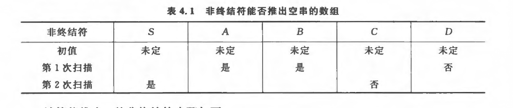
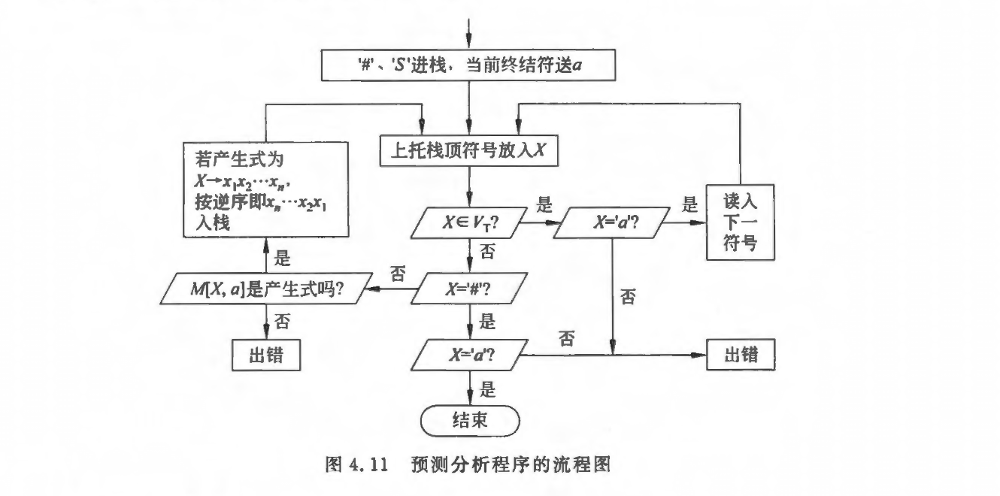
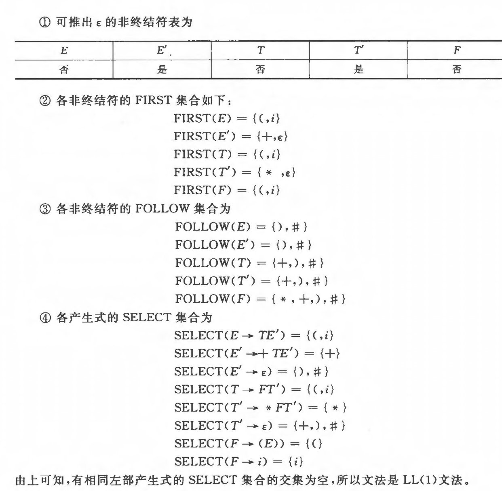
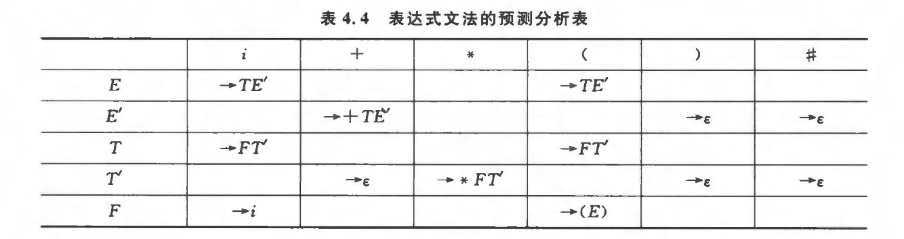
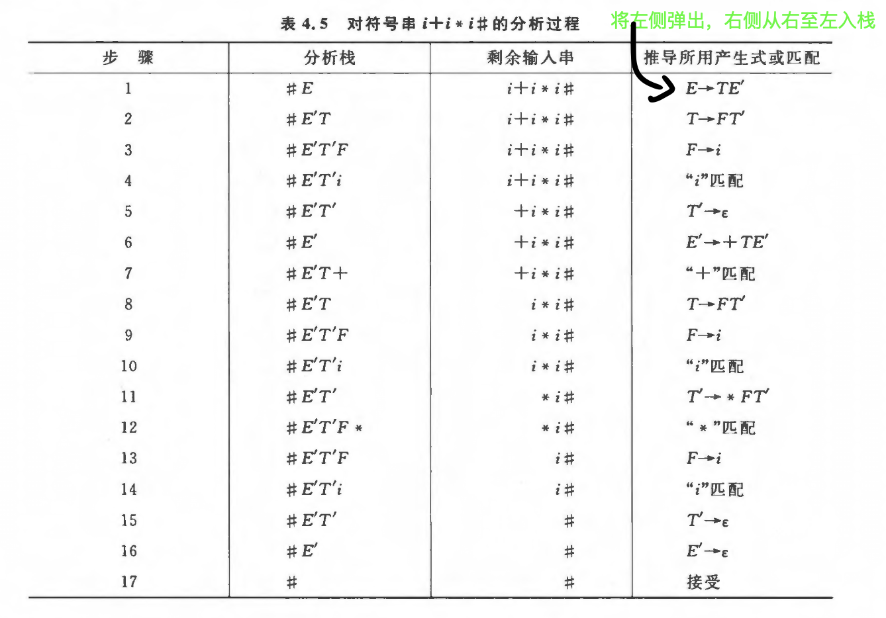

第四章、自顶向下语法分析方法

[toc]

语法分析是编译程序的核⼼部分。

语法分析的作⽤: 识别由词法分析给出的单词符号串是否是给定⽂法的正确句⼦（程序）。

语法分析常⽤的⽅法可分为两类：
- ⾃顶向下分析
- ⾃底向上分析  

虽然语法分析可以通过
- 确定分析
- 者不确定分析  
来实现，但在实际的编译器构造中，⼏乎都是采⽤确定分析⽅式，不确定分析仅具有理论价值。

本章主要介绍⾃顶向下的确定分析。在第5、6章中，分别介绍两种确定的⾃底向上分析⽅法：算符优先分析和LR分析

⾃顶向下分析⽅法也称⾯向⽬标的分析⽅法，也就是从⽂法的开始符号出发企图推导出与输⼈的单词符号串完全相匹配的句⼦，若输⼊串是给定⽂法的句⼦，则必能推出，反之必然出错。

⾃顶向下的确定分析⽅法需对⽂法有⼀定的限制，但由于实现⽅法简单、直观，便于⼿⼯构造或⾃动⽣成语法分析器，因⽽仍是⽬前常⽤的⽅法之⼀。⽽⾃顶向下的不确定分析⽅法是带回溯的分析⽅法，这种⽅法实际上是⼀种穷举的试探⽅法，效率低，代价⾼，因⽽极少使⽤，仅在4.4节中粗略介绍。


# 确定的自顶向下分析方法

确定的⾃顶向下分析⽅法，是从⽂法的开始符号出发，考虑如何根据当前的输⼈符号（单词符号）**唯⼀**地确定选⽤哪个产⽣式替换相应⾮终结符以往下推导，或如何构造⼀棵相应的语法树

## FIRST,FOLLOW,SELECT集的定义

---

- 定义4.1
设$G = (V_T,V_N,P,S)$是上下文无关文法，$FIRST(a)$为$a$的开始符号集或首符号集，定义为
$$FIRST(a) = \{b | a \Rightarrow^* bA,a \in V_T,A \in V^*\}，若a \Rightarrow^* \epsilon，则规定\epsilon \in FIRST(a)$$
> 同一个非终结符的多个产生式，若右部的$FIRST$无交集，则推导是唯一，确定的    
> 但考虑到$\epsilon$时，$FIRST$集合还不够唯一选择推导式

---

- 定义4.2
设$G = (V_T,V_N,P,S)$是上下文无关文法，$A \in V_N$，$S$是开始符号
$$FOLLOW(A) = \{a|S \Rightarrow^* bAc且a \in V_T,a \in FIRST(c),b \in V^*_T,c \in V^+\}$$
$$若S \Rightarrow^* bAc,且c \Rightarrow^* \epsilon,则\# \in FOLLOW(A)\}$$
也可定义为
$$FOLLOW(A) = \{ a | S \Rightarrow^* ...Aa...,a \in V_T\}$$
若有$S \Rightarrow^* ...A$，则规定$\# \in FOLLOW(A)$
> 这里用$\#$作为输入串的结束符，也称输入串括号。     

---

当文法中含有形如
$$A \to a$$
$$A \to b$$
的产生式时，其中$A \in V_N,a,b \in V^*$，若$a$和$b$不能同时推导出空,
$$即假定其中a \nRightarrow^* \epsilon,b \Rightarrow^* \epsilon，$$
$$则当FIRST(a) \cup (FIRST(b) \cup FOLLOW(A)) = \emptyset时,$$
对于非终结符$A$的替换可唯一的确定候选。

---

- 定义4.3
一个产生式的选择符号集$SELECT$。给定上下文无关文法的产生式$A \to a,A \in V_N,a \in V^*$
$$1. 若a \nRightarrow^* \epsilon,则SELECT(A \to a) = FIRST(a)$$
$$2. 若a \Rightarrow^* \epsilon,则SELECT(A \to a)=(FIRST(a) - \{\epsilon\}) \cup FOLLOW(A)$$


---


## LL(1)文法的定义

$LL(1)文法$：
- 第1个L表明⾃顶向下分析是从左向右扫描输⼊串
- 第2个L表明分析过程中将⽤最左推导
- (1)表明只需向右看⼀个符号便可决定如何推导，即选择哪个产⽣式（规则）进⾏推导

> $LL(1)$⽂法是能够使⽤确定的⾃顶向下分析技术的

类似地，也可以有LL(k)⽂法，也就是需向前查看k个符号才可确定选⽤哪个产⽣式。通常采⽤k=1，个别情况采⽤k=2。


- 定义4.4
一个上下文无关文法是$LL(1)$文法的充要条件是，对每个非终结符的两个不同产生式，$A \to a ,A \to b$，满足
$$SELECT(A \to a) \cap SELECT(A \to b) = \emptyset$$
其中$a,b$不同时能$\Rightarrow^* \epsilon$


# LL(1)文法的判别

当需要选⽤⾃顶向下分析技术时，必须判别所给⽂法是否是LL（1）⽂法。因⽽对任给⽂法需⾸先计算FIRST、FOLLOW、SELECT集合，进⽽判别⽂法是否为LL（1）⽂法。

> 讨论的前提是⽂法中不包含多余规则和有害规则

## 求出能推出$\epsilon$的非终结符

1. 建立一个以非终结符为上界的二维数组



2. 扫描文法中的产生式

- 删除含有非终结符的右侧产生式

    若这使得以某⼀⾮终结符为左部的所有产⽣式都被删除，则将数组中对应该⾮终结符的标记值改为“否”，说明该⾮终结符不能推出$\epsilon$

- 检查直接能退出$\epsilon$的产生式

    若有，则将数组中对应该⾮终结符的标志置为“是”，并从⽂法中删除该⾮终结符的所有产⽣式。表明该产生式能推出空


3. 扫描产生式右部的每一符号

- 若扫描到的非终结符在数组对应的标志是“是”

    则删除该非终结符；若这使得产生式右部为空，则将该产生式左部的非终结符在数组中对应的标志改为“是”，并删除以该非终结符为左部的所有产生式

- 若扫描到的非终结符号在数组中的标志是“否”
    
    则删去该产生式；若这使产生式左部非终结符的有关产生式都被删去，则把该非终结符所对应的标志改为“否”


4. 重复3，直到扫描完一遍后，数组中的非终结符对应的特征没有发生改变为止


## 计算FIRST集

根据FIRST集定义对每⼀⽂法符号$X \in V$计算$FIRST(X)$

1. 若$X \in V_T$，则$FIRST(X) = {X}$
2. 若$X \in V_N$，且有产生式$X \Rightarrow a...,a \in V_T$，则$a \in FIRST(X)$
3. 若$X \in V_N,X \rightarrow \epsilon$，则$\epsilon \in FIRST(X)$
4. 若$X,Y_1,Y_2,...,Y_n \in V_N$，而有产生式$X \rightarrow Y_1Y_2...Y_n$
    - 当$Y_1,Y_2,...Y_i \Rightarrow^* \epsilon(其中1 \le i \le n)$，则$FIRST(Y_1)-{\epsilon},FIRST(Y_2)-{\epsilon},...,FIRST(Y_{i-1})-{\epsilon},FIRST(Y_i)$最包含在$FIRST(X)$中
    - 当所有$Y_i \Rightarrow^* \epsilon,(i=1,2,...,n)$，则$FIRST(X) = FIRST(Y_1) \cup FIRST(Y_1) \cup ... \cup FIRST(Y_n) \cup {\epsilon}$

4. 反复使用2-5步，直到每个符号的FIRST集不再增大为止


## 计算FOLLOW集


对文法中每一个$A \in V_N$根据FOLLOW集定义计算$FOLLOW(X)$

1. 设$S$为文法开始符号，把${\#}$加入$FOLLOW(S)$中
2. 若$A \rightarrow aBc$是一个产生式，则把$FIRST(c)$的非空元素加入$FOLLOW(B)$中
    - 若$c \Rightarrow^* \epsilon$，则把$FOLLOW(A)$页加入$FOLLOW(B)$中
3. 反复使用2直到每个非终结符的FOLLOW集不再增大为止

## 计算SELECT集

利用SELECT集的定义利用FIRST集和FOLLOW集计算出各个产生式的SELECT集合

判断各个产生式的SELECT集是否存在交集，如果存在，在不符合$LL(1)$文法的定义


# 某些非$LL(1)$文法到$LL(1)$文法的等价变化

## 提取左公因子

对于产生式
$$A \rightarrow ab|ac$$
可有
$$SELECT(A \rightarrow ab) \cap SELECT(A \rightarrow bc) \ne \emptyset$$
不满足$LL(1)$文法的充分必要条件

可将其等价变换为
$$A \rightarrow a(b|c)$$
引进新的非终结符$A'$，可有
$$A \rightarrow aA',A' \rightarrow b|c$$
此时满足$LL(1)$文法的充分必要条件

---

将其写为一般形式可有
$$A \rightarrow ab_1|ab_2|...|ab_n$$
变换后:
$$A \rightarrow aA',A' \rightarrow b_1|b_2|...|b_n$$

> 若$b_1,b_2...b_i(其中1 \le i \le n)$中仍含有左公因子，可再次提取


如果产生式右部以非终结符开始，可能含有隐式左公因子，此时需要对右部以非终结符开始的产生式用左部相同而右部以终结符开始的产生式进行相应替换，即将右部以非终结符开始的非终结符用其可推出的终结符进行替换

> 对文法提取左公因子变换后，有时会使某些产生式变成无用产生式，此时需要进行化简


## 消除左递归


1. 消除直接左递归

$$A \rightarrow Aa,A \in V_N,b \in V^*$$
含上式情况的产生式，称文法中含有直接左递归

---

消除直接左递归的方法是把直接左递归改写为右递归

一般情况下，假定关于A的全部产生式是
$$A \rightarrow Aa_1|Aa_2|...|Aa_m|b_1|b_2|...|b_n$$

其中$a_i(1 \le i \le m)不等于\epsilon$，$b_i(1 \le j \le n)$不以$A$开头，消除直接左递归后改写为
$$A \rightarrow b_1A'|b_2A'|...|b_nA'$$
$$A' \rightarrow a_1A'|a_2A'|...|amA'|\epsilon$$

2. 消除间接左递归

$$A \rightarrow Ba,B \rightarrow Ac,A,B \in V_N,a,c \in V^*$$
含上式情况的产生式，称文法中含有间接左递归

---


要消除间接左递归，需先通过产生式非终结符替换，将间接左递归变成直接左递归，然后用消除直接左递归的方法消除左递归


3. 消除文法中一切左递归的算法

> 了解即可

对文法中一切左递归的消除要求文法中不含回路，即无$A \Rightarrow^+ A$的推导

- 把文法的所有非终结符按某一顺序排序，如
$$A_1,A_2,...,A_n$$

- 算法

```c 
for i=1 to n do 
begin 
    for j=1 to i-1 do 
        begin 
            若Aj的所有产生式为
            Aj -> a1|a2|...|ak
            将其替换形如Ai -> Air的产生式得到
            Ai -> a1r|a2r|...|akr
        end
    消除Ai中的一切直接左递归
end
```

- 去掉无用产生式


# LL(1)分析的实现

## 递归下降LL(1)分析程序

在递归下降LL(1)分析程序的设计中，每个非终结符都对应一个分析子程序

分析程序从调用文法开始符号所对应的分析子程序开始执行，非终结符对应的分析子程序根据下一个单词符号可确定自顶向下分析过程中应该使用的产生式，根据所选定的产生式，分析子程序的行为一句产生式右端一次出现的符号设计：
- 每遇到一个非终结符，则判断当前读入的单词符号是否与该终结符符相匹配（只要求单词符号与该终结符对于，不必考虑单词自身的值）
    - 若匹配，则继续读取下一个单词符号
    - 若不匹配，则进行错误处理
- 每遇到一个非终结符，则调用相应的分析子程序


## 表驱动LL(1)分析程序


### 组成

一个表驱动的LL(1)分析程序由三部分组成

1. 预测分析程序



- `#`: 句子结束符
- `S`: 文法的开始符号
- `X`: 存放当前栈顶符号
- `a`: 存放当前输入符号a的


2. 先进先出栈

3. 预测分析表

> 其中只有预测分析表与文法有关

分析表可用一个二维数组表示，矩阵的元素$M[A,a]$中的下标$A$表示非终结符，$a$表示非终结符或句子结束符$\#$
- 矩阵元素$M[A,a]$中的内容是一条关于$A$的产生式，表明当用非终结符$A$向下推导时，面临输入符$a$时所应采取的候选产生式
- 当元素内容无产生式时，则表明无法接受，应转向错误处理


### 举例

现以表达式文法为例构造预测分析表，表达式文法为
```text
E -> E + T | T
T -> T * F | F 
F -> i | (E)
```

1. 判断文法是否为LL(1)文法


- 存在左递归，先消除左递归
```text
E -> TE'
E' -> +TF' | 空
T -> FT'
T' -> *FT' | 空
F -> i|(E)
```

- 判断是否属于LL(1)文法




2. 构造预测分析表

对每个终结符或`#`用a表示

若$a \in SELECT(A \rightarrow a)$，则把$A \rightarrow a$放入$M[A,a]$中，可有




3. 使用预测分析程序、栈和预测分析表对目标语句进行分析





