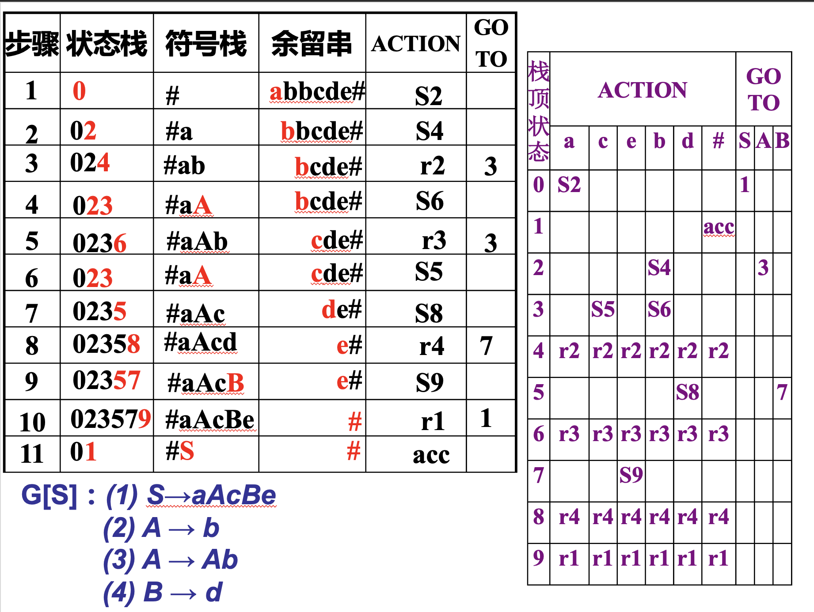

第六章、LR分析

LR分析是一种自底向上的分析法

# LR分析概述

- `L`: 表示从左(Left)向右扫描输入单词序列
- `R`: 代表产生的是最右(Rightmost)推导

LR分析也基于分析栈，使用表驱动的移进-归约分析

LR分析表包括两张子表
- `ACTION表`: 告诉分析引擎：当状态栈顶状态为i, 当前输入符号是 a 时该做什么
    - Shift：移进
    - Reduce：归约
    - Accept ：分析完成
    - Error ：发现错误 (常标为空白)

- `GOTO表`: 用于完成归约动作后的辅助动作

# 移进-归约分析过程

## 初始化

状态栈中压入初始状态

符号栈中压入#号 

剩余输入串为待分析的符号串加上#号

## 分析过程中的操作

1. 移进操作(Shift)

`ACTION[i,a] = Sj`

- 将输入符号压入符号栈
- 将状态j压入状态栈

2. 规约动作(Reduce)

`ACTION[i,a] = rk`

- 根据k号产生式`A -> b`将栈顶符号串`b`，归约为`A`
- 从状态栈弹出`|b|`个状态，设此时状态栈栈顶为i'
- 根据GOTO表中的表相`GOTO[i',A]=j`将状态`j`压入状态栈

3. 接受过程(Accept)

`ACTION[i,a] = acc`

- 分析完成,接受

4. 发现错误(Error)

`ACTION[i,a]=err(常标为空白)`

`GOTO[i',A]=err(常标为空白)`

# 分析树的建立

对输入串的分析实际上是建立分析树的过程

1. Shift操作

将剩余输入符号的第一个加入符号栈中

2. Reduce操作

用指定产生式右边的串用左边的符号代替，并将其写在该节点下面，形成一颗子树

- 举例1

- 举例2 

- 举例3 

# LR分析和最右推导的关系

LR分析使用最左归约,是最右推导的逆过程。每个最左归约动作恰好对应相应的最右推导动作

最右推导: 每一步都替换句型中最右边的非终结符，每一步都替换句型中最右边的非终结符

最左规约: 从目标字符串（句子）出发，每次选择最左侧的子串，将其还原为文法的非终结符，直到返回到文法的起始符号为止

# LR分析的原理

LR分析使用移进-归约(最左归约)分析来识别符号串，是最右推导的逆过程。

其中每次最左归约中的归约动作,正好对应最右推导中的推导动作。

我们的切入点是如何将最右推导的过程反过来, 把它变成最左归约的过程!

## 拓广文法

对于文法$G=(V_N,V_T,P,S)$，其中$S' \notin V_N \cup V_T$，增加产生式$S' \rightarrow S$，可得到$G$的拓广文法

作用：
- 拓广文法等价于原文法
- 拓广文法的开始符号$S$不会出现在任何产生式的右部,当$S$归约为$S'$后,就不该移进新的符号.

## 最右推导

其中每次最左归约中的归约动作,正好对应最右推导中的推导动作

关键是符号栈中出现什么内容时,就应该考虑进行归约动作

下面我们从最右推导的角度来研究这个问题.

在最右推导中,每次推导动作是展开句型中最右边的非终结符
$$S' \Rightarrow aAc \Rightarrow^{A \rightarrow b} abc，其中a,b \in (V_T \cap V_N)^*,c \in V_T^*$$

那么反过来在最左归约中的对应归约动作中,就应该把$abc$中的$b$归约为$aAc$，此时我们称$b$为句柄，$ab$称为可归前缀。

结论: 符号栈中出现可归前缀时,可以考虑进行归约动作. 实际上,符号栈中出现可归前缀是进行归约动作的前提条件

## LR分析的核心思想

当符号栈中出现了可归前缀$ab$时,就意味着符号栈顶可能出现了句柄$b$

为什么只是可能?

此时可能要向前查看余留串w, 才能决定是否归约。

因为还要看余留串w是否和αβ组成了一个合法的右句型 αβw。

若需向前查看余留串中的第一个符号, 再根据这个符号决定是否归约，这便是SLR(1) 、LR(1) 、LALR(1)

总而言之，符号栈中出现可归前缀αβ，是归约动作的必要条件！LR分析的关键就在于判断符号栈中是否已经出现可归前缀αβ ，这是通过构造出识别可归前缀的自动机来完成的。

符号栈压入符号的动作，对应于这个自动机读取该符号， ‘向前’迁移到下一个状态；状态栈的作用是记录自动机到达当前状态所经过的路径。当识别到可归前缀时，达到该自动机的某个终态。当归约动作发生时,会有符号栈弹出符号的动作，对于自动机的‘回退’动作。

## LR分析的过程

1. 列出拓广文法的所有可归前缀

2. 写出每一个可归前缀所对应的自动机

3. 将每个可归前缀对应的自动机合成为一个总的NFA

4. 将其转换为确定的有穷自动机

5. 利用该自动机指导分析

8. 继续直至accept或error

LR分析的关键就在于，构造出识别可归前缀的自动机.

上述举例文法比较简单，可以找到它的可归前缀，并构造出识别可归前缀的自动机

但是在一般情况下，求这个DFA不是那么容易！下面介绍一种方法，它通过构造所谓的LR(0)项目集规范族来构造LR(0)自动机。

# LR(0)项目级规范族的构造

LR(0)的项目是：在产生式的右端适当位置填加圆点的产生式

对于产生式$A \rightarrow ab$，可知该产生式对应的项目有$A \rightarrow \cdot ab;A \rightarrow a \cdot b;A \rightarrow ab \cdot$

每个项目的含义与圆点位置有关
- 圆点的左部表示分析过程中某时刻,希望用该产生式归约时,已匹配的部分句柄
- 圆点的右部表示期待的后缀部分。

## 项目分类

1. 移进项目

$$A \rightarrow a \cdot bc，其中b \in V_T,a,c \in (V_N \cap V_T)^*$$

2. 待约项目

$$A \rightarrow a \cdot Bc，其中B \in V_N,a,c \in (V_N \cap V_T)^*$$

3. 归约项目

$$A \rightarrow a \cdot，a 可为ε$$

4. 开始项目

$$S' \rightarrow \cdot S$$

5. 接受项目

$$S' \rightarrow S \cdot$$

## 小圆点的作用

