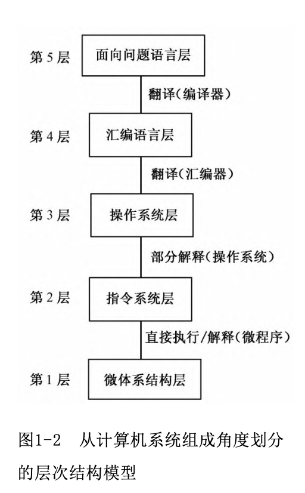

[toc]

# 1.计算机的基本概念
计算机的概念：计算机是一种能够存储程序，能够自动连续地执行程序，对各种数字化信息进行算术运算或逻辑运算的快速工具。

- 冯诺依曼体制的核心要点
    - 采用`二进制`代表数据和指令，及信息（护具和指令）的数字化
    - 采用`存储程序`工作方式，即事先编制程序，事先存储程序，自动、连续地执行程序
    - 由`存储器`、`运算器`、`控制器`、`输入设备`、`输出设备`等五大件组成计算机硬件结构 
    > 冯诺依曼机的工作方式称为`控制流驱动方式`：依照指令的执行序列依次读取指令，依据指令所含的控制信息调用数据，进行运算处理。
    这一过程中逐步发出的控制信息成为一种控制信息流，简称`控制流`，一次处理的数据信息称为一种数据信息流，简称`数据流`

# 1.2.信息的数字化表示

- 计算机中各种信息用数字代码表示
- 用数字型电信号表示数字代码

# 2. 计算机系统的硬、软件组成

## 2.1 计算机硬件系统
随着计算机硬件系统的发展，当代计算机的组成：
- 中央处理器(CPU)=运算器+控制器
    > 随着大规模集成电路的发展，可将运算器和控制器集成到一块芯片上，合称CPU
- 存储器
    > 可分为高速缓存、主存储器、外存储器三部分。中高速缓存常集成在CPU内部，作为CPU的一个部分，也可以在CPU之外再设置一级高速缓存。通常将CPU与主存储器合在一起称为主机，主存储器（简称主存）就是因为位于主机之内而得名，有的书中又称它为内存储器（内存）。
- 输入设备
- 输出设备

各组成部件的功能和相应特性
1. CPU(Central Processing Unit)    
CPU即中央处理器，是硬件系统的核心部件，负责读取并执行指令，也就是执行程序。
    - 程序计数器PC(Program Counter)：存放当前指令所在存储单元的地址
        > PC就像一个指针，指引着程序的执行顺序。
    - 算术逻辑部件ALU(Arithmetic Logic Unit)
        > CPU内有一个或多个ALU，按照指令要求将有关数据送入ALU，进行指定的算数或逻辑运算，然后将运算结果送到主存单元，或暂存在CPU内的寄存器内
    - 控制器
        > 控制整个系统的工作
        >> 控制器产生的微命令可分为一下两种：
        >> - 组合逻辑控制器：组合逻辑控制器完全靠若干组合逻辑电路（即硬件）产生微命令序列，将指令代码、状态信息、时序信号等输入到这些组合逻辑电路，电路将分时产生相应的微操作命令。        
        >> - 微程序控制器：是将微命令序列以代码形式编制成微程序,以用于执行

2. 主存储器  

主存储器存放着需要执行的程序及需要处理的数据，能由CPU直接读出或写入。

主存储器划分为许多单元，通常每个单元存放8位二进制数，称为1字节。每个单元都有一个唯一的编号，称为存储单元地址，简称地址。向主存储器送出某个地址编码，就能根据地址选中对应的一个单元。

> 。程序的最终（可执行）形态是指令序列，通常它们按照执行顺序依次存放在连续的存储单元中，通过程序计数器PC提供的指令地址，就可以逐条地读取指令。一条指令按其长度不同可存放在一个或相邻的几个单元中。有的指令需要处理的数据（又称为操作数）存放在主存的一个或相邻的几个单元中，指
令执行时，就提供地址去寻找对应单元，从中读取操作数。

可见主存储器的一项重要特性是：能按地址（单元编号）存放或读取内容，也就是允许CPU直接编址访问，通常以字节为编址单位。对主存储器来说，寻找存储单元（寻址）的依据是地址码，所存取的内容是指令或数据。

3. 外存储器

外存储器用来存放那些需要联机存放，但暂不执行的程序和数据，当需要运行它们时再由外存调入主存。

> 由于外存储器不由CPU直接编址访问，也就是说不需要按字节地从外存储器读取或写入，因此外存储器中的内容一般都按文件的形式进行组织，一个文件常分解为若干数据块，可以包含许多字节的信息。用户按文件名进行调用，CPU找到该文件在外存中的存放位置，以数据块为单位进行读写

4. 输入输出设备

5. 总线

总线是指一组能为多个部件分时共享的信息传输线。

> 某个时刻只能有一个部件或设备向总线发送数据，如果有两个或两个以上的部件同时向总线发送数据，就会产生冲突，使数据混乱，这就是分时共享的含义。

- 地址总线
- 数据总线
- 控制总线

6. 接口

用于连接系统总线与I/O设备之间的一些逻辑部件

---

概括的说，计算机硬件系统是由三大子系统组成：
- CPU
- 存储系统（包括高速缓存、主存和外存）
- 输入/输出系统（输入/输出设备和接口）

## 2.2 计算机软件组成

### 系统软件

系统软件是负责计算机系统的调度管理，提供程序的运行环境和开发环境，向用户提供各种服务的一类软件。

- 操作系统

操作系统负责管理和控制计算机系统硬、软件资源及运行的程序，它合理地组织计算机的工作流程，是用户与计算机之间的接口，为用户提供软件的开发环境和运行环境。

- 编译程序和解释程序

大多数情况下，用户采用高级程序设计语言编写程序，个别情况采用汇编语言编写程序。言编写出的程序叫做源程序。将源程序输入计算机后，计算机先执行一种语言处理程序，将源程序转换为机器语言代码序列，即机器语言程序，然后由计算机硬件执行这些用机器语言代码表示的指令序列，从而完成用户程序的执行过程。  

    - 解释方式：边解释边执行
    - 编译方式：先将源程序全部翻译成目标程序（目标代码）的机器语言指令序列再执行

- 各类软件平台

将开发及运行过程中所需的各种软件集成为一个综合的软件系统，称为软件平台

### 应用软件

应用软件是指用户在各自应用领域中为解决各类问题而编写的程序，也就是直接面向用户需要的一类软件。

> 从功能角度看，系统软件是负责系统调度管理，提供开发环境和运行环境，向用户提供各种服务的一类软件；而应用软件是用户在各自应用领域中为解决各类问题所编写的程序。从配置角度看，系统软件是用户购置的系统资源之一；而应用软件是用户自身开发的，直接面向应用需要的程序。

# 3. 层次结构模型

## 3.1 从计算机系统组成角度划分层次结构

- 微体系结构

微体系结构层主要从寄存器级观察CPU的结构，分析CPU执行指令的详细过程。

    - 微程序控制器：由微程序产生的控制信号控制的，相应的控制部件称为微程序控制器；
    - 组合逻辑控制器：直接由硬件产生的控制信号来控制的，相应的控制部件称为组合逻辑控制器。

> 从硬件组成的角度进一步分析微体系结构层中寄存器、ALU、控制电路等部件的构成就可以看到，几种数字逻辑单元（与、或、非门）组合成了这一层的部件。

- 指令系统层

指令系统（又称指令集）是指一台计算机所能执行的全部指令的集合。其指令是由微体系结构层的微程序解释执行或硬件电路直接执行的。

- 操作系统层

操作系统是一个在指令系统层提供的指令和特性之上又增加了新指令（系统调用）和特性的程序。这一层有新的指令集，有不同的存储器结构，有同时运行两个或多个程序的能力，以及其他一些特性。

- 汇编语言层

- 面向问题（高级）语言层

## 从语言功能角度划分层次结构

计算机硬件的物理功能是执行机器语言，称为机器语言物理机，从这一级看到的是一台实际的机器。而用户看到的是能执行某种语言程序的虚拟机，即通过配置某种语言处理程序后所形成的一台计算机。

## 软、硬件在逻辑上的等价

有许多功能既可以直接由硬件实现，也可以在硬件支持下靠软件实现，对用户来说在功能上是等价的，我们称为软、硬件在功能上的逻辑等价。

# 计算机的工作过程

## 处理问题的步骤

- 系统分析

如果要构造一个比较复杂的应用系统，首先要进行需求分析；确定该系统应具备哪些功能并据此划分功能模块；了解需存储、处理哪些数据、数据量、调用数据时的流向等。然后根据需求分析结果选择硬件平台和软件平台。如果准备购置的平台不能完全满足需要，可能需要自己设计一些硬件部件和系统软件模块。总体设计中的这些分析工作常称为系统分析。

- 建立数学模型和设计算法

应用计算机求解、处理问题的方法，被泛称为算法。

- 编写应用程序

在建立数学模型与设计算法之后，关键的技术问题已基本解决，这时就可以选择合适的程序设计语言和开发工具，着手编写应用程序。

- 编译为目标代码

- 由硬件执行目标程序

通常先将目标程序存储在磁盘中，用户需执行时给出文件名，操作系统按文件名调出目标程序并送入主存，然后将它在主存中的首址送入程序计数器PC之中，从该地址开始依序执行目标程序。

## 指令执行过程

- 取指令与指令分析

CPU中有一个程序计数器PC，它存放着当前指令（取指时）所在主存单元的地址码。因此每当读取指令时，就先将PC的内容送入主存储器的地址寄存器中，据此访问主存单元，从中读出指令，送入指令寄存器IR。一条指令代码可能要分别存放在几个地址连续的主存单元中，每读出一个单元的指令代码，PC内容就相应地加1，如果这条指令占n 个主存单元，那么在该指令代码都读取后，PC内容就加了n ，这时PC指示的就是下一条指令在主存的位置。

当指令代码读入到IR之后，相应的逻辑电路（可称为指令译码器）就自动地分析

- 读取操作数

    - 源操作数：从主存中读出的信息具有复制性质，不影响原来的内容。这种操作数称为源操作数。
    - 目的操作数：既是一个操作数的来源地，又是存放运算结果的目的地，所以它提供的操作数叫做目的操作数

- 运算

对操作数进行指定的操作

- 后继指令地址

在读取指令时PC的内容已自动修改，本例不需要转移指令地址，所以PC修改后的内容就是后继指令地址，即下一条待执行指令所在存储单元的地址。

# 数字计算机的特点与性能指标

## 特点

- 能在程序控制下自动连续的工作：储存程序工作方式
- 运算速度快：采用高速电子线路组成硬件
- 运算精度高：采用数字代码表示信息
- 具有很强的信息存储能力：二进制易保存
- 通用性强，应用领域广：基于信息表示的数字化

## 性能指标

- 基本字长：指参与一次运算的二进制数的位数。
- 数据通路宽度：数据总线一次所能并行传送的二进制数的位数
- 运算速度
    - CPU时钟频率与主频
        计算机的操作需要分步执行，一个时钟周期完成一步操作
        > 计算机中有一个振荡器，它的输出经整形后形成全机最基本的脉冲序列，其频率称为主频。主频脉冲经分频后形成时钟脉冲序列，一个时钟脉冲前沿到下一个时钟脉冲前沿就形成一个时钟周期。所以主频是时钟频率的整数倍。
    - 每秒平均执行指令的条数(/MIPS)
    - 分别标明几种典型四则运算所需的时间
- 主存储器容量
    > 两种表示方法
    > - 字节数
    > - 单元数（字数）X 位数
- 外存容量
- 配置的外围设备机器性能
- 系统软件配置

# 计算机的发展与应用
## 发展历程
## 提高性能的若干技术
## 计算机应用举例
