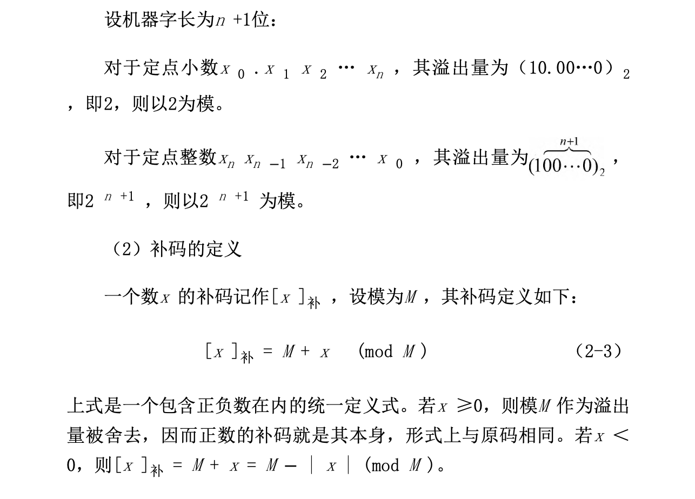
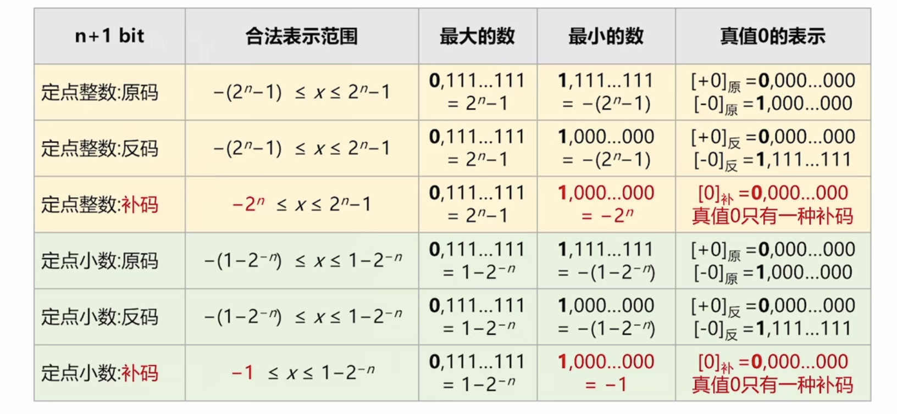
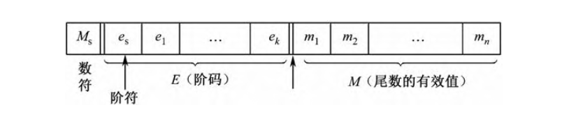
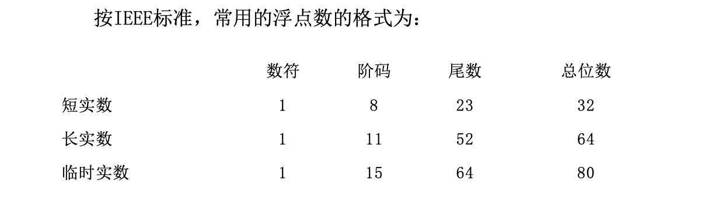
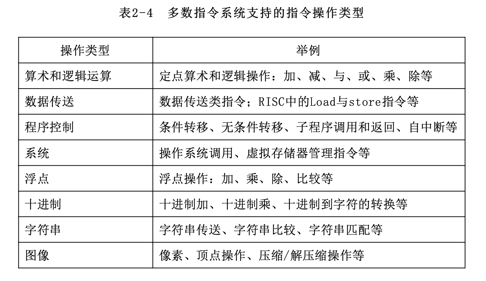

第二章、计算机中的信息表示

[toc]

计算机内部所处理的信息必须是数字化信息，可分为两大类：

- 数据：
    - 数值型数据：数值型数据有确定的值并在数轴上有对应的点
    - 非数值型数据：非数值型数据没有确定的值，如字符、图像等。
- 指令：计算机产生各种控制命令的基本依据。

# 数值型数据的表示

## 带符号数的表示

**真值与机器数**

真值：用‘+/-’号加上绝对值的表示方法  
机器数：数字实际存储到机器里的形式，正负号需要被“数字化”
> 机器数有原码、补码、反码和移码四种表示方法

**BCD码**

用四位二进制来表示一位十进制数，可表示0-16，挑出9位来表示十进制数。

- 8421码

两位8421码相加若结果大于9，则再加一个6，进行四位二进制数的进位。

- 余3码：8421码+$(0011)_2$

**原码**

用最高位表示符号，符号位为0表示该数为正，为1表示该数为负；有效数值部分则用二进制绝对值表示。

> 小数在个位表示符号位

> 若采用原码作乘除运算，可取其绝对值（即尾数）直接运算，并按同号相乘除取正、异号相乘除取负的原则，单独处理符号位，因此较方便

**补码**

- 引入

56-24=32，56+76=132=32，该加法中，100超出了表示范围，所以这两的运算结果相同，-24的补码（相对模100）是76。在有模运算中，一个负数可以用其补码代替，得到的是相同的结果
> 可以把相减变成相加

- 定义

计算机中数的表示及运算受字长限制，其运算都是有模运算。模在机器中是表示不出来的，若运算结果超出能表示的数值范围，则会自动舍去溢出量，只保留小于模的部分。

**反码**

正数不变，负数符号位不变，其余位取反

**移码**

补码的基础上将符号位取反。只能用于表示整数

> 移码相当于把真值映射到正数域(+$2^n$)。若将移码视作无符号数，则移码的大小就反映了真值的大小，这将便于两个浮点数的阶码比较。

**比较与总结**

---

---

原码和补码的关系：将负数用补码表示，实际上是实现了一种从`[-128,127]`到`[0,255]`的映射

> 为什么10000000表示-128?
> $$(-128)=(-1)+(-127)=[1000 0001]_原+[11111111]_原=[11111111]_补+[10000001]_补=[10000000]_补$$

## 定点数与浮点数

**定点数**

小数点固定的机器数称为定点数，计算机中只采用纯小数或纯整数形式

> 小数点只是一个约定，机器硬件中并不存在

- 定点整数

定点整数的小数点位置固定在最低位之后

- 定点小数

定点小数的小数点位置固定在符号位（最高位）之后

>   对于绝对值小于定点小数分辨率$2^{-n}$的数，当机器数0处理

_溢出_

参加运算的数以及运算的结果必须在该定点数所能表示的数值范围之内。
- 负溢出：机器数小于定点数的最小值（即绝对值最大负数）
- 正溢出：当超出最大值时，称为“正溢出”；    

当机器中发生溢出时，将迫使机器转入溢出处理程序或暂停，并将CPU中的状态寄存器的溢出标志位置位。

> 定点数的小数点位置约定在固定位置上，因此不需设置专门的硬设备来表示它，显然小数点在机器中并不实际存在。对计算机来说，处理定点整数与处理定点小数在硬件上并无区别，至于选择哪一种定点数格式是在程序中约定的。

_比较_

---

**浮点数**

计算机中也引入了类似于 _科学计数法_ 的方法来表示实数，称为浮点数表示法，即小数点的位置可以根据需要而浮动。

浮点数的代码由两部分组成：阶码E和尾数M。浮点数的真值表示为：
$$N= \pm R^E·M$$
- R是阶码的底，机器中一般规定为2，8或16（进制），与尾数的基数（进制）相同
- E是阶码，即指数，为带符号整数，常用移码或补码表示
- $e_s$是阶符，表示指数的符号
- M是尾数，通常是纯小数，常用原码或补码表示
- $M_s$是尾数的符号位，安排在最高位，也是整个浮点数的符号位

> 非IEEE浮点数格式化形式：规格化尾数应满足1/2<=|M|<1

> 当阶码小于机器能表示的最小阶码（即
该浮点数的值小于最小绝对值）时，称为下溢，此时一般当作机器零
处理，机器可继续运行。当阶码大于机器所能表示的最大阶码时，称
为上溢，即溢出，这时机器必须转入溢出出错中断处理。

> IEEE标准：
> 尾数用原码表示，隐含最高位1，实际尾数为尾数+1(即1.M)
> 阶码用移码表示，实际阶码需要减去偏移量$2^{|E|-1}-1$
> > 其中|E|为阶码的长度

# 字符的表示

## ASCII码

一个ASCII码占一个字节，只使用底七位，最高位置0，可表示128个字符

## Unicode编码

Unicode最基本的思路是将每个字符和符号赋予一个永久、唯一的16位值，即码点

## 汉字编码简介

- 输入码

拼音码，字形码等，所产生的输入码需要借助输入码与内部码的对照表（称为输入字典）转换成便于加工处理的内码。

- 汉子交换码

纳入整理的汉字排成一个94×94的行列矩阵，矩阵的行称为区，列称为位。用双字节编码表示。前一个字节表示区，后一个字节表示位

- 内部码

汉字内部码（简称内码）是计算机内部供存储、处理、传输用的代码。

todo:P107

# 指令信息的表示

一台计算机能够直接识别并执行的程序只能是机器语言程序。
> 因此，任何问题无论使用哪一种计算机语言（汇编语言或某种高级语言）来编程实现，都必须通过翻译程序转换成对应的机器语言程序后才能执行。

机器语言程序是由机器指令序列组成的，它们是产生各种控制信息的基础。
> 一条机器指令是一组有意义的二进制代码，它指示机器硬件应完成哪种基本操作。

一台计算机的所有指令的集合构成该机的指令系统。
> 指令系统既是为软件设计者提供的最低层次的程序设计语言，也是硬件设计者的最基本的设计依据。因此，指令系统是软件和硬件的接口

## 指令格式

1. 指令中的基本信息

计算机是通过执行指令来处理各种数据的。为了指出所执行的操作、操作数的来源和操作结果的去向，以及下一条指令从哪里取  
一条指令一般应包含以下信息：
- 操作码：表示该指令所要完成的操作
- 操作数的地址：给出操作数存放处的地址
> 如主存单元地址或寄存器地址。CPU通过该地址可以获得所需的操作数。
- 操作结果的地址：对操作数进行处理所产生的结果存放在该地址中，以便再次使用。
- 下一条指令地址
> 由于存储在主存储器中的程序（机器指令序列）是按指令执行顺序连续存放的，并且在大多数情况下程序是顺序执行的，因此可以设计一个程序计数器PC专门存放指令地址，每取出一条指令后，PC自动增值指出下一条指令地址，这样就不需在指令中直接给出下一条指令的地址。当需要改变程序执行顺序时，可由转移类指令实现。

从上述分析可知，一条指令实际上包括两种信息，即操作码和地址码，因此指令的基本格式为：

- 操作码(Operation Code): 具体说明该指令操作的性质及功能。
- 地址码(Address Code): 描述该指令的操作对象，由它给出操作地址或直接给出操作数，并给出操作结果的存放地址。

2. 地址码结构

***三地址码***

OP A1 A2 A3  

- 功能：(A1)OP(A2)->A3

- 说明： 
    - OP表示操作码
    - A1: 表示操作数1的地址 
    - A2: 表示操作数2的地址 
    - A3: 结果存放地址
> A1 、A2 和A3 可以是主存单元地址或寄存器地址。

***二地址码***

OP A1 A2
- 功能：(A1)OP(A2)->A1
- 说明：
    - A2: 提供的操作数，在运算后仍保存在原处，称它为源操作数，A2 称为源地址
    - A1: 提供的操作数，在运算后不再保留，该地址改为存放运算结果
    > 因为A1 最终是存放结果的目的地，所以一开始由A1 提供的操作数称为目的操作数

***一地址码***

只有目的操作数的单操作数指令

OP A
- 功能：(OP)A->A
- 说明：指令中只给出一个目的地址A，A既是操作数的地址，又是操作结果的存放地址。

隐含约定目的地址的双操作数指令

OP A
- 功能：(AC)OP(A)->AC
- 说明：
    - 源操作数按指令给出的源地址A读取，
    - 另一个操作数（目的操作数）隐含在CPU的累加器AC中，运算结果也将存放在AC中。
> 在某些微机中，双操作数指令也可采用一地址指令格式。

***零地址码***

不需要操作数

OP 
- 说明：例如块操作指令、停机指令

所需的操作数是隐含的

OP 
- 说明：如计算机中对堆栈操作的运算指令，所需的操作数事先约定在堆栈中，由堆栈指针SP隐含指出，操作结果仍送回堆栈中。

> 指令和操作数同样是以二进制代码形式存储的，从表面上看二者并无区别。但是，指令地址是由程序计数器PC指定的。而操作数地址则是由指令中的地址码规定的。因此二者绝不可能混淆。

3. 操作码结构

指令中的操作码用来指示机器应执行什么性质的操作，每一条指令都有一个含义确定的操作码，不同指令的操作码用不同的二进制编码表示。

- 固定长度地址码

操作码的长度固定，且集中放在指令字的一个字段中，指令的其余部分全部用于地址码。
> 操作码固定长度有利于简化硬件设计和缩短指令译码时间。

- 可变长度地址码

背景：如果指令长度一定，则地址码与操作码的长度是相互制约的
解决办法：可采用扩展操作码的办法，即操作码和地址码位数不固定，操作码位数允许有几种不同的选择，对地址数少的指令允许操作码长些，对地址数多的指令则操作码就短些。

- 复合型地址码

将操作码分为几个部分，它们的组合使操作含义更丰富。

4. 指令长度

- 变字长地址

不同的指令可以有不同的字长。
> 但因为主存通常按字节编址，所以指令字长多为字节的整数倍

功能实现：将操作码放在指令字的第一字节，当CPU读出操作码后可立即判定，这是一条单操作数指令，还是一条双操作数指令，或者是零地址指令，从而知道后面还应读取几字节的指令代码。

- 固定字长地址

指令长度固定，方便机器预取后续指令，有利于指令流水线执行。
> 现在RISC的微处理器通常采用固定字长指令

## 常用寻址方式

一条指令包括操作码和地址码，指令的功能就是根据操作码对地，址码提供的操作数完成某种操作。指令中以什么方式提供操作数或操作数地址，称为寻址方式。

指令所需要的操作数可能存放在以下几种地方：
- 就包含在该指令之中。
- 存放在CPU的某个寄存器中。
- 存放在主存单元中。
    - 只需对某个操作数进行处理
    - 需要对一个连续的数组或表进行处理。
- 存放在堆栈区中。
- 存放在某个I/O接口的寄存器中。

两种地址：
形式地址：指令中的地址码不能直接用来访问主存
有效地址：对形式地址进行一定的计算而得到的存放操作数的主存单元地址

寻址方式的类型
- 立即寻址类: 在读取指令时也立即读出操作数。
> 通常用于为程序提供常数或某种初始值，提供的是不可变的数据

- 直接寻址类: 直接给出主存的有效地址或寄存器号，以读取操作数。
    - 堆栈寻址: 操作数存放在堆栈中，指令隐含约定由堆栈指针SP寄存器提供堆栈栈顶单元地址，进行读出或写入。
> 有效地址是指令的一部分，不能随程序需要动态改变，因而该指令只能访问某个固定的主存单元。

- 间接寻址类: 先从某寄存器或主存单元中读取有效地址，再按这一地址访问主存以读取操作数。
> 即指向指针的指针
> 可将间址单元当成一个读取操作数的地址指针，它指示操作数在主存中的位置，只要修改指针（即间址单元的内容），则同一条指令就可以用来在不同时间访问不同的存储单元。  

- 变址类: 指令给出的是形式地址，经过某种计算才获得有效地址，据此访问主存，读取操作数。
    - 变址寻址: 指令的地址部分给出一个形式地址（位移量），并指定一个寄存器作为变址寄存器(Rx)；变址寄存器内容（称为变址量）与形式地址相加，得到操作数有效地址；
    - 相对寻址: 以当前指令位置为基准，相对它进行位移（往前或往后）定位
    > 用程序计数器PC的内容作为基准地址，指令中给出的形式地址作为位移量（可正可负），二者相加后形成操作数的有效地址。

## 指令类型

> 一般所有的计算机都提供表2-4中的前三类指令。指令系统对后四类指令的支持取决于具体机器

1. 算数和逻辑运算类指令

- 运算指令: 设置加、减、比较、移位等最基本的定点。
> 性能稍强一点的机器，还设置定点乘、除运算指令。

- 逻辑运算: 逻辑与、逻辑或、逻辑非（求反）和异或4种。
> 有些机器设置有专门的位操作指令，如位测试、位清除、位设置等；而有些机器则通过逻辑运算指令实现位操作。

- 移位操作: 算术移位、逻辑移位和循环移位

> 对于未设置某种运算指令的机器，如果要实现这种运算，则可以通过程序方法来实现。也可以增设扩展运算部件。

2. 数据传送类指令

这类指令将数据从一个地方传送到另一个地方，可用来实现寄存器与寄存器、寄存器与主存单元，以及主存单元与主存单元之间的数据传送

> 而且纯数据传送具有“复制”性质，即数据从源地址传送到目的地址时，源地址中的数据保持不变。

输入/输出（I/O）类指令完成主机与外围设备之间的信息传送有三种设置方式

- 专用的I/O指令

OP R A  
OP是操作码，表示它是I/O指令；  
R是CPU中寄存器的地址，指定与外设交换数据的寄存器；  
A是I/O端口的地址，其长度一般为8～16位，可以表示256～64 K个地址。  

- 用通用的数据传送指令实现I/O操作 

在I/O接口的端口与主存单元***统一编址***的机器中，因为将I/O端口与存储器单元同等对待，所以任何访问主存单元的指令均可访问I/O接口中的端口，这样就可以用传送类指令实现主机与I/O接口之间的信息传送

- 通过I/O处理执行I/O操作

3. 程序控制类指令

这类指令可以控制程序执行的顺序和选择程序的执行方向

- 转移指令
    - 无条件转移指令: 改变指令的常规执行顺序，不受任何条件约束，直接把程序转移到该指令指向的任何地址（指令地址）开始执行。
    > 这种操作使程序计数器PC的内容改变为转移地址。
    - 条件转移指令; 需先测试某些条件，仅当条件满足时，才执行转移，否则只相当于一条空操作指令，不改变程序执行顺序。
    > 决定转移的条件一般是指上次运算结果的某些待征。  
    > 在CPU的状态寄存器中，有一组用来保存最近执行的算术逻辑运算指令、移位指令等的结果标志，它们主要包括
    > - 进位标志C
    > - 结果为零标志Z
    > - 结果为负标志N
    > - 溢出标志V
    > - 奇偶标志P。

- 循环控制指令: 有了条件转移指令就可以实现循环程序设计。但有的机器为了提高指令系统的有效性，还专门设置了循环控制指令，它包括对循环控制变量的操作和脱离循环条件的控制，是一种具有复合功能的指令。

- 子程序调用和返回指令
    - 执行子程序调用指令时，首先将下一条指令地址（即断点）压入堆栈保存，然后转入所调用的子程序执行。
    - 子程序执行完毕，由返回指令把调用子程序时压入的返回地址从堆栈中弹出，以返回调用程序。

- 程序自中断指令
    - 按中断方式将处理机断点与现场保存在堆栈中（这点与一般的转子程序不同），然后转向对应的中断处理子程序入口开始执行
    - 执行完毕后，通过中断返回指令返回到原程序断点继续执行。
> 由于自中断指令是由软件驱动的，所以又称为软中断。

4. 系统类指令（特权指令）

特权指令是指具有特殊权限的指令，它们只能用于操作系统或其他系统软件，一般不直接提供给用户使用。

- 通常在单用户、单任务的计算机系统中不需要设置特权指令
- 在多用户、多任务计算机系统中，则必须设置特权指令，它主要用于系统资源的分配和管理。如检测用户的访问权限、修改虚拟存储器管理的段表、页表等。

在有些多用户计算机系统中，为了统一管理各种外设，输入/输出指令也作为特权指令使用，故用户不能直接访问它们。需输入/输出时，可通过系统调用来实现。

## Pentium2指令格式

## SPAERC指令格式
