<!-- ~/study_md/computer_composition/basic/4.CPU.md -->

第三章 微体系结构层--CPU组成

[toc]

从计算机系统的功能组成角度看，中央处理器CPU（Central Process Unit）是计算机系统的核心部件，它主要由寄存器、算术逻 辑部件ALU、控制器及互连它们的机构组成。

CPU执行一条指令是由控制器产生的一组微命令（即控制信号：控制门电路的开关）序列实现的。按微命令的形成方式不同，控制器有两种组成方式
- 组合逻辑控制方式
- 微程序控制方式

在微体系结构层，我们看到的是一些寄存器和算术逻辑部件ALU 相连构成的数据通路，即中央处理器CPU的数据通路。  
数据通路的基本功能是传送和运算数据，如选择一个或两个寄存器的内容作为ALU的操 作数，将它们进行运算（如相加），然后将结果存回某个寄存器中。  
在一些机器上，这些功能
- 是由微程序产生的控制信号控制的，相应的控制部件称为微程序控制器；
- 而有些机器是直接由硬件产生的控制信号来控制的，相应的控制部件称为组合逻辑控制器。

# 1. CPU的组成和功能

中央处理器CPU的主要功能是
- 从主存储器中取出指令
- 解释指令和执行指令
> 即按指令控制计算机各部件操作，并对数据进行处理。

## 1.1 CPU的组成

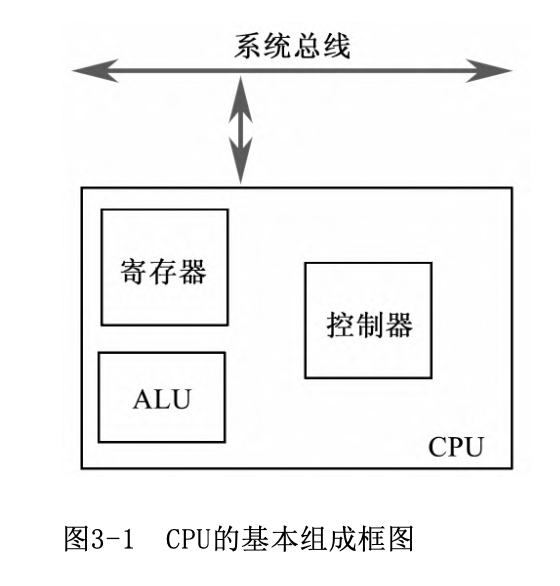
- 控制器：产生一系列控制信号，1️⃣控制计算机中各部件完成操作
- 算数逻辑单元ALU：实现所指定的各种算数运算和逻辑运算
- 各种寄存器：存放指令、指令地址、操作数及运算结果
- CPU内部总线：连接CPU内部各部件，为信息传送提供通路

### 1.1.1 ALU部件与寄存器

1. ALU部件

ALU的功能是实现数据的算术与逻辑运算。常用图3-2中所示的框图表示ALU。可以看出，
- ALU的输入有两个端口
    - 分别接收参加运算的两个操作数
    - 通常它们来自CPU的通用寄存器或ALU总线。 
- ALU的输出取决于对其功能的控制
    - 当控制功能选择加、减、与、或等运算功能之一时
    - 其输出结果将为对应的和、差、与值、或 值等。

2. 寄存器

CPU中的寄存器包括
- 存放控制信息的寄存器

    - 指令寄存器IR(Instruction Register)
        - 存放当前正在执行的一条指令。
        - 执行一条指令时，通常是先将其从主存储器(Memory)读出到主存数据寄存器MDR（Memory Data Register）中，然后再送往指令寄存器IR中。

    - 程序计数器PC(Program Counter)
        - 存放当前或下一条指令在主存中的地址
        > 因此又称为指令计数器或指令指针IP（Instruction Pointer）。

    - 状态字寄存器
        - 存放当前程序的运行状态和工作方式，其内容称为程序状态字PSW（Program State Word），PSW是参与控制程序执行的重要依据。
        - PSW中一部分内容是记录上一条指令执行后的结果标志
            - 进位标志C、溢出标志V、结果为零标志Z、结果正负标志N、奇偶标志P等。
            > 每当一条指令执行完，CPU将根据运行结果自动修改这些标志。
        - PSW中另一部分内容由编程设定（也称为控制标志）
            - 跟踪标志T，用以编程设定断点；中断允许标志I，指示CPU是否允许响应 外部中断请求。
            - 有的机器还设有工作方式字段，若设定为用户方式， 则禁止用户使用某些特权指令。 

- 及存放所处理数据的寄存器

    - 通用寄存器
        - 每个寄存器都可以提供多种用途
        - 每个通用寄存器都有唯一的编号，称为寄存器地址。
        - 通用寄存器可用D触发器构成。

    - 暂存器
        - 暂存从主存储器读出的数据
        > 这些数据不能存放在通用寄存器中，否则会破坏其原有内容。
        - 暂存器还可用于暂存来自通用寄存器组的数据。
        - 暂存器没有寄存器号，因此不能直接编程访问它们。
        

### 1.1.2 总线

总线是一组能为多个部件分时共享的公共信息传送线路，它分时接收各部件送来的信息，并发送信息到有关部件。
> 会出现多个部件争用总线

CPU内部总线用来连接CPU内的各寄存器与ALU，主要用于传送数据信息。

系统总线用来连接CPU、主存储器与I/O接口，它通常包括三组：
- 数据总线: 主要传送各大部件间的数据信息，如指令代码、操作数、命令字或状态字等。
- 地址总线: 传送主存单元地址码或I/O端口地址。
- 控制总线: 传送控制、状态信息，其中有CPU发出的控制信号，也有送入CPU的状态信号。如CPU输出的对主存的读/写控制信号、外设输入到CPU的中断请求信号。

### 1.1.3 CPU内部数据通路

1. 单总线数据通路结构

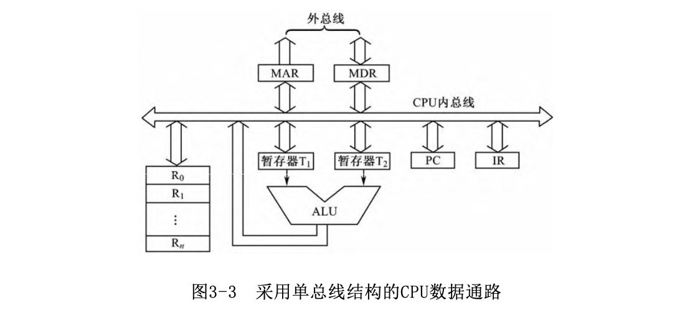

- CPU数据通路结构只采用一组内总线，它是双向总线。
- 通用寄存器组、其他寄存器和ALU均连在这组内总线上。
- CPU外部的系统总线通过主存数据寄存器MDR和主存地址寄存器MAR（Memory Address Register）与CPU内总线相连。
- CPU内各寄存器间的数 据传送必须通过内总线进行，ALU通过内总线得到操作数，其运算结果 也经内总线输出。
> - 这种结构要求在ALU输入端设置两个暂存器。主要用于暂存提供给ALU的两个操作数。
> - 暂存器还可作为通用寄存器之间传送的转存部件。

2. 多组总线结构

- 使几个数据传送操作能够同时进行，即实现部分并行操作。
- 每组总线连接几个部件的输入端，但只连接一个输出端
> 通用寄存器之间的数据传送必须经ALU才能完成。

## 1.2 指令执行过程

1. 指令的分段执行过程

任何一条指令的执行都要经过读取指令、分析指令和执行指令三 个阶段。读取与分析指令的操作，对所有指令几乎都一样，而每条指 令的执行阶段的具体操作则有较大差别。
> 如有的指令需要从存储器中 取操作数，再进行运算，运算结果还要写回存储器，因此执行阶段还 可细分。

- 取指令: 
    - 根据指令计数器PC提供的地址从主存储器中读取当前指令，送到主存数据缓冲器MDR中，然后再送往CPU内的指令寄存器IR中。
    - 同时改变指令计数器PC的内容，使之指向下一条指令地址或紧跟当前指令的立即数或地址码。

- 分析指令
    - 如果采用组合逻辑控制器，则通过译码电路译出IR中指令各字段表示什么操作，并在时序系统的配合下产生该指令对应的微操作命令序列。
    - 若采用微程序控制器，则可根据指令的操作码与标志位转向控制存储器取出对应的微程序，由微指令提供微操作命令序列。

- 执行过程
    - 取操作数
        - 如果当前指令需要从主存取操作数，就需安排时间再次访问存储器。 
        - 如果是间址方式或是取双操作数，则访存次数更多。
        - 若是变址方式，在取数之前还需安排时间进行变址计算。

    - 执行操作
        - 如果当前指令需要运算，则需考虑形成稳定运算结果的时间，为此安排专门的节拍。
        > 对乘除、浮点运算则需占用更多的节拍。
        - 若运算结果需送回主存单元，则应安排时间以完成对主存的写操作。
    - 形成下一条指令地址
        - 对于顺序执行的指令，下一条指令地址在取指令、取立即数、取地址码时，就已形成在PC中；
        - 如果是转移类指令，则将形成的转移地址送到PC中。以后再取下一条指令、分析、 执行……，如此循环直至程序执行完毕或外来干预为止。

CPU还应该对运行过程中出现的某些异常情况或输入/输出请求进行如下处理：
- 当机器出现某些异常情况
> 如算术运算的溢出和数据传送的奇偶错等
- 或者某些输入/输出请求
> 如磁盘上的批量数据需送存储器或程序员从键盘送入命令等

此时由相应的部件或设备发出“中断请求信号”或“DMA请求信号”。 若CPU收到中断请求信号
- 在执行完当前指令后，响应该中断请求，暂停当前执行的程序，转去执行中断处理程序。
- 当处理完毕后，再返回原程序断点继续执行下去。

若CPU收到DMA请求信号
- 在完成当前机器周期操作后，响应该DMA请求，暂停工作，让出总线给DMA控制器
- 由它控制完成输入/输出设备与存储器之间的数据传送操作后，CPU从暂停的机器周期开始继续执行指令。
> 注意，DMA操作不会改变CPU中任一寄存器（除DMA专用部件外）的状态，因此CPU可以从暂停处快速恢复程序的正确执行。

2. 指令之间的衔接过程

- 串行的顺序安排方式: 在一条指令执行完毕后才开始取下一条指令
- 并行的重叠处理方式: 在对当前指令执行运算操作时提前从主存取出下一条指令，而不必等当前 指令全部执行完。
> 但如果程序需要转移，预取下一条指令就要失败。 不过由于大多数情况下程序流程是顺序执行，下一条指令地址并不依赖本次执行结果，所以预取指令还是能有效地提高执行速度。

## 1.3 时序控制方式

### 1.3.1 同步控制方式

指各项操作由统一的时序信号进行同步控制。这就意味着各个微操作必须在规定时间内完成，到达规定时间就自动执行后继的微操作。

基本特征: 将操作时间分为若干长度相同的时钟周期 （也称为节拍），要求在一个或几个时钟周期内完成各个微操作。机器的时钟频率（主频）的选择主要取决于CPU内部的操作。
> 通常时钟周期应能完成CPU内部花费时间最长的微操作。显然，对于花费时间少的微操作，就会有时间上的浪费，这是同步控制方式的一个缺点。

### 1.3.2 同步时序控制的多级时序系统

1. 多级时序的概念

在同步控制方式中，通常将时序信号划分为几级（其中包括指令 周期），称为多级时序。

指令周期是指从取指令、分析指令到执行完该指令所需的时间。
> 在时序系统中，因其执行时间的长短可能不同，通常不为指令周期设置时间标志信号，因而也不将其作为时序的一级。

在组合逻辑控制器中: 依靠不同的时间标志使CPU分步执行指令，其时序信号常划分为三级：
- 机器周期
- 节拍
- 时钟脉冲
而在微程序控制器中， 一条指令对应一段微程序（微指令序列），指令的分 步执行是由执行不同的微指令来实现的，每条微指令的执行时间为一个节拍，故其时序信号划分为两级：
- 节拍
- 时钟脉冲。

机器周期：

组合逻辑控制器中，通常将指令周期划分为几个不同的阶段，每个阶段所需的时间称为机器周期，又称为CPU工作周期或基本周期。
> 例如，取指令周期、存储器读周期、存储器写周期等。在不同的机器周期中完成不同的操作。

在时序系统中需设置一组周期状态触发器，以标志不同的机器周期，任一时刻只允许有其中的一个触发器为1，表明CPU当前处在哪个机器周期。不同的机器周期的长短可以不同。 

节拍（时钟周期）

一个机器周期的操作一般需分几步完成。为此，将一个机器周期划分为若干相等的时间段，每个时间段内完成一步基本操作。这个时间段用一个电平信号宽度对应，称为节拍或时钟周期。

- 节拍长度的确定，一般取决于CPU内部的操作需要。
- 在时序系统中设置有节拍发生器，用以产生节拍信号。

时钟脉冲信号CLK

节拍的宽度确定后，时钟脉冲信号的频率也就随之确定了。  
在时序系统中，是将由时钟发生器产生时钟脉冲信号作为时序系统的基本定时信号。

此外，在节拍信号的配合下
- 时钟脉冲CLK信号前沿将运算结果打入寄存器
- 其后沿实现周期切换等功能。

2. 多级时序信号之间的关系

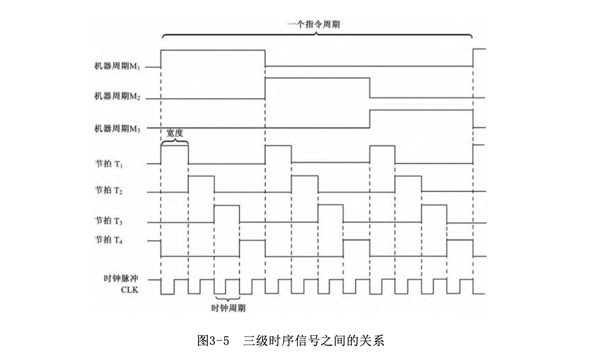

3. 时序系统的组成

- 主振: 就是一个晶体振荡器，当机器一上电就产生频率稳定的主振信号
- 主振信号由时钟发生器经过整形分频后得到时钟脉冲信号。
- 启停控制线路控制时钟脉冲CLK的发与不发。
- 节拍发生器按先后顺序，循环地发出若干节拍信号，它通常用计数译码电路构成。

## 1.4 指令流水线

一条指令的执行过程也是分成几个步骤实现的。作为一个简化的方法，考虑将指令处理分成两个阶段：取指令和执行指令。在一条指令执行期间，有主存空闲的时间，这个时间能用于取下一条指令，从而使取下一条指令与当前指令的执行并行工作。

重叠执行存在的问题
- 执行时间一般要长于取时间。
> 取指阶段可能必须等待一定的时间才能更新它的缓冲器。
- 条件转移指令使得待取的下一条指令的地址是未知的。
> 简单解决：当一条件转移指令通过取指阶段到执行阶段时，新的取指阶段取存储器中此转移指令之后的指令。若转移发生，则要作废已取的指令并再取新的指令。

为获得进一步的加速，流水线可以分成更多的阶段。
- 取指令(FI): 读取下一个预期的指令到寄存器
- 译码指令(DI): 分析操作码和操作数寻址方式
- 计算操作数地址(CO): 计算每个源操作数的有效渎职
- 取操作数(FO): 根据操作数地址从存储器取操作数，寄存器中的数不用取
- 执行指令(EI): 完成操作码指定的操作。若有指定的目标操作数为位置，则将结果写入此位置
- 写操作数(WO): 将结果存入存储器

以上分解，使各个阶段几乎用相等的时间。

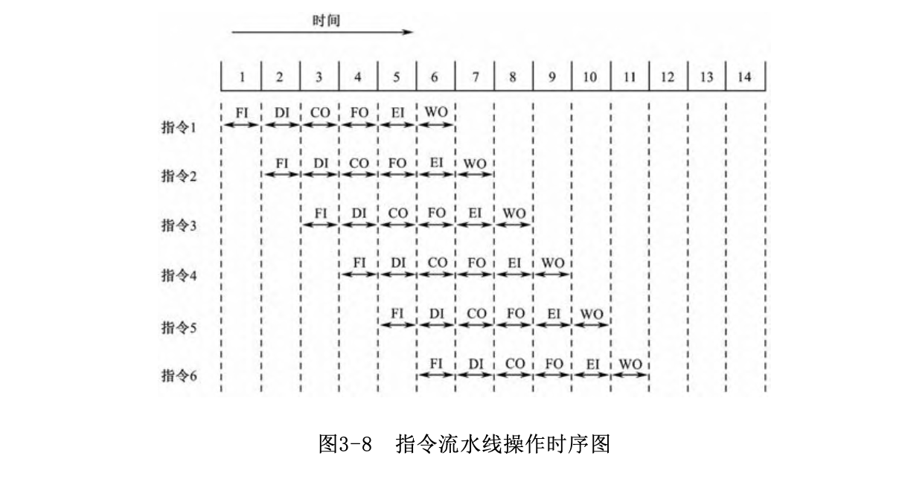

> 此过程不适用与所有计算机

影响流水线性能的主要因素：

- 若各个阶段不全是相等的时间，会在各个流水阶段涉及到某种等待。

- 流水线中的相关问题
    - 数据相关：第二条指令需要第一条指令的结果
        - 发生数据相关时，第2条指令的操作数直接从数据处理部件得到，而不是存入后再读取。
        - 数据流分析技术：分析哪一条指令依赖于其他的结果或数据，依此来优化指令调度。
        > PentiumⅡ就采用该技术，根据分析结果重排指令，使指令以优化的顺序执行，与原始程序的顺序无关。
    - ...

- 遇到条件转移指令时，确定转移与否的条件码往往由条件转移指令本身或由它前一条指令形成，只有当它流出流水线时，才能建立转移条件并决定下一条指令地址。 
    - 猜测法：机器先选定转移分支中的一个，按它继续取指并处理
        - 假如条件码生成后，说明猜测是正确的，那么流水线可继续进行下去，时间得到充分利用；
        - 假如猜错了，那么要返回分支点，并要保证在分支点后已进行的工作不能破坏原有现场，否则将产生错误。
    > 更复杂的例子是，不只预测下面一个分支，还要提前预测多条分支，如PentiumⅡ就可以进行多重跳转分支预测。

- I/O设备有中断请求或机器有故障，要求中止当前程序的执行而转入中断处理。

# 2. 算数逻辑单元ALU和运算方法

## 2.1 移位

- 逻辑移位：位置变化，空出位补0
    > 适用于无数值大小的二进制代码
- 循环移位
    - 最高位左移入最低位		     
    - 最低位右移入最高位
    > 形成闭合环路

    
- 算数移位：带符号数的移位，移位后数的符号不变而数值发生变化。
    > 左移实现乘2，右移实现除2，各个数字所对应位置的权发生了变化
    - 原码
        - 左移：符号位不动，其余各位依次左移，末尾补0
        - 右移：符号位不动，其他位依次右移，最高有效位补0
    - 补码
        - 左移：各位依次左移，末尾补0
            > 若符号位变化，则发生溢出
        - 右移：符号位不变，其余位右移，最高有效位复制符号位

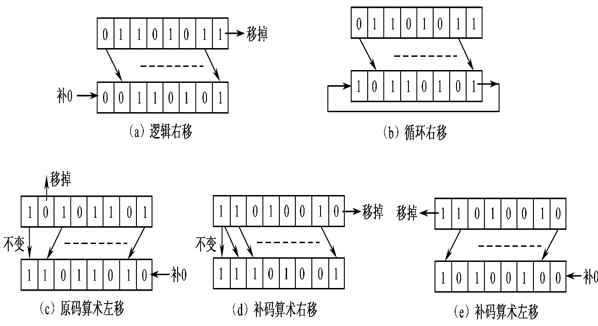

## 2.2 定点数加减运算

### 2.2.1 原码加减法

和操作码和符号都有关

- +A+(-B) -> +A-(+B), 结果符号与绝对值大的符号相同
- +A-(-B) -> +A+(+B), 结果与被减数符号相同␍

### 2.2.2 补码加减法

$$[X+Y]_补=[X]_补+[Y]_补$$
$$[X-Y]_补=[X+(-Y)]补=[X]_补+[-Y]_补$$

> 已知$[Y]_补$求$[-Y]_补$
> 将$[Y]_补$的每一位（包括符号位）取反，最低位+1

***补码运算规则***
- 参与运算的操作数用补码表示
- 符号位页参与运算，所得结果也是补码表示

### 2.2.3 溢出

如果两个操作数都是同符号数
- 相加 可能溢出
- 相减 不会溢出

1. 采用单符号判断法
- 正+正=负 溢出（正溢）
- 负+负=正 溢出（负溢）

2. 双符号位(变形补码)判断法

最高位表示正确的符号，存储时一位，计算时两位

变形补码表示的数：
- 不溢出
    - 00：结果为正数
    - 11：结果为负数
- 溢出
    - 01：结果正溢
    - 10：结果负溢

3. 查看进位

## 2.3 定点数乘除运算

### 2.3.1 乘法

1. 无符号整数一位乘法

计算机中，n位乘法 转换为 n次“累加与移位”
> 每一步只求一位乘数所对应的新部分积，并与原部分积作一次累加，然后右移一位。 

流程图

- 3个寄存器A、B、C
    - B：被乘数
    - C：乘数
    - A：初值为0，然后存放部分积，最后存放乘积高位,C存乘积低位
- 乘数每乘一位该位代码就不再使用，A和C寄存器联合右移，将$C_0$替换
- 存放逐次增加的部分积，并且使每次乘数位始终在C的最低位$C_0$。
- 乘法完成时，A与C存放的是最后乘积。 

---
硬件原理图
- 初始化：被乘数送入B、乘数送入C，A和Ca置0（进位触发器$C_a$保存每次累加的进位）
- 由乘数位C0产生“加B/不加”（加0）信号，用以控制被乘数B是否与上次部分积相加产生本次部分积
- 然后$C_a$、A、C一起右移一位；
- 重复n个节拍的操作后所得到的乘积存放在A和C中。
- 终止条件：乘数中的每一位都被替换(寄存器C)

--- 

举例

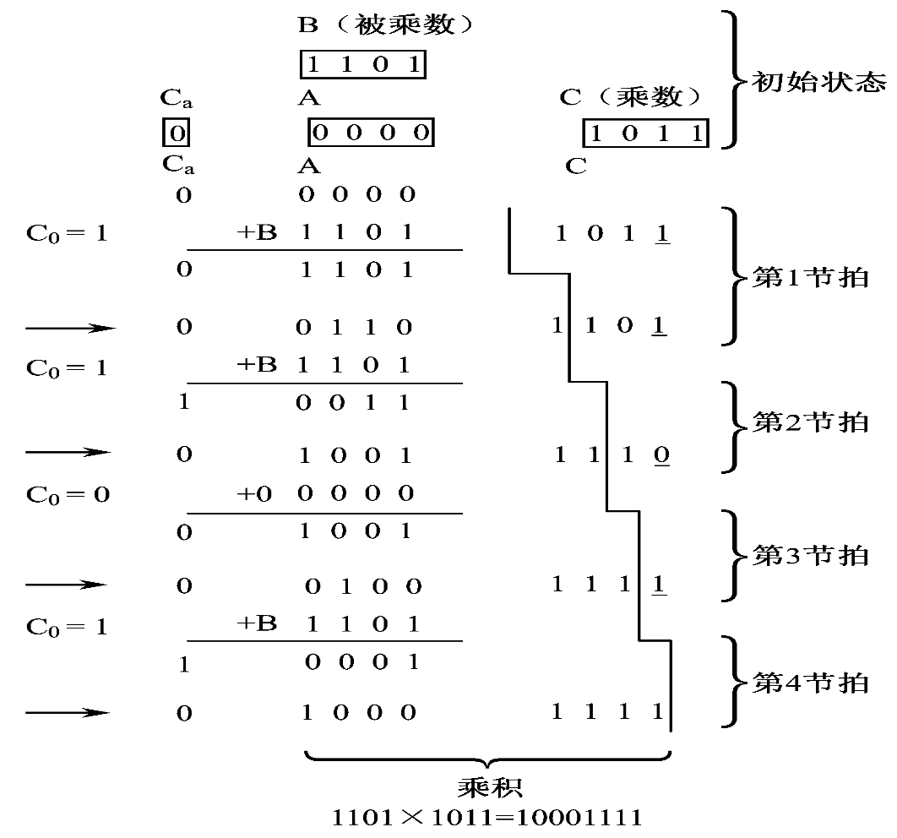

2. 有符号整数一位乘法
- 有符号 原码 一位乘法
    - 符号位单独处理，做异或操作
    - 乘积为|X|·|Y|
- 有符号 补码 一位乘法
    - $[X·Y]_补=[X]_补*Y$

### 2.3.2 除法

关键在于判断够减与否的问题
- 用逻辑线路进行比较判别。硬件代价大。
- 直接做减法试探。操作不规则，控制时序复杂。
    - 判断结果符号
        - 为0（即正）表明够减，上商1；
        - 为1（即负）表明不够减，上商0并加上之前减去的除数（即恢复余数）
    - 然后余数左移一位再做下一步。这就是恢复余数法。 

***加减交替法(不恢复余数法)***

- 余数为正，商“1”，余数左移一位，余数减除数
- 余数为负，商“0”，余数左移一位，余数加除数

流程图

- n位除数存放在B中，2n位被除数存放在A和C中。
- 除法完成后商放在C中，余数放在A中。
- 终止条件：被除数的低n位中的值全被商替换后(寄存器C)

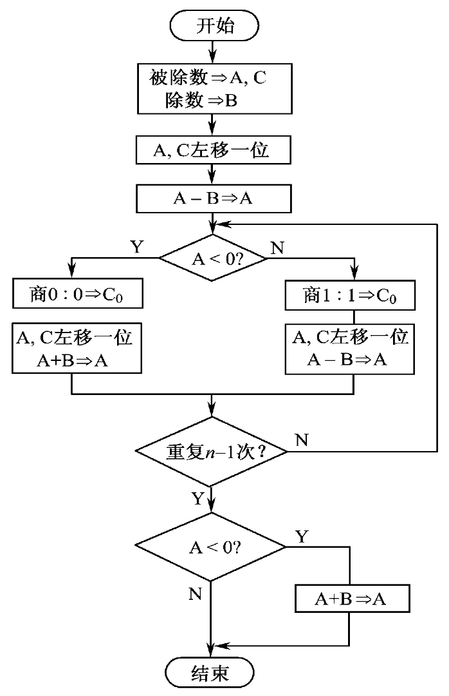

> 在重复n-1次操作后，如果A中的余数为负，需要恢复余数做A+B。最后的寄存器A中应获得正确的正余数。 

举例

## 2.4 浮点数运算

### 2.4.1 加减法

运算规则
- 对阶：向大阶看齐（为确保精度）
    - 求两数阶码之差E
    - 阶码小的数尾数右移E位，结果阶码为大阶数阶码值
        - 原码右移，最高位补0 
        - 补码右移，复制最高位
- 尾数相加减
- 结果规格化
    - 原码：最高有效位为1 
    - 补码最高位与符号位相反（-0.5除外）
    > 若结果位双符号补码
    > - 规格化：00.1XXXX或11.0XXXX
    > - 左规：00.0XXXX或11.1XXXX(11.10..0除外)
    >   - 左移，同时阶码减小，直至规格化
    > - 右规：01.XXXX或10.XXXX
    >   - 右移，复制符号位，同时阶码增大，直至规格化

- 舍入
    - 下舍上入法：0舍去，1则在新的尾数末尾加1
    - 恒舍/恒置1，误差大
- 判溢：根据阶码判断
    - 左规后，阶码减小 -> 判断是否下溢 -> "0"处理
    - 右规后，阶码增大 -> 判断是否上溢 -> 中断处理

### 2.4.2 乘除法

***乘法***

- 阶码相加并判溢
    - 补码相加：$[E_x+E_y]_补=[E_x]_补+[E_y]_补$
    - 移码相加：$[E_x\pm E_y]_移 = (2^n+([E_x]_补\pm [E_y]_移)) mod 2^{n+1}$
- 尾数相乘
- 规格化处理
    - 顶多左规一次（原来两数已是规格化），阶码减小，可能下溢
- 判溢

<!-- NOTE: 乘除不是重点，加减是 -->

## 2.5 ALU

ALU主要完成对二进制代码的定点算术运算和逻辑运算 
- 算数：定点加减
- 逻辑：逻辑与、或、异或、非
> 组合逻辑电路—多功能函数发生器；核心—加法器

硬件实现
- 如何构成一个二进制加法单元，即全加器
    > 使用半加器构成
- 如何构成一个n位并行加法器
- 以加法器为核心，通过输入选择逻辑扩展为具有多种算数和逻辑运算的ALU

多位加法器

- 串型加法器：由一个一位全加器组成，数据逐位串行进入加法器
- 并行加法器：由多个全加器组成，数据各位同时进入加法器进行运算
    - 串行进位：将n个全加器串接起来，就可进行两个n位数相加，进位依赖于上一个全加器的值，延迟大
    - 并行进位：复杂电路结构，让各级进位信号同时形成
    - 分组的串并结合
        - 组内并行、组间串行的进位链。      
        > 芯片SN74181
        > 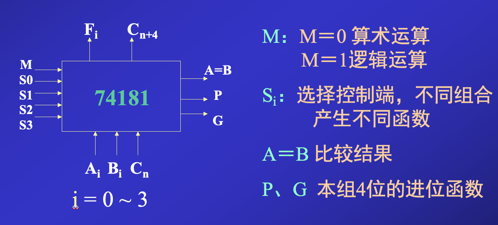
        - 组内并行、组间并行的进位链。
 

# 3. CPU模型机的组成及其数据通路

## 3.1 基本组成

### 3.1.1 寄存器

种类
- 存放控制信息的寄存器
- 存放处理数据的寄存器

为讨论简单，假设所有寄存器都是16位，内部结构是16个D触发 器，数据代码输入至D端，由CP端脉冲同步打入，其输出由输出门控 制。PSW的特征位则由R、S端置入，系统总线对MDR的输入也由R、S端 置入。

1. 可编程寄存器
    - 通用寄存器：R0,R1,R2,R3
    - 堆栈指针: SP
    - 程序状态字：PSW
    - 程序计数器：PC

2. 暂存器: C,D,Z
    - 在ALU输出端设暂存器Z存放运算结果。
    - 暂存器D还可暂存从主存储器读出的数据，并设有左移和右移功能。
    - 暂存器C主要用于暂存从主存读出的源操作数。

3. 指令寄存器IR 
    - 存放当前正在执行的一条指令。
    - 当执行一条指令时，应先将指令从主存中读出到IR中。
    - IR的内容（指令）是控制器产生控制信号的主要逻辑依据。

4. 与主存接口的寄存器MAR、MDR
    - 地址寄存器MAR用于存放CPU访问主存或I/O接口的地址。MAR连接
地址总线的输出门是三态门
        - 当微命令EMAR为高电平时，MAR输出地址送往地址总线；
        - 当EMAR为低电平时，MAR输出呈高阻态，与地址总线断开。
    - 数据寄存器MDR用于存放CPU与主存或I/O接口之间传送的数据。
        - CPU的输出数据必须先打入MDR，再从MDR输出到数据总线上。
        - 对于输入 CPU的数据，则从数据总线输入数据到MDR，然后由MDR送往CPU中的其他部件。
        - MDR与数据总线间为双向连接，其输出级也采用三态门，可与数据总线断开。
        - CPU对主存的控制信号有两个
            - 读信号RD控制对主存的读操作；
            - 写信号WR控制对主存的写操作。

### 3.1.2 运算部件

ALU的输入A来自暂存器D，输入B来自ALU总线，运算结果输出到Z。  
控制ALU运算的控制信号有：ADD、SUB、AND、OR、XOR、COM、NEG、A+1、A−1、B+1、B−1，它们分别控制ALU完成加、减、与、或、异或、求负、求反等运算。

### 3.1.3 总线与数据通路结构

1. ALU总线

CPU内部采用单总线结构
- 即设置一组ALU总线（也称为CPU内总线），由16根双向数据传送线组成
- ALU和所有寄存器通过这组公共总线连接起来。
- 在单总线结构中，CPU的任何两个部件间的数据传送都必须通过这组总线

挂接在ALU总线上的寄存器几乎都设有三态输出门和打入脉冲。
- 三态输出门打开，便将寄存器中的信息代码送到ALU总线上去，但每次只允许 一个部件向ALU总线发送信息代码；
- 接收信息的寄存器可以有多个，由打入脉冲将ALU总线上的信息代码打入其中。

2. 系统总线

模型机的CPU、存储器及I/O设备分别挂接在一组系统总线上。

系统总线包括：16根地址总线、16根数据总线，以及控制总线。
为简单起见，模型机采用同步控制方式。

- CPU通过MAR向地址总线提供访问主存单元或I/O接口的地址，由控制信号EMAR决定是否发送地址。I/O接口（如DMA控制器）也可以向地址总线发送访存地址。
- CPU通过MDR向数据总线发送或接收数据，以完成与主存单元或I/O接口之间的数据传送，由控制信号RD、WR决定传送方向。主存M和I/O设备之间也可以通过数据总线传送数据。
- CPU通过控制总线向主存或I/O设备发出有关控制信号，或接收控制信号。有时，I/O设备也可以向控制总线发出控制信号。

### 3.1.4 控制器及微命令的基本形式

1. 微命令的基本形式

微操作命令是最基本的控制信号，通常是指直接作用于部件或控制门电路的控制信号，简称微命令。
> 例如，打开或关闭某个三态门的电位信号，或是对寄存器进行同步打入、置位、复位的脉冲。

微命令的两种形式

电位型微命令：用信号电平的高与低分别表示不同的信息
> 通常定义高电平（如+5V）表示1，低电平（如0V）表示0。

- 各寄存器输出到ALU总线的控制信号有：$R0_{OUT} 、R1_{OUT} 、PC_{OUT} 、SP_{OUT} 、MDR_{OUT}$等。
• ALU运算控制信号有：ADD、SUB、AND、OR、XOR等。
• 暂存器D的左移/右移控制信号有：SAL、SAR。
• 程序计数器PC的计数控制信号有：PC+1。
• MAR和MDR输出到系统总线的控制信号有：EMAR、EMDR。
• 寄存器置入控制信号有：SMDR、SPSW。
• 主存的读/写信号有：RD、WR。

脉冲型微命令：利用脉冲边沿（即正向或负向跳变）来表示某一时刻，起定时作用，或识别脉冲的有无。
- 各寄存器均采用同步打入脉冲将ALU总线上的数据打入其中。
- 脉冲型微命令有：CP_{R0} 、CP_{R1} 、CP_{PC} 、CP_{IR} 、CP_{SP} 、CP_{MAR} 、CP_{MDR} 等。

2. 控制器

功能：根据指令产生控制信号序列以控制相应部件分步完成指定的操作。

- 向CPU内部发送控制信号，控制寄存器之间的数据传送，使ALU完成指定功能以及其他内部操作；
- 它也向CPU外部发出控制信号，以控制CPU与存储器或I/O设备之间传送数据。

传统控制器的主要部件包括：
- 指令寄存器IR
- 指令译码器
- 程序计数器PC
- 状态字寄存器PSW
- 时序系统
- 微操作信号发生器
在微型计算机中，将控制器和运算器（即CPU）集成在一块芯片上，因此现在
是将CPU作为一个整体来讨论。

如图3-20所示，微操作信号发生器的输入由
- IR中的指令经译码后的输出
- PSW的状态位
- 时序信号
- 外部的控制信号（如中断信号）组成。
微操作信号发生器则依据它的输入产生指令执行时所需要的微操作信号（即控制信号）。

## 3.2 数据传送

1. 寄存器之间的数据传送

在模型机中，寄存器之间可直接通过ALU总线传送数据，具体传送由输出门和打入脉冲控制。

如图3-20所示，
- 某寄存器$Ri$ 的输出和打入分别由$Ri_{OUT}$ 和$CP_{R_i}$控制。
- $Ri$ 的输出门控制信号$Ri_OUT$ 为高电平时，输出门打开，Ri 的内容就送到了ALU总线上；
- $Ri_OUT$为低电平时，输出门关闭，$Ri$的输出呈高阻态，与ALU总线隔离。
- 打入脉冲$CP_{R_i}$ 有效时，将ALU总线上的数据打入Ri 。

例如，把寄存器R1的内容传送到寄存器R3，即实现传送操作R1→R3所需控制信号为$R1_{OUT} 、CP_{R3}$ 。

2. 主存数据到CPU

如图3-20所示，要从主存中读一个数据到CPU
- CPU首先要把所取数据的地址送到MAR
- 然后将MAR中的地址输出到地址总线上，同时发读命令到主存；
- 主存完成读操作后将读出的16位数据送到数据总线上，再将数据线上的信息置入MDR。

例如要从存储器中取指令到指令寄存器IR，通过以下操作序列即可实现：
- PC→MAR ；PC中的指令地址送存储器地址寄存器
    - 实现PC→MAR传送操作所需的控制信号为$PC_{OUT} 、CP_{MAR}$ 。
- M→MDR→IR ；从存储器中读指令到IR
    - 实现读操作M→MDR的控制信号为EMAR、RD、SMDR；
    - 实现MDR→IR的控制信号为$MDR_{OUT} 、CP_{IR}$ 。

3. CPU数据到主存

由图3-20可见，CPU数据要写入主存
- 首先要将寄存器中的数据装入MDR，还要将写入主存单元的地址送MAR，然后发写命令；
- 主存将按MAR中的地址把MDR的内容写入对应单元中。

例如在R2中存放需写入主存的数据，存储单元地址在R1中，则写一个数据到存储器可通过以下操作序列实现：
- R1→MAR ；地址送MAR
    - 实现R1→MAR操作的控制信号为$R1_{OUT} 、CP_{MAR}$ 。
- R2→MDR ；数据送MDR
    - 实现R2→MDR的控制信号为$R2_{OUT} 、CP_{MDR}$。
- MDR→M ；数据写入主存
    - 实现写操作MDR→M的控制信号为EMAR、EMDR、WR。

4. 执行算数或逻辑操作

执行算术或逻辑操作时，由于ALU本身是没有内部存储功能的组合电路，因此，如要执行加法运算，被相加的两个数必须在ALU的两个输入端同时有效，图3-20中的暂存器D即用于该目的。
- 先将一个操作数经ALU总线送入暂存器D保存起来，D的内容在ALU的输入端A始终有效
- 再将另一个操作数经总线直接送到ALU的输入端B；这样两个操作数都
送入了ALU
- 运算结果暂存在暂存器Z中

若要执行“把寄存器R1和R2的内容相加，结果送到R3”这个功能，需要分成三步执行：
- R1→D ；把R1的内容先送到寄存器D
    - 实现R1→D操作的控制信号为$R1_{OUT} 、CP_D$ 。
- D+ R2→Z ；R2内容送到ALU的B端与D内容通过ALU相加，结果送Z
    - 实现D + R2→Z的控制信号为$R2_{OUT} 、ADD、CP_Z$ 。
- Z→R3 ；将相加结果送入R3中
    - 实现Z→R3的控制信号为$Z_{OUT} 、CP_{R3}$。

# 4、组合逻辑控制器原理

按产生控制信号的方式不同，控制器可分为
- 组合逻辑控制器
- 微程序控制器两种基本类型。

组合逻辑控制器是指产生控制信号（即微命令）的部件，是用组合逻辑线路来实现的。

在模型机中有几十个微命令，则每个微命令都需要一组逻辑门电路，根据相应的逻辑条件（如指令的操作码、寻址方式、时序信号等）产生该微命令。控制器一旦制造完成后，这些逻辑电路之间的连接关系就固定了，不易改动，所以组合逻辑控制器又称为硬连逻辑控制器。

## 4.1 模型机的指令系统

本节先介绍模型机的指令系统，然后假设模型机采用的是组合逻辑控制器，讨论其时序系统、指令执行流程及微命令的产生与综合。

### 4.1.1 指令格式

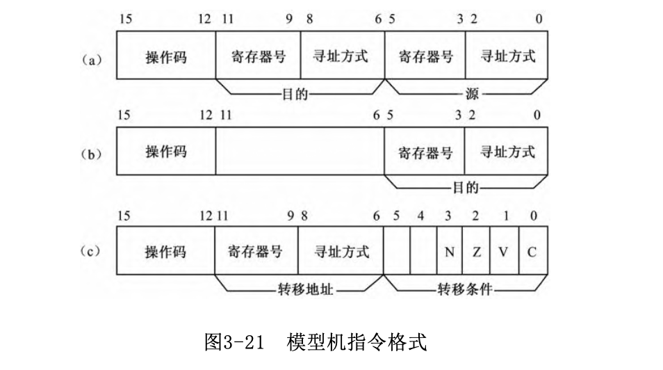

对于转移指令字段，第0-3位中有一位为1，表示转移条件
- 进位--`C`
- 溢出--`V`
- 结果为零--`Z` 
- 结果为负--`N`  
第五位表明转移方式，若为0，表示相关标志位为0则转移。  
若第0-5位全为0，则表无条件转移

可编程寄存器有七个，编号如下
- 通用寄存器R0-R3,000-011
- 堆栈指针SP,100
- 程序状态字PSQ,101
- 程序计数器PC,111

### 4.1.2 寻址方式

- 立即数寻址，操作数紧跟着指令，即在指令代码之中。
- 操作数在寄存器中，即寄存器寻址方式。
- 操作数在主存中，相应的寻址方式有：
    - 直接寻址方式，地址紧跟指令操作码与寻址字段后。
    - 寄存器间址方式，地址在寄存器中。
    - 自增型寄存器间址方式。
    - 自减型寄存器间址方式。
    - 变址方式。

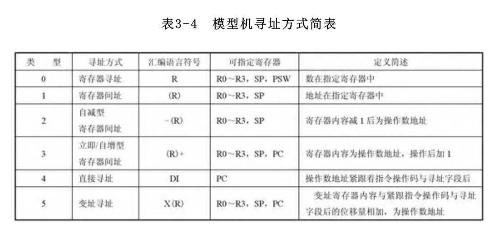

- 0型

寄存器寻址方式，寻址字段代码000，汇编符号`R`，定义为：操作数在指定的寄存器中

- 1型

寄存器间址方式，寻址字段代码001，汇编符号`(R)`，定义为：操作数地址在指定寄存器中（即从指定寄存器中得到操作数地址，再按次地址访问主存，从主存中读取操作数）

- 2型

自减型寄存器寻址方式，寻址字段代码010，汇编符号`-(R)`，定义为：将指定寄存器内容减去1后为操作数地址，再按地址防伪主存，从主存中获取操作数

- 3型

立即/自增型寄存器寻址方式，寻址代码011，汇编代码`(R)+`，定义为：操作数地址在指定寄存器中，地址使用后将寄存器内容加1，

- 4型

直接寻址方式，寻址字段代码100，汇编符号`DI`，定义为：操作数地址紧跟指令操作码与寻址字段后的单元中，然后PC+1，将修改后的PC内容作为地址，据此访问紧跟当前指令操作码与寻址字段后的存储单元，从中取得操作数地址（称为绝对地址），据此再度访存，读得操作数，然后PC+1

- 5型

变址方式，寻址字段101，汇编符号`X(R)`，其中X是变址的一种习惯标注符，定义为：指定变址寄存器内容与紧跟指令操作码与寻址字段后的位移量相加，其结果为操作数地址。

### 4.1.3 操作类型

操作码共4位，现设14中指令，余下两种操作码可共扩展

1. 传送指令

- `MOV`: 传送，操作码0000

2. 双操作数算数逻辑指令

- `ADD`: 加，操作码0001（带进位）
- `SUB`: 减，操作码0010（带进位）
- `AND`: logic and,operator 0011
- `OR`: logic or,operator 0100
- `EOR`: 逻辑异或,操作码0101

3. singnal operator instruction 
- `COM`: 求反,operator 0110
- `NEG`: 求补，operator 0111
- `INC`: add 1,operator 1000
- `DEC`: substruct 1,operator 1001
- `SL`: move left,operator 1010
- `SR`: move right,operator 1011

4. program control instruction 

- `JMP`: 转移指令,operator 1100

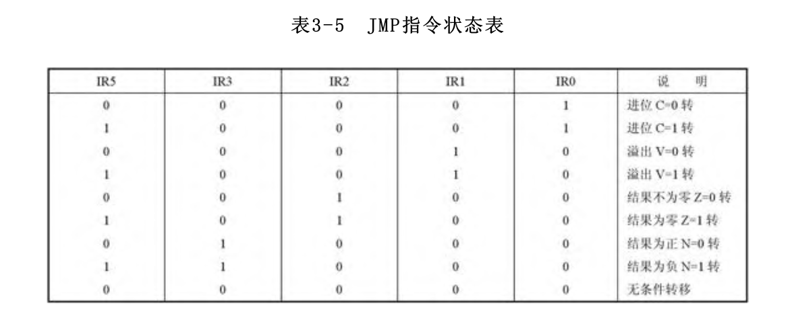

如表3-5所示，JMP指令第3～0位选择一位为1，表明以PSW中的某一特征作为转移条件。

JMP指令第5位（IR5）决定转移条件为0转，还是为1转。若JMP指令第5～0位全为0，则表示无条件转移。

- `RST`: 返回指令，operator 1100

RST指令与JMP指令的操作码相同，可视为一条指令。RST指令只能采用自增型寄存器间址表明转移地址，并指定寄存器为SP，即寻址方式为（SP）+。它从堆栈中取出返回地址，然后修改堆栈指针SP+1。实际上，“JMP（SP）+”指令就是一条RST指令。

- `JSR`: 转子指令，operator 1101

执行JSR指令时，先将返回地址压栈保存，然后按寻址方式找到转移地址（即子程序入口地址），将它送入PC中。

## 4.2 模型机的时序系统

组合逻辑控制器依靠不同的时间标志，使CPU分步工作。

模型机采用前述的三级时序系统，即将时序信号分为工作周期、节拍（时钟周期）和工作脉冲。

### 4.2.1 工作周期划分

模型机设置了6种工作周期，分别用6个周期状态触发器来表示它们的状态。任一时刻只允许一个触发器为1，表明CPU现在所处的工作周期状态，并为该阶段的工作提供时间标志与依据。

1. 取指令周期`FT`

完成取指所需的操作。

2. 源周期`ST`

如果需要从主存中读取源操作数，则进入ST。在ST中将依据指令寄存器IR的源地址字段信息进行操作，形成源地址，读取源操作数。

3. 目的周期`DT`

如果需要从主存中读取目的地址或目的操作数，则进入DT。在DT中将依据指令寄存器IR的目的地址段信息进行操作。

4. 执行周期`ET`

取得操作数后，则进入ET，将依据IR中操作码执行相应操作，如传送、算术运算、逻辑运算、获得转移地址等。

5. 中断响应周期`IT`

CPU在响应中断请求之后，进入中断响应周期IT。

- 在IT中将直接依靠硬件进行关中断、保存断点、转处理程序入口等操作。
- IT结束后，进入取指周期FT，开始执行中断处理程序。

> 中断方式是指这样一种工作方式：由于某些异常情况或特殊请求，引起CPU暂停执行当前程序，转去执行中断处理子程序，以处理这些情况或请求，等处理完后又返回原程序断点继续执行，这一过程就称为中断。

6. DMA传送周期`DMAT`

CPU响应DMA请求之后，进入DMAT。

在DMAT中
- CPU交出系统总线的控制权，即MAR、MDR与系统总线脱钩（呈高阻态）
- 改由DMA控制器控制系统总线，实现主存与外围设备间的数据直接传送
- 因此对CPU来说，DMAT是一个空操作周期。

> DMA（Direct Memory Access）即直接访存方式，它的基本思想是在主存储器和I/O设备 之间建立直接的数据传送通路，由专门的DMA控制器控制主存和I/O设备间的数据传送，在传送时不需CPU干预。由于传送过程完全由硬件实现，所花费的时间短，因此能满足高速数据传送的需要。

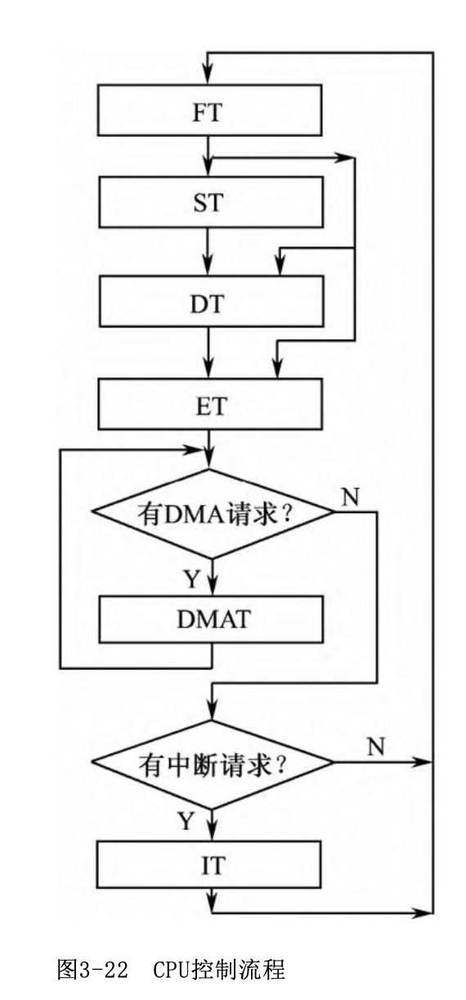

为此，在每一周期结束前，都要判断下一个周期状态将是什么，并为此准备好进入该周期的条件，如发出电位信号1→ST等。到本周期结束的时刻，再实现周期状态的定时切换。

由于DMA周期要实现的是高速数据直传，所以DMA请求的优先级高于中断请求。

> 注意，实际的计算机大多允许在一个系统总线周期结束时插入DMAT。本模型机为了简化其控制逻辑，限制在一条指令结束时才判别与响应DMA请求。

### 4.2.2 节拍（时钟周期）

每个工作周期的操作一般需要分成若干步完成，为此将工作周期划分成若干节拍。

节拍宽度为最长微操作所需的时间，即访问主存操作所需的时间
> 注意，在实际机器中节拍长度短于访存周期

节拍发生器由计数器T与节拍译码器组成。当工作周期开始时，T=0，若本工作周期还需延长，则发命令T+1，计数器将继续计数，表示进入一个新的节拍；若本工作周期应当结束，则发命令T=0，计数器T复位，从T=0开始一个新的计数循环，进入新的工作周期。

### 4.2.3 工作脉冲

在节拍中执行的有些操作需要同步定时脉冲，如将稳定的运算结果打入寄存器，又如周 期状态切换等。为此，模型机在每个节拍的末尾发一个工作脉冲P，作为各种同步脉冲的来源

- 工作脉冲P的前沿作为打入寄存器的定时信号，它标志着一次数据通路操作的完成。
- P的后沿作为节拍与工作周期切换的定时信号，在此刻对节拍计数器T计数、打入新的工作周期状态。

## 4.3 指令流程

分析指令流程是为了在寄存器这一层次分析指令序列的读取与执行过程，也就是讨论CPU的工作机制

设计和确定指令执行的具体流程通常有两种方法
- 工作周期为线索: 以工作周期为主轴来制定各类指令的操作流程
- 指令为线索: 以指令类型为主轴来制定流程

### 4.3.1 取指令周期FT

FT中的操作是各类指令流程都需首先经历的，与指令类型无关，通常称为公共操作。

#### 进入FT的条件

取指周期状态触发器FT为1

1. 初始化置入FT 

当机器加电或按“复位”键后，将产生一个“复位信号”预置全机的初始状态。
- 首先将某值（如全0）置入程序计数器PC中，此即为开机后执行的第一条指令的地址，同时将取指周期状态触发器FT置1。
- 当复位信号结束后，开放时钟，开始执行取指操作，进入操作系统程序运行状态。由于在复位信号作用时，时钟被封锁，因此采取S端置入方式。

2. 程序运行过程中，同步打入FT 

在正常的程序运行过程中，时钟已开放，可用同步方式实现周期状态转换。
- 若要进入FT，则事先在状态触发器D端准备好条件1→FT，然后产生同步脉冲$CP_FT$ ，由$CP_FT$的上升沿（即脉冲P的后沿），将1打入FT。
- 若要结束FT状态，则让D端电平为0，并产生$CP_FT$将0打入FT，使FT变为0，表示取指周期结束。

有三种情况可采用同步方式进入新的取指周期：

- 当一条指令将执行完毕时，即在执行周期ET中，如果不响应DMA请求与中断请求，程序正常执行，接着就转入新的FT，开始执行下一条指令。
- 在中断周期IT这一过渡阶段操作结束后，就应转入中断处理程序，即进入FT。
- 在DMA周期完成一次DMA传送后，如果没有新的DMA请求，也没有中断请求，则恢复执行被暂停的程序，也应进入FT。

因此，产生控制信号1→FT的逻辑条件如下：
$$1 \to FT = ET(\overline{1 \to IT} \cdot \overline{1 \to DMAT}) + IT + DMAT(\overline{1 \to IT} \cdot \overline{1 \to DMAT})$$
> 整个表达式是一个布尔逻辑表达式，所有变量都只有两种状态（0或1），用来表示不同条件的真或假，以便触发控制信号$1 \to FT$。

#### 取指流程

- 在$FT_0$中先将指令地址由PC送入MAR；
- 在$FT_1$中从主存读出指令代码到MDR再送到指令寄存器IR中，由于PC本身具有计数功能，所以可同时修改程序计数器PC的内容，让PC+1，则修改后的PC指向紧跟当前指令操作码与寻址字段后的下一主存单元。

#### 微操作时间表

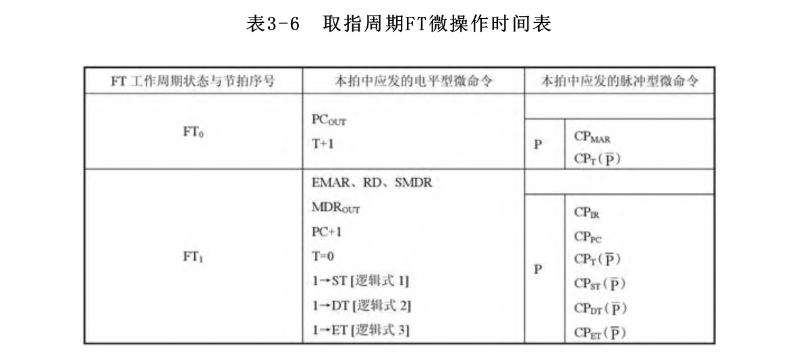

表3-6以操作时间表形式，进一步给出了为实现取指流程的每步基本操作与转入下一步操作所需的微命令（包括控制电位和脉冲）。

- 左栏给出节拍序号，如T0 、T1 、…，也可将工作周期状态与节拍序号综合标注，如FT0 形式。
- 中栏给出在本拍中应发的电平型微命令，这些命令同时发出，维持一个节拍宽度。
    - 有些命令只在某些逻辑条件下才发出，则进一步在括号中标注其补充逻辑条件
    - 如果表中空间不便写全，或是在拟定本表时还不能给出全部逻辑条件，要等到全部指令流程与操作时间表都列完后才能全部确定，则可在括号中先注明逻辑条件，以后再补充相应逻辑式
- 右栏给出本拍中应发的脉冲型微命令，并示意性地表明脉冲是在时钟周期的末尾发出的，由工作脉冲P或其反相脉冲P定时。

---

让我们分析FT操作时间表中各个微命令的含义。如表3-6所示，
- 在$FT_0$
    - 要完成PC→MAR操作，则应发控制信号$PC_{OUT}$、$CP_{MAR}$ ，由它们控制将PC的内容送ALU总线并打入MAR中。
    - 控制信号T+1、CPT 控制转入下一个节拍FT1 。
- 在FT1中
    - 要完成M→MDR→IR操作，控制信号EMAR、RD、SMDR控制从主存中读一个字（指令）置入MDR，由$MDR_{OUT}$ 、$CP_{IR}$将MDR内容打入IR中。
    - 要完成PC+1→PC操作，控制信号PC+1、$CP_{PC}$ 将PC内容加1计数。

在取指周期结束时，需根据已取到IR中的指令操作码与寻址方式，判断应转入哪个周期， 因此1→ST、1→DT、1→ET这三个电位信号中只能有一个为1，其逻辑条件主要涉及操作码与寻址方式。

当周期状态发生转换时，FT触发器的D端1→FT为0，$CP_{FT}$将其打入0。  
在周期状态结束时，T+1为0，由CPT使T计数器置0。

### 4.3.2 MOVE指令

如果当前指令是MOV指令，CPU将执行MOV指令流程，如图3-26所示。

MOV指令流程图包含了各种寻址方式的组合
- 流程分支的逻辑依据就是指令的寻址方式字段代码，图中标注为相应的汇编符号。
- 每个工作周期结束时要判断后继工作周期将是什么。

1. FT 

取指令周期FT 

2. ST 

在FT中根据寻址方式作出判别，决定在ST中的分支。

- R型: 源操作数在指定寄存器中
    - 第1拍ST0将寄存器Ri内容送入C中。
- \(R\)型
    - 第1拍ST0 完成从指定寄存器Ri 中取得源地址
    - 第2拍ST1 访存读取操作数，经MDR送入C中暂存。
- −\(R\)型 
    - 第1拍先修改地址指针内容，即指定寄存器Ri 内容减1，所得结果打入Z。
    - 第2拍将Z同时送入Ri 与MAR，形成源地址
    - 第3拍访存读取操作数，送入C暂存。
- I/\(R\)+型 
    - 第1拍取得地址
    - 第2拍读取操作数
    - 第3、4拍修改地址指针，即Ri 加1。
- DI型 操作数地址紧跟着指令。取指后PC已加1，指向紧跟当前指令的下一单元
    - ST0 将PC内容送MAR
    - ST1 据此访存，从中取得操作数地址，并同时修改PC。
    - ST2 读取操作数。
- X\(R\)型 需两次访存，第1次在PC指点下读取位移量，第2次读取操作数。
    - ST0 中将PC内容送MAR。
    - ST1 读取位移量，暂存于D，并修改PC指针。
    - ST2 实现变址计算，即变址寄存器Ri中的变址量与D中的位移量相加，获得操作数地址。
    - ST3 操作数地址送MAR。
    - ST4 读取操作数。

3. DT 

与ST相似，但对于MOV指令，DT直到取得目的地址为止。
> $DR$表示目的地址采用寄存器寻址方式，若不是寄存器寻址方式，则用$\overline{DR}$表示。

4. ET 

执行周期的基本任务是实现操作码要求的传送操作，这就需要考虑在进入ET时，操作数是送往寄存器还是送往主存，可以根据DR状态区分。因此，按DR形成两种分支，如图3-26所示。

指令流程图只反映了正常执行程序的情况，实际上在最后一拍还需判别是否响应DMA请求与中断请求，即是否发1→DMAT或1→IT。如果都没有，则建立1→FT，转入下一条指令。

### 4.3.3 双操作数指令

双操作数指令共有5条：加ADD、减SUB、与AND、或OR、异或EOR，其指令流程如图3-27所示。

其中取指和取源操作数周期，与MOV指令相同，图中不再细画。目的周期DT也与MOV指令的DT相似，但多一步操作，即访存读取目的操作数，其余则完全相同，不再赘述。

OP是操作运算符，例如C OP D→Z，若该指令是一条加法指令，则所描述的含义即为C+D→Z。

### 4.3.4 单操作数指令

单操作数指令共有6条：求反COM、求补NEG、加“1”INC、减“1”DEC、左移SL、右移SR，其指令流程图如图3-28所示。

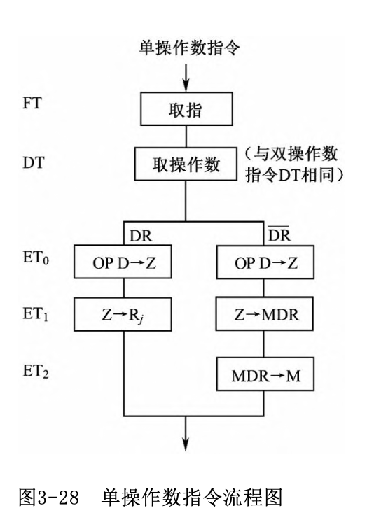

单操作数指令只有一个操作数，处理后送回原处，因此不需源周期状态ST，取指后直接进入目的周期DT，执行周期ET中的流程分支也只有两类，其余均与双操作数指令相同。$RT_0$ 中的具体操作含义取决于操作码OP，例如OP D→Z，若该指令是一条求反指令，则所描述的含义为 $\overline{D}$→Z。

### 4.3.5 转移指令JMP/返回指令RST 

JMP指令的流程如图3-29所示。RST指令被视为JMP指令的一种特例。

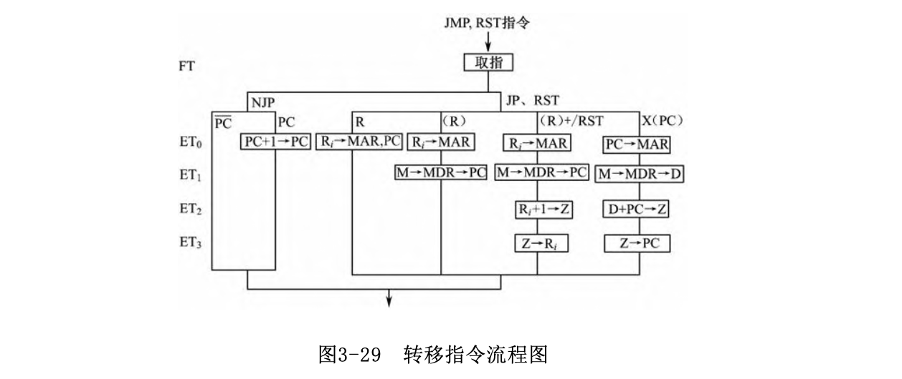

JMP/RST指令的主要任务是获得转移地址或返回地址，安排在执行周期ET中完成，因此
- 在FT中读得指令并修改PC后，直接进入ET。
- 根据指令规定的转移条件与PSW相应的位的实际状态，决定是否转移，相应地分成转移成功（JP）、转移不成功（NJP）两种可能。

1. 转移不成功`NJP`

转移条件不满足，则程序将顺序执行。 在决定下一条指令地址时有以下两种可能的情况

- 转移地址段中的寻址方式所指定的寄存器如果不是PC寄存器，称为$\overline{PC}$型(即通用寄存器、堆栈指针SP)，则后继指令紧跟着当前转移指令（在FT中修改后的PC内容，就是后继指令地址）。

- 转移地址段中的寻址方式所指定的寄存器指明是PC，称为PC型，则紧跟指令操作码与寻址字段之后的单元已用来存放转移地址，再下一个存储单元内容才是后继指令，所以在ET中令PC再次加1。

2. 转移成功JP

即转移条件满足，按寻址方式获得转移地址。

- 寄存器寻址R: 从指定寄存器中读取转移地址。
- 寄存器间址（R）: 从指定寄存器中读取间址单元地址，再从间址单元中读取转移地址。
- 自增型寄存器间址（R）+ : 比上一种寻址方式增加一步修改指针R i 的操作。
- 返回指令RST 其寻址方式固定为（SP）+，即从堆栈中读取返回地址，然后修改指针SP。
- 相对寻址X（PC）: 以PC内容为基准进行转移地址计算。

### 4.3.4 转子指令JSR

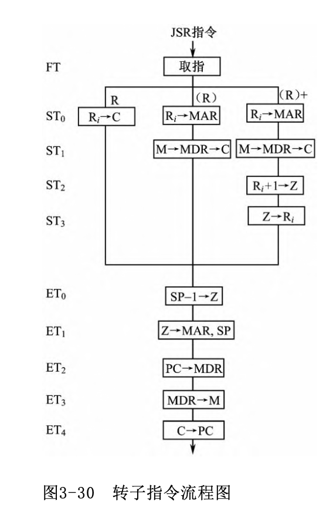
转子指令采用（R）或（R）+型，安排在源周期ST，从主存中读取转移地址，暂存于C中。

在ET0 ～ET3 中，先将返回地址压入堆栈保存，即修改堆栈指针，将PC内容（返回地址）经MDR写入堆栈。在ET4 中再将子程序入口地址送入PC。

### 4.3.5 中断响应周期IT 

当外部有中断请求信号送入CPU时
- 若允许响应，则在一条指令的执行周期ET的最后一拍，向请求源发中断响应回答信号INTA，并在ET结束时将IT置1，即转入中断响应周期。
- 进入IT后，将断点与PSW压入堆栈，然后关中断，最后形成中断处理程序的入口地址并送入PC。
- IT一结束就切换到取指周期FT，即开始执行中断处理程序。
> 有关中断的内容将在以后的章节深入讨论。

### 4.3.6 DMA周期

在一条指令执行结束时查询有无DMA请求
- 如有请求且CPU允许响应，则CPU与总线断开，将总线控制权交给DMA控制器，并转入DMA周期。
- 在DMAT中，CPU暂停工作，由DMA控制器接管系统总线，向总线发出有关地址码与控制信息，控制主存与外设接口之间的信息传送。
- 由于DMAT并不影响程序计数器PC的内容与有关现场，只是暂停执行程序，所以只要由DMAT转入FT，程序就将恢复执行。

### 4.3.7 键盘操作

模型机在加电或复位后，产生一个“复位信号”对全机进行初始化，使PC置0，然后进入取指周期FT。
- 主存0号单元中存放的是一条无条件转移指令，它指向“操作系统”的入口。
- 机器进入系统状态后，可通过键盘输入各种命令信息，使机器进入所要求的工作状态。

## 4.4 微命令的综合与产生

在组合逻辑（硬连逻辑）控制器中
- 微命令是由组合逻辑电路产生的。产生微命令的逻辑条件有工作周期名称、节拍序号、定时脉冲，以及操作码、寻址方式、寄存器号、PSW状态、中断请求、DMA请求等。
- 在给出全部指令的流程图和微操作时间表后，通过对它们进行综合分析，就可列出各个微命令的逻辑表达式。

微命令的逻辑表达式都是“与-或”式的逻辑形态，各“与”项通常包括：指令操作码译码信号、寻址字段译码信号、工作周期状态、节拍、工作脉冲等。

例如：
$$PC_{OUT} =  FT \cdot T_0 + MOV \cdot [DI + X(R) \cdot ST \cdot T_0 + ...$$

$PC_{OUT}$的输出由不同指令（如FT和MOV）与控制信号（如$T_0,ST$等$）组合触发。

$$CP_{MAR} = FT \cdot T_0 \cdot P + MOV \cdot ST \cdot T_0 \cdot P ...$$
在特定状态$P$、周期$T_0$及指令条件下触发$CP_{MAR}$信号输出。

上述微命令的逻辑式反映出在什么情况下需发出某个微命令，将它们整理化简后就获得一组最终的逻辑表达式，可用组合逻辑门电路实现，也可用PLA门阵列实现。所有产生微命令的组合逻辑电路就构成了微操作信号发生器，如图3-20所示。

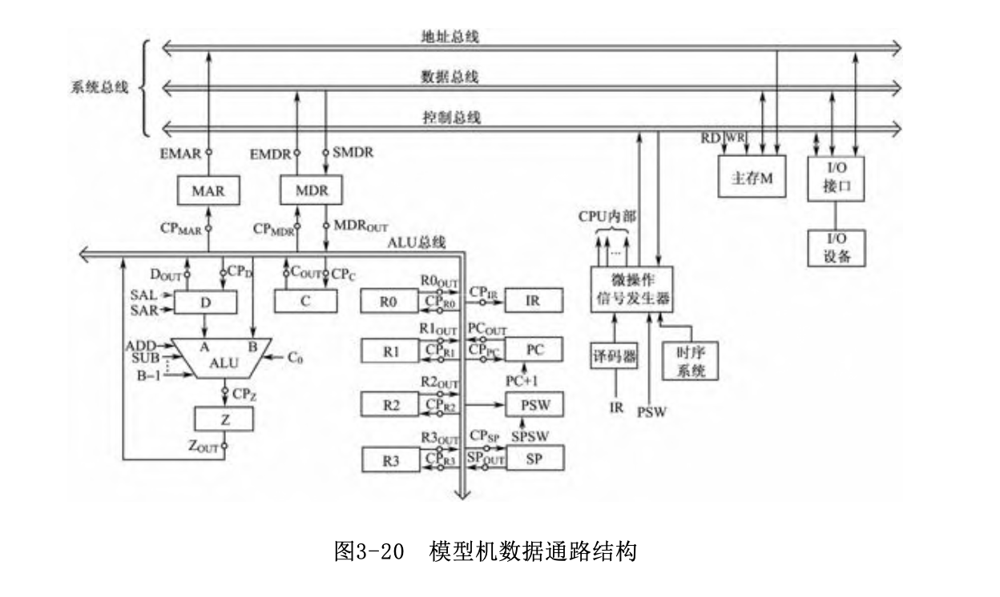

## 4.5 小结

组合逻辑控制方式
- 优点：组合逻辑控制方式是用逻辑门电路产生微命令的，其速度主要取决于电路延迟，因此在高速计算机，如RISC处理器中，常采用这种速度较快的硬连控制方式。
- 缺点：在组合逻辑控制器中，产生微命令的门电路所需的逻辑形态很不规整，因此组合逻辑控制器的核心部分比较繁琐、零乱，设计效率较低，检查调试也比较困难。而且设计结果用印制电路板（硬连逻辑）固定下来以后，就很难再修改与扩展。

解决上述问题的方法是采用微程序控制方式
- 将程序技术引入到CPU的构成级，即像编制程序那样编制微命令序列，从而使设计规整化
- 另一方面，将存储结构引入CPU，取代组合逻辑的微操作信号发生器。也就是将微命令表示为二进制代码直接存入一个存储器中，只要修改所存储的代码即微命令信息，就可修改有关功能与执行方式。

# 5. 微程序控制器原理

## 微程序控制概念

有些CPU采用微程序控制方式来产生微命令，相应的控制器称为微程序控制器。

### 基本概念与术语

1. 微命令与微操作

- 微命令：构成控制信号序列的最小单位（例如，打开或关闭某个控制门的电位信号、某个寄存器的打入脉冲等）微命令由控制器通过控制线向有关的部件发出。

- 微操作：微命令控制微操作的发生，微操作是微命令的具体实现。

2. 微指令与微周期

- 微指令

若干微命令的组合，以编码形式存放在控制存储器的一个单元中，控制实现一步操作。一条微指令的功能就是给出完成指令某一步操作所需的微操作控制信息和后继微 指令地址信息。

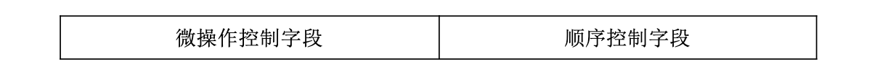
- 微周期

通常指从控制存储器中读取一条微指令并执行相应的
微操作所需的时间。

3. 微程序与微程序设计

- 微程序：一系列微指令的有序集合。
- 微程序设计：是将传统的程序设计方法运用到控制逻辑的设计中

4. 工作程序与微程序、主存储器与控制存储器

- 程序员所编制的工作程序以机器指令为单位存放在主存储器中，由于解决不同问题的工作程序中所包含的机器指令、数据及机器指令条数可能有所不同，要求主存单元内容是可以更新的，因此主存储器是可读可写的随机访问存储器。

- 而由机器设计者编制的微程序是以微指令为基本单位，在制作机器时用特殊方式将其写入控制存储器中，由于机器的指令系统是固定的，所以实现指令系统的微程序也是固定的，并且在CPU执行机器指令时，控制存储器只能被读出，不能写入，故控制存储器用只读存储器来实现。

### 微程序控制方式的基本思想

- 将机器指令分解为基本的微命令序列，用二进制代码表示这些微命令，并编成微指令，多条微指令再形成微程序。
- 每条机器指令对应一段微程序，在制造CPU时固化在CPU中的一个控制存储器（CM）中。
- 当执行一条机器指令时，CPU依次从控制存储器CM中取微指令，从而产生微命令序列。

- 一条微指令包含的微命令，控制实现一步（一个节拍）操作；
- 若干条微指令组成的一小段微程序解释执行一条机器指令。CM中的微程序能解释执行整个指令系统的所有机器指令。
- 这种将微命令以代码形式存储起来的做法就是前面提到的存储控制逻辑，而微指令序列设计方法可以借助于一般的程序设计技术实现。

微程序控制器的核心是控制存储器CM，用它存放各条指令对应的微程序。
- CM可用只读存储器ROM构成。
- 若采用可擦除可编程只读存储器EPROM作为CM，则有利于微程序的修改和动态微程序设计。

控制存储器CM中的一行表示存放的一条微指令
- 列线输出微指令代码。
- 行列交叉处有黑点者表示该位信息为1，行列交叉处无黑点者表示该位信息为0。

微指令寄存器存放从CM中读出的微指令，它包含两大部分：
- 微操作控制字段（微命令字段）: 微命令字段可直接按位或通过译码提供微命令
- 顺序控制字段（微地址字段）: 顺序控制字段用于控制产生下一条微指令地址

### 微程序执行过程的描述

机器所有指令对应的微程序放在控制存储器CM中，其一条机器指令对应的微程序执行过程可描述如下：

1. 根据微地址寄存器的内容（通常为0或1），从CM的0号（或1号）单元中读出一条“取机器指令”微指令，送到微指令寄存器，这是一条公用微指令。
> 该微指令的微命令字段产生有关控制信号，完成从存储器中取出机器指令送往指令寄存器IR，并修改程序计数器PC的内容。

2. IR中机器指令的操作码通过微地址形成电路形成这条指令对应的微程序入口地址，并送入微地址寄存器中。

3. 根据微地址寄存器中的微地址从CM中取出对应微程序的一条微指令，其微命令字段产生一组微命令控制有关操作；由顺序控制字段形成下一条微指令地址，送入微地址寄存器。重复步骤3直到该机器指令的微程序执行完。

4. 执行完一条机器指令的微程序后，返回到CM的0号（或1号）微地址单元，重复步骤1，读取“取机器指令”微指令，以便取下一条机器指令。

## 微指令编码方式

1. 直接控制编码（不译码法）

微指令的微命令字段中每一位都代表一个微命令。设计微指令时，选用或不选用某个微命令，只要将表示该微命令的对应位设置成1或0就可以了。因此，微命令的产生不需译码。

这种编码的优点是简单、直观、执行速度快、操作并行性好，其缺点是微指令字长过长。

2. 分段直接译码法

- 互斥性微命令：在同一微周期中不能同时出现的微命令
> 例如，控制ALU操作的各种微命令ADD、SUB、 AND等是不能同时出现的，即在一条微指令中只能出现一种运算操作。 又如主存储器的读命令与写命令也不能同时出现。

- 相容性微命令：在同一微周期中可以同时出现的微命令

如果将微指令的微命令字段分成若干小字段，把相斥性微命令组合在同一字段中，而把相容性微命令组合在不同的字段中。每个字段独立编码，每种编码代表一个微命令，且各字段编码含义单独定义，与其他字段无关，这就称为分段直接编译法

分段直接编译法可以缩短微指令字长，同时又保持一定的并行控制能力。

常见的分段方法有两种：
- 将机器的全部微命令中相斥性微命令尽可能编入同一字段，而不管它们是否属于同一类操作。
- 将同类操作（或控制同一部件的操作）中相斥性微命令划分在一个字段内

3. 分段间接译码法

一个字段的含义不仅决定于本字段编码，还兼由其他字段来解释，以便使用较少的信息位表示更多的微命令。

属于这种编码方法的常见形式有以下两种：
- 可解释的字段译码

例如微指令中A字段（高3位）的含义兼由第0位来解释，当第0位为1时，字段A表示某一类操作中的8个相斥性微命令；第0位为0时，字段A表示另一类操作中的8个微命令。因此，第0位与A字段总共可表示16种微命令。

这种方法可将属于不同类型的操作归并为一个字段。当然解释位也可扩展为一个字段或某一个状态触发器。

- 分类编译

按微指令的功能将其分成几类，分别安排各类微指令的格式和编码，由某一字段或状态触发器来控制和区别。例如，可分为ALU操作类、I/O操作类等。

4. 常数源字段E的设置

在微指令中，一般设有一个常数源字段E，就如同机器指令中的立即操作数一样，用来提供微指令所使用的常数（由设计者填写）
- 如提供计数器初值，通用寄存器地址，转移地址等。
- 字段E也可用来参与其他控制字段的间接编码，以减少微指令字长，增加微指令的灵活性。

字段E在微指令中的形式为

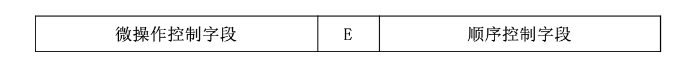

## 微程序的顺序控制方式

### 微程序入口地址的形成

由于每条机器指令都需要取指操作，所以将取指操作编制成一段公用微程序，通常安排在控制存储器的0号或1号单元开始的一段CM空间。

每一条机器指令对应着一段微程序，其入口就是初始微地址。首先由“取机器指令”微程序取出一条机器指令到IR中，然后根据机器指令操作码转换成该指令对应的微程序入口地址。

这是一种多分支（或多路转移）的情况，常用以下三种方式形成入口地址:

1. 当操作码的位数与位置固定时，可直接使操作码与入口地址码的部分相对应。

例如，操作码为P，则入口地址为000P，这样控制存储器0页的一些单元地址被安排作为各段微程序入口地址，再通过单元内的无条件转移微指令与各自的后续微程序相连接。

2. 当每类指令中的操作码位数与位置固定，而各类指令之间的操作码与位置不固定时，可采用分级转移的方式。

例如，操作码为P，则入口地址为000P，这样控制存储器0页的一些单元地址被安排作为各段微程序入口地址，再通过单元内的无条件转移微指令与各自的后续微程序相连接。

3. 当机器指令的操作码位数和位置都不固定时，通常可以采用PLA电路将每条指令的操作码翻译成对应的微程序入口地址，也可以采用PROM（可编程只读存储器）实现转移，将指令操作码作为PROM的地址输入，其对应的PROM单元内容即为该机器指令的微程序入口地址。

### 后继地址的形成

转移到一条机器指令对应的微程序入口地址后，就开始执行微程序，这时每条微指令执行完毕时，需根据其中的顺序控制字段的要求形成后继微指令地址。

形成后继微指令地址的方式很多，总的来说，可分为两大基本类型。

1. 增量方式（顺序-转移型微地址）

在微程序控制器中，可设置一个微程序计数器μPC
- 在顺序执行微指令时，后继微指令地址由当前微地址（即μPC内容）加上一个增量（通常为1）来形成
- 遇到转移时，由微指令给出转移微地址，使微程序按新的顺序执行。

增量方式可能有以下形态：
- 顺序执行: 由转移方式字段指明。此时，μPC加1给出后继微地址。为减少微指令长度，可将转移地址字段暂作为微命令字段。
- 无条件转移: 由转移方式字段指明。转移地址字段提供微地址的全部；或给出低位部分，高位与当前微地址相同。
- 条件转移: 由转移方式字段指明判别条件，转移地址字段指明转移成功的去向，不成功则顺序执行。
> 机器中可作为转移判别的条件有多个，但每次只能选择一个测试判别源，所以一次只允许两路分支。
- 转微子程序: 由转移方式字段指明。微子程序入口地址由转移地址字段（或与μPC组合）提供。在转微子程序之前，要将该条微指令的下一条微指令地址（μPC+1）送入返回地址寄存器中，以备返回微主程序。
- 微子程序返回: 由转移方式字段指明。此时将返回地址寄存器内容作为后继微地址送入μPC中，从而实现从微子程序返回到原来的微主程序。此时，可将转移地址字段暂用作微命令字段。

缺点是这种方式不利于解决两路以上的并行微程序转移，因而不利于提高微程序的执行速度。

2. 断定方式

所谓断定型微地址是指后继微地址可由微程序设计者指定，或者根据微指令所规定的测试结果直接决定后继微地址的全部或部分值。

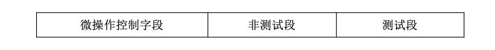

- 非测试段: 可由设计者直接给定，通常是后继微地址的高位部分，用以指定后继微指令在某个区域内。
- 测试段: 根据有关状态的测试结果确定其地址值，占后继微地址的低位部分。这相当于在指定区域内断定具体的分支。所依据的测试状态可能是指定的开关状态、指令操作码、状态字等。

事实上，在多数机器的微指令系统中，增量方式和断定方式是混合使用的

## 微指令格式

### 水平型微指令

特征：
- 微指令较长，通常为几十位到上百位左右。如VAX-11/780的微指令字长96位，总之，机器规模越大、速度越快，其微指令字越长。
- 微指令中的微操作具有高度并行性，这种并行操作能力是以数据通路中各部件间的并行操作结构为基础的。例如执行一条水平型微指令就能控制信息从若干源部件同时传送到若干目的部件。
- 微指令编码简单，减少微命令的译码时间。

优缺点：
- 优点：执行效率高、灵活性好，微程序条数少，因此广泛应用于速度较快的机器中。
- 缺点：其微指令字较长，复杂程度高，难以实现微程序设计自动化。

### 垂直型微指令

特征是微指令较短，微指令的并行操作能力有限，一般一条微指令只能控制数据通路的一两种信息传送操作。

通常每条微指令都有一个微操作码字段、源地址和目的地址及某些扩展操作字段。

- 优点：便于编制微程序。由此编制的微程序规整、直观、有利于设计的自动化。
- 缺点：但垂直型微指令不能充分利用数据通路的并行操作能力，微程序长，因而效率低。

## 5. 模型机微程序指令格式

微指令的微操作控制字段是按操作性质划分字段，对于一些零乱的微操作可归入辅助操作一组。

由于模型机CPU内部采用的是单总线结构，每次只能完成一种基本的数据通路传送操作，如PC→MAR，这表明其微指令格式应偏向于垂直型；但由于微指令控制字段的设置是面向微命令的，因此又具有水平型微指令的某些特点，故可以看成是混合型微指令。

对于微程序的顺序控制方式，在模型机中采用增量方式和断定方式相结合的方案，当微程序顺序执行、无条件和条件转移，以及转微子程序与返回时，用增量方式形成后继微地址；当微程序需要多路转移时，用断定方式形成相应的各路转移微地址。

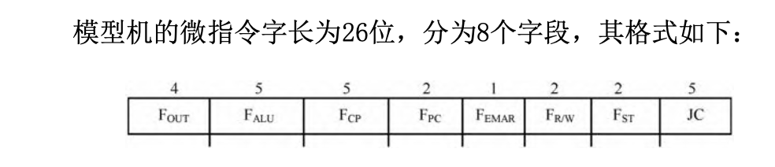

1. 基本数据通路控制字段

- $F_{OUT}$：寄存器的输出控制字段
- $F_{ALU}$：ALU的操作与Z的移位控制字段
- $F_{CP}$：寄存器的同步打入控制字段
- $F_{PC}$：PC的操作控制字段

2. 访存控制字段

- $F_{EMAR}$：MAR输出控制字段
- $F_{R/W}$：主存读写与MDR开支字段

3. 辅助控制字段

- $F_{ST}$：辅助操作控制字段

4. 顺序控制字段

- $JC$：转移方式字段，用以选择后继指令地址的形成方式

# 精简指令计算机(RISC)

1. RISC和CISC

统的CISC设计思想并不利于提高计算机的速度。而且复杂的指令系统必然增加硬件实现的复杂性，从而使计算机的研制周期长、投资大。因此人们开始研究指令系统的合理性问题。对CISC指令系统运行的统计分析表明，各种指令的使用频率相差悬殊，最常用的是一些比较简单的指令，仅占指令总数的20%，但在程序中出现的频率却占80%。

2. 特点

精简指令系统计算机的着眼点不是简单地放在简化指令系统上，而是通过简化指令使计算机的结构更加简单合理，更易于流水线的实现，从而提高处理速度。

- 面向寄存器的结构

所有运算使用的数据都来自寄存器，运算结果也都写入寄存器。通常CPU内应设置大量的通用寄存器，以减少访问主存储器。

- 采用LOAD/STORE结构

能够访问主存储器的只有两种指令：从存储器读取数据到寄存器的LOAD（取数）指令和从寄存器向存储器写数据的STORE（存数）指令。

- 较少的指令数和寻址方式

选取使用频率最高的一些简单指令，以及很有用但不复杂的指令，可简化控制部件。选用简单的寻址方式，有利于减少指令的执行周期数。

- 所有指令长度相同

指令长度相同，指令格式固定简单，可简化指令的译码逻辑，并 有利于提高流水线的执行效率。为了便于编译的优化，常采用三地址 指令格式。

- 硬布线控制逻辑

由于指令系统的精简，控制部件可由组合逻辑实现，不用或少用微程序控制，这样可使控制部件的速度大大提高。

- 注重编译的优化

RISC指令系统的简化，必然使编译生成的代码长度增长。但通过编译优化技术，将编译初步生成的代码重新组织，调度指令的执行次序，以充分发挥内部操作的并行性，从而进一步提高流水线的执行效率。

3. 超标量与超流水线概念

在一个单执行部件的RISC中，多数指令是单周期执行，但仍有少数指令需要一个周期以上的执行时间。因此，其每条指令执行的平均周期数CPI接近于1，但不能小于1。

要使CPI小于1

- 超标量结构: 将RISC设计成具有多个执行部件的结构，同时在每一个周期内允许发出多条指令，并调度多条指令在不同的执行部件中并行执行操作

- 超标量结构: 将流水线的每个节拍分成3个或4个小节拍，每个小节拍执行一个操作，便有可能在取出第i 条指令后，相隔一个小节拍，就取出第i +1条指令，这样就可能在一个流水线的节拍内，取出3条或4条指令，送入流水线去执行，从而使CPI小于1
