第四章、指令系统层

计算机的基本工作主要体现为执行指令。

指令系统(指令集)：指令格式、寻址方式、指令类型与功能。

相对微体系结构层，是一个抽象的层次，它是硬件和软件之间的接口（硬件和编译器都能理解的语言）

其主要特征就是指令系统的两种状态
- 内核模式
- 用户模式


本章将以80x86为背景讨论指令系统层，介绍
- 80x86系列cpu的结构
- 80x86主存储器和寄存器
- 80x86指令系统

# 1. 80x86CPU


目前，主要的CPU架构有四种
- ARM
- X86
- MIPS Power
- ALPHA  
目前，在移动芯片领域，ARM架构的芯片占据了90%以上的市场份额，在服务器CPU市场上，英特尔X86处理器占据超过90%市场份额

80x86是Intel首先开发制造的一种微处理器体系结构的泛称

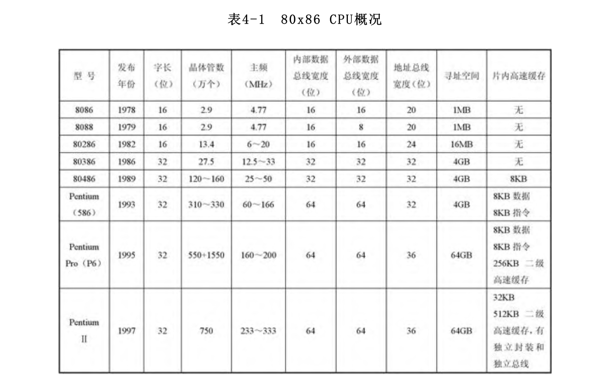 


## 1.1 8086/8088cpu

- 8086
    16位微处理器，即8086CPU的内外数据总线为16位，⼀个总线周期可以传送⼀个字（16位）数据。

- 8088
    准16位微处理器,即8088CPU的内部DB为16位，外部DB为8位，⼀个总线周期只能传送⼀个字节。 

8086/8088两者的内部结构基本上相同，地址引脚均为20位，可寻址1MB主存空间。指令系统完全相同，在软件上是完全兼容的。


###  指令流水线结构

- BIU总线接口部件: 取指令（或取操作数）
- EU执行部件: 执行指令  
当EU执行某条指令时，BIU同时完成从主存中预取后继指令，两个部件并行地工作。


###  内部架构


1. 执行部件EU

包括：   
- 一个ALU（16位）
- 一组通用寄存器（16位）
- 暂存器
- 标志寄存器（16位）
- EU控制器

功能：  
- 从指令队列中取出指令代码，由EU控制器进⾏译码后产⽣对应的控制信号到各部件以完成指令规定的操作。
- 对操作数进⾏算术和逻辑运算，并将运算结果的特征状态存放在标志寄存器中。
- 由于EU不直接与系统总线连接，因此当需要与主存储器或I/O端⼝传送数据时，EU向BIU发出命令，并提供给BIU 16位有效地址与传送的数据。


2. 总线接口部件BIU

包括
- 一组段寄存器
- 指令指针
- 指令队列（6字节，8088是4字节）
- 总线地址形成部件（20位，地址加法器）
- 总线控制逻辑

功能：完成CPU与主存储器或I/O端口之间的信息传送  
- 从主存取出指令送到指令队列中排队
- 从主存或I/O端⼝取操作数或存放运算结果
- 计算并形成访问主存的20位物理地址


### 8086主存地址的形成

8086cpu内部寄存器即数据线均为16位，可访问存储器空间64K，实际主存地址20位，寻址空间1M。16位字长的机器如何提供20位地址？

解决办法：分段：将1M空间分成64K一段

1. 地址概念

- 物理地址：每个存储单元的唯一的20位地址
- 段基址
    - 段起始地址，XXXX0H
    - 段起始地址的20位后4位为零，所以只需要表示前16位即可，前16位地址称为段基址
    - 段基址放在段寄存器中
- 偏移地址：段内相对于段起始地址的偏移量
- 逻辑地址：
    - 由段基址和逻辑地址组成，记作`段基址:偏移地址`

物理地址与逻辑地址的转换
$$物理地址 = 段基址 x 2^4 + 偏移地址$$


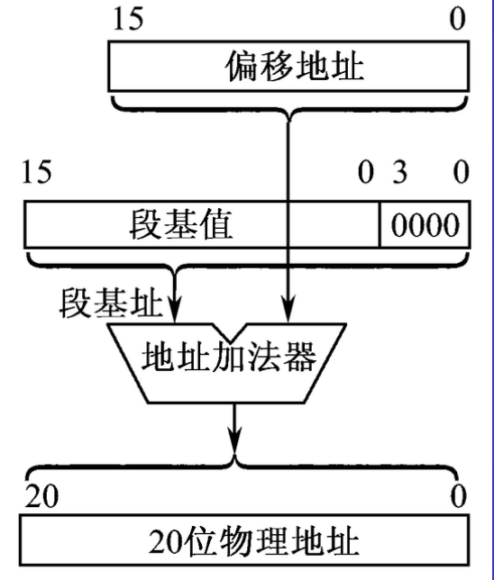

#### 段寄存器

汇编语言源程序是分段结构（代码段、数据段...）

在8086～80286中，有4个专门存放段基值的寄存器，称为段寄存器。
> 每个段寄存器可以确定一个段的起始地址


1. 段寄存器的种类

- CS: 代码段
    存放当前正在运行的程序
- DS: 数据段
    存放当前运行程序所用的数据
- SS: 堆栈段
    定义了堆栈的所在区域
- ES: 附加段
    附加的数据段，一个辅助的数据区，也是串处理指令的目的操作数存放区

> 在80386及其后继的80x86中，除上述4个段寄存器外，又增加了2个段寄存器FS和GS，它们也是附加的数据段寄存器


2. 段寄存器与存放偏移地址的寄存器之间的默认组合关系

- 8086/8088,80286

| 段寄存器 | 偏移地址 |
| --- | --- |
| CS | IP |
| SS | SP或BP |
| DS | BX,SI,DI或一个16位数 |
| ES | DI(用于串指令) |

- 80386及后续机型

| 段寄存器 | 偏移地址 |
| --- | --- |
| CS | IP |
| SS | SP或BP |
| DS | BX,SI,DI或一个16位数 |
| ES | EAX,EBX,ECX,EDX,EDI,ESI,一个8位或32位数 |
| FS | 无默认 |
| GS | 无默认 |

## 1.2 80386/80486cpu

1. 80386 

- 32位地址，可直接寻址的物理存储空间为4 GB。
- 具有片内存储管理部件，使虚拟存储空间（逻辑地址空间）可达64 TB。
- 字长32位，系统总线的数据通路宽度32位。
- 采用多级流水线结构(多独立部件，重叠执行)。
- 平均运算速度约为4 MIPS（4百万指令每秒）。


2. 80486

80486相当于一个增强型的80386、一个增强型的80387数值协处理器（浮点部件FPU）、一个8 KB的高速缓存（Cache）的集成，基本上沿用了80386的体系结构,5级流水


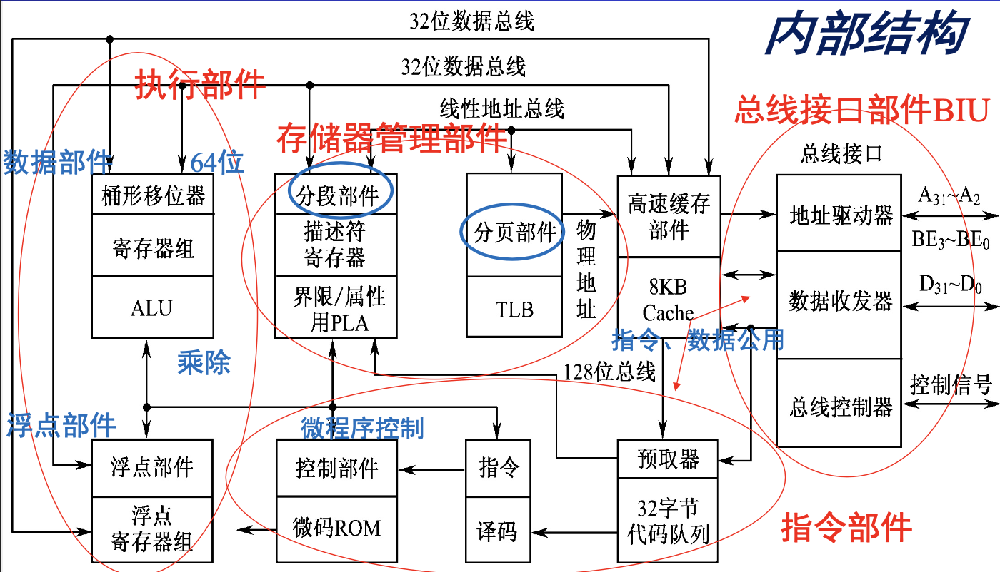


- 总线接口部件BIU: 
    - 包含
        - 地址驱动器
        - 数据收发器
        - 总线控制器
    - 功能: 
        - CPU与存储器及I/O设备之间的高速接口
        - 当取指令、取数据或写数据、响应分页部件或分段部件请求时，能有效地满足CPU对系统总线的传送要求。

- 指令部件
    - 包含
        - 指令预取部件
        - 指令译码部件
        - 产生微命令的控制部件
        - 高速缓存Cache。
    - 功能: 
        - 完成预取指令
        - 分析指令
        - 然后产生指令所需的微命令去控制相应部件操作。

- 执行部件
    - 数据部件: 执行控制部件所指定的数据操作,包括:
        - 通用寄存器
        - 一个有乘除功能的ALU
        - 一个64位的桶形移位器
    - 浮点部件FPU
        - 浮点部件FPU
        - 浮点寄存器组
        > 由于浮点部件FPU和浮点寄存器组集成在80486芯片内，缩短了FPU与处理器各部件之间的距离，因此FPU的执行速度比80386和80387组成的系统快3倍。

- 存储器管理部件MMU
    - 将存储器按段来组织，以适应用户程序的逻辑结构，段的大小可变，最大可达到4 GB。
    - 针对主存物理空间的组织，又将存储器划分为页，每页大小均为4 KB。
    - 存储器管理部件设置了分段部件与分页部件
        - 分段部件按控制部件的要求计算有效地址，并且将逻辑地址（由段基值和偏移地址组成）转换成线性地址，即：线性地址=段基址+有效地址（即偏移地址）
        - 分页部件通过页变换，将来自分段部件或指令预取部件的线性地址转换成主存的物理地址。


上述9个部件可以独立操作，也能与其他部件并行工作。在取指令和执行指令的过程中，每个部件都完成一部分功能，因此80486可以同时对不同指令进行操作。

80486具有5级流水线，使不同指令的操作重叠程度更高，从而允许一些常用指令在一个时钟周期内完成。
> 尽管这些指令的读取、译码和执行实际上占用了多个时钟周期，但由于这些指令与其他指令的译码和执行相重叠，因此平均每条指令的执行时间只占一个时钟周期。


## 3. Pentium系列cpu

### Pentium cpu

Pentium CPU是第一个实现系统管理方式的高性能微处理器，它能很好地实现PC机系统的能耗与安全管理。

Pentium CPU是Intel 80x86系列微处理器的第五代产品，其性能比它的前一代产品又有较大的提高，但它仍保持与Intel 8086、80286、80386、80486兼容。


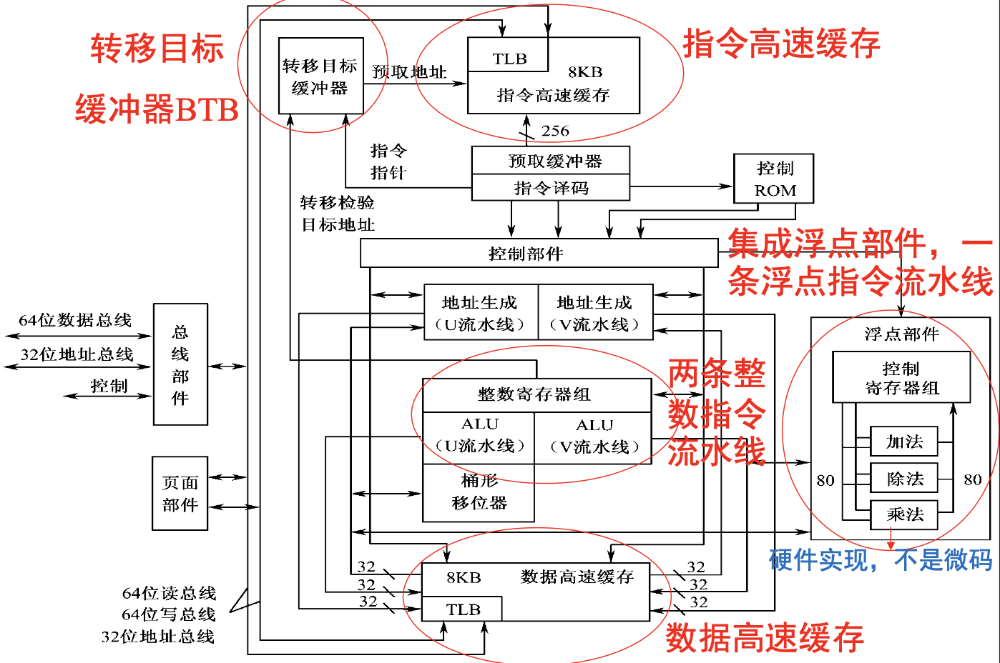

0. 64位数据总线

1. 超标量体系

- 三条指令执行流水线
    - 两条独立的整数指令流水线（U流水线和V流水线）
    - 一条浮点指令流水线

意味着每条流水线拥有
- 独立的算数逻辑运算部件
- 地址生成逻辑
- 高数数据缓存接口

> 一个时钟周期执行两条简单指令，比相同频率下的80486性能提高1倍

2. 浮点指令流水线与浮点指令部件

浮点指令流水线具有8级，U流水线的扩充。

- U流水线的前4级准备一条浮点指令，浮点部件中的后4级执行浮点运算操作并报错。
- 浮点指令（加、减、除）采用专用硬件电路，这比相同频率下的80486浮点处理性能提高了4倍。

3. 指令转移预测指令

小型1KB高速缓存（称为转移目标缓冲器BTB）
- 记录正在执行的程序最近所发生的几次转移
- 预示很可能会引向何处
- 进入流水线的新指令与有关转移信息进行比较
    - 多数预测是正确的
    - 若错误，重新取指令。

4. 数据和指令高数缓存

两个超高速缓冲存储器Cache
- 8KB的数据Cache
- 8KB的指令Cache  
并行操作。减少指令预取和数据操作之间冲突，提高微处理器的信息存取速度


### Pentium Pro cpu

Pentium Pro CPU即P6，中文名称为高能奔腾处理器，适用32位操作系统

- 三路发布超标量微结构，14级超流水线，使一个时钟周期内可同时执行三条简单指令。
- 5个并行处理单元
    - 两个整数运算部件
    - 一个装入部件
    - 一个存储部件
    - 一个浮点运算部件（FPU）。
- 8KB两路组相关指令高速缓存，8KB四路组相关数据高速缓存。
- 专用全速总线上的256 KB SRAM使二级高速缓存与微处理器紧密相联。
- 事务处理I/O总线和非封锁高速缓存分级结构。
- 乱序执行，动态分支预测和推理执行。

### Pentium2 cpu

1. 概述

PentiumⅡ（PⅡ）CPU采用了与Pentium Pro CPU相同的核心结构。同时，增加了对多媒体的支持和对16位代码优化的特性，它能够同时处理两条MMX多媒体指令。


- 双重独立总线DIB体系结构，能同时使用具有纠错功能的64位系统总线和具有可选纠错功能的64位Cache总线。
- 多重跳转分支预测。
- 数据流分析。分析哪一条指令依赖于其他指令的结果或数据，由此来优化指令调度。根据分析结果来重排指令，使指令以优化的顺序执行，而与原始程序的顺序无关。
- 指令推测执行。使用转移预测和数据流分析，让指令在程序实际执行之前就“推测执行”，并把结果暂时存储起来。通过执行可能需要的指令，使处理器的执行机制尽可能地保持繁忙。
- 采用Intel MMX技术。它包括57条增强的MMX指令，可处理视频、声频及图像数据。

2. 内部结构


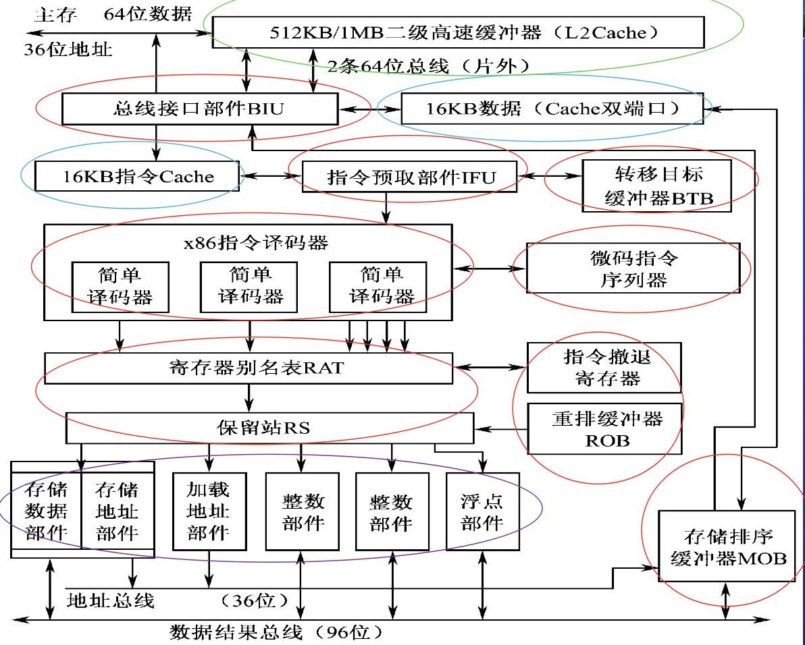

PⅡ有3条指令流水线，每条指令流水线共有14级

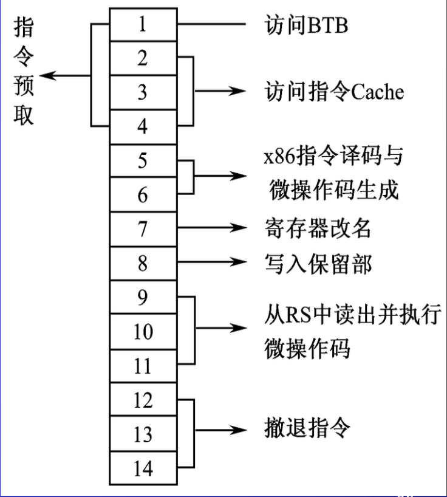

PⅡ CPU在体系结构上较以前的处理器有很大变化，一个最明显的技术特征就是其核心完全采用RISC微结构，为了保持与80x86其他处理器兼容，仍继续采用CISC指令集，因此内部增加了RISC与CISC之间的转换硬件。

PⅡ与P6一样采用\*BE7～\*BE0作为8个存储体的选择信号对存储器的访问加以控制。它们在非流水线的地址方式下需要两个时钟周期进行总线操作，在P6和早期PⅡ系统中，系统总线的速度为66 MHz，主频为250 MHz，以后的PentiumⅡ系统总线速度提高到100 MHz。


3. 操作模式

PentiumⅡ具有3种操作模式：实模式、虚拟8086模式和保护模式。
> 实际上，80386及后继机型都具有这3种模式。

- 在实模式下
    - 所有8088/8086之后增加的新特性都被关闭
    - 这时PentiumⅡ就像一台单纯的8088/8086一样运行

- 在虚拟8086模式下
    - 可以用一种受保护的方式来运行老的8088/8086程序
    - 这时，有一个实际的操作系统在控制整个计算机。

- 在保护模式下
    - 有4种可用的特权级别，它们由程序状态字中的对应位控制
    - 第0级相当于别的计算机中的内核模式，它可以完全控制计算机，因而只由操作系统使用
    - 第3级用于运行用户程序，它阻塞用户程序对某些特殊的关键指令和控制寄存器的访问，以防止某些鲁莽的用户程序搞垮整个计算机
    > 第1级和第2级很少使用。


# 2. 80x86 cpu的寄存器和主存储器

## 2.1 80x86 cpu的寄存器


1. 基本结构寄存器组

- 通用寄存器
- 指令指针寄存器
- 标志寄存器
- 段寄存器


2. 浮点寄存器组

- 数据寄存器
- 标记字寄存器
- 指令和数据指针寄存器
- 控制字寄存器

3. 系统级寄存器

- 系统地址寄存器
- 控制寄存器
- 测试寄存器
- 调试寄存器


### 2.1.1 基本结构寄存器组


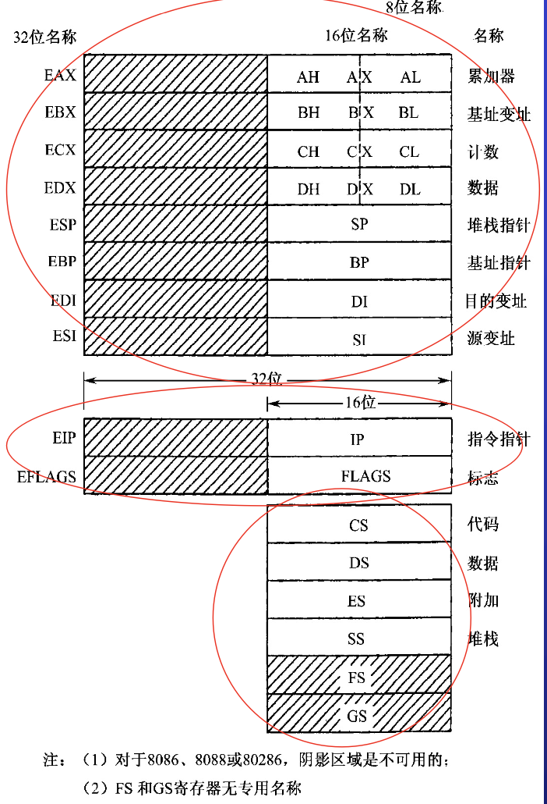


####  通用寄存器


1. 通用寄存器

8086/8088和80286所具有的寄存器: 图中除阴影区以外的寄存器,都是16位寄存器。

四个16位数据寄存器
- AX: 数据存储器，累加器，I/O
- BX: 数据存储器，基址寄存器
- CX: 数据存储器，循环次数
- DX: 数据存储器，与AX连用表示32为数据；I/O的端口地址
> 也可作为8位使用AH、AL、BH、BL……


2. 变址寄存器

4个变址寄存器（地址指针寄存器）
- SP：栈顶指针寄存器
- BP：基址指针寄存器
- SI： 源变址寄存器
- DI：目的变址寄存器
> SP、BP、DI、SI也可做16位的数据寄存器使用


####  指令指针寄存器和标志寄存器

1. IP（Instruction Pointer）

指令指针寄存器，它用来存放代码段中的偏移地址。  
8086中的CS:IP类似于其他CPU中的PC

2. FLAGS 

标志寄存器，又称PSW（Program Status Word），即程序状态寄存器。存放条件码标志、控制标志等


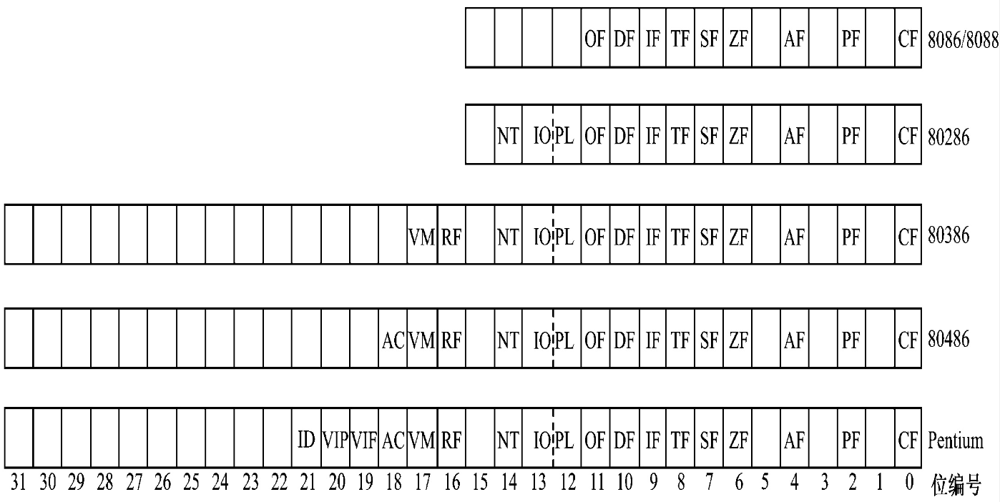


条件码标志:
- OF: Over Flow Flag溢出标志
    溢出时，则OF置1；否则OF置0

- SF: Sign Flag符号(负数)标志
    结果为负，则SF置1；结果为正，则SF置0

- ZF: Zero Flag零标志
    结果各位全为0时，则ZF置1；否则ZF置0

- CF: Carry Flag进位/借位标志
    进位或借位时，则CF置1；否则置0

- PF: Parity Flag奇偶标志
    运算结果中1的个数为偶数时置1，否则置0

- AF: Auxiliary Carry Flag辅助进位标志
    低字节，低4位


控制标志:
- DF: Direction Flag方向标志；
    在串处理指令中
    - 当DF=1时，负向, SI和DI不断减小
    - 当DF＝0时，正向，SI和DI增⼤，使串处理从低地址向⾼地址⽅向处理。
- IF: Interrupt Flag中断标志
- TF: Trap Flag单步运行标志

调试程序DEBUG中提供了测试标志位的手段，它用符号表示某些标志位的值：
| 标志名                | 标志为1 | 标志为0 |
|-----------------------|---------|---------|
| OF 溢出（是/否）     | OV      | NV      |
| DF 方向（增量/减量）  | DN      | UP      |
| IF 中断（允许/关闭）  | EI      | DI      |
| SF 符号（正/负）      | NG      | PL      |
| ZF 零（是/否）        | ZR      | NZ      |
| PF 奇偶（偶/奇）      | PE      | PO      |
| CF 进位（是/否）      | CY      | NC      |
| AF 辅助进位（是/否）  | AC      | NA      |


系统标志:

- TF(Trap Flat) 
    标志处理器是否进入单步调试状态
- IF(Interrupt Flat)
    控制是否允许响应外部中断请求
- IOPL（I/O Privilege Level） 
    设置当前任务访问 I/O 指令的权限级别
- NT（Nested Task） 
    嵌套任务标志，用来表示当前的任务是否嵌套在另一任务内
- RF（Resume Flag）
    恢复标志位，它与调试寄存器的断点一起使用，以保证不重复处理断点。
- VM（Virtual-8086 Mode）
    虚拟8086模式位 。
- AC（Alignment Check mode）
    对准检查方式位 。
- VIF（Virtual Interrupt Flag） 
    虚拟中断标志。
- VIP（Virtual Interrupt Pending flag） 
    虚拟中断未决标志。
- ID（IDentification flag） 
    标识标志，程序有设置和清除ID标识的能力，以指示处理机对CPU ID指令的支持。


### 段寄存器

汇编语言源程序是分段结构（代码段、数据段…），段寄存器用来存放段起始地址

1. 分类
- CS：（Code Segment）代码段
- DS：（Data Segment）数据段
- SS：（Stack Segment）堆栈段
- ES：（Extra Segment）附加段
> 386后增加了FS、GS两个附加段


2. 段寄存器与存放偏移地址的寄存器之间的默认组合关系

- 8086/8088,80286

| 段寄存器 | 偏移地址 |
| --- | --- |
| CS | IP |
| SS | SP或BP |
| DS | BX,SI,DI或一个16位数 |
| ES | DI(用于串指令) |

- 80386及后续机型

| 段寄存器 | 偏移地址 |
| --- | --- |
| CS | IP |
| SS | SP或BP |
| DS | BX,SI,DI或一个16位数 |
| ES | EAX,EBX,ECX,EDX,EDI,ESI,一个8位或32位数 |
| FS | 无默认 |
| GS | 无默认 |


### 2.1.2 系统级寄存器

系统级寄存器组是指不能由用户程序访问而只能由系统管理的寄存器

<!-- TODO: many systemtic register -->


## 2.2 80x86的主存储器


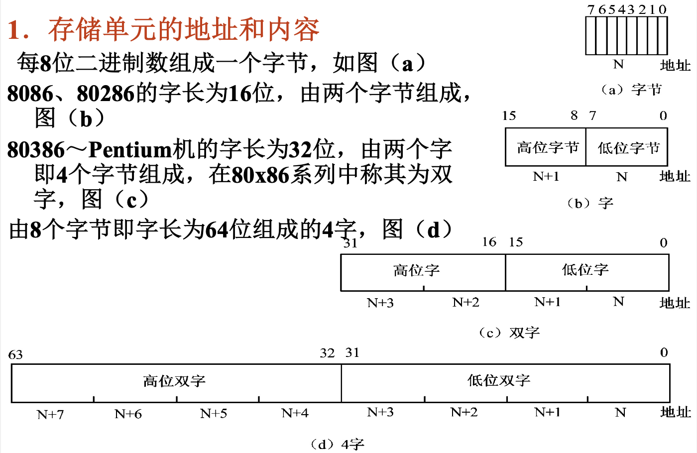
> 低位字节存放在低位地址中


### 2.2.1 存储单元的地址和内容

存储器里以字节为单位存储信息，每一个字节单元给予一个唯一的编号即存储器地址，称为物理地址。地址从0开始编号，也是用二进制数来表示的。书写格式为十六进制数。

$$地址总线宽度n位 \Rightarrow^{可寻址} 寻址空间2^n$$


字、双字存放：以低位地址作为整个字/双字的地址
- 对准字：字地址为偶地址
- 非对准字：字地址为奇地址
> 非对准字的存取速度比对准字慢，故尽量避免


### 2.2.2 实模式存储寻址

80x86中除8086/8088只能在实模式下工作外，其他的CPU均可在实模式或保护模式下工作。

- 实模式下允许的最大寻址空间为1 MB。8086/8088的地址总线宽度为20位，因而其最大寻址空间正好是1MB。
- 在1MB的存储器里，每个存储单元都有一个唯一的20位地址，称为物理地址。
- 对于其他微处理器在实模式下只能访问前1MB的存储器地址。


### 2.2.3 保护模式存储器寻址

1. 逻辑地址

在保护模式存储器寻址中 ，程序员在程序中指定逻辑地址， CPU采用一种比较复杂的方法来求得相应的物理地址。

$$逻辑地址 = 段选择器 + 偏移地址$$

段选择器存放在段寄存器中，由CPU通过一定的方法利用段选择器取得段基址，再和偏移地址相加，从而求得所选存储单元的线性地址，线性地址再通过分页部件转换成物理地址。


2. 描述符

段选择器是通过描述符表取得描述符，从而得到段基址的。

描述符有8个字节长，用来说明段的起始地址、段的大小、段在存储器中的位置及有关的控制和状态信息，其格式如下图所示:

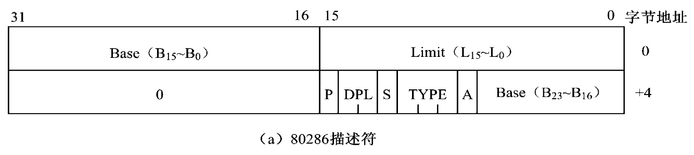
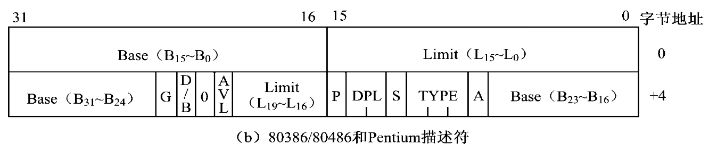

描述符由段基址、段界限、访问权和附加字段4部分组成
- 段基址（Base） 
    用来指定段的起始地址。80386以上处理器的段基址为32位，说明段可以从4 GB存储器的任何地址开始。

- 段界限（Limit） 
    用来存放该段的段长度。80386及其后继机型的段界限为20位，同时在其描述符中又给出了一个粒度位G（Granularity）
    - 当G = 0时，段长的粒度单位为字节
    - 当G = 1时，段长的粒度单位为页，每页为4 KB

- 访问权（Access Rights） 
    有8位，所以又称为访问权字节,用来说明该段在系统中的功能，并给出访问该段的一些控制信息。
    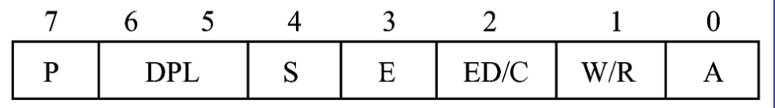
    - P（Present）存在位
        - P = 1说明该段已装入物理存储器，其段基址和段界限值有效
        - P = 0则说明该段并未装入物理存储器，段基址和段界限值无用 
    - DPL（Descriptor Privilege Level）描述符特权级字段2位
        用来指定该存储段的特权级0～3，0级为最高特权级。

    - S（Segment Descriptor）段描述符位
        - S = 0表示该段为系统段
        - S = 1则表示该段为应用程序的代码段或数据（包括堆栈）段
    - A（Accessed）已访问位
        - A = 0表示该段尚未被访问过
        - A = 1表示该段已被访问过。  

- 附加字段部分在386及其后继机型中存在，它们包括G、D/B、0和AVL 共4位。
    - G为粒度位
        前面已有说明。

    - D/B位
        在代码段里，该位称为D（Default OperationSize）默认操作长度位
        - D= 1表示操作数及有效地址长度均为32位
        - D = 0则为16位操作数和16位有效地址。

    - 0位
        该位必须为0，为未来的处理机保留。
            
    - AVL（Available）
        该位只能由系统软件使用。


3. 描述符表

描述符存放在描述符表中，主要有4种描述符表：
- 全局描述符表GDT（Global Descriptor Table）
    用于存放操作系统和各任务公用的描述符，如公用的数据和代码段描述符、各个任务的TSS描述符和LDT描述符等。

- 局部描述符表LDT（Local Descriptor Table） 
    用于存放各个任务私有的描述符，如本任务的代码段描述符和数据段描述符等。

- 中断描述符表IDT（Interrupt Descriptor Table） 
    用于存放系统中断描述符。

- 任务状态段TSS（Task State Segment） 
    用来存放各个任务的私有运行状态信息描述符。


描述符表都存放在存储器中，每个表分别构成一个64 KB长的段，表中可存放8 K个描述符。


全局描述符表中的描述符所指定的段可用于所有程序，而局部描述符表中的描述符所指定的段通常只用于一个用户程序（或称一个任务）。在整个系统里，只有一个全局描述符表和一个中断描述符表，而局部描述符表可以有多个，它们分别对应于不同的任务。


4. 段选择器

段选择器提供描述符在描述符表中的位置，存放在段寄存器中，16位长，其格式如下：

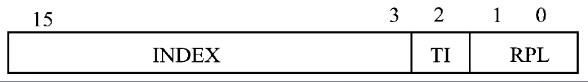

- INDEX为索引值，即描述符表索引值
    它给出所选描述符在描述符表中的地址。该字段共13位，可从表中8K个描述符中选取一个。
    
- RPL（Requested Privilege Level）为请求特权级，这是对该存储段请求访问的特权级
    其值可为0～3，0级特权级最高，如RPL和该段描述符中的DPL相等（同一特权级）或RPL＜DPL（请求特权级高于描述符特权级）则允许对该段的访问

- TI（Table Indicator）为选择位
    - TI = 0指示从全局描述符表GDT中选择描述符
    - TI = 1则指示从局部描述符表LDT中选择描述符。


5. 描述符寄存器

为了提高保护模式存储器寻址的速度，CPU中设置了6个64位的描述符寄存器，用来存放对应段的描述符，如下图所示
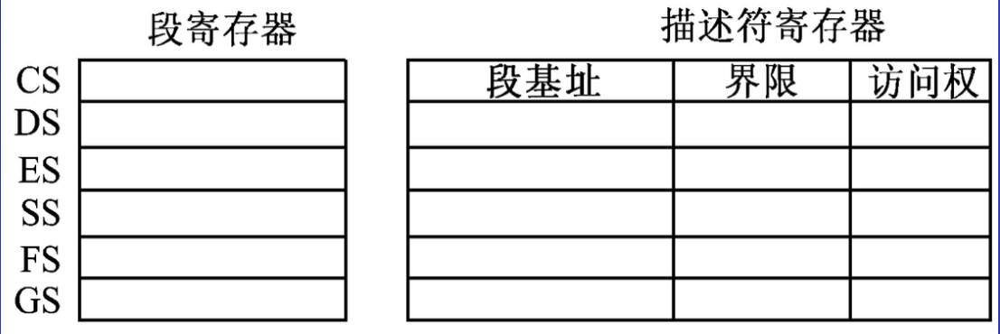

每当段寄存器中段选择器的值确定以后，硬件会自动地根据段选择器的索引值，从系统的描述符表中取出一个8字节（64位）的描述符，装入到相应的段描述符寄存器中

以后每当出现对该段存储器的访问时，就可直接使用相应的描述符寄存器中的段基址作为线性地址计算的一个元素，而不需要在内存中查表得到段基址，因此加快了存储器物理地址的形成。

应当指出，段寄存器是程序可访问的，而描述符寄存器则是程序不可访问的。


### 2.2.4 80x86逻辑地址的来源

从以上内容可知
- 实模式下的逻辑地址：由段基值和偏移地址组成
- 保护模式下的逻辑地址：由段选择器和偏移地址组成。

实际上段基值和选择器都是由段寄存器提供。

在汇编语言程序中，逻辑地址可表示为：
$$段基值（或段选择器）：偏移地址$$ 

在80x86 CPU中，逻辑地址的两个分量之间存在一种默认组合关系，可以不在程序中指明
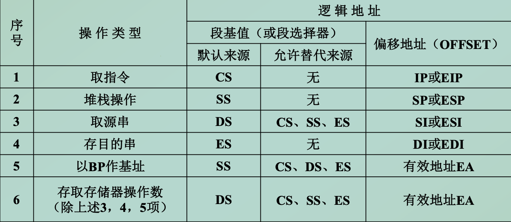

> 如用到非默认的组合关系（如使用允许替代来源），则必须用段跨越前缀加以说明。


# 3. 80x86cpu的指令系统

80x86 CPU的指令集是在8086/8088 CPU的指令系统上发展起来的。
- 8086/8088 指令系统是基本指令集
- 80286、80386、80486和Pentium指令系统是在基本指令集上进行了扩充。扩充指令的
    - 一部分是增强的8086/8088基本指令和一些专用指令；
    - 另一部分是系统控制指令，即特权指令，它们对80286、80386、80486和Pentium保护模式的多任务、存储器管理和保护机制提供了控制能力。


80x86 CPU采用了变字长的机器指令格式，由1～15个字节组成一条指令。一般格式如下图所示:

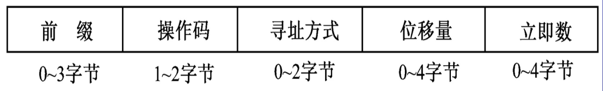


## 3.1 80x86寻址方式

指令中的寻址方式是用来确定操作数地址以找到指令所需的操作数。

- 8086和80286

    字长是16位
    - ⼀般情况下只处理8位和16位操作数
    - 只是在乘、除指令中才会有32位操作数；

- 80386及其后继机型

    字长为32位
    - 因此它除可处理8位和16位操作数外，还可处理32位操作数
    - 在乘、除法情况下可产⽣64位操作数。


本节下面所述例⼦中，如处理的是32位操作数，则适用于80386及其后继机型


### 3.1.1 立即寻址方式和寄存器寻址方式

1. 立即寻址方式

指令所需的操作数直接在指令代码中，随着取指令一起取到CPU中。


这种操作数称为立即数。立即数用来表示常数
- 经常用于给寄存器赋初值
- 只能用于源操作数字段，不能用于目的操作数字段
- 源操作数长度应与目的操作数长度一致
- 在汇编指令中，立即数若是数值常数可直接书写，若是字符常数则应加上引号。


2. 寄存器寻址方式

指令所需的操作数存放在CPU的寄存器（通用寄存器或段寄存器）中，通过指令中的寄存器地址去找到操作数

在汇编指令中，寄存器地址直接用寄存器名表示，如用AX、BX、AL、BH、EAX、EBX、DS、ES等，这些寄存器可以是8位的、16位的或32位的。


### 3.1.2 存储器寻址

在汇编语言程序中，一个存储单元的地址采用逻辑地址来表示，其形式为:
$$段基址（或段选择器）: 偏移地址$$

- 操作数地址（物理地址）是根据段基值（或段选择器）和偏移地址通过一定的方法得到。
    - 段基址在实模式和保护模式下可从不同的途径取得。
    - 偏移地址是指存放操作数的存储单元与段起始地址（段基址）之间的字节距离
    > 在80x86里，把按寻址方式计算出来的操作数偏移地址称为有效地址EA（Effective Address）。


---

获得有效地址EA（偏移地址）的方法

EA可由4个地址分量的某种组合求得
$$EA = 基地址+（变址量 x 比例因子） + 位移量$$
> 上式中的每一个地址分量均可空缺，但比例因子只能与变址寄存器同时使用。

- 位移量

    指令代码中的一个8位、16位或32位二进制数，但它不是立即数，而是一个地址量。

- 基地址

    基址寄存器或基址指针中的内容

- 变址量
    
    变址寄存器中的内容

- 比例因子

    它是80386及其后继机型新增加的寻址方式中的一个术语，其值可为1，2，4或8。在含比例因子的寻址方式中，可用变址寄存器的内容乘以比例因子来取得变址值


8086/80386只能用16位寻址，80386及后续机型可用32位寻址

| **地址分量**     | **16位寻址**        | **32位寻址**                    |
|-------------------|---------------------|---------------------------------|
| **位移量**       | 0，8，16位          | 0，8，32位                      |
| **基址寄存器**   | BX，BP             | 任何32位通用寄存器（包括ESP）   |
| **变址寄存器**   | SI，DI             | 除ESP以外的32位通用寄存器       |
| **比例因子**     | 无                 | 1，2，4，8                      |


#### 直接寻址方式

- 指令所需的操作数存放在存储单元中
- EA直接由指令代码中的位移量提供。
即EA只包含位移量这一种地址分量

$$EA = 位移量$$


1. 数值地址表示EA

如用数值表示操作数的有效地址，则操作数所在段的段寄存器必须指明，不能省略。例如
```asm
MOV BX,段寄存器名:[位移量]
MOV BX,DS:[1000H]
```


2. 符号地址表示EA 

源程序中
- 常用符号地址表示存放操作数的存储单元
- 段基址缺省（DS）或用段跨越前缀给出
```asm
MOV BX,VARIABLE_NAME
```


#### 寄存器间接寻址

- 指令所需的操作数在存储单元中
- EA直接从基址寄存器或变址寄存器中获得
即EA是由基址（或变址）寄存器内容来提供的

$$EA = 基地址/变地址$$
```asm
MOV BX,[R_变址]/[R_基址]
MOV BX,[BP]
```


- 16位寻址时可用的寄存器：基址BX、BP、变址SI、DI
    > 注意：BP缺省段地址为SS，其余3个缺省DS

- 32位寻址时可用的寄存器：EAX、EBX、ECX、EDX、ESP、EBP、ESI、EDI
    > 用BP、ESP、EBP时, 默认为SS段;其他默认为DS段


#### 寄存器相对寻址


- 指令所需的操作数在存储单元中
- EA是两个地址分量之和: 基址(或变址)寄存器的内容与指令中指定的位移量之和
    - 若使用的是变址寄存器称为变址寻址方式
    - 若使用的是基址寄存器称为基址寻址方式
    - 位移量部分：可用数值表示，也可用符号地址表示

$$EA = (R_{变址})/(R_{基址}) + 位移量$$
```asm
MOV BX,位移量[R_变址/R_基址]
MOV BX,2[BX]
MOV BX,VARIABLE_NAME[BX]
```

常用来访问顺序存放在主存中的一维数组、表、字符串等。其典型用法是将指令中不能修改的位移量作为基准地址，而将变址或基址寄存器内容作为修改量


#### 基址变址寻址方式

- 指令所需的操作数在主存单元中
- EA是三个地址分量之和：基址寄存器内容、变址寄存器内容与指令中的位移量（0位、8位、16位或32位）之和

$$EA = (R_{变址})+(R_{基址})+位移量$$
```asm  
MOV BX,位移量[R_变址][R_基址]
MOV BX,2[BX][SI]
MOV BX,VARIABLE_NAME[BX][Si]
```

由于基址变址寻址⽅式中有两个地址分量可以在程序执⾏过程中进⾏修改，因此常用来访问存放在主存中的⼆维数组 。


#### 比例变址寻址方式

- 指令所需的操作数在主存单元中
- EA是变址寄存器的内容乘以指令中指定的比例因子再加上位移量之和

$$EA = (R_{变址})X比例因子+位移量$$
```asm
MOV BX,位移量[(R_{变址}) * 比例因子]
MOV EAX，COUNT[ESI * 4]
```

对于元素大小为2，4，8字节的数组，可以在变址寄存器中给出数组元素下标，而由寻址方式控制直接用比例因子把下标转换为变址值。


#### 基址比例变址寻址方式

- 指令所需的操作数在主存单元中
- EA由4种成分组成:变址寄存器的内容乘以比例因子，加上基址寄存器的内容，再加上位移量（0位、8位或32位）之和


$$EA = (R_{变址})X比例因子+ (R_{基址}) + 位移量$$
```asm
MOV BX,位移量[(R_{基址})][(R_{变址}) * 比例因子]
MOV BX,VARIABLE_NAME[BP][DI * 4]
MOV BX,2[BP][DI * 2]
```


### 3.1.3 串操作寻址方式

80x86提供专门的串操作指令，这些指令所用的操作数也在存储器中，但它们不能使用上述寻址方式，而是隐含使用变址寄存器SI、ESI、DI或EDI
- 隐含使用SI或ESI作为在数据段中的源串（即源操作数）的地址指针
- 隐含使用DI或EDI作为在附加段中的目的串的地址指针
- 在完成一次串操作后，指令自动修改SI或ESI、DI或EDI两个地址指针，使SI或ESI、DI或EDI指向下一个串元素的存储单元。


## 3.2 80x86cpu指令系统

80x86 CPU指令按操作数地址个数可划分为3种类:

1. 双操作数指令

$$OPR \quad DEST,SRC$$

- `OPR`: 指令操作码
- `DEST`: 目的操作数地址
- `SRC`: 源操作数地址
> 为了避免指令过长，双操作数指令的两个操作数不能同时是内存中的数


2. 单操作数指令

$$ORP \quad DEST$$

- `OPR`: 指令操作码
- `DEST`
    - 既是源地址又是目的地址
    - 目的地址，源操作数隐含

3.  无操作数指令


- `OPR`: 指令操作码
- 操作数隐含
- 不需要操作数


### 传送类指令

把数据、地址送到寄存器或存储单元中

#### MOV


$$MOV \quad DEST,SRC$$
- 操作：`(SRC) -> DEST`
- 说明
    - SRC和DEST操作数位数一致
    - DEST不能是立即数和CS
    - 不能将立即数给段寄存器
    - 不能将段寄存器给段寄存器
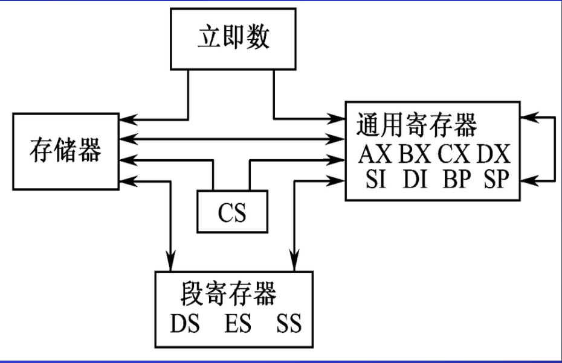


##### 带符号扩展传送指令MOVSX

> MOVSX和MOVZX指令只支持386以后机型

$$MOVSX \quad DEST,SRC$$
- 操作：`符号扩展(SRC) -> DEST`
- 说明
    - SRC可以是8位或16位的寄存器或存储单元的内容
    - DEST必须是16位或32位寄存器
    - 将源操作数进⾏符号扩展后送⼊目的寄存器，8位扩展到16位或32位,16位到32位
    > 符号扩展：将缺少的高位填入符号位进行位数扩展

##### 带零扩展传送指令

$$MOVZX \quad DEST,SRC$$
- 操作：`零扩展(SRC) -> DEST`
- 说明
    - SRC是⽆符号整数，作零扩展，
    - 即不管源操作数的符号位是否为1，⾼位均扩展为零


#### PUSH/POP

1. PUSH

$$PUSH \quad SRC$$
- `(SP)/(ESP) - 2 -> (SP)/(ESP)`
- `16位SRC -> (SP)/(ESP)`
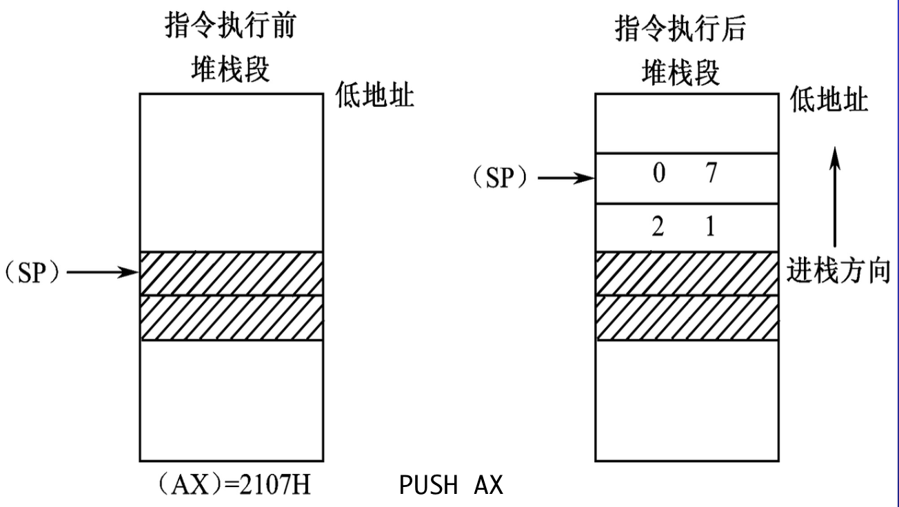

2. POP

$$POP \quad DEST$$
- 操作：
- `(SP)/(ESP) -> (DST)`
- `(SP)/(ESP) + 2 -> (SP)/(ESP)`
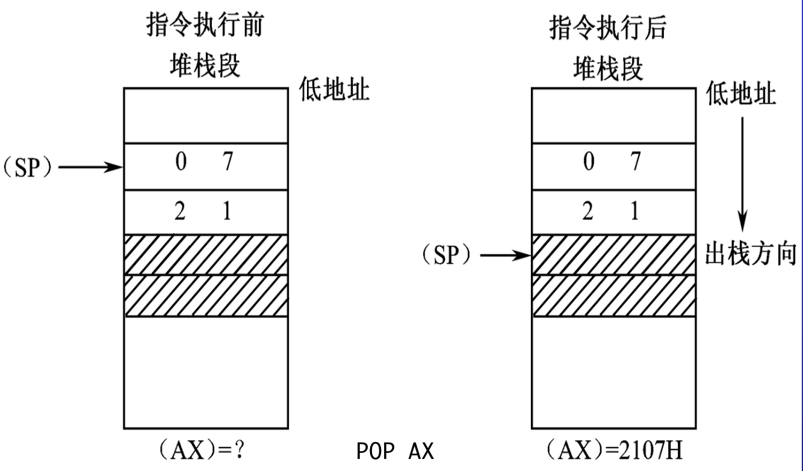

3. 说明

- 以字（16位）或双字(32位)为单位入、出栈
- 寄存器、段寄存器、存储单元可入栈，80286之后立即数允许入栈 
- 除CS外，寄存器、段寄存器、存储单元都可作为出栈目的DST
- 对于不同长度的操作数，所执行的操作不同
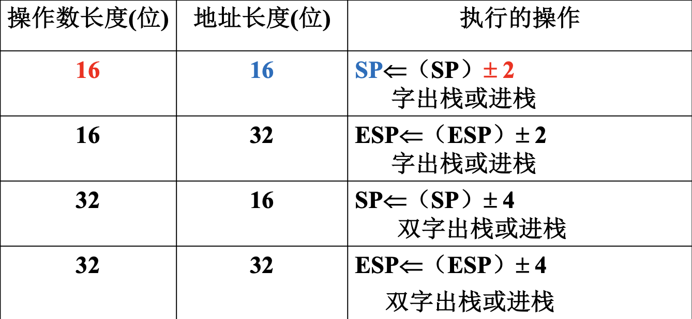

##### PUSHA/PUSHD

1. PUSHA

$$PUSHA$$
- 16位通用寄存器依次进栈
- 进栈次序为AX、CX、DX、BX,以及指令执⾏前的SP、BP、SI、DI
- 指令执⾏后`（SP）<-（SP）- 16`指向新栈顶


2. PUSHAD

$$PUSHAD$$
- 32位通用寄存器依次进栈
- 进栈次序为EAX、ECX、EDX、EBX，以及指令执⾏前的ESP、EBP、ESI和EDI
- 指令执⾏后`（SP）<-（SP）- 32`

##### POPA/POPAD

1. POPA

$$POPA$$
- 16位通用寄存器依次出栈
- 出栈次序为DI、SI、BP、SP、BX、DX、CX、AX
- 指令执⾏后`（SP）<-（SP）+ 16`
> SP的出栈只是修改了指针使其后的BX能顺利出栈，而堆栈中原先由PUSHA指令存入的SP的原始内容被丢弃，并未真正送到SP寄存器中去（SP的伪出栈）


2. POPAD

$$POPAD$$
- 32位通用寄存器依次出栈 (ESP的伪出栈)
- 出栈次序为EDI、ESI、EBP、ESP、EBX、EDX、ECX、EAX
- 指令执⾏后`（ESP）<-（ESP）＋ 32`

#### XCHG

$$XCHG \quad DEST,SRC$$
- 操作
    - `(DEST) Rightleftarrow (SRC)`
    - 交换SRC和DEST的内容

- 说明
    - 通用寄存器间或与存储单元,不允许段寄存器、立即数


#### 地址传送类

将存储器操作数的地址传送给指定的寄存器，而不是传送操作数

- LEA（Load Effective Address）有效地址送寄存器
- LDS（Load DS with pointer）地址指针送寄存器和DS
- LES（Load ES with pointer）地址指针送寄存器和ES
- LFS（Load FS with pointer） 地址指针送寄存器和FS
- LGS（Load GS with pointer）地址指针送寄存器和GS
- LSS（Load SS with pointer） 地址指针送寄存器和SS


##### LEA

$$LEA \quad DEST,SRC$$
- `DEST <- SRC的偏移地址`
- DEST不允许是段寄存器，只能是16位或32位通用寄存器
- SRC不允许是立即数、寄存器，必须是存储单元
- 目的操作数位数和源操作数有效地址长度不同时执行的操作
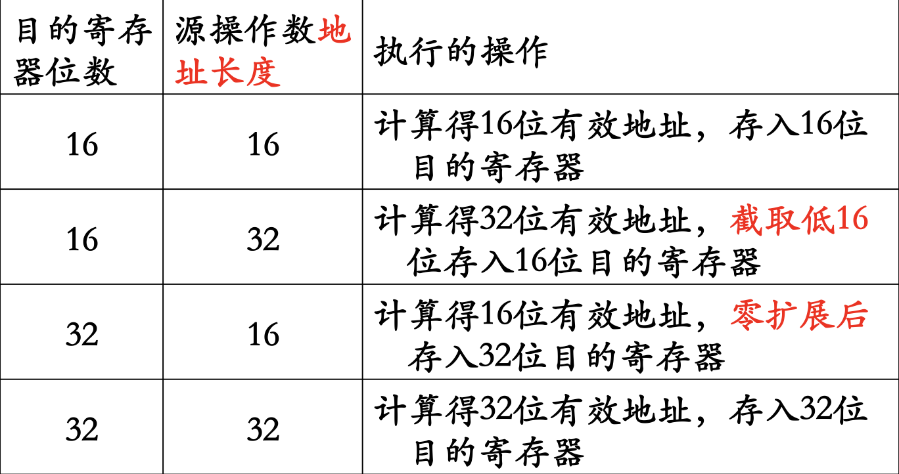


##### LDS,LES,LFS,LGS,LSS

将地址指针指向的内存单元内容送寄存器和段寄存器指令

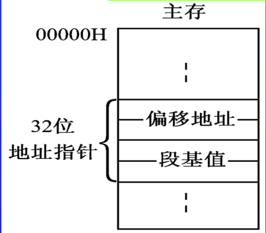

1. LDS

$$LDS \quad DEST,SRC$$
- `(SRC) -> DEST`
- 偏移地址送至DEST通用寄存器
- `(SRC + 2/4) -> DS`
- 段基址送至段寄存器

2. LES

$$LES \quad DEST,SRC$$
- `(SRC) -> DEST`
- `(SRC + 2/4) -> ES`

3. LFS,LGS,LSS指令格式类似，不过指定的段寄存器不同


4. 说明

- DEST不允许是段寄存器，只能是16位或32位通用寄存器
- SRC不允许是立即数、寄存器，必须是存储单元


#### 标志传送指令

用于对标志寄存器进行存取操作，都是无操作数指令

1. `LAHF`: `(FLAGS低8位) -> AH`
2. `SAHF`: `(AH) -> FLAGS低八位`

3. `PUSHF/PUSHFD`: `16位FLAGS入栈/32位FLAGS入栈`
4. `POPF/POPFD`: `16位FLAGS出栈/32位FLAGS出栈`


#### 类型转换指令

将字节、字转换为字、双字，共有4条指令且都是无操作数指令  
操作数隐含（在AL或AX或EAX中）

1. CBW（Convert Byte to Word） 

$$CBW$$
- 字节转换为字
- AL最高位置入AH的所有位，AL扩为AX 


2. CWD/CWDE(Convert Word to Double Word）

$$CWD/CWDE$$
- 字转换为双字
- CWD
    - AX最高位置入DX的所有位，AX扩为DX:AX
- CWDE  
    - AX扩展成EAX

3. CDQ（Convert Double to Quad） 

$$CDQ$$
- 双字转换为4字
- EAX扩展成EDX：EAX


4. BSWAP（Byte SWAP）

$$BSWAP REG32$$
- 使指令指定的32位寄存器的字节次序变反
- 具体操作为：1，4字节互换；2，3字节互换。
> 该指令只能用于80486及其后继机型


### 算数运算类指令

| 名称 | 指令         | 操作                                 | 
| --- |--------------|--------------------------------------|
| 加 | ADD DEST, SRC| (DEST) + (SRC) → DEST               |  
| 带进位加 | ADC DEST, SRC| (DEST) + (SRC) + (CF) → DEST        |
| 减 | SUB DEST, SRC| (DEST) - (SRC) → DEST               |  
| 带借位减 | SBB DEST, SRC| (DEST) - (SRC) - (CF) → DEST        |  
| 比较 | CMP DEST, SRC| (DEST) - (SRC)                      |  
> CMP指令后往往跟条件转移指令，根据比较结果产生不同分支

- 影响所有标志位(ZF,SF,CF,OF,PF,AF)
- DEST不能是立即数
- 不允许两存储单元操作

1. ADD举例


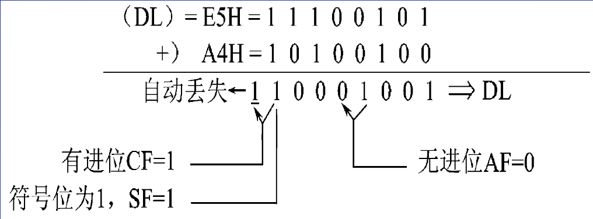
- ZF(零) = 0
- OF(溢出) = 0 
- PF(奇数个1) = 0 
> OF表示带符号数的溢出，CF表示无符号数的溢出


2. SUB举例


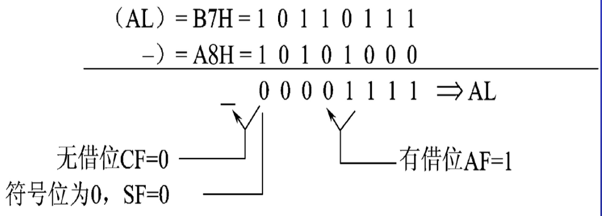
- ZF = 0 
- OF = 0 
- PF = 1 


| 名称 | 指令         | 操作                    |
| --- |--------------|-------------------------|
| 交换并相加 | XADD DEST,SRC      | （DEST）+（SRC）→TEMP;（DEST →SRC;（TEMP）→DEST         |

- SRC只能用寄存器寻址⽅式
- DEST可用寄存器或任⼀种存储器寻址⽅式
- 对标志位的影响同ADD指令
- 只能用于80486及其后继机型

| 名称 | 指令         | 操作                    |
| --- |--------------|-------------------------|
| 加1 | INC OPR      | (OPR) + 1 → OPR         |
| 减1 | DEC OPR      | (OPR) - 1 → OPR         |

- 不影响CF，其余影响
- OPR不允许是立即数、段寄存器

| 名称 | 指令         | 操作                    |
| --- |--------------|-------------------------|
| 求补 | NEG OPR      | 0 - (OPR) → OPR         |

- 影响所有标志
- OPR不允许是立即数、段寄存器


| 名称 | 指令         |                    
| --- | --- | 
| 比较并交换指令 | CMPXCHG DEST,SRC      | 

- 操作
    - 累加器AC与（DEST）相比较（相减）
    - 如果相等，则1→ ZF，（SRC）→ DEST ；
    - 否则 0→ ZF ， （DEST） → AC

- 累加器可为AL、AX或EAX寄存器
- SRC只能用8位、16位或32位寄存器
- DEST则可用寄存器或存储单元
- 该指令只能用于80486及其后继机型
- 该指令对其他标志位的影响与CMP指令相同


| 名称 | 指令         |                    
| --- | --- | 
| 比较并交换8字节指令 | CMPXCHG8B DEST      | 

- 操作
    - EDX：EAX与DEST相比较，64位数比较
    - 如果相等，则 1→ ZF，（ EDX：EAX ）→ DEST
    - 否则 0→ ZF ，（DEST）→EDX：EAX

- 该指令只影响ZF位，但不影响其他标志位
- 该指令只能用于Pentium及其后继机型
- 操作数均为64位数，目的操作数必须采用存储器寻址⽅式确定⼀个64位数


| 名称 | 指令         |                    
| --- | --- | 
| 无符号乘法 | MUl SRC      | 
| 带符号乘法 | IMUL SRC      | 

- 操作
    - 字节：`(AL)*(SRC)→(AX)`
    - 字：`(AX)*(SRC)→(DX:AX)`
    - 双字：`(EAX)*(SRC)→(EDX:EAX)`
    > 隐含另一操作数在累加器中

- 影响CF、OF,其余无定义 
- SRC为寄存器或用byte_ptr或word_ptr指明的存储单元


| 名称 | 指令         |                    
| --- | --- | 
| 无符号除法 | DIV SRC      | 
| 带符号除法 | IDIV SRC      | 

- 操作
    - 除数为字节：`(AX)/(SRC)→ 商(AL)余数(AH)`
    - 除数为字：`(DX:AX)/(SRC)→ 商(AX)余数(DX)`
    - 除数为字：`(EDX:EAX)/(SRC)→ 商(EAX)余数(EDX)`
    > 隐含被除数在EDX/EAX/DX/AX中

- 对标志位无定义
- SEC为寄存器或用byte_ptr或word_ptr指明的存储单元

<!-- NOTE: BCD码校正指令跳过 -->


### 逻辑类指令

| 操作  | 指令格式         |
|-------|------------------|
| 与    | AND DEST, SRC  |
| 或    | OR DEST, SRC   |
| 异或  | XOR DEST, SRC  |
| 测试  | TEST DEST, SRC |

- 将CF、OF置0，影响SF，ZF，ZF
- SRC可以是立即数，REG和MEM，字/字节/双字
- DEST允许是ERG,MEM
- 不允许两存储单元操作

1. 测试TEST

`(DEST)Λ(SRC)`，相与，结果不保存,ZF

| 操作  | 指令格式         |
|-------|------------------|
| 非    | NOT OPR        |

- 不影响标志位

| 指令  | 格式                  | 功能描述                                                         | 
|-------|-----------------------|----------------------------------------------|
| BT    | `BT DEST, SRC`        | 把 `DEST` 中由 `SRC` 指定位的值送往标志位 `CF`                   | 
| BTS   | `BTS DEST, SRC`       | 完成 `BT` 功能外，将 `DEST` 中的指定位置 1                       | 
| BTR   | `BTR DEST, SRC`       | 完成 `BT` 功能外，将 `DEST` 中的指定位置 0                       | 
| BTC   | `BTC DEST, SRC`       | 完成 `BT` 功能外，将 `DEST` 中的指定位取反                       | 

- SRC是十进制数


| 操作  | 指令格式         |
|-------|------------------|
| 正向位扫描    |  BSF REG，SRC       |
| 反向位扫描    |  BSR REG，SRC       |

- 指令从位0开始自右向左扫描源操作数(反向位扫描则相反)，目的是检索第一个为1的位。  
- 如遇到第一个为1的位则将ZF位置0，并把该位的位置装入目的寄存器中；  
- 如源操作数为0，则将ZF位置1，目的寄存器无定义。


| 指令  | 格式                  | 功能描述                                      | 
|-------|-----------------------|-----------------------------------------------|
| SHL   | `SHL OPR, CNT`        | 逻辑左移：最高位移入 `CF`，空出的位补 `0`     | 
| SHR   | `SHR OPR, CNT`        | 逻辑右移：最低位移入 `CF`，空出的位补 `0`     | 
| SAL   | `SAL OPR, CNT`        | 算术左移：最高位移入 `CF`，补 `0` | 
| SAR   | `SAR OPR, CNT`        | 算术右移：最低位移入 `CF`，空出的位复制最高位 | 

- OPR可以是字、字节、双字,在存储单元或REG中
- CNT可以是1或CL，指移位次数
> 对于80386及以后机型，COUNT还可以是8位立即数，可指定1～31的移位次数

| 指令  | 格式                  | 功能描述                                                                 |
|-------|-----------------------|--------------------------------------------------------------------------|
| SHLD  | `SHLD DEST, SRC, COUNT` | 双精度左移：将 `DEST` 的内容左移 `COUNT` 次，同时将 `SRC` 的高位移入 `DEST` 的低位，`SRC` 保持不变 |
| SHRD  | `SHRD DEST, SRC, COUNT` | 双精度右移：将 `DEST` 的内容右移 `COUNT` 次，同时将 `SRC` 的低位移入 `DEST` 的高位，`SRC` 保持不变 |

- 80386及其后继机型可用
- 
- DEST：字或双字操作数，不允许立即数，REG 或 MEM
- SRC：只能使用寄存器寻址方式且与 DEST目的操作数 相同长度的字或双字
- COUNT：移位次数，它可以是一个8位的立即数或 CL移位次数的范围应为1～31，对于大于31的数，机器则自动取模32的值来取代。
    - COUNT ＝0，不影响标志位； 
    - COUNT ≠ 0，根据移位后结果设置SF、ZF、PF、CF;
        - COUNT＝1，移位后符号位改变，OF＝1；否则为0
        - COUNT>1, OF无定义


### 串操作指令


#### 串传送指令

$$MOVS DST，SRC$$
- DST、SRC提供类型(字节or字)
- 源串首址DS：SI→目的首址ES：DI
- SI±1 →SI，DI±1 →DI(字节操作+1，字操作+2;DF＝0时用＋，DF＝1用－)
- 不影响标志位


MOVSB
(已指明是字节)
MOVSW
(已指明是字）


| 名称         | 格式          | 操作描述                                                                                   | 
|--------------|---------------|-------------------------------------------------------------------------------------------|
| **串传送**  | `MOVS DST, SRC`  | 将`SRC`的数据传送到`DST`，通过`DS:SI`指向源地址，`ES:DI`指向目标地址。                 |
|              |               | `SI`和`DI`根据方向标志`DF`调整：字节操作±1，字操作±2。                                    | 
|              |               | 不影响标志位。                                                                            |  
| **存入串**  | `STOS DST`      | 将累加器（字节: `AL`，字: `AX`）存入由`ES:DI`指向的地址。                               | 
|              |               | `DI`根据`DF`调整：字节操作±1，字操作±2。                                                  |  
|              |               | 不影响标志位。                                                                            |  
| **从串取**  | `LODS SRC`      | 将`DS:SI`指向的值加载到累加器（字节: `AL`，字: `AX`）。                                 |
|              |               | `SI`根据`DF`调整：字节操作±1，字操作±2。                                                  |  
|              |               | 不影响标志位。                                                                            |  
| **串比较**  | `CMPS DST, SRC`  | 比较`DS:SI`指向的值和`ES:DI`指向的值(相减)，并影响标志位（`OF/SF/ZF/CF/PF/AF`）。              | 
|              |               | `SI`和`DI`根据`DF`调整：字节操作±1，字操作±2。                                            |  
| **串扫描**  | `SCAS DST`      | 比较累加器（字节: `AL`，字: `AX`）与`ES:DI`指向的值(相减)，影响标志位（`OF/SF/ZF/CF/PF/AF`）。 |
|              |               | `DI`根据`DF`调整：字节操作±1，字操作±2。                                                  |  
| **方向标志** | `CLD`           | 设置方向标志`DF=0`，用于递增操作。                                                       | 
|              | `STD`           | 设置方向标志`DF=1`，用于递减操作。                                                       | 


<!-- TODO: 到这里有点累了，歇歇 -->


### 程序转移类指令


执行指令的地址由CS:IP决定
- 顺序执行时，IP的值根据指令的长度依次递增
- 转移时
    - 若在同一段中，改变IP的值，CS不变；
    - 若转向不同的段，改变CS和IP的值

#### 无条件转移

JMP 目标；转到目标处执行程序, 对标志位无影响
- 标号
- 标会+常数
- 寄存器

| 类型       | 指令格式                 | 功能描述| 
|------------|--------------------------|------------------------------------------|
| 段内直接短转移 | `JMP SHORT OPR`         | (IP)+由OPR决定的8位位移量→(IP)|
| 段内直接近转移 | `JMP NEAR PTR OPR`      | (IP)+由OPR决定的16位位移量→(IP)|
| 段内间接近转移 | `JMP WORD PTR OPR`      |  由OPR寻址方式决定的有效地址→(IP)|
| 段间直接远转移 | `JMP FAR PTR OPR`       |  OPR在段内的偏移量→(IP);OPR所在的段地址→(CS)|
| 段间间接远转移 | `JMP DWORD PTR OPR`     | (EA)→(IP)(EA+2)→(CS) EA由OPR决定| 


#### 条件转移

$$JXX \quad 目标$$
- 条件XX满足，转到目标处执行程序；
- 条件XX不满足，顺序执行程序。

| 名称         | 格式    | 等效助记符    | 测试条件            |
|--------------|---------|---------------|---------------------|
| 结果为0或相等 | `JZ OPR` | `JE`          | `ZF=1` 转移         |
| 结果为负     | `JS OPR` | 无            | `SF=1` 转移         |
| 溢出         | `JO OPR` | 无            | `OF=1` 转移         |
| 有进位       | `JC OPR` | `JB, JNAE`    | `CF=1` 转移         |
| 奇数个1      | `JP OPR` | `JPE`         | `PF=1` 转移         |


| 名称          | 格式    | 等效助记符      | 测试条件            |
|---------------|---------|-----------------|---------------------|
| 非0或不等     | `JNZ OPR` | `JNE`          | `ZF=0` 转移         |
| 结果为正      | `JNS OPR` | 无             | `SF=0` 转移         |
| 非溢出        | `JNO OPR` | 无             | `OF=0` 转移         |
| 无进位        | `JNC OPR` | `JNB, JAE`     | `CF=0` 转移         |
| 偶数个1       | `JNP OPR` | `JPO`          | `PF=0` 转移         |


| 名称                  | 格式    | 等效助记符  | 测试条件               |
|-----------------------|---------|-------------|------------------------|
| 大于或不小于且≠转移  | `JA OPR` | `JNBE`      | `CF=0 且 ZF=0`         |
| 大于等于或不小于转移  | `JAE OPR` | `JNB`       | `CF=0 或 ZF=0`         |
| 小于或不大于且≠转移  | `JB OPR` | `JNAE`      | `CF=1 且 ZF=0`         |
| 小于等于或不大于转移  | `JBE OPR` | `JNA`       | `CF=1 或 ZF=0`         |

- 比较两个无符号数，并根据结果转移


| 名称                  | 格式    | 等效助记符  | 测试条件                     |
|-----------------------|---------|-------------|------------------------------|
| 大于或不小于且≠转移  | `JG OPR` | `JNLE`      | `ZF=0 且 SF⊕OF=0`            |
| 大于等于或不小于转移  | `JGE OPR` | `JNL`       | `ZF=1 或 SF⊕OF=0`            |
| 小于或不大于且≠转移  | `JL OPR` | `JNGE`      | `ZF=0 且 SF⊕OF=1`            |
| 小于等于或不大于转移  | `JLE OPR` | `JNG`       | `ZF=1 或 SF⊕OF=1`            |

- 比较两个带符号数，并根据结果转移


#### 循环控制

1. LOOP

$$LOOP \quad 标号$$
- (CX)－1→(CX)
- 若(CX)≠0 ,从标号处继续循环;若(CX)＝0 , 退出循环

相当于
- DEC CX
- JNZ 标号

2. 为 0/ 相等时循环
$$LOOPE \quad 标号$$
- (CX)－1→(CX)
- (CX)≠0且ZF＝1 ,转至标号处继续循环;若(CX)＝0 或ZF＝0, 顺序执行

3. 非 0/ 不等时循环
$$LOOPNE \quad 标号$$
- (CX)－1→(CX)
- (CX)≠0且ZF＝0 ,转至标号处继续循环;若(CX)＝0 或ZF＝1, 顺序执行


4. 按 CX 循环

$$JCXZ \quad 标号$$
- (CX)＝0 ,转至标号处继续循环


5. 说明

- 循环指令不影响标志位
- 隐含(CX)－1操作
- LOOP指令按循环次数决定是否结束循环
- LOOPZ和LOOPNZ提供了提前结束循环的可能，常跟在比较指令之后
- JCXZ常用于循环初值为0而发生循环的情况


### 处理机控制类指令


