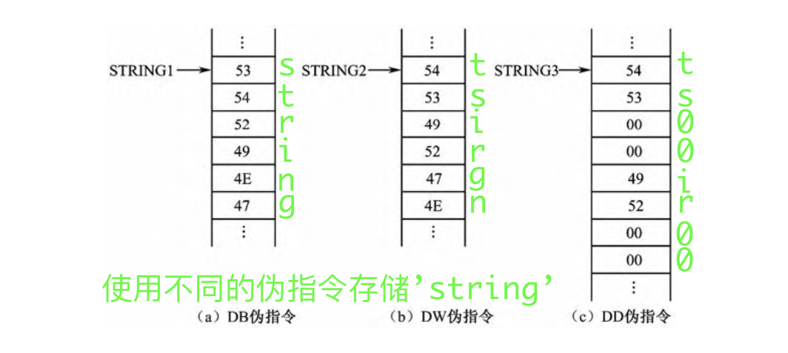
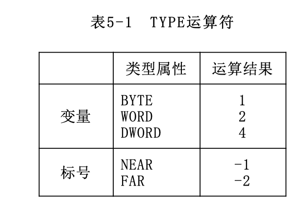
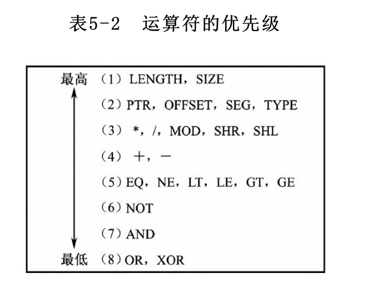
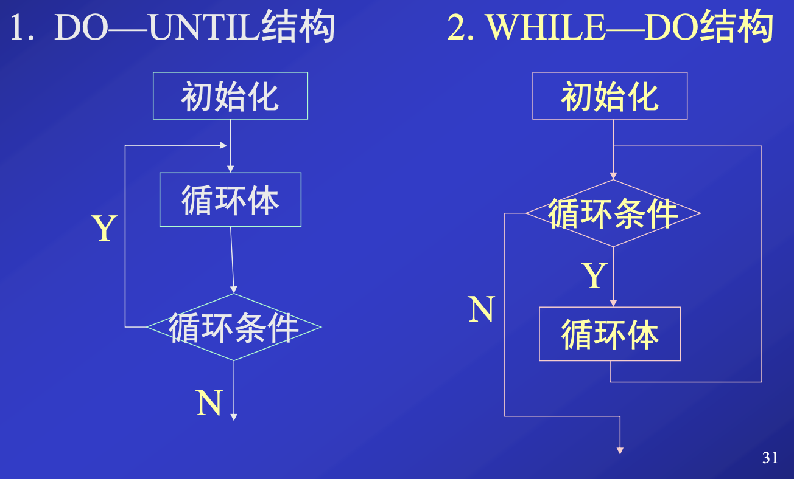
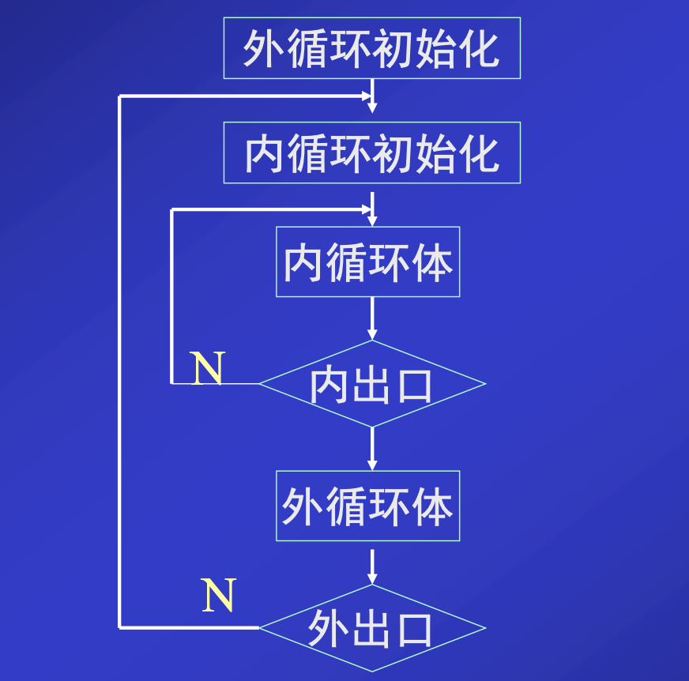

第五章、汇编语言层

[toc]

在第3章中介绍的微体系结构层，可看作是为第四章的指令系统层提供了一个解释器，使指令系统的功能得以实现。

但是，直接用机器指令代码编程是非常困难的，而让微体系结构层直接执行高级语言也不是好办法。因此，人们为所有的计算机都设计了一个汇编语言层，它位于指令系统层、操作系统层与面向问题语言层之间。

从这一层看去，每一种计算机都有一套自己的汇编语言和解释它的汇编器，以及相应的程序设计及开发方法。


本章所讨论的汇编语言级程序设计是以80x86 CPU为硬件背景，以MASM 5.0～MASM 6.0为“汇编”环境。

# 1. 概述

在计算机中，为使CPU能按照人们的设想去加工处理这些信息，就必须让计算机连续地执行有序的机器指令序列，即运行用中央处理器指令系统中的指令代码（即二进制代码）编制的程序。用计算机指令代码编制的程序称为机器语言程序，这种程序是计算机实现各种运算处理功能的最终目标代码。


汇编语言是一种面向机器结构的低级程序设计语言，它把由机器指令组成的机器语言程序“符号化”
> 也就是说，汇编语言程序中每一条指令语句都与机器语言程序的每一条机器指令一一对应。

从目标代码的长度和程序运行的时间来看，用汇编语言编制的程序与用机器指令编制的机器语言程序是一样的


汇编语言程序也是一种符号式的程序，用汇编语言编制的程序称为汇编语言源程序，这个源程序仍然不能由计算机直接执行，必须经过汇编程序（Assembler）“汇编”（即翻译）成目标代码后才能直接由计算机执行。


# 2. 汇编语句格式

语句（Statements）是汇编语言程序的基本组成单位。在汇编语言源程序中有三种语句
- 指令语句
- 伪指令语句
- 宏指令语句（或宏调用语句）


## 指令与伪指令

指令语句就是第4章中所述的80x86 CPU指令系统中的各条指令。每一条指令语句在源程序汇编时都要产生相应的、可供计算机执行的指令代码（即目标代码），所以这种语句又称为可执行语句。

伪指令语句用于指示（命令）汇编程序对源程序如何汇编，除其所定义的具体数据要生成目标代码外，其他项均没有对应的目标代码。

指令语句和伪指令语句有相同的语句格式，每条语句均由如下4个字段（Fields）组成：
$$名字 \quad 操作符 \quad 操作数 \quad ; \quad 注释$$

### 名字字段(Name Field)


- 指令语句中: 这个字段叫标号，用冒号`:`作为名字字段的结束符
    - 标号是一条指令的符号地址，它代表该指令代码的第一个字节单元地址。
- 伪指令语句中: 对于不同的伪指令这个字段的名字有所不同，后面用空格` `作为结束符
    - 伪指令语句的这些名字，有的代表一个具体常数值，有的作为存储单元的符号地址。它们都可以在指令语句和伪指令语句的操作数字段中直接加以引用。


名字字段的名字统称为标识符，组成规则如下：
- 字符个数为1-31个
- 可包含字母，数字，问号，@和下划线，不能以数字开头
- 不能使用保留字

###  操作符字段(Operator Field)

- 指令语句中: 这个字段就是指令助记符，表示程序在运行时CPU完成的操作功能。
- 伪指令中: 这个字段就是本章后面将要介绍的各种伪指令，表示汇编程序如何汇编（翻译）源程序各条语句。
    > 如数据定义伪指令DB、DW、DD；段定义伪指令SEGMENT；过程定义伪指令PROC等

###  操作数字段(Operand Field)

- 本字段与操作符字段用空格` `或制表符`Tab`作为分界符
- 如果本字段要求有两个或两个以上操作数，那么各操作数之间用逗号`,`或空格` `分隔。


###  注释字段(Comment Field)


必须以分号`;`作为字段的开始符
> 一条语句可以只有注释字段，此时该语句以分号`;`开始


# 3. 80x86宏汇编语言数据

在指令语句和伪指令语句中，操作数字段的主要内容是数据。宏汇编语言数据通常包含数值和属性两部分，这两部分对一条语句汇编成目标代码都有着直接关系。80x86宏汇编语言能识别的数据有：常数、变量和标号。

## 3.1 常数

常数是没有任何属性的纯数值数据，在汇编源程序期间，它的值已能完全确定，且在程序运行中，它也不会发生变化。

### 数值常数

可以用不同进制数的形式表示数值常数

1. 二进制

以字母B结尾的0和1组成的数字序列

2. 八进制

以字母O或Q结尾的0～7数字序列组成的数

3. 十进制

0～9数字序列组成的数，可以用字母D结尾，也可以没有结尾字母


4. 十六进制数

以字母H结尾的0～9和A～F（或a～f）数字字母序列组成的数

凡以字母A～F（或a～f）为起始的十六进制数，必须在前面冠以数字0，否则汇编程序认作符号。


### 字符常数

用单引号或双引号括起来的一个或多个字符，这些字符用它的ASCII码形式存储在存储单元中。


## 3.2 变量

变量代表存放在存储单元中的数据，并作为存储数据单元的符号地址。

### 3.2.1 变量的定义与预置

定义变量就是分配存储单元，这些存储单元可以预置数据初值或仅保留若干存储单元。定义与预置变量的语句格式如下：

$$变量名 \quad <数据定义伪指令> \quad <表达式1>,<表达式2>,...$$

1. 变量名是任选的

变量名是任选的
- 若选用变量名，那么它就是这些存储单元中首字节单元的符号地址
- 在程序中访问这些存储单元时，就可以直接引用这个变量名。

2. 数据定义伪指令

数据定义伪指令有：DB、DW和DD，它们用来定义字节、字和双字数据。

可以用DQ和DT来定义8和10字节的数据。80386及其以上机型中还可用DF来定义6字节数据。DW和DD伪指令还可定义存储地址，而DF伪指令可定义存储由16位段基值和32位偏移地址组成的地址指针。


经过定义后的变量（变量名），它们拥有一下三个属性

- 段属性（SEG）

    段属性表示变量存放在哪一个逻辑段中。

- 偏移地址属性（OFFSET）

    偏移地址属性表示变量在逻辑段中离段起始单元的距离（字节数）。
> 段和偏移地址两个属性就构成一个变量的逻辑地址

- 类型属性（TYPE）
    
    类型属性表示一个变量的数据大小，是字节（8位二进制数）、字（16位二进制数）、双字（32位二进制数）数据，或是6字节、8字节、10字节数据。这一属性是由数据定义伪指令DB、DW、DD、DF、DQ、DT来确定的。


3. 表达式

数据定义伪指令（DB、DW等）在为数据分配存储单元的同时，还可以给这些存储单元预置初值，每个初值由相应的表达式确定。定义变量语句中表达式可以有如下4种情况：

- 数值表达式
    
    - 在单一的存储单元，中设置一个数据
        > 如`var DB 50H`
    - 在连续的若干存储单元中设置数据，使用逗号将值隔开
        > 如`var DB 50H,20H`


- 字符串表达式

    - 字符串表达式中的字符串必须用引号（单引号或双引号）括起来
    - 字符串中各字符均以ASCII码形式存放在相应的存
    - 字符串表达式的表示方法和存储顺序：
        - 在DB伪指令中
            - 一个字符串表达式可以连续书写少于255个的字符
            - 每一个字符分配一个字节存储单元，按地址递增的排列顺序依次存放字符串自左至右的每一个字符

        - DW伪指令中
            - 一个字符串表达式只能由1～2个字符组成
            - DW伪指令为每一个字符串表达式分配两个字节存储单元
            - 如果表达式由两个字符组成，前一个字符的ASCII码存放在高字节中，后一个字符的ASCII码存放在低字节中。
            - 如果表达式由一个字符组成，那么该字存储单元的高字节存放00，而唯一字符的ASCII码存放在低字节存储单元中。
                
        - DD伪指令中
            - 一个字符串表达式也只能由1～2个字符组成
            - 为每个表达式分配4字节的存储单元
            - 两个低字节存储单元存放这1～2个字符的ASCII码（存储的顺序与DW伪指令相同），另外两个高字节存储单元均自动存放00。


- ？表达式

    - 表示仅分配相应数量的存储单元

- 带DUP表达式

    - 重复数据操作符DUP（Duplication），其格式如下
        $$变量名 \quad <数据定义伪指令> \quad <表达式1> \quad DUP \quad (<表达式2>)$$
        - 表达式1是重复的次数
        - 表达式2是重复数据的内容。
        > DUP操作符可以嵌套使用


### 3.2.2 变量的使用

变量定义和预置后才可以使用。对变量的使用就是对变量名的引用。在程序的其他语句中，对变量名的使用通常分两种情况: 

1. 在指令语句的操作数字段中

引用的变量名作为地址表达式的组成部分之一。


2. 数据定义语句的操作数字段上引用了变量名

在为DW或DD伪指令分配的存储单元中，将预置被引用变量名的地址部分
> 即存储引用变量的地址

- 如是DW，则仅有被引用变量名的偏移地址；
- 如是DD，则前两个字节存放偏移地址，后两个字节存放段基值。


## 3.3 编号

标号是一条指令的符号地址。

在无条件转移指令、条件转移指令和循环指令的操作数位置上，通常用标号作为程序转移指令的目标地址。


与变量一样，每个标号也具有3个属性：

1. 段属性（SEG）

表示指令在哪个逻辑段中

2. 偏移地址属性（OFFSET）

表示这条指令离段起始单元之间的字节数（准确地讲，是这条指令目标代码的首字节单元与段起始单元之间的字节数）
> 上述两个属性构成了这条指令的逻辑地址

3. 类型属性（TYPE）

表示它的转移特性，即该标号是作为段内转移指令还是段间转移指令的目标地址。
- NEAR（近）: 表示段内转移，本标号只能作为标号所在段的转移指令的目标地址。
- FAR（远）: 表示段间转移，本标号可作为其他段（不是标号所在段）的转移指令的目标地址。

标号的类型属性可以用下面两种方法来设置：
- 隐含方式

    当某指令语句选用一个标号后，该标号就隐含为NEAR属性(缺省)

- 使用LABEL伪命令

    - LABEL伪指令语句格式如下：
        $$名字 \quad LABEL \quad 类型$$
    - 与指令语句连用时，LABEL语句中的名字就是一个新的标号，其类型可选择NEAR或FAR
    - 当与数据定义语句连用时，LABEL语句中的名字就是一个新的变量名，其类型可选择BYTE，WORD或DWORD。
    - 这个新的标号或变量名，与它们连用的指令语句的标号或数据定义语句的变量名有相同的段和偏移地址属性，即与它连用的语句有相同的逻辑地址。只是类型不同，存取控制方式不同


## 3.4 表达式与运算符

表达式由常数、变量和标号通过某些运算符连接而成的。

任一表达式的数据计算或操作类型（指数据的大小、转移特性等）的确定是在汇编源程序过程中完成的，不是在程序运行时获得的。


80x86宏汇编语言程序设计
- 可使用的表达式有两种：数值表达式和地址表达式。
- 表达式中的运算符有：算术运算符、逻辑运算符、关系运算符、数值返回运算符和属性修改运算符。


### 算数运算符

- +（加）

- − （减）

    减法可用于同段两个操作数地址（以变量名表示）的运算，其结果是一个常数，表示这两个地址之间的相距字节数。

- *（乘）

- /（除）
    
    除法运算只取商的整数部分

- MOD（模除）

    MOD运算符是进行整数除法，运算结果只取它的余数部分。

- SHL（左移）

- SHR（右移）


> +、−、*、/运算中，参加运算的数和运算的结果均是整数。

### 逻辑运算符


- AND（逻辑与）
- OR（逻辑或）
- NOT（逻辑非）
- XOR（逻辑异或）

运算符格式：
$$<表达式1> \quad <逻辑运算符> \quad <表达式2>$$
$$NOT \quad <表达式>$$

> 逻辑运算符是按位进行逻辑运算的。

### 关系运算符

- EQ（相等）
- NE（不等）
- LT（小于）
- LE（小于等于）
- GT（大于）
- GE（大于等于）

$$<表达式1> \quad <关系运算符> \quad <表达式2>$$

如果比较关系成立，则用全1表示真，否则用全0表示假。

如果比较的是数值表达式，则按无符号数比较；

如果比较的是同段内的地址表达式，则比较它们的偏移地址。

### 数值返回运算符

这种运算符的运算对象必须是存储器操作数，即由变量名或标号组成的地址表达式。运算的结果是一个纯数值，这个数值表示该存储器操作数地址的组成部分及其某些特征。数值返回运算符的格式如下：
$$<数值返回运算符> \quad <地址表达式>$$

1. SEG运算符和OFFSET运算符

运算符结果分别是这个变量名或标号所在段的段基值或它在段内的偏移地址

2. TYPE运算符

TYPE运算符是用数值形式表示变量和标号的类型属性




3. LENGTH运算符和SIZE运算符

如果变量是用重复数据操作符DUP定义的，那么运算符LENGTH的运算结果是外层DUP的重复次数；如果没有用DUP定义的变量，运算结果总是1。

而运算符SIZE是LENGTH和TYPE两个运算结果的乘积。


### 属性修改运算符

这种运算符用来对变量、标号或存储器操作数的类型属性进行说明和设定。
$$类型 \quad PTR \quad <地址表达式>$$

把PTR运算符右边地址表达式所确定的存储单元**临时**设定为PTR运算符左边的“类型”（BYTE、WORD、DWORD或NEAR、FAR）。


### 运算符的优先级




# 4. 80x86宏汇编语言伪指令


## 4.1 符号定义语句

把某些常数或表达式用一个特定符号表示

### 4.1.1 等值语句

$$符号 \quad EQU \quad <表达式>$$

EQU是等值伪指令，把表达式的值或符号赋给EQU左边的符号。

表达式可以是以下三种之一：
- 常数或数值表达式
- 地址表达式
- 变量、标号或指令助记符


等值伪指令语句定义的符号仅在汇编源程序时作为替代符号使用，不产生任何目标代码，也不占有存储单元。类似于`#define`

> 同一符号不能用EQU伪指令重新定义


### 4.1.2 等号语句

$$符号 \quad = \quad 表达式$$

这种语句的含义和表达式的内容都与等值语句相同，不同的是等号语句
- 可以重新定义符号
- 不能为指令助记符定义别名

## 4.2 处理器选择伪指令

作用：确定使用的指令系统  
> 缺省默认只使用8086/8088指令系统和8087协处理器指令集。


处理器选择伪指令通常是放在源程序的开头位置，格式：
$$. \quad 目标处理器代号$$
> 在程序中某处要使用一条286，386，486或586所增加的指令，那么可以在这条指令语句前加上处理器选择伪指令。


## 4.3 段结构伪指令（SEGMENT/ENDS）

在编制一个80x86汇编语言源程序时，段是基础。这有两方面的含义
- 一是必须按段来构造程序
- 二是在程序执行时，要凭借几个段寄存器对各个段的存储单元进行访问。

### 4.3.1 段定义伪指令

```asm
段名 SEGMENT [定位类型] [组合类型] [使用类型] ['类别名']
    ...
    ...
段名 ENDS
```


每一个段都以SEGMENT伪指令开始，以ENDS伪指令结束，在这两个伪指令之间可以编写各种语句序列。在SEGMENT伪指令中有几个参数可供选择。
1.  段名
    
段名由用户自己选定，必须选用，且开始与结尾的段名应一致。

2. 定位类型（Align Type） 

定位类型表示该段装入内存时，对段起始边界的要求。定位类型有下列4种选择：
- PAGE（页）
    表示本段从一个页的边界开始。从存储器0号单元开始，每256字节为一页。所以段的起始地址一定能被256整除。
    > 这样段的起始地址（即段基址）的最后8位二进制数一定为0（即以00H结尾）。

- PARA（节）（缺省）

    表示本段从一个小节的边界开始（一个小节为16字节）。所以段的起始地址一定能被16整除，最后4位二进制数一定为0

- WORD（字）

    表示本段从一个偶字节地址开始。段起始地址的最后1位二进制数一定是0

- BYTE（字节）
    
    表示本段起始地址可从任一地址开始。即前一个段结束就可设置本段，在两个段之间不留空单元。


2. 组合类型(Combine Type)

组合类型指定段与段之间是怎样连接和定位的。这种类型有6种可供选择：

- NONE(缺省)
    
    表示本段与其他段无连接关系，按照源程序中各个逻辑段的自然顺序依次在存储器中分配各段存储单元。


- PUBLIC

    满足定位类型的前提下，本段与其他有相同段名、且也用PUBLIC说明的段在存储单元分配时邻接在一起，形成一个新的逻辑段，公用一个段基址。所有存储单元的偏移地址都调整为相对于新逻辑段的起始地址。

- COMMON 

    产生一个覆盖段。表示本段与其他有相同段名、且也用COMMON说明的段设置相同的起始地址，共享相同的存储区。共享存储区的长度由同名段中最大的段确定。


- STACK 

    自动产生一个堆栈段。把所有相同段名的段连接在一起，形成一个新的逻辑段。系统自动对段寄存器SS初始化为新逻辑段的起始地址，并同时初始化堆栈指针SP。
    > 通常，用户程序中至少有一个段是用STACK说明的，否则需在程序运行中对SS和SP进行初始化。
        

- AT表达式

    表示本段可定位在表达式所指定的小节边界上。

- MEMORY

    表示本段在存储器中应定位在所有其他段的最高地址。

4. 使用类型（Use Type）

使用类型是用于80386，80486和Pentium处理器机型的两种段模式选择：
- USE 16 段基值为16位，偏移地址为16位。一个段的最大寻址空间为64 KB。
- USE 32 段基值为16位，偏移地址为32位。一个段的最大寻址空间为4 GB。


5. 类别名

类别名必须用单引号括起来，并由用户自己选用。

在程序连接处理时，连接程序LINK把类别名相同的所有段存放在连续的存储区内，如在组合类型中没有选择PUBLIC，COMMON，MEMORY时，这些类别名相同的段仍然是各自独立的段。


### 4.3.2 段寻址伪指令（ASSUME）

由段寄存器指向的段是当前段，在任何时刻，只有当前段内的存储单元才可访问。在汇编源程序时，汇编程序必须知道哪些段是当前段，且它们分别由哪个段寄存器指向。

ASSUME伪指令就是告诉汇编程序，在下面程序中哪些段是当前段，它们分别由哪个段寄存器指向。

ASSUME伪指令只影响汇编源程序时的设定，而不影响程序运行时段寄存器的设置。

ASSUME伪指令格式如下:
$$ASSUME \quad 段寄存器名:段名,段寄存器名:段名...$$

- 段寄存器名是指CS、SS、DS和ES（对于80386及其后续机型还有FS和GS）中的一个
- 段名是指在SEGMENT/ENDS伪指令语句中定义的段名
- 段寄存器名和段名之间必须用冒号“：”分隔。
- 可以用关键字NOTHING作为段名将前面的某些设置取消或直接`ASSUME NOTHING`将所有段寄存器取消


### 4.3.3 段寄存器的装载

1. DS和ES的装载

如在指令的操作数字段上引用段名，就是将该段的段基值以立即数形式出现在操作数字段中。

> MOV传送指令不能把立即数直接传送给段寄存器，所以只能把段基值先送给一个通用寄存器，然后再转送给段寄存器DS或ES。


2. SS的装载

SS是堆栈段寄存器，它的装载就是对堆栈的设置。堆栈的使用离不开堆栈指针SP，所以在完成SS的装入的同时要实现对SP的设置。对SS的装载有如下两种办法：

- 自动装载

    - 在段定义伪指令（SEGMENT）的组合类型中选择“STACK”参数，指示这个段是堆栈段。
    - 当含有这个段的目标代码载入内存后，SS已自动装载STACK1段的段基值，同时堆栈指针SP也自动指向这个段最大地址+1单元（即堆栈底部+1的存储单元）。

- 用执行指令的方法装载


3. CS的装载

CS和IP提供了当前执行目标代码的段基值和偏移地址。为保证程序的正确执行，CS和IP载入新值必须一起完成。

- 使用结束伪指令  
    $$END \quad <地址表达式>$$

    - 地址表达式一般是一个已定义的标号，也可以是一个标号加或减一个常数。地址表达式的值是这个程序要执行的第1条指令语句的地址。

    - END伪指令语句一方面告诉汇编程序，源程序到此结束，在END语句后面的任何语句均被汇编程序略去；
    另一方面待程序目标代码装入内存储器时，系统用END语句中的地址表达式所示单元的段基值和偏移地址分别自动载入CS和IP中。

- 执行段间程序转移指令时，CPU将自动修改CS和IP的内容。


## 段组伪指令（GROUP）


把程序中若干不同段名的段组成一个段组，在目标程序装入内存时，一个段组的若干段都装在一个≤64KB的物理段中。段组伪指令GROUP的格式如下：
$$<段组名> \quad GROUP \quad <段名1，短命2，...>$$


此时，对段组的引用就是使用段组名


## 4.5 内存模式和简化段定义伪指令

### 内存模式伪指令(MODEL)

内存模式伪指令MODEL用于确定用户程序中代码和数据如何安排和存放，以及其占用内存的大小。

内存模式伪指令MODEL的格式如下：
$$. /quad> MODEL <内存模式>$$

1. Tiny(最小型模式)

    程序的代码和数据都放在同一个64 KB的段内。这就是扩展名为.COM的程序形式。程序的转移仅是段内转移，对数据的存取是在一个段内进行。

2. Small(小型模式)

    程序的代码放在一个64 KB的段内，数据放在另一个64 KB的段内。程序的转移仅是段内转移，对数据的存取也是在一个段内进行。
    > 这是最常用的内存模式。

3. Medium(中型模式)

    程序的代码可以放在多个段中，但数据则放在一个64 KB的段内。这样，程序的转移就有可能是段间转移，而对数据的存取仍是在一个段内进行。

4. Compact(压缩型模式)

    程序的代码放在一个64 KB的段内，而数据则可存放在多个段中。这样，程序的转移是段内转移，而对数据的存取要在不同段中进行

5. Large(大型模式)

    程序中代码和数据都可以分别放在多个段中。因此，程序的转移就有可能是段间转移，而对数据的存取也可能要在不同段中进行。

6. Huge(巨型模式)

    与大型模式（Large）类同，不同的是数据段可以超过64 KB。


### 简化段定义伪指令

使用简化段定义伪指令之前必须使用内存模式伪指令MODEL。

简化段定义伪指令有：
```asm
. CODE [段名];代码段。若只有一个代码段，段名可任选；
             ;若是多个代码段，则应为每个代码段选定一个段名

. DATE;数据段，已初始化数据
. DATE?;数据段，未初始化数据
. CONST;常数段
. FARDATA [段名];远数据段。已初始化远数据
. FARDATA? [段名];远数据段。未初始化远数据
. STACK [长度];堆栈段。可指定堆栈的大小，缺省为1KB
```

- 若FARDATA未指定段名，默认段名是FAR_DATA
- 而FARDATA？的默认段名是FAR_BSS
> 远数据段的设置主要是为了与高级语言接口连接

一个简化段定义的开始也就是前一个段的结束，而不必使用ENDS伪指令，仅在最后一个段用结束伪指令END表示全部程序的结束。


### 预定义符号

MASM提供一些在程序中使用的预定义符号，它类似于EQU伪指令定义的等价符号

1. @Model 

    内存模式用数值形式表示。即Tiny = 1，Small= 2，Compact = 3，Medium = 4，Large = 5，Huge = 6。

2. @Code 

    简化段定义.CODE的等价别名，即代码段段名。

3. @Data

    简化段定义.DATA的等价别名，即近数据段段名。

4. @Fardata

    简化段定义.FARDATA的等价别名，即远数据段段名。

5. @Stack 

    简化段定义.STACK的等价别名，即堆栈段段名

6. @Codesize 

    用数值表示代码段的情况
    - 当内存模式为Tiny，Small，Compact时，只有一个代码段，此值为0
    - 当内存模式为Medium，Large，Huge时，有多个代码段，此值为1。

7. @Datasize

    用数值表示数据段的情况。
    - 当内存模式为Tiny，Small，Medium时
        - 只有一个数据段，此值为0
    - 当内存模式为Compact，Large时
        - 有多个数据段，此值为1
    - 当内存模式为Huge时
        - 有多个数据段且有超过64 KB的大数据段，此值为2。


## 4.6 定义与对准伪指令

### 定义伪指令(ORG)和位置技术器($)

汇编程序有一个位置计数器，用来记载正在汇编的数据或指令的目标代码在当前段内的偏移地址，符号“$”表示位置计数器的当前值。

定位伪指令ORG是对位置计数器设置、修改的控制命令。ORG伪指令语句格式如下：
$$ORG /quad <表达式>$$

ORG伪指令语句把表达式的值赋给位置计数器，即ORG语句后面的目标代码（指令代码或数据）由表达式给定的值作为起始偏移地址。
> 且表达式中可以包含位置计数器的现行值＄。


## 对准伪指令

对准伪指令EVEN也是对位置计数器的一个控制命令，它把位置计数器的值调整为偶数。

对准伪指令EVEN语句格式如下:
$$EVEN$$

在存储器中，对字单元（包括双字等多字单元）进行存取操作时，如是偶地址，那么存取速度较快。所以对准伪指令EVEN主要应用在定义字数据（包括多字数据）前，用以对位置计数器进行调整。


## 4.7 过程定义伪指令(PROC/ENDP)

在程序设计中，我们常把具有一定功能的程序段组织成一个子程序。MASM宏汇编程序用“过程”来构造子程序。过程定义伪指令语句的格式如下：

```asm      
过程名 PROC [NEAR/FAR]
    ...
    指令序列
    ...
过程名 EDNP
```
一个过程名类同于标号，它也有三个属性：段、偏移地址 和类型属性。
> 如没有选择类型属性，则隐含为NEAR


在一个过程（子程序）中，至少有一条子程序返回指令RET，它可以在过程中的任何位置，但过程执行的最后一条指令一定是返回指令RET。


## 4.8 包含伪指令(INCLUDE)

```asm
INCLUDE <文件名>
```

INCLUDE伪指令把指定的文件插入到现在正在汇编的源程序中，作为源程序的一个组成部分


## 4.9 标题伪指令(TITLE)

```asm
TITLE <文本>
```

标题伪指令TITLE是给程序指定一个标题，以便在列表文件中每一页的第一行都显示这个标题文本。

文本内容可以由程序设计人员任选名字或字符串，但字符个数不得超过80。标题伪指令语句应在源程序开始处使用


# 5. 宏命令

## 宏命令的使用过程

### 宏定义

使用宏指令，必须先用`MACRO/ENDM`进行宏定义，存在两种形式

```asm
;1. 无参数的宏定义
宏名 MACRO
    ...
    宏体
    ...
    ENDM

;2. 带参数的宏定义
宏名 MACRO 形参1，形参2，...
    ...
    宏体
    ...
    ENDM
```

宏定义不出现在程序的目标代码中，因此宏定义可以在源程序的任何位置上。


### 宏调用

```asm
; 1.无参数宏调用
宏名

; 2. 带参数宏调用
宏名 实参1，实参2，...
```

- 如实参个数比形参个数多，那么多余的实参自动被略去
- 如实参个数比形参个数少，那么在宏展开时，没有实参替代的形参自动用空白串替代。


### 宏展开

当宏汇编程序扫描到宏指令语句（宏调用）时，就把宏定义中宏体的目标代码插入在宏调用的位置上，这就是宏展开。


## 宏操作符

在宏定义和宏调用中，有几个常用的宏操作符。

### 连接操作符&

在宏定义中使用连接操作符&时，它可以在形参的前面，也可以在形参的后面。

在宏展开时，对应形参的实参与它后面或前面的符号连接在一起构成一个新的符号。


### 表达式操作符%

```asm
%表达式
```

表达式操作符%告诉宏汇编程序获取表达式的值，而不是获取表达式文本本身。


### 文本操作符<>


有时一个实参是由一串字符、逗号或空格构成，可以用文本操作符＜＞把一个完整的实参括起来，作为一个单一的实参。


### 字符操作符！


```asm
!字符
```

惊叹号“!”后面的字符不作为特别的操作符使用，而是字符本身。
> 转义符


## LOCAL伪指令

```asm
LOCAL <符号表>
```

宏定义中如含有变量名或标号，且在同一源程序中又多次被宏调用，那么宏汇编程序在宏展开时，要产生多个相同的变量名或标号，这就不能满足变量名或标号在同一程序中必须唯一的要求，从而产生汇编出错。为避免这个错误，又要在宏定义中能使用变量名或标号，应使用局部符号伪指令LOCAL。


宏汇编程序在宏展开时，对LOCAL伪指令指定的变量名和标号自动生成格式为`？？× × × ×`的符号，其中后4位顺序使用0000～FFFF的十六进制数字。


# 6. 汇编语言程序设计基本技术

> 摘抄自ppt

## 顺序程序设计


顺序结构程序: 按编写指令的顺序执行，无分支、循环、转移，且每条指令只执行一次

1. 用到的指令

- 数据传送类: mov,xchg,push,pop,lea,lds,les,pushf,popf,lahf,sahf
- 算数运算类: add,adc,inc,sub,sbb,dec,neg,cmp,mul,imul,div,idiv,cbw,cwd 
- 逻辑运算类: and,or,not,xor,test,shl,sal,shr,sar,rol,ror,rcl,rcr


2. 查表举例

- 将TABLE的偏移地址送进BX
- 将需要查找的表内偏移地址加上BX的值后送回BX
- 以BX作为间接寻址取出表中的数据送入AL 
- 将AL的值作为结果输出


## 分支程序设计

分支程序: 指令的执行顺序和存储顺序不一致

执行指令的地址由`CS:IP`决定
- 顺序执行时，IP的值根据指令的长度依次递增
- 转移时
    - 若在同一段中，改变IP的值，CS不变
    - 若转向不同的段，改变CS和IP的值


### 单分支结构

1. 无条件转移使用JMP指令

$$JMP \quad 目标$$
- 转到目标出执行程序，对标志位无影响
- 目标可以是
    - `标号`
    - `标号+常数`
    - `寄存器(或存储器)`


2. 条件转移使用JXX指令

$$JXX \quad 目标$$
- 条件满足，转到目标处执行程序；条件不满足，顺序执行程序
- 条件根据PSW中的条件码测试：ZF、SF、OF、CF、PF


### 多分支结构

数据段定义一张跳转地址表TABLE，每个表项占两个单元(段内转移)，表示各个分支的目标标号，可通过`JMP 表中的偏移地址`实现多分支的跳转

```asm
data segment 
    ...
    TABLE dw addr0,addr1,...,addrn
    ...
data ends
code segment 
        ...
        mov ah,0
        mov al,NUM 
        add ax,ax; AX*2
        mov si,ax; 将si作为表中的偏移地址
        mov bx,TABLE[si]; 偏移地址加上TABLE地址得到目标表项的内容
        jmp near ptr bx; 跳转到目标表项代表的标号处
    addr0:
        ...
        jmp end 
    addr1:
        ...
        jump end 
    ...
    addrn:
        ...
        jump end 
    end:
        ...
code ends
```


## 循环程序设计


### 形式




1. 初始化：设置循环次数、循环初始状态值等
2. 循环体：循环的主体部分，分两部分
    - 循环工作部分：完成程序功能的主要程序段
    - 循环调整部分：更新用于判断循环结束的数值
3. 循环条件：判断循环是否结束


### 循环指令

1. 普通循环
$$LOOP \quad 标号$$
- $(CX) - 1 \rightarrow (CX)$
- 若$(CX) \ne 0$，从标号处继续循环
- 若$(CX) = 0$，退出循环
> 相当于两条指令：$DEC \quad CX,JNZ \quad 标号$


2. 为0/相等时循环
$$LOOPE/LOOPZ 标号$$
- $(CX) - 1 \rightarrow (CX)$
- 若$(CX) \ne 0且ZF = 1$，从标号处继续循环
- 若$(CX) = 0或ZF = 0$，顺序执行


3. 非0/不等时循环
$$LOOPNE/LOOPNZ 标号$$
- $(CX) - 1 \rightarrow (CX)$
- 若$(CX) \ne 0且ZF = 0$，从标号处继续循环
- 若$(CX) = 0或ZF = 1$，顺序执行

4. 按CX循环
$$JCXZ \quad 标号$$
- $(CX)=0$，转至标号处继续循环
- 否则，顺序执行

### 使用

1. 注意

- 循环指令不影响标志位
- 隐含$(CX)－1$操作
- JCXZ常用于循环初值为0而发生循环的情况
- LOOP指令按循环次数决定是否结束循环
- LOOPZ和LOOPNZ提供了提前结束循环的可能，常跟在比较指令之后


2. 循环的基本结构
```asm
code setment
    ...
    MOV CX,n; 给循环计数器赋初值
AGAIN:
    ...
    ...;循环体
    ...
    LOOP AGAIN; 跳回开始处
code ends
```

3. 循环的控制方法

- 用计数控制循环
    - 循环次数已知
    - 若选用CX做计数器，递减，可用LOOP,LOOPE,LOOPNE等
    - 选取其他寄存器或存储单元作计数器，可用INC/DEC指令和条件转移指令JNZ配合

- 用条件控制循环
    - 循环次数不确定
    - 每循环一次，测试并判断循环终止条件是否成立


4. 多重循环程序设计

利用标号进行程序的转移




## 子程序的调用及返回

### 子程序的调用

1. 指令格式

$$CALL \quad 过程名$$
> 过程名类似与标号，用法类似与JMP

- 段内调用（仅修改IP值）
    - 直接调用: `call (near ptr)过程名`
    - 间接调用: `call 寄存器名`,`call word ptr 字存储单元`
    > 新IP值在寄存器或存储单元里
- 段间调用（修改CS和IP的值）
    - 直接调用: `call (far ptrl)过程名`
    - 间接调用: `call dword ptr 双字存储单元`
    > 新段基值和偏移量在双字存储单元中


2. 执行的操作

- 先将返回地址入栈(CALL命令后一条命令的逻辑地址)
- 在转移到子程序的入口地址执行

### 子程序的返回

$$RET$$

- 从栈顶处弹出返回地址，并将其赋值给IP或IP、CS，取决于段间转移或段内转移

$$RET \quad n$$

- 从栈顶处弹出返回地址，并将其赋值给IP或IP、CS，取决于段间转移或段内转移
- 再用n修改SP的值，即$(SP)+n \rightarrow (SP)$


### 传递参数

1. 使用寄存器

2. 使用存储单元

3. 使用地址表
    参量较多时，先把参量所在的地址组成一个地址表，将地址表的首地址传递给子程序

4. 使用堆栈


### 系统功能子程序调用  

1. 系统子程序

8086/8088向用户提供了十分有效的输入/输出基本子程序，这些子程序在DOS和BIOS中，用户可以用**软中断INT n**指令调用这些程序
- 10H～1FH BIOS占用的类型码
- 20H～2FH DOS占用的类型码

2. 调用方法

- 置入口参数
    即传递给系统功能子程序的参数

- 于AH中置功能号
    设置将要调用的子程序，不同的功能号对应不同的系统功能子程序

- INT XXH(中断类型码)
    调用子程序

出口参数一般在通用寄存器中，即该子程序进行的操作返回的值


------


# debug.exe用法


## 注意：
- `-`是debug提示符prompt
- debug.exe只能对扩展名为`.com`和`.exe`的文件进行调试
- 命令参数不区分大小写
- 所有的输入和显示的数，均为十六进制数，H隐含
- `<Ctrl>+<Break>`停止命令的执行
- 如果命令产生大量输出，可按下`<Ctrl>+_<Num Lock>`使显示停止卷动，按下其他任意键可恢复


## -r

查看，修改寄存器的内容和标志

```asm
-r 
# 查看所有寄存器内容

-r register_name
# 修改指定寄存器的值

-rf
# 显示标志寄存器内容
``` 

所有的标志位为

| 标志名                | 标志为1 | 标志为0 |
|-----------------------|---------|---------|
| OF 溢出（是/否）     | OV      | NV      |
| DF 方向（增量/减量）  | DN      | UP      |
| IF 中断（允许/关闭）  | EI      | DI      |
| SF 符号（正/负）      | NG      | PL      |
| ZF 零（是/否）        | ZR      | NZ      |
| AF 辅助进位（是/否）  | AC      | NA      |
| PF 奇偶（偶/奇）      | PE      | PO      |
| CF 进位（是/否）      | CY      | NC      |


## -d 

查看内存中的内容

```asm
-d [起始地址] [结束地址]
```

显示两部分内容
- 字节的十六进制数形式
- ASCII码形式
> ascii码中不可见字符用`.`表示

## -e 

修改内存单元中的内容

```asm
-e 地址 [内容表]
```

- 如果提供内容表：用内容表的内容替换指定开始地址的一个或多个字节的内容
- 否则进入交互替换模式
    - 输入值后
        - 输入enter退出替换模式
        - 输入空格对下一个单元继续编辑
    - 输入空格
        - 不修改当前内存单元的值，对下一个单元继续编辑
> 如只输入一个地址偏移量，则缺省的段为DS

## -a 

让用户可以直接输入汇编语言指令，将其转换为机器码并存入内存中

```asm
-a [地址]
```

- 键入的汇编语句被汇编到地址指定的相应内存单元中
- 如没有指定地址，则被汇编到CS:0100内存区内。
- 键入所有语句后，当再次出现提示符时，按下↙键，返回到DEBUG提示符


## -t 

执行一条或多条指令

```asm
-t [=地址] [值]
```

- 执行自指定地址开始的一条或给定值条指令
- 每条指令执行完都会显示出所有寄存器和标志位的内容
- 未给定地址则以CS:IP开始执行


## -u 


反汇编命令：将指定内存地址中的机器码转换为可读的汇编指令

```asm
-u [起始地址] [结束地址]
```
- 从指定的地址反汇编32字节的汇编语句，显示出他们的
    - 地址
    - 十六进制值
    - 对应的汇编语句。
- 起始地址，结束地址均缺省时
    - 则以上一条条u命令反汇编的最后一条命令后的单元作为起始地址
    - 若以前未用过的U命令则以CS：100作为起始地址。


## -g 


执行程序命令功能：执行正在调试的程序，当执行到指定断点时，停止执行，并显示寄存器、标志和下一条要执行的指令。
```
-g [=地址] [地址 [地址 …]]
```
- \[=地址]规定了执行的起始地址，缺省时则以CS：IP当前内容为开始地址，输入时要特别注意加 “=” 号
- 第二、第三参数的地址为断点地址，最多可设10个断点，每当程序执行遇到断点时都会停下来，键入G继续执行
