第六章、存储系统

在传统的CPU中，为数不多的寄存器只能暂存少量信息，绝大部分程序与数据需要存放在专门的存储器中。计算机系统结构的发展要求多层次的存储能力，这就构成了具有层次结构的存储子系统。

在物理构成上，存储系统通常分为3层
- 高速缓冲存储器Cache
- 主存
- 外存  
Cache与主存常由半导体存储器构成；外存常由磁盘及光盘构成，也可以看作是I/O设备

在本章中
- 首先介绍各种存储器存储信息的原理
- 接着介绍芯片级以上的存储器逻辑设计方法
- 然后介绍高速缓存、外部存储器的工作原理
- 最后从整个存储系统组织的角度，介绍有关技术，如物理存储系统组织、虚拟存储技术等

[toc]

# 概述

简单地讲，存储器用于存放计算机程序和指令、待处理的数据、运算结果以及各种需要计算机保存的信息

存储器由一些能够表示为二进制数中0、1两种状态的物理器件组成，这些器件本身具有记忆功能，如电容、双稳态电路等。

通常一个存储单元由8个存储元构成，可存放8位二进制信息（即1字节，1 Byte）。许多存储单元组织在一起就构成了存储器。

一个高性能的计算机系统要求存储器的存储容量大，存取速度快，成本低廉，能支持复杂系统结构。这些要求往往相互矛盾，彼此形成制约，为了适应不同层次的需要，形成了多级存储体系

从用户的角度看，存储器还可以形成另一种层次结构，即
- 物理存储器: 物理存储器是指系统的物理组成中实际存在的主存，主存容量决定了实存空间的大小
- 虚拟存储器: 依靠操作系统的软件支持及部分硬件的支持，可使用户访问的编程空间远比实际主存空间大，这个存储器称为虚拟存储器。

## 存储器的分类

### 按存储器在计算机系统中的作用分类

1. 内存存储器

- 用来存储当前运行所需要的程序和数据
- CPU可以直接访问内存并与其交换信息
- 相对外部存储器而言，内存的容量小、存取速度快

2. 外存存储器

- 用于存放当前不参加运行的程序和数据，以及一些需要永久保存的信息
- 外存设在主机外部，其容量大
- 存取速度相对较慢，CPU不能直接访问它，而必须通过专门的设备才能对它进行读写（如磁盘驱动器等）

3. 高速缓存存储器

- 位于主存和CPU之间，用来存放正在执行的程序和数据，以便CPU能高速地访问它们
- Cache的存取速度可以与CPU的速度相匹配，但其价格昂贵，存储容量较小
- 目前的微处理器通常将Cache或Cache的一部分制作在CPU芯片中。

### 按存取方式分类

1. 随机存取存储器RAM(Random Access Memory)

- CPU可以对RAM单元的内容随机地读/写访问
- 对存取时间相同: 任一单元的读出和写入的花费的时间是一样，
- RAM读/写方便，但断电后信息会丢失

2. 只读存储器ROM(Read Only Memory)

- 只读存储器可以看作RAM的一种特殊形式
- 只能随机读出而不能写入
- 断电信息也不会丢失
> 有些ROM在特定条件下用特殊的装置或程序可以重新写入。

3. 顺序存取存储器SAM(Sequential Access Memory)

- 内容只能按某种顺序存取
- 存取时间的长短与信息在存储器上的物理位置有关
> 磁带机就是典型的顺序存取存储器。

4. 直接存取存储器DAM(Direct Access Memory)

- 介于RAM的随机地访问和SAM的顺序存取之间
- 存取信息时
    - 第1步直接指向存储器的某个小区域（如磁盘上的磁道）
    - 第2步在小区域内顺序检索或等待，直到找到目的地后再进行读/写操作
- 存取时间也与信息所在的物理位置有关，但比SAM的存取时间要短
> 磁盘是最常见的直接存取存储器。

### 按存储介质分类

1. 磁芯存储器

通过小型铁氧体环（磁芯）存储数据，每个磁芯的磁化方向表示1或0。
- 写入数据：通过电流改变磁化方向设定为1或0。
- 读取数据：检测磁化方向以判断状态，破坏性读出

> 破坏性读出，不管磁芯原存的信息是1或0，读出之后磁芯内容都变成0

2. 半导体存储器

采用半导体器件制造的存储器

3. 磁表面存储器

在金属或塑料基体上涂敷一层磁性材料，利用磁层的磁化状态来存储信息
- 写入数据：磁头在磁性表面通过电流改变局部磁化方向以表示1或0。
- 读取数据：磁头检测磁场变化，转换为电信号输出。

4. 光盘存储器

利用激光技术控制访问的存储器
- 写入数据：激光束烧蚀光盘表面的有机层或改变反射率，形成“坑”和“平面”表示1和0。
- 读取数据：通过激光反射强度的差异检测数据。

## 主存的主要技术指标

从理论上讲，只要具有两个明显可区分的物理状态且容易进行状态转换的器件和介质都可用来存储二进制信息

1. 存储容量

存储容量是指主存所能容纳的二进制信息总量

2. 存取速度

存取速度通常由存取时间和存取周期来表示。
- 存取时间: 指从启动一次存储器操作到完成该操作所经历的时间
- 存取周期: 指存储器进行一次完整的读/写操作所需的全部时间，即连续两次访问存储器操作之间所需的最短时间(上次存取结束到下次存取开始间的最短时间)

3. 可靠性

指规定时间内，存储器无故障读/写的概率，通常用平均无故障时间MTBF（Mean Time Between Failures）来衡量可靠性，MTBF可理解为两次故障之间的平均时间间隔

4. 存取宽度

也称为存储总线宽度，即CPU一次可以存取的数据位数或字节数。

# 存储原理

## 半导体存储器的存储原理

### 静态存储器SRAM

SRAM原理：利用双稳态触发器保存信息

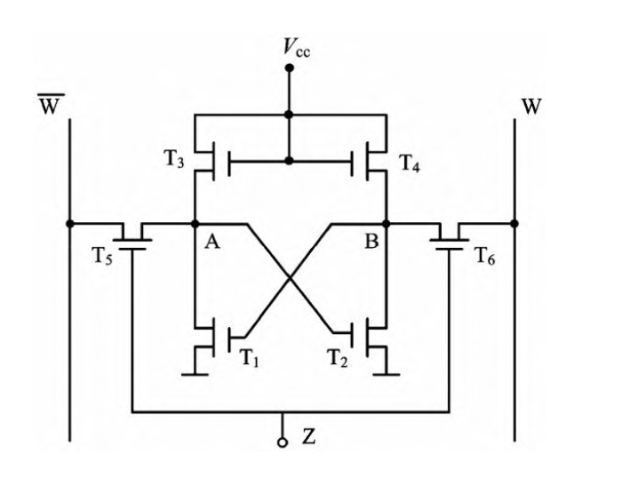

1. 组成
- mos管
    - T1,T2: 工作管
    - T3,T4: 负载管
    - T5,T6: 门控管
- W: 位线
- Z: 字线

2. 定义

- 存0： T1导通，T2截止
- 存1： T2导通，T1截止

3. 存取操作

- 写入: z接高电平，T5,T6导通
    - 写0：$\overline{W}$加低，W加高， T6 对 B 充 电 ， 使 T1导通，T2截止；
    - 写1：相反，T5对A充电，使T2导通

### 动态存储器DRAM

## 磁表面存储器的存储原理

1. 记录介质与磁头

- 介质: 磁层（矩磁薄膜），依附在基体上
- 磁头: 读写部件

2. 读写原理、特点

- 写入(电磁转换)

    磁头线圈中加入磁化电流（写电流），并使磁层移动，在磁层上形成连续的小段磁化区域（位单元）

- 读出（磁电转换）

    磁头线圈中不加电流，磁层移动。当位单元的转变区经过磁头下方时，在线圈两端产生感应电势

## 光存储器的存储原理

1. 环变形光盘

形变不可逆，不可改写
- 定义: 有空为1，无孔为0
- 写入:
    - 写1，⾼功率激光照射介质，形成凹坑；
    - 写0，不发射激光束，介质不变
- 读出: 低功率激光扫描光道，根据反射光强弱判断是1或0

2. 相变形光盘

相变可逆，可改写
- 写入: 
    - 写1，⾼功率激光照射介质，晶粒直径变⼤；
    - 写0，不发射激光束，晶粒不变
- 读出: 低功率激光扫描光道，根据反射率的差别判断是1或0

3. 磁光形光盘

磁化方向，可恢复可改写
- 写入前：外加磁场，使介质呈某种磁化⽅向
- 写入:
    - 写1，激光照射并外加磁场改变磁化⽅向；
    - 写0，未被照射区域，磁化⽅向不变
- 读出: 低功率激光扫描光道，根据反射光的偏转角度判断是1或0 （通过检偏器为1）

# 主存储器的组织

本节考虑如何用存储芯片组成一个实际的存储器。

1. 容量的表示

设计存储器时，首先要确定所要求的总容量，即字数×位数
> 为了便于处理字符型数据，在微型计算机中，一般都采取按字节编址

容量为$2^N x M$的存储器
- 拥有$2^N$个存储单元,需要N位地址线
- 每单元存放$M$位数据，需要M根数据线

2. 变址单位

在大、中、小型计算机中，往往允许主存选取两种编址单位之一
- 按字节编址
- 按字编址: 每个编址单元存放一个字，字长多为字节位数的整数倍

确定了存储器的总容量之后，即可确定可供选用的存储芯片是什么类型、什么型号、每片容量多大等

## 存储器容量扩展

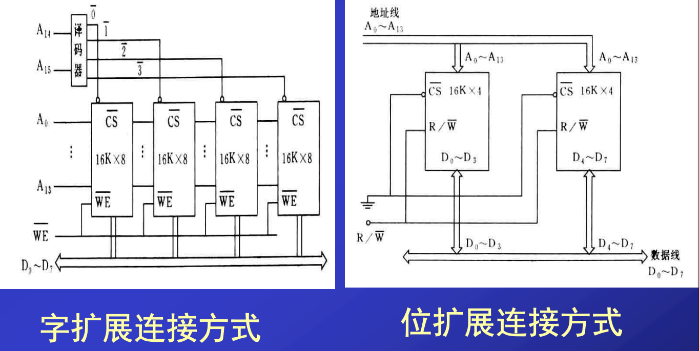

### 位扩展

如果各个存储芯片的位数小于存储器所要求的位数，就需要进行位扩展

位扩展是指用多个存储芯片对字长进行扩展

其连接方式是
- 将各个存储芯片的地址线、片选线和读写控制线相应地并联
- 而各个存储芯片的数据线单独列出

### 字数（编址空间）扩展

如果每片的字数不够，需用若干芯片组成总容量更大的存储器，称为字数扩展

- 高位地址译码产生若干不同的片选信号(用于选取用于读写的目标芯片)
- 低位地址线直接送往各个芯片，以选择目标芯片内的某个单元
- 而各个芯片的数据线，按位并联于数据总线。

向存储器送出某个地址码时
- 只有一个片选信号有效，选中某个芯片
- 而低位地址在芯片内译码选中某个单元

## 动态存储器的刷新

如果采用DRAM芯片构成主存储器，除前述逻辑设计外，还需考虑动态刷新问题
- 若芯片采用的是四管动态存储单元，则读出时能自动补充电荷
- 若采用单管存储单元，则属于破坏性读出，但存储芯片本身具有读出后重写的再生功能

因此对所有DRAM芯片都采用逐行刷新的方法。为此
- 应设置一个刷新地址计数器，提供刷新地址，即刷新行的行号
- 然后发送行选信号给读命令，即可刷新一行
    - 此时列选信号为高（无效），数据输出为高阻
- 每刷新一行后，刷新地址计数器加1，每个计数循环对芯片各行刷新一遍
> 目前工艺水平，将全部刷新一遍所允许的最大时间间隔约为2ms

于是主存储器需要两种工作状态：
- 一种是读/写/保持状态
    - 由CPU（或其他控制器）提供地址进行读写
    - 或是不访问主存（保持信息），其访存地址是根据程序需要随机产生的，有些行可能长期不被访问
- 另一种是刷新状态
    - 由刷新地址计数器逐行地提供行地址
    - 在2ms周期中不能遗漏任何一行

因此实现动态刷新的一个重要问题是：如何安排刷新周期？一般可归纳为下述3种典型的刷新方式。

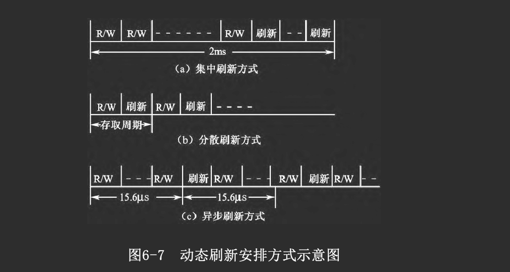

### 集中刷新

1. 概念

在2ms的最大刷新周期内
- 集中安排若干刷新周期，使全部芯片刷新一遍，这时刷新周期数等于最大容量芯片的行数
- 其余时间可用于正常工作，即读/写/保持状态

在逻辑实现上，可由一个定时器每2 ms请求一次，进入集中刷新状态，然后由刷新计数器控制一个计数循环，逐行刷新一遍。

2. 评价

集中刷新方式
- 优点是：主存利用率高，控制简单
- 缺点是：在集中刷新状态中不能使用存储器，因而形成一段死区。如果系统工作方式不允许有死区，则不能采用集中刷新方式

### 分散刷新方式

1. 概念

将每个存取周期分为两部分
- 前半期可用于正常读/写/保持
- 后半期用于刷新

换句话说，将各个刷新周期分散地安排于各读写周期之后

2. 评价

分散刷新
- 优点是：控制简单，主存工作没有长的死区
- 缺点是：主存利用率低，工作速度约降低一半。因为每个存取周期中都包含一个刷新周期，所需时间约增加一倍

### 异步刷新方式

按芯片行数决定所需刷新周期数，并分散安排在2ms的最大刷新周期中

例如，芯片的最大行数为128，可每隔15.6 μs提出一次刷新请求，响应后就安排一个刷新周期

- 提出刷新请求时有可能CPU访存尚未结束
- 则稍事等待至主存有空时
- 再安排刷新周期进行刷新，所以称为异步刷新方式

可将动态刷新请求作为一种DMA(直接存储器访问)请求
- CPU响应后放弃系统总线控制权，暂停访存
- 由DMA控制器接管系统总线，送出刷新地址进行一次动态刷新

2. 评价

异步刷新方式兼有前两种方式的优点：
- 对主存利用率和工作速度影响最小
- 而且没有死区

虽然控制上复杂一些，但可利用系统已有的DMA功能去实现。因此大多数计算机系统采用异步刷新方式

在说明了3种刷新方式之后，再归纳一下硬件实现的4种可能方案：
- 利用DMA功能
- 用通用芯片构成动态刷新计数器、地址切换等刷新控制逻辑
- 利用专用芯片（如Intel 8203）动态RAM系统控制器
- 利用准静态RAM芯片，这种存储芯片内部采用单管动态存储单元，本质上属于动态存储器。但芯片内部还集成了动态刷新逻辑，从使用者角度看，不再需要另外设置外部刷新电路，其使用特性如同SRAM，因而称为准静态RAM

## 主存储器与CPU的连接

主存储器与CPU的连接在具体逻辑上可能有多种变化，从原理上大致需要考虑以下几个方面

### 系统模式

1. 最小系统模式

将CPU芯片与存储芯片直接连接，即
- CPU输出地址线、数据线直接送往存储芯片
- 并发出读写命令R/ 送往芯片  
这种模式被称为最小系统模式

由于这种小系统所需存储器容量不大，往往采用SRAM芯片，省去刷新逻辑。

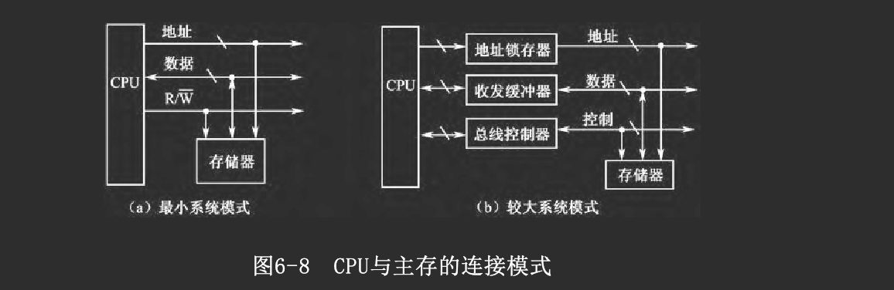

2. 较大系统模式

在稍具规模的计算机系统中，往往通过系统总线连接主存储器与外围设备

- CPU芯片的引脚常常不直接与系统总线相连 
    - 而是通过数据收发缓冲器、地址锁存器、总线控制器等接口芯片与系统总线相连
- 主存储器模块就挂接在系统总线上
    - 通过总线完成一次存储器读/写，需占用一个总线周期。

3. 专用存储总线模式

如果系统规模较大（所带外围设备较多），而且要求访存速度较高，则可在CPU与主存储器之间建立一组专用的高速存储总线，其中包括地址线与数据线及少量控制信号

在这种系统模式中，CPU通过存储总线访问主存储器，通过I/O总线访问I/O设备

### 速度匹配与时序控制

1. 早期的统一时钟周期

在早期的计算机中，常为CPU内部操作与访存操作设置统一的时钟周期，又称为节拍，以进行一次访存所需时间作为一拍的宽度

CPU内部操作也是每拍执行一步，由于CPU速度往往远高于主存存取速度，即完成一步CPU内部操作所需的时间远小于主存的一个存取周期，因此CPU利用率低

2. 现在的分开时钟周期

现在，大多数计算机为这两类操作分别设置周期
- CPU内部操作的时钟周期
    - 一般按CPU内部操作的需要划分时钟周期，每个时钟周期完成一步CPU内部操作，如一次传送或一次加减
    - 可选取较高的时钟频率，即较短的时钟周期，以适应CPU的高速操作

- 访存操作的总线周期 
    - 通过系统总线的一次访存操作，占用一个总线周期
    - 同步控制方式: 一个总线周期由若干时钟周期组成，大多数主存的存取周期是固定的，因此一个总线周期包含的时钟周期可以预知
        - 在扩展同步控制方式中，允许延长总线周期，即增加时钟周期数
    - 异步控制方式: 总线周期与CPU时钟周期无直接关系，由异步应答确定，当存储器完成操作时往往发出一个就绪信号READY

在高速系统中，常采取一种覆盖并行地址传送技术，即在现行总线周期结束之前，提前送出下一总线周期的地址与操作命令，以提高总线传送速度。

### 数据通路匹配

1. 介绍

解决主存与数据总线之间的宽度匹配

数据总线一次能并行传送的位数，称为总线的数据通路宽度，常见的有8、16、32、64位几种。但大多数主存储器采取按字节编址，每次访存读/写8位，以适应对字符类信息的处理。这就存在一个主存与数据总线之间的宽度匹配问题。

2. 举例说明

Intel 8086是16位CPU，它的标准方式是
- 在一个总线周期内可存/取2字节
- 即先送出偶单元地址（地址编码为偶数）
- 然后同时读/写偶单元及随后的奇单元
- 用低8位数据总线传送偶单元的数据，用高8位数据总线传送奇单元数据

> 这样读/写的字（16位）被称为规则字。如果传送的是非规则字，即从奇单元开始的字，就需要安排两个总线周期才能实现

为了实现这样的传送，需将存储器分为两个存储体
- 一个存储体的地址编码均为偶数，称为偶地址（低字节）存储体，它与低8位数据线相连
- 另一个存储体的地址编码均为奇数，称为奇地址（高字节）存储体，与高8位数据线相连。

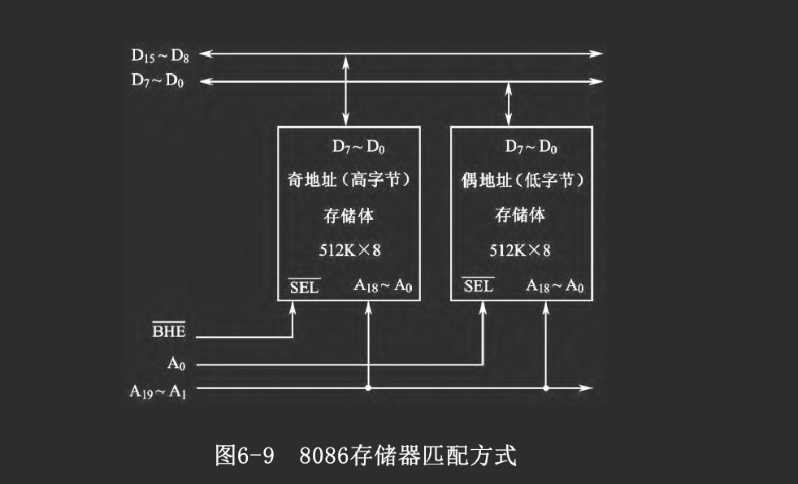

这种匹配方式可推广到数据通路宽度位数更多的系统中，如32位系统。

### 有关主存的控制信号

存储芯片本身只需要最基本的控制命令，如
- 读/写命令
- 行/列选信号

但为了实现对存储器的选择、容 量的扩展、速度匹配，系统总线可能引申出一些控制与应答信号。不同的系统总线有其自身的约定标准

> 树上在此介绍了Pentium CPU与主存储器的组织，掠过

## DRAM的发展

主存储器的基本结构仍是DRAM芯片

- DRAM 访问存储单元时，先送行地址，后送列地址
- FPM DRAM 先送行，后连续送列地址
- EDO DRAM 不必等待当前读写完毕就可启动下一个读写操作，性能比FPM DRAM提高了15％－30％
- SDRAM 与CPU的外频同步。基于双存储体结构，CPU在访问一个的同时，另一个已准备好
- DDR SDRAM 与SDRAM的区别是在时钟脉冲的上升沿和下降沿都可读出数据
- Rambus DRAM 主要解决存储器带宽问题
- RamLink 主要对处理器与存储器的接口进行改革

# 高速缓冲存储器Cache

为了减小CPU与主存之间的速度差异，现代微机中通常在慢速的DRAM和快速的CPU之间插入一个速度较快、容量较小的SRAM，起到缓冲作用，使CPU既能以较快速度存取SRAM中的数据，又不使系统成本上升过高，这就是Cache技术。

## Cache的工作原理

### 介绍

Cache中存放着最近要使用的程序与数据，作为主存中当前最急需执行信息的副本

Cache容量较小(约为数KB到数百KB)，可以选用高速半导体存储器，提高CPU访存速度

有了Cache，系统在工作时
- 总是不断地将与当前指令集相关联的一个不太大的后继指令集从主存读到Cache
- 然后再向CPU高速传送
- 从而达到速度匹配

### 工作原理

Cache的工作原理基于程序和数据访问的局部性，对大量典型程序运行情况的分析结果表明: 
- 在一个较短的时间间隔内，地址往往集中在存储器逻辑地址空间的很小范围里
    - 程序地址的分布本来就是连续的
    - 再加上循环程序段和子程序段要重复执行多次
    - 因此对程序地址的访问就自然地具有相对集中的倾向
- 数据分布的这种集中倾向不如指令明显
    - 但对数组的存储和访问
    - 及对工作单元的选择都可以使存储器地址相对集中    
这种对局部范围的存储器地址频繁访问，而对此范围以外的地址访问很少的现象称为程序访问的局部性

由此可以想到
- 如果把一段时间内在一定地址范围中被频繁访问的信息成批地从主存读到一个能高速存取的小容量存储器中存放起来
- 供程序在这段时间内随时使用
- 从而尽量减少访问速度较慢的主存的次数，可以加快程序的运行速度

这就是Cache的设计思想，即在CPU和主存之间设置一个小容量的高速缓冲存储器Cache

### 拥有Cache后的访存过程

当CPU需要访存时
- 同时将地址送往主存与Cache
- 若所需访问的内容已经在Cache中，则可直接从Cache中快速读取信息，这称为访问Cache命中
- 若访问的内容不在Cache中，即未命中，则从主存中读取信息，并考虑更新Cache，使其成为当前最急需部分

为此需要实现访存地址与Cache物理地址间的映像变换，并采用某种算法进行Cache内容的更新，这将在后面做进一步的介绍

### 命中率

所谓命中率，就是在CPU访问Cache时，所需信息恰好在Cache中的概率
> 目前Cache的访问命中率可达到90%以上

因此只要合理组织三级存储体系，从整体上讲，CPU就能以接近Cache的速度访问存储器，而总存储容量相当于联机外存的总容量

一般来说，Cache的存储容量比主存的容量小得多
- 但不能太小，太小会使命中率太低
- 但也没有必要过大，过大不仅会增加成本，而且当Cache容量超过一定值后，命中率随容量的增加将不会有明显增长

## Cache的组织

### 地址映像

为了把主存中当前最急需执行的信息放到Cache中，必须应用某种函数把主存地址映像到Cache，这称为地址映像

在信息按照这种映像关系装入Cache并执行程序时，应将主存地址变换成Cache地址，这个变换过程称为地址变换

一般将主存与Cache的存储空间划分为若干大小相同的块

1. 直接映像

- 将主存中的块分组，每组包含的块和Cache中的块数一致
- 每组中的每一块只能映像到固定的Cache块中

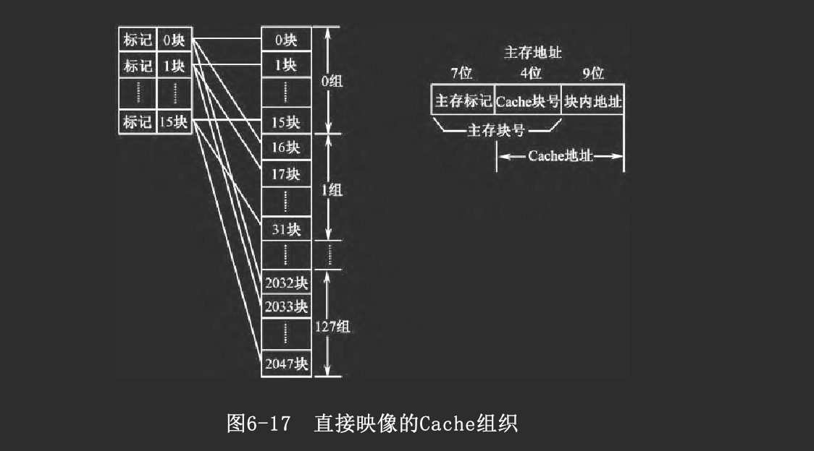

访存时
- 给出20位主存地址，其中
    - 高11位为主存块号
    - 低9位为块内地址
- 为了实现与Cache间的地址映像与变换，将高11位进一步分为两部分
    - 高7位给出主存的组号，称为主存标记，选择第0～127组中的某一组
    - 低4位给出Cache块号，选择组内16块中的某一块
- 于是，20位主存地址中的低13位也就是转换后的Cache地址

在Cache方面
- 为每一块设立一个7位的Cache标记，标志其所对应的组号

因此在访存时
- 只需比较主存地址中高7位的标记段与对应Cache块的7位标记
- 如果两者相同，表明所需访问主存块的内容现在已复制于对应Cache块之中

直接映像方式比较容易实现，但不够灵活，有可能使Cache的存储空间得不到充分利用

2. 全相联映像

主存中每一块可以映像到任一Cache 块中

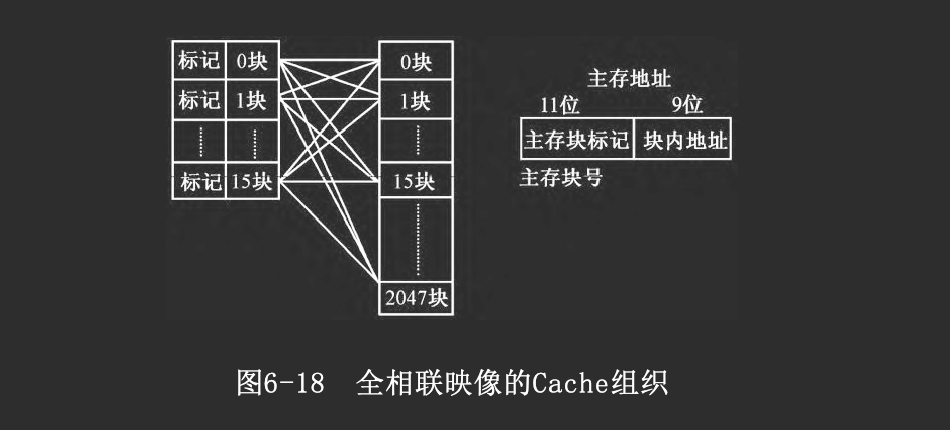

访存时，给出的20位地址分为两部分: 
- 高11位为主存块号
- 低9位为块内地址（与直接映像方式相同）

但Cache中每块的标记为11位，表示它现在所映像的主存块号。

采用全相联映像方式的优点是：映像关系比较灵活，主存的各块可映像到Cache的任一块。但不能直接从主存地址码中提取Cache块号，需将主存块标记与Cache各块的标记***逐个比较***，直到找到标记符合的块为止，或不命中

因此全相联映像方式速度很慢，有失高速缓存的作用，因而不太适用。

3. 组相联映像

<!-- TODO: 还是有点抽象：组相联映像 -->

主存和Cache 都分组,主存每组内块数与Cache 的组数相同，主存中同一组的各块可按顺序映像到对应的Cache组中的任何一块
- 如果Cache只有一组，就是全相联映像方式
- 如果Cache分为16组，每组只有一块，就是直接映像方式

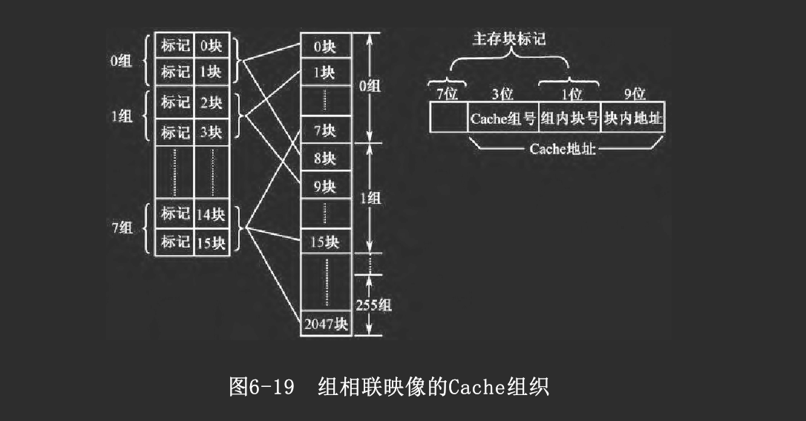

访存时，给出20位主存地址，它分为4部分
- 高7位连同1位Cache组内块号，共8位，称为主存块标记，也就是主存的组号
- Cache组号共3位，可选择8组之一
- 低9位为块内地址  

Cache中每一块设有8位标记，填写所复制的主存块的组号，如果Cache第0块复制了主存第8块（属第1组）内容，则在Cache第0块的标记中写入1。访存时，根据主存地址的中间两段共4位，找到Cache块，并将该块标记与主存地址中的主存块标记进行比较，判断是否是主存块的副本，即访问是否命中。Cache中每组有若干可供选择的块，因而较直接映像方式灵活。每组块数有限，因而代价比全相联映像方式小。

### 替换算法

Cache内容需要随着程序的运行，使用程序目前访问频繁区进行更新

1. 先进先出算法(FIFO)

按块调入Cache的先后次序决定淘汰的顺序，即在需要更新时，将最先调入Cache的块内容予以淘汰

这种方法简单，容易实现，不需要随时记录各个块的使用情况，系统开销少。但这种方法不一定合理，因为有些内容虽然调入较早，但可能仍需使用。

2. 近期最少使用算法(LRU)

为Cache的各个块建立一个调用情况记录表，称为LRU目录。当需要替换时，将在最近一段时间内使用最少的块内容予以淘汰

它按调用频繁程度决定淘汰算法，访问命中率较高，相对合理，因而使用较多

但它较前一种算法复杂，系统开销较大，通常是为每个块设置计数器，以记录该块的使用情况。

### Cache的读/写过程

1. 读

- 一方面将主存地址送往主存，启动主存读
- 同时将主存地址也送往Cache，按所用的映像方式从中提取Cache地址
- 从Cache中读取内容，并将相应的Cache标记与主存地址中的主存块标记进行比较
    - 如果两者相同，访问Cache命中，将读出数据送往访存源，不等主存的读操作结束，就可以继续下一次访存操作
    - 如果标记不符合，表明本次访问Cache失败，则从主存中读出，并考虑 是否需要更新该Cache块内容

这种方法的优点是没有时间延迟，缺点是每次CPU都要访问主存， 这样就占用了部分总线时间。

2. 写

写回法:
- 当需将信息写入主存时，暂时先只写入Cache的有关单元，并用标志注明
- 直到该块内容需从Cache中替换出来时，再一次性地写入主存
- 如果CPU写Cache未命中，则为欲写的主存块在Cache中分配一行，将此块整个复制到Cache后再对其进行修改

优点
- 写操作速度快
- 可以显著地减少写主存的次数
- 使得Cache真正在读/写两方面都在CPU和主存之间起到了高速缓存的作用

缺点
- 但在写回主存之前，主存中的块未经随时修改而可能失效

写直达法

- 每次写入Cache时，也同时写入主存，使主存与Cache相关块内容始终保持一致
- 如果写Cache没有命中，则只能直接向主存写入，随后可采取两种方式
    - 一种是取主存块到Cache，并为它分配一个行位置
    - 另一种方法则不取主存块到Cache

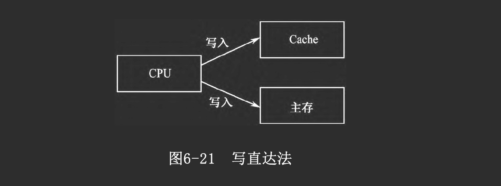

优点
- 比较简单
- 能保持主存与Cache的一致性
- 并且无需为Cache中的每一行设置标志位

缺点
- 插入慢速的访主存操作，影响工作速度
- 并且有可能增加多次不必要的向主存的写操作，降低了Cache的功效

### 多层次Cache存储器

1. 单级与多级Cache

由于集成度的提高，使Cache与处理器置于同一芯片（即片内Cache）成为可能

与通用的外部总线连接的Cache相比
- 当所要的指令或数据能在片内Cache中找到时，就减少了对总线的访问
- 与总线长度相比，处理器内部的数据通路较短，所以存取片内Cache甚至比零等待状态的总线周期还要快
- 而且，在这段时间内，若总线空闲，可用于其他传送

目前大多数的设计包含了片内Cache和外部Cache两种，构成两级Cache，其中
- 第1级Cache(L1)集成在CPU芯片中，它速度更高，但容量较小，一般仅为几十KB
- 第2级Cache(L2)安装在主板上，它可以有较大的容量，从256 KB到2 MB不等
- Pentium ΙΙ以后的CPU将L2Cache与CPU内核一起封装在一只金属盒内，或者直接把L2 Cache也集成到CPU芯片内，以进一步提高速度。这样，主板上的Cache就称为3级Cache（L3 Cache）。

2. 统一和分离Cache 

当片内Cache首次出现时，许多设计采用单个Cache同时存放数据和指令，这也称为统一Cache

后来随着计算机技术的发展和处理速度的加快，存取数据的操作经常会与读取指令的操作发生冲突，从而延迟了指令的读取

近年来，分离Cache通常把Cache分离成两部分
- 一个专用于指令(指令Cache)
- 一个专用于数据(数据Cache)

对于给定的Cache容量，统一Cache比分离Cache有较高的命中率，因为它在获取指令和数据的负载之间自动进行平衡
- 即如果执行方式中取指令比取数据多得多，则Cache就被指令填满
- 如果执行方式中有相对较多的数据要读取，则会出现相反的情况

尽管统一Cache有这些优点，但分离Cache是一种发展趋势，特别适用于如PentiumⅡ和PowerPC的超标量机器，它们强调并行指令执行和预取指令

分离Cache设计的主要优点是取消了Cache在指令预取器和执行单元间的竞争，它在任何基于指令流水线的设计中都是重要的。通常处理器会提前获取指令，并把要执行的指令装入缓冲器或流水线

假设现在有统一指令/数据Cache，当执行单元执行数据存取操作时，这一请求提交给统一Cache。如果同时指令预取器为取指令向Cache发读请求，则后一请求会暂时阻塞。这种对Cache的竞争会降低性能，因为它干扰了指令流水线的有效使用。分离的Cache结构解决了这一问题。

> 书上6.4.3PentiumII CPU的Cache组织，6.5外部存储器，6.6物理存储系统的组织跳过

# 虚拟存储技术

虚拟存储系统建立在主存-辅存层次上，是由附加硬件装置及存储管理软件组成的存储体系
- 使计算机具有接近主存的存取速度
- 并具有辅存的容量和位成本

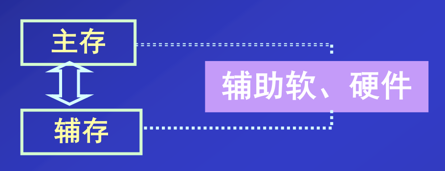

## 概述

1. 术语

在存储管理部件和操作系统存储管理软件的支持下，将主存和辅存的地址空间统一编址，使用户获得一个很大的编程空间，其容量大大超过实际的主存储器。这个在用户界面上看到的存储器，被称为虚拟存储器（Virtual Memory，VM）

从用户界面看，用户可使用位数较长的编程地址进行编程，这种地址面向程序的需要，不必考虑程序将来在主存储器中的实际位置，因而称为逻辑地址。它是面向虚拟存储器的，所以又称为虚地址

在用户看来，CPU可按虚地址访问一个很大的存储器，其容量甚至可达整个辅存容量，显然这是一种虚拟层次

2. 内部操作

在实际的物理存储层次上，所编程序和数据在操作系统管理下
- 先送入磁盘
- 然后操作系统将当前急需运行的部分调入主存，供CPU操作
- 其余暂不运行部分留在磁盘中

随程序执行的需要，操作系统自动地按一定替换算法进行调度
- 将当前暂不运行部分调回磁盘
- 将新的模块由磁盘调入主存

这一层次上的工作，对用户是透明的

CPU执行程序时，需将程序提供的虚地址变换为主存的实际地址（实地址、物理地址）
- 一般是先由存储管理部件判断该地址的内容是否在主存中
    - 若已调入主存，则通过地址变换机制将虚地址转换为实地址，然后访问主存单元
    - 若尚未调入主存，则通过缺页中断程序，以页为单位调入或实现主存内容调换

3. 虚拟存储器和Cache的比较

从原理上看，虚拟存储器与Cache-主存层次有很多相似之处，如地址映像方式和替换策略。

但是
- Cache-主存层次的控制完全由硬件实现
    - 它对各类程序员都是透明的
- 而虚拟存储器的控制是由硬件与软件结合实现
    - 对应用程序员来说是透明的
    - 但对于设计存储器管理软件的系统程序员来说是不透明的。

## 虚拟存储器的组织方式

### 页式虚拟存储器

1. 分页

将虚存空间与主存空间都划分为若干大小相同的页，每页大小固定
- 虚存的页称为虚页
- 主存（实存）的页称为实页

这种划分是面向存储器物理结构的，因而有利于主存与辅存之间的调度管理。

用户编程时，将程序的逻辑空间分为若干虚页。相应地，虚地址包含两部分
- 高位段是虚页号
- 低位段是页内地址

2. 页表机制

在主存中建立一种页表，提供虚实地址变换依据，并登记一些有关页面的控制信息。若计算机采用多道程序工作方式，则可为每个用户程序建立一个页表，硬件中设置一个页表基址寄存器，存放当前所运行程序的页表的起始地址。

表6-3给出了一种页表示例，每一行记录了与某个虚页对应的若干信息
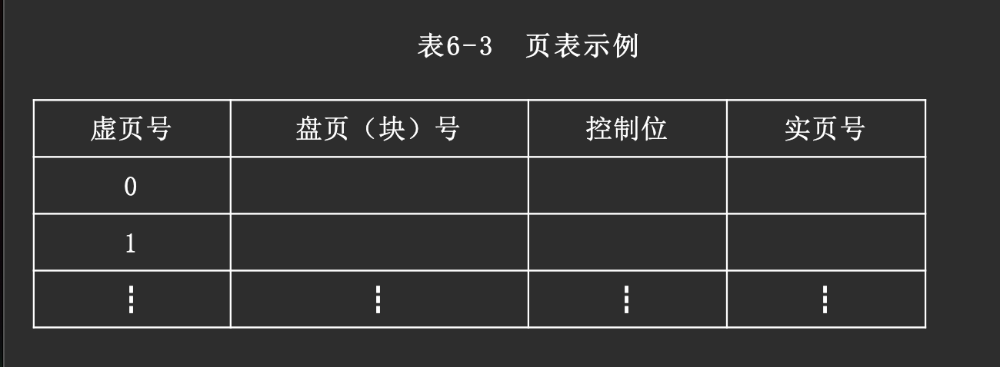
- 虚页号在编程时由虚地址给出
- 盘页(块)号是该页在磁盘中的起始地址，即该虚页在磁盘中的位置
- 控制位一般包含
    - 装入位（有效位），为1表示该虚页已调入主存
    - 修改位，指出对应的主存页是否被修改过
    - 替换控制位，为1表示对应的主存页需要替换
    - 读/写保护位，指明该页的读/写允许权限
    - 实页号，如果该虚页在主存中，则该项登记对应的主存页号。

3. 地址转换过程

访问页式虚拟存储器的虚实地址转换过程，如图6-34所示。当CPU根据虚地址访存时
- 首先将虚页号与页表起始地址合成，形成访问页表对应行的地址
- 根据页表该行内容判断该虚页是否在主存中
- 若已调入主存
    - 可从页表中读得对应的实页号
    - 再将实页号与虚地址中的页内地址合成，得到对应的主存实地址
    - 据此可以访问实际的主存单元。
- 若该虚页尚未调入主存
    - 则产生缺页中断，以中断方式将所需页内容调入主存
    - 如果主存空间已满，则需执行替换算法(FIFO、LRU)，将可淘汰的主存页内容调出，写入磁盘
    - 再将所需页从磁盘调入主存。
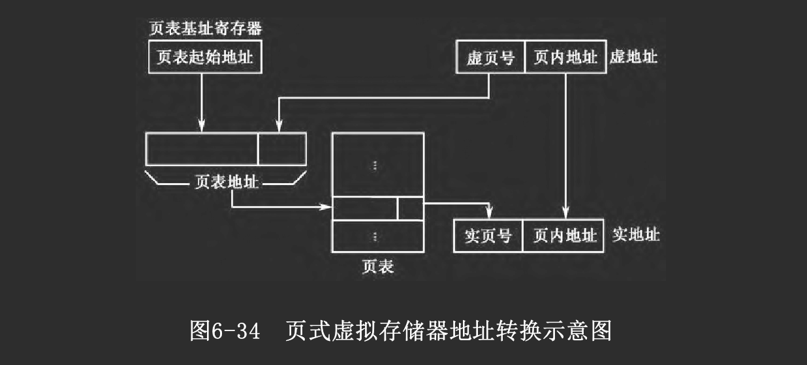

4. 快、慢页表

当CPU按虚地址访存时，首先访问存放于主存之中的页表，以进行虚实地址转换，这就增加了访问主存的次数，降低了有效工作速度

为了将访问页表的时间降低到最低限度，许多计算机将页表分为快表与慢表两种。将当前最常用的页表信息存放在快表中，作为慢表局部内容的副本

快表很小，存储在一个快速小容量存储器中，该存储器是一种按内容查找的联想存储器，可按虚页号名字并行查询，迅速找到对应的实页号

如果计算机采用多道程序工作方式，则慢表可有多个，但全机只有一个快表

采用快、慢表结构后，访问页表的过程与Cache工作原理很相似，即根据虚页号同时访问快表与慢表，若该页号在快表中，就能迅速找到实页号并形成实地址

### 段式虚拟存储器

1. 分段

将用户程序按其逻辑结构（如模块）划分为若干段，各段大小可变
- 段式虚拟存储器也随程序的需要动态地分段，并将各段的起始地址与段的长度写入段表中
- 编程使用的虚地址包含两部分
    - 高位是段号
    - 低位是段内地址

2. 段表

表6-4给出了一种段表示例，其中包含

- 段号
- 装入位，为1表示该段已调入主存
- 段起点，如该段已在主存中，则该项登记其在主存中的起始地址
- 段长（与页不同，段长可变）
- 其他控制位，如读、写、执行权限等

3. 访存过程

段式虚拟存储器的虚实地址变换与页式虚拟存储器相似，CPU根据虚地址访存时
- 首先将段号与段表本身的地址合成，形成访问段表对应行的地址
- 根据段表内装入位判断该段是否已调入主存
- 若已调入主存
    - 从段表读出该段在主存中的起始地址，与段内的地址相加，得到对应的主存实地址。

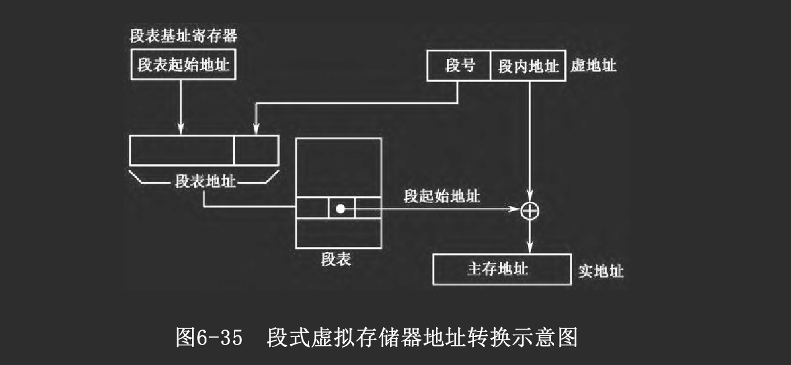

### 段页式虚拟存储器

如前所述

页式虚拟存储器采取面向存储器本身物理结构分页的策略，有利于存储空间的利用与调度，存储空间的零头小于一个页面。但是页的大小固定，这种划分不能反映程序的逻辑结构，这给程序的执行、保护与共享带来不便

段式虚拟存储器则是面向用户程序逻辑结构，以段为单位进行调度、传送、定位，这有利于对程序的编译处理、执行、共享与保护。但段的大小可变，不利于存储空间的管理与调度，它比页式虚拟存储器复杂；存储空间的零头可能较大，存储空间利用率低

为了综合页式虚拟存储器与段式虚拟存储器两种方式的优点，许多计算机采用段页式虚拟存储器。它
- 将程序按其逻辑结构分段，每段再分为若干大小相同的页
- 主存空间也划分为若干同样大小的页。相应地
    - 建立段表与页表
    - 分两级查表实现虚实地址转换
- 以页为单位调进或调出主存，按段共享与保护程序和数据

若计算机采用单道程序工作方式，则虚地址包含3部分：
- 段号
- 段内页号
- 页内地址

若计算机采用多道程序工作方式，则虚地址包含4部分：
- 基号
- 段号
- 段内页号
- 页内地址

如图6-36所示，每道程序有自己的段表，这些段表的起始地址存放在段表基址寄存器组中。相应地，虚地址中有
- 各用户程序的基号，又称为用户标志号，根据它选取相应的段表基址寄存器，从中获得自己的段表起始地址
- 将段表起始地址与虚地址中的段号合成，得到访问段表对应行的地址
- 从段表中取出该段的页表起始地址，与段内页号合成，形成访问页表对应行的地址
- 从页表中取出实页号，与页内地址拼装，形成访问主存单元的实地址。

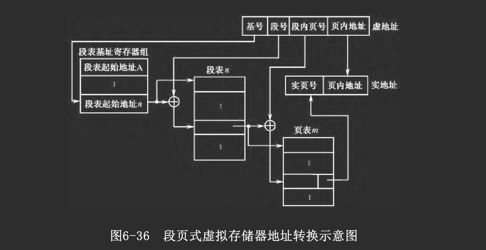

段页式虚拟存储器兼有页式与段式的优点，但要经两级查表才能完成地址转换，费时较多。

> 掠过6.7.3 Pentium CPU支持的虚拟存储器

