第七章、IO系统

[toc]

# 概述

如前所述，我们可将计算机系统划分为
- CPU子系统
- 存储子系统
- 输入/输出子系统（简称I/O系统）三大部分

其中输入/输出子系统的输入/输出就是外部设备与CPU或主存系统之间信息交换的过程

为了实现数据的传输，通常的做法：
- 以总线作为传送信息的枢纽
- 并在主机与I/O设备之间设置输入/输出接口(简称I/O接口)

本章将着重讨论I/O接口的几种控制方式：
- 直接程序控制方式
- 中断方式及DMA方式  
还包括它们的基本结构、工作过程和程序设计方法等内容

在这一章中，我们还要讨论I/O接口与主机的连接方式，重点介绍最常用的方式，即总线连接方式，包括
- 总线的组成
- 控制和操作方式

最后，将简介几种最常用的I/O设备：键盘、鼠标器、打印机和液晶显示器，并以键盘为例阐述其驱动程序的设计。

## 主机与外围设备间的连接方式

1. 总线连接方式

总线连接方式：CPU通过系统总线与存储器和各种I/O设备相连

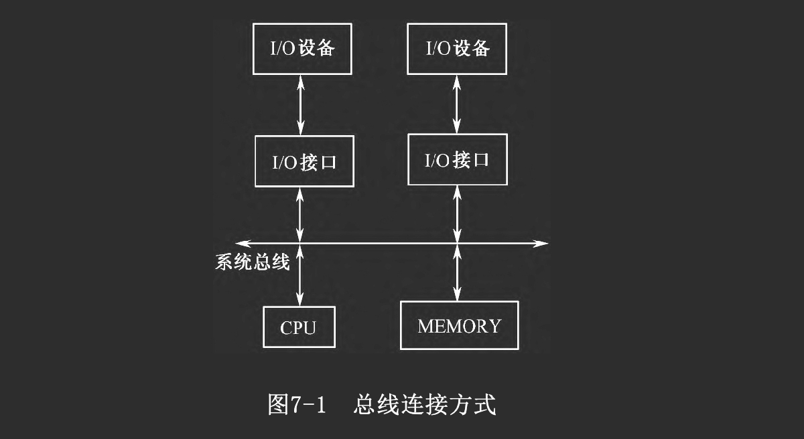

系统总线一半包括三组：
- 地址总线
- 数据总线
- 控制总线，控制总线上的控制信号一般包括
    - 同步时序信号或应答信号
    - 数据传送控制信号（如地址有效、读写控制、M/IO选择）
    - 中断请求及批准信号
    - DMA请求及批准信号等。

2. 双总线连接方式

为了提高信息传送率，有些系统中设置多组总线: 
- 其中一条高速的局部总线用来连接存储器和高速I/O设备
- 另一条常规系统总线用来连接相对较慢的I/O设备  
目前微机中的PCI总线体系与此类似。

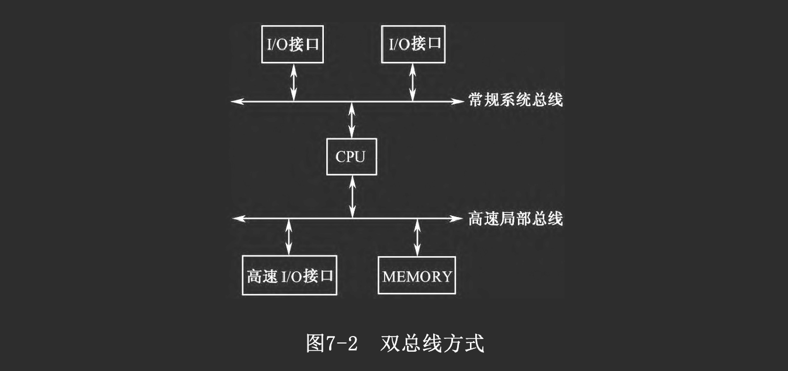

3. 局部总线连接方式

还有些系统
- 除了有功能完善的系统总线与局部总线之外
- 还提供多条局部I/O总线。这种局部I/O总线一般是专用的，信号比较简单。

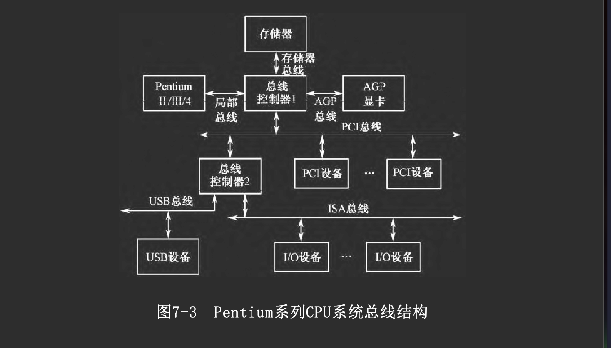

总线连接方式具有结构简单、标准化、易于扩展等优点，对传输速度的限制则可通过增设局部总线或设置多组总线方法来解决。

## I/O接口的功能与分类

从广义上讲，接口是指两个相对独立子系统之间的相连部分，本章主要讨论主机与I/O设备之间的硬件接口，即I/O接口。

1. I/O接口的定义

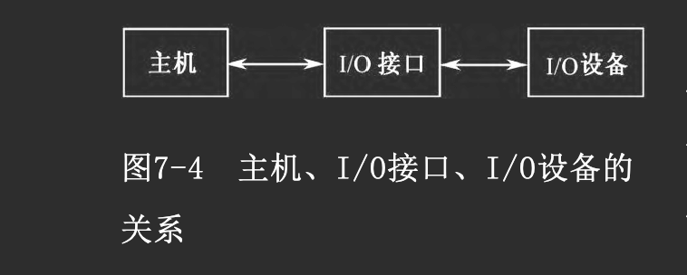

由于主机与各种I/O设备的相对独立性（即CPU和各种I/O设备在信息格式、信号电平、工作速度、时序上的差异），它们一般是无法直接相连的，而必须经过一个“转换”机构---I/O接口电路，简称I/O接口

在具体的机器中，常将I/O接口设计成独立的电路板插入主机，一般称为I/O接口卡或I/O适配卡

一般而言，我们把直接针对设备具体工作过程进行控制的那部分功能电路，称为该设备的“设备控制器”

2. I/O接口的功能

I/O接口并非仅仅完成物理上的连接，一般讲它应具有下述主要功能：

- 寻址功能
    一台计算机系统中包含多台I/O设备，相应地就有不止一个I/O 接口
    I/O接口电路通过地址译码产生的片选信号实现主机访问不同I/O接口
    一个包含多个寄存器的I/O接口需要占用多个地址码

- 输入/输出功能
    即在主机与I/O设备间交换数据、控制命令及状态信息等

- 支持主机采取程序查询、中断、DMA等访问方式
    一个I/O接口往往具有多种访问方式

- 提供主机和I/O设备所需的缓冲、暂存和驱动能力，满足一定的负载要求和时序要求

    为了协调主机和I/O设备间的信息交换，接口往往需要进行缓存、暂存，并满足各自的时序要求
    I/O接口的一侧通常与系统总线相连接，由于总线上连有许多的电路，且有一定传输距离，从而要求接口必须能提供足够的驱动能力，并且接口自身的负荷也应限制在一定的水平上。在I/O设备方面也有类似的要求。

- 进行数据类型、格式等方面的转换

    由于外设支持的数据格式与主机CPU的并行数据格式往往不同，I/O接口应
    - 具有把CPU输出的并行数据转换成所接外设可接收的格式 
    - 把从外设输入的数据信息转换成CPU可以接收的并行数据

- 联络功能
    I/O接口和CPU，或者I/O接口和外设完成一次数据传送后
    - 接口应以适当的信号（如就绪信号）的方式通知CPU或外设
    - 以准备进行下一次传送

- 复位功能
    接口应能接收复位信号，使接口本身以及所连的外设进行重新启动

- 可编程功能
    为了实现对接口的灵活控制，需要用软件来对接口进行设置和控制，所以一个接口应该具有可编程功能。

- 错误检测功能

    在接口设计中，常常要考虑对错误的检测问题，需要对两类错误进行检测
    - 一类是传输错误
        - 这是由于接口和设备之间的连线受噪声干扰而引起的
        - 接口对传输错误大都采用奇/偶校验或冗余校验来进行检测

    - 另一类是覆盖错误
        - 这是由于在输入时
        - 接口的输入缓冲寄存器中的数据在没有被CPU取走前，由于某种原因又被装上了新的数据
        - 或者在输出时，输出缓冲寄存器中的数据在被外设取走以前又被CPU写入了一个新数据，则原来的数据就被覆盖了
        - 对覆盖错误，接口采用设置相应的状态寄存器标志位来标记。

3. I/O接口的类型

- 按数据传送的格式可分为串行接口和并行接口

    - 并行接口
        - 主机与I/O接口、接口与I/O设备间均以并行方式传送数据
        - 适宜于传输距离较近、传输速度较高的场合，其接口电路相对简单
    - 串行接口: 
        - 接口与I/O设备间采用串行方式传送数据，而串行接口与主机间的数据传送一般仍为并行方式
        - 适于传输距离较远、速度相对较低的场合，其传输线路成本较低，而接口电路较前者复杂

   
- 按主机访问I/O设备的控制方式，可分为
    - 程序查询接口: CPU通过程序来查询接口的状态寄存器，并执行相应动作
    - 中断接口: 接口向主机提出中断请求，主机响应后执行中断处理程序
    - DMA接口: 接口与主存间采用DMA方式进行数据交换，比一般的接口更为复杂，可为CPU分担管理I/O功能
    - 通道控制器: 通过执行通道程序控制I/O操作的控制器
    - I/O处理机: 通道的进一步发展  
    事实上，一个实际的接口往往具有多种控制方式

- 按时序控制方式可分为
    - 同步接口: 与同步总线相连的接口，其信息传送由统一的时序信号同步控制
    - 异步接口: 与异步总线相连的接口，其信息传送采用异步应答方式控制

还需指出一点，一个完整的I/O接口不仅
- 包括一些硬件电路
- 还可能包括相关的软件驱动程序模块。这些软件模块
    - 有的放在接口上的ROM中
    - 有的放在主机系统板上的ROM中
    - 也有的放在磁盘上  
    当需要时才装入内存

> 在微机系统中的ROM中，这些软件称为基本输入/输出系统（BIOS）

## 接口的编址和I/O指令

### I/O接口编织

1. 与存储器统一编址

将I/O接口中寄存器级部件看作存储器单元，与主存储器单元统一编址，给接口中各寄存器分配一些总线地址。这样，对I/O接口的访问就如同对主存单元的访问一样

这种编址方法的优点是
- 操作方式灵活
- 不一定使用专门的I/O指令，使用通用的MOV指令或访存指令也可访问I/O接口

其缺点是需占用小部分存储地址

2. I/O端口单独编织

设置单独的I/O地址空间，为I/O接口中的寄存器级部件分配I/O端口地址，使用专门的I/O指令去访问

一般来说，I/O地址线与存储器地址线公用，即分时共享地址总线，并设置专门的信号线来区分当前是存储器访问周期还是I/O访问周期
- 如果是存储器访问周期，则地址总线送出存储器地址
- 如果是I/O访问周期，则地址总线（通常是低位段）送出I/O端口地址

采用I/O端口单独编址方式的优点是不占用存储地址；缺点是需使用专门的I/O指令，其寻址方式较简单，所以编程灵活性稍差。

### I/O命令

不同的CPU，其I/O指令的格式与功能差异较大，主要体现在寻址方式方面

Intel 80x86 CPU采用I/O端口单独寻址方式寻址外设，其中所用到的专用指令只有两个：IN和OUT。这两个指令的
- 目标寄存器（对IN指令）和源寄存器（对OUT指令）必须是AL（8位端口）、AX（16位端口）或EAX（32位端口）
- 对端口地址在8位以下（即端口地址<FFH）的，可以使用直接寻址方式寻址外设
- 对端口地址是16位的，要用DX进行间接寻址，16位端口地址方式下可寻址216=64K个端口地址。

### 通道指令

前面所说的I/O指令是CPU用来直接访问I/O端口的，而在具有通道的计算机系统中，用于I/O方面的指令格式一般包括
- 操作码
- 数据传输内存地址
- 特征位
- 计数器

它包括两个层次：
1. 供主CPU执行的I/O指令

用来访问通道。一般有
- 通道启动
- 通道道查询
- 以及其他一些对通道进行特定操作的控制命令

2. 供通道执行的通道指令 

用来编写通道程序，在主CPU启动指令通道后，由通道执行通道程序执行以实现I/O操作。在通道指令中，除了
- 与CPU的I/O指令类似的输入、输出指令外
- 还包括一些与设备特性有关的控制命令    
与CPU指令相比，通道指令格式简单，功能专一，有很强的面向I/O设备的特征

### IOP指令

IOP
- 在硬、软两方面都非常接近于普通的CPU
- 但它是专用于I/O控制的处理器，因而在硬、软两方面增加了许多面向I/O的功能
- 与通道相比，它的功能更强、更通用，一般不在指令级直接反映I/O设备的特征

采用IOP后，有关I/O指令也分成两级：
- CPU执行与IOP联络的I/O指令
- IOP执行自身的IOP指令，具体控制I/O操作

# 直接程序控制方式

直接程序控制方式的主要特点是：
- CPU直接通过I/O指令对I/O接口进行访问
- 主机与外设交换信息的每一过程均在程序中表示出来

## 立即程序传送方式

I/O接口
- 总是准备好接收主机输出数据
- 或总是准备好输入主机的数据

因而CPU无需询问接口的状态，就可以直接利用I/O指令访问相应的I/O端口，输入或输出数据

这种方式的局限性很大，它只有在无需了解外设的实时状态时才能有效地工作

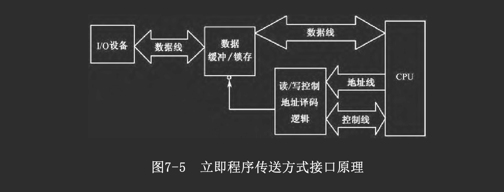

## 程序查询方式

许多外设的工作状态是很难事先预知的，这就要求CPU在程序中进行查询
- 如果接口尚未准备好，CPU就等待
- 如果已做好准备，CPU才能执行I/O指令  
这就是程序查询方式

首先
- 在I/O接口中要设置状态位以表示外设的工作状态，可由CPU用输入指令读取
    - 有些设备的状态信息较多，可组成一个或多个状态字，占用一个或多个I/O端口地址

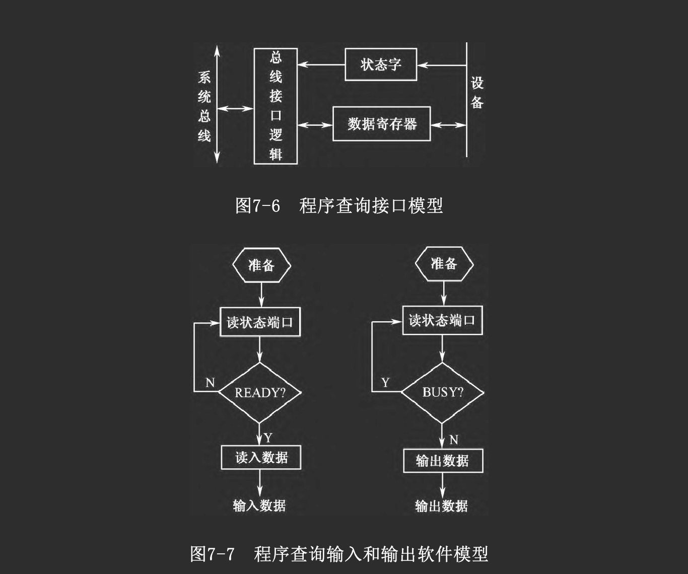

在相应的I/O程序中必须进行下列3步操作：
- 读取外设状态信息
- 判断是否可进行新的操作
    - 如果设备尚未准备好，则返回第1步
    - 若已准备好，就进行下一步。
- 执行所需的I/O操作

# 程序中断方式

在程序查询方式中，CPU的利用率不高，这是因为CPU会对外设执行大量无效的查询，长期处于等待状态

为此，在现代计算机系统中广泛采用了中断控制方式

## 基本概念

### 中断方式及其应用

在接到随机请求后
- CPU响应该申请，暂停执行原来的程序
    - 保存程序的当前位置（断点）
    - 保存被中断程序的寄存器内容
- 转去执行中断处理程序，为响应的随机事件服务
- 处理完毕后CPU恢复原程序的继续执行  
    - 先恢复被保存的主程序的寄存器内容
    - 然后回到主程序的中断处
    - 继续执行原程序
这种控制方式称为“程序中断控制方式”，简称为中断

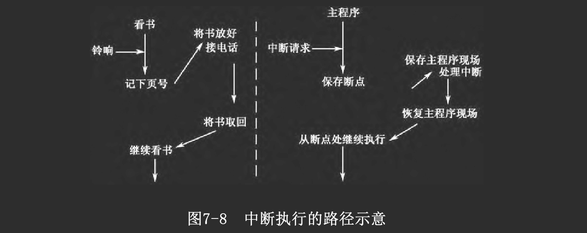

中断有两个重要的特征：
- 程序切换（控制权的转移）
- 随机性（所谓随机性是相对于具体发生时刻而言的）

中断过程的程序转移类似于子程序调用，但它们在实质上存在重大区别
- 子程序调用是由主程序安排在特定位置上的，通常是完成主程序要求的功能
- 而中断发生在随机的时刻，可以从主程序的任一位置进行程序切换，而且中断处理程序的功能往往与被打断的主程序没有直接关联

中断方式不仅用于I/O设备的管理控制，还广泛地应用于各种带随机性质的事件处理上

### 中断源

引起中断的原因或来源称为中断源
- 内部中断(源): 中断原因来自CPU内部
    - 软中断: 一类较特殊的内部中断源
    > 例如：除法出错、溢出，单步中断标志位，中断指令(INT n)等
- 外部中断(源): 中断原因赖在CPU外部  

1. 非屏蔽中断和可屏蔽中断

在CPU内部往往有一个“中断允许标志位”IF，相应地将中断源分为两类：
- 非屏蔽中断: 不受IF控制 ，只要有非屏蔽中断产生，CPU可立即响应
- 可屏蔽中断: 中断源受IF控制 
    - IF=1，开中断状态，即CPU允许中断，若有可屏蔽中断产生，则CPU能够响应
    - IF=0，关中断状态，对于可屏蔽中断请求CPU不响应
    > 对IF的设置分为显式（使用专门的开/关中断命令）和隐式设置两种方式

中断屏蔽保证CPU在执行一些重要程序段时不被打断，该特性称为操作的“原子性”，在执行操作系统的原语时就要求如此

### 中断向量

一个系统往往具有多个中断源，每个中断源所需的中断处理程序各不相同，它们在主存中的位置也不一定连续，该存储位置称为中断处理程序的入口地址

中断处理程序入口地址称为中断向量

1. 查询法

CPU响应中断后
- 转向某个固定的入口地址，执行公共服务程序（查询程序）
- 依次查询各个中断源的中断请求标志“IRF”
- 若遇到某个中断源的IRF=1，就转入该中断源的处理程序入口

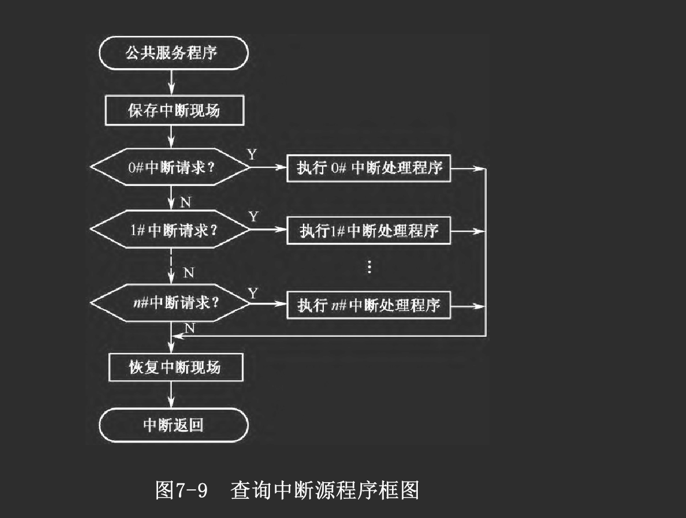

软件查询法
- 只需在中断接口中设置IRF标志，硬件要求最低
- 实现最简单，易于动态改变各中断源的优先级（即改变查询顺序）
- 但在执行查询程序时，如果中断源优先级低则响应速度较慢

因此这种方法
- 适用于低速、中断源较少的场合
- 或作为一种辅助手段

软件查询法又称为非向量中断法。

2. 单独请求线编码法

每个中断源有自己的中断请求信号线，在CPU内采用某种优先编码逻辑形成它们各自的入口地址

这种方法
- 响应速度快
- 但连线多，硬件代价高
- 而且不易于扩展

仅适于中断源极少且固定的场合，如某些单片机中的集成I/O口中断请求。

3. 向量中断法

中断源
- 通过有关控制逻辑给出一个相应的向量码
- CPU据此通过一系列变换得到中断处理程序的入口地址，无需软件查询

早期的一些简单系统中，采用一级向量方式，即直接由中断源产生中断向量，但由于缺乏灵活性，对中断源的向量产生机构要求较高，现已较少采用

现在常用的是二级向量或多级向量方式
- 中断源向CPU提供一个中断类型码，可视为第一级向量编码
- 其中内中断占用固定的类型码
- 还有一部分是留待系统扩展时用的保留部分
- 其余是用户可自由使用的类型码

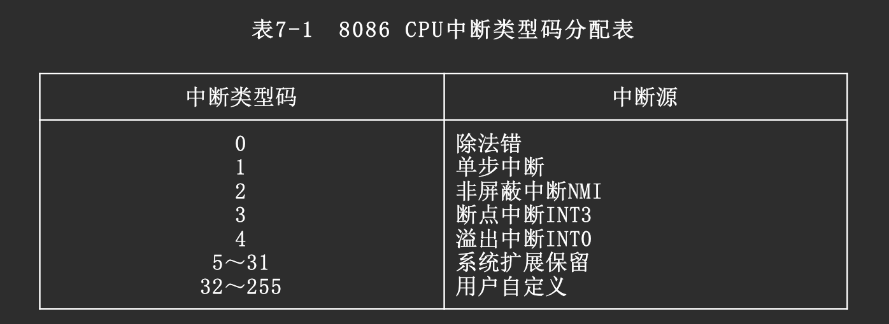

将各个中断处理程序的入口地址组织成一个中断向量表
- 存放在地址0～3FFH区间
- 每个中断源的处理程序入口地址在向量表中占4字节单元
    - 其中2字节为偏移量IP
    - 2字节为段基值CS
- 设中断源提供的类型码为N ，则入口地址为
$$IP = (4N,4N+1),CS = (4N+2,4N+3)$$

> 在实际系统中，常将几种方法综合使用，此时称为综合法

## 中断的过程

中断的过程一般可划分为几个阶段
- 中断请求
- 中断排优
- 中断响应
- 中断处理
- 中断返回

现以8086 CPU的向量中断为例介绍中断的过程

1. 中断请求

如前所述，各种中断源提出中断请求的原因各不相同。有些是完全随机产生的；有些是程序有意安排的，它们通过各自的路径送往CPU，而内中断请求则通过内部逻辑电路提出。

2. 中断排忧

如果有几个请求同时提出，优先排队的一般原则是：
- 由故障引起的中断优先于由I/O操作需要引起的中断
- 非屏蔽中断优先于可屏蔽中断
- 高速事件中断优先于低速事件中断
- 输入信息所需的中断优先于输出信息所需的中断

排优逻辑的实现方法将在后面介绍

3. 中断响应

- CPU每执行完一条指令后，通过有关控制逻辑判别是否有中断请求

- 进入中断响应周期
    - 如果有中断请求，而CPU刚执行的不是停机指令，且无优先级更高的DMA请求
    - 则CPU在执行完一条指令后可以响应中断请求
    - 于是CPU进入一个过渡周期(位于原程序与中断处理程序之间)，称为“中断响应周期”，简称INTA周期
    - 除INTR以外的其他中断请求均属于非屏蔽中断，一旦它们提出中断请求，CPU将立即响应并得到其类型码
    - 如果在INTR线上发生请求，CPU首先要根据其内部的“中断允许位”IF状态，判别是否响应
    - 若IF=1，则响应中断请求
        - 一方面进入INTA周期
        - 另一方面向外发出应答信号INTA
        - 外部的中断控制器收到该信号后，将发出请求的中断源的类型码送到CPU数据总线上
        - CPU在撤销INTA信号前取走中断类型码
    - CPU在响应周期中由硬件自动完成以下操作
        - 首先是保护断点，将代码段寄存器CS和指令指针IP的内容依次压入堆栈，此外还将标志位寄存器FLAG内容压栈
        - 中断允许标志清零，即IF=0（又称为关中断）
        - 单步中断标志TF清零，即TF=0
        - 然后CPU通过中断类型码在中断向量表中获得向量地址，读出中断服务程序入口地址，分别送入CS和IP寄存器
        - 转入取指周期，CPU开始执行中断处理程序。

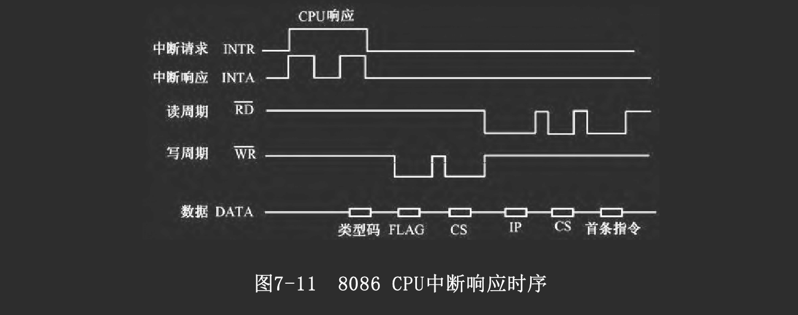

4. 中断处理

中断处理程序一般采用三段式结构：
- 开头是保护现场: 将中断处理程序需要使用的CPU寄存器内容压栈保存
- 中间是实质性中断处理: 功能因中断源的不同而不同
- 结尾是恢复现场

5. 中断返回

在返回主程序前需要先恢复现场，即
- 将保存现场时压入堆栈的寄存器内容从堆栈中弹出，送回原寄存器
- 然后使用中断返回指令IRET，以恢复断点，返回被中断的主程序，继续执行

在8086 CPU中，IRET完成下列功能
- IP出栈
- CS出栈
- FLAG出栈
> 其弹出顺序正好与中断响应时压栈的顺序相反，即先进后出

与普通RET指令相比，它仅仅多了一个FLAG出栈操作

软中断形式实现的系统调用中
- 常利用FLAG寄存器中的某些位来返回状态信息
- 这可以通过修改堆栈中FLAG内容来实现，也可采用其他手段
- 不采用IRET指令返回

注意，此时软中断调用已失去一般中断“随机插入”的意义，仅相当于普通子程序调用，只是借用了软中断这一形式而已

借用软中断形式实现功能调用，其优点是形式简单，不必知道程序的入口地址，因而当具体功能子程序发生变动后，主程序无需修改

如果采用非向量中断形式，如查询式中断系统，中断响应和处理过程与向量中断方式稍有不同。在响应过程中，没有进行读取中断类型码以及查向量表这些操作，而是软件查询中断源，以得到具体处理程序的入口地址。

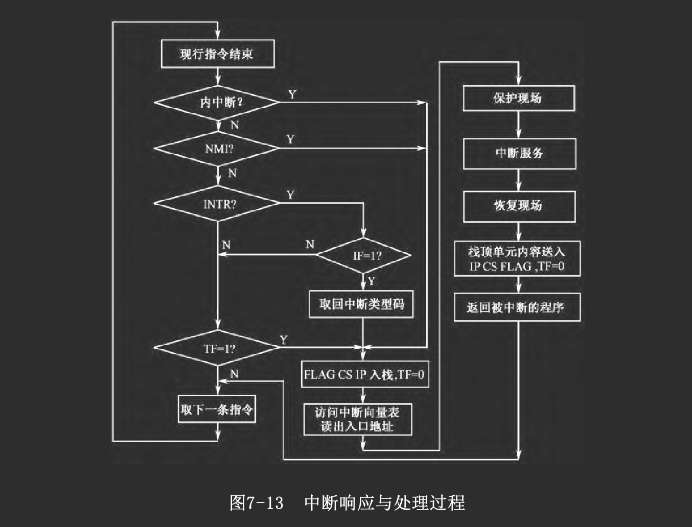

## 中断接口模型

中断接口
- 一侧面向通用而标准化的系统总线
- 另一侧面向各具特色的I/O设备

1. 查询式中断接口模型

将程序查询接口模型的“状态字”中的状态位信号通过驱动器接到公共的中断请求线INT上即可

当CPU响应中断请求时，可通过软件逐个查询接口的状态位，以确定中断源。

3. 向量式中断接口模型

当设备需要提出中断请求时
- 其状态信息经过一定的逻辑综合，形成中断请求信号INTRQ
- 该信号经过中断控制逻辑送入公共请求线INTR  
CPU响应中断请求后
- 发出中断应答信号INTA给中断控制逻辑
- 然后，中断控制逻辑向量寄存器VR的内容通过缓冲器送入CPU数据总线
- CPU据此访问中断向量表，读出中断处理程序入口地址
- 从而转向中断服务

向量寄存器VR的内容可以是
- 中断向量
- 或是其他向量编码，如中断类型码

这些内容可由主程序在进行中断接口初始化时写入。在某些早期的系统中，VR内容则由硬件逻辑产生，且固定不变。

## 中断请求优先级

中断控制逻辑中一般采用优先排队逻辑

### 并行优先级排队

中断请求信号并行输入

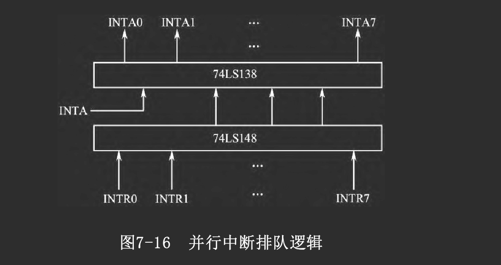

- 当INTRi = 1时
- 不论INTR(i+1)～INTR(i+n)为何值，74LS148的输出为i ，即按优先级高的决定输出值
- 当INTA=1时，74LS138被选通，输出INTAi=0，以此打开对应的向量寄存器VRi

并行优先排队的
- 优点是响应速度很快，能满足高速CPU要求
- 但扩展性稍差，在设计时须先考虑到最大的中断请求数目。

### 串行优先级排队

1. 介绍

下图优先顺序为0→n 
- 第0级的排队输入信号INTI固定为1
- 当INTR0=1时，0号门输出为0
    - 一方面依次传递到CPU，使$\overline{INTR}$=0，向CPU提出中断请求
    - 同时还依次封锁所有各级
- 当CPU发出应答信号INTA时
    - 仅有优先级最高的输出$\overline{INTA0}=0$，输出有效
    - 而其他低级别即使也有INTRi请求，但应答信号INTAi 将被封锁而不能发出
- 若INTR0～INTR（i −1）无请求而INTRi 有请求
- 则CPU发出应答信号INTA时，INTAi 有效
- 比第i 级优先的各级，因未请求而INTR0～INTR（i −1）无效
- 比第i 级优先级低的各级，因排队链上相应的门被封锁，所以INTA（i +1）～INTAn 无效。

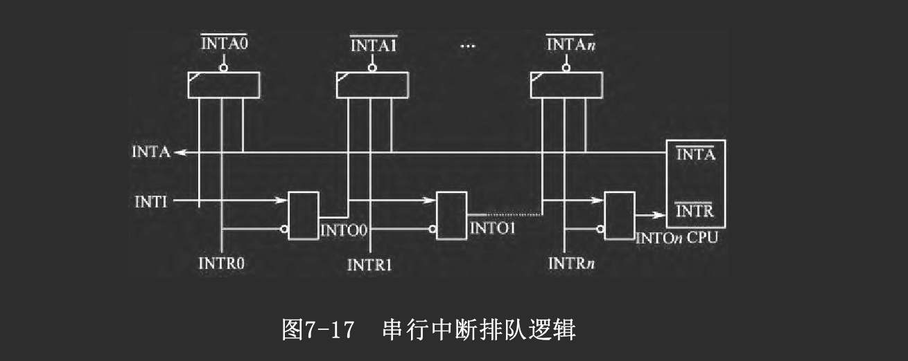

2. 评价

串行排队的优点是
- 信号简单，易于扩展，因各级逻辑一致
- 前级门的输出INTOi 就是后级门的输入INTI（i +1），可方便连接

这种方式的缺点是
- 当连接的级数很多时，由于时延增大使响应速度变慢

串行排优和并行排优是优先级排队逻辑中的两种基本模式。当中断源数目很多时，也可以分组处理，如构成“组内并行、组间串行”、“组内并行、组间并行”等排队逻辑。

### 多重中断

有时在同一时间会产生多个中断请求，有时正在处理一个中断时又发生了另一个中断请求

如果在中断处理程序中允许再响应其他中断请求，就会出现多重中断嵌套

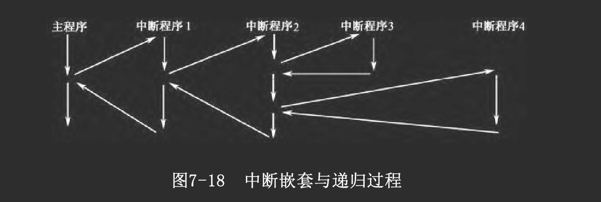

一般来说，当正在进行某个中断处理时
- 与它同级或比它优先级低的中断请求不能被响应
- 而比它优先级高的中断请求才可能被响应

为实现中断嵌套，在中断处理程序中可以这样安排
- 保护现场后，先做一些紧迫事件处理，如将接口中的数据取回主机
- 然后开中断（使IF=1），允许响应其他中断
- 若有其他优先级更高的请求发生，则保存原中断处理程序的断点和现场，转去处理新的请求
- 若无其他优先级更高的请求，则继续执行处理程序，最后恢复现场、返回

在许多中断系统中，都为每个中断请求设置了一个屏蔽字。在允许多重中断的方式中
- 每当响应中断请求时，就在处理程序中先保存原屏蔽字，送出新的屏蔽字
- 将与该请求同级的及优先级更低的请求屏蔽掉，并在中断处理程序结束时恢复原屏蔽字

这样，在多重中断嵌套中，嵌入的只能是优先级更高的中断。还可由软件修改屏蔽字，暂时屏蔽某些请求，以便可以动态地修改各中断源的优先级

总之，在中断优先顺序的控制上，有多种方法可用，也常采取软硬结合的策略

# DMA方式

如前所述，中断方式
- 能提高CPU利用率，可处理随机性事件与实时性任务
- 但一次中断处理过程一般只能传送一个字符
    - 且需要经历保存现场、处理、恢复现场等阶段
    - 并需要执行若干条指令才能处理一次中断事件
 
所以对于高速的批量数据传输，程序中断方式就很难满足要求，又引入了“直接存储器传送”控制方式，简称DMA方式。

## 概念

DMA方式是为在主存储器与I/O设备间进行高速批量数据交换而设置的

它的基本思想是
- 通过硬件控制实现主存与I/O设备间的直接数据传送
- 在传送过程中无需CPU程序干预

由于每次DMA传送的工作很简单，如从主存中读取一个字送到I/O口，或从I/O口读一个字送入主存，所以一次DMA传送过程是很快的，一般只占一个存储器读写周期。因此DMA方式适合于高速数据传送

但是DMA方式主要是直接依靠硬件实现数据传送，它不执行程序，不能处理较复杂的事件。因此DMA方式并不能完全取代中断方式，如果某种事件处理已不只是单纯的数据传送时，还必须采用中断方式

事实上，在以DMA方式传送一批数据后，往往采用中断方式通知CPU进行结束处理

在不同的计算机系统中，DMA功能可能有所不同。最简单的系统仅能实现I/O口与主存之间的数据传送。较复杂的还可以实现I/O与I/O之间、主存单元与主存单元之间的数据传送，有的还能在传送时附加简单运算，如加1、减1、移位等

典型的DMA方式是由DMA控制器进行控制的。在DMA控制电路中，一般需设置下列部件：
- 数据源指针
- 目的指针
- 数据块计数器
- 以及相应的控制逻辑

如果DMA系统仅需完成I/O口与存储器之间的数据传送，则可以简化控制电路，只设置一个存储器指针，而对于I/O口的访问可通过单独的信号线实现

在执行一次DMA传送时，CPU放弃对系统总线的控制，它对数据、地址、控制总线的输出端均呈高阻态，称为与总线脱钩。这时系统总线由DMA控制器进行控制（驱动），占用一个或几个CPU外部访问周期，完成一次DMA操作，这种方式又称为“周期窃取”方式。

DMA的特点

- 可在I/O设备与主存之间直接传送数据，以“周期窃取”方式暂停CPU对系统总线的控制，占用时间很少。
- 传送时，源与目的均直接由硬件逻辑指定。
- 主存中要开辟相应的数据缓冲区，指定数据块长，计数由硬件完成。
- 在一批数据传送结束后，一般通过中断方式通知CPU进行后处理。
- CPU与I/O设备在一定程度上并行工作，效率很高。
- 一般用于高速、批量数据的简单传送。

在DMA控制器接管总线期间，CPU与总线脱钩因而不能访问主存。但是8086等CPU中采用了“指令预取”等缓冲技术，在80486、P5等CPU中更是采用了片内Cache技术，只要CPU内的指令预取队列或Cache中有可供执行的指令，它仍能继续工作，仅当需要进行外部访问时才会暂停，因而CPU工作与DMA传送间具有更高的并行度。鉴于DMA方式的特点，它一般用于主存与高速I/O设备之间的数据交换，例如与磁盘、磁带等设备的数据传送，以及高速通信口等。

## DMA过程

### 初始化

1. 数据准备

- 欲将主存中某数据块送往外围接口，则需先准备好数据
- 欲从接口读数据块送入主存，则需在主存中设置相应的缓冲区。

2. 初始化DMA接口的有关控制逻辑

- 将主存缓冲区或数据块的首址送入“存储器指针
- 将数据块长度送往“块长计数器”
- 并送出有关命令字以确定传送方向等控制信息及I/O设备有关寻址信息等

3. 结束准备

- 由于在DMA传送结束后常以中断方式请求CPU进行后处理
- 所以在DMA初始化阶段还应进行这方面的有关初始化工作。

### DMA请求

当接口已准备好输入数据可送入主存或已作好准备可从主存接收新的数据时（如接口中的缓冲存储器已空）
- 接口通过有关逻辑向CPU发出DMA请求信号
- 同中断信号一样，DMA请求也有单独请求、公共请求及排优等问题，我们将在后面章节讨论。

### DMA响应

CPU接到DMA请求，在当前总线周期操作结束后
- 暂停CPU对系统总线的控制与使用
- 发出DMA应答信号
- 并将其对地址总线、数据总线、控制总线的输出端置成高阻态
- 将总线控制权交给DMA控制器。

### DMA传送

DMA控制器接到应答信号后
- 向I/O接口发出DMA请求的确认
- 根据初始化布置的传送功能命令，发出相应的信号驱动总线
- 将“地址指针”内容送上地址总线
- 将存储器读/写与I/O读/写信号等送上控制总线，并与其他信号配合，完成一次总线传送
    - 如一次主存单元与I/O接口寄存器间的数据传送。每次DMA传送后，“地址指针”拨动一次（加或减），块长 计数器减1
- 每完成一次DMA传送后，可以暂时清除DMA请求信号，接口再次具备传送条件时重新发出请求信号。如此重复进行，直至完成整个数据块的传送。

### 结束处理

当数据块传送完毕后
- 一般可由块长计数器的回零信号，或由接口产生中断请求，通知CPU进行后处理
- 例如重新初始化，准备下一个数据块，或处理刚收到的数据块等。

## DMA接口组成

### 概念模型

在不同的系统中，DMA接口的功能和组织可能有所不同，主要涉及下述几个问题
- DMA控制逻辑与I/O接口是分离的，还是合并的
- DMA传送范围是局限于主存与I/O设备之间，还是更为广泛一些。
- DMA传送的数据是否需要经过DMA控制器。
- 一个DMA控制器与多台设备之间的连接方式。
- 多个DMA控制器的请求方式与判优方式。

1. 单通道合并型DMA接口

DMA控制逻辑与I/O接口合并为一个整体，称为DMA接口
- 一个DMA接口对应一台设备，称为单通道
- 设备通过DMA接口与主存进行数据交换

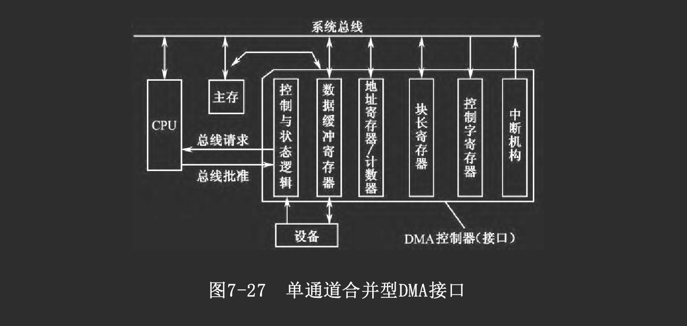

- 地址寄存器/计数器
    主存缓冲区的地址指针
    - 初始化时由CPU程序设置，指向主存缓冲区首址
    - 每进行一次DMA传送后，指针拨动一次，加/减的增量取决于编址方法和每次传送的字长，一般可编程设定。

- 块长计数器(交换量计数器)

    - 初始化时由CPU程序设置，装入数据块长度的初值
    - 每进行一次DMA传送后，计数器内容减1
    - 当数据块传送完毕，计数器回零并发出信号，可用来向CPU申请中断。

- 控制字寄存器

    - 初始化时由CPU程序设置，决定将来的
    - 数据传送方向（主存→接口、 接口→主存）
    - 地址指针增量（如加1、减1、加2、减2等）
    - 以及DMA控制逻辑的有关工作方式等

- DMA控制与状态逻辑

    - 决定是否发出DMA请求
    - 参与各接口之间的排优
    - 获得响应后产生相应的时序信号以完成DMA传送

- 数据缓冲寄存器

    提供传送数据的缓冲、锁存及总线的驱动能力。

- 中断机构

    由于在数据块传送完毕后常以中断方式请求CPU进行后处理，所以DMA接口中常包含其他普通中断接口的功能。

2. 选择型DMA接口

选择型DMA接口结构中
- DMA控制逻辑与I/O接口仍采取合并型结构
- 但通过一个局部总线（I/O总线）连接多台I/O设备，使多个I/O设备可共享一个DMA控制器

在工作的某一时段
- DMA接口只能选择其中的一台设备
- 使它可通过I/O总线、接口与主存进行DMA传送
- 在传送完一个数据块后才能重新设置，以选择另一台I/O设备

在数据块传送过程中不允许切换设备，所以这种结构仅适于各设备分时工作的方式，而接口中的选择逻辑就像是一个切换开关。

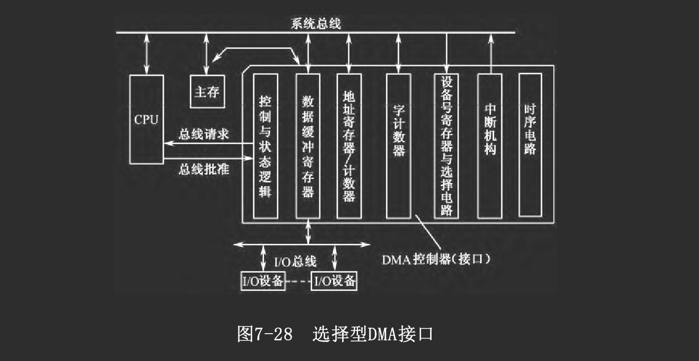

> 从逻辑组成看，选择型DMA接口可以看作是单通道型接口增加了I/O设备选择逻辑后，扩展而成

3. 集中多路型DMA控制器

如同集中型中断控制器一样
- 我们可以将DMA控制逻辑中的公用部分从设备接口中分离出来
- 利用集成电路技术将多个通道的DMA控制逻辑集成到一块芯片上，成为一种通用的集中多路型DMA控制器
    - DMA控制器部分与I/O设备的具体特性无关
    - 负责接受I/O设备提出的DMA请求
    - 然后向CPU申请控制系统总线
    - 以实现DMA传送

与I/O设备具体特性相关的部分留在I/O接口中，而与DMA有关的逻辑则尽可能地得到简化
- 一般只负责向DMA控制器发出DMA请求
- 以及在DMA控制器发回响应信号后进行数据传送

由于采取DMA方式传送数据，这种I/O接口常被称为DMA接口

数据可在I/O设备、接口、系统总线、主存之间直接传送，并不经过DMA控制器

请注意
- 在前述两种合并型结构模式中，DMA控制器与DMA接口是同一个实体
- 在分离型结构模式中，DMA控制器是通用的、可公用的部分，而接口是针对某个具体设备的

### 单字传送和成组传送

1. 单字传送方式

每次DMA请求得到响应后
- DMA控制器占用一个总线周期进行一次传送(按总线的数据通路宽度传送一个字)
- 然后释放总线，将总线控制权交还给CPU，以进行新的一次总线控制权判别

2. 成组传送

每次DMA请求得到响应后
- DMA控制器连续占用多个总线周期，进行多次DMA传送
- 直到一个数据块传送完毕，才将总线控制权交回给CPU

在进行成组传送时
- 由于CPU无法访问主存而可能暂停执行程序
- 如果CPU具有指令Cache和数据Cache，而且当前所需执行的指令和数据都在Cache中，则CPU可以与DMA传送并行地工作

在一般情况下，I/O设备的数据传输率比主存速度低，因此在DMA控制器连续占用总线期间，必然会有一些浪费，使系统的工作效率降低

因此，实用的成组传送是这样工作的：
- 当I/O设备需进行DMA传送时，就保持DMA请求信号，DMA控制器也就保持总线连续不断地进行DMA传送
- 直到I/O设备暂不需传送时才撤销DMA请求，释放总线，允许CPU使用总线

这样，DMA请求对于CPU来说具有更高的优先权，可以根据需要按成组传送方式或单字传送方式工作。这种方式也被称为请求方式。

### 多个DMA控制器的连接

为了扩展通道数，稍具规模的系统往往需要多个DMA控制器

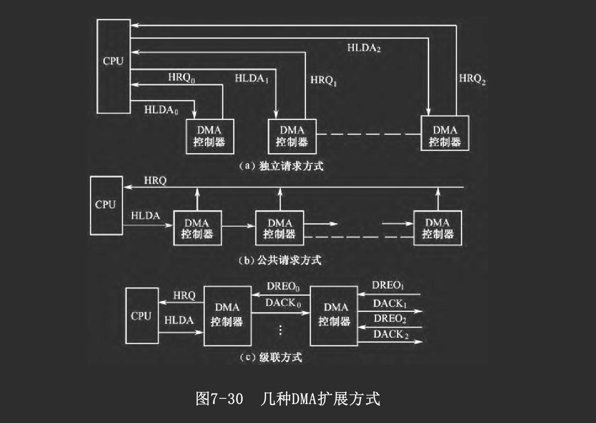

1. 独立请求方式

每个DMA控制器与CPU间单独连接，即有独立的请求线与批准线

在CPU内部通过硬件逻辑进行优先级判别，决定先响应哪一路请求

显然，独立请求方式的扩展能力较差

2. 公共请求方式

CPU对外只有一根DMA请求线和一根DMA应答线

各DMA控制器挂接在公共请求线与公共应答线之上，并另有判优逻辑来确定优先响应谁的请求

判优逻辑与中断系统中的判优逻辑非常相似，也可分为
- 串行判优
- 并行判优

有些DMA控制器芯片自身带有判优逻辑电路，可以很方便地连接成判优链。

3. 级联方式

从片将它的DMA请求信号输出送到主片的一个通道上(主片的一个请求信号输入端)，在初始化时编程设定为级联方式。

# 通道与IOP

DMA控制器的出现已经减轻了CPU对数据输入/输出的控制，但DMA传送中对外围设备的管理和某些操作的控制仍需由CPU承担

在大型计算机系统中，所连接的I/O设备数量多，输入/输出频繁，单纯依靠主CPU采取中断和DMA等管理方式已不能满足需要，于是通道和IOP方式被引入计算机系统
- 其中通道的概念最早是由IBM公司提出的
- 以后发展为输入/输出处理机IOP
- 现在以协处理器形式应用于高档微型计算机系统中

## 通道

通道是一种专用控制器，它
- 通过执行通道程序进行I/O操作的管理
- 为主机与I/O设备提供一种数据传输通道  

1. 特点

主机通过系统总线或其他方式连接多个通道，每个通道又通过局部I/O总线连接多台I/O设备

- 通道间可以并行工作，各自管理其I/O设备
- 但当通道需与主机交换数据时，每次只能连接一个通道
- 通道有自己的通道指令，可用来编成通道程序，存放在存储器中
- 当需要进行I/O操作时
    - CPU只要按约定格式准备好命令和数据，然后启动通道即可
    - 通道则执行相应的通道程序，完成所要求的操作

2. 评价

由于通道具有通道程序，可完成较复杂的I/O管理和预处理，从而在很大程度上将主CPU从繁重的I/O管理工作中解脱出来，提高了系统效率

与中断方式相比
- 两者都以程序方式进行I/O管理，因而功能强、灵活性高
- 但通道方式无需CPU执行中断处理程序，几乎完全取代主CPU去管理I/O操作，使主CPU效率大大提高

与DMA方式相比
- 相同之处是两者在进行数据传送时都可直接访问主存，不需CPU程序干预
- 不同之处是
    - DMA方式依靠纯硬件控制传送，只能实现简单的传送
    - 而通道则可通过通道程序实现复杂的操作  
因此可以认为：通道方式是在DMA方式的基础上发展起来的、功能更强的一种I/O管理方式，它常常覆盖DMA方式。

## IOP与外围处理机

随着通道的进一步发展，其结构越来越复杂，功能逐渐变得通用，发展为现在广泛使用的输入/输出处理机IOP

现在一般认为，IOP是通道的进一步发展
- 与传统意义上的通道相比，IOP的指令系统更丰富、更通用，因而功能更强；
- IOP的结构更接近于常规CPU，更具独立性，可有独立的局部存储器
- 除了能够完成传统通道的数据输入/输出功能外，还能进行一些较复杂的预处理，如码制转换、格式变换、搜索、错误检测与纠错、字与字节的拼装/拆卸等

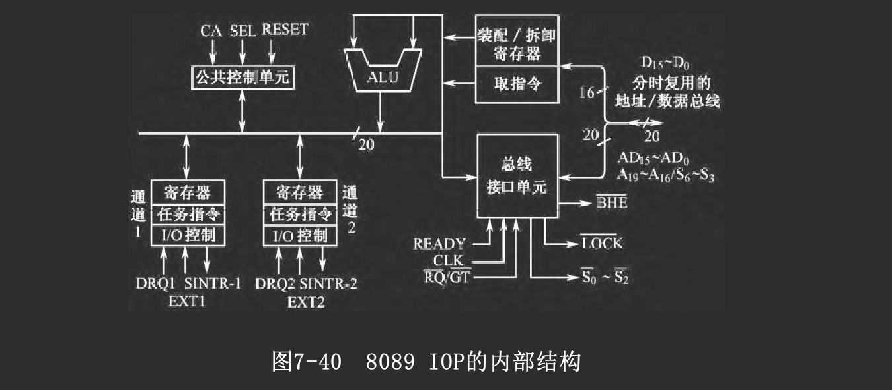

如上图所示是8089IOP的内部结构框图。它
- 结构与8086CPU非常相似，但稍稍简化些
- 具有两个I/O通道，可执行各自的通道程序
- 每个通道都有自己的寄存器组，可分别进行DMA传送
- 指令系统也与8086 CPU非常相似，但
    - 为实现I/O操作和通道管理，增加了一些面向I/O的指令
    - 而较复杂的数据处理指令则被省略

8089 IOP可访问1 MB的存储器空间和64 KB的I/O空间。它与系统的连接方式可分为两类：本地方式和远程方式。

### 本地方式(LOCAL)

1. 概念

8089 IOP与主CPU共享系统总线和主存储器
- 将IOP的地址线、数据线和一些控制信号线，直接与主CPU 8088并联
- CPU与IOP之间的通信，数据交换是通过共享主存来实现的
- CPU将通道程序存放在主存中，由硬件电路产生控制信号“通道注意”
    - 通知8089 IOP去执行通道程序
    - 也可以在必要时终止8089 IOP的执行
- 当IOP需要使用总线访问主存或访问I/O接口时，向CPU提出申请
    - 如果CPU不需占用总线，可将总线控制权让给IOP
    - 待8089 IOP使用完总线后，交回总线权
    > 在本地方式中，主CPU是总线的主控者

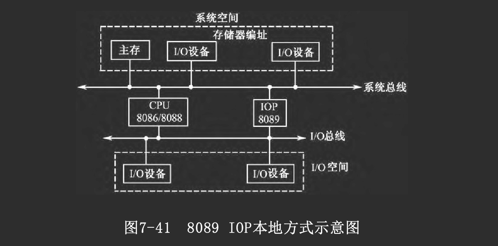

2. 评价

本地方式的优点是：
- IOP能与主CPU共享存储空间和I/O空间
- 因而结构简单、编程方便    
其缺点是：
- IOP与CPU之间可能存在较严重的总线使用冲突
- 并行程度不高，使系统性能受到很大的制约

### 远程方式(REMOTE)

远程方式是IOP与主CPU共享系统总线，但IOP另有自己的局部I/O总线，即
- IOP通过独立的局部总线连接其局部存储器与局部I/O设备
- 并通过总线接口与CPU系统总线相连接

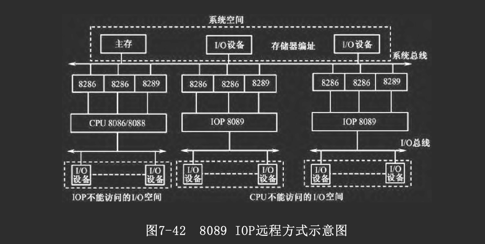

在远程方式中
- IOP与主CPU之间的通信仍通过共享主存（属于系统空间）来实现
- 但IOP的程序存放在自己的局部存储器中，因此
    - IOP可通过自己的局部总线读取IOP程序或访问局部I/O设备
    - 仅当需要与共享主存交换数据时，IOP才使用系统总线
- 系统总线的使用冲突被减小到最低程度，并行程度大为提高

# 总线

## 介绍

### 功能和定义

总线是一组能为多个部件分时共享的信息传送线
- 用来连接多个部件并为之提供信息交换通路
- 共享性，即总线所连接的部件都可通过它传送信息
- 分时性，即在某一时刻总线只允许有一个部件送出数据到总线上
- 共享是分时实现的

总线不仅是一组信号线，从广义上讲，总线是
- 一组传送线路
- 及相关的总线协议

因为要实现分时共享，必须定义相应的规则，称为总线协议，各个连到总线上的部件必须遵守这些协议，才能有序地分时共享该总线

总线协议一般包括：
- 信号线定义
- 数据格式
- 时序关系
- 信号电平
- 控制逻辑等  
它确定了一个系统使用总线的方法。

### 组成

总线包括一组物理信号线，按其功能可分为4组：数据线、地址线、控制信号线和电源线。

1. 数据线

数据线用来实现数据传送，常称为数据总线
- 双向传送
- 分时共享
- 数据总线的宽度即为数据通路宽度

2. 地址总线

地址线又称地址总线，用于
- 传送地址信号
- 以确定所访问的存储单元或某个I/O端口

挂接在总线上的各部件都能从地址线上接收地址信号，并配合控制信号进行地址译码
- 只有能掌管总线控制权的主控部件(如CPU、DMA控制器等)才能向地址线上发送地址码
- 而不能掌管总线控制权的部件(如存储器)，不能发送地址码

在微处理器中，由于一块芯片的引脚数有限，常采用复用技术以减少专用地址线的数目，例如在总线周期开始部分
- 先用数据线传送地址码的高位部分，将它送入一个地址锁存器
- 同时用地址线传送地址码的低位部分，两部分合成为完整的地址码
- 然后再用数据线传送数据

3. 控制总线

用来传送各类控制/状态信号，控制总线的组成情况体现了不同总线的各自特点、运行方式及应用场合。

按照各种控制信号的功用，我们将常见控制信号再细分为几组: 
- 数据传输控制信号
- 总线请求与控制权交换信号
- 其他控制信号
- 电源线

### 分类

1. 内总线

连接CPU内部各部件

2. 系统总线

连接计算机内各部件(CPU、主存、I/O接口)
- 一般包括地址、数据和控制信号三类传输线，以及电源线
- 内总线的连接距离较短，传输速度较快

2. 外总线

多台计算机系统之间的连接总线
- 一般仅有数据线及少量简单的控制信号线，数据线的数据通路宽度较窄
- 外总线的传输距离一般较远，速度较慢

## 总线操作时序

1. 同步控制方式

采用同步控制方式的总线，称为同步总线

在同步控制方式中，数据传输过程完全在主控部件的控制下进行，有着统一的时钟同步信号
- 读数据的整个过程都是在时钟CLK的同步控制下进行的
- 所有控制信号的产生与结束也是受CLK的同步控制。

总线上各模块的工作速度往往是不一致的，采用统一的同步时序，在设计数据传送周期时需以总线上最慢的那个模块为依据。这样，在速度较快的模块间传送数据时，效率就被迫降低了，这是同步控制方式的不足。

2. 扩展同步方式

为了解决纯同步方式适应性差的问题，人们在同步方式中引入了异步控制的思想，称为扩展同步方式。此处，仍以PC总线为例，说明这种改进方式。

如果从模块的速度较慢，不能在基本总线周期内完成操作
- 就发出READY=0信号，表示尚未准备好
- 主模块在脉冲的上升沿采样READY信号，决定是否加入“等待时钟周期”Tw
- 在Tw脉冲的上升沿，再次采样READY，看是否需要插入更多的Tw
    - 如果READY为低，于是插入Tw以延长操作时间
    - 如果从模块已准备好，READY=1，撤销等待请求
        - 于是总线结束本次总线周期操作

扩展同步方式能灵活改变总线周期的长短，满足高速设备和低速设备的需要，既能提高效率，又保持了同步方式的优点

3. 异步控制方式

在异步控制方式中，没有固定的时钟周期，完全采用异步应答方式工作，总线周期的长短根据实际需要而定

在以应答方式相关联的信号之间就存在一种互锁关系，相应地总线时序有全互锁、半互锁、不互锁之分

一个典型的全互锁异步应答过程如下：
- 主设备发送地址及“读/写”命令；
- 从设备收到读命令后，执行相应操作；
- 当从设备完成后，发出“应答”信号；
- 主设备收到应答信号后，撤销读/写命令；
- 从设备发现主设备撤销“读/写”命令后，撤销其应答信号。

