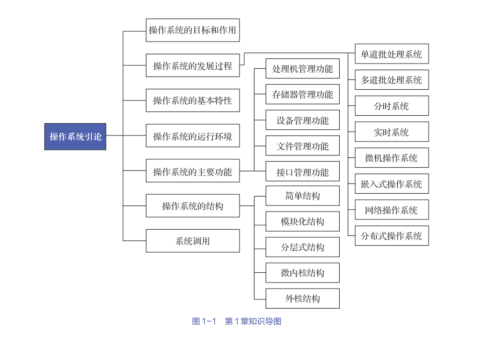
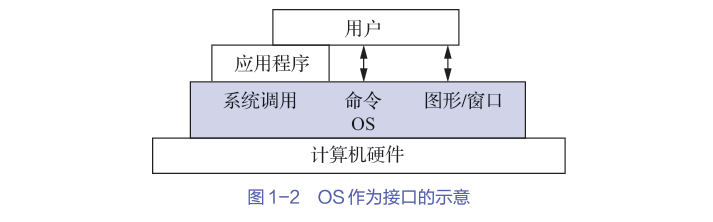
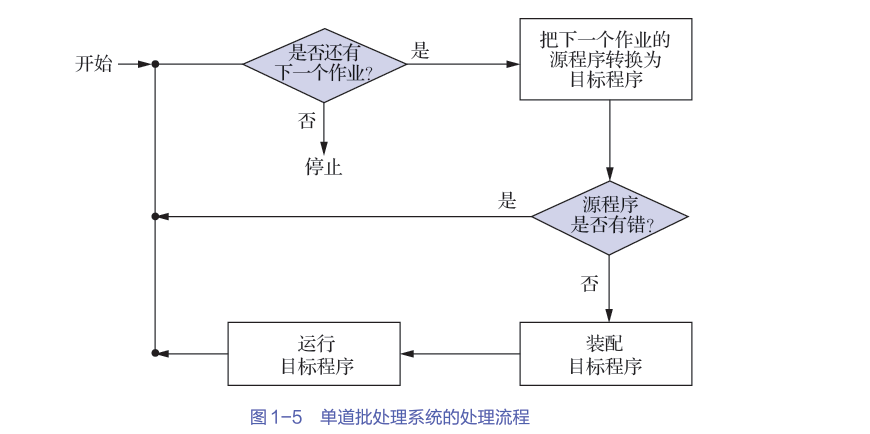

操作系统(operating system,OS)：配置置在计算机硬件上的第一层软件，是对硬件系统的首次扩充，其主要作用是管理硬件设备，提高它们的利用率和系统吞吐量，并为用户和应用程序提供一个简单的接口，以便于用户和应用程序使用硬件设备。

# 1.操作系统的目标和作用

## 操作系统的目标
- 方便性：为用户使用提供便利
- 有效性：可提高系统资源的利用率，提高系统的吞吐量
- 可扩充性
- 开放性

## 操作系统的作用
- 人机交互：OS作为用户鱼计算机硬件系统之间的接口
  > ：OS处于用户与计算机硬件系统之间，用户通过OS来使用计算机硬件系统 
    > 
    > 用户可通过3种方式来使用计算机，即通过命令方式、系统调用方式和图形/窗口方式来实现自身与OS的通信，并取得OS的服务。

- 资源管理：OS作为计算机系统资源的管理者
    > 在一个计算机系统中，通常含有多种硬件和软件资源。归纳起来可将这些资源分为4类：处理机、存储器、I/O设备以及信息（数据和程序）。  
    相应地，OS的主要功能也正是对这4类资源进行有效的管理。
    > - 处理机管理：负责处理机的分配与控制；
    > - 存储器管理：负责内存的分配与回收；
    > - I/O 设备管理：负责I/O设备的分配（回收）与操纵；
    > - 文件管理：负责文件的存取、共享与保护等
- 资源抽象：OS实现了对计算机资源的抽象
    > 隐藏了I/O设备操作的细节，并可向上将I/O设备抽象为一组数据结构以及一组I/O操作命令

## 推动操作系统发展的主要动力
1. 不断提高计算机系统资源的利用率
2. 方便用户
3. 器件不断更新换代
4. 计算机体系不断发展
5. 不断提出新的应用需求

# 操作系统的发展过程

## 未配置操作系统的计算机系统
1. 人工操作方式  
是由用户将事先已穿孔的纸带（或卡片），装入纸带输入机（或卡片输入机），再启动它们以将纸带（或卡片）上的程序和数据输入计算机，然后启动计算机运行。仅当程序运行完毕并取走计算结果后，才允许下一个用户上机。
    - 用户独占全机
    - CPU等待人工操作
    > 当用户进行装带（卡）、卸带（卡）等人工操作时，CPU及内存等资源是空闲的。存在CPU与I/O设备之间速度不匹配的矛盾
2. 脱机I/O方式  
事先将装有用户程序和数据的纸带装入纸带输入机，在一台外围机的控制
下，把纸带上的程序和数据输入磁带。当CPU需要这些程序和数据时，再从磁带上将它们高速地调入内存。
    - 减少了CPU的空闲时间
    - 提高了I/O速度

## 单道批处理系统
要先把一批作业以脱机I/O方式输入到磁带上，并在系统中配上监督程序。在它的控制下，这批作业能一个接一个地被连续处理。

处理过程：首先由监督程序将磁带上的第一个作业装入内存，并把运行控制权交给该作业；当该作业处理完成时，又把运行控制权交还给监督程序，再由监督程序把磁带上的第二个作业调入内存。

> 切换作业时会出现CPU等待IO的空闲时间
## 多道批处理系统
用户所提交的作业会被先存放在外存上，并排成一个队列，称为“后备队列”。  
然后由作业调度程序按一定的算法从后备队列中选择若干个作业调入内存，使它们共享CPU和系统中的各种资源。  
由于在内存中同时装有若干道程序，这样便可在运行程序A时，利用其因I/O操作而暂停执行时的CPU空档时间，再调度另一道程序B运行。同样可以利用程序B在I/O操作时的CPU空档时间，再调度程序C运行，进而实现多道程序交替运行，这样便可以保持CPU处于忙碌状态。

 - 资源利用率高
 - 系统吞吐量大
 - 作业平均周转时间长
 - 无交互能力

--- 
综上，OS是一组能有效地组织和管理计算机硬件和软件资源，合理地对各类作业进行调度，以及方便用户使用的程序的集合

## 分时系统
## 实时系统
## 微机操作系统
## 嵌入式操作系统
## 网络操作系统
