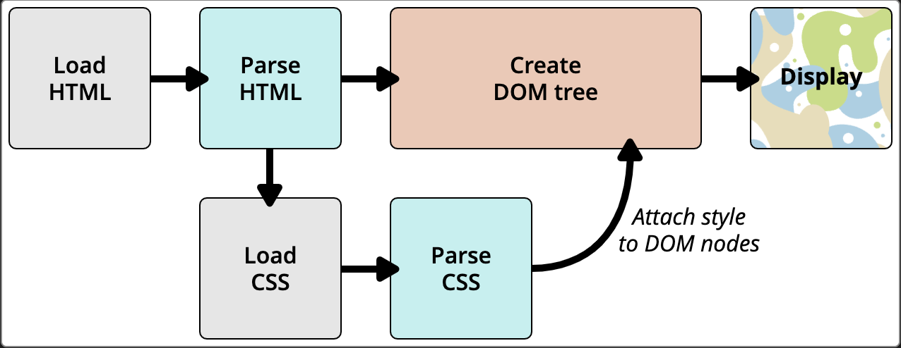
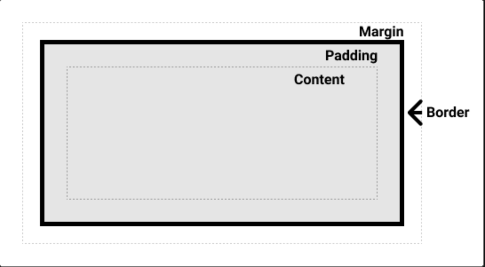
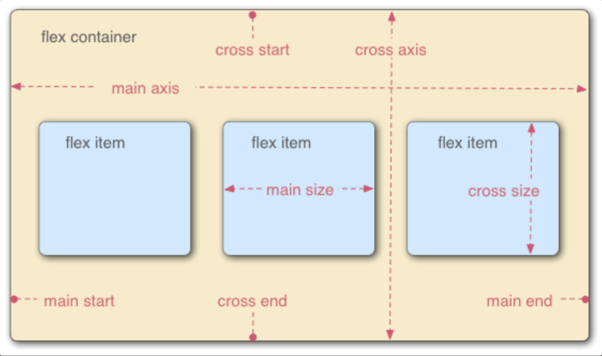

css

HTML 用于为你的内容定义**结构**和**语义**，CSS 用于为内容提供**样式**和对内容进行**布局**。

# CSS第一步

**CSS语法**

```css
h1 {
  color: red;
  font-size: 5em;
}
```
- 选择器(selector): 选择了我们将要用来添加样式的 HTML 元素。
    > 用逗号将不同选择器隔开，即可一次使用多个选择器。
- 大括号{}: 在大括号内部定义一个或多个形式为属性（property）—值（value）对的声明。
    > 其中的值可以是`关键字`,`数值`,`函数`

**浏览器的默认行为**

自带一个包含默认样式的样式表，例如\<ul>前自带项目符号，可以选择该类元素后添加`list-style-type:none`进行移除

**使用类名**

1. 添加`class`属性
2. 使用类选择器`.+classname`
    > `元素名+.+classname`：选中每个classname类中的目标元素

**根据元素在文档中的位置确定样式**

- `var1 var2`: 后代选择器，选择var1内部的任何var2
- `var + var`: 兄弟选择器，选择直接出现在var1后并且与var1具有相同层级的var2


**根据状态确定样式**

- `var:status`: 其中的status可以是各种特定的状态


## CSS的组成

**在html中使用css**

- 外部样式表
- 内部样式表
- 内联样式表

**层叠和优先级**


**@规则**

CSS 的 @rules（读作“at-rules”）是一些特殊的规则，提供了关于 CSS 应该执行什么或如何表现的指令。


## CSS是如何运行的

1. 浏览器载入 HTML 文件（比如从网络上获取）。
2. 将 HTML 文件转化成一个 DOM（Document Object Model），DOM 是文件在计算机内存中的表现形式。
3. 接下来，浏览器会拉取该 HTML 相关的大部分资源，比如嵌入到页面的图片、视频和 CSS 样式。JavaScript 则会稍后进行处理，简单起见，同时此节主讲 CSS，所以这里对如何加载 JavaScript 不会展开叙述。
4. 浏览器拉取到 CSS 之后会进行解析，根据选择器的不同类型（比如 element、class、id 等等）把他们分到不同的“桶”中。浏览器基于它找到的不同的选择器，将不同的规则（基于选择器的规则，如元素选择器、类选择器、id 选择器等）应用在对应的 DOM 的节点中，并添加节点依赖的样式（这个中间步骤称为渲染树）。
5. 上述的规则应用于渲染树之后，渲染树会依照应该出现的结构进行布局。
网页展示在屏幕上（这一步被称为着色）。



**DOM**

一个 DOM 有一个树形结构，标记语言中的每一个元素、属性以及每一段文字都对应着结构树中的一个节点（Node/DOM 或 DOM node）。

# CSS基础


## CSS选择器

### 选择器列表

将具有相同样式的CSS选择器写在一起，用逗号`,`，隔开

> 如果任何一个选择器无效 (存在语法错误)，那么整条规则都会被忽略。


### 选择器的种类

#### 类型、类和ID选择器

- 类型选择器：选择了一个 HTML 标签/元素

- 全局选择器：是由一个星号（*）代指的，它选中了文档中的所有内容（或者是父元素中的所有内容，比如，它紧随在其他元素以及邻代运算符之后的时候）。

- 类选择器：以一个句点（.）开头，会选择文档中应用了这个类的所有物件。

> 指向特点元素的类：能建立一个指向应用一个类的特定元素。例如`element.class`

- ID选择器：ID 选择器开头为#而非句点，能选中设定了id的元素 


#### 标签属性选择器

用属性选择器来选中带有特定属性的元素。

| 选择器 | 示例 | 描述 ｜ 
| -------------- | --------------- |
| [attr] | a[title] | 匹配带有一个名为attr的属性的元素——方括号里的值。
|
| [attr=value] | a[href="https://example.com"] | 匹配带有一个名为attr的属性的元素，其值正为value——引号中的字符串。 | 

> 存在字符串匹配选择器，可对字符串进行类似于正则表达式的匹配 

#### 伪类和伪元素

- 伪类: 选择处于特定状态的元素

伪类就是开头为冒号的关键字：`:pseudo-class-name`

- 伪元素

伪元素开头为双冒号：`::pseudo-element-name`

**::before和::after**

是特别的伪元素，它们和content属性一同使用，使用 CSS 将内容插入到你的文档中中。


#### 关系选择器

它们在其他选择器之间和其他选择器与文档内容的位置之间建立了一种有用的关系的缘故。

- 后代选择器

用单个空格（" "）字符——组合两个选择器

- 后代选择器

用单个空格（">"）字符——组合两个选择器。只会在选择器选中直接子元素的时候匹配


- 邻接兄弟选择器

邻接兄弟选择器（+）用来选中恰好处于另一个在继承关系上同级的元素旁边的物件。


- 通用兄弟选择器

选中一个元素的兄弟元素，即使它们不直接相邻，你还是可以使用通用兄弟关系选择器（~）。


--- 

## 层叠、优先级与继承


- **层叠**：当应用两条同级别的规则到一个元素的时候，写在后面的就是实际使用的规则。


- **优先级**：浏览器是根据优先级来决定不同选择器对应相同的元素的时候需要使用哪个规则。

> `!important`拥有最高的优先级

- **继承**：一些设置在父元素上的 CSS 属性是可以被子元素继承的，有些则不能。


**控制继承**

CSS 为控制继承提供了五个特殊的通用属性值。每个 CSS 属性都接收这些值。

inherit,initial,revert,revert-layer,unset

> 可用简写属性all同时将这些继承值中的一个应用于（几乎）所有属性。


todo:层叠层的学习


## 盒模型

在 CSS 中，所有的元素都被一个个的“盒子”包围着


**外部显示类型**

- display:"block"
    - 盒子会产生换行。
    - width 和 height 属性可以发挥作用。
    - 内边距、外边距和边框会将其他元素从当前盒子周围“推开”。
    - 如果未指定 width，方框将沿行向扩展，以填充其容器中的可用空间。在大多数情况下，盒子会变得与其容器一样宽，占据可用空间的 100%

    > 某些 HTML 元素，如 <h1> 和 <p>，默认使用 block 作为外部显示类型。

- display:"inline"
    - 盒子不会产生换行。
    - width 和 height 属性将不起作用。
    - 垂直方向的内边距、外边距以及边框会被应用但是不会把其他处于 inline 状态的盒子推开。
    - 水平方向的内边距、外边距以及边框会被应用且会把其他处于 inline 状态的盒子推开。

    > 某些 HTML 元素，如 <a>、 <span>、 <em> 以及 <strong>，默认使用 inline 作为外部显示类型。


- display:inline-block
    - 设置 width 和height 属性会生效。
    - padding、margin 和 border 会推开其他元素。

**内部显示类型**

决定了盒子内元素的布局方式。


**CSS盒模型**


- 内容盒子：显示内容的区域
- 内边距盒子padding：填充位于内容周围的空白处；
- 边框盒子border：边框盒子包住内容和任何填充；
- 外边距盒子margin：盒子与其他元素之间的空白；


> CSS替代盒模型：外边距、内边距和边框不会扩大盒子的大小，任何宽度都是页面上可见方框的宽度。
> 可通过设置`box-sizing:border-box`

## 溢出

- overflow / overvlow-y / overflow-x


# CSS布局

## 常规流布局

- 一个块级元素会填充其父元素所有的行向空间，并沿着其块向伸长以容纳其内容。
- 行级元素的大小就是其本身的大小。


## 弹性盒子

一种用于按行或按列布局元素的一维布局方法。元素可以膨胀以填充额外的空间，收缩以适应更小的空间。


**指定元素的布局为flexible**

需要选择将哪些元素将设置为弹性的盒子。我们需要给这些 flexible 元素的父元素 display 设置一个特定值 flexible。

我们给的 display 值为 flex 的元素就像一个块级元素，但是它的子元素布局为 flex 项。

> 如果你希望该元素的子元素作为 flex 项，你也可以使用 display 值为 inline-flex


**flex模型说明**



- 主轴（main axis）是沿着 flex 元素放置的方向延伸的轴（比如页面上的横向的行、纵向的列）。该轴的开始和结束被称为 main start 和 main end。
- 交叉轴（cross axis）是垂直于 flex 元素放置方向的轴。该轴的开始和结束被称为 cross start 和 cross end。
- 设置了 display: flex 的父元素（在本例中是 <section>）被称之为 flex 容器（flex container）。
- 在 flex 容器中表现为弹性的盒子的元素被称之为 flex 项（flex item）


**flex-direction**: 指定主轴的方向

**flex-wrap**: 换行

**flex**

这是一个无单位的比例值，表示每个 flex 项沿主轴的可用空间大小。

> 它是一个比例，这意味着将每个 flex 项的设置为 400000 的效果和 1 的时候是完全一样的。

- flex 是一个可以指定最多三个不同值的缩写属性：
    - flex-grow:无单位比例。
    - flex-shrink:般用于溢出容器的 flex 项。这指定了从每个 flex 项中取出多少溢出量，以阻止它们溢出它们的容器。
    - flex-basis:最小值。

**水平对齐和垂直对齐**

-justify-content: 控制 flex 项在主轴上的位置。
- align-items: 控制 flex 项在交叉轴上的位置。
- align-self: flxe项的属性，可覆盖align-items的值


**flex项排序**

- order 
    - 所有 flex 项默认的 order 值是 0。
    - order 值大的 flex 项比 order 值小的在显示顺序中更靠后。


## 网格

网格是由一系列水平及垂直的线构成的一种布局模式。根据网格，我们能够将设计元素进行排列，帮助我们设计一系列具有固定位置以及宽度的元素的页面，使我们的网站页面更加统一。


**定一个网格**

```css
.contanier{
    display:grid;   设置父元素为grid布局
    grid-template-colums:2fr 1fr 1fr;       按比例添加三列
    grid-auto-rows: 100px;      将行设置为随内容自动添加
}
```
> 重复构建轨道组：grid-template-columns: repeat(3, 1fr);得到了 3 个 1fr 的列

> minmax() 函数为一个行/列的尺寸设置了取值范围。比如设定为 minmax(100px, auto)，那么尺寸就至少为 100 像素，并且如果内容尺寸大于 100 像素则会根据内容自动调整。

- grid-gap: 网格间隙

**基于线的元素放置**

- grid-column:<number>
- grid-row:<number>

> 第一条列分隔线（即网格边缘线）在网格的最左边而第一条行分隔线在网格的最上面。


**使用grid-template-areas布局**

- grid-template-areas 
- grid-area

## 浮动

- float:left/right

浮动元素会脱离正常的文档布局流，并吸附到其父容器的左边。在正常布局中位于该浮动元素之下的内容，此时会围绕着浮动元素，填满其右侧的空间。


## 定位

- position
    - static: 将元素放入它在文档布局流中的正常位置
    - relative: 相对于原来的位置进行偏移，原来的位置还被保留
        - top/bottom/left/right
    - absolute: 绝对定位的元素不再存在于正常文档布局流中。相反，它坐在它自己的层独立于一切。
    - fixed: 绝对定位将元素固定在相对于其位置最近的祖先。（如果没有，则为初始包含它的块）而固定定位固定元素则是相对于浏览器视口本身。
    - sticky: 基本上是相对位置和固定位置的混合体，它允许被定位的元素表现得像相对定位一样，直到它滚动到某个阈值点（例如，从视口顶部起 10 像素）为止，此后它就变得固定了。
- z-index


