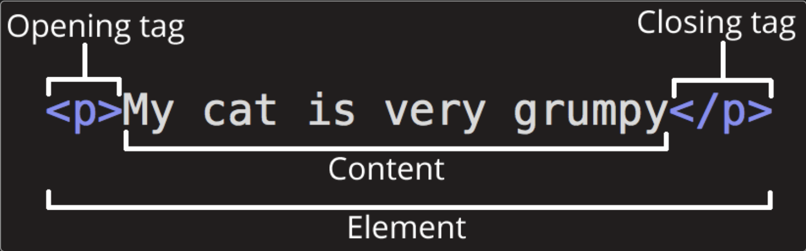
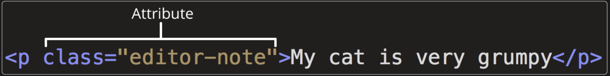

**mdn** web study


# web入门


**目录结构**

- index.html：包含主页内容
- images文件夹：包含所有图片
- styles文件夹：包含所有的CSS文件
- scripts文件夹：包含所有的javascript文件


# html

MDN上HTML参考文档的主入口: [HTML（超文本标记语言） | MDN](https://developer.mozilla.org/zh-CN/docs/Web/HTML)

## HTML介绍

### HTML简介

HTML（HyperText Markup Language，超文本标记语言）是一种用来告知浏览器如何组织页面的标记语言。

就其核心而言，HTML 是一种相当简单的、由不同元素组成的标记语言，它可以被应用于文本片段，使
- 文本在文档中具有不同的含义（它是段落吗？它是项目列表吗？它是表格吗？）
- 将文档结构化为逻辑块（文档是否有头部？有三列内容？有一个导航菜单？）
- 并且可以将图片，影像等内容嵌入到页面中。


**剖析一个HTML标签**




这个元素的主要部分有：
- 开始标签(Opening tag)：开头标签标志着元素开始或开始生效的地方。
- 内容(Content)元素的内容
- 结束标签(Closing tag)：标志着该元素的结束。

> HTML 标签不区分大小写。


**块级元素和内联元素**

在 HTML 中有两种你需要知道的重要元素类别
- 块级元素
- 内联元素


**空元素**

一些元素只有一个标签，通常用来在此元素所在位置 _插入/嵌入_ 一些东西。这些元素被称为空元素。


**属性Attrubute**

属性包含元素的额外信息，这些信息不会出现在实际的内容中。




属性必须包含：
- 一个空格
- 一对键值对

> 布尔属性：有时你会看到没有值的属性，这也是完全可以接受的。这些属性被称为布尔属性。布尔属性只能有一个值，这个值一般与属性名称相同。


**剖析HTML文档**

```html
<!doctype html>
<html lang="zh-CN">
  <head>
    <meta charset="utf-8" />
    <title>我的测试站点</title>
  </head>
  <body>
    <p>这是我的页面</p>
  </body>
</html>
```

- `<!DOCTYPE html>`: 声明文档类型。
- `<html></html>`: 这个元素包裹了页面中所有的内容，有时被称为根元素。
- `<head></head>`: 包含了所有你想包含在 HTML 页面中但不在 HTML 页面中显示的内容。
- `<meta charset="utf-8">`: 这个元素代表了不能由其他 HTML 元相关元素表示的元数据
- `<title></title>`: 设置了页面的标题
- `<body></body>`: 包含了你访问页面时所有显示在页面上的内容


> 无论你在 HTML 元素的内容中使用多少空格（包括一个或多个空白字符或换行），当渲染这些代码的时候，HTML 解释器会将连续出现的空白字符减少为一个单独的空格符。


> 为了在html文件中使用保留字，我们可以使用等价字符引用


### \<head>

作用：作用是保存页面的一些元数据。

**\<title>**: 为文档添加标题

**\<meta>**: 元数据<meta>就是描述数据的数据

一些属性
- charset: 指定文档的字符编码
- name:指定了 meta 元素的类型
- content: 指定了实际的元数据内容。


**站点添加自定义图标**

1. 将其保存在与网站的索引页面相同的目录中，以 .ico 格式保存（大多数浏览器支持更通用的格式，如 .gif 或 .png）
2. 将以下行添加到 HTML 的 <head> 块中以引用它：
```html
<link rel="icon" href="favicon.ico" type="image/x-icon" />
```

**在html中应用css和javascript**

- \<link> 元素经常位于文档的头部，它有 2 个属性，rel="stylesheet" 表明这是文档的样式表，而 href 包含了样式表文件的路径：

```html
<link rel="stylesheet" href="my-css-file.css" />
```

- \<script> 元素也应当放在文档的头部，并包含 src 属性来指向需要加载的 JavaScript 文件路径，同时最好加上 defer 以告诉浏览器在解析完成 HTML 后再加载 JavaScript。

```html
<script src="my-js-file.js" defer></script>
```


**为文档设定主语言**

可以（而且有必要）为站点设定语言
```html
<html lang="zh-CN">
  …
</html>
```


### html文本处理

HTML 的主要工作之一是赋予文本结构，使浏览器能够按照开发者的意图显示 HTML 文档。

**文本格式化**

- 段落：\<p>
- 标题：\<h>
- 强调：\<em>(emphasis) / \<i>
- 加粗：\<strong> / <b>
- 下划线：\<u>
- 描述列表：\<dl>+\<dt>+\<dd>
- 引用：\<blockquto> / \<q>
- 缩写：\<abbr>
- 标记联系方式：\<address>
- 上下标：\<sup> / \<sub>
- 计算机代码：\<code>+\<pre>+\<var>+\<kbd>+\<samp>
- 时间：\<time>

- \<br>: 换行
- \<hr>: 水平分割线

**列表**

- 无序：\<ul>+\<li>
- 有序：\<ol>+\<li>

> ol:ordered list 
> ul:unordered list 
> list item

### 创建超链接

超链接使我们能够将我们的文档链接到任何其他文档（或其他资源）

**\<a>**

- href:包含目标网址
    > 可以是文档中的目标部分：先给要链接到的元素分配一个 id 属性，为了链接到那个特定的 id，要将它放在 URL 的末尾，并在前面包含井号（#）
- title:当鼠标指针悬停在链接上时，标题将作为提示信息出现
- target:对目标链接如何呈现
- download:提供一个默认的保存文件名
- mailto:发送邮件

### 构建网站框架


**语义化标记**

根据功能来为区段添加标记，实现标记化语义

- \<header>：页眉
- \<nav>：导航栏
- \<main>：主内容
- \<aside>：侧边栏
- \<footer>：页脚

> 屏幕阅读器等辅助技术可以识别这些元素，为视障人士提供帮助

- \<article>: 包围的内容为一篇文章
- \<section>: 用于组织页面使其按功能分块

**无语义元素**

对于一些要组织的项目或要包装的内容，现有的语义元素均不能很好对应。有时候你可能只想将一组元素作为一个单独的实体来修饰来响应单一的用 CSS 或 javaScript。

- \<span>: 内联inline的无语义元素
- \<div>: 块级无语义元素


## 多媒体与嵌入

**图片**

- \
    - scr:  指向要嵌入页面的图像。
    - alt: 图片的文本描述，用于在图片无法显示或者因为网速慢而加载缓慢的情况下使用。
    - width: 宽度
    - height: 高度
    - title: 悬浮提供更多的信息

- \<figure>和\<figcaption>: 为图片提供一个语义容器，在说明文字和图片之间建立清晰的关联。

其他图形
- \<Canvas>: 提供了使用 avaScript 绘制 2D 图形的 API。
- \<SVG>: 可缩放矢量图形
- \<WevGL>: 用于 Web 的 3D 图形 API


**音频和视频**

- \<video>
    - src: 指向你想要嵌入到网页中的视频资源
    - controls: 让视频或音频包含浏览器自带的控制界面

- \<audio>

**其他嵌入技术**

- \<iframe>: 将其他 Web 文档嵌入到当前文档中。
- \<object>: 是通用的嵌入外部内容（如 PDF）
- \<embed>: 是通用的嵌入外部内容（如 PDF）


## HTML表格


**html表格基础**

- \<table>: 表格容器
- \<th>: 表头
- \<tr>: 表格行
- \<td>: 表中数据

**允许表格跨越多行和列**

- clospan: 宽度
- rowspan: 高度

**为表格中的列提供共同的样式**

- \<colgroup>
- \<col>


**表格结构**

- \<caption>: 表的标题
- \<thread>: 包住表格中作为表头的部分,一般是第一行
- \<tfoot>: 包住表格中作为表脚的部分,一般是最后一行
- \<tbody>: 包住表格内容中不在表头或表尾的其他部分


**无障碍**

使用行和列的标题  

- scope: 添加在\<th>元素中，以告诉屏幕阅读器该表头的类型

- id和headers:创建标题与单元格之间的联系。
> 1. 为每个 <th> 元素添加一个唯一的 id 。
> 2. 为每个 <td> 元素添加一个 headers 属性。每个单元格的 headers 属性需要包含它从属于的所有标题的 id，之间用空格分隔开。


---

# CSS 

HTML 用于为你的内容定义**结构**和**语义**，CSS 用于为内容提供**样式**和对内容进行**布局**。

## CSS第一步

**CSS语法**

```css
h1 {
  color: red;
  font-size: 5em;
}
```
- 选择器(selector): 选择了我们将要用来添加样式的 HTML 元素。
    > 用逗号将不同选择器隔开，即可一次使用多个选择器。
- 大括号{}: 在大括号内部定义一个或多个形式为属性（property）—值（value）对的声明。
    > 其中的值可以是`关键字`,`数值`,`函数`

**浏览器的默认行为**

自带一个包含默认样式的样式表，例如\<ul>前自带项目符号，可以选择该类元素后添加`list-style-type:none`进行移除

**使用类名**

1. 添加`class`属性
2. 使用类选择器`.+classname`
    > `元素名+.+classname`：选中每个classname类中的目标元素

**根据元素在文档中的位置确定样式**

- `var1 var2`: 后代选择器，选择var1内部的任何var2
- `var + var`: 兄弟选择器，选择直接出现在var1后并且与var1具有相同层级的var2


**根据状态确定样式**

- `var:status`: 其中的status可以是各种特定的状态


### CSS的组成

**在html中使用css**

- 外部样式表
- 内部样式表
- 内联样式表

**层叠和优先级**


**@规则**

CSS 的 @rules（读作“at-rules”）是一些特殊的规则，提供了关于 CSS 应该执行什么或如何表现的指令。


### CSS是如何运行的

1. 浏览器载入 HTML 文件（比如从网络上获取）。
2. 将 HTML 文件转化成一个 DOM（Document Object Model），DOM 是文件在计算机内存中的表现形式。
3. 接下来，浏览器会拉取该 HTML 相关的大部分资源，比如嵌入到页面的图片、视频和 CSS 样式。JavaScript 则会稍后进行处理，简单起见，同时此节主讲 CSS，所以这里对如何加载 JavaScript 不会展开叙述。
4. 浏览器拉取到 CSS 之后会进行解析，根据选择器的不同类型（比如 element、class、id 等等）把他们分到不同的“桶”中。浏览器基于它找到的不同的选择器，将不同的规则（基于选择器的规则，如元素选择器、类选择器、id 选择器等）应用在对应的 DOM 的节点中，并添加节点依赖的样式（这个中间步骤称为渲染树）。
5. 上述的规则应用于渲染树之后，渲染树会依照应该出现的结构进行布局。
网页展示在屏幕上（这一步被称为着色）。


**DOM**

一个 DOM 有一个树形结构，标记语言中的每一个元素、属性以及每一段文字都对应着结构树中的一个节点（Node/DOM 或 DOM node）。

## CSS基础


**CSS选择器**

- 选择器列表

将具有相同样式的CSS选择器写在一起，用逗号`,`，隔开

> 如果任何一个选择器无效 (存在语法错误)，那么整条规则都会被忽略。


选择器的种类

- 类型、类和ID选择器
```css
h1{}
.box{}
#unique{}
```
- 标签属性选择器: 根据一个元素上的某个标签的属性来选择
```css
a[title]{}
a[href="https://example.com"]{}
```
- 伪类和伪元素: 样式化一个元素的特定状态 或 选择一个元素的某个部分而不是元素自己。
```css: 
a:hover{}
p::first-line{}
```
- 运算符: 将其他选择器组合起来，更复杂的选择元素。
```css
article > p {}
```


