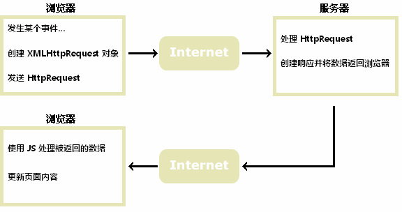

AJAX = Asynchronous JavaScript and XML（异步的 JavaScript 和 XML）

AJAX 最大的优点是在不重新加载整个页面的情况下，通过在后台与服务器交换数据并更新部分网页内容。

[toc]

# AJAX的工作原理

1. 事件触发：如点击按钮或页面加载
2. AJAX请求：通过 JavaScript 创建一个 **XMLHttpRequest** 对象，向服务器发送请求
3. 服务器处理请求：服务器（通常使用 PHP、Node.js 等）接收请求，处理并返回响应数据（JSON、XML、HTML等）
4. AJAX相应处理：浏览器接收响应，使用 JavaScript 在页面上更新内容，而无需重新加载整个页面




# XMLHttpRequest对象

- XMLHttpRequest 是 AJAX 的基础
- XMLHttpRequest 用于在后台与服务器交换数据

## 创建


```javascript
if (window.XMLHttpRequest) {
    // 所有现代浏览器（IE7+、Edge、Firefox、Chrome、Safari 以及 Opera）均内建 XMLHttpRequest 对象
    //  IE7+, Firefox, Chrome, Opera, Safari 浏览器执行代码
    var xmlhttp=new XMLHttpRequest();
} else {
    // 老版本的 Internet Explorer （IE5 和 IE6）使用 ActiveX 对象
    // IE6, IE5 浏览器执行代码
    var xmlhttp=new ActiveXObject("Microsoft.XMLHTTP");
}
```


## 请求服务


```javascript
// 规定请求的类型、URL 以及是否异步处理请求
xmlhttp.open(method,url,async)
// method：请求的类型；GET 或 POST
// url：文件在服务器上的位置
// async：true（异步）或 false（同步）


// 将请求发送到服务器
xmlhttp.send(string)
// string：仅用于 POST 请求
```

### GET请求

```javascript
// 一个简单的GET请求
xmlhttp.open("GET","/try/ajax/demo_get.php",true);
xmlhttp.send();

// 在上面的例子中，您可能得到的是缓存的结果。
// 为了避免这种情况，请向 URL 添加一个唯一的 ID：
xmlhttp.open("GET","/try/ajax/demo_get.php?t=" + Math.random(),true);
xmlhttp.send();

// 通过 GET 方法发送信息，在URL添加信息
xmlhttp.open("GET","/try/ajax/demo_get2.php?fname=Henry&lname=Ford",true);
xmlhttp.send();
```


### POST请求

```javascript
// 一个简单 POST 请求
xmlhttp.open("POST","/try/ajax/demo_post.php",true);
xmlhttp.send();

```

```javascript

// 向请求添加 HTTP 头
xmlhttp.setRequestHeader(header,value)
// header: 规定头的名称
// value: 规定头的值


// 需要像 HTML 表单那样 POST 数据，请使用 setRequestHeader() 来添加 HTTP 头。然后在 send() 方法中规定您希望发送的数据
xmlhttp.open("POST","/try/ajax/demo_post2.php",true);
xmlhttp.setRequestHeader("Content-type","application/x-www-form-urlencoded");
xmlhttp.send("fname=Henry&lname=Ford");
```


### GET和POST的区别

GET 请求：
- 更简单，速度更快
- 适用于请求，获取少量数据
- 由于是通过URL发送数据，因此数据会显示在地址栏中
    - 数据量受到URL长度限制
    - 适用于数据不敏感、缓存可以接受的场景

POST 请求：
- 适用于需要向服务器发送大量数据的场景
- 不会通过URL发送数据
    - 因此适合发送敏感数据
    - 数据量也没有限制
    - 对于包含特殊字符（例如非ASCII字符）的数据更可靠
- 可以向服务器发送不容易被缓存的请求（例如更新数据库或提交文件）。

总结来说，GET 更适合用来获取信息，POST 适合用来提交数据，尤其是在涉及大量数据或敏感信息时。


## 服务器响应数据处理

如需获得来自服务器的响应，请使用 XMLHttpRequest 对象的 responseText 或 responseXML 属性。

1. responseText

```javascript
// 获得字符串形式的响应数据
// 如果来自服务器的响应并非 XML，请使用 responseText 属性
xmlhttp.responseText 

// responseText 属性返回字符串形式的响应，因此您可以这样使用
document.getElementById("myDiv").innerHTML=xmlhttp.responseText;
```


2. responseXML

```javascript

// 获得 XML 形式的响应数据
xmlhttp.responseXML


// 如果来自服务器的响应是 XML，而且需要作为 XML 对象进行解析，请使用 responseXML 属性
xmlDoc=xmlhttp.responseXML;
txt="";
// 返回一个 HTMLCollection，包含所有名为 ARTIST 的元素
// 这里的 ARTIST 是 XML 文档中的标签名
x=xmlDoc.getElementsByTagName("ARTIST");
for (i=0;i<x.length;i++)
{
    txt=txt + x[i].childNodes[0].nodeValue + "<br>";
}
document.getElementById("myDiv").innerHTML=txt;
```

## AJAX事件

当请求被发送到服务器时，可执行一些基于响应的任务
- readyState 属性存有 XMLHttpRequest 的状态信息
- 每当 readyState 改变时，就会触发 onreadystatechange 事件

```javascript
// 存储函数，每当 readyState 属性改变时，就会调用该函数
xmlhttp.onreadystatechange = function(){...}

// 存有 XMLHttpRequest 的状态。从 0 到 4 发生变化
xmlhttp.readyState
// 0: 请求未初始化
// 1: 服务器连接已建立
// 2: 请求已接收
// 3: 请求处理中
// 4: 请求已完成，且响应已就绪

xmlhttp.status
// 200: "OK"
// 404: 未找到页面
```


在 onreadystatechange 事件中，我们规定当服务器响应已做好被处理的准备时所执行的任务。
当 readyState 等于 4 且状态为 200 时，表示响应已就绪
```javascript
xmlhttp.onreadystatechange=function(){
    if (xmlhttp.readyState==4 && xmlhttp.status==200)
    {
        document.getElementById("myDiv").innerHTML=xmlhttp.responseText;
    }
}
```


# 使用AJAX动态更新输入框推荐实例

```html
<!DOCTYPE html>
<html>
<head>
<meta charset="utf-8">
<script>
function showHint(str)
{
  var xmlhttp;
  if (str.length==0)
  { 
    document.getElementById("txtHint").innerHTML="";
    return;
  }
  if (window.XMLHttpRequest)
  {
    // IE7+, Firefox, Chrome, Opera, Safari 浏览器执行代码
    xmlhttp=new XMLHttpRequest();
  }
  else
  {
    // IE6, IE5 浏览器执行代码
    xmlhttp=new ActiveXObject("Microsoft.XMLHTTP");
  }
  xmlhttp.onreadystatechange=function()
  {
    if (xmlhttp.readyState==4 && xmlhttp.status==200)
    {
      document.getElementById("txtHint").innerHTML=xmlhttp.responseText;
    }
  }
  xmlhttp.open("GET","/try/ajax/gethint.php?q="+str,true);
  xmlhttp.send();
}
</script>
</head>
<body>

<h3>在输入框中尝试输入字母 a:</h3>
<form action=""> 
输入姓名: <input type="text" id="txt1" onkeyup="showHint(this.value)" />
</form>
<p>提示信息: <span id="txtHint"></span></p> 

</body>
</html>
```
