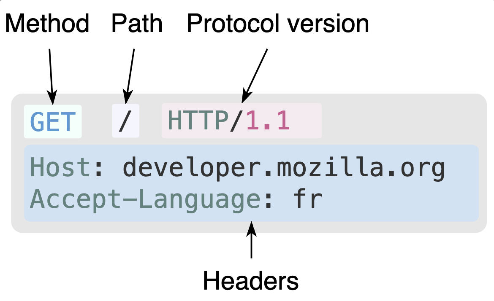

# HTTP概述

HTTP 是一种用作获取诸如 HTML 文档这类资源的协议。

> 受益于 HTTP 的可扩展性，时至今日，它不仅可以用来获取超文本文档，还可用来获取图片、视频或者向服务端发送信息，还可以用来获取文档的部分内容，以便按需更新 Web 页面。

客户端与服务端之间通过交换一个个独立的消息（而非数据流）进行通信。
- 请求（request）: 由客户端发出的消息
- 响应（response）: 由服务端发出的应答消息


## 基于HTTP的系统组成


HTTP 是一个客户端—服务器协议：请求由一个实体，即用户代理（user agent），或是一个可以代表它的代理方（proxy）发出。

> 大多数情况下，这个用户代理都是一个 Web 浏览器，不过它也可能是任何东西，比如一个爬取网页来充实、维护搜索引擎索引的机器爬虫。

每个请求都会被发送到一个服务器，它会处理这个请求并提供一个称作响应的回复。

> 在客户端与服务器之间，还有许许多多的被称为代理的实体，履行不同的作用，例如充当网关或缓存。


***客户端：用户代理***

1. 为了展现一个网页，浏览器需要发送最初的请求来获取描述这个页面的 HTML 文档。
2. 解析文档，并发送数个其他请求，相应地获取可执行脚本、展示用的布局信息（CSS）以及其他页面内的子资源（一般是图片和视频等）。
3. Web 浏览器将这些资源整合到一起，展现出一个完整的文档，即网页。
4. 在之后的阶段，浏览器中执行的脚本可以获取更多资源，并且浏览器会相应地更新网页。


***Web服务器***

- 它负责提供客户端所请求的文档。
> 服务器可以表现为仅有一台机器，但实际上，它可以是共享负载的一组服务器集群（负载均衡）或是其他类型的软件（如缓存、数据库服务、电商服务等），按需完整或部分地生成文档。

***代理***

- 在 Web 浏览器和服务器之间，有许多计算机和设备参与传递了 HTTP 消息。
    - 依靠 Web 技术栈的层次化的结构，传递过程中的多数操作都位于**传输层**、**网络层**或**物理层**，它们对于 HTTP 应用层而言就是透明的。
    - 一部分实体在**应用层**参与消息传递，一般被称为代理（Proxy）。
- 透明代理: 即转发它们收到的请求并不做任何修改
    > 不透明代理:将它传递给服务端之前使用一些手段修改这个请求。
- 代理可以发挥很多种作用：
    - 缓存（可以是公开的也可以是私有的，如浏览器的缓存）
    - 过滤（如反病毒扫描、家长控制...）
    - 负载均衡（让多个服务器服务不同的请求）
    - 认证（控制对不同资源的访问）
    - 日志（使得代理可以存储历史信息）


## HTTP的基本性质

- 简约: HTTP 报文能够被人读懂并理解
- 可扩展: HTTP标头
- 无状态，但并非无会话: 利用标头的扩展性可借助HTTP Cookie实现有状态的会话
- HTTP和连接: 使用TCP有连接的可靠通信方式

## HTTP流

1. 打开一个TCP连接: TCP连接被用来发送一条或多条请求，以及接受响应消息
2. 发送一个HTTP报文
```HTTP
GET / HTTP/1.1
Host: developer.mozilla.org
Accept-Language: zh
```

3. 读取服务端返回的报文信息

```HTTP
HTTP/1.1 200 OK
Date: Sat, 09 Oct 2010 14:28:02 GMT
Server: Apache
Last-Modified: Tue, 01 Dec 2009 20:18:22 GMT
ETag: "51142bc1-7449-479b075b2891b"
Accept-Ranges: bytes
Content-Length: 29769
Content-Type: text/html

<!DOCTYPE html>…（此处是所请求网页的 29769 字节）
```

4. 关闭连接或为后续连接请求重用连接


## HTTP报文

HTTP/1.1 以及更早的 HTTP 协议报文都是语义可读的。在 HTTP/2 中，这些报文被嵌入到了一个新的二进制结构，帧。可用 HTTP/1.1 格式来理解 HTTP/2 报文。
> 帧允许实现很多优化，比如报文标头的压缩以及多路复用。

***请求***




- HTTP 方法
    - 一个动词，像 GET、POST 等
    - 一个名词，像 OPTIONS、HEAD 等，来定义客户端执行的动作。
- 要获取的那个资源的路径: 去除了当前上下文中显而易见的信息之后的URL 
- HTTP 协议版本号
- 为服务端表达其他信息的可选标头。
- 请求体（body），类似于响应中的请求体
> 一些像 POST 这样的方法，请求体内包含需要了发送的资源

***回应***


- HTTP协议版本号
- 状态码: 指明对应请求已成功执行与否，以及不成功时相应的原因
- 状态信息: 这个信息是一个不权威、简短的状态码描述。
- HTTP 标头，与请求标头类似。
- 可选项，一个包含了被获取资源的主体。


# HTTP缓存

## 概览

HTTP缓存会存储与请求关联的响应，并将存储的响应复用于后续请求。
> 当响应可复用时，不需要将请求传递到源服务器，
> - 客户端和缓存越近，响应速度就越快。
> - 源服务器不需要处理请求

## 不同种类的缓存

### 私有缓存

私有缓存是绑定到特定客户端的缓存——通常是浏览器缓存。
```HTTP
Cache-Control: private
```

### 共享缓存

共享缓存位于客户端和服务器之间，可以存储能在用户之间共享的响应。

共享缓存可以进一步细分为代理缓存和托管缓存。

***代理缓存***


***托管缓存***

托管缓存由服务开发人员明确部署，以降低源服务器负载并有效地交付内容。示例包括反向代理、CDN 和 service worker 与缓存 API 的组合。

<!-- NOTE: 还有很多内容 -->


# HTTP Cookie

HTTP Cookie（也叫 Web Cookie 或浏览器 Cookie）是服务器发送到用户浏览器并保存在本地的一小块数据。
浏览器会存储 cookie 并在下次向同一服务器再发起请求时携带并发送cookie到服务器上。
通常，它用于告知服务端两个请求是否来自同一浏览器——如保持用户的登录状态。
> Cookie 使基于无状态的 HTTP 协议记录稳定的状态信息成为了可能。


***cookie的作用***

- 会话状态管理：如用户登录状态、购物车、游戏分数或其他需要记录的信息
- 个性化设置：如用户自定义设置、主题和其他设置
- 浏览器行为跟踪：如跟踪分析用户行为等


## 创建Cookie

1. 服务器收到 HTTP 请求后，服务器可以在响应标头里面添加一个或多个 Set-Cookie 选项。
2. 浏览器收到响应后通常会保存下 Cookie，并将其放在 HTTP Cookie 标头内，向同一服务器发出请求时一起发送。


***Set-Cookie和Cookie标头***


服务器使用 Set-Cookie 响应头部向用户代理（一般是浏览器）发送 Cookie 信息

```HTTP
Set-Cookie: <cookie-name>=<cookie-value>
```


***案例***

- 指示服务器发送标头告知客户端存储一对 cookie：
```HTTP
HTTP/1.0 200 OK
Content-type: text/html
Set-Cookie: yummy_cookie=choco
Set-Cookie: tasty_cookie=strawberry

[页面内容]
```

- 现在，对该服务器发起的每一次新请求，浏览器都会将之前保存的 Cookie 信息通过 Cookie 请求头部再发送给服务器。

```HTTP
GET /sample_page.html HTTP/1.1
Host: www.example.org
Cookie: yummy_cookie=choco; tasty_cookie=strawberry
```

## 定义Cookie的什么周期

Cookie 的生命周期可以通过两种方式定义：

- 会话期 Cookie 会在当前的会话结束之后删除
> 浏览器定义了“当前会话”结束的时间，一些浏览器重启时会使用会话恢复。这可能导致会话 cookie 无限延长。

- 持久性 Cookie 在过期时间（Expires）指定的日期或有效期（Max-Age）指定的一段时间后被删除。

例如：
```HTTP
Set-Cookie: id=a3fWa; Expires=Wed, 21 Oct 2015 07:28:00 GMT;
```
> Expires属性设定的日期和时间只与客户端相关，而不是服务端。


## 限制访问cookie

有两种方法可以确保 Cookie 被安全发送，并且不会被意外的参与者或脚本访问：
- Secure属性和
> 只应通过被 HTTPS 协议加密过的请求发送给服务端。
- HttpOnly 属性
> JavaScript Document.cookie API 无法访问带有 HttpOnly 属性的 cookie

案例：
```HTTP
Set-Cookie: id=a3fWa; Expires=Wed, 21 Oct 2015 07:28:00 GMT; Secure; HttpOnly

```

## 定义Cookie发送的位置

Domain 和 Path 标识定义了 Cookie 的作用域：即允许 Cookie 应该发送给哪些 URL。

- Domain属性：指定了哪些域名下的主机可以接受 Cookie。
> 不指定Domain，该属性默认为同一host设置cookie，不包含子域名。否则包含

- Path属性：指定了一个 URL 路径，该 URL 路径必须存在于请求的 URL 中，以便发送 Cookie 标头
> 子路径也会被匹配。


# 典型的HTTP会话

在像 HTTP 这样的客户端——服务器（Client-Server）协议中，会话分为三个阶段：

1. 客户端建立一条 TCP 连接（如果传输层不是 TCP，也可以是其他适合的连接）。
2. 客户端发送请求并等待应答。
3. 服务器处理请求并送回应答，回应包括一个状态码和对应的数据。

> 从 HTTP/1.1 开始，连接在完成第三阶段后不再关闭，客户端可以再次发起新的请求。这意味着第二步和第三步可以连续进行数次。


## 建立连接

在客户端——服务器协议中，连接是由客户端发起建立的。
> 在 HTTP 中打开连接意味着在底层传输层启动连接，通常是 TCP。

使用 TCP 时，HTTP 服务器的默认端口号是 80，另外还有 8000 和 8080 也很常用。
> 页面的 URL 会包含域名和端口号，但当端口号为 80 时可以省略。


## 发送客户端请求

客户端请求由一系列文本指令组成，并使用 CRLF 分隔（回车，然后是换行），它们被划分为三个块：

1. 第一行包括请求方法及请求参数：
    - 文档路径，不包括协议和域名的绝对路径 URL
    - 使用的 HTTP 协议版本
2. 接下来的行每一行都表示一个 HTTP 标头，为服务器提供关于所需数据的信息（例如语言，或 MIME 类型），或是一些改变请求行为的数据（例如当数据已经被缓存，就不再应答）。这些 HTTP 标头形成一个以空行结尾的块。
3. 最后一块是可选数据块，包含更多数据，主要被 POST 方法所使用。


发送表单的结果案例：

```HTTP
POST /contact_form.php HTTP/1.1
Host: developer.mozilla.org
Content-Length: 64
Content-Type: application/x-www-form-urlencoded

name=Joe%20User&request=Send%20me%20one%20of%20your%20catalogue

```


请求方法

HTTP 定义了一组请求方法用来指定对目标资源的行为。
> 它们一般是名词，但这些请求方法有时会被叫做 HTTP 动词。

最常用的请求方法是 GET 和 POST：
- GET 方法请求指定的资源。GET 请求应该只被用于获取数据。
- POST 方法向服务器发送数据，因此会改变服务器状态。
> 这个方法常在 HTML 表单中使用。

## 服务器响应架构

当收到用户代理发送的请求后，Web 服务器就会处理它，并最终送回一个响应。

与客户端请求很类似，服务器响应由一系列文本指令组成，并使用 CRLF 分隔，它们被划分为三个不同的块：

1. 第一行是状态行
    - 使用的 HTTP 协议版本
    - 然后是一个状态码（及其人类可读的描述文本）。
        - 信息型响应
        - 成功响应
        - 重定向
        - 客户端错误和服务端错误。
        > HTTP 响应状态码用来表示一个 HTTP 请求是否成功完成
2. 接下来每一行都表示一个 HTTP 标头，为客户端提供关于所发送数据的一些信息（如类型、数据大小、使用的压缩算法、缓存指示）。
3. 最后一块是数据块，包含了响应的数据（如果有的话）。


案例：

成功的网页响应
```HTTP
HTTP/1.1 200 OK
Content-Type: text/html; charset=utf-8
Content-Length: 55743
Connection: keep-alive
Cache-Control: s-maxage=300, public, max-age=0
Content-Language: en-US
Date: Thu, 06 Dec 2018 17:37:18 GMT
ETag: "2e77ad1dc6ab0b53a2996dfd4653c1c3"
Server: meinheld/0.6.1
Strict-Transport-Security: max-age=63072000
X-Content-Type-Options: nosniff
X-Frame-Options: DENY
X-XSS-Protection: 1; mode=block
Vary: Accept-Encoding,Cookie
Age: 7

<!DOCTYPE html>
<html lang="en">
<head>
  <meta charset="utf-8">
  <title>A simple webpage</title>
</head>
<body>
  <h1>Simple HTML webpage</h1>
  <p>Hello, world!</p>
</body>
</html>
```

请求资源已被永久移动的网页响应：

```HTTP
HTTP/1.1 301 Moved Permanently
Server: Apache/2.4.37 (Red Hat)
Content-Type: text/html; charset=utf-8
Date: Thu, 06 Dec 2018 17:33:08 GMT
Location: https://developer.mozilla.org/ （目标资源的新地址，服务器期望用户代理去访问它）
Keep-Alive: timeout=15, max=98
Accept-Ranges: bytes
Via: Moz-Cache-zlb05
Connection: Keep-Alive
Content-Length: 325 (如果用户代理无法转到新地址，就显示一个默认页面)

<!DOCTYPE html>… (包含一个网站自定义页面，帮助用户找到丢失的资源)
```


请求资源不存在的网页响应
```HTTP
HTTP/1.1 404 Not Found
Content-Type: text/html; charset=utf-8
Content-Length: 38217
Connection: keep-alive
Cache-Control: no-cache, no-store, must-revalidate, max-age=0
Content-Language: en-US
Date: Thu, 06 Dec 2018 17:35:13 GMT
Expires: Thu, 06 Dec 2018 17:35:13 GMT
Server: meinheld/0.6.1
Strict-Transport-Security: max-age=63072000
X-Content-Type-Options: nosniff
X-Frame-Options: DENY
X-XSS-Protection: 1; mode=block
Vary: Accept-Encoding,Cookie
X-Cache: Error from cloudfront
<!DOCTYPE html>… (包含一个站点自定义 404 页面，帮助用户找到丢失的资源)

```
