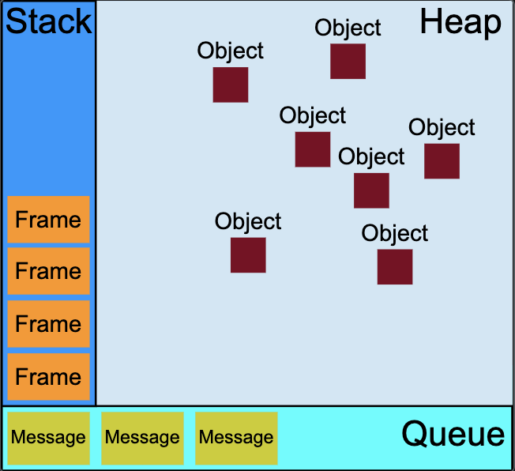

<!-- highLevel.md -->
[toc]

# 内存管理


**内存生命周期**
- 分配内存
    > JavaScript 在定义变量时就完成了内存分配。
- 使用分配到的内存（读写）
- 不要时将其释放/归还

---

两种内存释放机制:

***引用计数垃圾回收***

把“对象是否不再需要”简化定义为“对象有没有其他对象引用到它”。如果没有引用指向该对象（零引用），对象将被垃圾回收机制回收。

> 在内存管理的环境中，一个对象如果有访问另一个对象的权限（隐式或者显式），叫做一个对象引用另一个对象。
> - 显示引用：一个 Javascript 对象具有对它属性的引用
> - 隐示引用：一个 Javascript 对象具有对它原型的引用
> > 在这里，“对象”的概念不仅特指 JavaScript 对象，还包括函数作用域（或者全局词法作用域）。

循环引用: 两个对象互相引用，形成了一个循环，存在引用无法被回收
缓冲

***标记-清除算法***


把“对象是否不再需要”简化定义为“对象是否可以获得”。


- 假定设置一个叫做根（root）的对象（在 Javascript 里，根是全局对象）。
- 垃圾回收器将定期从根开始，找所有从根开始引用的对象
- 然后找这些对象引用的对象……从根开始，垃圾回收器将找到所有可以获得的对象和收集所有不能获得的对象。
- 将不可获得的对象进行回收


# 并发模型和事件循环




- 栈：函数调用形成了一个由若干帧组成的栈。
- 堆：对象被分配在堆中，堆是一个用来表示一大块（通常是非结构化的）内存区域的计算机术语。
- 队列：一个 JavaScript 运行时包含了一个待处理消息的消息队列。每一个消息都关联着一个用以处理这个消息的回调函数。
> 每一个消息完整地执行后，其他消息才会被执行。不会存在并发操作  
> JavaScript 的事件循环模型与许多其他语言不同的一个非常有趣的特性是，它永不阻塞。处理 I/O 通常通过事件和回调来执行


***事件循环***

函数的处理会一直进行到执行栈再次为空为止；然后事件循环将会处理队列中的下一个消息（如果还有的话）。

```JavaScript
while (queue.waitForMessage()) {
  queue.processNextMessage();
}
```


消息的产生：每当一个事件发生并且有一个事件监听器绑定在该事件上时，一个消息就会被添加进消息队列。如果没有事件监听器，这个事件将会丢失。

过程：在事件循环期间的某个时刻，运行时会从最先进入队列的消息开始处理队列中的消息。被处理的消息会被移出队列，并作为输入参数来调用与之关联的函数。并会为该函数创造一个新的栈帧。


