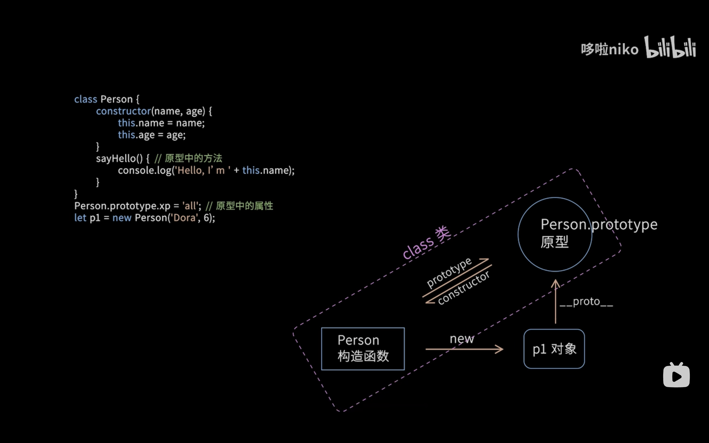

<!-- javascript object.md -->
# javascript对象

## 基础

一个对象就是一系列属性的集合，一个属性包含一个名和一个值。一个属性的值可以是函数，这种情况下属性也被称为方法。


```javascript
//访问方式
person.lastname = person["lastname"];

```
> 通过方括号标记访问在属性名称是动态判定（属性名只有到运行时才能判定）。
> 可使用变量作为下标
> 方括号中的所有键都将转换为字符串类型，因为 JavaScript 中的对象只能使用 String 类型作为键类型。


**枚举一个对象的所有属性值**

- for...in: 依次访问一个对象及其原型链中所有可枚举的属性。
- Object.keys(o):   该方法返回对象o自身包含（不包括原型中）的所有可枚举属性的名称的数组。
- Object.getOwnPropertyNames(o): 返回对象o自身包含（不包括原型中）的所有属性 (无论是否可枚举) 的名称的数组。


**创建新对象**

- 使用字面值

对象字面值：对象由花括号分隔。在括号内部，对象的属性以名称和值对的形式 (name : value) 来定义，属性由逗号分隔

```javascript
var obj = {
  property_1: value_1, // property_# 可以是一个标识符...
  2: value_2, // 或一个数字...
  ["property" + 3]: value_3, //  或一个可计算的 key 名...
  // ...,
  "property n": value_n,
}; // 或一个字符串
```

- 使用构造函数
    - 通过创建一个构造函数来定义对象的类型。首字母大写是非常普遍而且很恰当的惯用法。
    - 通过 new 创建对象实例。

```javascript
// 定义构造函数
function Person(name, age) {
  this.name = name; // 使用this定义属性
  this.age = age;
  
  // 定义方法
  this.sayHello = function() {
    console.log('Hello, my name is ' + this.name);
  };
}

// 使用构造函数创建对象
const person1 = new Person('Alice', 25);
const person2 = new Person('Bob', 30);

// 调用方法
person1.sayHello(); // 输出: Hello, my name is Alice
person2.sayHello(); // 输出: Hello, my name is Bob

// 访问属性
console.log(person1.age); // 输出: 25
console.log(person2.age); // 输出: 30
```
> 你总是可以为之前定义的对象增加新的属性。就像为关联数组添加键值对一样简单，例如person1.sex = man;


- 使用Object.create方法

它允许你为创建的对象选择一个原型对象，而不用定义构造函数。

```javascript
var newObjectName = Object.create(oldObjectName)
```

> 使用Object.setPrototypeOf()
> 允许修改现有对象的__proto__内部属性。


- 使用类

```javascript
class {
    constructor(){
        ...
    }
    ...
}
```

**删除属性**

你可以用 delete 操作符删除一个不是继承而来的属性。
```javascript
delete objectname.attributename
```
> 如果一个全局变量不是用 var 关键字声明的话，你也可以用 delete 删除它：


## 继承

所有的 JavaScript 对象至少继承于一个对象。被继承的对象被称作原型，并且继承的属性可通过构造函数的 prototype 对象找到。

可以通过 prototype属性为之前定义的对象类型增加属性。这为该类型的所有对象，而不是仅仅一个对象增加了一个属性。


1. 原型链继承
2. ES6继承


## javascript类


JavaScript 是一个基于原型的语言——一个对象的行为取决于它自身的属性及其原型的属性。

类的三个特征

- 构造函数
- 实例方法和实例属性
- 静态方法和静态属性


**声明一个类**

```js
//定义类
class className {
  // 构造函数
  constructor() {
    // 构造函数体
  }
  // 实例字段
  myField = "foo";
  // 实例方法
  myMethod() {
    // myMethod 体
  }
  // 静态字段
  static myStaticField = "bar";
  // 静态方法
  static myStaticMethod() {
    // myStaticMethod 体
  }
  // 静态块
  static {
    // 静态初始化代码
  }
  // 字段、方法、静态字段、静态方法、静态块都可以使用私有形式
  #myPrivateField = "bar";
}

//使用类
var objName = new className();
```

> 类声明不会被提升


- 类表达式
```js
var variable = class{
    constructor() {...}
    ...
}
```


---

**getter和setter方法**


一个 getter 是一个获取某个特定属性的值的方法。一个 setter 是一个设定某个属性的值的方法。

getter 字段允许我们像访问“实际属性”一样操作某些东西。


```javascript
class Color {
  constructor(r, g, b) {
    this.values = [r, g, b];
  }
  get red() {
    return this.values[0];
  }
  set red(value) {
    this.values[0] = value;
  }
}

const red = new Color(255, 0, 0);
red.red = 0;
console.log(red.red); // 0
```
> 这就像是对象有了一个 red 属性——但实际上，实例上并没有这样的属性！实例只有两个方法，分别以 get 和 set 为前缀，而这使得我们可以像操作属性一样操作它们。


---

**继承**

- 继承的要素
    - 使用 extends 关键字。
    - super() 方法用于调用父类的构造函数。

> 除了私有属性，都会被继承
    

- 继承的方式
    - 使用原型链继承
    - 使用ES6类继承

---

**静态属性**

使用static修饰

- 静态属性
    > 静态属性与实例属性的区别在于：它们有 static 前缀，且它们不能从实例中访问。
- 静态方法
- 静态getter和setter
- 静态代码块
    > 在类第一次加载时运行的代码块。


---


**prototype**

每个 JavaScript 对象都有一个与之关联的原型对象，通过原型对象，可以实现属性和方法的共享，从而减少内存占用。
> 即所有的 JavaScript 对象都会从一个 prototype（原型对象）中继承属性和方法。

- 原型是一个对象，它是其他对象的模板或蓝图。
- 当一个对象试图访问一个属性或方法时，如果在该对象自身没有找到，JavaScript 会沿着原型链向上查找，直到找到对应的属性或方法，或者达到原型链的顶端 null 为止。

**\__proto__ 属性**

每个 JavaScript 对象（除了 null）都自动拥有一个隐藏的属性 __proto__，它指向该对象的原型对象。


```js
function Person(name) {
    this.name = name;
}

// 动态地修改对象的原型，这样可以影响到所有基于该原型创建的对象
Person.prototype.sayHello = function() {
    console.log("Hello, my name is " + this.name);
};

let alice = new Person("Alice");
alice.sayHello(); // 输出: Hello, my name is Alice
```
**设置原型**

1. **Object.create方法**

Object.create 方法允许你创建一个新对象，并将其原型设置为指定的对象。

```js
let personPrototype = {
    sayHello: function() {
        console.log("Hello, my name is " + this.name);
    }
};

let alice = Object.create(personPrototype);
alice.name = "Alice";
alice.sayHello(); // 输出: Hello, my name is Alice
```

2. 使用构造函数

所有的函数都有一个名为 prototype 的属性。当你调用一个函数作为构造函数时，这个属性被设置为新构造对象的原型（按照惯例，在名为 __proto__ 的属性中）。


> prototype的原理：(类似于单链表)
> 1. JavaScript 对象有一个指向一个原型对象的链，即指向该对象的父类。
> 2. 继承：当试图访问一个对象的属性时，它不仅仅在该对象上搜寻，还会搜寻该对象的原型，以及该对象的原型的原型，依次层层向上搜索，直到找到一个名字匹配的属性或到达原型链的末尾。

---

**类、构造函数和原型之间的关系**

类是构造函数和原型的语法糖，本质上没有区别，只是封装📦的好看




图中代码等价于 不使用class而是单独使用构造函数和原型 

```javascript
// 定义一个构造函数 Person，用于创建具有 name 和 age 属性的对象
Function Person(name,age){
    this.name = name;
    this.age = age;
}
// 在 Person 的原型上定义一个属性 xp，所有 Person 的实例都会共享这个属性
Person.prototype.xp = 'all';
// 在 Person 的原型上定义一个方法 sayHello
Person.prototype.sayhello() = function(){
    console.log("Hello,I'm " + this.name):
}
// 创建一个 Person 类的实例 p1，并传入 name 和 age 参数
let p1 = new Person('Dora',6)
```


***函数与原型的关系***

- 所有的普通函数（包括函数表达式和函数声明）都默认有一个 prototype 属性，即使不被用作构造函数。
    - 每个函数所对应的原型中，都有一个constructor属性指向该函数
> javascript中所有的函数都有可能或潜力成为构造函数
- 函数的 prototype 属性在作为构造函数使用时才会派上用场，指向它的原型对象。
> 箭头函数没有 prototype 属性，因为它们不能被用作构造函数。

# 使用promise


Promise 是一个对象，它代表了一个异步操作的最终完成或者失败。

**创建一个promise对象**

```javascript
new Promise(function (resolve, reject) {
    // 要做的事情...
});
```

- Promise 构造函数接受一个函数作为参数，该函数是同步的并且会被立即执行，被称为起始函数
- 起始函数包含两个参数 resolve 和 reject，分别表示 Promise 成功和失败的状态。
    > resolve 和 reject 都是函数
    - 起始函数执行成功时，它应该调用 resolve 函数并传递成功的结果
    > 成功执行后使用`resolve(message)`传递信息，可以是一个变量
    - 当起始函数执行失败时，它应该调用 reject 函数并传递失败的原因。
    > 执行失败后使用`reject(error_message)`传递失败的信息
- Promise 构造函数返回一个 Promise 对象，该对象具有以下几个方法：
    - then：用于处理 Promise 成功状态的回调函数。
    > resolve() 中可以放置一个参数用于向下一个 then 传递一个值
    - catch：用于处理 Promise 失败状态的回调函数。
    - finally：无论 Promise 是成功还是失败，都会执行的回调函数。
    > 这三个方法的参数都是一个函数
    > 其参数value用于接受resolve和reject的message


**返回一个promise对象**

```javascript
function function_name() {
    return new Promise(function (resolve, reject) {
        if(...){
        resolve(success_message)
        }
        else{
        reject(error_message)
        }
    });
}

function_name().then(function (valus){
    ...
}).catch(function (value){
    ...
}).finally(function (){
    ...
})
```

    

**异步函数**

- 异步函数 async function 中可以使用 await 指令
- await 指令后必须跟着一个 Promise，异步函数会在这个 Promise 运行中暂停，直到其运行结束再继续运行。
- 处理异常的机制将用 try-catch 块实现


```javascript
async function asyncFunc() {
    await function_name();
    await function_name();
    await function_name();
}
asyncFunc();
```


# 迭代器


迭代器是通过使用 next() 方法实现了迭代器协议的任何一个对象，该方法返回具有两个属性的对象：

- `value`: 迭代序列的下一个值。
- `done`: 如果已经迭代到序列中的最后一个值，则它为true。


**生成器函数**

允许你定义一个非连续执行的函数作为迭代算法。

- 生成器函数使用 function* 语法编写。
- 生成器函数的每次执行会暂停在 yield 语句，并返回yield后的变量值，下一次调用 .next() 时会从暂停的地方继续执行。


**可迭代对象**

可迭代对象：一个对象拥有迭代行为，比如在 for...of 中会循环一些值

- 必须实现 Symbol.iterator 方法，这个方法返回一个迭代器对象。
- 必须实现 next() 方法，next() 方法返回一个对象，该对象包含两个属性：
    - value：当前迭代步骤的值。
	- done：布尔值，指示迭代是否结束。


自定义可迭代对象
```javascript
//定义
var myIterable = {
  *[Symbol.iterator]() {
    yield 1;
    yield 2;
    yield 3;
  },
};


//调用
for (let value of myIterable) {
  console.log(value);
}
// 1
// 2
// 3

[...myIterable]; // [1, 2, 3]
```


**高级生成器**

- 生成器会按需计算它们 yield 的值
- next() 方法也接受一个参数用于修改生成器内部状态。传递给 next() 的参数值会被 yield 接收。
    > 使用`outerValue = yield innerValue`接收传入值


