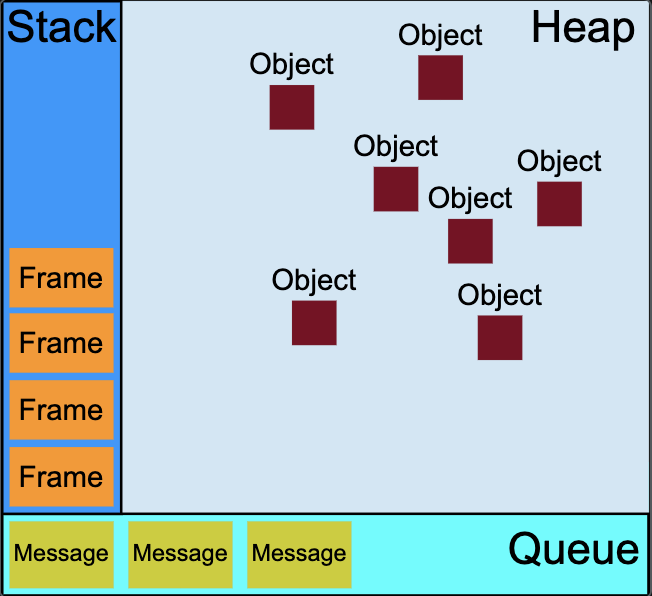

<!-- highLevel.md -->
[toc]


# 迭代器


迭代器是通过使用next()方法实现了迭代器协议的任何一个对象，该方法返回具有两个属性的对象：
- `value`: 迭代序列的下一个值。
- `done`: 如果已经迭代到序列中的最后一个值，则它为true。


1. 生成器函数

允许你定义一个非连续执行的函数作为迭代算法。

- 生成器函数使用`function*`语法编写。
- 生成器函数的每次执行会暂停在yield语句，并返回yield后的变量值，下一次调用`next()`时会从暂停的地方继续执行。


2. 可迭代对象

可迭代对象：一个对象拥有迭代行为，比如在 for...of 中会循环一些值

- 必须实现`Symbol.iterator`方法，这个方法返回一个迭代器对象。
- 必须实现`next()`方法，`next()`方法返回一个对象，该对象包含两个属性：
    - `value`：当前迭代步骤的值
	- `done`：布尔值，指示迭代是否结束


3. 自定义可迭代对象

```javascript
//定义
var myIterable = {
  *[Symbol.iterator]() {
    yield 1;
    yield 2;
    yield 3;
  },
};


//调用
for (let value of myIterable) {
  console.log(value);
}
// 1
// 2
// 3

[...myIterable]; // [1, 2, 3]
```

4. 高级生成器

- 生成器会按需计算它们 yield 的值
- next() 方法也接受一个参数用于修改生成器内部状态。传递给 next() 的参数值会被 yield 接收。
    > 使用`outerValue = yield innerValue`接收传入值


# 异步编程

异步编程技术使你的程序可以在执行一个可能长期运行的任务的同时继续对其他事件做出反应而不必等待任务完成。与此同时，你的程序也将在任务完成后显示结果。

- 异步

同步按你的代码顺序执行，异步不按照代码顺序执行，异步的执行效率更高。

- 回调函数

回调函数就是一个函数，它是在我们启动一个异步任务的时候就告诉它：等你完成了这个任务之后要干什么。，调用相对应的回调函数，这样一来主线程几乎不用关心异步任务的状态了，他自己会善始善终。


## 计时函数

- setInterval() 

```javascript
// 间隔指定的毫秒数不停地执行指定的代码
setInterval(fun(){
    ...
},delay)
//或
setInterval(function_name, delay, [param1, param2, ...])
```


- setTimeout()

```javascript
// 在指定的毫秒数后执行指定代码
setTimeout(fun(){
    ...
},time)

```

## 回调函数


```javascript
function fetchData(function_name) {
    setTimeout(() => {
        // 在这里调用参数中的函数
        callback("Data fetched!");
    }, 2000);
}

fetchData((data) => {
    console.log(data); // 2秒后输出: Data fetched!
});
```

可能会倒是回调地狱（代码难以维护）


## promise对象


Promise是一个对象，它代表了一个异步操作的最终完成或者失败。


```javascript
function function_name() {
    ...
    // 调用promise类的构造函数，返回一个promise对象
    return new Promise(function (resolve, reject) {
        if(...){
        // 使用resolve传递成功信息
        resolve(success_message)
        }
        else{
        // 使用resolve传递失败信息
        reject(error_message)
        }
    });
}

// 这里的value是resolve和reject传来的参数
function_name().then(function (value){
    ...
}).catch(function (value){
    ...
}).finally(function (){
    ...
})
```


1. 起始函数

Promise构造函数接受一个函数作为参数，该函数是同步的并且会被立即执行，被称为起始函数

2. 起始函数的参数

起始函数包含两个参数`resolve`和`reject`，它们都是函数
- `resolve(message)`
    - 将Promise的状态从pending变为fulfilled（成功）
    - 传递任何值到后续的`.then()`中
- `reject(error_message)`
    - 将Promise的状态从pending变为rejected（失败）
    - 可以传递任何值（通常是错误信息或错误对象）到`.catch()`中


3. promise对象

Promise构造函数返回一个Promise对象，该对象具有以下几个方法：

- then(fun)：用于处理Promise成功状态的回调函数。
- catch(fun)：用于处理Promise失败状态的回调函数。
- finally(fun)：无论Promise是成功还是失败，都会执行的回调函数。

这三个方法的参数都是一个函数，其参数value用于接受函数resolve和reject的传来的参数


## 异步函数


async/await 是基于 Promise 的语法糖，使异步代码看起来像同步代码。


```javascript
async function asyncFunc() {
    await function_name();
    await function_name();
    await function_name();
}
asyncFunc();
```

- sync: 标志一个函数为异步函数
- 该函数返回一个Promise对象
- 三个await子函数是顺序执行的
- await 指令后必须跟着一个 Promise，异步函数会在这个Promise运行中暂停，直到其运行结束再继续运行。
- 处理异常的机制将用 try-catch 块实现


# 内存管理


## 内存生命周期
1. 分配内存
    
JavaScript 在定义变量时就完成了内存分配。

2. 使用分配到的内存（读写）

3. 不要时将其释放/归还


## 内存释放机制

### 引用计数垃圾回收

如果没有引用指向该对象，表示不再需要该对象，将被垃圾回收机制回收。

在内存管理的环境中，一个对象如果有访问另一个对象的权限（隐式或者显式），叫做一个对象引用另一个对象。
- 显示引用：一个 Javascript 对象具有对它属性的引用
- 隐示引用：一个 Javascript 对象具有对它原型的引用
> 在这里，“对象”的概念不仅特指 JavaScript 对象，还包括函数作用域（或者全局词法作用域）。

循环引用: 两个对象互相引用，形成了一个循环，存在引用无法被回收

### 标记-清除算法


把“对象是否不再需要”简化定义为“对象是否可以获得”。


- 假定设置一个叫做根（root）的对象（在 Javascript 里，根是全局对象）。
- 垃圾回收器将定期从根开始，找所有从根开始引用的对象
- 然后找这些对象引用的对象……从根开始，垃圾回收器将找到所有可以获得的对象和收集所有不能获得的对象。
- 将不可获得的对象进行回收


# 并发模型和事件循环




- 栈：函数调用形成了一个由若干帧组成的栈。
- 堆：对象被分配在堆中，堆是一个用来表示一大块（通常是非结构化的）内存区域的计算机术语。
- 队列：一个 JavaScript 运行时包含了一个待处理消息的消息队列。每一个消息都关联着一个用以处理这个消息的回调函数。
> 每一个消息完整地执行后，其他消息才会被执行。不会存在并发操作  
> JavaScript 的事件循环模型与许多其他语言不同的一个非常有趣的特性是，它永不阻塞。处理 I/O 通常通过事件和回调来执行


***事件循环***

函数的处理会一直进行到执行栈再次为空为止；然后事件循环将会处理队列中的下一个消息（如果还有的话）。

```JavaScript
while (queue.waitForMessage()) {
  queue.processNextMessage();
}
```


消息的产生：每当一个事件发生并且有一个事件监听器绑定在该事件上时，一个消息就会被添加进消息队列。如果没有事件监听器，这个事件将会丢失。

过程：在事件循环期间的某个时刻，运行时会从最先进入队列的消息开始处理队列中的消息。被处理的消息会被移出队列，并作为输入参数来调用与之关联的函数。并会为该函数创造一个新的栈帧。

