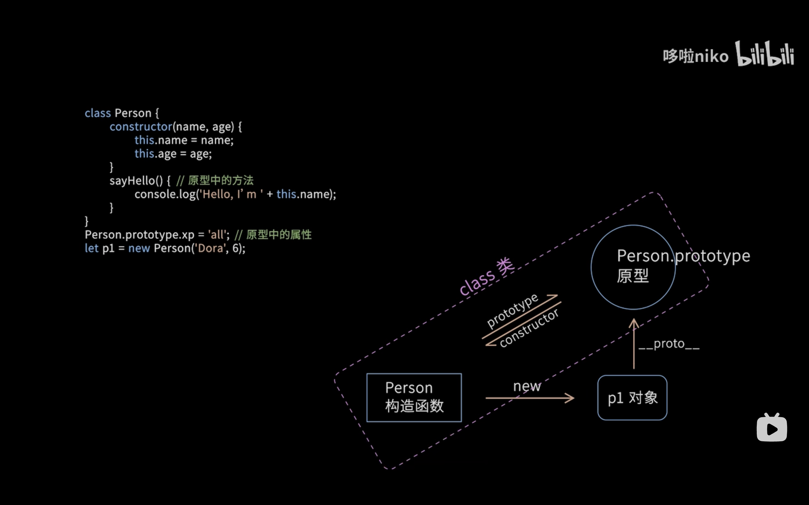

<!-- javascript object.md -->
# javascript对象


一个对象就是一系列属性的集合
- 一个属性包含一个名和一个值。
- 一个属性的值可以是函数，这种情况下属性也被称为方法。


## 创建对象

###  使用字面值

对象字面值：对象由花括号分隔。在括号内部，对象的属性以名称和值对的形式 (name : value) 来定义，属性由逗号分隔

```javascript
var obj = {
  property_1: value_1, // property_# 可以是一个标识符...
  2: value_2, // 或一个数字...
  ["property" + 3]: value_3, //  或一个可计算的 key 名...
  // ...,
  "property n": value_n,
}; // 或一个字符串
```

###  使用构造函数

1. 通过创建一个构造函数来定义对象的类型，首字母大写。
2. 通过 new 创建对象实例。

```javascript
// 定义构造函数
function Person(name, age) {
  this.name = name; // 使用this定义属性
  this.age = age;
  
  // 定义方法
  this.sayHello = function() {
    console.log('Hello, my name is ' + this.name);
  };
}

// 使用构造函数创建对象
const person1 = new Person('Alice', 25);
const person2 = new Person('Bob', 30);

// 调用方法
person1.sayHello(); // 输出: Hello, my name is Alice
person2.sayHello(); // 输出: Hello, my name is Bob

// 访问属性
console.log(person1.age); // 输出: 25
console.log(person2.age); // 输出: 30
```
> 可以为之前定义的对象增加新的属性。就像为关联数组添加键值对一样简单，例如person1.sex = man;


### 使用Object.create方法

它允许你为创建的对象选择一个原型对象。

```javascript
var newObjectName = Object.create(oldObjectName)
```

> 使用Object.setPrototypeOf()
> 允许修改现有对象的__proto__内部属性。


### 使用类

```javascript
class {
    constructor(){
        ...
    }
    ...
}
```

将在后面介绍


## 访问方式

```javascript
//访问方式
person.lastname = person["lastname"];
```
- 通过方括号标记访问在属性名称是动态判定（属性名只有到运行时才能判定）。
- 可使用变量作为下标
- 方括号中的所有键都将转换为字符串类型，因为JavaScript中的对象只能使用String类型作为键类型。


## 遍历对象

```javascript

// 依次访问一个对象及其原型链中所有可枚举的属性。
for...in 

// 该方法返回对象o自身包含（不包括原型中）的所有可枚举属性的名称的数组。
Object.keys(object)

// 返回对象o自身包含（不包括原型中）的所有属性 (无论是否可枚举) 的名称的数组。
Object.getOwnPropertyNames(object)

```


## 删除属性

你可以用 delete 操作符删除一个不是继承而来的属性。
```javascript
delete objectname.attributename
```
> 如果一个全局变量不是用 var 关键字声明的话，你也可以用 delete 删除它：


## 继承

所有的JavaScript对象至少继承于一个对象。被继承的对象被称作原型，并且继承的属性可通过构造函数的prototype对象找到。

可以通过prototype属性为之前定义的对象类型增加属性。这为该类型的所有对象，而不是仅仅一个对象增加了一个属性。


1. 原型链继承
2. ES6继承


# javascript类


JavaScript是一个基于原型的语言——一个对象的行为取决于它自身的属性及其原型的属性。


## 类声明

```js
//定义类
class className {
  // 构造函数
  constructor() {
    // 构造函数体
  }
  // 实例字段
  myField = "foo";
  // 实例方法
  myMethod() {
    // myMethod 体
  }
  // 静态字段
  static myStaticField = "bar";
  // 静态方法
  static myStaticMethod() {
    // myStaticMethod 体
  }
  // 静态块
  static {
    // 静态初始化代码
  }
  // 字段、方法、静态字段、静态方法、静态块都可以使用私有形式
  #myPrivateField = "bar";
}

//使用类
var objName = new className();
```

> 类声明不会被提升


- 类表达式
```js
var variable = class{
    constructor() {...}
    ...
}
```


## 虚拟属性


getter和setter方法以`get`和`set`为前缀，允许我们像访问“实际属性”一样操作某些东西。


```javascript
class Color {
  constructor(r, g, b) {
    this.values = [r, g, b];
  }
  get red() {
    return this.values[0];
  }
  set red(value) {
    this.values[0] = value;
  }
}

const red = new Color(255, 0, 0);
red.red = 0;        // 调用set red()方法
console.log(red.red); // 调用get red()方法
```


## 继承


1. 继承

- 使用 extends 关键字。
- super() 方法用于调用父类的构造函数。

> 除了私有属性，都会被继承
    

2. 继承的方式

- 使用原型链继承
- 使用ES6类继承

## static


使用static修饰

1. 静态属性
   它们不能从实例中访问。

2. 静态方法

3. 静态getter和setter

4. 静态代码块
    在类第一次加载时运行的代码块。


# prototype原型


1. prototype

每个JavaScript对象都有一个与之关联的原型对象，通过原型对象，可以实现属性和方法的共享。

- 原型是一个对象，它是其他对象的模板或蓝图。
- 当一个对象试图访问一个属性或方法时，如果在该对象自身没有找到，会沿着原型链向上查找，直到找到对应的属性或方法，或者达到原型链的顶端null为止。


> prototype的原理：(类似于单链表)
> 1. JavaScript对象有一个指向一个原型对象的链，即指向该对象的父类。
> 2. 继承：当试图访问一个对象的属性时，它不仅仅在该对象上搜寻，还会搜寻该对象的原型，以及该对象的原型的原型，依次层层向上搜索，直到找到一个名字匹配的属性或到达原型链的末尾。


2. `__proto__`属性

每个JavaScript对象（除了null）都拥有一个隐藏的属性 __proto__，它指向该对象的原型对象。

```js
function Person(name) {
    this.name = name;
}

// 动态地修改对象的原型，这样可以影响到所有基于该原型创建的对象
Person.prototype.sayHello = function() {
    console.log("Hello, my name is " + this.name);
};

let alice = new Person("Alice");
alice.sayHello(); // 输出: Hello, my name is Alice

```
## 设置原型

1. **Object.create方法**

Object.create 方法允许你创建一个新对象，并将其原型设置为指定的对象。

```js
let personPrototype = {
    sayHello: function() {
        console.log("Hello, my name is " + this.name);
    }
};

let alice = Object.create(personPrototype);
alice.name = "Alice";
alice.sayHello(); // 输出: Hello, my name is Alice
```

2. 使用构造函数

所有的函数都有一个名为 prototype 的属性。当你调用一个函数作为构造函数时，这个属性被设置为新构造对象的原型（按照惯例，在名为 __proto__ 的属性中）。


## 类、构造函数和原型之间的关系

类是构造函数和原型的语法糖，本质上没有区别，只是封装📦的好看



图中代码等价于不使用class而是单独使用构造函数和原型 

```javascript
// 定义一个构造函数 Person，用于创建具有 name 和 age 属性的对象
Function Person(name,age){
    this.name = name;
    this.age = age;
}
// 在 Person 的原型上定义一个属性 xp，所有 Person 的实例都会共享这个属性
Person.prototype.xp = 'all';
// 在 Person 的原型上定义一个方法 sayHello
Person.prototype.sayhello() = function(){
    console.log("Hello,I'm " + this.name):
}
// 创建一个 Person 类的实例 p1，并传入 name 和 age 参数
let p1 = new Person('Dora',6)
```


函数与原型的关系

- 所有的普通函数（包括函数表达式和函数声明）都有一个 prototype 属性，这个属性是一个对象。
    - 默认的prototype是一个仅有constructor属性的对象，指向该函数
    > javascript中所有的函数都有可能或潜力成为构造函数

- 函数的prototype属性在作为构造函数使用时才会派上用场，指向它的原型对象。
> 箭头函数没有 prototype 属性，因为它们不能被用作构造函数。


