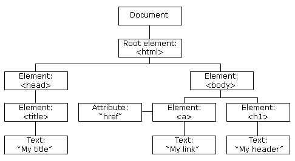

# javascript与浏览器

1. javascript在html中的使用


HTML中的javascript代码必须位于`<script>`和`</script>`标签之间

> javascript语句会在页面加载时执行

外部js文件中通过`<script src="myScript.js"></script>`引入


2. 输出

- `windows.alert()`：弹出警告框
- `document.write()`：将内容写到HTML文档中
- `innerHTML`：写入到HTML元素
- `console.log()`：写入到浏览器的控制台


# BOM浏览器对象


浏览器对象模型（Browser Object Model (BOM)） 使 JavaScript 有能力与浏览器"对话"

## window对象

表示浏览器窗口。所有JavaScript全局对象、函数以及变量均自动成为 window 对象的成员。甚至HTML DOM的document也是window对象的属性之一。

```js
//DOM对象是BOM对象的属性
window.document.getElementById("header");

//相比之下的DOM对象
document.getElementById("header");
```

> 许多`window.xxx`对象在编写时可不使用window这个前缀。


1. 弹窗


```js
// 警告窗
window.alert("text")


// 确认窗
// 当你点击 "确认", 确认框返回 true， 如果点击 "取消", 确认框返回 false。
window.confirm("text")

// 提示框
// 如果用户点击确认，那么返回值为输入的值。如果用户点击取消，那么返回值为 null。
window.prompt("sometext","defaultvalue");
```
> 弹窗使用`\n` 来设置换行。


2. window location

window.location对象用于获得当前页面的地址 (URL)，并把浏览器重定向到新的页面。
```js
location.hostname   //返回 web 主机的域名
location.pathname   //返回当前页面的路径和文件名
location.port       //返回 web 主机的端口
location.protocol   //返回所使用的 web 协议
location.href       //返回当前页面的 URL

location.assign(url)    //加载新的文档/url
```
3. window history

```javascript
history.back()      //类似于浏览器点击后退按钮
history.forward()   //类似浏览器中点击向前按钮
```


4. window screen

```javascript
screen.availWidth   //可用的屏幕宽度
screen.availHerght  //可用的屏幕高度
```


6. window navigator

包含有关访问者浏览器的信息。

> 来自 navigator 对象的信息具有误导性


7. window document cookie

Cookie 是一些数据, 存储于你电脑上的文本文件中，解决了"如何记录客户端的用户信息"的问题:

当浏览器从服务器上请求 web 页面时， 属于该页面的 cookie 会被添加到该请求中。服务端通过这种方式来获取用户的信息。


```js
// 创建cookie
// cookie以键值对存储
document.cookie="key1=value1;key2=value2..."


// 读取Cookie
var x = document.cookie;    //返回一个字符串

```


# DOM文档对象模型


## DOM简介


网页被加载时，浏览器会创建页面的文档对象模型DOM（Document Object Model）
- HTML DOM定义了访问和操作HTML文档的标准方法。
- DOM 以树结构表达 HTML 文档。



### DOM节点

在HTML DOM中，HTML文档中的所有所有内容都是节点:
- 整个文档是一个文档节点
- 每个HTML元素是元素节点
- HTML 元素内的文本是文本节点
- 每个HTML属性是属性节点
- 注释是注释节点


树中节点的关系

常用父（parent）、子（child）和同胞（sibling）等术语来描述这些关系。父节点拥有子节点。同级的子节点被称为同胞（兄弟或姐妹）。


### 编程接口

可通过JavaScript（以及其他编程语言）对HTML DOM进行访问  
所有HTML元素被定义为对象，而编程接口则是对象方法和对象属性
- 方法是您能够执行的动作（比如添加或修改元素）
- 属性是您能够获取或设置的值（比如节点的名称或内容）


document对象是DOM（文档对象模型）中的一个核心对象，代表的是整个HTML或XML文档。它是一个全局对象，提供了访问和操作网页内容的方法和属性，可用于
- 访问其他网页DOM元素，让我们可以对DOM树做操作
- 添加全局事件监听器
- 获取文档元信息


## 获得DOM元素


```javascript
// 通过CSS选择器
var x = document.querySelector(...)        // 通过CSS选择器选择第一个匹配的元素。
var y = document.querySelectorAll(...)     // 通过CSS选择器选择所有匹配的元素。

// 通过id
// 如果找到该元素，则该方法将以对象的形式返回该元素。
// 如果未找到该元素，则返回null。
var x=document.getElementById("id");

// 标签名
// 本例查找 id="main" 的元素，然后查找 id="main" 元素中的所有 <p> 元素
// 集合中的元素可以通过索引(以 0 为起始位置)来访问
var y=getElementsByTagName("p");


// 类名
// 来查找 class="intro" 的元素
var x=document.getElementsByClassName("intro");


element.parent                  // 获取父节点
element.childNodes              // 获取字节点
firstChild,lastChild            // 获取第一个和最后一个字节点
nextSibling,previousSibling     // 获取兄弟节点
```

> HTMLCollection 元素可以通过 name，id 或索引来获取。  
> NodeList 只能通过索引来获取。


## 改变DOM元素

```js
// 改变html内容
element.innerHTML=新的元素内容      //改变元素内部的 HTML 内容（包括标签）
element.innerText=新的元素          //改变元素内部的文本内容  

// 改变html属性
element.属性名=新属性值
element.setAttribute(key,value) // 设置元素的属性值

// 改变内联样式 
element.style.property=新样式
```


## 创建并添加DOM元素

- appendChild：添加新元素到末尾
- insertBeofre：插入新元素到开头

```js
//创建 <p> 元素
var newElement = document.createElement("p");

//创建一个新的文本节点
var node = document.createTextNode("这是一个新的段落。");

//文本节点添加到 <p> 元素中
para.appendChild(node);

//在一个已存在的元素中添加 p 元素
document.getElementById("div1").appendChild(newElement);  // 将新创建的节点添加到某个元素的子节点末尾
document.getElementById("div1").insertBefore(newElement,referenceElement); // 将新节点插入到指定的子节点之前


element.cloneNode(boolean)  // 复制节点。
// 其中的参数用于决定是否包括子节点


```


## 删除和替换DOM元素

删除和替换DOM元素都需要先获取目标元素和其父元素

```js
// 获取父元素和目标元素(child)
var parent = document.getElementById("div1");
var child = document.getElementById("p1");


// 删除子元素
parent.removeChild(child);
// 通过子元素，查找父元素后再删除子元素
child.parentNode.removeChild(child);
// 删除元素本身
element.remove(): 直接删除元素本身。


// 替换元素
parent.replaceChild(new_chile, old_child);
```


# 添加事物


javascript事件：html事件是发生在html元素上的事情，可使用javascript处理这些事件

## 添加事件


1. 使用事件属性

可以触发事件的对象也有事件属性，事件属性所对应的值是一个函数

```javascript
element.onXXX=function(){
    ...
};
```


3. 内联事件属性

不要使用（mdn原话）

```javascript
<button onclick="bgChange()">按下我</button>
```


2. 使用事物监听函数

事件监听函数`addEventListener()`方法添加的事件句柄不会覆盖已存在的事件句柄
```js
// 添加事件监听
element.addEventListener(event, function, useCapture);
// element：目标元素，比如 document 或某个特定的 DOM 元素。
// event:事件类型（如click）
// 事件触发后调用的函数
// 布尔值，选择描述事件是冒泡还是捕获，默认为false，冒泡

// 删除事物监听
element.removeEventListener("mousemove", myFunction);
```


## 事件对象


事件对象被自动传递给事件处理函数（用形参接收，一般用event表示），以提供有关该事件额外的功能和信息

- 大多数事件对象都有一套标准的属性和方法
- 一些事件对象添加了与该特定类型的事件相关的额外属性。可参考[事件对象文档](https://developer.mozilla.org/zh-CN/docs/Web/API/Event)


## 事件传递


1. 定义

事件冒泡描述了浏览器如何处理针对嵌套元素的事件

- 事件冒泡：内部元素的事件会先被触发，然后再触发外部元素，即由里到外依次触发各个父元素的相同事件
- 事件捕获：外部元素的事件会先被触发，然后才会触发内部元素的事件，即由内到外依次触发各个子元素的相同事件


2. 阻止冒泡

Event对象有一个可用的函数，叫做stopPropagation()，在事件处理函数中调用即可


3. 事件委托

当我们想在用户与大量的子元素中的任何一个互动时运行一些代码时，我们在它们的父元素上设置事件监听器，让发生在它们身上的事件冒泡到它们的父元素上，而不必在每个子元素上单独设置事件监听器。


## 阻止默认行为

遇到一些特殊情况，你希望事件不执行它的默认行为(事件回调函数)，而是进行错误处理。

调用事件对象`event`的`preventDefault()`并随后进行提示


