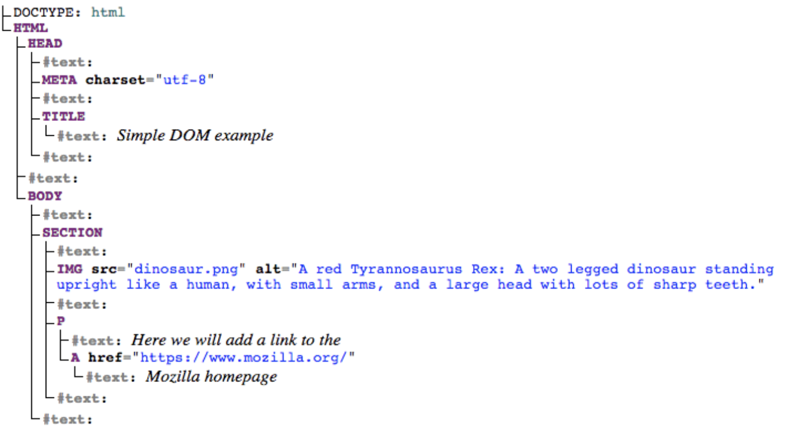

# 事件介绍


事件是发生在你正在编程的系统中的事情——当事件发生时，系统产生（或“触发”）某种信号，并提供一种机制，当事件发生时，可以自动采取某种行动（即运行一些代码）。


## 处理事件


**添加事件监听器**


1. 使用addEventListener


```javascript
element.addEventListener(event, function, useCapture);
```

- element：目标元素，比如 document 或某个特定的 DOM 元素。
- event：你要监听的事件类型，比如 click、keydown、mouseover 等。
- function：事件发生时要执行的函数，通常是一个回调函数。
- useCapture：可选参数，布尔值，默认为 false。指定事件是否在捕获或冒泡阶段执行。


2. 事件处理器属性

可以触发事件的对象（如按钮）通常也有属性，其名称是 on，后面是事件的名称。

```javascript
element.onXXX = function(){...}
```


3. 内联事件属性

不要使用（mdn原话）

```javascript
<button onclick="bgChange()">按下我</button>
```


**移除事件监听器**

1. 使用removeEventListener() 

```javascript
element.removeEventListener(event, function, useCapture);
```

- element：目标元素。
- event：要移除的事件类型。
- function：要移除的回调函数，必须与 addEventListener 时传入的函数相同。
- useCapture：可选，布尔值，默认 false，与 addEventListener 时的值保持一致。


2. AbortController 和 AbortSignal


```javascript
const controller = new AbortController();  // 创建一个控制器
const signal = controller.signal;          // 获取该控制器的信号对象

// 发起一个 fetch 请求，并传入信号对象
fetch('https://example.com/api', { signal })
  .then(response => response.json())
  .then(data => console.log(data))
  .catch(error => {
    if (error.name === 'AbortError') {
      console.log('请求被取消了');
    } else {
      console.error('请求出错：', error);
    }
  });

// 在需要取消请求的地方调用 abort 方法
controller.abort();  // 取消请求
```

- 我们创建了一个 AbortController 实例。
- 使用 controller.signal 获取 AbortSignal 对象，并将其传递给 fetch 请求。
- 调用 controller.abort() 方法时，异步请求会被取消，且 fetch 的 .catch() 部分会捕获到 AbortError 错误。


## 事件对象

有时候在事件处理函数内部，你可能会看到一个固定指定名称的参数，例如 event、evt 或 e。这被称为事件对象，它被自动传递给事件处理函数（用形参接收），以提供额外的功能和信息。


> 大多数事件对象都有一套标准的属性和方法，一些事件对象添加了与该特定类型的事件相关的额外属性。可参考[enevt_object](https://developer.mozilla.org/zh-CN/docs/Web/API/Event)


## 阻止默认行为

遇到一些特殊情况，你希望事件不执行它的默认行为，而是进行错误处理。


调用事件对象`event`的`preventDefault()`并随后进行提示


# 事件冒泡

事件冒泡描述了浏览器如何处理针对嵌套元素的事件
- 事件冒泡：事件从被点击的最里面的元素冒泡而出。
    > 会由里到外依次触发各个父元素的相同事件
- 事件捕获：事件从被点击的最外面的元素传递而进。
    > 会由内到外依次触发各个子元素的相同事件


**阻止冒泡**

Event对象有一个可用的函数，叫做stopPropagation()，在事件处理函数中调用即可


**事件委托**

当我们想在用户与大量的子元素中的任何一个互动时运行一些代码时，我们在它们的父元素上设置事件监听器，让发生在它们身上的事件冒泡到它们的父元素上，而不必在每个子元素上单独设置事件监听器。


# web api


应用程序接口（API）是基于编程语言构建的结构，让开发者更容易地创建复杂的功能。它们抽象了复杂的代码，并提供一些简单的接口规则直接使用。


## 客户端javascript中的API

***浏览器API**

浏览器 API 内置于 Web 浏览器中，能从浏览器和电脑周边环境中提取数据，并用来做有用的复杂的事情。

- DOM api: 操作文档
- 从服务器获取数据的API: 用于更新网页的一小部分
- 用于绘制和操作图形的 api
    - canvas: 2D 
    - WebGl: 3D
- 音频视频API
- 设备API: 使得你可以与设备的硬件进行交互
- 客户端存储API: 使得你可以在客户端存储数据


***第三方API***

第三方 API 缺省情况下不会内置于浏览器中，通常必须在 Web 中的某个地方获取代码和信息。

- 地图API
- 各种软件的API


## API是如何工作的

基于对象：API 使用一个或多个 JavaScript 对象在你的代码中进行交互，这些对象用作 API 使用的数据（包含在对象属性中）的容器以及 API 提供的功能（包含在对象方法中）。


##  各种API

### 操作文档

以某种方式操纵文档结构。这通常是通过使用文档对象模型（DOM）来实现的。这是一套大量使用了 Document 对象，用于控制 HTML 和样式信息的 API。


***web浏览器的重要组成部分***


- 窗口(Window): 载入网页的浏览器标签
- 导航器(Navigator): 代表浏览器的状态和身份（即用户代理）
- 文档(Document): 加载到窗口的实际页面


***文档对象模型Document***

你的每一个浏览器标签中加载的文档是由一个文档对象模型表示的。这是一个由浏览器创建的“树状结构”表示法，使 HTML 结构能够被编程语言轻松访问。


由javascript文档->DOM树结构:
```javascript
<!doctype html>
<html lang="en-US">
  <head>
    <meta charset="utf-8" />
    <title>Simple DOM example</title>
  </head>
  <body>
    <section>
      
      <p>
        Here we will add a link to the
        <a href="https://www.mozilla.org/">Mozilla homepage</a>
      </p>
    </section>
  </body>
</html>

```
> 

DOM树中的节点:
- 根节点: 树中顶层节点，在 HTML 的情况下，总是一个 HTML 节点（其他标记词汇，如 SVG 和定制 XML 将有不同的根元素）。
- 子节点: 直接位于另一个节点内的节点。
- 后代节点: 位于另一个节点内任意位置的节点。
- 父节点: 里面有另一个节点的节点。
- 兄弟节点: DOM 树中位于同一等级的节点。


***基本的DOM操作***

- 节点选择
    - document.querySelector(): 通过 CSS 选择器选择第一个匹配的元素。
        - document.querySelectorAll(): 通过 CSS 选择器选择所有匹配的元素。
    - document.getElementById(id): 通过 ID 获取元素。
    - document.getElementByClassName(classname): 通过类名获取元素列表。
    - document.getElementByTagName(tagName): 通过标签名获取元素列表。
> 现在我们已经获得了目标元素的引用，我们可以开始使用可用的属性和方法来操作它

- 节点创建
    - document.cerateElement('div')
    - document.createTextNode(string)

- 节点放置
    - element.appendChild(newElement): 将新创建的节点添加到某个元素的子节点末尾。
    - parent.insertBefore(newElement,referenceElement): 将新节点插入到指定的子节点之前。

- 节点修改
    - 修改元素内容
        - element.innerText: 改变元素内部的文本内容
        - element.innerHtml: 改变元素内部的 HTML 内容（包括标签）。
    - 修改元素属性
        - element.setAttribute(key,value): 设置元素的属性值
        - element.key = value: 之间修改属性
    - 修改样式
        - element.style.key = value:之间修改内联样式

- 节点删除
    - parent.removeChild(childElement): 删除子节点。
    - element.remove(): 直接删除元素本身。

- 节点替换
    - parent.replaceChild(newElement,oldChild): 替换指定子节点。

- 节点克隆
    - cloneNode(boolean): 复制节点。
    > 其中的参数用于决定是否包括字节点

- 查询节点关系
    - element.parent: 获取父节点
    - element.childNodes: 获取字节点
         - firstChild,lastChild: 获取第一个和最后一个字节点
    - nextSibling,previousSibling: 获取兄弟节点

事件操作
    - element.addEventListener(eventName,function): 为元素添加事件监听器
    - element.removeEventListener(eventName,function): 为元素删除事件监听器


***从服务器获取数据***

<!-- TODO: fetch api -->

