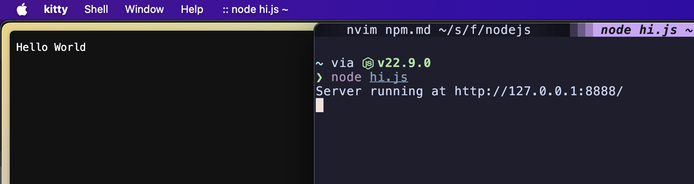

Node.js® 是一个免费、开源、跨平台的 JavaScript 运行时环境，它让开发人员能够创建服务器、Web 应用、命令行工具和脚本。

> 让JavaScript走出浏览器，运行在操作系统之上，成为一门后端语言
> 简单的说 Node.js 就是运行在服务端的 JavaScript。


# 创建第一个应用


使用 Node.js 时，我们不仅仅 在实现一个应用，同时还实现了整个 HTTP 服务器。
> HTTP服务器例如Apache和Ngnix


1. 使用require指令加载和引入模块

```javascript
const module = require('module-name');
```

2. 创建服务器

- 使用 http.createServer() 方法创建服务器
- 并使用 listen 方法绑定 8888 端口
- 函数通过 request, response 参数来接收和响应数据。

```javascript
var http = require('http');

http.createServer(function (request, response) {

    // 发送 HTTP 头部 
    // HTTP 状态值: 200 : OK
    // 内容类型: text/plain
    response.writeHead(200, {'Content-Type': 'text/plain'});

    // 发送响应数据 "Hello World"
    response.end('Hello World\n');
}).listen(8888);

// 终端打印如下信息
console.log('Server running at http://127.0.0.1:8888/');
```

3. 运行代码

```javascript
node server.js
// Server running at http://127.0.0.1:8888/
```



