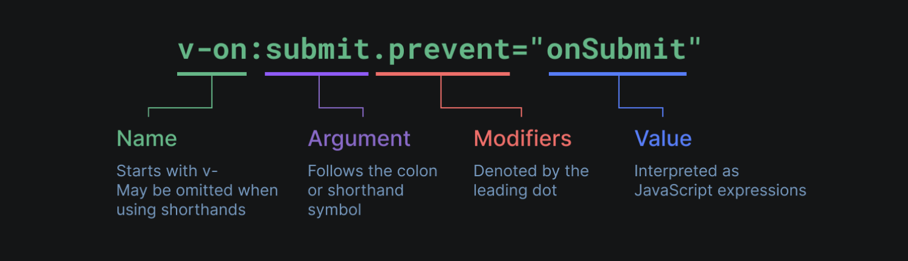

# 创建一个vue应用

```vue
import { createApp } from 'vue'

const app = createApp({
  /* 根组件选项 */
})


app.mount('#app')

<!-- 定义一个应用级的错误处理器，用来捕获所有子组件上的错误 -->
app.config.errorHandler = (err) => {
    <!-- 处理错误 -->
}
<!-- 应用实例还提供了一些方法来注册应用范围内可用的资源，例如注册一个组件 -->
app.component('TodoDeleteButton', TodoDeleteButton)
```

 - 应用实例: 每个 Vue 应用都是通过 createApp 函数创建一个新的 应用实例：

- 根组件: 我们传入 createApp 的对象实际上是一个组件，每个应用都需要一个“根组件”，其他组件将作为其子组件。

- 挂载应用: 应用实例必须在调用了 .mount() 方法后才会渲染出来。该方法接收一个“容器”参数，可以是一个实际的 DOM 元素或是一个 CSS 选择器字符串,应用根组件的内容将会被渲染在容器元素里面。它的返回值是根组件实例而非应用实例。
> .mount() 方法应该始终在整个应用配置和资源注册完成后被调用。

<!-- TODO: DOM中的根组件模版 -->

- 应用配置: 应用实例会暴露一个 .config 对象允许我们配置一些应用级的选项


# 模版语法


Vue 使用一种基于 HTML 的模板语法，使我们能够声明式地将其组件实例的数据绑定到呈现的 DOM 上

> 底层机制中，Vue 会将模板编译成高度优化的 JavaScript 代码。结合响应式系统，当应用状态变更时，Vue 能够智能地推导出需要重新渲染的组件的最少数量，并应用最少的 DOM 操作。

### 文本插值

使用的是“Mustache”语法 (即双大括号)
```vue
<span>Message: {{ msg }}</span>
```


### 插入innerHTML

双大括号会将数据解释为纯文本，而不是 HTML。若想插入 HTML，你需要使用 v-html 指令：
```vue
<p>Using v-html directive: <span v-html="rawHtml"></span></p>
```
> 这里的意思是将此元素的 innerHTML 与 rawHtml 属性保持同步。


### Attribute属性绑定

双大括号不能在 HTML attributes 中使用。想要响应式地绑定一个 attribute，应该使用 v-bind 指令

```vue
<div v-bind:id="dynamicId"></div>

<!-- 简写 -->
<!-- 开头为 : 的 attribute -->
<div :id="dynamicId"></div>

<!-- 同名简写 -->
<!-- 与 :id="id" 相同 -->
<div :id></div>


<!-- 动态绑定多个值 -->
<div v-bind="objectOfAttrs"></div>
<!-- 
const objectOfAttrs = {
  id: 'container',
  class: 'wrapper',
  style: 'background-color:green'
} 
-->
```
v-bind 指令指示 Vue 将元素的 id attribute 与组件的 dynamicId 属性保持一致。
> 如果绑定的值是 null 或者 undefined，那么该 attribute 将会从渲染的元素上移除。


### 使用javascript表达式

在 Vue 模板内，JavaScript 表达式可以被使用在如下场景上：
- 在文本插值中 (双大括号)
- 在任何 Vue 指令 (以 v- 开头的特殊 attribute) attribute 的值中
> 表达式代表可以被`return`返回的代码


### 指令Directives

指令是带有 v- 前缀的特殊 attribute。Vue 提供了许多内置指令,一个指令的任务是在其表达式的值变化时响应式地更新 DOM。



- 参数Arguments：某些指令会需要一个“参数”，在指令名后通过一个冒号隔开做标识。
    - 动态参数：使用一个 JavaScript 表达式作为参数，需要包含在一对方括号内
    > 动态参数中表达式的值应当是一个字符串，或者是 null。
- 修饰符Modifiers：以点开头的特殊后缀，表明指令需要以一些特殊的方式被绑定。


> 当使用 DOM 内嵌模板 (直接写在 HTML 文件里的模板) 时，我们需要避免在名称中使用大写字母，因为浏览器会强制将其转换为小写

# 响应式模版

### ref()

在组合式 API 中，推荐使用 ref() 函数来声明响应式状态


```vue
const count = ref(0)
```

- ref() 接收参数，并将其包裹在一个带有 .value 属性的 ref 对象中返回：
    - 模板中使用 ref 时，我们不需要附加 .value。会进行自动解包
- 要在组件模板中访问 ref，请从组件的 setup() 函数中声明并返回它们：
```vue
import { ref } from 'vue'

export default {
  setup() {
    const count = ref(0)

    function increment() {
      // 在 JavaScript 中需要 .value
      count.value++
    }

    // 不要忘记同时暴露 increment 函数
    return {
      count,
      increment
    }
  }
}
```

> 原理：当一个组件首次渲染时，Vue 会追踪在渲染过程中使用的每一个 ref。然后，当一个 ref 被修改时，它会触发追踪它的组件的一次重新渲染。可以理解ref对象为：
> ```vue
> // 伪代码，不是真正的实现
> const myRef = {
>   _value: 0,
>   get value() {
>     track()
>     return this._value
>   },
>   set value(newValue) {
>     this._value = newValue
>     trigger()
>   }
> }
> ```

***<script setup>***

在 setup() 函数中手动暴露大量的状态和方法非常繁琐。幸运的是，我们可以通过使用单文件组件 (SFC) 来避免这种情况。我们可以使用 <script setup> 来大幅度地简化代码

```vue
<script setup>
import { ref } from 'vue'

const count = ref(0)

function increment() {
  count.value++
}
</script>

<template>
  <button @click="increment">
    {{ count }}
  </button>
</template>
```
> \<script setup> 中的顶层的导入、声明的变量和函数可在同一组件的模板中直接使用。

***DOM更新时机***

DOM 更新不是同步的。Vue 会在“next tick”更新周期中缓冲所有状态的修改，以确保不管你进行了多少次状态修改，每个组件都只会被更新一次。
> 可以使用 nextTick() 全局 API进行立刻修改


### reactive()

还有另一种声明响应式状态的方式，即使用 reactive() API。reactive() 将使对象本身具有响应性


```vue
const state = reactive({ count: 0 })
```

- reactive() 返回的是一个原始对象的 Proxy，它和原始对象是不相等的
- 只有代理对象是响应式的，更改原始对象不会触发更新。

<!-- NOTE: 建议使用 ref() 作为声明响应式状态的主要 API。而且我也学不懂呜呜 -->


<!-- TODO: 深/浅层次对象 -->


# 计算属性

# 类与样式绑定

# 条件渲染

# 列表渲染

# 事件处理

# 表单输入绑定

# 生命周期

# 侦听器

# 模版引用

# 组件基础

---
深入组件


# 注册

# props

# 事件

# 组件v-model

# 透传Attributes

# 插槽

# 依赖注入

# 异步组件

---
逻辑复用

# 组合式函数

# 自定义指令

# 插件

---
内置组件

# Transition

# TransitionGroup

# KeepAlive

# Teleport

# Suspense

---
应用规模化

# 单文件组件

# 工具链

# 路由

# 状态管理

# 测试

# 服务端渲染（SSR）


