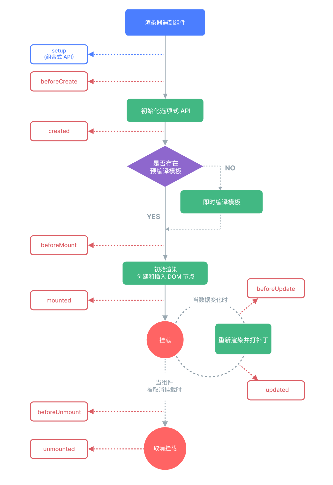

Vue实现了自己的**组件模型**，使我们可以在每个组件内封装自定义内容与逻辑
- 允许我们将UI划分为独立的、可重用的部分

[toc]


# 使用组件

1. 定义组件

当使用构建步骤时，我们一般会将Vue组件定义在一个单独的`.vue`文件中，这被叫做单文件组件 (简称 SFC)

```javascript
// ButtonCounter.vue
<script>
export default {
  data() {
    return {
      count: 0
    }
  }
}
</script>

<template>
  <button @click="count++">You clicked me {{ count }} times.</button>
</template>
```

> [!NOTE]
> 不使用构建步骤，个人感觉不方便，有需要查官网

2. 使用组件


```html
<script>

// 1. 要使用一个子组件，我们需要在父组件中导入它
import ButtonCounter from './ButtonCounter.vue'

export default {
  // 2. 要将导入的组件暴露给模板，我们需要在components选项上注册它
  components: {
    ButtonCounter
  }
}
</script>

<template>
  <h1>Here is a child component!</h1>
  // 3. 使用组件
  <ButtonCounter />
</template>
```


## 注册

一个 Vue 组件在使用前需要先被“注册”，这样 Vue 才能在渲染模板时找到其对应的实现

### 全局注册 

使用 Vue 应用实例的 .component() 方法，让组件在当前 Vue 应用中全局可用

1. 用法

```javascript
import { createApp } from 'vue'
import MyComponent from './App.vue'

const app = createApp({})

app.component('MyComponent', MyComponent)
```

> [!NOTE]
> `.component()`方法可以被链式调用


2. 缺点

- 没有被使用的组件无法在生产打包时被自动移除
- 全局注册在大型项目中使项目的依赖关系变得不那么明确

### 局部注册

```javascript
<script>
import ComponentA from './ComponentA.vue'

export default {
  components: {
    ComponentA
  }
}
</script>

<template>
  <ComponentA />
</template>
```

> [!NOTE]
> 局部注册的组件在后代（子）组件中不可用


# 传递props

使用props向相同的组件中传递不同的数据
- Props是一种特别的`attributes`属性，在组件上声明注册
- 当一个值被传递给prop时，它将成为该组件实例上的一个属性，可以在模板中使用
- 所有的props都遵循着单向绑定原则，如需更改，子组件应该抛出一个事件来通知父组件做出改变

> 传递细节看官网[Props | Vue.js](https://cn.vuejs.org/guide/components/props.html)


```JavaScript
// 声明组件时注册props
<script>
export default {
  props: ['props_name', ... ]
}
</script>

<template>
  <h4>{{ props_name }}</h4>
</template>

// 使用组件时传递props值
<BlogPost title="My journey with Vue" />
<BlogPost title="Why Vue is so fun" />
```


## props校验

Vue 组件可以更细致地声明对传入的 props 的校验要求
- 如果传入的值不满足类型要求，Vue 会在浏览器控制台中抛出警告
- 通过向 props 选项提供一个带有 props 校验选项的对象来实现校验

```javascript
export default {
  props: {
    // 1. 基础类型检查
    //（给出 `null` 和 `undefined` 值则会跳过任何类型检查）
    propA: Number,

    // 2. 多种可能的类型
    propB: [String, Number],

    // 3. 必传，且为 String 类型
    propC: {
      type: String,
      required: true
    },

    // 4. 必传但可为 null 的字符串
    propD: {
      type: [String, null],
      required: true
    },

    // 5. Number 类型的默认值
    propE: {
      type: Number,
      default: 100
    },

    // 6. 对象类型的默认值
    propF: {
      type: Object,
      // 对象或者数组应当用工厂函数返回。
      // 工厂函数会收到组件所接收的原始props作为参数
      default(rawProps) {
        return { message: 'hello' }
      }
    },
    // 7. 自定义类型校验函数
    // 在 3.4+ 中完整的 props 作为第二个参数传入
    propG: {
      validator(value, props) {
        // The value must match one of these strings
        return ['success', 'warning', 'danger'].includes(value)
      }
    },
    // 8. 函数类型的默认值
    propH: {
      type: Function,
      // 不像对象或数组的默认，这不是一个
      // 工厂函数。这会是一个用来作为默认值的函数
      default() {
        return 'Default function'
      }
    }
  }
}

```

- 除Boolean外的未传递的可选prop将会有一个默认值undefined
- Boolean 类型的未传递 prop 将被转换为 false


# 组件事件

组件实例提供了一个自定义事件系统
- 子组件可以通过调用内置的`$emit`方法，通过传入事件名称来抛出一个事件
- 父组件可以通过`v-on`或`@`来选择性地监听子组件上抛的事件


```javascript
<!-- MyComponent -->
// 子组件
// 在组件的模板表达式中，可以直接使用 $emit 方法触发自定义事件
<button @click="$emit('someEvent',argument1,argument2...)">Click Me</button>

// $emit() 方法在组件实例上也同样以 this.$emit() 的形式可用：
export default {
  methods: {
    submit() {
      this.$emit('someEvent',argument1,argument2,...)
    }
  }
}
```

```javascript
// 父组件
// 父组件可以通过 v-on (缩写为 @) 来监听事件：
<MyComponent @some-event="callback" />

// 1. 使用内联的箭头函数
<MyButton @increase-by="(n) => count += n" />

// 2. 用一个组件方法来作为事件处理函数
<MyButton @increase-by="increaseCount" />
methods: {
  increaseCount(n) {
    this.count += n
  }
}
```

> [!NOTE]
> 组件触发的事件没有冒泡机制

## 声明触发的事件

## 事件校验


# v-model

`v-model`可以在组件上使用以实现双向绑定。


# 透传Attributes

“透传 attribute”指的是传递给一个组件，却没有被该组件声明为 props 或 emits 的 attribute 或者 v-on 事件监听器
- 当一个组件以单个元素为根作渲染时，透传的 attribute 会自动被添加到根元素上
- 透传进来的 attribute 可以在模板的表达式中直接用 $attrs 访问到

1. 禁用透传

如果你不想要一个组件自动地继承 attribute，你可以在组件选项中设置`inheritAttrs: false`


# 插槽

插槽的作用：为子组件传递一些模板`<template/>`片段

```javascript
// <slot> 元素是一个插槽出口 (slot outlet)
// 标示了父元素提供的插槽内容 (slot content) 将在哪里被渲染
<button class="fancy-btn">
  <slot></slot> <!-- 插槽出口 -->
</button>
```

> [!NOTE]
> 插槽内容可以访问到父组件的数据作用域，无法访问子组件的数据

1. 默认内容 

```JavaScript
<button type="submit">
  <slot>
    Submit <!-- 默认内容 -->
  </slot>
</button>
```

2. 具名插槽 

```javascript
// <slot> 元素可以有一个特殊的 attribute name，用来给各个插槽分配唯一的 ID，以确定每一处要渲染的内容
<div class="container">
  <header>
    <slot name="header"></slot>
  </header>
  <main>
    <slot></slot>
  </main>
  <footer>
    <slot name="footer"></slot>
  </footer>
</div>

// 要为具名插槽传入内容，我们需要使用一个含 v-slot 指令的 <template> 元素，并将目标插槽的名字传给该指令
<BaseLayout>
  <template v-slot:header>
    <!-- header 插槽的内容放这里 -->
  </template>
</BaseLayout>
```

3. 条件插槽 

根据内容是否被传入了插槽来渲染某些内容

```javascript
// header内容存在时则渲染
<template>
  <div class="card">
    <div v-if="$slots.header" class="card-header">
      <slot name="header" />
    </div>
  </div>
</template>

```


4. 动态性插槽


4. 作用于插槽


# 动态组件

# DOM内模版解析注意事项

# 生命周期


每个Vue组件实例在创建时都需要经历一系列的初始化步骤。在此过程中，它也会运行被称为生命周期钩子的函数，让开发者有机会在特定阶段运行自己的代码


```javascript
// 举例来说，mounted 钩子可以用来在组件完成初始渲染并创建 DOM 节点后运行代码
// 不同的钩子执行代码的时间不一致
export default {
  mounted() {
    console.log(`the component is now mounted.`)
  }
  created(){
    ...
  }
  ...
}
```




> [!NOTE]
>  所有生命周期钩子函数的`this` 上下文都会自动指向当前调用它的组件实例。注意：避免用箭头函数来定义生命周期钩子，因为如果这样的话你将无法在函数中通过 this 获取组件实例。

