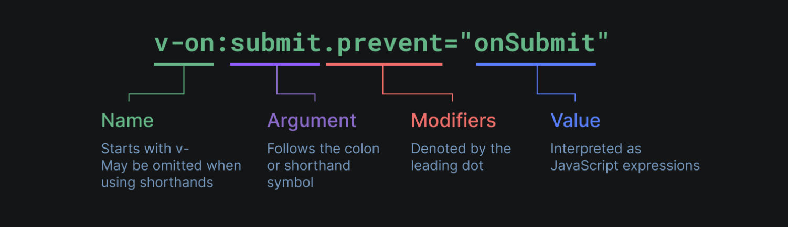

[Vue官方文档](https://cn.vuejs.org/guide/introduction.html)

[toc]

# 开始

## 简介

Vue (发音为 /vjuː/，类似 view) 是一款用于构建用户界面的 JavaScript 框架
- 基于标准 HTML、CSS 和 JavaScript 构建
- 并提供了一套**声明式**的、**组件化**的编程模型
- 帮助你高效地开发用户界面

vue核心功能
- 声明式渲染：Vue 基于标准 HTML 拓展了一套模板语法，使得我们可以声明式地描述最终输出的 HTML 和 JavaScript 状态之间的关系
- **响应性**：Vue 会自动跟踪 JavaScript 状态并在其发生变化时响应式地更新 DOM


## 项目创建

```bash
# 1. 安装并执行create-vue（Vue 官方的项目脚手架工具）
npm create vue@latest

# 2. 安装依赖
cd <your-project-name>
npm install

# 3. 启动开发服务器
npm run dev

# 4. 当你准备将应用发布到生产环境时，请运行
# 在./dist文件夹中为你的应用创建一个生产环境的构建版本
npm run build
```


# 创建vue应用

## 创建vue应用实例

每个Vue应用都是通过`createApp()`函数创建一个新的应用实例
- 接收的对象实际上是一个（根）组件
  - 每个应用都需要一个“根组件”，其他组件将作为其子组件

```javascript
import { createApp } from 'vue'

const app = createApp({
  /* 根组件选项 */
})
```


--- 

如果使用的是单文件组件，我们可以直接从另一个文件中导入根组件

```javascript
import { createApp } from 'vue'
// 从一个单文件组件中导入根组件
import App from './App.vue'

const app = createApp(App)
```


> [!NOTE]
> `createApp()`允许你在同一个页面中创建多个共存的 Vue 应用
> - 每个应用都拥有自己的用于配置和全局资源的作用域
> - 每个应用都可以分别挂载到对应的元素上


## 挂载应用实例

应用实例必须在调用了`.mount()`方法后才会渲染出来
- 接收一个“容器”参数，可以是一个实际的DOM元素或是一个CSS选择器字符串
- 应用根组件的内容将会被渲染在容器元素里面。容器元素自己将不会被视为应用的一部分
  - 当指定的根组件没有设置`<template>...</template>`时，Vue将自动使用容器的innerHTML作为模板
- 返回值是根组件实例而非应用实例

```javascript
app.mount('#app')
```

## 应用配置

应用实例会
- 暴露一个`.config`对象允许我们配置一些应用级的选项
- 提供一些方法来注册应用范围内可用的资源

```javascript
// 定义一个应用级的错误处理器，用来捕获所有子组件上的错误
app.config.errorHandler = (err) => {
    <!-- 处理错误 -->
}

// 注册应用范围内可用的资源，例如注册一个全局可用组件
app.component('TodoDeleteButton', TodoDeleteButton)
```

> [!NOTE]
>  确保在挂载应用实例之前完成所有应用配置！


# template(模版)语法

模版语法即`<template>...</template>`标签体中可用的语法


Vue使用一种基于HTML的模板语法，使我们能够声明式地将其组件实例的数据绑定到呈现的DOM上

> Vue在底层会将模板编译成高度优化的JavaScript代码。结合响应式系统，当应用状态变更时，Vue 能够智能地推导出需要重新渲染的组件的最少数量，并应用最少的 DOM 操作。

## 数据绑定

数据绑定是指将组件实例的属性值绑定到template模版的过程

### 文本插值

```javascript
<span>Message: {{ msg }}</span>
```
- 双大括号标签会被替换为相应组件实例中msg属性的值
- msg属性更改时它也会同步更新


### innerHTML

双大括号会将数据解释为纯文本，若想插入HTML，使用`v-html`指令

```vue
<!-- 此元素的innerHTML与`rawHtml`属性值保持同步 -->
<span v-html="rawHtml"></span>
```
> [!NOTE]
> 插值为纯HTML，数据绑定将会被忽略

### Attribute属性

双大括号不能在HTML attributes属性中使用。若想响应式地绑定一个attribute，使用`v-bind`指令

```vue
<!-- v-bind将元素的id属性与组件的dynamicId属性保持一致-->
<div v-bind:id="dynamicId"></div>
<!-- 如果绑定的值是null或者undefined，那么该attribute将会从渲染的元素上移除 -->

```

1. 缩写

- `v-bind`省略：可直接使用冒号`:`代替`v-bind:`
- 同名缩写：若attribute的名称与绑定的JavaScript值的名称相同，可省略attribute的值

```vue
<div :id="dynamicId"></div>

<!-- 等价于<div :id="id"></div> -->
<div :id></div>
```


2. 布尔型attribute

布尔型attribute依据true/false值来决定attribute是否应该存在于该元素上
- 当isButtonDisabled为真值或一个空字符串 (即 <button disabled="">) 时，元素会包含这个 disabled attribute
- 而当其为其他假值时 attribute 将被忽略

```JavaScript
<button :disabled="isButtonDisabled">Button</button>
```

3. 动态绑定多个值

如果你有一个包含多个attribute的JavaScript对象

```JavaScript
data() {
  return {
    objectOfAttrs: {
      id: 'container',
      class: 'wrapper'
    }
  }
}
```

通过不带参数的v-bind，你可以将它们绑定到单个元素上
```vue
<div v-bind="objectOfAttrs"></div>
```


## 使用javascript表达式

在Vue模板内，JavaScript表达式可以被使用在如下场景上：
- 在文本插值中 (双大括号)
- 在任何Vue指令(以v-开头的特殊attribute) attribute的值中

> 表达式代表可以被`return`返回的代码


## 指令Directives


指令是带有`v-`前缀的特殊属性
- 指令 attribute 的期望值为一个 JavaScript 表达式
    > 除v-for、v-on和v-slot例外
- 指令会在其表达式的值变化时**响应式**地更新DOM

### 指令格式



1. 参数Arguments

- 普通参数

某些指令会需要一个“参数”，参数不同，执行的具体操作也不同

- 动态参数

使用一个JavaScript表达式作为参数，包含在一对方括号内
  - 动态参数中表达式的值应当是一个字符串，或者是null
    - 如果是null，那么该attribute将被移除
  - 使用DOM内嵌模版时避免在名称中使用大写字母，因为浏览器会强制将其转换为小写
  - 空格和引号，在HTML attribute名称中都是不合法的，需避免
  - 需要传入一个复杂的动态参数，推荐使用计算属性替换复杂的表达式

```javascript
<a v-bind:href="url"> ... </a>

// 2. 动态参数
<a v-bind:[attributeName]="url"> ... </a>
// 这里的attributeName会作为一个JavaScript表达式被动态执行，计算得到的值会被用作最终的参数
```

2. 修饰符Modifiers

以点开头的特殊后缀，表明指令需要以一些特殊的方式被绑定


# 响应式基础

## 声明响应式状态

选用选项式API时，会用data选项来声明组件的**响应式状态**
- 此选项的值应为返回一个对象的函数
- Vue将在创建**新组件实例**时调用此函数，并将函数返回的对象用响应式系统进行**包装**
- 此对象的所有顶层属性都会被**代理**到组件实例(即方法和生命周期钩子中的this)上

```javascript
export default {
  data() {
    return {
      count: 1
    }
  }

  // `mounted` 是生命周期钩子，之后我们会讲到
  mounted() {
    // `this` 指向当前组件实例
    console.log(this.count) // => 1

    // 数据属性也可以被更改
    this.count = 2
  }
}
```

### 说明

1. 代理对象

Vue3中，数据是基于JavaScript Proxy(代理)实现响应式的
- Proxy 对象用于创建一个对象的代理，从而实现基本操作的拦截和自定义（如属性查找、赋值、枚举、函数调用等）

```javascript
export default {
  data() {
    return {
      someObject: {}
    }
  },
  mounted() {
    const newObject = {}
    this.someObject = newObject

    // 赋值后再访问this.someObject，此值已经是原来的newObject的一个响应式代理
    console.log(newObject === this.someObject) // false
  }
}
```


2. 深层响应性

默认Vue中，状态是深度响应的，这意味着当改变嵌套对象或数组的值时，这些变化也会被检测到


3. DOM更新时机

DOM更新不是同步的，Vue 会在“next tick”更新周期中缓冲所有状态的修改
- 要等待DOM更新完成后再执行额外的代码，可以使用nextTick()全局API

```javascript
import { nextTick } from 'vue'

export default {
  methods: {
    async increment() {
      this.count++
      await nextTick()
      // 现在 DOM 已经更新了
    }
  }
}
```


## 声明方法

要为组件添加方法，我们需要用到methods选项
- 它应该是一个包含所有方法的对象
- Vue自动为methods中的方法绑定了永远指向组件实例的this
  - 不应该在定义methods时使用箭头函数，因为箭头函数没有自己的this上下文
- 和组件实例上的其他属性一样，方法也可以在模板上被访问


```javascript
export default {
  data() {
    return {
      count: 0
    }
  },
  methods: {
    increment() {
      this.count++
    }
  },
  mounted() {
    // 在其他方法或是生命周期中也可以调用方法
    this.increment()
  }
}
```

### 有状态方法

...


# 计算属性

推荐使用计算属性来**描述依赖响应式状态**的复杂逻辑，存在以下好处：
- 相比于javascript表达式，可以让模板更加简洁
- 相比于methods，计算属性值会基于其响应式依赖被**缓存**，仅会在其响应式依赖更新时才重新计算
  - 方法调用总是会在重渲染发生时再次执行函数

```javascript
<template>
    {/* 使用计算属性代替模版表达式 */}
    <p>{{ calculateBooksMessage() }}</p>
</templata>

<script>
    export default {
      data() {
        return {
          author: {
            books: [...]
          }
        }
      },
      computed: {
        // 定义一个计算属性
        publishedBooksMessage() {
          return this.author.books.length > 0 ? 'Yes' : 'No'
        }
      }
    }
</script>
```

## 可写计算属性

计算属性默认是只读的，可以通过同时提供getter和setter来提供一个可写的计算属性

```javascript
export default {
  data() {
    return {
      firstName: 'John',
      lastName: 'Doe'
    }
  },
  computed: {
    fullName: {
      // getter
      get() {
        return this.firstName + ' ' + this.lastName
      },
      // setter
      set(newValue) {
        // 注意：我们这里使用的是解构赋值语法
        [this.firstName, this.lastName] = newValue.split(' ')
      }
    }
  }
}
```

## 获取上一个值

可以通过访问计算属性的getter的第一个参数来获取计算属性返回的上一个值

```javascript
export default {
  data() {
    return {
      count: 2
    }
  },
  computed: {
    // 这个计算属性在 count 的值小于或等于 3 时，将返回 count 的值。
    // 当 count 的值大于等于 4 时，将会返回满足我们条件的最后一个值
    // 直到 count 的值再次小于或等于 3 为止。
    alwaysSmall(previous) {
      if (this.count <= 3) {
        return this.count
      }
      return previous
    }
  }
}
```


# 类与样式绑定

Vue专门为class和内联样式style的`v-bind`用法提供了特殊的功能增强
- 除了字符串外，表达式的值也可以是对象或数组

## class绑定

1. 绑定对象

给`v-bind:class`传递一个对象来动态切换class
- class的切换取决于对象的键是否为真值true
- 也可以绑定一个返回对象的计算属性
- 对于不同的class使用css进行不同的渲染

```javascript
<template>
    <div
      // :class指令也可以和一般的class attribute共存
      class="static"
      :class="{ active: isActive, 'text-danger': hasError }"
    ></div>
</templata>

<script>
    export default {
        data() {
          return {
            isActive: true, // 属于active类
            hasError: false // 不属于text-danger类
          }
        }
      },
    }
</script>


// 最终结果
<div class="static active"></div>
```

2. 绑定数组

```javascript
// 给v-bind:class绑定一个数组来渲染多个class
<template>
    <div :class="[activeClass, errorClass]"></div>
</templata>

<script>
    export default {
        data() {
          return {
                activeClass: 'active',
                errorClass: 'text-danger'
          }
        }
      },
    }
</script>


// 结果
<div class="active text-danger"></div>
```

## 绑定内联样式

1. 绑定对象 

- 绑定属性

```javascript
data() {
  return {
    activeColor: 'red',
    fontSize: 30
  }
}

<div :style="{ color: activeColor, fontSize: fontSize + 'px' }"></div>

<!-- 结果 -->
<div :style="{ 'font-size': fontSize + 'px' }"></div>
```

- 绑定样式对象

```javascript
data() {
  return {
    styleObject: {
      color: 'red',
      fontSize: '13px'
    }
  }
}

<div :style="styleObject"></div>
```

2. 绑定数组 

还可以给`:style`绑定一个包含多个样式对象的数组。这些对象会被合并后渲染到同一元素上

# 渲染

## 条件渲染


1. v-else-if

v-if指令用于条件性地渲染一块内容。这块内容只会在指令的表达式**返回真值**时才被渲染。


```javascript
<div v-if="type === 'A'"> A </div>
<div v-else-if="type === 'B'"> B </div>
<div v-else-if="type === 'C'"> C </div>
<div v-else> Not A/B/C </div>
```

> 这几个元素必须紧跟在一起

2. v-show

不同与`v-if`，`v-show`会在DOM渲染中**保留**该元素，`v-show`仅切换了该元素上名为display的CSS属性

```javascript
<h1 v-show="ok">Hello!</h1>
```

> v-if 有更高的切换开销，而 v-show 有更高的初始渲染开销


## 列表渲染

### v-for

1. 遍历数组

v-for指令的值需要使用`item in items`形式的特殊语法，其中
- `items`是源数据的数组
- 而`item`是迭代项的别名
- 可选的第二个参数表示当前项的**位置索引**
- 也可以使用of作为分隔符来替代in

```javascript
// js
data() {
  return {
    items: [{ message: 'Foo' }, { message: 'Bar' }]
  }
}

// template
<li v-for="(item,index) in items">
  {{ item.message }}
</li>

```

> [!NOTE]
> `v-for`代码块中可以访问父作用域中的数据、计算属性、方法等


2. 遍历对象

可以使用`v-for`来遍历一个对象的**属性值**
- 可选通过第二个参数表示**属性名**
- 可选通过第三个参数表示**位置索引**
- 遍历的顺序会基于对该对象调用`Object.values()`的返回值来决定

```javascript
// js 
data() {
  return {
    myObject: {
      title: 'How to do lists in Vue',
      author: 'Jane Doe',
      publishedAt: '2016-04-10'
    }
  }
}

//template
<li v-for="(value, key, index) in myObject">
  {{ index }}. {{ key }}: {{ value }}
</li>
```


3. v-for使用范围值

```javascript
// 从1循环到n
<span v-for="n in 10">{{ n }}</span>
```


### 通过key管理状态

1. 就地更新

Vue默认按照“就地更新”的策略来更新通过v-for渲染的元素列表
- 当数据项的顺序改变时
- Vue不会随之移动DOM元素的顺序，而是就地更新每个元素，确保它们在原本指定的索引位置上渲染

2. 通过key管理状态

- 每个元素对应的唯一的key值给了Vue一个提示，以便它可以跟踪每个节点的标识
- 从而重用和重新排序**现有**的元素


```javascript
<template v-for="todo in todos" :key="todo.name">
  <li>{{ todo.name }}</li>
</template>
```

### 数组变化检测

Vue能够侦听响应式数组的**变更方法**，并在它们被调用时触发相关的更新
- 变更方法：对调用它们的原数组进行变更
- 不可变方法：不会更改原数组，而总是返回一个新数组
  - 当遇到的是非变更方法时，我们需要将旧的数组替换为新的
  - 展示过滤或排序后的结果而不实际变更或重置原始数据
    - 可以创建返回已过滤或已排序数组的**计算属性**


# 事件处理

使用`v-on`指令(简写为@)来监听DOM事件，并在事件触发时执行对应的JavaScript
- 内联事件处理器：直接将JavaScript代码写在模板中
  - 在内联事件处理器中调用方法，这允许我们向方法传入自定义参数以代替原生事件
  - 在内联事件处理器中访问事件参数
    - 向该处理器方法传入一个特殊的`$event`变量
    - 使用内联箭头函数
- 方法事件处理器：接受一个方法名或对某个方法的调用
  - 方法参数会自动接收原生DOM事件对象


```javascript
// template 
// 内联事件处理器
<button @click="count++">Add 1</button>
// 内联事件处理器中调用方法
<button @click="say('hello')">Say hello</button>
<!-- 使用特殊的 $event 变量 -->
<button @click="warn('no.', $event)">Submit</button>
<!-- 使用内联箭头函数 -->
<button @click="(event) => warn('yes.', event)">Submit</button>
// 方法事件处理器
<button @click="greet">Greet</button>

// js 
methods: {
  // event对应javascript原生事件对象
  greet(event) {
        ...
  }
  say(message) {
      alert(message)
  }
  warn(message, event) {
    // 这里可以访问 DOM 原生事件
    if (event) {
      event.preventDefault()
    }
    alert(message)
  }
}
```

### 事件修饰符

在处理事件时
- 调用`event.preventDefault()`或`event.stopPropagation()` 是很常见的
  - 尽管我们可以直接在方法内调用，但如果方法能更专注于数据逻辑而不用去处理DOM事件的细节会更好。
- 为此Vue为`v-on`提供了事件修饰符，修饰符是用`.`表示的指令后缀
  - 事件修饰符可以用来处理DOM事件的细节
  - 按键修饰符可以检查特定的按键的行为 
  - 鼠标修饰符可以检查鼠标按钮的行为


# 表单输入绑定

1. v-model

`v-model`指令帮我们将表单输入框的内容同步给JavaScript中相应的变量
- 文本类型的`<input>`和`<textarea>`元素会绑定`value` property并侦听`input`事件
- `<input type="checkbox">`和`<input type="radio">`会绑定`checked` property并侦听`change`事件
- `<select>`会绑定`value` property并侦听`change`事件


2. value绑定

使用`v-bind`可以使我们将选项值绑定为非字符串的数据类型
- `true-value`和`false-value`是Vue特有的attributes
  - 可更改复选框选中或不选中时传递给组件实例属性的值
  - 仅支持和v-model配套使用
- `:value`可更改单选框和选择器选中时传递给组件实例属性的值


3. 修饰符 

可实现对表单输入框中内容改变时的同步配置


# 侦听器

使用`watch`选项在每次**响应式**属性发生**变化**时触发一个函数

```javascript
export default {
  data() {
    return {
      question: '',
      someObject : {
        ...
      },
    }
  },
  watch: {
    // 默认监听函数
    // 每当 question 改变时，这个函数就会执行
    question(newQuestion, oldQuestion) {
        ...
      }
    },

    // 深层监听函数
    someObject: {
      handler(newValue, oldValue) {
        ...
      },
      // watch默认是浅层的
      // 开启深层嵌套侦听
      // Vue3.5+中，deep选项还可以是一个数字，表示最大遍历深度
      deep: true
    }
    
    // 即使回调的监听函数
    question: {
      handler(newQuestion) {
        // 在组件实例创建时会立即调用，可用于初始化数据
      },
      // 强制立即执行回调
      immediate: true
    }

    // 一次性监听函数
    source: {
      handler(newValue, oldValue) {
        // 当 `source` 变化时，仅触发一次
      },
      once: true
    }
  },
}
```
> [!NOTE]
> 深度侦听需要遍历被侦听对象中的所有嵌套的属性，当用于大型数据结构时，开销很大

<!--TODO: 侦听器内容还是有点多，见官网-->


# 模版引用

使用特殊的`ref`属性直接访问底层DOM元素，其
- 允许我们在一个特定的DOM元素或子组件实例被挂载后
- 获得对它的直接引用
- 挂载结束后引用都会被暴露在`this.$refs`之上：

```javascript
<script>
export default {
  mounted() {
    this.$refs.input.focus()
  }
}
</script>

<template>
  <input ref="input" />
</template>
```

<!-- TODO: ref扩展：v-for中的函数引用，函数模版上的函数引用，组件上的ref -->

