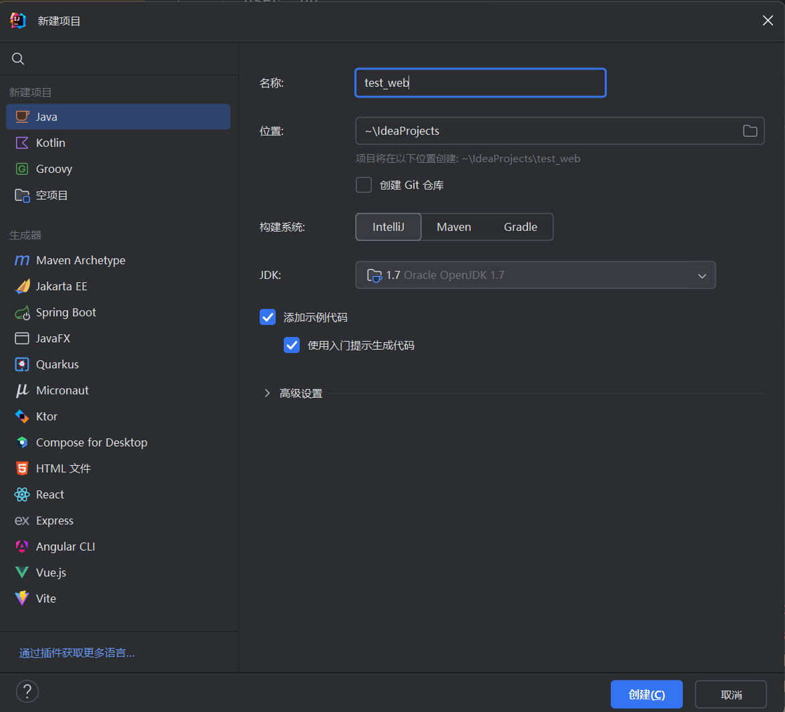
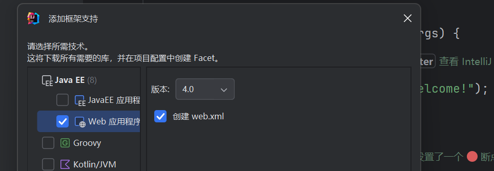
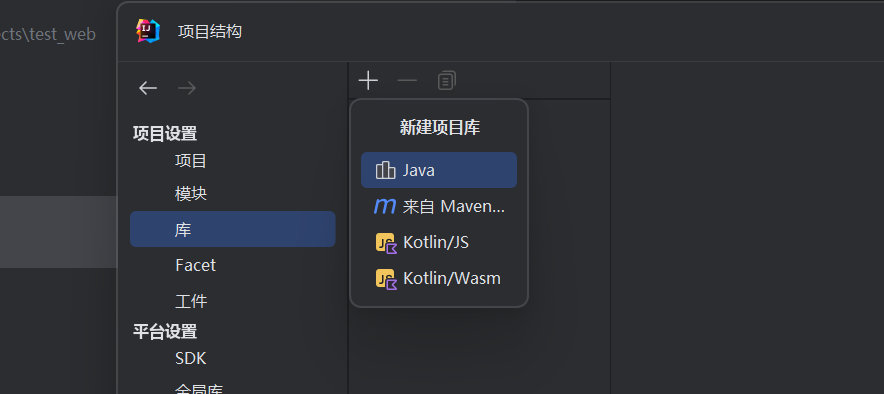
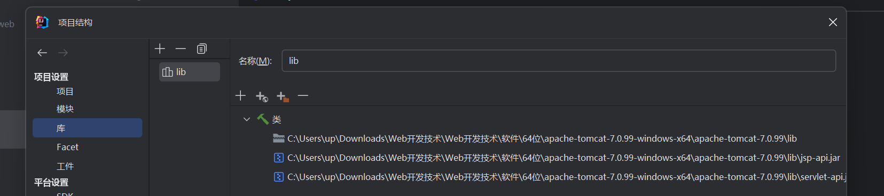
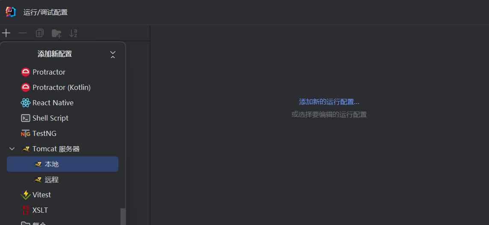
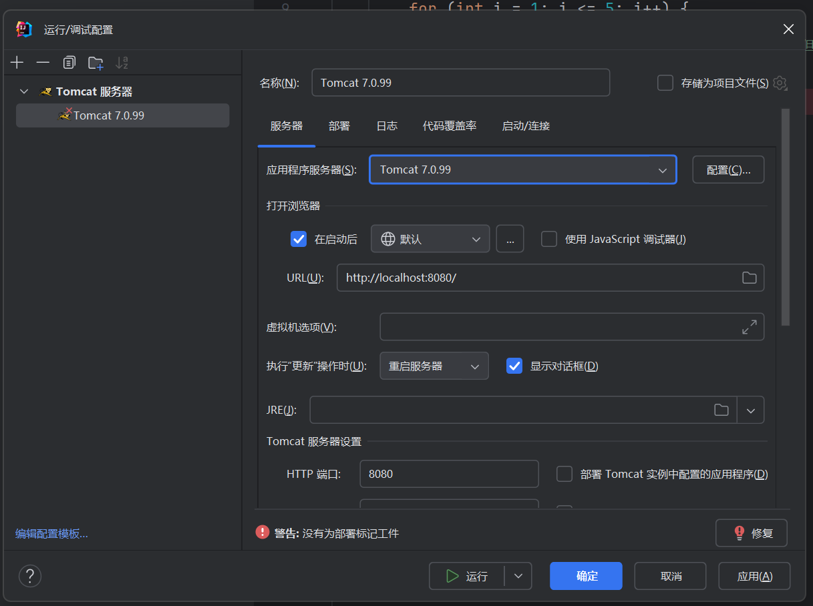
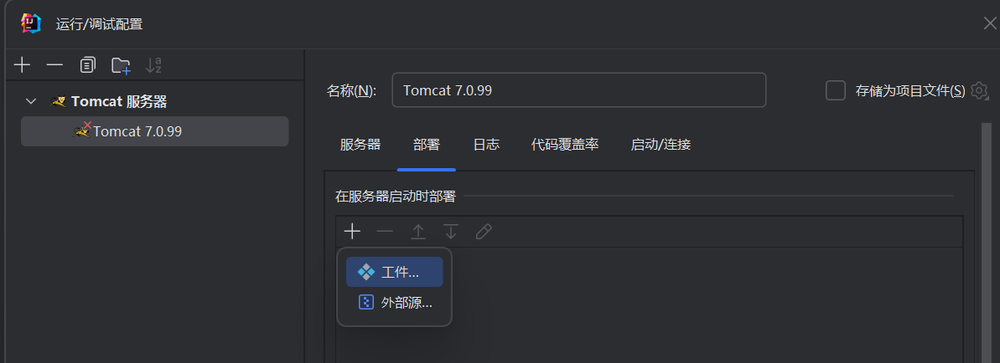
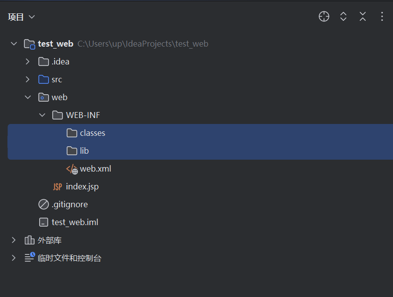
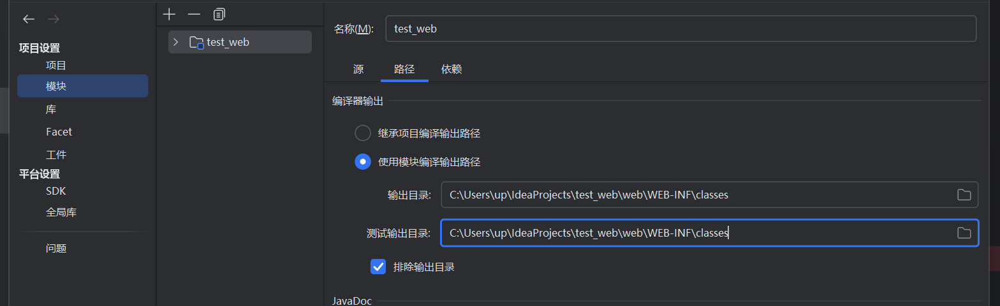

<!-- ~/study_md/java/intellijIdea/tomcat.md -->

# 在idea中添加tomcat集成

[bilibili 参考视频](https://www.bilibili.com/video/BV11Z4y1r7ej/?spm_id_from=333.337.search-card.all.click)
1. 新建一个java项目

2. 点击项目名进行选中，双击`shift`输入`add Frame support`

p

- 在项目依赖dependencies中选中lib文件夹为jar directory

3. 导入tomact目录下的lib中的jsp和servlet到项目中

4. 编辑tomcat启动配置

- 添加local tomcat配置

- 设置tomcat位置，参数配置

> 配置tomcat路径，执行‘更新’操作后的选项，端口等

- 添加工件

5. 可在`/web/index.jsp`中编辑源代码

--- 

> 以下是添加output file path 复杂版，两者都可最终运行

[bilibili 参考视频：在intellij idea中配置tomcat](https://www.bilibili.com/video/BV15C4y1f7Wv/?spm_id_from=333.337.search-card.all.click)
1. 新建一个java项目

2. 点击项目名进行选中，双击`shift`输入`add Frame support`

3. 创建两个新目录在/web/WEB-INF/下
- classes：存放jar包
- lib：存放类

4. 打开项目设置`ctrl+shift+alt+s`->`模块module`
- 设置输出path为classes文件夹

- 在项目依赖dependencies中选中lib文件夹为jar directory

5. 导入tomact目录下的lib中的jsp和servlet到项目中

6. 编辑tomcat启动配置

- 添加local tomcat配置

- 设置tomcat位置，参数配置

> 配置tomcat路径，执行‘更新’操作后的选项，端口等

- 添加工件

7. 可在`/web/index.jsp`中编辑源代码
