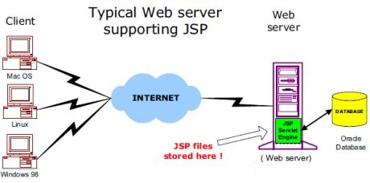
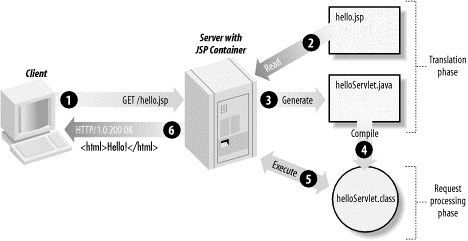
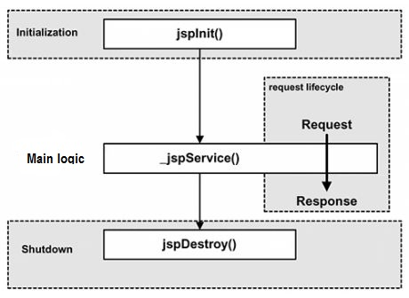

[toc]

# 简介

JSP全称Java Server Pages，是一种动态网页开发技术。
- 使用JSP标签在HTML网页中插入Java代码。标签通常以`<%`开头以`%>`结束。

本质上JSP是一个Java servlet，主要用于实现Java web应用程序的用户界面部分。
> 网页开发者们通过结合HTML代码、XHTML代码、XML元素以及嵌入JSP操作和命令来编写JSP。
- JSP通过网页表单获取用户输入数据、访问数据库及其他数据源，然后动态地创建网页。
- JSP标签有多种功能，比如访问数据库、记录用户选择信息、访问JavaBeans组件等，还可以在不同的网页中传递控制信息和共享信息。


- 相比 html 而言，html 只能为用户提供静态数据，而 Jsp 技术允许在页面中嵌套 java 代码，为用户提供动态数据。
- 相比 servlet 而言，servlet 很难对数据进行排版，而 jsp 除了可以用 java 代码产生动态数据的同时，也很容易对数据进行排版

## 1.2开发环境搭建

1. 配置Java开发环境(JDK)

- Java JDK的下载
- PATH环境变量的配置。

2. 配置Web服务器：Tomcat

目前，市场上有很多支持 JSP 和 Servlets 开发的 Web 服务器。他们中的一些可以免费下载和使用，Tomcat 就是其中之一。

- 下载最新版本的[Tomcat](http://tomcat.apache.org/)
- 创建环境变量指向tomcat目录
- 通过`bin`目录下的脚步启动Tomcat

3. 设置classpath变量

由于servlets不是Java SE的一部分，所以您必须标示出servlet类的编译器。

- 配置环境变量`classpath`+=`jsp-api.jar`


# 结构

## 容器结构

网络服务器需要一个JSP引擎，也就是一个容器来处理JSP页面。容器负责截获，处理和传递对JSP页面的请求。

JSP容器与Web服务器协同合作，为JSP的正常运行提供必要的运行环境和其他服务，并且能够正确识别专属于 JSP 网页的特殊元素。

下图显示了 JSP 容器和 JSP 文件在 Web 应用中所处的位置。



## JSP处理过程

- 就像其他普通的网页一样，您的浏览器发送一个 HTTP 请求给服务器。
- Web 服务器识别出这是一个对 JSP 网页的请求，并且将该请求传递给 JSP 引擎。通过使用 URL或者 .jsp 文件来完成。
- JSP 引擎从磁盘中载入 JSP 文件，然后将它们转化为 Servlet。
> 这种转化只是简单地将所有模板文本改用 println() 语句，并且将所有的 JSP 元素转化成 Java 代码。
- JSP 引擎将 Servlet 编译成可执行类，并且将原始请求传递给 Servlet 引擎。
- Web 服务器的某组件将会调用 Servlet 引擎，然后载入并执行 Servlet 类。在执行过程中，Servlet 产生 HTML 格式的输出并将其内嵌于 HTTP response 中上交给 Web 服务器。
- Web 服务器以静态 HTML 网页的形式将 HTTP response 返回到您的浏览器中。
- 最终，Web 浏览器处理 HTTP response 中动态产生的HTML网页，就好像在处理静态网页一样。



一般情况下，JSP 引擎会
- 检查JSP 文件对应的 Servlet 是否已经存在
- 并且检查JSP文件的修改日期是否早于 Servlet。
    - 如果JSP文件的修改日期早于对应的 Servlet，那么容器就可以确定 JSP 文件没有被修改过并且 Servlet 有效。这使得整个流程与其他脚本语言（比如 PHP）相比要高效快捷一些。

总的来说，JSP 网页就是用另一种方式来编写 Servlet 而不用成为 Java 编程高手。除了解释阶段外，JSP 网页几乎可以被当成一个普通的 Servlet 来对待。


# 生命周期

JSP生命周期就是从创建到销毁的整个过程，类似于servlet生命周期，区别在于JSP生命周期还包括将JSP文件编译成servlet。

- 编译阶段：servlet容器将jsp文件编译servlet源文件(xxx.java)，生成servlet类(xx.class)
- 初始化阶段：加载与JSP对应的servlet类，创建其实例，并调用它的初始化方法
- 执行阶段：调用与JSP对应的servlet实例的服务方法
- 销毁阶段：调用与JSP对应的servlet实例的销毁方法，然后销毁servlet实例




## JSP编译

当浏览器请求JSP页面时，JSP引擎会首先去检查是否需要编译这个文件。如果这个文件没有被编译过，或者在上次编译后被更改过，则编译这个JSP文件。

编译的过程包括三个步骤：
- 解析JSP文件。
- 将JSP文件转为servlet入文件(xxx.java)。
- 编译servlet形成类文件(xxx.class)。


## JSP初始化

容器载入JSP文件后，它会在为请求提供任何服务前调用jspInit()方法。
> 如果需要执行自定义的JSP初始化任务，复写jspInit()方法就行了

```java
public void jspInit(){
    //初始化代码
}
```

## JSP执行

当JSP网页完成初始化后，JSP引擎将会调用_jspService()方法。

```java
void _jspService(HttpServletRequest request,HttpServletResponse response){
   // 服务端处理代码
}
```
_jspService()方法
- 在每个request中被调用一次并且负责产生与之相对应的response
- 并且它还负责产生所有7个HTTP方法的回应，比如GET、POST、DELETE等等。


## JSP清理

- 销毁阶段描述了当一个JSP网页从容器中被移除时所发生的一切
- jspDestroy()方法在JSP中等价于servlet中的销毁方法
- 当您需要执行任何清理工作时复写jspDestroy()方法，比如释放数据库连接或者关闭文件夹等等。

```java
public void jspDestroy(){
    //清理代码
}
```
