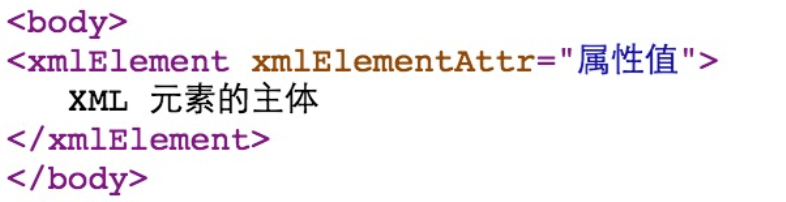

[toc]
# 语法

## 脚本程序


脚本程序可以包含任意量的Java语句、变量、方法或表达式，只要它们在脚本语言中是有效的。

```html
<!-- 脚本程序的语法格式 -->
<% 代码片段 %>

<!-- 与其等价的XML语句 -->
<jsp:scriptlet>
   代码片段
</jsp:scriptlet>
```

## JPS声明

一个声明语句可以声明一个或多个变量、方法，供后面的Java代码使用。

```html
<!-- JSP声明的语法格式 -->
<%! declaration; [ declaration; ]+ ... %>

<!-- 与其等价的XML语句 -->
<jsp:declaration>
   代码片段
</jsp:declaration>
```

## JSP表达式

一个JSP表达式中包含的脚本语言表达式，先被转化成String，然后插入到表达式出现的地方。
> 表达式元素中可以包含任何符合Java语言规范的表达式，但是不能使用分号来结束表达式。

```html
<!-- JSP表达式的语法格式 -->
<%= 表达式 %>

<!-- 与之等价的XML语句 -->
<jsp:expression>
   表达式
</jsp:expression>
```

## JSP行为

JSP行为标签使用XML语法结构来控制servlet引擎。它能够
- 动态插入一个文件
- 重用JavaBean组件
- 引导用户去另一个页面
- 为Java插件产生相关的HTML等等。

行为标签只有一种语法格式，它严格遵守XML标准：
```html
<jsp:action_name attribute="value" />
```


## 控制语句

JSP提供对Java语言的全面支持。您可以在JSP程序中使用Java API甚至建立Java代码块，包括判断语句和循环语句等等。

### 判断语句


```html
<body>
    <!-- if...else块 -->
    <% if (...) { %>
        <!-- html代码 -->
    <% } else { %>
        <!-- html代码 -->
    <% } %>

    <!-- switch块 -->
    <% 
        switch(...) {
        case ...:
            <!-- java代码 -->
            break;
        case ...:
            <!-- java代码 -->
            break;
        default:
            <!-- java代码 -->
        }
    %>
</body> 

```

> switch…case块，与if…else块有很大的不同，它使用out.println()，并且整个都装在脚本程序的标签中


### 循环语句

在JSP程序中可以使用Java的三个基本循环类型：for，while，和 do…while。

```html
<body>
    <h3>循环</h3>

    <!-- for循环 -->
    <%for(...){ %>
        <!-- html代码 -->
    <%}%>

    <!-- while循环 -->
    <%while(...){ %>
        <!-- html代码 -->
    <%}%>

</body> 
```


# 指令

JSP指令用来设置整个JSP页面相关的属性，如网页的编码方式和脚本语言。

```html
<!-- 语法格式如下 -->
<%@ directive attribute1="value1"... %>
```
指令可以有很多个属性，它们以键值对的形式存在，并用逗号隔开。


三种指令标签\<directive>:
- `<%@ page ... %>`: 定义页面的依赖属性，比如脚本语言、error页面、缓存需求等等
- `<%@ include ... %>`: 包含其他文件
- `<%@ taglib ... %>`: 引入标签库的定义，可以是自定义标签

## Page指令

Page指令为容器提供当前页面的使用说明。一个JSP页面可以包含多个page指令。

```html
<!-- Page指令的语法格式 -->
<%@ page attribute="value" %>

<!-- 等价的XML格式 -->
<jsp:directive.page attribute="value" />
```

***属性***

<!-- TODO: many attributes -->


## Include指令

JSP可以通过include指令来包含其他文件。被包含的文件可以是JSP文件、HTML文件或文本文件。

静态包含：包含的文件就好像是该JSP文件的一部分，会被同时编译执行。

```html
<!-- Include指令的语法格式如下 -->
<%@ include file="文件相对 url 地址" %>

<!-- 等价的XML语法 -->
<jsp:directive.include file="文件相对 url 地址" />
```


## Taglib指令

JSP API允许用户自定义标签，一个自定义标签库就是自定义标签的集合。  
Taglib指令引入一个自定义标签集合的定义，包括库路径、自定义标签。

```html
<!-- Taglib指令的语法 -->
<%@ taglib uri="uri" prefix="prefixOfTag" %>
<!-- uri属性确定标签库的位置，prefix属性指定标签库的前缀 -->

<!-- 等价的XML语法 -->
<jsp:directive.taglib uri="uri" prefix="prefixOfTag" />
```


# 动作元素

动作元素用于执行某些动作或逻辑，基本上都是预定义的函数

JSP规范定义了一系列的标准动作，它用JSP作为前缀


```html
<!-- JSP动作元素是用XML语法写成的 -->
<jsp:action_name attribute="value" />
```

> 与JSP指令元素不同的是，JSP动作元素在请求处理阶段起作用。


下面罗列出了一些可用的JSP行为标签：：
- `jsp:include`: 用于在当前页面中包含静态或动态资源
- `jsp:useBean`: 寻找和初始化一个JavaBean组件
- `jsp:setProperty`: 设置 JavaBean组件的值
- `jsp:getProperty`: 将 JavaBean组件的值插入到 output中
- `jsp:forward`: 从一个JSP文件向另一个文件传递一个包含用户请求的request对象
- `jsp:plugin`:	用于在生成的HTML页面中包含Applet和JavaBean对象
- `jsp:element`: 动态创建一个XML元素
- `jsp:attribute`: 定义动态创建的XML元素的属性
- `jsp:body`: 定义动态创建的XML元素的主体
- `jsp:text`: 用于封装模板数据


## 动作元素的属性

所有的动作要素都有两个属性：id属性和scope属性。

- id属性：
    - id属性是动作元素的唯一标识，可以在JSP页面中引用。
    - 动作元素创建的id值可以通过PageContext来调用。

- scope属性：
    - scope属性定义了相关联id对象的寿命
    - scope属性有对应着jsp四大域对象
        > page/request/session/application


## `<jsp:include>`

`<jsp:include>`动作元素用来包含静态和动态的文件。该动作把指定文件插入正在生成的页面。

```html
<!-- 语法格式如下 -->
<jsp:include page="相对 URL 地址" flush="true" />
```
- `page`: 包含在页面中的相对URL地址。
- `flush`: 布尔属性，定义在包含资源前是否刷新缓存区。


`include`指令，是在JSP文件被转换成Servlet的时候引入文件，而这里的`jsp:include`动作不同，插入文件的时间是在页面被请求的时候


## `<jsp:forward>`


```html
<!-- 语法格式 -->
<!-- 用于请求转发：将请求对象request转到另外的页面进行处理 -->
<jsp:forward page="相对 URL 地址" />
```
- `page`: page属性包含的是一个相对URL。page的值既可以直接给出，也可以在请求的时候动态计算，可以是一个JSP页面或者一个 Java Servlet.


## `<jsp:useBean>`


```html
<!-- jsp:useBean动作最简单的语法 -->
<!-- 加载一个将在JSP页面中使用的JavaBean -->
<jsp:useBean id="name" class="package.class_name" />
```
- `class`: 指定Bean的完整包名。
- `type`: 指定将引用该对象变量的类型。
- `beaName`: 通过 java.beans.Beans 的 instantiate() 方法指定Bean的名字。


> `JavaBean`: 实际上就是java中的类

### `<jsp:setProperty>`

jsp:setProperty用来设置已经实例化的Bean对象的属性

```html
<!-- 在jsp:useBean元素的外面（后面）使用jsp:setProperty -->
<jsp:useBean id="myName" ... />
...
<jsp:setProperty name="myName" property="someProperty" .../>
<!-- 此时，不管jsp:useBean是找到了一个现有的Bean，还是新创建了一个Bean实例，jsp:setProperty都会执行。 -->


<!-- 把jsp:setProperty放入jsp:useBean元素的内部 -->
<jsp:useBean id="myName" ... >
...
   <jsp:setProperty name="myName" property="someProperty" .../>
</jsp:useBean>
<!-- 此时，jsp:setProperty只有在新建Bean实例时才会执行，如果是使用现有实例则不执行jsp:setProperty。 -->
```
- `name`: name属性是必需的。它表示要设置属性的是哪个Bean。
- `property`: property属性是必需的。它表示要设置哪个属性。
> 如果property的值是"*"，表示所有名字和Bean属性名字匹配的请求参数都将被传递给相应的属性set方法。
- `value`: value 属性是可选的。该属性用来指定Bean属性的值。
- `param`: param 是可选的。它指定用哪个请求参数作为Bean属性的值。


### `<jsp:getProperty>`

jsp:getProperty动作提取指定Bean属性的值，转换成字符串，然后输出。

```html
<!-- 语法格式 -->
<jsp:useBean id="myName" ... />
...
<jsp:getProperty name="myName" property="someProperty" .../>
```

- `name`: 要检索的Bean属性名称。Bean必须已定义。
- `property`: 表示要提取Bean属性的值


## `<jsp:element>,<jsp:attribute>,<jsp:body>`

用于动态生成XML元素，意味着XML元素在编译时是动态生成的而非静态。

```html
<!-- 实例 -->
<body>
    <jsp:element name="xmlElement">
        <jsp:attribute name="xmlElementAttr">
           属性值
        </jsp:attribute>
    <jsp:body>
       XML 元素的主体
    </jsp:body>
</body>
```



## `<jsp:plugin>`动作元素

\<jsp:plugin> 用于在网页中嵌入Java Applet或者JavaBean组件。它主要用于加载和运行客户端需要的 Java 小程序或其他对象。\<jsp:param>元素可用于向Applet 或 Bean 传递参数。

属性
- `type`: 指定插件的类型，可以是 applet 或者 bean。
- `code`: 指定 Java 小程序或 JavaBean 的类名。
- `codebase`: 指定 Applet 类或资源的 URL。
- `width`和`height`: 设置 Applet 显示的大小（宽度和高度）。
- `archive`: 用于指定 Jar 文件的 URL，以便 Applet 或 Bean 使用。

```html
<!-- 例子 -->
<jsp:plugin type="applet" codebase="dirname" code="MyApplet.class"
                           width="60" height="80">
   <jsp:param name="fontcolor" value="red" />
   <jsp:param name="background" value="black" />
 
   <jsp:fallback>
      Unable to initialize Java Plugin
   </jsp:fallback>
 
</jsp:plugin>
```


## `<jsp:text>`动作元素

<jsp:text>动作元素允许在JSP页面和文档中使用写入文本的模板

```html
<!-- 语法格式 -->
<jsp:text>模板数据</jsp:text>
```

- 以上文本模板不能包含重复元素，只能包含文本和EL表达式
- XML文件中，您不能使用表达式如 ${whatever > 0}，因为>符号是非法的。
    - 可以使用 ${whatever gt 0}表达式
    - 或者嵌入在一个CDATA部分的值。
- 需要在 XHTML 中声明 DOCTYPE,必须使用到<jsp:text>动作元素


# 隐式对象


JSP隐式对象是JSP容器为每个页面提供的Java对象，可直接使用而不用显式声明。JSP隐式对象也被称为预定义变量。

- `response`: 代表 HTTP 响应的对象，用于向客户端发送数据和响应
- `out`: 用于向客户端输出文本内容的对象，通常用于生成HTML

- `request`: 代表 HTTP 请求的对象，包含客户端发送到服务器的信息
- `pageContext`: 提供对JSP页面所有对象以及命名空间的访问
- `session`: 代表会话的对象，可用于存储和检索用户特定的数据，跨多个页面
- `application`: 代表Web应用程序的上下文，可以用于存储和检索全局应用程序数据

- `page`: 类似于Java类中的this关键字，代表当前JSP页面的实例，可以用于调用页面的方法
- `config`: 包含有关当前 JSP 页面的配置信息，例如初始化参数
- `exception`: 代表发生错误的JSP页面中对应的异常对象，用于处理 JSP 页面中的异常情况，可用于捕获和处理页面中发生的异常。


## response对象

response对象是javax.servlet.http.HttpServletResponse类的实例。
- 当服务器创建request对象时会同时创建用于响应这个客户端的response对象。
- response对象也定义了处理HTTP头模块的接口。通过这个对象，开发者们可以添加新的cookies，时间戳，HTTP状态码等等。

## out对象

out对象是 javax.servlet.jsp.JspWriter 类的实例，用来在response对象中写入内容。

- 最初的JspWriter类对象根据页面是否有缓存来进行不同的实例化操作。
> 可以在page指令中使用buffered='false'属性来轻松关闭缓存。

- JspWriter类包含了大部分java.io.PrintWriter类中的方法。
    - 不过，JspWriter新增了一些专为处理缓存而设计的方法 
    - 还有就是，JspWriter类会抛出IOExceptions异常，而PrintWriter不会

下表列出了我们将会用来输出boolean，char，int，double，String，object等类型数据的重要方法：
- `out.print(dateType dt)`: 输出`Type`类型的值
- `out.println(dateType dt)`: 输出`Type`类型的值然后换行
- `out.flush()`: 刷新输出流


## 四大域对象


在JSP中提供了四种属性的保存范围，所谓的属性保存范围，指的就是一个设置的对象，可以再多少个页面中保存并可以继续使用


### 对象


- pageContext : 只在一个页面中保存属性，跳转之后无效
- request : 只在一次请求中保存，服务器跳转后依然有效
- session : 在一次会话范围中，服务器跳转和客户端跳转都可以使用
- application : 在整个服务器上保存

### 方法

| 方法 | 描述 |
| --- | --- |
| public void seteAttribute(String name,Object o) | 设置属性的名称和内容 |
| public Object getAttribute(String name) | 根据属性名称获取属性 |
| public void removeAttrubute(String name) | 删除指定的属性 |


### pageContext对象

pageContext对象是javax.servlet.jsp.PageContext 类的实例，用来代表当前整个JSP页面。

- 主要用来访问页面信息
- 存储了对其他隐式对象的引用
- 也包含了传给JSP页面的指令信息


### request对象

request对象是javax.servlet.http.HttpServletRequest 类的实例。

- 每当客户端请求一个JSP页面时，JSP引擎就会制造一个新的request对象来代表这个请求。
- request对象提供了一系列方法来获取HTTP头信息，cookies，HTTP方法等等。


### session对象

session对象是 javax.servlet.http.HttpSession 类的实例。

- 和Java Servlets中的session对象有一样的行为。
- session对象用来跟踪在各个客户端请求间的会话。


### application对象

application对象直接包装了servlet的ServletContext类的对象，是javax.servlet.ServletContext 类的实例。

- 这个对象在JSP页面的整个生命周期中都代表着这个JSP页面
- 这个对象在JSP页面初始化时被创建，随着jspDestroy()方法的调用而被移除。
- 通过向application中添加属性，则所有组成您web应用的JSP文件都能访问到这些属性。


## 不常用的对象


### config对象

config对象是 javax.servlet.ServletConfig 类的实例，直接包装了servlet的ServletConfig类的对象。

这个对象允许开发者访问Servlet或者JSP引擎的初始化参数，比如文件路径等


### exception对象

exception 对象包装了从先前页面中抛出的异常信息。它通常被用来产生对出错条件的适当响应。


### page对象

这个对象就是页面实例的引用。它可以被看做是整个JSP页面的代表。
> page 对象就是this对象的同义词。
