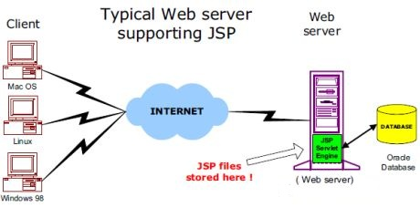
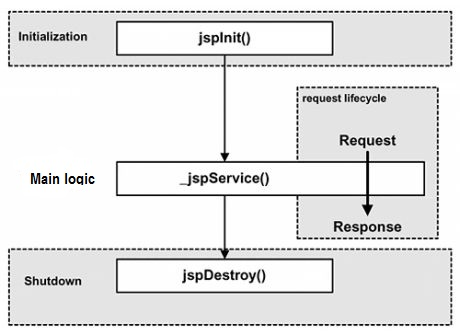

[toc]

# 简介

JSP全称Java Server Pages，是一种动态网页开发技术。
- 使用JSP标签在HTML网页中插入Java代码。标签通常以`<%`开头以`%>`结束。

JSP是一种Java servlet，主要用于实现Java web应用程序的用户界面部分。
> 网页开发者们通过结合HTML代码、XHTML代码、XML元素以及嵌入JSP操作和命令来编写JSP。
- JSP通过网页表单获取用户输入数据、访问数据库及其他数据源，然后动态地创建网页。
- JSP标签有多种功能，比如访问数据库、记录用户选择信息、访问JavaBeans组件等，还可以在不同的网页中传递控制信息和共享信息。

## 1.2开发环境搭建

1. 配置Java开发环境(JDK)

- Java JDK的下载
- PATH环境变量的配置。

2. 配置Web服务器：Tomcat

目前，市场上有很多支持 JSP 和 Servlets 开发的 Web 服务器。他们中的一些可以免费下载和使用，Tomcat 就是其中之一。

- 下载最新版本的[Tomcat](http://tomcat.apache.org/)
- 创建环境变量指向tomcat目录
- 通过`bin`目录下的脚步启动Tomcat

3. 设置classpath变量

由于servlets不是Java SE的一部分，所以您必须标示出servlet类的编译器。

- 配置环境变量`classpath`+=`jsp-api.jar`


# 结构

## 容器结构

网络服务器需要一个 JSP 引擎，也就是一个容器来处理 JSP 页面。容器负责截获对 JSP 页面的请求。
> 本教程使用内嵌 JSP 容器的 Apache 来支持 JSP 开发。

JSP容器与Web服务器协同合作，为JSP的正常运行提供必要的运行环境和其他服务，并且能够正确识别专属于 JSP 网页的特殊元素。

下图显示了 JSP 容器和 JSP 文件在 Web 应用中所处的位置。



## JSP处理过程

- 就像其他普通的网页一样，您的浏览器发送一个 HTTP 请求给服务器。
- Web 服务器识别出这是一个对 JSP 网页的请求，并且将该请求传递给 JSP 引擎。通过使用 URL或者 .jsp 文件来完成。
- JSP 引擎从磁盘中载入 JSP 文件，然后将它们转化为 Servlet。
> 这种转化只是简单地将所有模板文本改用 println() 语句，并且将所有的 JSP 元素转化成 Java 代码。
- JSP 引擎将 Servlet 编译成可执行类，并且将原始请求传递给 Servlet 引擎。
- Web 服务器的某组件将会调用 Servlet 引擎，然后载入并执行 Servlet 类。在执行过程中，Servlet 产生 HTML 格式的输出并将其内嵌于 HTTP response 中上交给 Web 服务器。
- Web 服务器以静态 HTML 网页的形式将 HTTP response 返回到您的浏览器中。
- 最终，Web 浏览器处理 HTTP response 中动态产生的HTML网页，就好像在处理静态网页一样。


一般情况下，JSP 引擎会
- 检查JSP 文件对应的 Servlet 是否已经存在
- 并且检查JSP文件的修改日期是否早于 Servlet。
    - 如果JSP文件的修改日期早于对应的 Servlet，那么容器就可以确定 JSP 文件没有被修改过并且 Servlet 有效。这使得整个流程与其他脚本语言（比如 PHP）相比要高效快捷一些。

总的来说，JSP 网页就是用另一种方式来编写 Servlet 而不用成为 Java 编程高手。除了解释阶段外，JSP 网页几乎可以被当成一个普通的 Servlet 来对待。


# 生命周期

JSP生命周期就是从创建到销毁的整个过程，类似于servlet生命周期，区别在于JSP生命周期还包括将JSP文件编译成servlet。

- 编译阶段：servlet容器将jsp文件编译servlet源文件(xxx.java)，生成servlet类(xx.class)
- 初始化阶段：加载与JSP对应的servlet类，创建其实例，并调用它的初始化方法
- 执行阶段：调用与JSP对应的servlet实例的服务方法
- 销毁阶段：调用与JSP对应的servlet实例的销毁方法，然后销毁servlet实例




## JSP编译

当浏览器请求JSP页面时，JSP引擎会首先去检查是否需要编译这个文件。如果这个文件没有被编译过，或者在上次编译后被更改过，则编译这个JSP文件。

编译的过程包括三个步骤：
- 解析JSP文件。
- 将JSP文件转为servlet入文件(xxx.java)。
- 编译servlet形成类文件(xxx.class)。


## JSP初始化

容器载入JSP文件后，它会在为请求提供任何服务前调用jspInit()方法。
> 如果需要执行自定义的JSP初始化任务，复写jspInit()方法就行了

```java
public void jspInit(){
    //初始化代码
}
```

## JSP执行

当JSP网页完成初始化后，JSP引擎将会调用_jspService()方法。

```java
void _jspService(HttpServletRequest request,HttpServletResponse response){
   // 服务端处理代码
}
```
_jspService()方法
- 在每个request中被调用一次并且负责产生与之相对应的response
- 并且它还负责产生所有7个HTTP方法的回应，比如GET、POST、DELETE等等。


## JSP清理

- 销毁阶段描述了当一个JSP网页从容器中被移除时所发生的一切
- jspDestroy()方法在JSP中等价于servlet中的销毁方法
- 当您需要执行任何清理工作时复写jspDestroy()方法，比如释放数据库连接或者关闭文件夹等等。

```java
public void jspDestroy(){
    //清理代码
}
```

# 语法

## 脚本程序


脚本程序可以包含任意量的Java语句、变量、方法或表达式，只要它们在脚本语言中是有效的。

```html
<!-- 脚本程序的语法格式 -->
<% 代码片段 %>

<!-- 与其等价的XML语句 -->
<jsp:scriptlet>
   代码片段
</jsp:scriptlet>
```

## JPS声明

一个声明语句可以声明一个或多个变量、方法，供后面的Java代码使用。

```html
<!-- JSP声明的语法格式 -->
<%! declaration; [ declaration; ]+ ... %>

<!-- 与其等价的XML语句 -->
<jsp:declaration>
   代码片段
</jsp:declaration>
```

## JSP表达式

一个JSP表达式中包含的脚本语言表达式，先被转化成String，然后插入到表达式出现的地方。
> 表达式元素中可以包含任何符合Java语言规范的表达式，但是不能使用分号来结束表达式。

```html
<!-- JSP表达式的语法格式 -->
<%= 表达式 %>

<!-- 与之等价的XML语句 -->
<jsp:expression>
   表达式
</jsp:expression>
```

## JSP指令

JSP指令用来设置与整个JSP页面相关的属性。

```html
<!-- JSP指令语法格式 -->
<%@ directive attribute="value" %>
```

三种指令标签\<directive>:
- `<%@ page ... %>`: 定义页面的依赖属性，比如脚本语言、error页面、缓存需求等等
- `<%@ include ... %>`: 包含其他文件
- `<%@ taglib ... %>`: 引入标签库的定义，可以是自定义标签

## JSP行为

JSP行为标签使用XML语法结构来控制servlet引擎。它能够
- 动态插入一个文件
- 重用JavaBean组件
- 引导用户去另一个页面
- 为Java插件产生相关的HTML等等。

行为标签只有一种语法格式，它严格遵守XML标准：
```html
<jsp:action_name attribute="value" />
```
行为标签基本上是一些预先就定义好的函数，下表罗列出了一些可用的JSP行为标签：：
- `jsp:include`: 用于在当前页面中包含静态或动态资源
- `jsp:useBean`: 寻找和初始化一个JavaBean组件
- `jsp:setProperty`: 设置 JavaBean组件的值
- `jsp:getProperty`: 将 JavaBean组件的值插入到 output中
- `jsp:forward`: 从一个JSP文件向另一个文件传递一个包含用户请求的request对象
- `jsp:plugin`:	用于在生成的HTML页面中包含Applet和JavaBean对象
- `jsp:element`: 动态创建一个XML元素
- `jsp:attribute`: 定义动态创建的XML元素的属性
- `jsp:body`: 定义动态创建的XML元素的主体
- `jsp:text`: 用于封装模板数据

## JSP隐式对象

JSP 支持九个自动定义的变量，它们是在 JSP 页面中自动可用的对象，无需额外的声明或初始化。
> 在自定义函数中，`out`对象不可直接调用，需要通过参数传入

- `equest`: HttpServletRequest类的实例，代表 HTTP 请求的对象，包含客户端发送到服务器的信息，如表单数据、URL参数等。
- `response`: HttpServletResponse类的实例，代表 HTTP 响应的对象，用于向客户端发送数据和响应。
- `out`: JspWriter类的实例，用于向客户端输出文本内容的对象，通常用于生成HTML。
- `session`: HttpSession类的实例，代表用户会话的对象，可用于存储和检索用户特定的数据，跨多个页面。
- `application`: ServletContext类的实例，代表 Web 应用程序的上下文，可以用于存储和检索全局应用程序数据。
- `config`: ServletConfig类的实例，包含有关当前 JSP 页面的配置信息，例如初始化参数。
- `pageContext`: PageContext类的实例，提供对JSP页面所有对象以及命名空间的访问
- `page`: 类似于 Java 类中的 this 关键字，代表当前 JSP 页面的实例，可以用于调用页面的方法。
- `exception`: exception 类的对象，代表发生错误的 JSP 页面中对应的异常对象，用于处理 JSP 页面中的异常情况，可用于捕获和处理页面中发生的异常。


## 控制语句

JSP提供对Java语言的全面支持。您可以在JSP程序中使用Java API甚至建立Java代码块，包括判断语句和循环语句等等。

### 判断语句

- if...else块

```html
<%@ page language="java" contentType="text/html; charset=UTF-8"
    pageEncoding="UTF-8"%>
<%! int day = 3; %> 
<!DOCTYPE html>
<html>
<head>
<meta charset="utf-8">
<title>菜鸟教程(runoob.com)</title>
</head>
<body>
<h3>IF...ELSE 实例</h3>
<% if (day == 1 || day == 7) { %>
      <p>今天是周末</p>
<% } else { %>
      <p>今天不是周末</p>
<% } %>
</body> 
</html> 
```
```html
<!-- outcome -->
IF...ELSE 实例
今天不是周末
```

- switch...case块

switch…case块，与if…else块有很大的不同，它使用out.println()，并且整个都装在脚本程序的标签中

```html
<%@ page language="java" contentType="text/html; charset=UTF-8"
    pageEncoding="UTF-8"%>
<%! int day = 3; %> 
<!DOCTYPE html>
<html>
<head>
<meta charset="utf-8">
<title>菜鸟教程(runoob.com)</title>
</head>
<body>
<h3>SWITCH...CASE 实例</h3>
<% 
switch(day) {
case 0:
   out.println("星期天");
   break;
case 1:
   out.println("星期一");
   break;
case 2:
   out.println("星期二");
   break;
case 3:
   out.println("星期三");
   break;
case 4:
   out.println("星期四");
   break;
case 5:
   out.println("星期五");
   break;
default:
   out.println("星期六");
}
%>
</body> 
</html> 
```
```html
SWITCH...CASE 实例

星期三
```

### 循环语句

在JSP程序中可以使用Java的三个基本循环类型：for，while，和 do…while。

```html
<%@ page language="java" contentType="text/html; charset=UTF-8"
    pageEncoding="UTF-8"%>
<%! int fontSize; %> 
<!DOCTYPE html>
<html>
<head>
<meta charset="utf-8">
<title>菜鸟教程(runoob.com)</title>
</head>
<body>
<h3>For 循环实例</h3>

<%for ( fontSize = 1; fontSize <= 3; fontSize++){ %>
   <font color="green" size="<%= fontSize %>">
    菜鸟教程
   </font><br />
<%}%>

<%while ( fontSize <= 3){ %>
   <font color="green" size="<%= fontSize %>">
    菜鸟教程
   </font><br />
<%fontSize++;%>
<%}%>

</body> 
</html> 
```


## JSP运算符

JSP支持所有Java逻辑和算术运算符。


## JSP字面量

- 布尔值(boolean)：true 和 false;
- 整型(int)：与 Java 中的一样;
- 浮点型(float)：与 Java 中的一样;
- 字符串(string)：以单引号或双引号开始和结束;
- Null：null。

# 指令

JSP指令用来设置整个JSP页面相关的属性，如网页的编码方式和脚本语言。

```html
<!-- 语法格式如下 -->
<%@ directive attribute="value" %>
```
指令可以有很多个属性，它们以键值对的形式存在，并用逗号隔开。


三种指令标签\<directive>:
- `<%@ page ... %>`: 定义页面的依赖属性，比如脚本语言、error页面、缓存需求等等
- `<%@ include ... %>`: 包含其他文件
- `<%@ taglib ... %>`: 引入标签库的定义，可以是自定义标签

## Page指令

Page指令为容器提供当前页面的使用说明。一个JSP页面可以包含多个page指令。

```html
<!-- Page指令的语法格式 -->
<%@ page attribute="value" %>

<!-- 等价的XML格式 -->
<jsp:directive.page attribute="value" />
```

***属性***

<!-- TODO: many attributes -->


## Include指令

JSP可以通过include指令来包含其他文件。被包含的文件可以是JSP文件、HTML文件或文本文件。包含的文件就好像是该JSP文件的一部分，会被同时编译执行。

```html
<!-- Include指令的语法格式如下 -->
<%@ include file="文件相对 url 地址" %>

<!-- 等价的XML语法 -->
<jsp:directive.include file="文件相对 url 地址" />
```

## Taglib指令

JSP API允许用户自定义标签，一个自定义标签库就是自定义标签的集合。  
Taglib指令引入一个自定义标签集合的定义，包括库路径、自定义标签。

```html
<!-- Taglib指令的语法 -->
<%@ taglib uri="uri" prefix="prefixOfTag" %>
<!-- uri属性确定标签库的位置，prefix属性指定标签库的前缀 -->

<!-- 等价的XML语法 -->
<jsp:directive.taglib uri="uri" prefix="prefixOfTag" />
```

# 动作元素

与JSP指令元素不同的是，JSP动作元素在请求处理阶段起作用。JSP动作元素是用XML语法写成的。

利用JSP动作可以动态地插入文件、重用JavaBean组件、把用户重定向到另外的页面、为Java插件生成HTML代码。

```html
<!-- 动作元素只有一种语法，它符合XML标准 -->
<jsp:action_name attribute="value" />
```

动作元素基本上都是预定义的函数，JSP规范定义了一系列的标准动作，它用JSP作为前缀，可用的标准动作元素如下：

<!-- TODO: many function -->


## 常见的属性

所有的动作要素都有两个属性：id属性和scope属性。

- id属性：
    - id属性是动作元素的唯一标识，可以在JSP页面中引用。
    - 动作元素创建的id值可以通过PageContext来调用。

- scope属性：
    - 该属性用于识别动作元素的生命周期。
    - id属性和scope属性有直接关系，scope属性定义了相关联id对象的寿命。 
    - scope属性有四个可能的值
        - page 
        - request 
        - session 
        - application。


## `<jsp:include>`动作元素

`<jsp:include>`动作元素用来包含静态和动态的文件。该动作把指定文件插入正在生成的页面。

```html
<!-- 语法格式如下 -->
<jsp:include page="相对 URL 地址" flush="true" />
```

`include`指令，是在JSP文件被转换成Servlet的时候引入文件，而这里的`jsp:include`动作不同，插入文件的时间是在页面被请求的时候

以下是include动作相关的属性列表。
- `page`: 包含在页面中的相对URL地址。
- `flush`: 布尔属性，定义在包含资源前是否刷新缓存区。


## `<jsp:useBean>`动作元素

> `JavaBean`: 实际上就是java中的类

`<jsp:useBean>`动作用来加载一个将在JSP页面中使用的JavaBean。

```html
<!-- jsp:useBean动作最简单的语法 -->
<jsp:useBean id="name" class="package.class" />
```

在类载入后，我们既可以通过 jsp:setProperty 和 jsp:getProperty 动作来修改和检索bean的属性。

以下是useBean动作相关的属性列表。
- `class`: 指定Bean的完整包名。
- `type`: 指定将引用该对象变量的类型。
- `beaName`: 通过 java.beans.Beans 的 instantiate() 方法指定Bean的名字。


## `<jsp:setProperty>`动作元素

jsp:setProperty用来设置已经实例化的Bean对象的属性

### 用法

- 可以在jsp:useBean元素的外面（后面）使用jsp:setProperty
```html
<jsp:useBean id="myName" ... />
...
<jsp:setProperty name="myName" property="someProperty" .../>
```
此时，不管jsp:useBean是找到了一个现有的Bean，还是新创建了一个Bean实例，jsp:setProperty都会执行。

- 把jsp:setProperty放入jsp:useBean元素的内部

```html
<jsp:useBean id="myName" ... >
...
   <jsp:setProperty name="myName" property="someProperty" .../>
</jsp:useBean>
```
此时，jsp:setProperty只有在新建Bean实例时才会执行，如果是使用现有实例则不执行jsp:setProperty。

### 属性

- `name`: name属性是必需的。它表示要设置属性的是哪个Bean。
- `property`: property属性是必需的。它表示要设置哪个属性。
> 如果property的值是"*"，表示所有名字和Bean属性名字匹配的请求参数都将被传递给相应的属性set方法。
- `value`: value 属性是可选的。该属性用来指定Bean属性的值。
- `param`: param 是可选的。它指定用哪个请求参数作为Bean属性的值。


## `<jsp:getProperty>`动作元素

jsp:getProperty动作提取指定Bean属性的值，转换成字符串，然后输出。

```html
<!-- 语法格式 -->
<jsp:useBean id="myName" ... />
...
<jsp:getProperty name="myName" property="someProperty" .../>
```

与getProperty相关的属性
- `name`: 要检索的Bean属性名称。Bean必须已定义。
- `property`: 表示要提取Bean属性的值


## `<jsp:forward>`动作元素

`jsp:forward`动作把请求转到另外的页面。

```html
<!-- 语法格式 -->
<jsp:forward page="相对 URL 地址" />
```

以下是forward相关联的属性
- `page`: page属性包含的是一个相对URL。page的值既可以直接给出，也可以在请求的时候动态计算，可以是一个JSP页面或者一个 Java Servlet.


## `<jsp:element>,<jsp:attribute>,<jsp:body>`动作元素

\<jsp:element> 、 \<jsp:attribute>、 \<jsp:body>动作元素动态定义XML元素。动态是非常重要的，这就意味着XML元素在编译时是动态生成的而非静态。

```html
<!-- 实例 -->
<body>
<jsp:element name="xmlElement">
<jsp:attribute name="xmlElementAttr">
   属性值
</jsp:attribute>
<jsp:body>
   XML 元素的主体
</jsp:body>
```
输出：


<!-- TODO:以下两个还是有点不懂 -->


## `<jsp:plugin>`动作元素

\<jsp:plugin> 用于在网页中嵌入Java Applet或者JavaBean组件。它主要用于加载和运行客户端需要的 Java 小程序或其他对象。\<jsp:param>元素可用于向Applet 或 Bean 传递参数。

属性
- `type`: 指定插件的类型，可以是 applet 或者 bean。
- `code`: 指定 Java 小程序或 JavaBean 的类名。
- `codebase`: 指定 Applet 类或资源的 URL。
- `width`和`height`: 设置 Applet 显示的大小（宽度和高度）。
- `archive`: 用于指定 Jar 文件的 URL，以便 Applet 或 Bean 使用。

```html
<!-- 例子 -->
<jsp:plugin type="applet" codebase="dirname" code="MyApplet.class"
                           width="60" height="80">
   <jsp:param name="fontcolor" value="red" />
   <jsp:param name="background" value="black" />
 
   <jsp:fallback>
      Unable to initialize Java Plugin
   </jsp:fallback>
 
</jsp:plugin>
```


## `<jsp:text>`动作元素

<jsp:text>动作元素允许在JSP页面和文档中使用写入文本的模板

```html
<!-- 语法格式 -->
<jsp:text>模板数据</jsp:text>
```

- 以上文本模板不能包含重复元素，只能包含文本和EL表达式
- XML文件中，您不能使用表达式如 ${whatever > 0}，因为>符号是非法的。
    - 可以使用 ${whatever gt 0}表达式
    - 或者嵌入在一个CDATA部分的值。
- 需要在 XHTML 中声明 DOCTYPE,必须使用到<jsp:text>动作元素


# 隐式对象

JSP隐式对象是JSP容器为每个页面提供的Java对象，开发者可以直接使用它们而不用显式声明。JSP隐式对象也被称为预定义变量。

## request对象

request对象是javax.servlet.http.HttpServletRequest 类的实例。
- 每当客户端请求一个JSP页面时，JSP引擎就会制造一个新的request对象来代表这个请求。
- request对象提供了一系列方法来获取HTTP头信息，cookies，HTTP方法等等。


## response对象

response对象是javax.servlet.http.HttpServletResponse类的实例。
- 当服务器创建request对象时会同时创建用于响应这个客户端的response对象。
- response对象也定义了处理HTTP头模块的接口。通过这个对象，开发者们可以添加新的cookies，时间戳，HTTP状态码等等。

## out对象

out对象是 javax.servlet.jsp.JspWriter 类的实例，用来在response对象中写入内容。
- 最初的JspWriter类对象根据页面是否有缓存来进行不同的实例化操作。
> 可以在page指令中使用buffered='false'属性来轻松关闭缓存。
- JspWriter类包含了大部分java.io.PrintWriter类中的方法。
    - 不过，JspWriter新增了一些专为处理缓存而设计的方法 
    - 还有就是，JspWriter类会抛出IOExceptions异常，而PrintWriter不会。

下表列出了我们将会用来输出boolean，char，int，double，String，object等类型数据的重要方法：
- `out.print(dateType dt)`: 输出`Type`类型的值
- `out.println(dateType dt)`: 输出`Type`类型的值然后换行
- `out.flush()`: 刷新输出流

## session对象

session对象是 javax.servlet.http.HttpSession 类的实例。
- 和Java Servlets中的session对象有一样的行为。
- session对象用来跟踪在各个客户端请求间的会话。


## application对象

application对象直接包装了servlet的ServletContext类的对象，是javax.servlet.ServletContext 类的实例。
- 这个对象在JSP页面的整个生命周期中都代表着这个JSP页面
- 这个对象在JSP页面初始化时被创建，随着jspDestroy()方法的调用而被移除。
- 通过向application中添加属性，则所有组成您web应用的JSP文件都能访问到这些属性。


## config对象

config对象是 javax.servlet.ServletConfig 类的实例，直接包装了servlet的ServletConfig类的对象。
- 这个对象允许开发者访问Servlet或者JSP引擎的初始化参数，比如文件路径等。
- 以下是config对象的使用方法，不是很重要，所以不常用：
```html
config.getServletName();
```
它返回包含在\<servlet-name>元素中的servlet名字，注意，\<servlet-name>元素在 WEB-INF\web.xml 文件中定义。


## pageContext对象

pageContext对象是javax.servlet.jsp.PageContext 类的实例，用来代表整个JSP页面。
- 这个对象主要用来访问页面信息，同时过滤掉大部分实现细节。
- 这个对象存储了request对象和response对象的引用。application对象，config对象，session对象，out对象可以通过访问这个对象的属性来导出。
- pageContext对象也包含了传给JSP页面的指令信息，包括缓存信息，ErrorPage URL,页面scope等。
- PageContext类定义了一些字段，包括PAGE_SCOPE，REQUEST_SCOPE，SESSION_SCOPE， APPLICATION_SCOPE。它也提供了40余种方法，有一半继承自javax.servlet.jsp.JspContext 类。
- 其中一个重要的方法就是 removeAttribute()，它可接受一个或两个参数。比如，pageContext.removeAttribute("attrName") 移除四个scope中相关属性，但是下面这种方法只移除特定 scope 中的相关属性：
```html
pageContext.removeAttribute("attrName", PAGE_SCOPE);
```

## page对象

这个对象就是页面实例的引用。它可以被看做是整个JSP页面的代表。
> page 对象就是this对象的同义词。

## exception对象

exception 对象包装了从先前页面中抛出的异常信息。它通常被用来产生对出错条件的适当响应。


