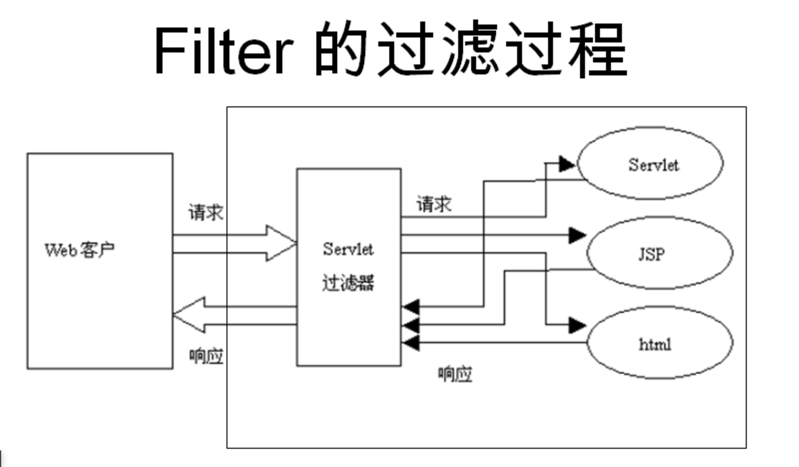

[toc]

# 客户端响应

当浏览器请求一个网页时，它会向网络服务器发送一系列不能被直接读取的信息，因为这些信息是作为HTTP信息头的一部分来传送的。

## 浏览器信息头部

下表列出了浏览器端信息头的一些重要内容，在以后的网络编程中将会经常见到这些信息：
- `Accept`: 指定浏览器或其他客户端可以处理的MIME类型。它的值通常为 image/png 或 image/jpeg
> MIME类型（Multipurpose Internet Mail Extensions，通用互联网邮件扩展）是一种标准，用于指示文件的性质和格式。它允许客户端（如Web浏览器）知道如何处理不同类型的文件。  
> MIME类型通常由两部分组成，格式为 类型/子类型

- `Accept-Charset`: 指定浏览器要使用的字符集。比如 ISO-8859-1
- `Accept-Encoding`: 指定编码类型。它的值通常为 gzip 或compress
- `Accept-Language`: 指定客户端首选语言，servlet会优先返回以当前语言构成的结果集，如果servlet支持这种语言的话。比如 en，en-us，ru等等
- `Authorization`: 在访问受密码保护的网页时识别不同的用户

- `Connection`: 表明客户端是否可以处理HTTP持久连接。
> 持久连接允许客户端或浏览器在一个请求中获取多个文件。Keep-Alive 表示启用持久连接
- `Content-Length`: 仅适用于POST请求，表示 POST 数据的字节数
- `Cookie`: 返回先前发送给浏览器的cookies至服务器
- `Host`: 指出原始URL中的主机名和端口号
- `If-Modified-Since`: 表明只有当网页在指定的日期被修改后客户端才需要这个网页。 服务器发送304码给客户端，表示没有更新的资源
- `If-Unmodified-Since`: 与If-Modified-Since相反， 只有文档在指定日期后仍未被修改过，操作才会成功
- `Referer`: 标志着所引用页面的URL。比如，如果你在页面1，然后点了个链接至页面2，那么页面1的URL就会包含在浏览器请求页面2的信息头中
- `User-Agent`: 用来区分不同浏览器或客户端发送的请求，并对不同类型的浏览器返回不同的内容


## `HttpServletRequest`类

request对象是javax.servlet.http.HttpServletRequest类的实例。每当客户端请求一个页面时，JSP引擎就会产生一个新的对象来代表这个请求。

request对象提供了一系列方法来获取HTTP信息头，包括表单数据，cookies，HTTP方法等等。

接下来将会介绍一些在JSP编程中常用的获取HTTP信息头的方法。详细内容请见下表：

- `Cookie[] getCookies()`: 返回客户端所有的Cookie的数组
- `Enumeration getAttributeNames()`: 返回request对象的所有属性名称的集合
- `Enumeration getHeaderNames()`: 返回所有HTTP头的名称集合
- `Enumeration getParameterNames()`: 返回请求中所有参数的集合
- `HttpSession getSession()`: 返回request对应的session对象，如果没有，则创建一个
- `HttpSession getSession(boolean create)`: 返回request对应的session对象，如果没有并且参数create为true，则返回一个新的session对象
- `Locale getLocale()`: 返回当前页的Locale对象，可以在response中设置
- `Object getAttribute(String name)`: 返回名称为name的属性值，如果不存在则返回null。
- `ServletInputStream getInputStream()`: 返回请求的输入流
- `String getAuthType()`: 返回认证方案的名称，用来保护servlet，比如 "BASIC" 或者 "SSL" 或 null 如果 JSP没设置保护措施
- `String getCharacterEncoding()`: 返回request的字符编码集名称
- `String getContentType()`: 返回request主体的MIME类型，若未知则返回null
- `String getContextPath()`: 返回request URI中指明的上下文路径
- `String getHeader(String name)`: 返回name指定的信息头
- `String getMethod()`: 返回此request中的HTTP方法，比如 GET,，POST，或PUT
- `String getParameter(String name)`: 返回此request中name指定的参数，若不存在则返回null
- `String getPathInfo()`: 返回任何额外的与此request URL相关的路径
- `String getProtocol()`: 返回此request所使用的协议名和版本
- `String getQueryString()`: 返回此 request URL包含的查询字符串
- `String getRemoteAddr()`: 返回客户端的IP地址
- `String getRemoteHost()`: 返回客户端的完整名称
- `tring getRemoteUser()`: 返回客户端通过登录认证的用户，若用户未认证则返回null
- `String getRequestURI()`: 返回request的URI
- `String getRequestedSessionId()`: 返回request指定的session ID
- `String getServletPath()`: 返回所请求的servlet路径
- `String[] getParameterValues(String name)`: 返回指定名称的参数的所有值，若不存在则返回null
- `boolean isSecure()`: 返回request是否使用了加密通道，比如HTTPS
- `int getContentLength()`: 返回request主体所包含的字节数，若未知的返回-1
- `int getIntHeader(String name)`: 返回指定名称的request信息头的值
- `int getServerPort()`: 返回服务器端口号


# 服务器响应

Response响应对象主要将JSP容器处理后的结果传回到客户端。可以通过response变量设置HTTP的状态和向客户端发送数据，如Cookie、HTTP文件头信息等。


## HTTP1.1响应头

HTTP1.1响应头中最有用的部分，在网络编程中您将会经常见到它们:
- `Allow`: 指定服务器支持的request方法（GET，POST等等）
- `Cache-Control`: 指定响应文档能够被安全缓存的情况。通常取值为 public，private 或no-cache 等等。
> Public意味着文档可缓存，Private意味着文档只为单用户服务并且只能使用私有缓存。No-cache 意味着文档不被缓存。
- `Connection`: 命令浏览器是否要使用持久的HTTP连接。
> close值 命令浏览器不使用持久HTTP连接，而keep-alive 意味着使用持久化连接。
- `Content-Disposition`: 让浏览器要求用户将响应以给定的名称存储在磁盘中
- `Content-Encoding`: 指定传输时页面的编码规则
- `Content-Language`: 表述文档所使用的语言，比如en， en-us,，ru等等
- `Content-Length`: 表明响应的字节数。只有在浏览器使用持久化 (keep-alive) HTTP 连接时才有用
- `Content-Type`: 表明文档使用的MIME类型
- `Expires`: 指明啥时候过期并从缓存中移除
- `Last-Modified`: 指明文档最后修改时间。客户端可以 缓存文档并且在后续的请求中提供一个 If-Modified-Since请求头
- `Location`: 在300秒内，包含所有的有一个状态码的响应地址，浏览器会自动重连然后检索新文档
- `Refresh`: 指明浏览器每隔多久请求更新一次页面。
- `Retry-After`: 与503 (Service Unavailable)一起使用来告诉用户多久后请求将会得到响应
- `Set-Cookie`: 指明当前页面对应的cookie


## `HttpServletResponse`类

response 对象是 javax.servlet.http.HttpServletResponse 类的一个实例。就像服务器会创建request对象一样，它也会创建一个客户端响应。

response对象定义了处理创建HTTP信息头的接口。通过使用这个对象，开发者们可以添加新的cookie或时间戳，还有HTTP状态码等等。

下表列出了用来设置HTTP响应头的方法，这些方法由HttpServletResponse 类提供：
- `String encodeRedirectURL(String url)`: 对sendRedirect()方法使用的URL进行编码
- `String encodeURL(String url)`: 将URL编码，回传包含Session ID的URL
- `boolean containsHeader(String name)`: 返回指定的响应头是否存在
- `boolean isCommitted()`: 返回响应是否已经提交到客户端
- `void addCookie(Cookie cookie)`: 添加指定的cookie至响应中
- `void addDateHeader(String name, long date)`: 添加指定名称的响应头和日期值
- `void addHeader(String name, String value)`: 添加指定名称的响应头和值
- `void addIntHeader(String name, int value)`: 添加指定名称的响应头和int值
- `void flushBuffer()`: 将任何缓存中的内容写入客户端
- `void reset()`: 清除任何缓存中的任何数据，包括状态码和各种响应头
- `void resetBuffer()`: 清除基本的缓存数据，不包括响应头和状态码
- `void sendError(int sc)`: 使用指定的状态码向客户端发送一个出错响应，然后清除缓存
- `void sendError(int sc, String msg)`: 使用指定的状态码和消息向客户端发送一个出错响应
- `void sendRedirect(String location)`: 使用指定的URL向客户端发送一个临时的间接响应
- `void setBufferSize(int size)`: 设置响应体的缓存区大小
- `void setCharacterEncoding(String charset)`: 指定响应的编码集（MIME字符集），例如UTF-8
- `void setContentLength(int len)`: 指定HTTP servlets中响应的内容的长度，此方法用来设置 HTTP Content-Length 信息头
- `void setContentType(String type)`: 设置响应的内容的类型，如果响应还未被提交的话
- `void setDateHeader(String name, long date)`: 使用指定名称和日期设置响应头的名称和日期
- `void setHeader(String name, String value)`: 使用指定名称和值设置响应头的名称和内容
- `void setIntHeader(String name, int value)`: 指定 int 类型的值到 name 标头
- `void setLocale(Locale loc)`: 设置响应的语言环境，如果响应尚未被提交的话
- `void setStatus(int sc)`: 设置响应的状态码


# HTTP状态码

HTTP请求与HTTP响应的格式相近，都有着如下结构：
- 以状态行+CRLF（回车换行）开始
- 零行或多行头模块+CRLF
- 一个空行，比如CRLF
- 可选的消息体比如文件，查询数据，查询输出


## 状态码

状态行包含HTTP版本，一个状态码，和状态码相对应的短消息。
|状态码 |	消息 |	描述 |
|--- | --- | --- |
| 100 |	Continue	| 只有一部分请求被服务器接收，但只要没被服务器拒绝，客户端就会延续这个请求 |
| 101 |	Switching Protocols	| 服务器交换机协议 |
| 200 |	OK	| 请求被确认 |
| 201 |	Created	| 请求时完整的，新的资源被创建 |
| 202 |	Accepted	| 请求被接受，但未处理完 |
| 203 |	Non-authoritative  Information |	  |
| 204 |	No  Content	 | |
| 205 |	Reset  Content|	  |
| 206 |	Partial  Content|	  |
| 300 |	Multiple Choices	| 一个超链接表，用户可以选择一个超链接并访问，最大支持5个超链接 |
| 301 |	Moved Permanently	| 被请求的页面已经移动到了新的URL下 |
| 302 |	Found	| 被请求的页面暂时性地移动到了新的URL下 |
| 303 |	See Other	| 被请求的页面可以在一个不同的URL下找到 |
| 304 |	Not  Modified|	  |
| 305 |	Use  Proxy|	  |
| 306 |	Unused	| 已经不再使用此状态码，但状态码被保留 |
| 307 |	Temporary Redirect	| 被请求的页面暂时性地移动到了新的URL下 |
| 400 |	Bad Request	| 服务器无法识别请求 |
| 401 |	Unauthorized	| 被请求的页面需要用户名和密码 |
| 402 |	Payment Required	| 目前还不能使用此状态码 |
| 403 |	Forbidden	| 禁止访问所请求的页面 |
| 404 |	Not Found	| 服务器无法找到所请求的页面 |
| 405 |	Method Not Allowed	| 请求中所指定的方法不被允许 |
| 406 |	Not Acceptable	| 服务器只能创建一个客户端无法接受的响应 |
| 407 |	Proxy Authentication Required	| 在请求被服务前必须认证一个代理服务器 |
| 408 |	Request Timeout	| 请求时间超过了服务器所能等待的时间，连接被断开 |
| 409 |	Conflict	| 请求有矛盾的地方 |
| 410 |	Gone	| 被请求的页面不再可用 |
| 411 |	Length Required	| "Content-Length"没有被定义，服务器拒绝接受请求 |
| 412 |	Precondition Failed	| 请求的前提条件被服务器评估为false |
| 413 |	Request Entity Too Large	| 因为请求的实体太大，服务器拒绝接受请求 |
| 414 |	Request-url Too Long	| 服务器拒绝接受请求，因为URL太长。多出现在把"POST"请求转换为"GET"请求时所附带的大量查询信息 |
| 415 |	Unsupported Media Type	| 服务器拒绝接受请求，因为媒体类型不被支持 |
| 417 |	Expectation  Failed|	  |
| 500 |	Internal Server Error	| 请求不完整，服务器遇见了出乎意料的状况 |
| 501 |	Not Implemented	| 请求不完整，服务器不提供所需要的功能 |
| 502 |	Bad Gateway	| 请求不完整，服务器从上游服务器接受了一个无效的响应 |
| 503 |	Service Unavailable	| 请求不完整，服务器暂时重启或关闭 |
| 504 |	Gateway Timeout	| 网关超时 |
| 505 |	HTTP Version Not Supported	| 服务器不支持所指定的HTTP版本 |

## 设置状态码


- `public void setStatus ( int statusCode )`: 此方法可以设置任意的状态码。如果您的响应包含一个特殊的状态码和一个文档，请确保在用PrintWriter返回任何内容前调用setStatus方法
- `public void sendRedirect(String url)`: 此方法产生302响应，同时产生一个 Location 头告诉URL 一个新的文档
- `public void sendError(int code, String message)`: 此方法将一个状态码(通常为 404)和一个短消息，自动插入HTML文档中并发回给客户端


# 表单处理

我们在浏览网页的时候，经常需要向服务器提交信息，并让后台程序处理。浏览器中使用 GET 和 POST 方法向服务器提交数据。


## `GET`方法


GET方法将请求的编码信息添加在网址后面，网址与编码信息通过"?"号分隔。如下所示：
```
http://www.runoob.com/hello?key1=value1&key2=value2
```
- GET方法是浏览器默认传递参数的方法，一些敏感信息，如密码等建议不使用GET方法。
- 用get时，传输数据的大小有限制 （注意不是参数的个数有限制），最大为1024字节。


## `POST`方法

一些敏感信息，如密码等我们可以通过POST方法传递，POST提交数据是隐式的。

POST提交数据是不可见的，GET是通过在url里面传递的（可以看一下你浏览器的地址栏）。

JSP使用getParameter()来获得传递的参数，getInputStream()方法用来处理客户端的二进制数据流的请求。

## `JPS`读取表单数据


```html
<body>
    <!-- 此处action定义将处理该表单的jsp页面，method设置方式 -->
    <form action="targetFileName.jsp" method="GET/POST">
        ...
    </form>
</body>
```

- `getParameter():`: 使用 request.getParameter() 方法来获取表单参数的值。
> 复选框Checkbox的结果是on/off

- `getParameterValues()`: 获得如checkbox类（名字相同，但值有多个）的数据。 接收数组变量 ，如checkbox类型

- `getParameterNames()`:该方法可以取得所有变量的名称，该方法返回一个 Enumeration。
> 该方法可以取得所有变量的名称，该方法返回一个枚举。可以调用 hasMoreElements() 方法来确定是否还有元素，以及使用nextElement（）方法来获得每个参数的名称。

- `getInputStream()`:调用此方法来读取来自客户端的二进制数据流。


# 过滤器


过滤器是Java 类，可实现
- 在客户端的请求访问后端资源之前，拦截这些请求。
- 在服务器的响应发送回客户端之前，处理这些响应。
> 以变换或使用包含在请求或响应中的信息


可以将一个或多个过滤器附加到一个 Servlet 或一组 Servlet。过滤器也可以附加到 JavaServer Pages (JSP) 文件和 HTML 页面。


根据规范建议的各种类型的过滤器
- 身份验证过滤器（Authentication Filters）。
- 数据压缩过滤器（Data compression Filters）。
- 加密过滤器（Encryption Filters）。
- 触发资源访问事件过滤器。
- 图像转换过滤器（Image Conversion Filters）。
- 日志记录和审核过滤器（Logging and Auditing Filters）。
- MIME-TYPE 链过滤器（MIME-TYPE Chain Filters）。
- 标记化过滤器（Tokenizing Filters）。
- XSL/T 过滤器（XSL/T Filters），转换 XML 内容。

过滤器通过 Web 部署描述符（web.xml）中的 XML 标签来声明，然后映射到您的应用程序的部署描述符中的 Servlet 名称或 URL 模式。

当 Web 容器启动 Web 应用程序时，它会为您在部署描述符中声明的每一个过滤器创建一个实例。

Filter 的执行顺序与在 web.xml 配置文件中的配置顺序一致，一般把 Filter 配置在所有的 Servlet 之前。




## Servlet过滤器方法

过滤器是一个实现了 javax.servlet.Filter 接口的 Java 类。javax.servlet.Filter 接口定义了三个方法：

- `public void init(FilterConfig filterConfig)`
    - web应用程序启动时
    - web服务器将创建Filter 的实例对象
    - 并调用其init方法，读取web.xml配置
    - 完成对象的初始化功能，从而为后续的用户请求作好拦截的准备工作（filter对象只会创建一次，init方法也只会执行一次）
    - 开发人员通过init方法的参数，可获得代表当前filter配置信息的FilterConfig对象。

- `public void doFilter(ServletRequest,ServletRespose,FilterChain)`
    - 该方法完成实际的过滤操作，  
    - 当客户端的请求与过滤器设置的 URL 匹配时，Servlet 容器将先调用过滤器的 doFilter 方法。
    - FilterChain 用于访问后续过滤器。


- `public void destroy()`
    - Servlet容器在销毁过滤器实例前调用该方法，在该方法中释放Servlet过滤器占用的资源。


### web.xml配置各节点说明

```xml
<web-app xmlns="http://java.sun.com/xml/ns/javaee" version="3.0">
    <!-- 过滤器定义 -->
    <filter>
        <!-- 用于为过滤器指定一个名字，该元素的内容不能为空 -->
        <filter-name>ExampleFilter</filter-name>
        <!-- 用于指定过滤器的完整的限定类名 -->
        <filter-class>com.example.filters.ExampleFilter</filter-class>
        <!-- 用于为过滤器指定初始化参数 -->
        <!-- 在过滤器中，可以使用FilterConfig接口对象来访问初始化参数。 -->
        <init-param>
            <!-- 指定参数的名字 -->
            <param-name>param1</param-name>
            <!-- 指定参数的值 -->
            <param-value>value1</param-value>
        </init-param>
    </filter>

    <!-- 过滤器映射 -->
    <!-- 用于设置一个 Filter 所负责拦截的资源。 -->
    <!-- 一个Filter拦截的资源可通过两种方式来指定： -->
    <!-- - Servlet 名称 -->
    <!-- - 资源访问的请求路径 -->
    <filter-mapping>
        <!-- 用于设置filter的注册名称。该值必须是在<filter>元素中声明过的过滤器的名字 -->
        <filter-name>ExampleFilter</filter-name>
        <!-- 设置 filter 所拦截的请求路径(过滤器关联的URL样式) -->
        <url-pattern>/example/*</url-pattern>
        <!-- 指定过滤器所拦截的资源被 Servlet 容器调用的方式，可以是REQUEST, INCLUDE, FORWARD和ERROR之一，默认REQUEST -->
        <!-- 可以设置多个<dispatcher>子元素用来指定 Filter 对资源的多种调用方式进行拦截 -->
        <!-- 当用户直接访问页面时，Web容器将会调用过滤器 -->
        <dispatcher>REQUEST</dispatcher>
        <!-- 如果目标资源是通过RequestDispatcher的forward()方法访问时，那么该过滤器将被调用 -->
        <dispatcher>FORWARD</dispatcher>
        <!-- 如果目标资源是通过RequestDispatcher的include()方法访问时，那么该过滤器将被调用 -->
        <dispatcher>INCLUDE</dispatcher>
        <!-- 如果目标资源是通过声明式异常处理机制调用时，那么该过滤器将被调用。 -->
        <dispatcher>ERROR</dispatcher>

    </filter-mapping>

    <!-- 可选：过滤器映射到特定Servlet -->
    <filter-mapping>
        <!-- 设置filter的注册名称 -->
        <filter-name>ExampleFilter</filter-name>
        <!-- 指定过滤器所拦截的Servlet名称 -->
        <servlet-name>ExampleServlet</servlet-name>
    </filter-mapping>
</web-app>
```
### FilterConfig 使用

Filter 的 init 方法参数中提供了一个 FilterConfig 对象。

```java
public void  init(FilterConfig config) throws ServletException {
    // 获取初始化参数
    String value = config.getInitParameter("name"); 
    // 输出初始化参数
    System.out.println("网站名称: " + value); 
}
```


<!-- TODO: next will try complete -->


# Cookie处理

cookie是存储在客户机的文本文件，它们保存了大量轨迹信息。


有三个步骤来识别回头客
- 服务器脚本发送一系列 cookie 至浏览器。比如名字，年龄，ID 号码等等。
- 浏览器在本地机中存储这些信息，以备不时之需。
- 当下一次浏览器发送任何请求至服务器时，它会同时将这些 cookie 信息发送给服务器，然后服务器使用这些信息来识别用户或者干些其它事情。

## Cookie刨析

Cookie 通常在 HTTP 信息头中设置（虽然 JavaScript 能够直接在浏览器中设置 cookie）。

在 JSP 中，设置一个 cookie 需要发送如下的信息头给服务器：

```text
HTTP/1.1 200 OK
Date: Fri, 04 Feb 2015 21:03:38 GMT
Server: Apache/1.3.9 (UNIX) PHP/4.0b3

Set-Cookie: name=runoob; expires=Friday, 04-Feb-17 22:03:38 GMT; 
                 path=/; domain=runoob.com

Connection: close
Content-Type: text/html
```
Set-Cookie 信息头包含
- 一个键值对: 键值对会被编码为URL
- 一个 GMT（格林尼治标准）时间: 有效期域是个指令，告诉浏览器在什么时候之后就可以清除这个 cookie。
- 一个路径
- 一个域名。  


如果浏览器被配置成可存储 cookie，那么它将会保存这些信息直到过期。如果用户访问的任何页面匹配了 cookie 中的路径和域名，那么浏览器将会重新将这个 cookie 发回给服务器。浏览器端的信息头长得就像下面这样：
```text
GET / HTTP/1.0
Connection: Keep-Alive
User-Agent: Mozilla/4.6 (X11; I; Linux 2.2.6-15apmac ppc)
Host: zink.demon.co.uk:1126
Accept: image/gif, */*
Accept-Encoding: gzip
Accept-Language: en
Accept-Charset: iso-8859-1,*,utf-8
Cookie: name=xyz
```
JSP 脚本通过 request 对象中的 getCookies() 方法来访问这些 cookie，这个方法会返回一个 Cookie 对象的数组。


## servlet cookie 方法

| 序号 | 方法                          | 描述                                                                                      |
| --- |---|---|
| 1    | `public void setDomain(String pattern)` | 设置 cookie 的域名，比如 `runoob.com`                                                      |
| 2    | `public String getDomain()`             | 获取 cookie 的域名，比如 `runoob.com`                                                      |
| 3    | `public void setMaxAge(int expiry)`     | 设置 cookie 有效期，以秒为单位，默认有效期为当前 session 的存活时间                          |
| 4    | `public int getMaxAge()`               | 获取 cookie 有效期，以秒为单位，默认为 `-1`，表明 cookie 会活到浏览器关闭为止                 |
| 5    | `public String getName()`              | 返回 cookie 的名称，名称创建后将不能被修改                                                  |
| 6    | `public void setValue(String newValue)` | 设置 cookie 的值                                                                          |
| 7    | `public String getValue()`             | 获取 cookie 的值                                                                          |
| 8    | `public void setPath(String uri)`       | 设置 cookie 的路径，默认为当前页面目录下的所有 URL 以及此目录下的所有子目录                  |
| 9    | `public String getPath()`              | 获取 cookie 的路径                                                                        |
| 10   | `public void setSecure(boolean flag)`   | 指明 cookie 是否要加密传输                                                                |
| 11   | `public void setComment(String purpose)`| 设置注释，描述 cookie 的目的。当浏览器将 cookie 展现给用户时，注释将会变得非常有用            |
| 12   | `public String getComment()`           | 返回描述 cookie 目的的注释，若没有则返回 `null`                                            |

## 使用jsp设置cookie

1. 创建一个cookie对象

```java
Cookie cookie = new Cookie("key","value");
```
> 名称和值中不能包含\[ ] ( ) = , " / ? @ : ;


2. 设置有效期

```java
cookie.setMaxAge(60*60*24); 
```
> 参数以秒为单位


3. 将cookie添加至HTTP响应头中

```java
response.addCookie(cookie);
```


## 使用jsp读取cookie

想要读取 cookie，您就需要调用 request.getCookies() 方法来获得一个 javax.servlet.http.Cookie 对象的数组，然后遍历这个数组，使用 getName() 方法和 getValue() 方法来获取每一个 cookie 的名称和值。


## 使用jsp删除cookie 

1. 获取一个已经存在的 cookie 然后存储在 Cookie 对象中。
2. 将 cookie 的有效期设置为 0。
3. 将这个 cookie 重新添加进响应头中。
> 其后再获取该key值，其value值为null


# Session


HTTP是无状态协议，这意味着每次客户端检索网页时，都要单独打开一个服务器连接，因此服务器不会记录下先前客户端请求的任何信息。

有三种方法来维持客户端与服务器的会话：


## cookie 

网络服务器可以指定一个唯一的session ID作为cookie来代表每个客户端，用来识别这个客户端接下来的请求。

这可能不是一种有效的方式，因为很多时候浏览器并不一定支持cookie，所以我们不建议使用这种方法来维持会话。


## 隐藏表单域

一个网络服务器可以发送一个隐藏的HTML表单域和一个唯一的session ID，就像下面这样：

```html
<input type="hidden" name="sessionid" value="12345">
```

这个条目意味着，当表单被提交时，指定的名称和值将会自动包含在GET或POST数据中。每当浏览器发送一个请求，session_id的值就可以用来保存不同浏览器的轨迹。

> 这种方式可能是一种有效的方式，但点击<A HREF>标签中的超链接时不会产生表单提交事件，因此隐藏表单域也不支持通用会话跟踪。

## 重写URL

可以在每个URL后面添加一些额外的数据来区分会话，服务器能够根据这些数据来关联session标识符

例如，使用http://w3cschool.cc/file.htm;sessionid=12345，session标识符为sessionid=12345，服务器可以用这个数据来识别客户端。


## session对象

除了以上几种方法外，JSP利用servlet提供的HttpSession接口来识别一个用户，存储这个用户的所有访问信息。

JSP引擎将隐含的session对象暴露给开发者，开发者可以通过他很方便的存储或检索数据

| 方法                                      | 描述                                                                         |
|-----------|------------------------------------|
| `public Object getAttribute(String name)` | 返回 session 对象中与指定名称绑定的对象，如果不存在则返回 `null`              |
| `public Enumeration getAttributeNames()` | 返回 session 对象中所有的对象名称                                            |
| `public long getCreationTime()`          | 返回 session 对象被创建的时间，以毫秒为单位，从 1970 年 1 月 1 日凌晨开始算起   |
| `public String getId()`                  | 返回 session 对象的 ID                                                       |
| `public long getLastAccessedTime()`      | 返回客户端最后访问的时间，以毫秒为单位，从 1970 年 1 月 1 日凌晨开始算起       |
| `public int getMaxInactiveInterval()`    | 返回最大时间间隔，以秒为单位，servlet 容器将会在这段时间内保持会话打开          |
| `public void invalidate()`               | 将 session 无效化，解绑任何与该 session 绑定的对象                             |
| `public boolean isNew()`                 | 返回是否为一个新的客户端，或者客户端是否拒绝加入 session                       |
| `public void removeAttribute(String name)` | 移除 session 中指定名称的对象                                                |
| `public void setAttribute(String name, Object value)` | 使用指定的名称和值来产生一个对象并绑定到 session 中                          |
| `public void setMaxInactiveInterval(int interval)` | 用来指定时间，以秒为单位，servlet 容器将会在这段时间内保持会话有效              |


# 文件上传

JSP 可以与 HTML form 标签一起使用，来允许用户上传文件到服务器。

## 创建一个文件上传表单

- 表单 method 属性应该设置为 POST 方法，不能使用 GET 方法
- 表单 enctype 属性应该设置为 multipart/form-data
- 表单 action 属性应该设置为在后端服务器上处理文件上传的 Servlet 文件
- 上传单个文件，您应该使用单个带有属性 type="file" 的 <input .../> 标签。
-为了允许多个文件上传，请包含多个 name 属性值不同的 input 标签。输入标签具有不同的名称属性的值。浏览器会为每个 input 标签关联一个浏览按钮。


```html
<form method="post" action="处理上传java文件的路径(不带.java后缀)" enctype="multipart/form-data">
    选择一个文件:
    <input type="file" name="uploadFile" />
    <br/><br/>
    <input type="submit" value="上传" />
</form>

```

## 编写后台处理代码

确保依赖包已经引入到项目的 WEB-INF/lib 目录下：
- 依赖于 FileUpload，所以一定要确保在您的 classpath 中有最新版本的 commons-fileupload.x.x.jar 文件
- FileUpload 依赖于 Commons IO，所以一定要确保在您的 classpath 中有最新版本的 commons-io-x.x.jar 文件


## 编译和运行Servet

编译上面的后台处理代码文件，并在web.xml文件中创建所需的条目

<!-- NOTE: 仔细的代码过程缺少 -->


# 日期处理

使用JSP最重要的优势之一，就是可以使用所有Java  API。本章将会详细地讲述Java中的Date类，它在java.util包下，封装了当前日期和时间。可用来处理jsp中的日期


# JSP页面重定向

当需要将文档移动到一个新的位置时，就需要使用JSP重定向了。

最简单的重定向方式就是使用response对象的sendRedirect()方法。这个方法的签名如下：
```java
public void response.sendRedirect(String location) throws IOException
```

这个方法将状态码和新的页面位置作为响应发回给浏览器。您也可以使用setStatus()和setHeader()方法来得到同样的效果：
```java
....
String site = "http://www.runoob.com" ;
response.setStatus(response.SC_MOVED_TEMPORARILY);
response.setHeader("Location", site); 
....
```

```html
<%@ page language="java" contentType="text/html; charset=UTF-8"
    pageEncoding="UTF-8"%>
<%@ page import="java.io.*,java.util.*" %>
<html>
<html>
<head>
<title>页面重定向</title>
</head>
<body>

<h1>页面重定向</h1>

<%
   // 重定向到新地址
   String site = new String("http://www.runoob.com");
   response.setStatus(response.SC_MOVED_TEMPORARILY);
   response.setHeader("Location", site); 
%>

</body>
</html>
```


# 点击量统计


application对象表示JSP页面的整个生命周期中

当JSP页面初始化时创建此对象，当JSP页面调用jspDestroy()时删除该对象。

- 在应用中创建变量的语法
```java
application.setAttribute(String Key, Object Value);
```
- 读取该变量的方法如下
```java
application.getAttribute(String Key);
```


> 使用以上方法，在 web 服务器重启后，保留的数据都会消失

# 自动刷新

刷新一个页面最简单的方式就是使用response对象的setIntHeader()方法。这个方法的签名如下：
```java
public void setIntHeader(String header, int headerValue)

// 设置每隔5秒刷新一次页面，每次刷新都会重新执行该页中的jsp代码
//<%
//  response.setIntHeader("Refresh", 5);
//%>
```
这个方法通知浏览器在给定的时间后刷新，时间以秒为单位。


# 发送邮件


使用JSP实现邮件发送功能很简单，但是需要有JavaMail API，并且需要安装JavaBean Activation Framework


