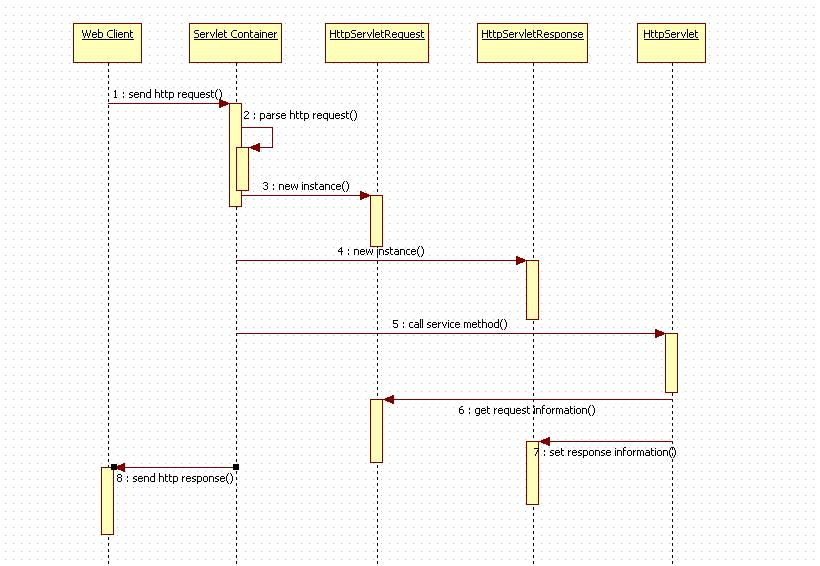

本节将servlet分为两个部分，首先是Servlet的介绍和实现方法，其次是Servlet中可操作的五大对象，包括三大域对象在其中


[toc]

# 1. Servlet的介绍


Servlet 是 Server 与 Applet 的缩写，意为服务端小程序

Servlet是用Java语言编写的服务器端程序，可以动态生成WEB页，Servlet主要运行在服务器端，并由服务器调用执行，是一种**按照Servlet标准来开发的类**。

Servlet 本质上也是 Java 类，但要遵循 Servlet 规范进行编写
- 没有main()方法
- 它的创建、使用、销毁都由 Servlet 容器进行管理(如 Tomcat)


## 1.1 Servlet实现

1. 创建Web项目
2. 新建类
3. 实现Servletgv规范 
    - 继承HttpServlet类
    - 重写service(doGet()/doPost)方法: 用于处理请求
    - 设置注解: 特定请求对应特定资源
4. 发布项目并启动服务


```java
@WebServlet("/ser01")
public class Servlet01 extends HttpServlet {
    @Override
    protected void service(HttpServletRequest req, HttpServletResponse resp){
        ...
    }
}
```
- 当客户端请求访问`http://ip:port/project_name/ser01`资源时，会将该请求转到`Servlet01`进行处理
- web容器会将http请求转换为一个`HttpServletRequest`对象，传递至`service()`函数的参数`req`
- Servlet类对象对其该请求进行处理后，将设置参数中`HttpServletResponse`对象`resp`的属性
- web容器再将`resp`的值转换为http响应返回客户端


## 1.2 Tomcat和Servlet




1. Web Client 向 Servlet 容器（Tomcat）发出 Http 请求
2. Servlet 容器接收 Web Client 的请求
3. Servlet 容器创建一个 HttpServletRequest 对象，将 Web Client 请求的信息封装到这个对象中
4. Servlet 容器创建一个 HttpServletResponse 对象
5. Servlet 容器调HttpServlet 对象service 方法，把 Request 与 Response 作为参数，传给HttpServlet
6. HttpServlet 调用 HttpServletRequest 对象的有关方法，获取 Http 请求信息
7. HttpServlet 调用 HttpServletResponse 对象的有关方法，生成响应数据
8. Servlet 容器把 HttpServlet 的响应结果传给 Web Client


## 1.3 Servlet的生命周期

Servlet没有main()方法，不能独立运行，它的运行完全由Servlet引擎来控制和调度。

Servlet 的生命周期，简单的概括这就分为四步：servlet 类加载-->实例化-->服务-->销毁。


1. 实例和初始化时机

当请求到达容器时
- 容器查找该servlet对象是否存在
- 如果不存在，则会创建实例并进行初始化

```java
// 在Servlet实例创建之后执行
public void init(ServletConfig config){
    ...
}
```

2. 就绪/调用/服务阶段

有请求到达容器
- 容器调用servlet对象的service()方法
- 处理请求的方法在整个生命周期中可以被多次调用

HttpServlet的service()方法，会依据请求方式来调用doGet()或者doPost()方法。但是，这两个do方法默认情况下，会抛出异常，需要子类去 override。

```java
// 每次有请求到达某个Servlet方法时执行，用来处理请求
protected void service(HttpServletRequest req, HttpServletResponse resp){
    ...
}
```

3. 销毁时机

当容器关闭时（应用程序停止时），会将程序中的Servlet实例进行销毁。

```java
// Servlet 实例销毁时执行
public void destroy() {
    ...
}
```


# 2. request和response对象

Web服务器收到客户端的http请求，针对每一次请求，分别创建一个用于代表请求的request对象和代表响应的response对象。

request和response 对象代表请求和响应
- 获取客户端数据，需要通过 request 对象
- 向客户端输出数据，需要通过 response 对象。


## 2.1 HttpServletRequest对象

用来接收客户端发送过来的请求信息

service()方法中形参接收的是 HttpServletRequest 接口的实例化对象，表示该对象主要应用在 HTTP 协议上，该对象是由 Tomcat 封装好传递过来。

> 目前，HttpServletRequest是ServletRequest的唯一子接口，如果以后出现更多新的协议，若想要支持这种新协议，只需要直接继承ServletRequest接口就行。

### 方法

在HttpServletRequest接口中，定义的方法很多，但都是围绕接收客户端参数的

1. 常用方法
- `getRequstURL()`: 获取客户端发出请求时的完整URL
- `getRequstURI()`: 获取请求行中的资源部分（项目名称开始）
- `getMethod()`: 获取请求行中的参数部分
- `getProtocol()`: 获取HTTP版本号
- `getContextPath`: 获取webapp名字

2. 获取请求参数
- `getParameter(name)`: 获取指定名称的参数
- `getParameterValues(String name)`: 获取指定名称参数的所有值


### reques对象作用域


作用范围：在一次请求中有效，即服务器跳转有效。
> 通过该对象可以在一个请求中传递数据

```java
// 设置域对象内容
request.setAttribute(String name, String value);
// 获取域对象内容
request.getAttribute(String name);
// 删除域对象内容
request.removeAttribute(String name);
```


### 请求转发

请求转发
- 是一种服务器的行为
- 当客户端请求到达后，服务器进行转发
- 此时会将请求对象进行保存，地址栏中的 URL 地址不会改变
- 得到响应后，服务器端再将响应发送给客户端，从始至终只有一个请求发出

```java
// 通过将当前service()的request和response对象传递给下一个Servlet的service()函数
// 保证了request和response始终是同一个
request.getRequestDispatcher(url).forward(request,response);
```


### 请求乱码问题

由于request属于接收客户端的参数，有其默认的语言编码，由于在解析过程中默认使用的编码方式为 ISO-8859-1(此编码不支持中文)，所以解析时一定会出现乱码

要想解决这种乱码问题，需要设置 request 中的编码方式，告诉服务器以何种方式来解析数据。或者在接收到乱码数据以后，再通过相应的编码格式还原

```java
// 方法一
request.setCharacterEncoding("UTF-8");
// 这种方式只针对 POST 有效（必须在接收所有的数据之前设定）

// 方法二
new String(request.getParameter(name).getBytes("ISO-8859-1"),"UTF-8");
```

Tomcat8及以后的GET方式请求是不会出现乱码的。


## 2.2 HttpServletResponse对象


HttpServletResponse的主要功能用于服务器对客户端的请求进行响应，将 Web 服务器处理后的结果返回给客户端。

service()方法中形参接收的是 HttpServletResponse 接口的实例化对象，这个对象中封装了向客户端发送数据、发送响应头，发送响应状态码的方法。


### 响应数据


接收到客户端请求后，可以通过 HttpServletResponse 对象直接进行响应，响应时需要获取输出流

> 有两种形式，不能同时使用
1. `getWriter()` : 获取字符流(只能响应回字符)

```java
// 字符输出流
PrintWriter writer = response.getWriter();
writer.write("Hello");
writer.write("<h2>Hello</h2>");
```

2. `getOutputStream()` : 获取字节流(能响应一切数据)  

```java
// 字节输出流
ServletOutputStream out = response.getOutputStream();
out.write("Hello".getBytes());
out.write("<h2>Hello</h2>".getBytes());
```


除此之外，我们还需要设置响应类型，默认是字符串
> 即`writer.write("<h2>Hello</h2>");`会原样输出，不会生成二号标题

```java
// 设置响应MIME类型
response.setHeader("content-type","text/html"); // html
```


### 重定向

重定向
- 是一种服务器指导，客户端的行为
- 客户端发出第一个请求，被服务器接收处理后，服务器会进行响应
- 在响应的同时，服务器会给客户端一个新的地址
- 当客户端接收到响应后，会立刻、马上、自动根据服务器给的新地址发起第二个请求
- 服务器接收请求并作出响应，重定向完成。

```java
// 重定向跳转到index.jsp
response.sendRedirect("index.jsp");
```


#### 请求转发和重定向的区别

`req.getRequestDispatcher().forward()` and `resp.sendRedirect()`
| 请求转发 | 重定向 |
| --- | --- |
| 一次请求，数据在`request`域中共享 | 两次请求，数据不再`request`域中共享 |
| 服务器端行为 | 客户端行为 |
| 地址栏不发生变化 | 地址了发生变化 |
| 绝对地址定位到站点后 | 绝对地址可写到http:// |

两者都可进行跳转，根据实际需求选取即可。


### 响应乱码问题

服务器端有一种编码方式，在客户端也存在一种编码方式，当两端使用的编码方式不同时则出现乱码

1. `getWriter()`的字符乱码

服务器端在进行编码时默认会使用 ISO-8859-1 格式的编码，该编码方式并不支持中文，响应中文必定出乱码


```java
// 在服务器端告知服务器使用UTF-8
response.setCharacterEncoding("UTF-8");
// 指定客户端的解码方式
response.setHeader("content-type", "text/html;charset=UTF-8");

// 以上两端编码的指定也可以使用一句替代，同时指定服务器和客户端
response.setContentType("text/html;charset=UTF-8");
```


2. `getOutputStream()`字节乱码

当服务器端给的字节恰好和客户端使用的编码方式一致时则文本正确显示，否则出现乱码。

```java
// 设置客户端的编码及响应类型
response.setHeader("content-type","text/html;charset=UTF-8");
// 设置文字转换为字节时使用的编码方式
ServletOutputStream out = response.getOutputStream();
out.write("<h2>你好</h2>".getBytes("UTF-8"));

// 同样也可以使用一句替代
// 设置客户端与服务端的编码
response.setContentType("text/html;charset=UTF-8");
```


总结：要想解决响应的乱码
- 只需要保证使用支持中文的编码格式
- 并且保证服务器端和客户端使用相同的编码方式


# 3. Cookie对象

Cookie是浏览器提供的一种技术
- 通过服务器的程序能将一些只须保存在客户端
- 或者在客户端进行处理的数据
- 放在本地的计算机上

有一个专门操作Cookie的类javax.servlet.http.Cookie
- 随着服务器端的响应发送给客户端，保存在浏览器
- 当下次再访问服务器时把Cookie再带回服务器

Cookie 的格式：键值对用`=`链接，多个键值对间通过`;`隔开。


## Cookie操作

1. 创建和发送

```java
// 创建Cookie对象
Cookie cookie = new Cookie("name","value");
// 添加Cookie对象到response对象中
response.addCookie(cookie);
// cookie随着服务器端的响应发送给客户端，保存在浏览器
```

2. Cookie的获取

在服务器端只提供了一个`getCookies()`的方法用来获取客户端回传的所有cookie组成的一个数组
- 如果需要获取单个cookie则需要通过遍历
- getName()获取 Cookie 的名称
- getValue()获取 Cookie 的值。

```java
// 获取Cookie数组
Cookie[] cookies = request.getCookies();
// 判断数组是否为空
if (cookies != null && cookies.length > 0) {
    // 遍历Cookie数组
    for (Cookie cookie : cookies){
        System.out.println(cookie.getName());
        System.out.println(cookie.getValue());
    }
}
```


3. 设置Cookie到期时间

到期时间用来指定该cookie何时失效。
- 默认为当前浏览器关闭即失效
- 通过`setMaxAge(int time)`方法手动设定cookie的最大有效时间，以秒为单位。
    - 若为负数，表示不存储该cookie，一旦关闭浏览器窗口，那么cookie就会消失
    - 若大于0的整数，表示存储的秒数
    - 若为0，表示删除该cookie。

```java
// 创建Cookie对象
Cookie cookie = new Cookie("name","value");
// 设置Cookie 3天后失效
cookie.setMaxAge(3 * 24 * 60 * 60);
// 发送Cookie对象
response.addCookie(cookie);
```


4. Cookie的路径


Cookie的setPath设置cookie的路径，这个请求路径决定该请求是否会携带某些cookie
- 当访问的路径包含了cookie的路径时，则该请求将带上该cookie
- 如果访问路径不包含cookie路径，则该请求不会携带该cookie

```java
/* 当前项目路径为：s01 */
Cookie cookie = new Cookie("name","value");

// 在当前服务器下任何项目都可访问到Cookie对象
cookie.setPath("/");
// 在当前项目下任何项目都可访问到Cookie对象
cookie.setPath("/s01"); // 默认情况，可不设置path的值
// 在s02项目下才可访问到Cookie对象
cookie.setPath("/s02"); // 只能在s02项目下获取Cookie，就算cookie是s01产生的，s01也不能
// 在s02/cook目录下才可访问到Cookie对象
cookie.setPath("/s01/cook");

response.addCookie(cookie);
```


## Cookie的注意点

1. Cookie保存在当前浏览器中

2. Cookie不能出现中文

3. 发送重复同名的Cookie会覆盖原有Cookie

4. 浏览器对Cookie的存储是有上限的


# 4. HttpSession对象

HttpSession对象是 javax.servlet.http.HttpSession 的实例

对于服务器而言，每一个连接到它的客户端都是一个session，servlet容器使用此接口创建HTTP客户端和HTTP服务器之间的会话。

会话将保留指定的时间段，跨多个连接或来自用户的页面请求。

一个会话通常对应于一个用户，该用户可能多次访问一个站点。可以通过此接口查看和操作有关某个会话的信息，比如会话标识符、创建时间和最后一次访问时间。

在整个 session 中，最重要的就是属性的操作。

Session 的作用就是为了标识一次会话，或者说确认一个用户；并且在一次会话（一个用户的多次请求）期间共享数据。我们可以通过 request.getSession()方法，来获取当前会话的 session 对象。


```java
// 如果session对象存在，则获取；如果session对象不存在，则创建
HttpSession session = request.getSession();
```

## 标识符JSESSIONID


Session既然是为了标识一次会话，每个会话对应一个唯一的标志sessionId

每当一次请求到达服务器，如果开启了会话（访问了 session）
- 服务器第一步会查看是否从客户端回传一个名为 JSESSIONID 的 cookie
- 如果没有则认为这是一次新的会话，会创建 一个新的 session 对象，并用唯一的 sessionId 为此次会话做一个标志
- 如果有 JESSIONID 这 个cookie回传，服务器则会根据 JSESSIONID 这个值去查看是否含有id为JSESSION值的session 对象
- 如果没有则认为是一个新的会话，重新创建一个新的 session 对象，并标志此次会话
- 如果找到了相应的 session 对象，则认为是之前标志过的一次会话，返回该 session 对象，数据达到共享。


这里提到一个叫做 JSESSIONID 的 cookie，这是一个比较特殊的 cookie，当用户请求服务器时，如果访问了 session，则服务器会创建一个名为 JSESSIONID，值为获取到的 session（无论是获取到的还是新创建的）的 sessionId 的 cookie 对象，并添加到 response 对象中，响应给客户端，有效时间为关闭浏览器。

> 所以 Session 的底层依赖 Cookie 来实现。


## session域对象

Session用来表示一次会话，在一次会话中数据是可以共享的，这时session作为域对象存在

```java
// 获取session对象
HttpSession session = request.getSession();
// 向session域对象中添加数据
session.setAttribute("name","value");
// 从域对象中获取指定数据
String uname = (String) request.getAttribute("name");
// 从域对象session中移除数据
session.removeAttribute("name");
```


## session对象的销毁

当客户端第一次请求servlet并且操作session时，session 对象生成

1. 默认时间到期

Tomcat中session默认的存活时间为30min，即你不操作界面的时间，一旦有操作，session 会重新计时。

session的默认时机可以在 Tomcat 中的 conf 目录下的 web.xml 文件中进行修改

2. 自己设定到期时间

通过`session.setMaxInactiveInterval(int)`来设定session的最大不活动时间，单位为秒。

```java
// 获取session对象
HttpSession session = request.getSession();
// 设置session的最大不活动时间
session.setMaxInactiveInterval(15); // 15秒
```

也可以通过`getMaxInactiveInterval()`方法来查看当前Session对象的最大不活动时间。
```java     
// 获取session的最大不活动时间
int time = session.getMaxInactiveInterval();
```


3. 立即失效

通过`session.invalidate()`方法让session立刻失效
```java
// 销毁session对象
session.invalidate();
```

4. 关闭浏览器

从前面的JESSIONID可知道
- session的底层依赖cookie实现，并且该cookie的有效时间为关闭浏览器
- 从而session在浏览器关闭时也相当于失效了（因为没有JSESSION再与之对应）。

5. 关闭服务器

当关闭服务器时，session 销毁。


# 5. ServletContext对象

每一个 web 应用都有且仅有一个ServletContext 对象，又称 Application 对象，在 WEB 容器启动的时候，会为每一个 WEB 应用程序创建一个对应的ServletContext 对象。

该对象有两大作用
- 作为域对象用来共享数据，此时数据在整个应用程序中共享
- 该对象中保存了当前应用程序相关信息


## ServletContext对象的获取

```java
// 1. 通过 request 对象获取
ServletContext servletContext = request.getServletContext();


// 2. 通过 session 对象获取
ServletContext servletContext = request.getSession().getServletContext();

// 3. 通过 servletConfig 对象获取，在 Servlet 标准中提供了 ServletConfig 方法
ServletConfig servletConfig = getServletConfig();
ServletContext servletContext = servletConfig.getServletContext();

// 4. 直接获取，Servlet 类中提供了直接获取 ServletContext 对象的方法
ServletContext servletContext = getServletContext();
```

## 常用方法


```java
// 获取ServletContext对象
ServletContext servletContext = request.getServletContext();
// 设置域对象
servletContext.setAttribute("name","value");
// 获取域对象
String name = (String) servletContext.getAttribute("name");
// 移除域对象
servletContext.removeAttribute("name");
```


## 总结

Servlet的三大域对象
1. request域对象: 在一次请求中有效。请求转发有效，重定向失效。
2. session域对象: 在一次会话中有效。请求转发和重定向都有效，session销毁后失效。
3. servletContext域对象: 在整个应用程序中有效。服务器关闭后失效。


