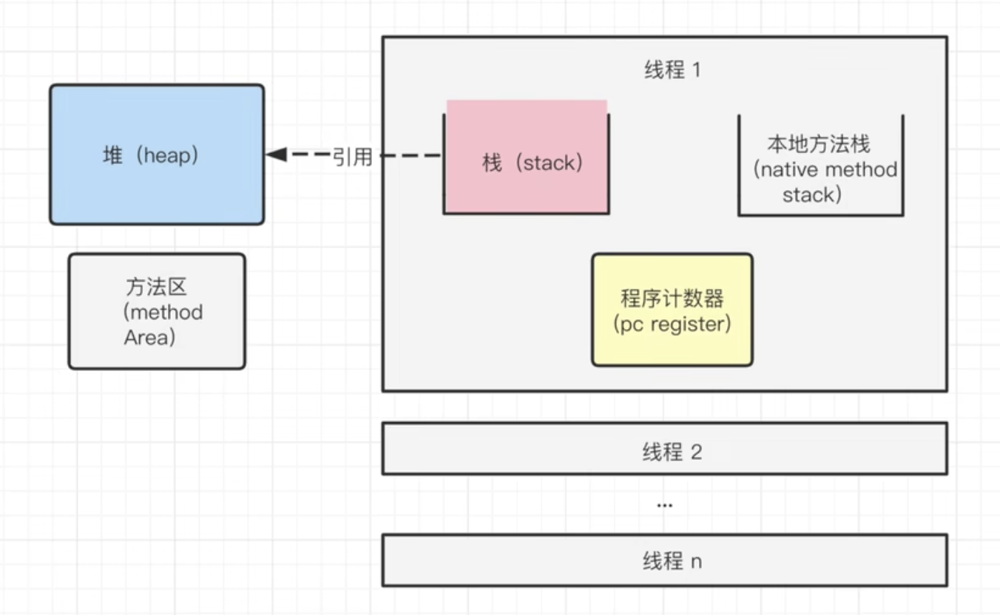

# 注解

## 注解类型

1. 内置注解：作用在代码中的注解
- `@Override`:  只适用于修饰方法，表示一个方法声明打算重写超类中的另一个方法声明。
- `@Deprecated`: 可修饰方法，属性，类。表示不鼓励使用，通常因为它很危险或者存在更好的选择。
- `@SuppressWarings`: 指示编译器去忽略注解中声明的警告（需提供参数以指定忽略的警告类型）。

2. 元注解：负责注解其他注解
- `@Retention`: 描述注解的生命周期（SOURCE<CLASS<RUNTIME）。
- `@Documented`: 说明该注解将被包含在javadoc中。
- `@Target`: 标记这个注解的使用范围。
- `@Inherited`: 说明子类可以继承父类中的该注解
> 注解默认并没有继承于任何子类

从java7后添加的3个注解
- `@SafeVarargs`: 忽略任何使用参数为泛型变量的方法或构造函数调用产生的警告。
- `@Functionallnterface`: 标识一个匿名函数或函数式接口。
- `@Repeatable`: 标识某注解可以在同一个声明上使用多次。


## 自定义注解

使用`@interface`自定义注解，会自动继承`java.lang.annotation.Annotation`接口

```java
// 定义注解
@Target(ElementType.METHOD)  // 该注解应用于方法
@Retention(RetentionPolicy.RUNTIME)  // 运行时可见
public @interface MyAnnotation {
    String value() default "default";  // 注解的属性，默认值为 "default"
    int number() default 0;            // 可以有多个属性
}

```

- 注解的参数 = 参数类型 + 参数名 + ()
> 如果没有`default`默认值，就必须传参，否则会报错
- 如果只有一个值，可以将形参命名为`value`，传参时不用使用键值对传参


# 反射


动态语言和静态语言的区别
- 类型检查时机
    - 在运行时进行类型检查
    - 在编译时进行类型检查
- 变量声明
    - 不需要显示声明变量的类型，解释器会在运行时根据赋值的内容推断类型
    - 变量在声明时就必须指定类型，并且一旦声明，其类型不能改变

java不是动态语言，但可以被称为“准动态语言”，即java有一定的动态性。可以利用反射机制来获得类似动态语言的特征。


## java反射机制

Reflection(反射)是java被视为动态语言的关键，反射机制允许    程序执行期借助于Reflection API取得任何类的内部信息，并能直接操作任意类的内部属性及方法

```java
Class c = Class.forName("java.lang.String")
```

加载完类后，在堆内存的方法去就产生了一个Class类型的对象（一个类就只有一个Class对象），这个对象包含了完整的类的结构信息。我们可以通过这个对象看到类的结构。这个对象就像一面镜子，透过这个镜子看到类的结构，这就是“反射”

- 正常方式：引入需要的“包类”名称 -> 通过new实例话 -> 获取实例化对象
- 反射方式：实例化对象 -> getClass()方法 -> 完整的“包类”名称


## 理解class类并获取class实例


1. 获取class类实例

```java
// 已知具体的类，通过类的class属性获取，最安全，性能最高
Class c = Person.class;

// 已知某个类的实例，调用该实例的getClass()方法获取
Class c = person.getClass();

//已知一个类的全类名，且该类在类路径下，可通过Class类的静态方法froName()获取，抛出ClassNotFoundExcpetion异常
Class c = Class.forName("module.Classname");

//基本数据类型直接用类名.Type
//利用classLoader 

```


## Java内存

1. 堆

- 存放new的对象和数组
> 可被所有的线程共享，不会存放别的对象的引用

2. 栈

- 存放基本变量类型（包含这个基本类型的具体数值）
- 存放对象的变量（存放这个变量在堆里的具体地址）
> 线程私有

3. 方法区(特殊的堆)

- 包含了所有的`class`，`static`变量，常量池
> 可以被所有线程共享


4. pc 

- 记录程序运行位置

5. 本地方法栈

- 为java提供其他语言提供了可能




## 类的加载与classLoader

当程序主动使用类某个类，如果该类还没有被加载到内存中，会通过以下步骤进行初始化

- 类的加载(Load)
    - 类加载器将类的`class`文件读入内存
    - 并将这些静态数据(类名，静态变量，静态方法，常量池，代码...)转换成`方法区`运行的数据结构
    - 然后为这个类在`堆`中创建一个`java.lang.Class`对象。
- 类的链接(Link): 将类的二进制数据合并到`JRE`的运行状态之中
    - 验证：确保加载的类信息复合JVM规范，没有安全问题方面的问题
    - 准备：正式为类变量(`static`)分配内存并设置类变量默认初始值的阶段，这些内存都在方法区中进行分配
    - 解析：虚拟机常量池内的符号引用（常量名）替换为直接引用地址的过程
- 类的初始化(Initialize): `JVM`负责对类进行初始化
    - 执行类构造器<clinit>()方法的过程。类构造器<clinit>()方法是由编译时期自动收集类中的所有类变量的赋值动作和静态代码中的语句合并产生的
    - 初始化一个类时，如果其父类没有进行初始化，则先对其父类进行初始化
    - 虚拟机会保证每一个类的<clinit>()方法在多线程中正确的加锁和同步

## 创建运行时类的对象

## 获取运行时类的完整结构

## 调用运行时类的指定结构


<!-- TODO: jvm -->


---


JAVA反射机制:
- 在运行状态中，对于任意一个类，都能够知道这个类的所有属性和方法；
- 对于任意一个对象，都能够调用它的任意一个方法和属性；

# 反射基础

RTTI(Run-Time Type Identification)运行时类型识别：在运行时识别一个对象的类型和类的信息。
- “传统的”RTTI，它假定我们在编译时已经知道了所有的类型；
- “反射”机制，它允许我们在运行时发现和使用类的信息。

## class类

Class类的实例表示java应用运行时的类(class ans enum)或接口(interface and annotation)
> 每个java类运行时都在JVM里表现为一个class对象，可通过类名.class、类型.getClass()、Class.forName("类名")等方法获取class对象）。


数组同样也被映射为class 对象的一个类，所有具有相同元素类型和维数的数组都共享该 Class 对象。
> 基本类型boolean，byte，char，short，int，long，float，double和关键字void同样表现为 class 对象。


- Class类也是类的一种，与class关键字是不一样的。
- 手动编写的类被编译后会产生一个Class对象，其表示的是创建的类的类型信息，而且这个Class对象保存在同名.class的文件中(字节码文件)
- 每个通过关键字class标识的类，在内存中有且只有一个与之对应的Class对象来描述其类型信息，无论创建多少个实例对象，其依据的都是用一个Class对象。
- Class类只存私有构造函数，因此对应Class对象只能由JVM创建和加载
- Class类的对象作用是运行时提供或获得某个对象的类型信息，这点对于反射技术很重要(关于反射稍后分析)。#
