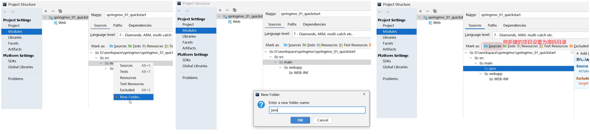
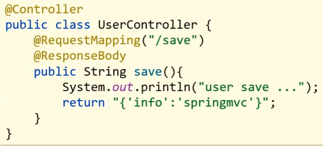

springMVC

理解SpringMVC相关概念，掌握SpringMVC如何接收请求、数据和响应结果，掌握RESTful风格及其使用

[toc]


# 介绍

1. 引入

现在web程序大都基于三层架构来实现


* 浏览器发送一个请求给后端服务器，后端服务器现在是使用Servlet来接收请求和数据

* 如果所有的处理都交给Servlet来处理的话，所有的东西都耦合在一起，对后期的维护和扩展极为不利

* 将后端服务器Servlet拆分成三层，分别是`web`、`service`和`dao`
  * web层主要由servlet来处理，负责页面请求和数据的收集以及响应结果给前端
  * service层主要负责业务逻辑的处理
  * dao层主要负责数据的增删改查操作
* servlet处理请求和数据的时候，存在的问题是一个servlet只能处理一个请求
* 针对web层进行了优化，采用了MVC设计模式，将其设计为`controller`、`view`和`Model`
  * controller负责请求和数据的接收，接收后将其转发给service进行业务处理
  * service根据需要会调用dao对数据进行增删改查
  * dao把数据处理完后将结果交给service,service再交给controller
  * controller根据需求组装成Model和View,Model和View组合起来生成页面转发给前端浏览器
  * 这样做的好处就是controller可以处理多个请求，并对请求进行分发，执行不同的业务操作。

随着互联网的发展，上面的模式因为是同步调用，性能慢慢的跟不是需求，所以异步调用慢慢的走到了前台，是现在比较流行的一种处理方式。


* 因为是异步调用，所以后端不需要返回view视图，将其去除
* 前端如果通过异步调用的方式进行交互，后台就需要将返回的数据转换成json格式进行返回
* SpringMVC==主要==负责的就是
  * controller如何接收请求和数据
  * 如何将请求和数据转发给业务层
  * 如何将响应数据转换成json发回到前端


2. springMVC介绍

SpringMVC是隶属于Spring框架的一部分
* SpringMVC是一种基于Java实现MVC模型的轻量级Web框架
- 主要的作用就是用来接收前端发过来的请求和数据然后经过处理并将处理的结果响应给前端

> [!NOTE]
> SpringMVC对Servlet进行了封装，主要是用来进行Web开发


对于SpringMVC我们主要学习如下内容:
* SpringMVC简介
* ==请求与响应==
* ==REST风格==
* ==SSM整合(注解版)==
* 拦截器


## SpringMVC入门案例

因为SpringMVC是一个Web框架，将来是要替换Servlet,所以先来回顾下以前Servlet是如何进行开发的?

- 创建web工程(Maven结构)
- 设置tomcat服务器，加载web工程(tomcat插件)
- 导入坐标(Servlet)
- 定义处理请求的功能类(UserServlet)
- 设置请求映射(配置映射关系)

SpringMVC的制作过程和上述流程几乎是一致的，具体的实现流程是什么?

- 创建web工程(Maven结构)
- 设置tomcat服务器，加载web工程(tomcat插件)
- 导入坐标(==SpringMVC==+Servlet)
- 定义处理请求的功能类(==UserController==)
- ==设置请求映射(配置映射关系)==
- ==将SpringMVC设定加载到Tomcat容器中==


| 名称 | @Controller                   |
| ---- | ----------------------------- |
| 类型 | 类注解                        |
| 位置 | SpringMVC控制器类定义上方     |
| 作用 | 设定SpringMVC的核心控制器bean |


| 名称     | @RequestMapping                 |
| -------- | ------------------------------- |
| 类型     | 类注解或方法注解                |
| 位置     | SpringMVC控制器类或方法定义上方 |
| 作用     | 设置当前控制器方法请求访问路径  |
| 相关属性 | value(默认)，请求访问路径       |


| 名称 | @ResponseBody                                    |
| ---- | ------------------------------------------------ |
| 类型 | 类注解或方法注解                                 |
| 位置 | SpringMVC控制器类或方法定义上方                  |
| 作用 | 设置当前控制器方法响应内容为当前返回值，无需解析 |


### 案例实现

1. 创建Maven项目

2. 手动补全目录结构



3. 导入jar包

将pom.xml中多余的内容删除掉，再添加SpringMVC需要的依赖

```java
// pom.xml
<?xml version="1.0" encoding="UTF-8"?>
<project xmlns="http://maven.apache.org/POM/4.0.0" xmlns:xsi="http://www.w3.org/2001/XMLSchema-instance"
  xsi:schemaLocation="http://maven.apache.org/POM/4.0.0 http://maven.apache.org/xsd/maven-4.0.0.xsd">
  <modelVersion>4.0.0</modelVersion>
  <groupId>com.itheima</groupId>
  <artifactId>springmvc_01_quickstart</artifactId>
  <version>1.0-SNAPSHOT</version>
  <packaging>war</packaging>

  <dependencies>
    <dependency>
      <groupId>javax.servlet</groupId>
      <artifactId>javax.servlet-api</artifactId>
      <version>3.1.0</version>

      // scope是maven中jar包依赖作用范围的描述，
      // 默认是`compile`，在编译、运行、测试时均有效
      // provided代表的是该包只在编译和测试的时候用，运行的时候无效直接使用tomcat中的，避免冲突
      <scope>provided</scope>
    </dependency>

    <dependency>
      <groupId>org.springframework</groupId>
      <artifactId>spring-webmvc</artifactId>
      <version>5.2.10.RELEASE</version>
    </dependency>
  </dependencies>

  <build>
    <plugins>
      <plugin>
        <groupId>org.apache.tomcat.maven</groupId>
        <artifactId>tomcat7-maven-plugin</artifactId>
        <version>2.1</version>
        <configuration>
          <port>80</port>
          <path>/</path>
        </configuration>
      </plugin>
    </plugins>
  </build>
</project>

```


4. 创建配置类

```java
// springMvcConfig.java
@Configuration
@ComponentScan("com.itheima.controller")
public class SpringMvcConfig {
}
```

5. 创建Controller类

```java
// UserController.java
@Controller
public class UserController {
    
    // 设置访问路径
    @RequestMapping("/save")
    // 设置返回数据为json
    // 缺失则会把字符串当成页面的名称在项目中进行查找返回
    @ResponseBody
    public String save(){
        System.out.println("user save ...");
        return "{'info':'springmvc'}";
    }
}
```

5. 使用配置类替换web.xml

将web.xml删除，换成ServletContainersInitConfig

```java
// ServletContainersInitConfig.java
public class ServletContainersInitConfig extends AbstractDispatcherServletInitializer {
    //加载springmvc配置类
    protected WebApplicationContext createServletApplicationContext() {
        //初始化WebApplicationContext对象
        AnnotationConfigWebApplicationContext ctx = new AnnotationConfigWebApplicationContext();
        //加载指定配置类
        ctx.register(SpringMvcConfig.class);
        return ctx;
    }

    //设置由springmvc控制器处理的请求映射路径
    protected String[] getServletMappings() {
        return new String[]{"/"};
    }

    //加载spring配置类
    protected WebApplicationContext createRootApplicationContext() {
        return null;
    }
}
```

7. 配置Tomcat环境


**注意事项**

* SpringMVC是基于Spring的，在pom.xml只导入了`spring-webmvc`jar包的原因是它会自动依赖spring相关坐标
* AbstractDispatcherServletInitializer类是SpringMVC提供的快速初始化Web3.0容器的抽象类
* AbstractDispatcherServletInitializer提供了三个接口方法供用户实现
  * createServletApplicationContext方法，创建Servlet容器时，加载SpringMVC对应的bean并放入WebApplicationContext对象范围中，而WebApplicationContext的作用范围为ServletContext范围，即整个web容器范围
  * getServletMappings方法，设定SpringMVC对应的请求映射路径，即SpringMVC拦截哪些请求
  * createRootApplicationContext方法，如果创建Servlet容器时需要加载非SpringMVC对应的bean,使用当前方法进行，使用方式和createServletApplicationContext相同。
  * createServletApplicationContext用来加载SpringMVC环境
  * createRootApplicationContext用来加载Spring环境


### 入门案例总结

- 一次性工作
  - 创建工程，设置服务器，加载工程
  - 导入坐标
  - 创建web容器启动类，加载SpringMVC配置，并设置SpringMVC请求拦截路径
  - SpringMVC核心配置类（设置配置类，扫描controller包，加载Controller控制器bean）
- 多次工作
  - 定义处理请求的控制器类
  - 定义处理请求的控制器方法，并配置映射路径（@RequestMapping）与返回json数据（@ResponseBody）

### 工作流程解析

为了更好的使用SpringMVC,我们将SpringMVC的使用过程总共分两个阶段来分析，分别是`启动服务器初始化过程`和`单次请求过程`


#### 启动服务器初始化过程

1. 服务器启动，执行ServletContainersInitConfig类，初始化web容器

   * 功能类似于以前的web.xml

2. 执行createServletApplicationContext方法，创建了WebApplicationContext对象

   * 该方法加载SpringMVC的配置类SpringMvcConfig来初始化SpringMVC的容器

3. 加载SpringMvcConfig配置类

   

4. 执行@ComponentScan加载对应的bean

   * 扫描指定包及其子包下所有类上的注解，如Controller类上的@Controller注解

5. 加载UserController，每个@RequestMapping的名称对应一个具体的方法

   

   * 此时就建立了 `/save` 和 save方法的对应关系

6. 执行getServletMappings方法，设定SpringMVC拦截请求的路径规则

   

   * `/`代表所拦截请求的路径规则，只有被拦截后才能交给SpringMVC来处理请求


#### 单次请求过程

1. 发送请求`http://localhost/save`
2. web容器发现该请求满足SpringMVC拦截规则，将请求交给SpringMVC处理
3. 解析请求路径/save
4. 由/save匹配执行对应的方法save(）
   * 上面的第五步已经将请求路径和方法建立了对应关系，通过/save就能找到对应的save方法
5. 执行save()
6. 检测到有@ResponseBody直接将save()方法的返回值作为响应体返回给请求方

# bean加载控制

## 引入

在入门案例中我们创建过一个`SpringMvcConfig`的配置类，再回想前面咱们学习Spring的时候也创建过一个配置类`SpringConfig`。这两个配置类都需要加载资源，那么它们分别都需要加载哪些内容?
* SpringMVC
  - 表现层bean(Controller)
* Spring
  * 业务bean(Service)
  * 功能bean(DataSource,SqlSessionFactoryBean,MapperScannerConfigurer等)


```java
// SpringConfig.java
@Configuration
@ComponentScan("com.itheima.controller")
public class SpringMvcConfig {
}

// SpringConfig.java
// 在此Spring重复把SpringMVC的controller类也给扫描到
@ComponentScan("com.itheima")
public class SpringConfig {
}
```


上述代码存在问题，因为功能不同，如何避免Spring错误加载到SpringMVC的bean?

## 排除bean的加载

针对上面的问题，解决方案也比较简单，就是:

* 加载Spring控制的bean的时候排除掉SpringMVC控制的bean


1. 方式一:修改Spring配置类，设定扫描范围为精准范围。

```java
@Configuration
@ComponentScan({"com.itheima.service","comitheima.dao"})
public class SpringConfig {
}
```

**说明:**

上述只是通过例子说明可以精确指定让Spring扫描对应的包结构，真正在做开发的时候，因为Dao最终是交给`MapperScannerConfigurer`对象来进行扫描处理的，我们只需要将其扫描到service包即可。

2. 修改Spring配置类，设定扫描范围为com.itheima,排除掉controller包中的bean

| 名称     | @ComponentScan                                               |
| -------- | ------------------------------------------------------------ |
| 类型     | 类注解                                                       |
| 位置     | 类定义上方                                                   |
| 作用     | 设置spring配置类扫描路径，用于加载使用注解格式定义的bean     |
| 相关属性 | excludeFilters:排除扫描路径中加载的bean,需要指定类别(type)和具体项(classes)<br/>includeFilters:加载指定的bean，需要指定类别(type)和具体项(classes) |

```java
// SpringConfig.java
@Configuration
@ComponentScan(value="com.itheima",
    // excludeFilters属性：设置扫描加载bean时，排除的过滤规则
    excludeFilters=@ComponentScan.Filter(
      // type属性：设置排除规则，当前使用按照bean定义时的注解类型进行排除
    	type = FilterType.ANNOTATION,
      // classes属性：设置排除的具体注解类，当前设置排除@Controller定义的bean
      classes = Controller.class
    )
)
public class SpringConfig {
}
```


```java
// ServletContainersInitConfig.java
public class ServletContainersInitConfig extends AbstractDispatcherServletInitializer {
    protected WebApplicationContext createServletApplicationContext() {
        AnnotationConfigWebApplicationContext ctx = new AnnotationConfigWebApplicationContext();
        ctx.register(SpringMvcConfig.class);
        return ctx;
    }
    protected String[] getServletMappings() {
        return new String[]{"/"};
    }
    // 在tomcat服务器启动时加载Spring配置
    protected WebApplicationContext createRootApplicationContext() {
      AnnotationConfigWebApplicationContext ctx = new AnnotationConfigWebApplicationContext();
        ctx.register(SpringConfig.class);
        return ctx;
    }
}
```

对于上述的配置方式，Spring还提供了一种更简单的配置方式，可以不用再去创建`AnnotationConfigWebApplicationContext`对象，不用手动`register`对应的配置类，如何实现?

```java
public class ServletContainersInitConfig extends AbstractAnnotationConfigDispatcherServletInitializer {

    protected Class<?>[] getRootConfigClasses() {
        return new Class[]{SpringConfig.class};
    }

    protected Class<?>[] getServletConfigClasses() {
        return new Class[]{SpringMvcConfig.class};
    }

    protected String[] getServletMappings() {
        return new String[]{"/"};
    }
}
```


# 请求与响应

* 请求映射路径
* 请求参数
* 日期类型参数传递
* 响应json数据

## 设置请求映射路径

以下两种方式是等价的

1. 单独设置映射路径

```java
@Controller
public class UserController {

    @RequestMapping("/user/save")
    @ResponseBody
    public String save(){
        System.out.println("user save ...");
        return "{'module':'user save'}";
    }
    
    @RequestMapping("/user/delete")
    @ResponseBody
    public String save(){
        System.out.println("user delete ...");
        return "{'module':'user delete'}";
    }
}
```


2. 统一设置路径前缀


```java
@Controller
@RequestMapping("/user")
public class UserController {

    @RequestMapping("/save")
    @ResponseBody
    public String save(){
        System.out.println("user save ...");
        return "{'module':'user save'}";
    }
    
    @RequestMapping("/delete")
    @ResponseBody
    public String save(){
        System.out.println("user delete ...");
        return "{'module':'user delete'}";
    }
}
```


> [!NOTE]
> @RequestMapping注解value属性前面加不加`/`都可以


## 请求参数

关于请求参数的传递与接收是和请求方式有关系的，目前比较常见的两种请求方式为：

* GET
* POST

针对于不同的请求前端如何发送，后端如何接收?

### 发送参数


- get方式

```http
http://localhost/commonParam?name=itcast&age=15[&...]
```

- post方式

使用postman软件，将参数放在body中


### 中文乱码

1. get方式

如果我们传递的参数中有中文，你会发现接收到的参数会出现中文乱码问题
- Tomcat8.5以后的版本已经处理了中文乱码的问题
- 之前版本所以需要修改pom.xml来解决GET请求中文乱码问题

```xml
<build>
    <plugins>
      <plugin>
        <groupId>org.apache.tomcat.maven</groupId>
        <artifactId>tomcat7-maven-plugin</artifactId>
        <version>2.1</version>
        <configuration>
          <port>80</port><!--tomcat端口号-->
          <path>/</path> <!--虚拟目录-->
          <uriEncoding>UTF-8</uriEncoding><!--访问路径编解码字符集-->
        </configuration>
      </plugin>
    </plugins>
  </build>
```


2. POST方式

解决方案:配置过滤器

```java
// ServletContainersInitConfig.java
public class ServletContainersInitConfig extends AbstractAnnotationConfigDispatcherServletInitializer {
    protected Class<?>[] getRootConfigClasses() {
        return new Class[0];
    }

    protected Class<?>[] getServletConfigClasses() {
        return new Class[]{SpringMvcConfig.class};
    }

    protected String[] getServletMappings() {
        return new String[]{"/"};
    }

    //使用过滤器对乱码进行处理
    @Override
    protected Filter[] getServletFilters() {
        CharacterEncodingFilter filter = new CharacterEncodingFilter();
        filter.setEncoding("UTF-8");
        return new Filter[]{filter};
    }
}
```
> [!NOTE]
> CharacterEncodingFilter是在spring-web包中，所以用之前需要导入对应的jar包。

### 接收参数

* 普通参数
* POJO类型参数
* 嵌套POJO类型参数
* 数组类型参数
* 集合类型参数

| 名称     | @RequestParam                                          |
| -------- | ------------------------------------------------------ |
| 类型     | 形参注解                                               |
| 位置     | SpringMVC控制器方法形参定义前面                        |
| 作用     | 绑定请求参数与处理器方法形参间的关系                   |
| 相关参数 | required：是否为必传参数 <br/> defaultValue：参数默认值 |


1. 普通参数

* url地址传参，地址参数名与形参变量名相同，定义形参即可接收参数。

```java
@RequestMapping("/commonParamDifferentName")
@ResponseBody
public String commonParamDifferentName(String userName , int age){
    System.out.println("普通参数传递 userName ==> "+userName);
    System.out.println("普通参数传递 age ==> "+age);
    return "{'module':'common param different name'}";
}
```


```java
@RequestMapping("/commonParamDifferentName")
    @ResponseBody

    // 请求url：http://localhost/commonParamDifferentName?name=张三&age=18
    // 如果url中参数名和形参名不一致，可以使用@RequestParam注解进行绑定
    public String commonParamDifferentName(@RequestPaam("url_name") String userName , int age){
        System.out.println("普通参数传递 userName ==> "+userName);
        System.out.println("普通参数传递 age ==> "+age);
        return "{'module':'common param different name'}";
    }
```


2. POJO数据类型

如果参数比较多，后台接收参数的时候就比较复杂，这个时候我们可以考虑使用POJO数据类型
* POJO参数：请求参数名与形参对象属性名相同，定义POJO类型形参即可接收参数
- 需要使用准备好的POJO类（这里是User类）
- 前端发起请求的方式不变

```java
// User.java
public class User {
    private String name;
    private int age;
    //setter...getter...略
}
```

```java
// 请求url：http://localhost/pojoParam?name=zhangsan&age=18
//POJO参数：请求参数与形参对象中的属性对应即可完成参数传递
@RequestMapping("/pojoParam")
@ResponseBody
public String pojoParam(User user){
    System.out.println("pojo参数传递 user ==> "+user);
    return "{'module':'pojo param'}";
}
```
> [!NOTE]
> 请求参数key的名称要和POJO中属性的名称一致，否则无法封装

3. 嵌套POJO类型参数

如果POJO对象中嵌套了其他的POJO类，如

```java
public class Address {
    private String province;
    private String city;
    //setter...getter...略
}
public class User {
    private String name;
    private int age;
    private Address address;
    //setter...getter...略
}
```


```java
// 请求url：https://localhost/pojoParam?name=zhangsan&age=18&address.province=beijing&address.city=beijing
// POJO参数：请求参数与形参对象中的属性对应即可完成参数传递
@RequestMapping("/pojoParam")
@ResponseBody
public String pojoParam(User user){
    System.out.println("pojo参数传递 user ==> "+user);
    return "{'module':'pojo param'}";
}
```


4. 数组类型参数


```java
// 请求url：https://localhost/pojoParam?likes=play&likes=watch
// 数组参数：同名请求参数可以直接映射到对应名称的形参数组对象中
@RequestMapping("/arrayParam")
@ResponseBody
public String arrayParam(String[] likes){
    System.out.println("数组参数传递 likes ==> "+ Arrays.toString(likes));
    return "{'module':'array param'}";
}
```

5. 集合类型参数

```java
// 请求url：https://localhost/pojoParam?likes=play&likes=watch
//集合参数：同名请求参数可以使用@RequestParam注解映射到对应名称的集合对象中作为数据
@RequestMapping("/listParam")
@ResponseBody
public String listParam(@RequestParam List<String> likes){
    System.out.println("集合参数传递 likes ==> "+ likes);
    return "{'module':'list param'}";
}
```


> [!NOTE]
> 若不添加`@RequestParam`注解，SpringMVC将把List看做是一个POJO对象来处理，将为其创建一个对象并准备把前端的数据封装到对象中，但是List是一个接口无法创建对象


6. JSON数据传输参数


前后台以异步方式进行交换时，传输的数据使用的是`JSON`

| 名称 | @EnableWebMvc             |
| ---- | ------------------------- |
| 类型 | ==配置类注解==            |
| 位置 | SpringMVC配置类定义上方   |
| 作用 | 开启SpringMVC多项辅助功能 |


| 名称 | @RequestBody                                                 |
| ---- | ------------------------------------------------------------ |
| 类型 | ==形参注解==                                                 |
| 位置 | SpringMVC控制器方法形参定义前面                              |
| 作用 | 将请求中请求体所包含的数据传递给请求参数，此注解一个处理器方法只能使用一次 |

- pom.xml添加依赖

SpringMVC默认使用的是jackson来处理json的转换，所以需要在pom.xml添加jackson依赖

```xml
<!-- pom.xml -->
<dependency>
    <groupId>com.fasterxml.jackson.core</groupId>
    <artifactId>jackson-databind</artifactId>
    <version>2.9.0</version>
</dependency>
```


- 开启SpringMVC注解支持

```java
// springMvcConfig.java
@Configuration
@ComponentScan("com.itheima.controller")
//开启json数据类型自动转换
// 包含了将JSON转换成对象的功能
@EnableWebMvc
public class SpringMvcConfig {
}
```


- 接收JSON数据

```java
// 接收json数组
@RequestMapping("/listParamForJson")
@ResponseBody
//使用@RequestBody注解将外部传递的json数组数据映射到形参的集合对象中作为数据
public String listParamForJson(@RequestBody List<String> likes){
    System.out.println("list common(json)参数传递 list ==> "+likes);
    return "{'module':'list common for json param'}";
}

// 接收json对象
@RequestMapping("/pojoParamForJson")
@ResponseBody
public String pojoParamForJson(@RequestBody User user){
    System.out.println("pojo(json)参数传递 user ==> "+user);
    return "{'module':'pojo for json param'}";
}

// 接收json对象数组
@RequestMapping("/listPojoParamForJson")
@ResponseBody
public String listPojoParamForJson(@RequestBody List<User> list){
    System.out.println("list pojo(json)参数传递 list ==> "+list);
    return "{'module':'list pojo for json param'}";
}
```


> [!NOTE]
> @RequestBody与@RequestParam区别
> * @RequestParam用于接收url地址传参，表单传参【application/x-www-form-urlencoded】
> * @RequestBody用于接收json数据【application/json】


7. 日期类型参数传递


日期类型比较特殊，因为对于日期的格式有N多中输入方式，比如:

* 2088-08-18
* 2088/08/18
* 08/18/2088
* ......


| 名称     | @DateTimeFormat                 |
| -------- | ------------------------------- |
| 类型     | ==形参注解==                    |
| 位置     | SpringMVC控制器方法形参前面     |
| 作用     | 设定日期时间型数据格式          |
| 相关属性 | pattern：指定日期时间格式字符串 |


```java
@RequestMapping("/dataParam")
@ResponseBody
public String dataParam(// 年-月-日格式
                        @DateTimeFormat(pattern="yyyy-MM-dd") Date date1,
                        // 年/月/日 时/钟/秒格式
                        @DateTimeFormat(pattern="yyyy/MM/dd HH:mm:ss") Date date2)
    System.out.println("参数传递 date ==> "+date);
    System.out.println("参数传递 date1(yyyy-MM-dd) ==> "+date1);
    System.out.println("参数传递 date2(yyyy/MM/dd HH:mm:ss) ==> "+date2);
    return "{'module':'data param'}";
}
```

> [!NOTE]
> spring框架中拥有很多的类型转换接口和实现类，从前端接收到的数据在底层都是由框架实现的自动类型转换


## 响应


响应，主要就包含两部分内容：

* 响应页面
* 响应数据
  * 文本数据
  * json数据（主）


| 名称     | @ResponseBody                                                |
| -------- | ------------------------------------------------------------ |
| 类型     | ==方法\类注解==                                              |
| 位置     | SpringMVC控制器方法定义上方和控制类上                        |
| 作用     | 设置当前控制器返回值作为响应体,<br/>写在类上，该类的所有方法都有该注解功能 |
* 该注解可以写在类上或者方法上
  * 写在类上就是该类下的所有方法都有@ReponseBody功能
  * 当方法上有@ReponseBody注解后
    * 方法的返回值为字符串，会将其作为文本内容直接响应给前端
    * 方法的返回值为对象，会将对象转换成JSON响应给前端


1. 响应页面

```java
@Controller
public class UserController {
    
    @RequestMapping("/toJumpPage")
    //注意
    //1.此处不能添加@ResponseBody,如果加了该注入，会直接将page.jsp当字符串返回前端
    //2.方法需要返回String
    public String toJumpPage(){
        System.out.println("跳转页面");
        return "page.jsp";
    }
    
}
```

2. 响应文本数据

```java
@Controller
public class UserController {
    
   	@RequestMapping("/toText")
    //注意此处该注解就不能省略，如果省略了,会把response text当前页面名称去查找，如果没有回报404错误
    @ResponseBody
    public String toText(){
        System.out.println("返回纯文本数据");
        return "response text";
    }
    
}
```

3. 响应json数据

```java
@Controller
public class UserController {
    // 设置返回值为实体类类型，即可实现返回对应对象的json数据
    // 设置返回值为list类型，即可实现返回对应list的json数组数据
    @RequestMapping("/toJsonPOJO")
    @ResponseBody
    public User toJsonPOJO(){
        System.out.println("返回json对象数据");
        User user = new User();
        user.setName("itcast");
        user.setAge(15);
        return user;
    }
    
}
```


# Rest风格

REST（Representational State Transfer），表现形式状态转换,它是一种软件架构**风格**
* 按照REST风格访问资源时使用==行为动作==区分对资源进行了何种操作
  * `http://localhost/users`	查询全部用户信息 GET（查询）
  * `http://localhost/users/1`  查询指定用户信息 GET（查询）
  * `http://localhost/users`    添加用户信息    POST（新增/保存）
  * `http://localhost/users`    修改用户信息    PUT（修改/更新）
  * `http://localhost/users/1`  删除用户信息    DELETE（删除）
* 根据REST风格对资源进行访问称为**RESTful**


## 实现

```java
@Controller
public class UserController {
	//设置当前请求方法为POST，表示REST风格中的添加操作
    @RequestMapping(value = "/users",method = RequestMethod.POST)
    @ResponseBody
    public String save() {
        System.out.println("user save...");
        return "{'module':'user save'}";
    }

    //设置当前请求方法为DELETE，表示REST风格中的删除操作
  @RequestMapping(value = "/users",method = RequestMethod.DELETE)
    @ResponseBody
    public String delete(Integer id) {
        System.out.println("user delete..." + id);
        return "{'module':'user delete'}";
    }
}
}
```


###### 传递路径参数

访问成功，但是删除方法没有携带所要删除数据的id,所以针对RESTful的开发，如何携带数据参数?

前端发送请求的时候使用:`http://localhost/users/1`,路径中的`1`就是我们想要传递的参数。

后端获取参数，需要做如下修改:

* 修改@RequestMapping的value属性，将其中修改为`/users/{id}`，目的是和路径匹配
* 在方法的形参前添加@PathVariable注解

1. 携带一个参数

```java
@Controller
public class UserController {
    //设置当前请求方法为DELETE，表示REST风格中的删除操作
	@RequestMapping(value = "/users/{id}",method = RequestMethod.DELETE)
    @ResponseBody

    public String delete(@PathVariable Integer id) {
        System.out.println("user delete..." + id);
        return "{'module':'user delete'}";
    }
}
```

2. 携带多个参数

```java
// 前端发送请求的时候使用:`http://localhost/users/1/tom`,路径中的`1`和`tom`就是我们想要传递的两个参数
@Controller
public class UserController {
    //设置当前请求方法为DELETE，表示REST风格中的删除操作
	@RequestMapping(value = "/users/{id}/{name}",method = RequestMethod.DELETE)
    @ResponseBody
    public String delete(@PathVariable Integer id,@PathVariable String name) {
        System.out.println("user delete..." + id+","+name);
        return "{'module':'user delete'}";
    }
}
```

3. 方法形参的名称和路径`{}`中的值不一致

| 名称 | @PathVariable                                                |
| ---- | ------------------------------------------------------------ |
| 类型 | ==形参注解==                                                 |
| 位置 | SpringMVC控制器方法形参定义前面                              |
| 作用 | 绑定路径参数与处理器方法形参间的关系，要求路径参数名与形参名一一对应 |

```java
// 前端发送请求的时候使用:`http://localhost/users/1
@Controller
public class UserController {
	@RequestMapping(value = "/users/{id}",method = RequestMethod.DELETE)
    @ResponseBody
    // 在注解后添加参数名称，将url中的参数值映射到形参中
    public String delete(@PathVariable("id") Integer userid) {
        System.out.println("user delete..." + userid);
        return "{'module':'user delete'}";
    }
}
```

---

关于接收参数，我们学过三个注解`@RequestBody`、`@RequestParam`、`@PathVariable`,这三个注解之间的区别和应用分别是什么?

* 区别
  * @RequestParam用于接收url地址传参或表单传参
  * @RequestBody用于接收json数据
  * @PathVariable用于接收路径参数，使用{参数名称}描述路径参数
* 应用
  * 后期开发中，发送请求参数超过1个时，以json格式为主，@RequestBody应用较广
  * 如果发送非json格式数据，选用@RequestParam接收请求参数
  * 采用RESTful进行开发，当参数数量较少时，例如1个，可以采用@PathVariable接收请求路径变量，通常用于传递id值


##  RESTful快速开发


| 名称 | @RestController                                              |
| ---- | ------------------------------------------------------------ |
| 类型 | ==类注解==                                                   |
| 位置 | 基于SpringMVC的RESTful开发控制器类定义上方                   |
| 作用 | 设置当前控制器类为RESTful风格，<br/>等同于@Controller与@ResponseBody两个注解组合功能 |


| 名称     | @GetMapping @PostMapping @PutMapping @DeleteMapping          |
| -------- | ------------------------------------------------------------ |
| 类型     | ==方法注解==                                                 |
| 位置     | 基于SpringMVC的RESTful开发控制器方法定义上方                 |
| 作用     | 设置当前控制器方法请求访问路径与请求动作，每种对应一个请求动作，<br/>例如@GetMapping对应GET请求 |
| 相关属性 | value（默认）：请求访问路径                                  |


```java
@RestController //@Controller + ReponseBody
// 将@RequestMapping提到类上面，用来定义所有方法共同的访问路径
@RequestMapping("/books")
public class BookController {

    //@RequestMapping(method = RequestMethod.POST)
    // 不需要每个方法的@RequestMapping注解中都要使用method属性定义请求方式
    @PostMapping
    public String save(@RequestBody Book book){
        System.out.println("book save..." + book);
        return "{'module':'book save'}";
    }

    //@RequestMapping(value = "/{id}",method = RequestMethod.DELETE)
    @DeleteMapping("/{id}")
    public String delete(@PathVariable Integer id){
        System.out.println("book delete..." + id);
        return "{'module':'book delete'}";
    }
}
```


---

SpringMVC对静态资源的放行

```java
@Configuration
public class SpringMvcSupport extends WebMvcConfigurationSupport {
    //设置静态资源访问过滤，当前类需要设置为配置类，并被扫描加载
    @Override
    protected void addResourceHandlers(ResourceHandlerRegistry registry) {
        //当访问/pages/????时候，从/pages目录下查找内容
        registry.addResourceHandler("/pages/**").addResourceLocations("/pages/");
        registry.addResourceHandler("/js/**").addResourceLocations("/js/");
        registry.addResourceHandler("/css/**").addResourceLocations("/css/");
        registry.addResourceHandler("/plugins/**").addResourceLocations("/plugins/");
    }
}
```

