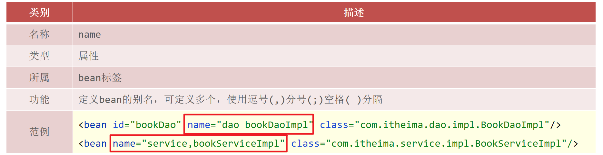
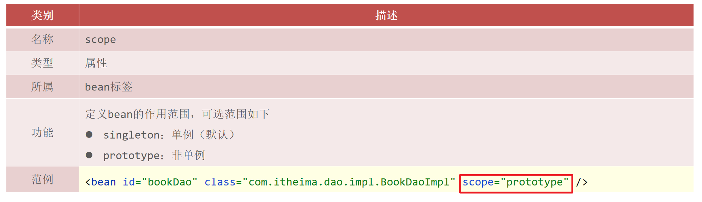

**spring and xml configuration**

掌握Spring在XML文件下对IOC和DI的相关配置与使用

[toc]


# 入门案例

先通过一些简单的入门案例，演示Spring到底是如何来实现IOC和DI的


## IOC案例

### 入门案例思路分析

1. Spring是使用容器来管理bean对象的，那么管什么? 

主要管理项目中所使用到的类对象，比如(Service和Dao)

2. 如何将被管理的对象告知IOC容器?

使用配置文件

3. 被管理的对象交给IOC容器，要想从容器中获取对象，就先得思考如何获取到IOC容器?

Spring框架提供相应的接口

4. IOC容器得到后，如何从容器中获取bean?

调用Spring框架提供对应接口中的方法

5. 使用Spring导入哪些坐标?

用别人的东西，就需要在pom.xml添加对应的依赖

### 入门案例代码实现

需求分析:将BookServiceImpl和BookDaoImpl交给Spring管理，并从容器中获取对应的bean对象进行方法调用。

1.创建Maven的java项目


2.pom.xml添加Spring的依赖jar包

```xml
<!-- pom.xml -->
<dependencies>
    <dependency>
        <groupId>org.springframework</groupId>
        <artifactId>spring-context</artifactId>
        <version>5.2.10.RELEASE</version>
    </dependency>
    <dependency>
        <groupId>junit</groupId>
        <artifactId>junit</artifactId>
        <version>4.12</version>
        <scope>test</scope>
    </dependency>
</dependencies>
```

3.创建BookService,BookServiceImpl，BookDao和BookDaoImpl四个类


```java
public interface BookDao {
    public void save();
}
public class BookDaoImpl implements BookDao {
    public void save() {
        System.out.println("book dao save ...");
    }
}
public interface BookService {
    public void save();
}
public class BookServiceImpl implements BookService {
    private BookDao bookDao = new BookDaoImpl();
    public void save() {
        System.out.println("book service save ...");
        bookDao.save();
    }
}
```


4. resources下添加spring配置文件applicationContext.xml


5.使用Spring提供的接口完成IOC容器的创建


```xml
<!-- ApplicationContext.xml -->
<?xml version="1.0" encoding="UTF-8"?>
<beans xmlns="http://www.springframework.org/schema/beans"
       xmlns:xsi="http://www.w3.org/2001/XMLSchema-instance"
       xsi:schemaLocation="http://www.springframework.org/schema/beans http://www.springframework.org/schema/beans/spring-beans.xsd">
 
  <!--bean标签标示配置bean
    id属性标示给bean起名字（id属性在同一个上下文中(配置文件)不能重复）
    class属性表示给bean定义类型
  -->
	<bean id="bookDao" class="com.itheima.dao.impl.BookDaoImpl"/>
  <bean id="bookService" class="com.itheima.service.impl.BookServiceImpl"/>

</beans>
```

6.从容器中获取对象进行方法调用

使用Spring提供的接口完成IOC容器的创建，创建App类，编写main方法


```java
public class App {
    public static void main(String[] args) {
        //获取IOC容器
		ApplicationContext ctx = new ClassPathXmlApplicationContext("applicationContext.xml"); 
//        BookDao bookDao = (BookDao) ctx.getBean("bookDao");
//        bookDao.save();
        BookService bookService = (BookService) ctx.getBean("bookService");
        bookService.save();
    }
}
```

7. 运行程序


Spring的IOC入门案例已经完成，但是在`BookServiceImpl`的类中依然存在`BookDaoImpl`对象的new操作，它们之间的耦合度还是比较高，这块该如何解决，就需要用到下面的`DI:依赖注入`。

## DI入门案例


### 入门案例思路分析

1. 要想实现依赖注入，必须要基于IOC管理Bean

DI的入门案例要依赖于前面IOC的入门案例

2. Service中使用new形式创建的Dao对象是否保留?

需要删除掉，最终要使用IOC容器中的bean对象

3. Service中需要的Dao对象如何进入到Service中?

在Service中提供方法，让Spring的IOC容器可以通过该方法传入bean对象

4. Service与Dao间的关系如何描述?

- 使用配置文件

### 入门案例代码实现

需求:基于IOC入门案例，在BookServiceImpl类中删除new对象的方式，使用Spring的DI完成Dao层的注入

1. 删除业务层中使用new的方式创建的dao对象

在BookServiceImpl类中，删除业务层中使用new的方式创建的dao对象

```java
public class BookServiceImpl implements BookService {
    //删除业务层中使用new的方式创建的dao对象
    private BookDao bookDao;

    public void save() {
        System.out.println("book service save ...");
        bookDao.save();
    }
}
```

2. 在业务层提供BookDao的setter方法


在BookServiceImpl类中,为BookDao提供setter方法

```java
public class BookServiceImpl implements BookService {
    //删除业务层中使用new的方式创建的dao对象
    private BookDao bookDao;

    public void save() {
        System.out.println("book service save ...");
        bookDao.save();
    }
    //提供对应的set方法
    public void setBookDao(BookDao bookDao) {
        this.bookDao = bookDao;
    }
}
```

3. 在配置文件中添加依赖注入的配置


在配置文件中添加依赖注入的配置

```xml
<?xml version="1.0" encoding="UTF-8"?>
<beans xmlns="http://www.springframework.org/schema/beans"
       xmlns:xsi="http://www.w3.org/2001/XMLSchema-instance"
       xsi:schemaLocation="http://www.springframework.org/schema/beans http://www.springframework.org/schema/beans/spring-beans.xsd">
    <!--bean标签标示配置bean
    	id属性标示给bean起名字
    	class属性表示给bean定义类型
	-->
    <bean id="bookDao" class="com.itheima.dao.impl.BookDaoImpl"/>

    <bean id="bookService" class="com.itheima.service.impl.BookServiceImpl">
        <!--配置server与dao的关系-->
        <!--property标签表示配置当前bean的属性
        		name属性表示配置哪一个具体的属性
        		ref属性表示参照哪一个bean
		-->
        <property name="bookDao" ref="bookDao"/>
    </bean>

</beans>
```

==注意:配置中的两个bookDao的含义是不一样的==

* name="bookDao"中`bookDao`的作用是让Spring的IOC容器在获取到名称后，将首字母大写，前面加set找对应的`setBookDao()`方法进行对象注入
* ref="bookDao"中`bookDao`的作用是让Spring能在IOC容器中找到id为`bookDao`的Bean对象给`bookService`进行注入
* 综上所述，对应关系如下:


4. 运行程序调用方法


# IOC

## bean属性配置


1. id与class


> [!NOTE]  
>  class属性不能写接口，因为接口是没办法创建对象的。


2. name

Bean的name属性可以配置Bean的别名
- 别名可以有多个，使用逗号，分号，空格进行分隔
- Bean对象的id属性和name属性可以相互替代




3. scope



- `singleton`：每次从IOC容器中获取的对象都是同一个对象
  * bean对象只有一个就避免了对象的频繁创建与销毁，达到了bean对象的复用，性能高
- `prototype`：每次从IOC容器中获取的对象都是类的一个新实例
- 默认情况下，Spring创建的bean对象都是单例的
* 哪些bean对象适合交给容器进行管理?
  * 表现层对象
  * 业务层对象
  * 数据层对象
  * 工具对象
* 哪些bean对象不适合交给容器进行管理?
  * 封装实例的域对象（该对象本身会记录数据，会引发线程安全问题）


## bean实例化过程

bean的实例化过程就是研究IOC容器是如何来创建对象的，在这块内容中主要解决两部分内容，分别是
* bean是如何创建的
* 实例化bean的三种方式，`构造方法`,`静态工厂`和`实例工厂`
> bean本质上就是对象，对象在new的时候会使用构造方法完成，那创建bean也是使用构造方法完成的。

### 构造方法实例化

使用构造方法实例话，IOC容器在创建对象的时候会通过**反射**调用类的**无参构造方法**来创建对象

1. 准备需要被创建的类

```java

public interface BookDao {
    public void save();
}

public class BookDaoImpl implements BookDao {
    public void save() {
        System.out.println("book dao save ...");
    }

}
```

2. 将类配置到Spring容器

```xml
<?xml version="1.0" encoding="UTF-8"?>
<beans xmlns="http://www.springframework.org/schema/beans"
       xmlns:xsi="http://www.w3.org/2001/XMLSchema-instance"
       xsi:schemaLocation="http://www.springframework.org/schema/beans http://www.springframework.org/schema/beans/spring-beans.xsd">

	<bean id="bookDao" class="com.itheima.dao.impl.BookDaoImpl"/>

</beans>
```

3. 编写运行程序

```java
public class AppForInstanceBook {
    public static void main(String[] args) {
        ApplicationContext ctx = new ClassPathXmlApplicationContext("applicationContext.xml");
        // 此过程会调用BookDaoImpl的无参构造方法实例化
        BookDao bookDao = (BookDao) ctx.getBean("bookDao");
        bookDao.save();

    }
}
```


### 静态工厂实例化


#### 工厂方式创建对象

使用工厂来创建对象的方式如下：

1. 准备一个目标类

```java
public interface OrderDao {
    public void save();
}
```

2. 创建一个工厂类并提供一个`静态方法`用于创建目标对象

```java
public class OrderDaoFactory {
    public static OrderDao getOrderDao(){
        return new OrderDaoImpl();
    }
}
```

3. 编写AppForInstanceOrder运行类，在类中通过工厂获取对象

```java
public class AppForInstanceOrder {
    public static void main(String[] args) {
        //通过静态工厂创建对象
        OrderDao orderDao = OrderDaoFactory.getOrderDao();
        orderDao.save();
    }
}
```


#### 静态工厂实例化

如果代码中对象是通过上面的这种方式来创建的，如何将其交给Spring来管理呢?

1. 在spring的配置文件application.properties中添加以下内容

```xml
<!-- appliction.properties -->
<bean id="orderDao" class="com.itheima.factory.OrderDaoFactory" factory-method="getOrderDao"/>
<!-- class:工厂类的类全名 -->
<!-- factory-mehod:具体工厂类中创建对象的方法名 -->
```


2. 在AppForInstanceOrder运行类，使用从IOC容器中获取bean的方法进行运行测试

```java
public class AppForInstanceOrder {
    public static void main(String[] args) {
        ApplicationContext ctx = new ClassPathXmlApplicationContext("applicationContext.xml");
        OrderDao orderDao = (OrderDao) ctx.getBean("orderDao");
        orderDao.save();

    }
}
```


在工厂的静态方法中，相比于直接new对象，我们除了new对象还可以做其他的一些业务操作，这些操作必不可少,如:日志记录，权限控制等


```java
public class OrderDaoFactory {

    public static OrderDao getOrderDao(){
        System.out.println("factory setup....");//模拟必要的业务操作
        return new OrderDaoImpl();
    }
}
```

### 实例工厂与实例化


#### 实例工厂与FactoryBean

1. 准备一个目标类

```java
public interface UserDao {
    public void save();
}
```

2. 创建一个工厂类并提供一个**普通方法**

```java
public class UserDaoFactory {
    public UserDao getUserDao(){
        return new UserDaoImpl();
    }
}
```

3. 编写main运行类，在类中通过工厂获取对象

```java
public class AppForInstanceUser {
    public static void main(String[] args) {
        //创建实例工厂对象
        UserDaoFactory userDaoFactory = new UserDaoFactory();
        //通过实例工厂对象创建对象
        UserDao userDao = userDaoFactory.getUserDao();
        userDao.save();
}
```

#### 实例工厂实例化

对于上面这种实例工厂的方式如何交给Spring管理呢?


1. 在spring的配置文件中添加以下内容:

```xml
<bean id="userFactory" class="com.itheima.factory.UserDaoFactory"/>
<bean id="userDao" factory-method="getUserDao" factory-bean="userFactory"/>
<!-- factory-bean:工厂的实例对象 -->
<!-- factory-method:工厂对象中的具体创建对象的方法名 -->
```

实例化工厂运行的顺序是:

* 创建实例化工厂对象
* 调用对象中的方法来创建bean


### FactoryBean的使用

实例工厂实例化的方式就已经介绍完了，配置的过程还是比较复杂，所以Spring为了简化这种配置方式就提供了一种叫`FactoryBean`的方式来简化开发。


1. 创建一个UserDaoFactoryBean的类，实现FactoryBean接口，重写接口的方法

```java
public class UserDaoFactoryBean implements FactoryBean<UserDao> {
    //代替原始实例工厂中创建对象的方法
    public UserDao getObject() throws Exception {
        return new UserDaoImpl();
    }
    //返回所创建类的Class对象
    public Class<?> getObjectType() {
        return UserDao.class;
    }

    // 设置是否为单例，默认为true
    public boolean isSingleton() {
        return false;
    }
}
```

2. 在Spring的配置文件中进行配置

```xml
<bean id="userDao" class="com.itheima.factory.UserDaoFactoryBean"/>
```


### bean实例化小结

通过这一节的学习，需要掌握:

1. bean是如何创建的呢?

通过无参构造方法

2. Spring的IOC实例化对象的三种方式分别是

* 构造方法(常用)
* 静态工厂(了解)
* 实例工厂(了解)
  * FactoryBean(实用)


## bean的生命钩子


### xml中配置钩子

1. 添加初始化和销毁方法

针对这两个阶段，我们在BooDaoImpl类中分别添加两个方法（方法名任意）

```java
public class BookDaoImpl implements BookDao {
    public void save() {
        System.out.println("book dao save ...");
    }
    //表示bean初始化对应的操作，可用来初始化需要用到资源
    public void init(){
        System.out.println("init...");
    }
    //表示bean销毁前对应的操作，可用来释放用到的资源
    public void destory(){
        System.out.println("destory...");
    }
}
```

2. 配置生命周期

```xml
<!-- ApplicationContext.xml -->
<!-- 配置的函数名和上面对上 -->
<bean id="bookDao" class="com.itheima.dao.impl.BookDaoImpl" init-method="init" destroy-method="destory"/>
```

3. 运行程序


从结果中可以看出，init方法执行了，但是destroy方法却未执行，这是为什么呢?
* Spring的IOC容器是运行在JVM中
* 运行main方法后,JVM启动,Spring加载配置文件生成IOC容器,从容器获取bean对象，然后调方法执行
* main方法执行完后，JVM退出，这个时候IOC容器中的bean还没有来得及销毁就已经结束了
* 所以没有调用对应的destroy方法

#### 执行destroy方法

1. 使用close关闭容器

```java
// ApplicationContext中没有close方法
// 需要将ApplicationContext更换成ClassPathXmlApplicationContext
ClassPathXmlApplicationContext ctx = new ClassPathXmlApplicationContext("applicationContext.xml");
// 调用ctx的close()方法
ctx.close();
// 运行程序，就能执行destroy方法的内容
```


2. 注册钩子关闭容器


```java
ClassPathXmlApplicationContext ctx = new ClassPathXmlApplicationContext("applicationContext.xml");
// 调用ctx的registerShutdownHook()方法，在容器未关闭之前，提前设置好回调函数，让JVM在退出之前回调此函数来关闭容器
ctx.registerShutdownHook();
```

> [!NOTE]
> `registerShutdownHook()`和`close()`方法在ApplicationContext对象没有
> 需要换成ClassPathXmlApplicationContext对象


### 接口配置钩子

Spring提供了两个接口来完成生命周期的控制
- 不用再**配置**`init-method`和`destroy-method`


```java
// 添加两个接口`InitializingBean`， `DisposableBean`
public class BookServiceImpl implements BookService, InitializingBean, DisposableBean {
    private BookDao bookDao;
    public void setBookDao(BookDao bookDao) {
        this.bookDao = bookDao;
    }
    public void save() {
        System.out.println("book service save ...");
        bookDao.save(); 
    }
    // 并实现接口中的两个方法`afterPropertiesSet`和`destroy`
    public void destroy() throws Exception {
        System.out.println("service destroy");
    }
    public void afterPropertiesSet() throws Exception {
        System.out.println("service init");
    }
}
```


### bean生命周期小结

1. 关于Spring中对bean生命周期控制提供了两种方式:

* 在配置文件中的bean标签中添加`init-method`和`destroy-method`属性
* 类实现`InitializingBean`与`DisposableBean`接口（了解即可）

2. 对于bean的生命周期控制在bean的整个生命周期中所处的位置如下:

* 初始化容器
  * 1.创建对象(内存分配)
  * 2.执行构造方法
  * 3.执行属性注入(set操作)
  * 4.执行bean初始化方法
* 使用bean
  * 1.执行业务操作
* 关闭/销毁容器
  * 1.执行bean销毁方法

3. 关闭容器的两种方式:

* ConfigurableApplicationContext是ApplicationContext的子类
  * close()方法
  * registerShutdownHook()方法


# DI

Spring为我们提供了两种注入方式，分别是:
* setter注入
  * 简单类型
  * 引用类型
* 构造器注入
  * 简单类型
  * 引用类型


## setter注入

* 对于引用数据类型使用的是`<property name="" ref=""/>`
* 对于简单数据类型使用的是`<property name="" value=""/>`

### 注入引用数据类型


1. 在目标bean中定义引用类型**属性**，并提供可访问的`set()`方法

```java
public class BookServiceImpl implements BookService {
    private BookDao bookDao;
    public void setBookDao(BookDao bookDao) {
        this.bookDao = bookDao;
    }
}
```

2. 配置中使用`property`标签`ref`属性注入引用类型对象

```xml
<bean id="bookService" class="com.itheima.service.impl.BookServiceImpl">
	<property name="bookDao" ref="bookDao"/>
</bean>

<bean id="bookDao" class="com.itheima.dao.imipl.BookDaoImpl"/>
```


### 注入简单数据类型


1. 在目标bean中定义简单数据类型的**属性**，并提供可访问的`set()`方法

```java
public class BookServiceImpl implements BookService {
    private String name;
    public void setBookDao(BookDao bookDao) {
        this.bookDao = bookDao;
    }
}
```

2. 配置中使用`property`标签`value`属性注入引用类型对象

```xml
<bean id="bookService" class="com.itheima.service.impl.BookServiceImpl">
	<property name="name" value="mysql"/>
</bean>

<bean id="bookDao" class="com.itheima.dao.imipl.BookDaoImpl"/>

```

## 构造器注入

构造器注入也就是构造方法注入
- 可以不用写`setter()`方法


### 注入引用数据类型


1. 添加带有bookDao参数的构造方法

```java
public class BookServiceImpl implements BookService{
    private BookDao bookDao;

    public BookServiceImpl(BookDao bookDao) {
        this.bookDao = bookDao;
    }
}
```

2. 在applicationContext.xml中配置

```xml
<!-- applicationContext.xml -->
<?xml version="1.0" encoding="UTF-8"?>
<beans xmlns="http://www.springframework.org/schema/beans"
       xmlns:xsi="http://www.w3.org/2001/XMLSchema-instance"
       xsi:schemaLocation="http://www.springframework.org/schema/beans http://www.springframework.org/schema/beans/spring-beans.xsd">

    <bean id="bookDao" class="com.itheima.dao.impl.BookDaoImpl"/>
    <bean id="bookService" class="com.itheima.service.impl.BookServiceImpl">
        <constructor-arg name="bookDao" ref="bookDao"/>
        <!-- name属性对应的值为构造函数中方法形参的参数名，必须要保持一致。 -->
        <!-- ref属性指向的是spring的IOC容器中其他bean对象。 -->
    </bean>
</beans>
```


#### 构造器注入多个引用数据类型


1. 提供多个属性的构造函数

```java
public class BookServiceImpl implements BookService{
    private BookDao bookDao;
    private UserDao userDao;

    public BookServiceImpl(BookDao bookDao,UserDao userDao) {
        this.bookDao = bookDao;
        this.userDao = userDao;
    }
}
```

2. 配置文件中配置多参数注入


```xml
<!-- ApplicationContext.xml -->
<?xml version="1.0" encoding="UTF-8"?>
<beans xmlns="http://www.springframework.org/schema/beans"
       xmlns:xsi="http://www.w3.org/2001/XMLSchema-instance"
       xsi:schemaLocation="http://www.springframework.org/schema/beans http://www.springframework.org/schema/beans/spring-beans.xsd">

    <bean id="bookDao" class="com.itheima.dao.impl.BookDaoImpl"/>
    <bean id="userDao" class="com.itheima.dao.impl.UserDaoImpl"/>
    <bean id="bookService" class="com.itheima.service.impl.BookServiceImpl">
        <constructor-arg name="bookDao" ref="bookDao"/>
        <constructor-arg name="userDao" ref="userDao"/>
    </bean>
</beans>
```


### 注入多个简单数据类型

1. 提供一个包含这两个参数的构造方法

```java
public class BookDaoImpl implements BookDao {
    private String databaseName;
    private int connectionNum;

    public BookDaoImpl(String databaseName, int connectionNum) {
        this.databaseName = databaseName;
        this.connectionNum = connectionNum;
    }
}
```

2. 在applicationContext.xml中进行注入配置

```xml
<!-- applicationContext.xml -->
<?xml version="1.0" encoding="UTF-8"?>
<beans xmlns="http://www.springframework.org/schema/beans"
       xmlns:xsi="http://www.w3.org/2001/XMLSchema-instance"
       xsi:schemaLocation="http://www.springframework.org/schema/beans http://www.springframework.org/schema/beans/spring-beans.xsd">

    <bean id="bookDao" class="com.itheima.dao.impl.BookDaoImpl">
        <constructor-arg name="databaseName" value="mysql"/>
        <constructor-arg name="connectionNum" value="666"/>
    </bean>
</beans>
```


### 构造函数注入的问题

上面已经完成了构造函数注入的基本使用，但是会存在一些问题:
* 耦合度偏高：当构造函数中方法的参数名发生变化后，配置文件中的name属性也需要跟着变


在解决这个问题之前，需要提前说明的是，这个参数名发生变化的情况并不多，所以上面的还是比较主流的配置方式，下面介绍的，大家都以了解为主。

1. 删除name属性，添加type属性，按照类型注入

```xml
<bean id="bookDao" class="com.itheima.dao.impl.BookDaoImpl">
    <constructor-arg type="int" value="10"/>
    <constructor-arg type="java.lang.String" value="mysql"/>
</bean>
```

* 这种方式可以解决构造函数形参名发生变化带来的耦合问题
* 但是如果构造方法参数中有类型相同的参数，这种方式就不太好实现了

2. 删除type属性，添加index属性，按照索引下标注入，下标从0开始

```xml
<bean id="bookDao" class="com.itheima.dao.impl.BookDaoImpl">
    <constructor-arg index="1" value="100"/>
    <constructor-arg index="0" value="mysql"/>
</bean>
```

* 这种方式可以解决参数类型重复问题
* 但是如果构造方法参数顺序发生变化后，这种方式又带来了耦合问题


## 总结


1. 注入方式选择

* setter注入

  * 简单数据类型

    ```xml
    <bean ...>
    	<property name="" value=""/>
    </bean>
    ```

  * 引用数据类型

    ```xml
    <bean ...>
    	<property name="" ref=""/>
    </bean>
    ```

* 构造器注入

  * 简单数据类型

    ```xml
    <bean ...>
    	<constructor-arg name="" index="" type="" value=""/>
    </bean>
    ```

  * 引用数据类型

    ```xml
    <bean ...>
    	<constructor-arg name="" index="" type="" ref=""/>
    </bean>
    ```

2. 如何选择

介绍完两种参数的注入方式，具体我们该如何选择呢?

1. 强制依赖使用构造器进行，使用setter注入有概率不进行注入导致null对象出现
   * 强制依赖指对象在创建的过程中必须要注入指定的参数
2. 可选依赖使用setter注入进行，灵活性强
   * 可选依赖指对象在创建过程中注入的参数可有可无
3. Spring框架倡导使用构造器，第三方框架内部大多数采用构造器注入的形式进行数据初始化，相对严谨
4. 如果有必要可以两者同时使用，使用构造器注入完成强制依赖的注入，使用setter注入完成可选依赖的注入
6. **自己开发的模块推荐使用setter注入**


## 加载properties文件


上述set过程中使用到了一些固定的常量(如数据库连接四要素)，把这些值写在Spring的配置文件中不利于后期维护
* 需要将这些值提取到一个外部的properties配置文件中
* Spring框架如何从配置文件中读取属性值来配置就是接下来要解决的问题


需求:将数据库连接四要素提取到properties配置文件，spring来加载配置信息并使用这些信息来完成属性注入。

1. 在resources下创建一个jdbc.properties(文件的名称可以任意)

```properties
jdbc.driver=com.mysql.jdbc.Driver
jdbc.url=jdbc:mysql://127.0.0.1:3306/spring_db
jdbc.username=root
jdbc.password=root
```


3. 在Spring的配置文件中加载properties文件


```xml
<?xml version="1.0" encoding="UTF-8"?>
<!-- 在applicationContext.xml中开`context`命名空间 -->
<beans xmlns="http://www.springframework.org/schema/beans"
       xmlns:xsi="http://www.w3.org/2001/XMLSchema-instance"
       xmlns:context="http://www.springframework.org/schema/context"
       xsi:schemaLocation="
            http://www.springframework.org/schema/beans
            http://www.springframework.org/schema/beans/spring-beans.xsd
            http://www.springframework.org/schema/context
            http://www.springframework.org/schema/context/spring-context.xsd">

      <!-- 在配置文件中使用`context`命名空间下的标签来加载properties配置文件 -->
      <context:property-placeholder location="jdbc.properties"/>
</beans>

```

4. 使用加载到的值实现属性注入

使用`${key}`来读取properties配置文件中的内容并完成属性注入

```xml
<?xml version="1.0" encoding="UTF-8"?>
<beans xmlns="http://www.springframework.org/schema/beans"
       xmlns:xsi="http://www.w3.org/2001/XMLSchema-instance"
       xmlns:context="http://www.springframework.org/schema/context"
       xsi:schemaLocation="
            http://www.springframework.org/schema/beans
            http://www.springframework.org/schema/beans/spring-beans.xsd
            http://www.springframework.org/schema/context
            http://www.springframework.org/schema/context/spring-context.xsd">
    
    <context:property-placeholder location="jdbc.properties"/>
    <bean id="dataSource" class="com.alibaba.druid.pool.DruidDataSource">
        <property name="driverClassName" value="${jdbc.driver}"/>
        <property name="url" value="${jdbc.url}"/>
        <property name="username" value="${jdbc.username}"/>
        <property name="password" value="${jdbc.password}"/>
    </bean>
</beans>
```


### 存在的问题

1. `<context:property-placeholder/>`标签会优先加载系统的同名环境变量


```xml
<?xml version="1.0" encoding="UTF-8"?>
<beans xmlns="http://www.springframework.org/schema/beans"
        xmlns:xsi="http://www.w3.org/2001/XMLSchema-instance"
        xmlns:context="http://www.springframework.org/schema/context"
        xsi:schemaLocation="
            http://www.springframework.org/schema/beans
            http://www.springframework.org/schema/beans/spring-beans.xsd
            http://www.springframework.org/schema/context
            http://www.springframework.org/schema/context/spring-context.xsd">
    
    <!-- system-properties-mode:设置为NEVER,表示不加载系统属性 -->
    <context:property-placeholder location="jdbc.properties" system-properties-mode="NEVER"/>
    <!-- 还有一个解决方案就是避免key值与系统变量名相同 -->
</beans>
  ```


2. 当有多个properties配置文件需要被加载，该如何配置?

修改applicationContext.xml

```xml
<?xml version="1.0" encoding="UTF-8"?>
<beans xmlns="http://www.springframework.org/schema/beans"
      xmlns:xsi="http://www.w3.org/2001/XMLSchema-instance"
      xmlns:context="http://www.springframework.org/schema/context"
      xsi:schemaLocation="
            http://www.springframework.org/schema/beans
            http://www.springframework.org/schema/beans/spring-beans.xsd
            http://www.springframework.org/schema/context
            http://www.springframework.org/schema/context/spring-context.xsd">
    <!--方式一，可以实现，如果配置文件多的话，每个都需要配置 -->
    <context:property-placeholder location="jdbc.properties,jdbc2.properties" system-properties-mode="NEVER"/>
    <!--方式二，`*.properties`代表所有以properties结尾的文件都会被加载-->
    <context:property-placeholder location="*.properties" system-properties-mode="NEVER"/>
    <!--方式三，`classpath:`代表的是从根路径下开始查找，但是只能查询当前项目的根路径 -->
    <context:property-placeholder location="classpath:*.properties" system-properties-mode="NEVER"/>
    <!--方式四,不仅可以加载当前项目还可以加载当前项目所依赖的所有项目的根路径下的properties配置文件-->
    <context:property-placeholder location="classpath*:*.properties" system-properties-mode="NEVER"/>
</beans>	
```
> [!NOTE]
> 在此方式三是最标准的写法


### properties小结

本节主要讲解的是properties配置文件的加载，需要掌握的内容有:

1. 如何开启`context`命名空间


2. 如何加载properties配置文件

```xml
<context:property-placeholder location="" system-properties-mode="NEVER"/>
```

3. 如何在applicationContext.xml引入properties配置文件中的值

```
${key}
```


## 自动配置

### 介绍

什么是依赖自动装配?

* IoC容器根据bean所依赖的资源在容器中自动查找并注入到bean中的过程称为自动装配

自动装配方式有哪些?

* ==按类型（常用）==
* 按名称
* 按构造方法
* 不启用自动装配


需要注意什么？ 

* 需要注入属性的类中对应属性的setter方法不能省略
* 被注入的对象必须要被Spring的IOC容器管理
- 自动装配用于引用类型依赖注入，不能对简单类型进行操作
2. 使用按类型装配时（byType）必须保障容器中相同类型的bean唯一，推荐使用
3. 使用按名称装配时（byName）必须保障容器中具有指定名称的bean，因变量名与配置耦合，不推荐使用
4. 自动装配优先级低于setter注入与构造器注入，同时出现时自动装配配置失效


### 过程

自动装配只需要修改applicationContext.xml配置文件即可
1. 将`<property>`标签删除
2. 在`<bean>`标签中添加autowire属性


#### 按类型

```xml
<?xml version="1.0" encoding="UTF-8"?>
<beans xmlns="http://www.springframework.org/schema/beans"
       xmlns:xsi="http://www.w3.org/2001/XMLSchema-instance"
       xsi:schemaLocation="http://www.springframework.org/schema/beans http://www.springframework.org/schema/beans/spring-beans.xsd">

    <bean class="com.itheima.dao.impl.BookDaoImpl"/>
    <!--autowire属性：开启自动装配，通常使用按类型装配-->
    <bean id="bookService" class="com.itheima.service.impl.BookServiceImpl" autowire="byType"/>

</beans>
```


> [!NOTE]
> 按照类型在Spring的IOC容器中如果找到多个对象，会报`NoUniqueBeanDefinitionException`

#### 按名称

```xml
<?xml version="1.0" encoding="UTF-8"?>
<beans xmlns="http://www.springframework.org/schema/beans"
       xmlns:xsi="http://www.w3.org/2001/XMLSchema-instance"
       xsi:schemaLocation="http://www.springframework.org/schema/beans http://www.springframework.org/schema/beans/spring-beans.xsd">

    <bean class="com.itheima.dao.impl.BookDaoImpl"/>
    <!--autowire属性：开启自动装配，通常使用按类型装配-->
    <bean id="bookService" class="com.itheima.service.impl.BookServiceImpl" autowire="byName"/>

</beans>
```


* 按照名称注入中的名称指的是什么?

setter方法中的属性名，去掉set后首字母小写的名字


> [!NOTE]
> 如果按照名称去找对应的bean对象，找不到则注入Null


## 集合注入

前面我们已经能完成引入数据类型和简单数据类型的注入，但是还有一种数据类型集合（集合中既可以装简单数据类型也可以装引用数据类型，对于集合）


1. 注入数组类型数据

```xml
<property name="array">
    <array>
        <value>100</value>
        <value>200</value>
        <value>300</value>
    </array>
</property>
```

2. 注入List类型数据

```xml
<property name="list">
    <list>
        <value>itcast</value>
        <value>itheima</value>
        <value>boxuegu</value>
        <value>chuanzhihui</value>
    </list>
</property>
```

3. 注入Set类型数据

```xml
<property name="set">
    <set>
        <value>itcast</value>
        <value>itheima</value>
        <value>boxuegu</value>
        <value>boxuegu</value>
    </set>
</property>
```

4. 注入Map类型数据

```xml
<property name="map">
    <map>
        <entry key="country" value="china"/>
        <entry key="province" value="henan"/>
        <entry key="city" value="kaifeng"/>
    </map>
</property>
```

5. 注入Properties类型数据

```xml
<property name="properties">
    <props>
        <prop key="country">china</prop>
        <prop key="province">henan</prop>
        <prop key="city">kaifeng</prop>
    </props>
</property>
```


**说明：**
* property标签表示setter方式注入，构造方式注入constructor-arg标签内部也可以写`<array>`、`<list>`、`<set>`、`<map>`、`<props>`标签
* List的底层也是通过数组实现的，所以`<list>`和`<array>`标签是可以混用
* 集合中要添加引用类型，只需要把`<value>`标签改成`<ref>`标签，这种方式用的比较少


# IOC/DI配置管理第三方bean

举例：实现Druid管理

需求:使用Spring的IOC容器来管理Druid连接池对象

1. 导入`druid`的依赖

```xml
<!-- pom.xml -->
<dependency>
    <groupId>com.alibaba</groupId>
    <artifactId>druid</artifactId>
    <version>1.1.16</version>
</dependency>
```

2. 配置并注入依赖至第三方bean，让IOC容器进行管理

```xml
<!-- ApplicationContext.xml -->
<?xml version="1.0" encoding="UTF-8"?>
<beans xmlns="http://www.springframework.org/schema/beans"
       xmlns:xsi="http://www.w3.org/2001/XMLSchema-instance"
       xsi:schemaLocation="
            http://www.springframework.org/schema/beans
            http://www.springframework.org/schema/beans/spring-beans.xsd">

    <!--配置DruidDataSource对象-->
    <bean class="com.alibaba.druid.pool.DruidDataSource">
        <property name="driverClassName" value="com.mysql.jdbc.Driver"/>
        <property name="url" value="jdbc:mysql://localhost:3306/spring_db"/>
        <property name="username" value="root"/>
        <property name="password" value="root"/>
        <!-- driverClassName:数据库驱动 -->
        <!-- url:数据库连接地址 -->
        <!-- username:数据库连接用户名 -->
        <!-- password:数据库连接密码 -->
    </bean>
</beans>
```

3. 从IOC容器中获取对应的bean对象

```java
public class App {
    public static void main(String[] args) {
       ApplicationContext ctx = new ClassPathXmlApplicationContext("applicationContext.xml");
       DataSource dataSource = (DataSource) ctx.getBean("dataSource");
       System.out.println(dataSource);
    }
}
```


# 核心容器

前面已经完成bean与依赖注入的相关知识学习，接下来我们将系统的学习IOC容器中的核心容器
* 如何创建容器?
* 创建好容器后，如何从容器中获取bean对象?
* 容器类的层次结构是什么?
* BeanFactory是什么?


## 容器的创建方式


```java
// 1. 使用类路径下的XML配置文件
ApplicationContext ctx = new ClassPathXmlApplicationContext("applicationContext.xml");

// 2. 文件系统下的XML配置文件
// 从项目路径下开始查找`applicationContext.xml`配置文件
ApplicationContext ctx = new FileSystemXmlApplicationContext("applicationContext.xml");
```


### 使用BeanFactory创建

1. 实现

使用BeanFactory来创建IOC容器的具体实现方式为:

```java
public class AppForBeanFactory {
    public static void main(String[] args) {
        Resource resources = new ClassPathResource("applicationContext.xml");
        BeanFactory bf = new XmlBeanFactory(resources);
        BookDao bookDao = bf.getBean(BookDao.class);
        bookDao.save();
    }
}
```


2. 区别

* BeanFactory是延迟加载，只有在获取bean对象的时候才会去创建
* ApplicationContext是立即加载，容器加载的时候就会创建bean对象
* ApplicationContext要想成为延迟加载，只需要按照如下方式进行配置

```xml
<?xml version="1.0" encoding="UTF-8"?>
<beans xmlns="http://www.springframework.org/schema/beans"
      xmlns:xsi="http://www.w3.org/2001/XMLSchema-instance"
      xsi:schemaLocation="
            http://www.springframework.org/schema/beans http://www.springframework.org/schema/beans/spring-beans.xsd">
    <bean id="bookDao" class="com.itheima.dao.impl.BookDaoImpl"  lazy-init="true"/>
</beans>
```


## Bean的获取方式


```java
// 方式一
// 每次获取的时候都需要进行类型转换
BookDao bookDao = (BookDao) ctx.getBean("bookDao");

// 方式二
// 可以解决类型强转问题，但是参数又多加了一个
BookDao bookDao = ctx.getBean("bookDao"，BookDao.class);

// 方式三 
// 类似我们之前所学习依赖注入中的按类型注入。必须要确保IOC容器中该类型对应的bean对象只能有一个
BookDao bookDao = ctx.getBean(BookDao.class);
```


## 总结


1. 容器相关

- BeanFactory是IoC容器的顶层接口，初始化BeanFactory对象时，加载的bean延迟加载
- ApplicationContext接口是Spring容器的核心接口，初始化时bean立即加载
- ApplicationContext接口提供基础的bean操作相关方法，通过其他接口扩展其功能
- ApplicationContext接口常用初始化类
  - **==ClassPathXmlApplicationContext(常用)==**
  - FileSystemXmlApplicationContext
* 容器创建的方式
  * ClassPathXmlApplicationContext[掌握]
  * FileSystemXmlApplicationContext[知道即可]
  * BeanFactory
    * 使用BeanFactory创建的容器是延迟加载
    * 使用ApplicationContext创建的容器是立即加载
    * 具体BeanFactory如何创建只需要了解即可。


2. bean相关

* 获取Bean的三种方式
  * getBean("名称"):需要类型转换
  * getBean("名称",类型.class):多了一个参数
  * getBean(类型.class):容器中不能有多个该类的bean对象


3. 依赖注入相关


