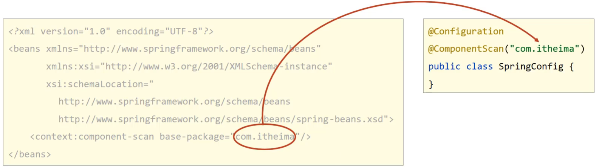

spring and annotation configuration

使用注解实现spring项目中IOC/DI的配置管理，及spring与Mybatis及Junit的整合开发

[toc]


# 注解实现Ioc

Spring的IOC/DI对应的配置开发就已经讲解完成，但是使用起来相对来说还是比较复杂的，复杂的地方在==配置文件==。

相比于配置开发，Spring可以利用注解简化代码的开发
* 2.0版开始支持注解
* 2.5版注解功能趋于完善
* 3.0版支持纯注解开发

## 注解开发定义bean


| 名称 | @Component/@Controller/@Service/@Repository |
| ---- | ------------------------------------------- |
| 类型 | 类注解                                      |
| 位置 | 类定义上方                                  |
| 作用 | 设置该类为spring管理的bean                  |
| 属性 | value（默认）：定义bean的id                 |

| 名称 | @Scope                                                       |
| ---- | ------------------------------------------------------------ |
| 类型 | 类注解                                                       |
| 位置 | 类定义上方                                                   |
| 作用 | 设置该类创建对象的作用范围<br/>可用于设置创建出的bean是否为单例对象 |
| 属性 | value（默认）：定义bean作用范围，<br/>==默认值singleton（单例），可选值prototype（非单例）== |


| 名称 | @PostConstruct         |
| ---- | ---------------------- |
| 类型 | 方法注解               |
| 位置 | 方法上                 |
| 作用 | 设置该方法为初始化方法 |
| 属性 | 无                     |


| 名称 | @PreDestroy          |
| ---- | -------------------- |
| 类型 | 方法注解             |
| 位置 | 方法上               |
| 作用 | 设置该方法为销毁方法 |
| 属性 | 无                   |


### 实现

1. 在需要被IOC容器管理的类上添加`@Component`注解

```java
@Component("bookDao")

//@Scope设置bean的作用范围
@Scope("prototype")
public class BookDaoImpl implements BookDao {
    public void save() {
        System.out.println("book dao save ..." );
    }

    // 生命周期钩子
    @PostConstruct //在构造方法之后执行，替换 init-method
    public void init() {
        System.out.println("init ...");
    }
    @PreDestroy //在销毁方法之前执行,替换 destroy-method
    public void destroy() {
        System.out.println("destroy ...");
    }

}
```

> [!NOTE]
> `@Component`注解不可以添加在接口上，因为接口无法创建对象


2. 配置Spring的注解包扫描

为了让Spring框架能够扫描到写在类上的注解，需要在配置文件上进行包扫描

```xml
<?xml version="1.0" encoding="UTF-8"?>
<beans xmlns="http://www.springframework.org/schema/beans"
       xmlns:xsi="http://www.w3.org/2001/XMLSchema-instance"
       xsi:schemaLocation="
            http://www.springframework.org/schema/beans http://www.springframework.org/schema/beans/spring-beans.xsd">
    <!-- base-package指定Spring框架扫描的包路径，它会扫描指定包及其子包中的所有类上的注解。 -->
    <context:component-scan base-package="com.itheima"/>
</beans>
```

> [!NOTE]
> component-scan: Spring将管理的bean视作自己的一个组件component


### 注意

1. 默认名称

@Component注解如果不起名称，会有一个默认值就是`当前类名首字母小写`，所以也可以按照名称获取


2. 衍生注解

对于@Component注解，还衍生出了其他三个注解
- `@Controller`: `表现层Bean`
- `@Service`: `业务层Bean`
- `@Repository`: `数据层Bean`

> [!NOTE]
> 这三个注解和@Component注解的作用是一样的，目的是方便我们后期在编写类的时候能很好的区分出这个类所属的层次


## 纯注解开发模式

之前已经实现了使用注解开发定义Bean，但是还是需要在XML配置文件中配置扫描包路径，这样还是不够纯粹
- Spring3.0开始支持纯注解开发模式
- 即不需要XML配置文件
- 直接使用Java类替代配置文件


| 名称 | @Configuration              |
| ---- | --------------------------- |
| 类型 | 类注解                      |
| 位置 | 类定义上方                  |
| 作用 | 设置该类为spring配置类      |
| 属性 | value（默认）：定义bean的id |


| 名称 | @ComponentScan                                           |
| ---- | -------------------------------------------------------- |
| 类型 | 类注解                                                   |
| 位置 | 类定义上方                                               |
| 作用 | 设置spring配置类扫描路径，用于加载使用注解格式定义的bean |
| 属性 | value（默认）：扫描路径，此路径可以逐层向下扫描          |


### 实现

1. 编写java配置类

```java
// 在类上添加`@Configuration`注解，将其标识为一个配置类，替换`applicationContext.xml`
@Configuration
// 添加包扫描注解`@ComponentScan`替换`<context:component-scan base-package=""/>`
// @ComponentScan注解用于设定扫描路径，此注解只能添加一次，多个数据请用数组格式
@ComponentScan("com.itheima")
public class SpringConfig {

}
```



2. 读取Java配置类初始化容器对象Ioc

```java
//加载配置文件初始化容器
// ApplicationContext ctx = new ClassPathXmlApplicationContext("applicationContext.xml");
//加载配置类初始化容器
ApplicationContext ctx = new AnnotationConfigApplicationContext(SpringConfig.class);
```

### 小结

这一节重点掌握的是使用注解完成Spring的bean管理，需要掌握的内容为:

* 记住@Component、@Controller、@Service、@Repository这四个注解
* applicationContext.xml中`<context:component-san/>`的作用是指定扫描包路径，注解为@ComponentScan
* @Configuration标识该类为配置类，使用类替换applicationContext.xml文件
* ClassPathXmlApplicationContext是加载XML配置文件
* AnnotationConfigApplicationContext是加载配置类


# 注解实现DI

Spring为了使用注解简化开发
- 并没有提供`构造函数注入`、`setter注入`对应的注解
- 只提供了自动装配的注解实现

| 名称 | @Autowired                                                   |
| ---- | ------------------------------------------------------------ |
| 类型 | 属性注解  或  方法注解（了解）  或  方法形参注解（了解）     |
| 位置 | 属性定义上方  或  标准set方法上方  或  类set方法上方  或  方法形参前面 |
| 作用 | 为引用类型属性设置值                                         |
| 属性 | required：true/false，定义该属性是否允许为null               |

| 名称 | @Qualifier                                           |
| ---- | ---------------------------------------------------- |
| 类型 | 属性注解  或  方法注解（了解）                       |
| 位置 | 属性定义上方  或  标准set方法上方  或  类set方法上方 |
| 作用 | 为引用类型属性指定注入的beanId                       |
| 属性 | value（默认）：设置注入的beanId                      |

| 名称 | @Value                                               |
| ---- | ---------------------------------------------------- |
| 类型 | 属性注解  或  方法注解（了解）                       |
| 位置 | 属性定义上方  或  标准set方法上方  或  类set方法上方 |
| 作用 | 为  基本数据类型  或  字符串类型  属性设置值         |
| 属性 | value（默认）：要注入的属性值                        |

| 名称 | @PropertySource                                              |
| ---- | ------------------------------------------------------------ |
| 类型 | 类注解                                                       |
| 位置 | 类定义上方                                                   |
| 作用 | 加载properties文件中的属性值                                 |
| 属性 | value（默认）：设置加载的properties文件对应的文件名或文件名组成的数组 |

## 引用类型注入


### 按类型注入


```java
@Service
public class BookServiceImpl implements BookService {
    // 添加`@Autowired`注解即可实现按类型注入
    @Autowired
    private BookDao bookDao;
    
    public void save() {
        System.out.println("book service save ...");
        bookDao.save();
    }
}
```

* @Autowired可以写在属性上，也可也写在setter方法上，最简单的处理方式是`写在属性上并将setter方法删除掉`
- @Autowired是按照类型注入
  - 如果对应BookDao接口有多个实现类同时被Ioc容器管理
  - 会再按照属性变量名和Bean的名称id是否匹配来进行注入
  - 若没有找到，则报错

> 为什么setter方法可以删除呢?
> * 自动装配基于反射设计创建对象并通过暴力反射为私有属性进行设值
> * 普通反射只能获取public修饰的内容
> * 暴力反射除了获取public修饰的内容还可以获取private修改的内容
> * 所以此处无需提供setter方法


### 按名称注入


```java
@Service
public class BookServiceImpl implements BookService {
    // @Qualifier不能独立使用，必须和@Autowired一起使用
    @Autowired
    // @Qualifier注解后的值就是需要注入的bean的名称
    @Qualifier("bookDao1")
    private BookDao bookDao;
}
```

## 简单数据类型注入

简单类型注入的是基本数据类型或者字符串类型


```java
@Repository("bookDao")
public class BookDaoImpl implements BookDao {
    // 使用`@Value`注解，将值写入注解的参数
    @Value("itheima")
    private String name;
    public void save() {
        System.out.println("book dao save ..." + name);
    }
}
```

### 注解读取properties配置文件

`@Value`一般会被用在从properties配置文件中读取内容进行使用，具体如何实现?

1. resource下准备properties文件

jdbc.properties

```properties
name=itheima888
```

2. 使用注解加载properties配置文件

在配置类上添加`@PropertySource`注解

```java
@Configuration
@ComponentScan("com.itheima")
@PropertySource("jdbc.properties")
public class SpringConfig {
}

```

3. 使用@Value读取配置文件中的内容

```java
@Repository("bookDao")
public class BookDaoImpl implements BookDao {
    @Value("${name}")
    private String name;
    public void save() {
        System.out.println("book dao save ..." + name);
    }
}
```

**注意:**

* 如果读取的properties配置文件有多个，可以使用`@PropertySource`的属性来指定多个

  ```java
  @PropertySource({"jdbc.properties","xxx.properties"})
  ```

* `@PropertySource`注解属性中不支持使用通配符`*`,运行会报错

  ```java
  @PropertySource({"*.properties"})
  ```

* `@PropertySource`注解属性中可以把`classpath:`加上,代表从当前项目的根路径找文件

  ```java
  @PropertySource({"classpath:jdbc.properties"})
  ```


# IOC/DI注解开发管理第三方bean


## Bean引入


| 名称 | @Bean                                  |
| ---- | -------------------------------------- |
| 类型 | 方法注解                               |
| 位置 | 方法定义上方                           |
| 作用 | 设置该方法的返回值作为spring管理的bean |
| 属性 | value（默认）：定义bean的id            |


1. 导入对应的jar包

```xml
<dependency>
    <groupId>com.alibaba</groupId>
    <artifactId>druid</artifactId>
    <version>1.1.16</version>
</dependency>
```

2. 在配置类中添加一个方法


```java
@Configuration
public class SpringConfig {

    // 注意该方法的返回值就是要创建的Bean对象类型
    public DataSource dataSource(){
        DruidDataSource ds = new DruidDataSource();
        ds.setDriverClassName("com.mysql.jdbc.Driver");
        ds.setUrl("jdbc:mysql://localhost:3306/spring_db");
        ds.setUsername("root");
        ds.setPassword("root");
        return ds;
    }
}
```

3. 在方法上添加`@Bean`注解


```java
@Configuration
public class SpringConfig {

  // @Bean注解的作用是将方法的返回值制作为Spring管理的一个bean对象
	@Bean
    public DataSource dataSource(){
        DruidDataSource ds = new DruidDataSource();
        ds.setDriverClassName("com.mysql.jdbc.Driver");
        ds.setUrl("jdbc:mysql://localhost:3306/spring_db");
        ds.setUsername("root");
        ds.setPassword("root");
        return ds;
    }
}
```


4. 从IOC容器中获取对象并使用

```java
public class App {
    public static void main(String[] args) {
        AnnotationConfigApplicationContext ctx = new AnnotationConfigApplicationContext(SpringConfig.class);
        DataSource dataSource = ctx.getBean(DataSource.class);
        System.out.println(dataSource);
    }
}
```


## 多个配置类

如果把所有的第三方bean都配置到Spring的配置类`SpringConfig`中，虽然可以，但是不利于代码阅读和分类管理，所有我们就想能不能按照类别将这些bean配置到不同的配置类中?

对于数据源的bean,我们新建一个`JdbcConfig`配置类，并把数据源配置到该类下。

```java
public class JdbcConfig {
	@Bean
    public DataSource dataSource(){
        DruidDataSource ds = new DruidDataSource();
        ds.setDriverClassName("com.mysql.jdbc.Driver");
        ds.setUrl("jdbc:mysql://localhost:3306/spring_db");
        ds.setUsername("root");
        ds.setPassword("root");
        return ds;
    }
}
```

现在的问题是，这个配置类如何能被Spring配置类加载到，并创建DataSource对象在IOC容器中?

针对这个问题，有两个解决方案:

### 使用包扫描引入

1. 在Spring的配置类上添加包扫描

```java
@Configuration
@ComponentScan("com.itheima.config")
public class SpringConfig {
	
}
```

2. 在JdbcConfig上添加配置注解

JdbcConfig类要放入到`com.itheima.config`包下，需要被Spring的配置类扫描到即可

```java
@Configuration
public class JdbcConfig {
	@Bean
    public DataSource dataSource(){
        DruidDataSource ds = new DruidDataSource();
        ds.setDriverClassName("com.mysql.jdbc.Driver");
        ds.setUrl("jdbc:mysql://localhost:3306/spring_db");
        ds.setUsername("root");
        ds.setPassword("root");
        return ds;
    }
}
```


这种方式虽然能够扫描到，但是不能很快的知晓都引入了哪些配置类，所有这种方式不推荐使用。

### 使用`@Import`引入


| 名称 | @Import                                                      |
| ---- | ------------------------------------------------------------ |
| 类型 | 类注解                                                       |
| 位置 | 类定义上方                                                   |
| 作用 | 导入配置类                                                   |
| 属性 | value（默认）：定义导入的配置类类名，<br/>当配置类有多个时使用数组格式一次性导入多个配置类 |


这种方案可以不用加`@Configuration`注解，但是必须在Spring配置类上使用`@Import`注解手动引入需要加载的配置类

1. 去除JdbcConfig类上的注解

```java
public class JdbcConfig {
	@Bean
    public DataSource dataSource(){
        DruidDataSource ds = new DruidDataSource();
        ds.setDriverClassName("com.mysql.jdbc.Driver");
        ds.setUrl("jdbc:mysql://localhost:3306/spring_db");
        ds.setUsername("root");
        ds.setPassword("root");
        return ds;
    }
}
```

2. 在Spring配置类中引入

```java
@Configuration
//@ComponentScan("com.itheima.config")
@Import({JdbcConfig.class})
public class SpringConfig {
	
}
```

> [!NOTE]
> @Import注解在配置类中只能写一次，@Import参数需要的是一个数组，可以引入多个配置类


## 为第三方bean注入资源


### 简单数据类型


1. 类中提供四个属性

```java
public class JdbcConfig {
    private String driver;
    private String url;
    private String userName;
    private String password;

    @Bean
    public DataSource dataSource(){
        DruidDataSource ds = new DruidDataSource();
        ds.setDriverClassName("com.mysql.jdbc.Driver");
        ds.setUrl("jdbc:mysql://localhost:3306/spring_db");
        ds.setUsername("root");
        ds.setPassword("root");
        return ds;
    }
}
```

2. 使用`@Value`注解引入值

```java
public class JdbcConfig {
    @Value("com.mysql.jdbc.Driver")
    private String driver;
    @Value("jdbc:mysql://localhost:3306/spring_db")
    private String url;
    @Value("root")
    private String userName;
    @Value("password")
    private String password;

    @Bean
    public DataSource dataSource(){
        DruidDataSource ds = new DruidDataSource();
        ds.setDriverClassName(driver);
        ds.setUrl(url);
        ds.setUsername(userName);
        ds.setPassword(password);
        return ds;
    }
}
```

#### 从`properties`文件中读取数据

1. resources目录下添加jdbc.properties
2. 配置文件中提供四个键值对分别是数据库的四要素
3. 使用@PropertySource加载jdbc.properties配置文件
4. 修改@Value注解属性的值，将其修改为`${key}`，key就是键值对中的键的值


### 引用数据类型


1. 在SpringConfig中扫描BookDao

扫描的目的是让Spring能管理到BookDao,也就是说要让IOC容器中有一个bookDao对象

```java
@Configuration
@ComponentScan("com.itheima.dao")
@Import({JdbcConfig.class})
public class SpringConfig {
}
```

2. 在JdbcConfig类的方法上添加参数

```java
@Bean
public DataSource dataSource(BookDao bookDao){
    System.out.println(bookDao);
    DruidDataSource ds = new DruidDataSource();
    ds.setDriverClassName(driver);
    ds.setUrl(url);
    ds.setUsername(userName);
    ds.setPassword(password);
    return ds;
}
```

> [!NOTE]
> 引用类型注入只需要为bean定义方法设置形参即可，容器会根据**类型**自动装配对象


# 注解开发总结

前面我们已经完成了XML配置和注解的开发实现，至于两者之间的差异，咱们放在一块去对比回顾下:


