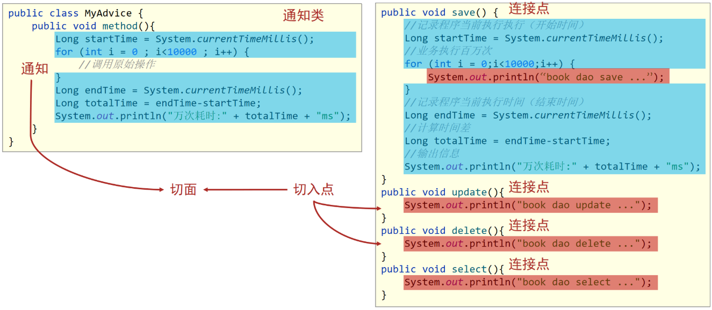
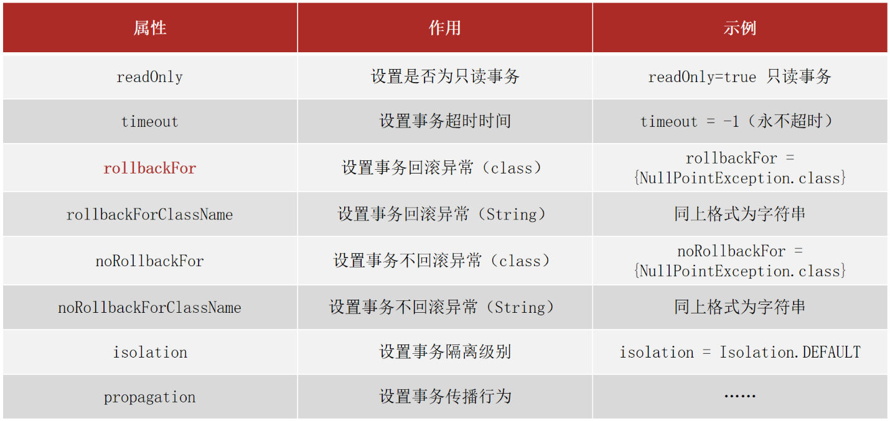

spring and AOP

理解并掌握AOP相关概念和工作牌流程，重点掌握Spring的声明式事务管理

# AOP简介


AOP(Aspect Oriented Programming)面向切面编程
- AOP是在**不改**原有代码的前提下对其进行**增强**，属于无入侵式
- 一种编程**思想**，指导开发者如何编写程序
- java底层使用**代理模式**实现

## 概念




* 连接点(JoinPoint)：程序执行过程中的任意位置，粒度为执行方法、抛出异常、设置变量等
  * 在SpringAOP中，理解为方法的执行
* 切入点(Pointcut):匹配连接点的式子
  * 在SpringAOP中，一个切入点可以描述一个具体方法，也可也匹配多个方法
    * 一个具体的方法:如com.itheima.dao包下的BookDao接口中的无形参无返回值的save方法
    * 匹配多个方法:所有的save方法，所有的get开头的方法，所有以Dao结尾的接口中的任意方法，所有带有一个参数的方法
  * 连接点范围要比切入点范围大，是切入点的方法也一定是连接点，但是是连接点的方法就不一定要被增强，所以可能不是切入点。
* 通知(Advice):在切入点处执行的操作，也就是共性功能
  * 在SpringAOP中，功能最终以方法的形式呈现
* 通知类：定义通知的类
* 切面(Aspect):描述通知与切入点的对应关系。


| 名称 | @EnableAspectJAutoProxy |
| ---- | ----------------------- |
| 类型 | 配置类注解              |
| 位置 | 配置类定义上方          |
| 作用 | 开启注解格式AOP功能     |


| 名称 | @Aspect               |
| ---- | --------------------- |
| 类型 | 类注解                |
| 位置 | 切面类定义上方        |
| 作用 | 设置当前类为AOP切面类 |


| 名称 | @Pointcut                   |
| ---- | --------------------------- |
| 类型 | 方法注解                    |
| 位置 | 切入点方法定义上方          |
| 作用 | 设置切入点方法              |
| 属性 | value（默认）：切入点表达式 |


| 名称 | @Before                                                      |
| ---- | ------------------------------------------------------------ |
| 类型 | 方法注解                                                     |
| 位置 | 通知方法定义上方                                             |
| 作用 | 设置当前通知方法与切入点之间的绑定关系，当前通知方法在原始切入点方法前运行 |


## AOP入门案例


需求:使用SpringAOP的注解方式完成在方法执行的前打印出当前系统时间


1. 导入坐标(pom.xml)

```xml
<!-- pom.xml -->
<dependency>
    <groupId>org.aspectj</groupId>
    <artifactId>aspectjweaver</artifactId>
    <version>1.9.4</version>
</dependency>
```

> [!NOTE]
> AspectJ是AOP思想的一个具体实现，Spring有自己的AOP实现，但是相比于AspectJ来说比较麻烦，所以我们直接采用Spring整合ApsectJ的方式进行AOP开发

2. 制作连接点(原始操作，Dao接口与实现类)

即正常编写接口，类和方法


3. 定义和配置通知类


```java
// 将该类交给容器管理
@Component
// 说明该类为通知类（切面类）
@Aspect
public class MyAdvice {
    // 定义切入点，接收指定类下的指定方法
    @Pointcut("execution(void com.itheima.dao.BookDao.update())")
    // 切入点定义依托一个不具有实际意义的方法进行
    private void pt(){}
    

    // 切面是用来描述通知和切入点之间的关系 
    @Before("pt()")
    public void method(){
        // 通知就是将共性功能抽取出来后形成的方法，共性功能指的就是当前系统时间的打印。
        System.out.println(System.currentTimeMillis());
    }
}
```

4. 开启注解格式AOP功能

```java
// SpringConfig.java
@Configuration
@ComponentScan("com.itheima")
// 开启注解格式AOP
@EnableAspectJAutoProxy
public class SpringConfig {
}
```


# AOP工作流程

由于AOP是基于Spring容器管理的bean做的增强，所以整个工作过程需要从Spring加载bean说起:

1. Spring容器启动

容器启动就需要去加载bean
* 需要被增强的类，如:BookServiceImpl
* 通知类，如:MyAdvice

> [!NOTE]
> 注意此时bean对象还没有创建成功

2. 读取所有**切面**配置中的切入点


下面这个例子中有两个切入点的配置，但是第一个`ptx()`并没有被使用，所以不会被读取。


3. 初始化bean，判定bean对应的类中的方法是否匹配到任意切入点

将被实例化bean对象的类中的方法和切入点进行匹配
* 匹配失败，创建并存入容器的是原始对象,如`UserDao`
* 匹配成功，创建并存入容器的是原始对象的**代理**对象,如:`BookDao`


4. 获取bean执行方法

* 获取的bean是原始对象时，调用方法并执行，完成操作
* 获取的bean是代理对象时，根据代理对象的运行模式运行原始方法与增强的内容，完成操作


## AOP核心概念

在上面介绍AOP的工作流程中，我们提到了两个核心概念
* 目标对象(Target)：原始功能去掉共性功能对应的类产生的对象，这种对象是无法直接完成最终工作的
* 代理(Proxy)：目标对象无法直接完成工作，需要对其进行功能回填（增强），通过原始对象的代理对象实现


# AOP配置

## AOP切入点表达式

* 切入点:要进行增强的方法
* 切入点表达式:要增强的方法的描述方式（用于后续匹配）

1. 语法格式


```java

// 动作关键字(访问修饰符  返回值  包名.类/接口名.方法名(参数) 异常名）
execution(public User com.itheima.service.UserService.findById(int))
```

* execution：动作关键字，描述切入点的行为动作，例如execution表示执行到指定切入点
* public:访问修饰符,还可以是public，private等，可以省略
* User：返回值，写返回值类型
* com.itheima.service：包名，多级包使用点连接
* UserService:类/接口名称
* findById：方法名
* int:参数，直接写参数的类型，多个类型用逗号隔开
* 异常名：方法定义中抛出指定异常，可以省略

> [!NOTE]
> 因为调用接口方法的时候最终运行的还是其实现类的方法，所以类/接口描述方式都是可以的

2. 通配符

使用通配符描述切入点，主要的目的就是简化之前表达式的配置

* `*`:单个独立的任意符号，可以独立出现，也可以作为前缀或者后缀的匹配符出现

```java
// 匹配com.itheima包下的任意包中的UserService类或接口中所有find开头的带有一个参数的方法
execution（public * com.itheima.*.UserService.find*(*))
```

* `..`：多个连续的任意符号，可以独立出现，常用于简化包名与参数的书写

```java
// 匹配com包下的任意包中的UserService类或接口中所有名称为findById的方法
execution（public User com..UserService.findById(..))
```

* `+`：专用于匹配子类类型

```java
// *Service+，表示所有以Service结尾的接口的子类
execution(* *..*Service+.*(..))
```


3. 书写技巧

- 描述切入点通**==常描述接口==**，而不描述实现类,如果描述到实现类，就出现紧耦合了
- 访问控制修饰符针对接口开发默认采用public描述（可省略）
- 返回值类型对于增删改类使用精准类型加速匹配，对于查询类使用`*`通配快速描述
- **包名*书写尽量不使用`..`匹配，效率过低
- 接口名/类名书写名称与模块相关的采用`*`匹配，例如UserService书写成`*Service`，绑定业务层接口名
- 方法名书写以动词进行精准匹配，名词采用`*`匹配
- 通常**不使用异常**

## AOP通知类型


- 前置通知：追加功能到方法执行前
- 后置通知：追加功能到方法执行后，不管方法执行的过程中有没有抛出异常都会执行
- **环绕通知(重点)**：追加功能到方法执行的前后，可以实现其他四种通知类型的功能
- 返回后通知(了解)：追加功能到方法执行后，只有方法正常执行结束后才进行，如果方法执行抛出异常，返回后通知将不会被添加
- 抛出异常后通知(了解)：追加功能到方法抛出异常后，只有方法执行出异常才进行，有方法抛出异常后才会被添加


| 名称 | @After                                                       |
| ---- | ------------------------------------------------------------ |
| 类型 | 方法注解                                                     |
| 位置 | 通知方法定义上方                                             |
| 作用 | 设置当前通知方法与切入点之间的绑定关系，当前通知方法在原始切入点方法后运行 |


| 名称 | @AfterReturning                                              |
| ---- | ------------------------------------------------------------ |
| 类型 | 方法注解                                                     |
| 位置 | 通知方法定义上方                                             |
| 作用 | 设置当前通知方法与切入点之间绑定关系，当前通知方法在原始切入点方法正常执行完毕后执行 |


| 名称 | @AfterThrowing                                               |
| ---- | ------------------------------------------------------------ |
| 类型 | 方法注解                                                     |
| 位置 | 通知方法定义上方                                             |
| 作用 | 设置当前通知方法与切入点之间绑定关系，当前通知方法在原始切入点方法运行抛出异常后执行 |


| 名称 | @Around                                                      |
| ---- | ------------------------------------------------------------ |
| 类型 | 方法注解                                                     |
| 位置 | 通知方法定义上方                                             |
| 作用 | 设置当前通知方法与切入点之间的绑定关系，当前通知方法在原始切入点方法前后运行 |

```java
@Component
@Aspect
public class MyAdvice {
    @Pointcut("execution(void com.itheima.dao.BookDao.update())")
    private void pt(){}
    

    // 前置通知，在before方法上添加`@Before注解`
    @Before("pt()")
    public void before() {
        System.out.println("before advice ...");
    }
    // 后置通知，添加`@After注解`
    @After("pt()")
    public void after() {
        System.out.println("after advice ...");
    }

    // 环绕通知，添加`@Around注解`
    // 环绕通知需要在原始方法的前后进行增强，所以环绕通知就必须要能对原始操作进行调用
    @Around("pt()")
    public void around(ProceedingJoinPoint pjp) throws Throwable{
        System.out.println("around before advice ...");
        //表示对原始操作的调用
        pjp.proceed();
        System.out.println("around after advice ...");
    }

    // 返回后通知，添加`@AfterReturning注解`
    @AfterReturning("pt()")
    public void afterReturning() {
        System.out.println("afterReturning advice ...");
    }

    // 异常后通知，添加`@AfterThrowing注解`
    @AfterThrowing("pt2()")
    public void afterThrowing() {
        System.out.println("afterThrowing advice ...");
    }
}
```


### 环绕通知

所以如果我们使用环绕通知的话，要根据原始方法的返回值来设置环绕通知的返回值
- 返回的是Object而不是int的主要原因是Object类型更通用
- 在环绕通知中是可以对原始方法返回值就行修改的

```java
@Component
@Aspect
public class MyAdvice {
    @Pointcut("execution(int com.itheima.dao.BookDao.select())")
    private void pt2(){}
    
    @Around("pt2()")
    // 必须依赖形参ProceedingJoinPoint才能实现对原始方法的调用
    // 由于无法预知原始方法运行后是否会抛出异常，因此环绕通知方法必须要处理Throwable异常
    public Object aroundSelect(ProceedingJoinPoint pjp) throws Throwable {
        System.out.println("around before advice ...");
        //表示对原始操作的调用
        Object ret = pjp.proceed();
        System.out.println("around after advice ...");
        return ret;
    }
}
```


# 实现步骤

1. 开启SpringAOP的注解功能

```java
// SpringConfig.java
@EnableAspectJAutoProxy
```

2. 创建AOP的通知类


```java
// 表示该类要被Spring管理
@Component
// 标识该类是一个AOP的切面类
@Aspect
public class ProjectAdvice {
    // 配置切入点表达式，需要添加一个方法
    // 配置业务层的所有方法
    @Pointcut("execution(* com.itheima.service.*Service.*(..))")
    private void servicePt(){}
    
    public void runSpeed(){
        
    } 
}
```

3. 添加环绕通知

在runSpeed()方法上添加@Around

```java
@Component
@Aspect
public class ProjectAdvice {
    @Pointcut("execution(* com.itheima.service.*Service.*(..))")
    private void servicePt(){}
    // 添加环绕通知
    @Around("servicePt()")
    public Object runSpeed(ProceedingJoinPoint pjp){

        ...
        //获取执行签名信息
        Signature signature = pjp.getSignature();
        //通过签名获取执行操作名称(接口名)
        String className = signature.getDeclaringTypeName();
        //通过签名获取执行操作名称(方法名)
        String methodName = signature.getName();
        // 接收返回值
        Object ret = pjp.proceed();
        ...

        return ret;
    } 
}
```


# AOP通知获取数据

目前我们写AOP仅仅是在原始方法前后追加一些操作，接下来我们要说说AOP中数据相关的内容
- `获取参数`：所有的通知类型都可以获取参数
  * JoinPoint：适用于前置、后置、返回后、抛出异常后通知
  * ProceedingJoinPoint：适用于环绕通知
- `获取返回值`
- `获取异常`


* 获取切入点方法返回值，前置和抛出异常后通知是没有返回值，后置通知可有可无，所以不做研究
  * 返回后通知
  * 环绕通知
* 获取切入点方法运行异常信息，前置和返回后通知是不会有，后置通知可有可无，所以不做研究
  * 抛出异常后通知
  * 环绕通知

## 获取参数

1. 非环绕通知获取方式

在方法上添加JoinPoint,通过JoinPoint来获取参数

```java
@Component
@Aspect
public class MyAdvice {
    @Pointcut("execution(* com.itheima.dao.BookDao.findName(..))")
    private void pt(){}

    @Before("pt()")
    public void before(JoinPoint jp) 
        Object[] args = jp.getArgs();
        System.out.println(Arrays.toString(args));
        System.out.println("before advice ..." );
    }
}
```

> [!NOTE]
> 参数的个数是不固定的，所以使用数组更通配些。


2. 环绕通知获取方式

环绕通知使用的是ProceedingJoinPoint，因为ProceedingJoinPoint是JoinPoint类的子类，所以对于ProceedingJoinPoint类中应该也会有对应的`getArgs()`方法，我们去验证下:

```java
@Component
@Aspect
public class MyAdvice {
    @Pointcut("execution(* com.itheima.dao.BookDao.findName(..))")
    private void pt(){}

    @Around("pt()")
    public Object around(ProceedingJoinPoint pjp)throws Throwable {
        Object[] args = pjp.getArgs();
        System.out.println(Arrays.toString(args));
        Object ret = pjp.proceed();
        return ret;
    }
}
```


**注意:**

* pjp.proceed()方法是有两个构造方法，分别是:
  * 调用无参数的proceed，当原始方法有参数，会在调用的过程中自动传入参数
  * 但是当需要修改原始方法的参数时，就只能采用带有参数的方法
    ```java
    @Component
    @Aspect
    public class MyAdvice {
        @Pointcut("execution(* com.itheima.dao.BookDao.findName(..))")
        private void pt(){}
    
        @Around("pt()")
        public Object around(ProceedingJoinPoint pjp) throws Throwable{
            Object[] args = pjp.getArgs();
            System.out.println(Arrays.toString(args));
            args[0] = 666;
            Object ret = pjp.proceed(args);
            return ret;
        }
    }
    ```

> [!NOTE]
> 可以利用这个特性后在环绕通知中对原始方法的参数进行拦截过滤

## 获取返回值

对于返回值，只有返回后`AfterReturing`和环绕`Around`这两个通知类型可以获取

1. 环绕通知获取返回值

```java
@Component
@Aspect
public class MyAdvice {
    @Pointcut("execution(* com.itheima.dao.BookDao.findName(..))")
    private void pt(){}

    @Around("pt()")
    public Object around(ProceedingJoinPoint pjp) throws Throwable{
        Object[] args = pjp.getArgs();
        System.out.println(Arrays.toString(args));
        args[0] = 666;
        Object ret = pjp.proceed(args);
        return ret;
    }
}
```

> [!NOTE]
> 返回值不但可以获取，如果需要还可以进行修改。

2. 返回后通知获取返回值

```java
@Component
@Aspect
public class MyAdvice {
    @Pointcut("execution(* com.itheima.dao.BookDao.findName(..))")
    private void pt(){}

    @AfterReturning(value = "pt()",returning = "ret")
    public void afterReturning(Object ret) {
        System.out.println("afterReturning advice ..."+ret);
    }
}
```

> [!NOTE]
> 如果有JoinPoint参数，则其必须放在第一位


## 获取异常

对于获取抛出的异常，只有抛出异常后`AfterThrowing`和环绕`Around`这两个通知类型可以获取

1. 环绕通知获取异常

只需要将异常捕获，就可以获取到原始方法的异常信息

```java
@Component
@Aspect
public class MyAdvice {
    @Pointcut("execution(* com.itheima.dao.BookDao.findName(..))")
    private void pt(){}

    @Around("pt()")
    public Object around(ProceedingJoinPoint pjp){
        Object[] args = pjp.getArgs();
        System.out.println(Arrays.toString(args));
        args[0] = 666;
        Object ret = null;
        try{
            ret = pjp.proceed(args);
        }catch(Throwable throwable){
            t.printStackTrace();
        }
        return ret;
    }
}
```


2. 抛出异常后通知获取异常

```java
@Component
@Aspect
public class MyAdvice {
    @Pointcut("execution(* com.itheima.dao.BookDao.findName(..))")
    private void pt(){}

    @AfterThrowing(value = "pt()",throwing = "t")
    public void afterThrowing(Throwable t) {
        System.out.println("afterThrowing advice ..."+t);
    }
}
```

# AOP总结

1. AOP的核心概念

* 概念：AOP(Aspect Oriented Programming)面向切面编程，一种编程范式
* 作用：在不惊动原始设计的基础上为方法进行功能==增强==
* 核心概念
  * 代理（Proxy）：SpringAOP的核心本质是采用代理模式实现的
  * 连接点（JoinPoint）：在SpringAOP中，理解为任意方法
  * 切入点（Pointcut）：匹配连接点的式子，也是具有共性功能的方法描述
  * 通知（Advice）：若干个方法的共性功能，在切入点处执行，最终体现为一个方法
  * 切面（Aspect）：描述通知与切入点的对应关系
  * 目标对象（Target）：被代理的原始对象成为目标对象

2. 切入点表达式

* 切入点表达式标准格式：`动作关键字(访问修饰符  返回值  包名.类/接口名.方法名（参数）异常名)`
* 切入点表达式描述通配符：
  * 作用：用于快速描述，范围描述
  * `*`：匹配任意符号（常用）
  * `..` ：匹配多个连续的任意符号（常用）
  * `+`：匹配子类类型

* 切入点表达式书写技巧
  1.按==标准规范==开发
  2.查询操作的返回值建议使用\*匹配
  3.减少使用..的形式描述包
  4.==对接口进行描述==，使用\*表示模块名，例如UserService的匹配描述为*Service
  5.方法名书写保留动词，例如get，使用\*表示名词，例如getById匹配描述为getBy\*
  6.参数根据实际情况灵活调整

3. 五种通知类型

- 前置通知
- 后置通知
- 环绕通知（重点）
  - 环绕通知依赖形参ProceedingJoinPoint才能实现对原始方法的调用
  - 环绕通知可以隔离原始方法的调用执行
  - 环绕通知返回值设置为Object类型
  - 环绕通知中可以对原始方法调用过程中出现的异常进行处理
- 返回后通知
- 抛出异常后通知

4. 通知中获取参数

- 获取切入点方法的参数，所有的通知类型都可以获取参数
  - JoinPoint：适用于前置、后置、返回后、抛出异常后通知
  - ProceedingJoinPoint：适用于环绕通知
- 获取切入点方法返回值，前置和抛出异常后通知是没有返回值，后置通知可有可无，所以不做研究
  - 返回后通知
  - 环绕通知
- 获取切入点方法运行异常信息，前置和返回后通知是不会有，后置通知可有可无，所以不做研究
  - 抛出异常后通知
  - 环绕通知

# AOP事务管理

## Spring事务简介

- 事务作用：在数据层保障一系列的数据库**操作同成功同失败**
- Spring事务作用：在数据层或**业务层**保障一系列的数据库操作同成功同失败

1. java相关接口和类

Spring为了管理事务，提供了一个平台事务管理器`PlatformTransactionManager`


- commit是用来提交事务
- rollback是用来回滚事务。

PlatformTransactionManager只是一个接口，Spring还为其提供了一个具体的实现:


- 从名称上可以看出，我们只需要给它一个DataSource对象，它就可以帮你去在业务层管理事务
- 其内部采用的是JDBC的事务，如果采用的是JDBC相关的技术，就可以采用这个事务管理器来管理你的事务
  - 而Mybatis内部采用的就是JDBC的事务


2. 相关注解

| 名称 | @EnableTransactionManagement           |
| ---- | -------------------------------------- |
| 类型 | 配置类注解                             |
| 位置 | 配置类定义上方                         |
| 作用 | 设置当前Spring环境中开启注解式事务支持 |


| 名称 | @Transactional                                               |
| ---- | ------------------------------------------------------------ |
| 类型 | 接口注解  类注解  方法注解                                   |
| 位置 | 业务层接口上方  业务层实现类上方  业务方法上方               |
| 作用 | 为当前业务层方法添加事务（如果设置在类或接口上方则类或接口中所有方法均添加事务） |


## 事务管理


1. 在需要被事务管理的方法上添加注解

```java
public interface AccountService {
    /**
     * 转账操作
     * @param out 传出方
     * @param in 转入方
     * @param money 金额
     */
    //配置当前接口方法具有事务
    public void transfer(String out,String in ,Double money) ;
}

@Service
public class AccountServiceImpl implements AccountService {

    @Autowired
    private AccountDao accountDao;
    // 表示当前方法要被事务管理
    @Transactional
    public void transfer(String out,String in ,Double money) {
        accountDao.outMoney(out,money);
        int i = 1/0;
        accountDao.inMoney(in,money);
    }

}
```

> [!NOTE]
> `@Transactional`可以写在接口类上、接口方法上、实现类上和实现类方法上，建议写在实现类或实现类的方法上

2. 在JdbcConfig配置类中配置事务管理器

```java
public class JdbcConfig {
    @Value("${jdbc.driver}")
    private String driver;
    @Value("${jdbc.url}")
    private String url;
    @Value("${jdbc.username}")
    private String userName;
    @Value("${jdbc.password}")
    private String password;

    @Bean
    public DataSource dataSource(){
        DruidDataSource ds = new DruidDataSource();
        ds.setDriverClassName(driver);
        ds.setUrl(url);
        ds.setUsername(userName);
        ds.setPassword(password);
        return ds;
    }

    //配置事务管理器，mybatis使用的是jdbc事务
    @Bean
    public PlatformTransactionManager transactionManager(DataSource dataSource){
        DataSourceTransactionManager transactionManager = new DataSourceTransactionManager();
        transactionManager.setDataSource(dataSource);
        return transactionManager;
    }
}
```


3. 开启事务注解

在SpringConfig的配置类中开启

```java
@Configuration
@ComponentScan("com.itheima")
@PropertySource("classpath:jdbc.properties")
@Import({JdbcConfig.class,MybatisConfig.class
//开启注解式事务驱动
@EnableTransactionManagement
public class SpringConfig {
}

```

## Spring事务角色

- 事务管理员：发起事务方，在Spring中通常指代业务层开启事务的方法
- 事务协调员：加入事务方，在Spring中通常指代数据层方法，也可以是业务层方法

1. 未开启Spring事务之前

* AccountDao的outMoney因为是修改操作，会开启一个事务T1
* AccountDao的inMoney因为是修改操作，会开启一个事务T2
* AccountService的transfer没有事务，
  * 运行过程中如果没有抛出异常，则T1和T2都正常提交，数据正确
  * 如果在两个方法中间抛出异常，T1因为执行成功提交事务，T2因为抛异常不会被执行
  * 就会导致数据出现错误


2. 开启Spring的事务管理后

* transfer上添加了@Transactional注解，在该方法上就会有一个事务T
* AccountDao的outMoney方法的事务T1加入到transfer的事务T中
* AccountDao的inMoney方法的事务T2加入到transfer的事务T中
* 这样就保证他们在同一个事务中，当业务层中出现异常，整个事务就会回滚，保证数据的准确性。


## Spring事务属性配置




上面这些属性都可以在`@Transactional`注解的参数上进行设置。

* readOnly：true只读事务，false读写事务
* timeout：设置超时时间(单位秒)，在多长时间之内事务没有提交成功就自动回滚
* rollbackFor:当出现指定异常进行事务回滚
  * rollbackForClassName等同于rollbackFor,只不过属性为异常的类全名字符串
* noRollbackFor:当出现指定异常不进行事务回滚
  * noRollbackForClassName等同于noRollbackFor，只不过属性为异常的类全名字符串
* isolation设置事务的隔离级别
  * DEFAULT :默认隔离级别, 会采用数据库的隔离级别
  * READ_UNCOMMITTED : 读未提交
  * READ_COMMITTED : 读已提交
  * REPEATABLE_READ : 重复读取
  * SERIALIZABLE: 串行化

> [!NOTE]
> Spring的事务只会对`Error异常`和`RuntimeException异常`及其子类进行事务回滚


- 事务传播行为
  - 事务协调员对事务管理员所携带事务的处理态度
  - 定义在子事务上，根据父事务的传播行为来决定子事务的行为
  

